# Markdown Viewer Extension 技术规格说明书

> 版本: 1.4.1 | 最后更新: 2026-01-04

---

## 第一章 项目概述

### 1.1 产品定位

#### 1.1.1 核心价值主张

**Markdown to perfect Word in one click** — 这是本项目的核心价值主张。

在当今的技术文档编写领域，Markdown 已成为事实上的标准格式。它以简洁的纯文本语法，让作者能够专注于内容本身，而非复杂的格式设置。然而，当这些文档需要交付给非技术人员、提交给学术期刊、或纳入正式的企业文档体系时，Word 格式（.docx）仍然是不可或缺的交付形式。

**传统工作流的痛点**

传统工作流中，用户从 Markdown 生成 Word 文档需要经历繁琐的手动操作：

- **流程图处理**：需要在 draw.io、Visio 等工具中绘制，导出为 PNG/SVG，再手动插入 Word，位置和大小还需反复调整
- **数学公式输入**：使用 Word 公式编辑器逐个输入，或购买 MathType 等付费工具，一个复杂公式可能需要数分钟
- **代码格式化**：手动设置等宽字体、调整颜色，每个关键字都需要单独处理
- **表格样式**：逐个单元格调整边框、背景色、对齐方式，表头样式需要手动统一

**一份文档：写作 1 小时，格式调整 2 小时。** 这是许多技术作者的真实写照。

**本项目的解决方案**

本扩展将这个繁琐的过程简化为一键操作。通过集成 Mermaid、Graphviz、Vega 等主流图表库，以及 KaTeX/MathJax 数学渲染引擎，用户只需在 Markdown 中编写标准语法，即可获得专业排版的 Word 文档——图表自动转换为高清图片，公式转换为 **原生可编辑的 Word 公式**（而非图片），代码保留完整的语法高亮。

更重要的是，整个处理过程完全在本地完成，无需上传任何内容到服务器，确保了文档内容的私密性和安全性。

#### 1.1.2 目标用户群体

本扩展面向所有需要从 Markdown 生成高质量文档的用户。以下是核心用户群体及其典型使用场景：

**技术文档作者**

软件架构师、技术主管、API 设计师等，他们日常需要编写大量的技术规格文档、架构设计文档、API 说明文档。这类文档的特点是包含大量的流程图、时序图、类图等 UML 图表。传统方式下，一份包含 15 个流程图的文档，光是图表处理就需要 2 小时以上；使用本扩展，同样的工作可以在 5 分钟内完成。

**学术研究者**

教授、研究生、论文作者等，他们的文档中充斥着复杂的数学公式——从简单的行内公式到多行矩阵推导。本扩展将 LaTeX 公式转换为 Word 原生公式格式，意味着导出后的公式仍然可以在 Word 中编辑，这对于需要与导师协作修改论文的研究生尤为重要。一份包含 50+ 公式的论文，传统方式需要 3 小时的公式输入时间，现在只需 10 分钟。

**商业分析师**

数据分析师、市场研究员、咨询顾问等，他们需要在报告中展示数据图表——柱状图、折线图、散点图、热力图等。通过 Vega/Vega-Lite 语法，他们可以在 Markdown 中直接定义数据可视化，导出时自动转换为高清图片，无需在 Excel 和 Word 之间反复切换。

**技术博主**

技术写作者、教程作者等，他们需要同时维护博客版本和可分发的 PDF/Word 版本。本扩展提供的本地预览功能让他们可以在浏览器中实时查看渲染效果，一键导出功能则简化了多格式发布流程。

**开发团队**

产品经理、项目经理、开发工程师等，需要编写需求文档、设计文档、会议纪要等团队协作文档。统一的主题系统确保整个团队输出的文档风格一致，提升企业形象。

```infographic
infographic list-sector-plain-text
data
  title 目标用户群体
  desc 核心用户及其典型场景
  items
    - label 技术文档作者
      desc 架构设计、API 文档
    - label 学术研究者
      desc 论文、数学公式
    - label 商业分析师
      desc 报告、数据图表
    - label 技术博主
      desc 教程、技术文章
    - label 开发团队
      desc 需求文档、设计文档
```

| 用户群体 | 典型场景 | 痛点解决 |
|---------|---------|---------|
| **技术文档作者** | 架构设计、API 文档、技术规格 | 15 个流程图从 2 小时→5 分钟 |
| **学术研究者** | 论文、研究报告、教学材料 | 50+ 公式从 3 小时→10 分钟 |
| **商业分析师** | 周报、数据报告、市场分析 | 数据图表自动转换为高清图片 |
| **技术博主** | 技术博客、教程文章 | 本地预览+导出一体化 |
| **开发团队** | 需求文档、设计文档、会议纪要 | 团队协作统一格式 |

### 1.2 功能特性

本扩展提供了一套完整的 Markdown 增强渲染能力，涵盖图表、公式、代码高亮、主题定制等多个维度。所有功能均基于插件化架构实现，详见 `src/plugins/` 目录。

#### 1.2.1 图表支持

图表是技术文档的核心组成部分。本扩展支持四种主流图表语言，覆盖从流程图到数据可视化的完整场景：

**Mermaid** — 最流行的文本图表语言，支持流程图、时序图、类图、状态图、甘特图、ER 图等多种图表类型。其语法简洁直观，适合快速绘制软件设计图。项目中通过 `src/plugins/mermaid-plugin.ts` 实现渲染，使用 mermaid v11.12.1。

**Graphviz (DOT)** — 经典的图形描述语言，特别适合绘制有向图、无向图、网络拓扑图、状态机等。其布局算法成熟稳定，能自动计算最优的节点位置。项目通过 `src/plugins/dot-plugin.ts` 集成 @viz-js/viz 实现 WASM 渲染。

**Vega/Vega-Lite** — 声明式数据可视化语法，基于图形语法理论设计。Vega-Lite 提供简洁的高层语法，适合快速创建标准图表；Vega 则提供完整的底层控制，支持复杂的自定义可视化。分别由 `src/plugins/vega-plugin.ts` 和 `src/plugins/vegalite-plugin.ts` 实现。

**Infographic** — 基于 AntV 的信息图表引擎，专门用于创建数据卡片、统计图表、信息图等适合汇报演示的可视化内容。通过 `src/plugins/infographic-plugin.ts` 集成 @antv/infographic。

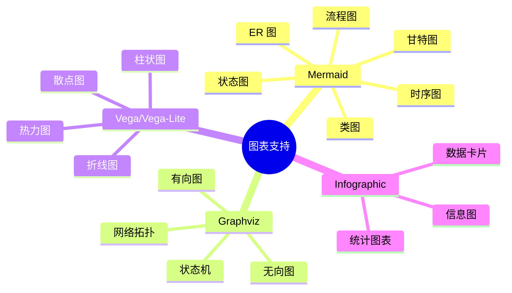
```mermaid
mindmap
  root((图表支持))
    Mermaid
      流程图
      时序图
      类图
      状态图
      甘特图
      ER 图
    Graphviz
      有向图
      无向图
      网络拓扑
      状态机
    Vega/Vega-Lite
      柱状图
      折线图
      散点图
      热力图
    Infographic
      信息图
      统计图表
      数据卡片
```

#### 1.2.2 数学公式

学术和技术文档中，数学公式是不可或缺的元素。本扩展提供完整的 LaTeX 数学语法支持，采用双引擎策略实现最佳效果：

**预览引擎（KaTeX）**：浏览器内预览使用 KaTeX 渲染，确保编辑时的流畅体验。KaTeX 支持绝大多数常用的 LaTeX 数学命令，包括：

- 行内公式：`$E = mc^2$` 嵌入文本段落中
- 块级公式：`$$\int_0^\infty e^{-x^2} dx = \frac{\sqrt{\pi}}{2}$$` 独立成段居中显示
- 矩阵与数组：支持 `matrix`、`bmatrix`、`pmatrix` 等多种矩阵环境
- 分数与根式：`\frac{a}{b}`、`\sqrt[n]{x}` 等
- 求和与积分：`\sum`、`\prod`、`\int`、`\oint` 等各类运算符
- 希腊字母与数学符号：完整的符号库支持

**导出引擎（MathJax）**：导出 Word 时使用 MathJax 将 LaTeX 转换为 **原生 Word 可编辑公式**（OMML 格式），而非图片。这意味着导出后的公式在 Word 中仍可直接编辑、修改，与 Word 内置公式编辑器完全兼容。这一特性对于学术协作尤为重要——导师可以直接在 Word 中修改学生的公式，无需返回 Markdown 源文件。

#### 1.2.3 代码高亮

代码片段是技术文档的另一核心要素。本扩展基于 highlight.js（通过 rehype-highlight 集成），支持 **100+ 编程语言** 的语法高亮，涵盖：

- **主流语言**：JavaScript/TypeScript、Python、Java、C/C++、Go、Rust、Swift、Kotlin
- **Web 技术**：HTML、CSS、SCSS、JSON、XML、YAML、Markdown
- **脚本语言**：Shell/Bash、PowerShell、Ruby、PHP、Perl
- **数据与查询**：SQL、GraphQL、R、MATLAB
- **配置格式**：Dockerfile、Nginx、Apache、INI、TOML

导出到 Word 时，代码块保留完整的颜色格式和等宽字体设置，无需任何手动调整。代码主题可在设置中选择，提供 GitHub、Monokai、Dracula 等多种流行配色方案。

#### 1.2.4 主题系统

文档的视觉呈现对于阅读体验和专业形象至关重要。本扩展提供了一套完善的主题系统，包含 **29 个专业预设主题**，全部定义在 `src/themes/presets/` 目录中，涵盖七大类别：

**Professional（专业商务）**

- `default`：平衡的默认主题，适合各类通用文档
- `business`：商务风格，简洁大方，适合企业报告
- `technical`：技术文档优化，代码块和表格样式突出

**Academic（学术风格）**

- `academic`：学术论文风格，符合期刊排版规范，适当的行距和边距设置

**Serif（衬线字体）**

- `elegant`：优雅的衬线排版，适合正式文档和出版物
- `palatino`：基于 Palatino 字体，经典的书籍排版风格
- `garamond`：基于 Garamond 字体，法式优雅风格

**Sans-serif（无衬线字体）**

- `verdana`：屏幕优化，清晰易读
- `century`：圆润简约，友好亲切

**Creative（创意风格）**

- `typewriter`：打字机风格，复古怀旧感
- `water`：水波主题，蓝色调，清爽简洁
- `minimal`：极简主义设计

**Chinese（中文优化）**

- `heiti`：黑体排版，现代中文风格
- `mixed`：混排优化，中文宋体+英文衬线字体混合排版

每个主题不仅定义了字体和颜色，还包含完整的样式配置：标题层级样式、段落间距、表格边框、代码块背景色等。主题配置采用 JSON 格式，高级用户可以轻松创建自定义主题。

```infographic
infographic list-grid-badge-card
data
  title 主题分类
  desc 29 个专业预设主题，7 大类别
  items
    - label 经典文档
      desc default, academic, business, manuscript, newspaper
    - label 书籍阅读
      desc palatino, garamond, typewriter, elegant
    - label 现代科技
      desc technical, swiss, minimal
    - label 创意表达
      desc magazine, century, handwritten, verdana
    - label 中文排版
      desc heiti, mixed, water
    - label 缤纷童趣
      desc rainbow, starry, candy, dinosaur, space, garden
    - label 自然色彩
      desc forest, ocean, coral, sunset
```

| 类别 | 主题 | 适用场景 |
|-----|------|---------|
| **Classic** | default, academic, business, manuscript, newspaper | 公文、报告、论文 |
| **Reading** | palatino, garamond, typewriter, elegant | 书籍、长文阅读 |
| **Modern** | technical, swiss, minimal | 技术文档、产品说明 |
| **Creative** | magazine, century, handwritten, verdana | 博客、设计、创意写作 |
| **Chinese** | heiti, mixed, water | 中文排版优化 |
| **Playful** | rainbow, starry, candy, dinosaur, space, garden | 学生作业、儿童内容 |
| **Nature** | forest, ocean, coral, sunset | 自然配色、温暖视觉 |

#### 1.2.5 多语言支持

为了服务全球用户，本扩展提供了全面的界面本地化支持，目前已支持 **28 种语言**，语言包位于 `src/_locales/` 目录。支持的语言包括：

- **东亚语言**：简体中文、繁体中文、日语、韩语、越南语
- **欧洲语言**：英语、德语、法语、西班牙语、葡萄牙语（巴西/葡萄牙）、意大利语、俄语
- **北欧语言**：瑞典语、挪威语、丹麦语、芬兰语
- **东欧语言**：波兰语、乌克兰语、白俄罗斯语、立陶宛语、爱沙尼亚语
- **其他语言**：土耳其语、印地语、泰语、印尼语、马来语、荷兰语

扩展会自动检测用户的系统语言偏好，并加载对应的语言包。用户也可以在设置中手动切换界面语言。所有用户可见的文本——包括菜单项、按钮标签、提示信息、错误消息——都经过本地化处理，确保非英语用户也能获得流畅的使用体验。

### 1.3 平台支持

本项目采用"一套核心引擎，多平台适配"的架构设计理念，实现跨平台统一体验。核心的 Markdown 处理逻辑、图表渲染引擎、导出功能全部集中在共享的 `src/` 目录中，各平台只需实现轻量级的适配层，即可获得完整的功能支持。

这种架构设计带来了显著的优势：

- **代码复用**：核心逻辑只编写和维护一次，避免跨平台的功能差异和重复开发
- **一致性保证**：无论用户使用哪个平台，渲染效果和导出结果完全一致
- **快速迭代**：新功能只需在核心层实现，即可同时惠及所有平台
- **质量保障**：测试用例集中在核心层，减少测试维护成本

```infographic
infographic relation-circle-icon-badge
data
  title 平台支持
  desc 一套核心引擎，多平台部署
  items
    - label Chrome 扩展
      value 35
      icon mdi/google-chrome
    - label Firefox 扩展
      value 25
      icon mdi/firefox
    - label VS Code 扩展
      value 25
      icon mdi/microsoft-visual-studio-code
    - label 移动端应用
      value 15
      icon mdi/cellphone
```

**Chrome 扩展**

Chrome 扩展是本项目的旗舰平台，代码位于 `chrome/` 目录。它允许用户直接在 Chrome 浏览器中打开和渲染 Markdown 文件，支持 `file://` 协议访问本地文件（需用户授权）。Chrome 扩展采用 Manifest V3 规范，利用 Offscreen API 在后台执行图表渲染等计算密集型任务，不阻塞主界面。扩展发布在 Chrome Web Store，用户可一键安装。

**Firefox 扩展**

Firefox 扩展位于 `firefox/` 目录，提供与 Chrome 扩展相同的核心功能。由于 Firefox 对 Manifest V3 的支持进度不同，目前仍使用 Manifest V2 规范。Firefox 扩展发布在 Firefox Add-ons 平台，为 Firefox 用户提供原生的 Markdown 阅读体验。

**VS Code 扩展**

VS Code 扩展位于 `vscode/` 目录，专为开发者设计。它提供了编辑器内的实时预览功能——在编辑 Markdown 文件时，侧边栏实时显示渲染效果。扩展支持双向滚动同步：编辑器滚动时预览面板跟随，预览面板滚动时编辑器光标也会定位到对应位置。此外，VS Code 扩展还支持渲染多种语言文件（如 `.mermaid`、`.vega` 等），不仅限于 Markdown。扩展发布在 VS Code Marketplace。

**Mobile App**

移动端应用位于 `mobile/` 目录，采用 Flutter + WebView 混合架构。Flutter 负责原生的应用框架、文件管理、系统集成，WebView 负责复用 Web 端的渲染引擎，避免重复实现复杂的图表渲染逻辑。应用支持 iOS、Android 和 macOS 三个平台，用户可以在移动设备上阅读和导出 Markdown 文档。

| 平台 | 最佳场景 | 特点 |
|-----|---------|-----|
| **Chrome 扩展** | 浏览器中阅读本地/在线 Markdown | 支持 `file://` 协议，Offscreen 渲染 |
| **Firefox 扩展** | Firefox 用户 | 相同核心功能，Manifest V2 |
| **VS Code 扩展** | 编辑器内实时预览+导出 | 双向滚动同步，支持多种语言文件 |
| **Mobile App** | 移动端阅读与导出 | Flutter + WebView 混合架构 |

### 1.4 技术栈总览

本节概述项目所采用的核心技术栈及其选型理由。详细的版本信息可参见 `package.json`。

#### 1.4.1 核心技术选型

**Markdown 处理管道**

项目采用 unified 生态系统作为 Markdown 处理的核心框架。unified 是一个文本处理的通用框架，通过插件化的方式支持解析、转换、序列化等各个处理阶段。选择 unified 的原因包括：

- **标准化**：remark（Markdown 处理）和 rehype（HTML 处理）是社区标准，插件生态丰富
- **可扩展性**：可以方便地插入自定义处理逻辑，如公式处理、图表占位符替换等
- **AST 操作**：基于抽象语法树的操作，比正则表达式更可靠、更易维护

处理流程为：Markdown → remark-parse → 中间处理 → remark-rehype → rehype 处理 → rehype-stringify → HTML。

**图表渲染引擎**

为了支持多种图表语言，项目集成了四个独立的渲染引擎：

- **Mermaid**：官方 mermaid 库，支持流程图、时序图等 10+ 种图表类型
- **Viz.js**：Graphviz 的 WebAssembly 版本（@viz-js/viz），在浏览器中直接运行 DOT 语言渲染
- **Vega/Vega-Lite**：vega + vega-lite + vega-embed 组合，提供声明式数据可视化能力
- **Infographic**：@antv/infographic，专注于信息图表和数据卡片

**公式渲染**

公式渲染采用双引擎策略：

- **KaTeX**：用于预览渲染，确保流畅的编辑体验
- **MathJax**：用于 DOCX 导出，将 LaTeX 转换为 Office Math Markup Language (OMML)，实现可编辑的 Word 公式

**构建工具**

项目使用 esbuild 作为构建工具，构建速度快，特别适合开发阶段的快速迭代。TypeScript 用于提供类型安全，项目全量使用 TypeScript 编写。

<div style="width: 100%; max-width: 1000px; margin: 20px auto;">
  <style scoped>
    .tech-stack-title { text-align: center; font-size: 18px; font-weight: bold; color: #334155; margin-bottom: 16px; }
    .tech-stack-grid { display: grid; grid-template-columns: repeat(5, 1fr); gap: 12px; }
    .tech-card { border-radius: 8px; padding: 14px 10px; text-align: center; }
    .tech-card-md { background: linear-gradient(135deg, #dbeafe 0%, #bfdbfe 100%); border: 1.5px solid #3b82f6; }
    .tech-card-chart { background: linear-gradient(135deg, #d1fae5 0%, #a7f3d0 100%); border: 1.5px solid #10b981; }
    .tech-card-math { background: linear-gradient(135deg, #fce7f3 0%, #fbcfe8 100%); border: 1.5px solid #ec4899; }
    .tech-card-export { background: linear-gradient(135deg, #fed7aa 0%, #fdba74 100%); border: 1.5px solid #f97316; }
    .tech-card-build { background: linear-gradient(135deg, #e0e7ff 0%, #c7d2fe 100%); border: 1.5px solid #6366f1; }
    .tech-card-header { font-size: 13px; font-weight: bold; color: #1e293b; margin-bottom: 10px; padding-bottom: 8px; border-bottom: 1px solid rgba(0,0,0,0.1); }
    .tech-item { background: rgba(255,255,255,0.6); border-radius: 4px; padding: 5px 8px; margin: 4px 0; font-size: 11px; color: #475569; }
  </style>
  <div class="tech-stack-title">核心技术栈总览</div>
  <div class="tech-stack-grid">
    <div class="tech-card tech-card-md">
      <div class="tech-card-header">📝 Markdown 处理</div>
      <div class="tech-item">unified 引擎</div>
      <div class="tech-item">remark-parse</div>
      <div class="tech-item">rehype-stringify</div>
    </div>
    <div class="tech-card tech-card-chart">
      <div class="tech-card-header">📊 图表渲染</div>
      <div class="tech-item">Mermaid</div>
      <div class="tech-item">Viz.js / Graphviz</div>
      <div class="tech-item">Vega / Vega-Lite</div>
      <div class="tech-item">@antv/infographic</div>
    </div>
    <div class="tech-card tech-card-math">
      <div class="tech-card-header">🔢 公式渲染</div>
      <div class="tech-item">KaTeX (预览)</div>
      <div class="tech-item">MathJax (导出)</div>
    </div>
    <div class="tech-card tech-card-export">
      <div class="tech-card-header">📄 文档导出</div>
      <div class="tech-item">docx 库</div>
      <div class="tech-item">html2canvas</div>
    </div>
    <div class="tech-card tech-card-build">
      <div class="tech-card-header">🛠️ 构建工具</div>
      <div class="tech-item">esbuild</div>
      <div class="tech-item">TypeScript</div>
    </div>
  </div>
</div>

#### 1.4.2 依赖清单

| 功能领域 | 核心依赖 | 版本 |
|---------|---------|------|
| **Markdown 处理** | unified + remark + rehype | v11.x |
| **图表 - Mermaid** | mermaid | v11.12.1 |
| **图表 - Graphviz** | @viz-js/viz | v3.24.0 |
| **图表 - Vega** | vega + vega-lite + vega-embed | v6.x / v6.4.x |
| **图表 - Infographic** | @antv/infographic | v0.2.2 |
| **公式 - 预览** | katex | v0.16.25 |
| **公式 - 导出** | mathjax-full | v3.2.2 |
| **代码高亮** | rehype-highlight | v7.0.2 |
| **DOCX 导出** | docx | v9.0.2 |
| **构建工具** | esbuild | v0.25.11 |
| **类型系统** | TypeScript | v5.9.3 |

#### 1.4.3 架构设计原则

本项目在架构设计上遵循以下五大原则，这些原则贯穿整个代码库，确保系统的可维护性、可扩展性和性能表现：

**1. 共享核心，平台适配**

核心的渲染逻辑和导出功能集中在 `src/` 目录，各平台（Chrome、Firefox、VS Code、Mobile）仅实现轻量级的适配层。适配层通过统一的 `PlatformAPI` 接口与核心层交互，实现了真正的"一次编写，多平台运行"。当需要添加新功能时，只需修改核心层代码，所有平台自动受益。

**2. 插件化图表系统**

所有图表类型都通过统一的插件接口实现，定义在 `src/plugins/base-plugin.ts` 中。每个插件负责：识别特定的代码块语法、渲染图表、提供导出所需的图片数据。这种设计使得添加新的图表类型变得简单——只需实现插件接口，无需修改核心处理流程。

**3. 块级增量更新**

文档不是作为整体处理的，而是被分割成语义块（段落、代码块、表格、图表等）。`src/core/markdown-block-splitter.ts` 负责将文档分割成独立的块，每个块有唯一的内容哈希。当用户编辑文档时，系统只重新渲染发生变化的块，大幅提升了大型文档的编辑性能。

**4. 异步任务管理**

图表渲染是计算密集型操作。为了不阻塞用户界面，所有耗时操作都通过异步任务队列管理，实现在 `src/core/markdown-processor.ts` 中。任务队列支持优先级调度、取消操作和进度回调，确保用户始终能够获得响应式的界面体验。

**5. 安全优先**

Markdown 渲染涉及将用户输入转换为 HTML，如果处理不当，可能导致 XSS（跨站脚本）攻击。项目采用多层防御策略：rehype-sanitize 清理 HTML、CSP 策略限制脚本执行、沙箱化渲染环境。所有用户可控的输入都经过严格的过滤和转义，确保安全性。

### 1.5 开发进度与里程碑

本项目始于 2025 年 11 月，迄今已完成 264 个提交，跨越 2 个月的密集开发周期。以下时间线展示了项目的关键里程碑和功能演进历程。

#### 1.5.1 项目演进时间线

```infographic
infographic sequence-snake-steps-underline-text
data
  title Markdown Viewer 开发进度
  desc 从初始化到多平台支持（2025.11 - 2026.01）
  items
    - label 2025.11.07
      desc 项目启动：核心渲染管道、KaTeX 数学公式、Mermaid 图表、代码高亮
    - label 2025.11.08
      desc DOCX 导出：完整导出功能、本地化系统上线 (8 种语言)、隐私政策
    - label 2025.11.09
      desc 打印与安全：打印功能、HTML 消毒、数学公式转换器、分块上传
    - label 2025.11.10
      desc 历史管理：文档历史记录、DOCX 代码高亮、宽布局支持
    - label 2025.11.14
      desc 状态持久化：文件状态管理、滚动位置恢复、TOC 高亮交互
    - label 2025.11.16
      desc 多图表支持：Vega/Vega-Lite 渲染、主题系统 (18 款)、插件架构 (v1.1.0)
    - label 2025.11.17
      desc 语言扩展：本地化升级至 23 种语言、渲染队列、统一插件系统
    - label 2025.11.19
      desc 版本迭代：UI 优化、缓存统计、版本显示增强 (v1.1.1)
    - label 2025.12.12
      desc 性能优化：并行渲染、Mermaid 超时处理、滚动恢复增强
    - label 2025.12.16
      desc 移动平台：Flutter 应用启动、方法通道、响应式 SVG、异步取消
    - label 2025.12.17
      desc TypeScript 重构：全量 TS 升级、消息类型定义、iframe 渲染架构
    - label 2025.12.23
      desc 增量渲染：TOC 过滤插件、增量 Markdown 渲染、缓存服务 (v1.2.2)
    - label 2025.12.25
      desc 多格式支持：Graphviz/DOT、Infographic 引擎、嵌套内容处理 (v1.3.0)
    - label 2025.12.30
      desc VS Code 扩展：预览面板、设置面板、滚动同步、增量 DOM 更新
    - label 2025.12.31
      desc Firefox 支持：WebExtension API、跨浏览器兼容、源码重构
    - label 2026.01.03
      desc 工具链完善：标题编号、Markdown lint、Mermaid 分包、性能优化
```

#### 1.5.2 核心功能演进

| 时间段 | 核心成果 | 提交数 |
|--------|---------|-------|
| **第一阶段** (11.07-11.09) | 基础架构：核心渲染、DOCX 导出、打印、本地化 (8 语言) | ~35 |
| **第二阶段** (11.10-11.17) | 功能扩展：Vega 图表、主题系统、23 语言、插件架构 | ~30 |
| **第三阶段** (11.18-12.15) | 稳定迭代：性能优化、版本 1.1.x 系列、bug 修复 | ~25 |
| **第四阶段** (12.16-12.25) | 多平台启动：Mobile/Flutter、TypeScript 重构、Graphviz、Infographic | ~50 |
| **第五阶段** (12.26-12.31) | 跨平台统一：VS Code 扩展、Firefox 支持、增量渲染 | ~60 |
| **第六阶段** (01.01-01.05) | 工具与优化：滚动同步、Markdown 工具、包大小优化、v1.4.1 | ~64 |

#### 1.5.3 平台支持演进

- **✅ Chrome/Chromium**（2025.11.07）：首个平台支持，Manifest V3 兼容
- **✅ Firefox**（2025.12.31）：WebExtension API 支持，Manifest V3 兼容
- **✅ VS Code**（2025.12.30）：原生扩展集成，webview 预览，侧边栏设置
- **✅ Mobile/Flutter**（2025.12.16）：跨平台移动应用，平台通道通信

#### 1.5.4 功能演进矩阵

| 核心功能 | 11.07 | 11.08 | 11.16 | 12.16 | 12.25 | 12.30 |
|---------|:-----:|:-----:|:-----:|:-----:|:-----:|:-----:|
| **📝 核心渲染** |||||||
| Markdown 解析 | ✅ | ✅ | ✅ | ✅ | ✅ | ✅ |
| 代码高亮 (rehype-highlight) | 🆕 | ✅ | ✅ | ✅ | ✅ | ✅ |
| KaTeX 数学公式 | 🆕 | ✅ | ✅ | ✅ | ✅ | ✅ |
| 主题系统 (18 款预设) | - | - | 🆕 | ✅ | ✅ | ✅ |
| **📊 图表引擎** |||||||
| Mermaid | ✅ | ✅ | ✅ | ✅ | ✅ | ✅ |
| Vega / Vega-Lite | - | - | 🆕 | ✅ | ✅ | ✅ |
| Graphviz / DOT | - | - | - | - | 🆕 | ✅ |
| Infographic (AntV) | - | - | - | - | 🆕 | ✅ |
| **📄 导出功能** |||||||
| DOCX 导出 | - | 🆕 | ✅ | ✅ | ✅ | ✅ |
| DOCX 代码高亮 | - | - | ✅ | ✅ | ✅ | ✅ |
| DOCX 数学公式 (OMML) | - | ✅ | ✅ | ✅ | ✅ | ✅ |
| **🌐 本地化** |||||||
| 多语言支持 | - | 🆕 | ✅ | ✅ | ✅ | ✅ |
| 语言数量 | - | 8 | 23 | 23 | 23 | 23 |
| **🖥️ 平台支持** |||||||
| Chrome / Chromium | ✅ | ✅ | ✅ | ✅ | ✅ | ✅ |
| Mobile / Flutter | - | - | - | 🆕 | ✅ | ✅ |
| VS Code 扩展 | - | - | - | - | - | 🆕 |
| Firefox | - | - | - | - | - | 🆕 |

> **图例**：✅ 已支持 | 🆕 该版本新增 | - 未支持
>
> **时间点说明**：
> - **11.07**：项目启动，核心渲染和 Mermaid 已就绪
> - **11.08**：DOCX 导出、本地化系统上线（8 种语言）
> - **11.16**：Vega 图表、主题系统、语言扩展至 23 种（v1.1.0）
> - **12.16**：Mobile/Flutter 应用启动
> - **12.25**：Graphviz 和 Infographic 支持（v1.3.0）
> - **12.30**：VS Code 扩展、Firefox 支持（v1.4.0）

---

## 第二章 系统架构

本章详细描述 Markdown Viewer Extension 的系统架构设计。作为一个跨平台应用，架构设计的核心挑战在于：如何在保持各平台原生体验的同时，最大化代码复用率，降低维护成本？

本项目通过**分层抽象**解决了这一挑战：将平台无关的业务逻辑（Markdown 处理、图表渲染、文档导出）集中在共享核心层，各平台只需实现薄薄的适配层即可接入完整功能。这种架构使得核心代码的复用率达到 **85% 以上**，新功能开发只需修改一处，所有平台同步受益。

### 2.1 整体分层架构

#### 2.1.1 架构设计理念

本项目采用**共享核心 + 平台适配**的分层架构模式。这种架构模式借鉴了 React Native、Flutter 等跨平台框架的成功经验，但针对浏览器扩展和编辑器插件的特点进行了优化。

架构设计遵循以下核心原则：

1. **单一职责分离**：每一层只负责特定的职责，核心层不依赖任何平台特定 API，适配层不包含业务逻辑
2. **依赖倒置**：核心层定义抽象接口（如 `PlatformAPI`），平台层提供具体实现，核心层通过接口调用平台能力
3. **最小适配原则**：平台适配层尽可能薄，只做 API 转换和生命周期管理，避免在适配层实现业务逻辑

<div style="width: 100%; max-width: 1200px; box-sizing: border-box; position: relative; margin: 20px auto;">
  <style scoped>
    .arch-container { display: flex; gap: 15px; }
    .arch-wing-left { width: 180px; flex-shrink: 0; }
    .arch-wing-right { width: 180px; flex-shrink: 0; }
    .arch-main { flex: 1; min-width: 0; }
    .arch-title { text-align: center; font-size: 22px; font-weight: bold; color: #1e3a8a; margin-bottom: 20px; }
    .arch-layer { margin: 10px 0; padding: 15px; border-radius: 10px; position: relative; }
    .arch-divider { display: flex; align-items: center; justify-content: center; margin: 8px 0; color: #64748b; font-size: 12px; font-style: italic; }
    .arch-divider-line { flex: 1; height: 1px; background: #cbd5e1; }
    .arch-divider-text { margin: 0 12px; }
    .layer-app { background: linear-gradient(135deg, #fef7ed 0%, #fed7aa 100%); border: 2px solid #ea580c; }
    .layer-platform { background: linear-gradient(135deg, #f0f9ff 0%, #e0f2fe 100%); border: 2px solid #0284c7; }
    .layer-core { background: linear-gradient(135deg, #f0fdf4 0%, #d1fae5 100%); border: 2px solid #059669; }
    .section-header { font-size: 15px; font-weight: bold; color: #334155; margin-bottom: 12px; text-align: center; }
    .app-grid { display: grid; grid-template-columns: repeat(4, 1fr); gap: 10px; }
    .platform-grid { display: grid; grid-template-columns: repeat(4, 1fr); gap: 8px; }
    .core-grid { display: grid; grid-template-columns: repeat(6, 1fr); gap: 8px; }
    .component-box { border-radius: 6px; padding: 10px 6px; text-align: center; box-shadow: 0 2px 4px rgba(0,0,0,0.08); }
    .app-box { background: #ffedd5; border: 1.5px solid #fb923c; }
    .platform-box { background: #e0f2fe; border: 1.5px solid #38bdf8; }
    .core-box { background: #d1fae5; border: 1.5px solid #34d399; }
    .component-title { font-size: 11px; font-weight: bold; color: #334155; margin-bottom: 4px; }
    .component-text { font-size: 10px; color: #64748b; line-height: 1.4; }
    .wing-panel { background: linear-gradient(135deg, #eef2ff 0%, #e0e7ff 100%); border: 2px solid #6366f1; border-radius: 8px; padding: 12px; height: calc(100% - 24px); }
    .wing-panel.external { background: linear-gradient(135deg, #fdf4ff 0%, #fae8ff 100%); border-color: #c084fc; }
    .wing-header { font-size: 14px; font-weight: bold; text-align: center; margin-bottom: 12px; color: #4338ca; }
    .wing-header.external { color: #9333ea; }
    .wing-section { background: #818cf8; border: 1.5px solid #6366f1; border-radius: 6px; padding: 8px; margin: 8px 0; }
    .wing-section.external { background: #c084fc; border-color: #a855f7; }
    .wing-section-title { font-size: 11px; font-weight: bold; color: #ffffff; margin-bottom: 6px; text-align: center; }
    .wing-item { background: rgba(255,255,255,0.25); border-radius: 4px; padding: 6px 5px; margin: 4px 0; font-size: 10px; color: #ffffff; text-align: center; }
  </style>
  <div class="arch-title">Markdown Viewer Extension 整体架构</div>
  <div class="arch-divider"><div class="arch-divider-line"></div></div>
  <div class="arch-container">
    <div class="arch-wing-left">
      <div class="wing-panel">
        <div class="wing-header">核心技术栈</div>
        <div class="wing-section">
          <div class="wing-section-title">Markdown 处理</div>
          <div class="wing-item">unified 引擎</div>
          <div class="wing-item">remark-parse</div>
          <div class="wing-item">remark-gfm</div>
          <div class="wing-item">remark-math</div>
        </div>
        <div class="wing-section">
          <div class="wing-section-title">HTML 渲染</div>
          <div class="wing-item">rehype-highlight</div>
          <div class="wing-item">rehype-katex</div>
          <div class="wing-item">rehype-stringify</div>
        </div>
        <div class="wing-section">
          <div class="wing-section-title">构建工具</div>
          <div class="wing-item">esbuild</div>
          <div class="wing-item">TypeScript</div>
        </div>
      </div>
    </div>
    <div class="arch-main">
      <div class="arch-layer layer-app">
        <div class="section-header">应用层 (各平台入口)</div>
        <div class="app-grid">
          <div class="component-box app-box">
            <div class="component-title">Chrome 扩展</div>
            <div class="component-text">Content Script<br/>Manifest V3</div>
          </div>
          <div class="component-box app-box">
            <div class="component-title">Firefox 扩展</div>
            <div class="component-text">Content Script<br/>Manifest V2</div>
          </div>
          <div class="component-box app-box">
            <div class="component-title">VS Code 扩展</div>
            <div class="component-text">WebviewPanel<br/>Extension Host</div>
          </div>
          <div class="component-box app-box">
            <div class="component-title">Mobile App</div>
            <div class="component-text">Flutter<br/>WebView 混合</div>
          </div>
        </div>
      </div>
      <div class="arch-divider">
        <div class="arch-divider-line"></div>
        <div class="arch-divider-text">⬇ PlatformAPI 接口调用</div>
        <div class="arch-divider-line"></div>
      </div>
      <div class="arch-layer layer-platform">
        <div class="section-header">平台适配层 (Platform API)</div>
        <div class="platform-grid">
          <div class="component-box platform-box">
            <div class="component-title">PlatformAPI</div>
            <div class="component-text">统一接口</div>
          </div>
          <div class="component-box platform-box">
            <div class="component-title">CacheService</div>
            <div class="component-text">渲染缓存</div>
          </div>
          <div class="component-box platform-box">
            <div class="component-title">RendererService</div>
            <div class="component-text">图表渲染</div>
          </div>
          <div class="component-box platform-box">
            <div class="component-title">StorageService</div>
            <div class="component-text">设置存储</div>
          </div>
          <div class="component-box platform-box">
            <div class="component-title">FileService</div>
            <div class="component-text">文件下载</div>
          </div>
          <div class="component-box platform-box">
            <div class="component-title">I18nService</div>
            <div class="component-text">国际化</div>
          </div>
          <div class="component-box platform-box">
            <div class="component-title">DocumentService</div>
            <div class="component-text">文档操作</div>
          </div>
        </div>
      </div>
      <div class="arch-divider">
        <div class="arch-divider-line"></div>
        <div class="arch-divider-text">⬇ 核心业务逻辑</div>
        <div class="arch-divider-line"></div>
      </div>
      <div class="arch-layer layer-core">
        <div class="section-header">共享核心层 (src/)</div>
        <div class="core-grid">
          <div class="component-box core-box">
            <div class="component-title">Markdown 处理器</div>
            <div class="component-text">core/</div>
          </div>
          <div class="component-box core-box">
            <div class="component-title">插件系统</div>
            <div class="component-text">plugins/</div>
          </div>
          <div class="component-box core-box">
            <div class="component-title">渲染器系统</div>
            <div class="component-text">renderers/</div>
          </div>
          <div class="component-box core-box">
            <div class="component-title">导出器</div>
            <div class="component-text">exporters/</div>
          </div>
          <div class="component-box core-box">
            <div class="component-title">主题系统</div>
            <div class="component-text">themes/</div>
          </div>
          <div class="component-box core-box">
            <div class="component-title">消息通信</div>
            <div class="component-text">messaging/</div>
          </div>
        </div>
      </div>
    </div>
    <div class="arch-wing-right">
      <div class="wing-panel external">
        <div class="wing-header">外部依赖</div>
        <div class="wing-section external">
          <div class="wing-section-title">图表渲染</div>
          <div class="wing-item">Mermaid</div>
          <div class="wing-item">Viz.js/Graphviz</div>
          <div class="wing-item">Vega/Vega-Lite</div>
          <div class="wing-item">@antv/infographic</div>
        </div>
        <div class="wing-section external">
          <div class="wing-section-title">公式渲染</div>
          <div class="wing-item">KaTeX (预览)</div>
          <div class="wing-item">MathJax (导出)</div>
        </div>
        <div class="wing-section external">
          <div class="wing-section-title">文档导出</div>
          <div class="wing-item">docx 库</div>
          <div class="wing-item">html2canvas</div>
        </div>
      </div>
    </div>
  </div>
</div>

#### 2.1.2 三层架构详解

**应用层（Application Layer）**

应用层是用户直接接触的界面层，负责平台特定的 UI 交互和生命周期管理。每个平台的应用层都有其独特的入口点和运行环境：

- **Chrome/Firefox 扩展**：通过 Content Script 注入到网页中，检测 `.md` 文件并接管渲染
- **VS Code 扩展**：通过 `activate()` 函数启动，创建 WebviewPanel 提供预览界面
- **Mobile App**：Flutter 应用框架，WebView 承载渲染引擎

应用层的代码量占比最小（约 10%），但它决定了用户的第一印象和交互体验。

**平台适配层（Platform Abstraction Layer）**

平台适配层是架构的关键枢纽，它通过统一的 `PlatformAPI` 接口抽象了各平台的差异。该接口定义在 `src/types/platform.ts` 文件中，包含七大服务模块：

| 服务接口 | 职责描述 | 典型实现差异 |
|---------|---------|-------------|
| `CacheService` | 渲染结果缓存 | Chrome 使用 IndexedDB，VS Code 使用 ExtensionContext.globalState |
| `RendererService` | 图表渲染代理 | Chrome 通过 Offscreen Document，VS Code 在 Webview 内直接渲染 |
| `StorageService` | 用户设置存储 | Chrome 使用 chrome.storage.sync，Mobile 使用 SharedPreferences |
| `FileService` | 文件下载/保存 | Chrome 使用 chrome.downloads，Mobile 使用原生文件选择器 |
| `ResourceService` | 静态资源加载 | VS Code 需要 webview.asWebviewUri() 转换路径 |
| `I18nService` | 国际化文本 | Chrome 使用 chrome.i18n，Mobile 自行加载 JSON 语言包 |
| `DocumentService` | 文档操作服务 | 处理文件读取、路径解析、资源 URL 转换等文档级操作 |

通过这层抽象，核心层代码无需关心"当前运行在哪个平台"，只需调用统一的接口即可。例如，保存设置时只需调用 `platform.storage.set()`，适配层会自动使用平台对应的存储机制。

**共享核心层（Shared Core Layer）**

共享核心层包含所有平台无关的业务逻辑，是项目代码量最大的部分（约 85%）。核心层的代码全部位于 `src/` 目录，由六大模块组成：

| 核心模块 | 代码位置 | 功能描述 |
|---------|---------|---------|
| **Markdown 处理器** | `src/core/` | unified 处理管道、块分割、文档模型 |
| **插件系统** | `src/plugins/` | 图表语言解析和渲染逻辑 |
| **渲染器系统** | `src/renderers/` | 具体的图表渲染实现（Mermaid、Vega 等） |
| **导出器** | `src/exporters/` | DOCX 导出、公式转换、样式映射 |
| **主题系统** | `src/themes/` | 主题预设、CSS 变量、代码高亮主题 |
| **消息通信** | `src/messaging/` | 跨上下文通信框架 |

核心层的设计原则是**零平台依赖**——不引入任何 `chrome.*`、`vscode.*` 或 Flutter 特定的 API。所有对平台能力的需求都通过 `PlatformAPI` 接口向上层请求。

#### 2.1.3 分层职责总览

下表总结了各层的核心职责和对应的代码位置：

| 层级 | 职责 | 代码位置 | 关键文件 |
|-----|------|---------|---------|
| **应用层** | 平台入口、UI 交互、生命周期管理 | `chrome/`, `firefox/`, `vscode/`, `mobile/` | manifest.json, extension.ts, main.dart |
| **平台适配层** | 抽象平台差异、统一服务接口 | `src/types/platform.ts` + 各平台实现 | platform.ts, cache-service.ts |
| **共享核心层** | Markdown 处理、渲染、导出、主题 | `src/core/`, `src/plugins/`, `src/exporters/` | markdown-processor.ts, docx-exporter.ts |

这种分层架构的优势在于：

1. **开发效率高**：新功能只需在核心层实现一次，所有平台自动获得支持
2. **测试成本低**：核心逻辑的单元测试可以在 Node.js 环境运行，无需启动浏览器或模拟器
3. **维护负担轻**：Bug 修复同样只需修改一处，避免了"同一个 Bug 修四次"的窘境
4. **新平台接入快**：添加新平台只需实现 `PlatformAPI` 接口，核心功能即刻可用

### 2.2 目录结构

项目的目录结构清晰地反映了分层架构的设计思想。理解目录结构有助于开发者快速定位代码、理解模块边界、正确添加新功能。

#### 2.2.1 共享核心代码 (src/)

`src/` 目录包含所有平台共享的核心代码，是项目最重要的部分。该目录的组织遵循**功能分组**原则，每个子目录负责一个独立的功能域。

```
src/
├── core/                    # 核心处理逻辑
│   ├── markdown-processor.ts    # Markdown 处理管道
│   ├── markdown-block-splitter.ts # 块分割器
│   ├── markdown-document.ts     # 文档模型
│   ├── line-based-scroll.ts     # 滚动同步
│   └── viewer/                  # 查看器控制器
├── plugins/                 # 图表插件系统
│   ├── base-plugin.ts           # 插件基类
│   ├── mermaid-plugin.ts        # Mermaid 插件
│   ├── vega-plugin.ts           # Vega 插件
│   ├── dot-plugin.ts            # Graphviz 插件
│   └── ...                      # 其他插件
├── renderers/               # 渲染器实现
│   ├── base-renderer.ts         # 渲染器基类
│   ├── mermaid-renderer.ts      # Mermaid 渲染器
│   └── ...                      # 其他渲染器
├── exporters/               # 导出器
│   ├── docx-exporter.ts         # DOCX 主导出器
│   ├── docx-math-converter.ts   # 公式转换
│   └── docx-*.ts                # 模块化转换器
├── messaging/               # 消息通信
│   ├── base-channel.ts          # 通道基类
│   └── transports/              # 传输层实现
├── themes/                  # 主题系统
│   ├── registry.json            # 主题注册表
│   ├── presets/                 # 主题预设
│   └── code-themes/             # 代码高亮主题
├── types/                   # TypeScript 类型定义
├── ui/                      # 共享 UI 组件和样式
├── utils/                   # 工具函数
└── _locales/                # 国际化资源
```

**核心目录详解：**

| 目录 | 说明 | 关键职责 |
|-----|------|---------|
| `core/` | Markdown 处理的核心引擎 | 文本解析、块分割、增量更新、滚动同步 |
| `plugins/` | 图表语言的解析插件 | 识别代码块语法、提取图表内容、创建渲染任务 |
| `renderers/` | 图表的具体渲染实现 | 调用第三方库（Mermaid、Viz.js 等）执行渲染 |
| `exporters/` | 文档导出逻辑 | DOCX 生成、公式转换、样式映射、图片嵌入 |
| `messaging/` | 跨上下文通信 | 请求-响应协议、消息路由、错误处理 |
| `themes/` | 视觉主题管理 | 主题定义、CSS 变量、代码高亮配色 |

`plugins/` 和 `renderers/` 的分离体现了**关注点分离**原则：插件负责"识别什么需要渲染"，渲染器负责"如何渲染"。这种分离使得添加新的图表类型变得简单——只需分别实现一个插件和一个渲染器。

#### 2.2.2 平台特定代码

每个平台都有独立的顶级目录，内部结构保持一致性，便于开发者在不同平台间切换。

```
chrome/                      # Chrome 扩展
├── src/
│   ├── host/                    # Background Service Worker
│   ├── webview/                 # Content Script + 主程序
│   ├── popup/                   # 弹出窗口
│   └── transports/              # Chrome 消息传输
└── manifest.json                # Manifest V3

firefox/                     # Firefox 扩展
├── src/                         # 结构同 Chrome
└── manifest.json                # Manifest V2

vscode/                      # VS Code 扩展
├── src/
│   ├── host/                    # Extension Host
│   ├── webview/                 # Webview 前端
│   └── transports/              # Webview 消息传输
└── package.json                 # 扩展清单

mobile/                      # Flutter 移动端
├── lib/                         # Flutter 代码
├── src/                         # WebView 前端代码
└── pubspec.yaml                 # Flutter 依赖
```

**平台目录的统一结构：**

观察上述目录结构，可以发现各平台遵循相似的内部组织：

| 子目录 | 职责 | Chrome 示例 | VS Code 示例 | Mobile 示例 |
|-------|------|-------------|--------------|-------------|
| `host/` | 宿主环境代码 | Service Worker | Extension Host | Flutter Dart 代码 |
| `webview/` | 前端渲染代码 | Content Script | Webview | WebView 内嵌页面 |
| `transports/` | 消息传输实现 | chrome.runtime | postMessage | JavaScriptChannel |

这种统一的目录命名使得开发者可以快速理解任意平台的代码组织，降低了跨平台开发的认知负担。

**host 与 webview 的分离：**

所有平台都采用了 **host + webview** 的双进程/双上下文模型。这种分离有几个重要原因：

1. **安全隔离**：Webview 运行在沙箱环境中，即使渲染不可信的 Markdown 内容也不会影响宿主环境
2. **性能优化**：图表渲染等重计算任务在独立上下文中执行，不阻塞主 UI 线程
3. **API 访问**：某些平台 API（如文件系统、网络请求）只能在 host 环境访问，webview 需要通过消息请求

### 2.3 数据流

理解数据流是掌握系统行为的关键。本项目有两条主要的数据流：**预览数据流**（Markdown → HTML）和**导出数据流**（Markdown → DOCX）。两条数据流共享前端的解析逻辑，但在后端处理上有显著差异。

#### 2.3.1 预览数据流：Markdown → HTML

预览是用户最常用的功能，需要快速响应用户的编辑操作。预览数据流采用**同步 + 异步混合**的处理策略：文本处理（解析、转换、代码高亮）同步完成，图表渲染异步执行。

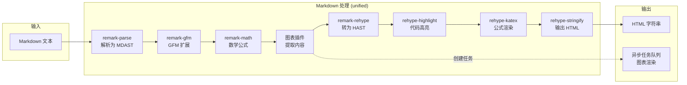
```mermaid
flowchart LR
    subgraph 输入
        MD[Markdown 文本]
    end
    
    subgraph Markdown处理["Markdown 处理 (unified)"]
        Parse[remark-parse<br/>解析为 MDAST]
        GFM[remark-gfm<br/>GFM 扩展]
        Math[remark-math<br/>数学公式]
        Plugins[图表插件<br/>提取内容]
        Rehype[remark-rehype<br/>转为 HAST]
        Highlight[rehype-highlight<br/>代码高亮]
        KaTeX[rehype-katex<br/>公式渲染]
        Stringify[rehype-stringify<br/>输出 HTML]
    end
    
    subgraph 输出
        HTML[HTML 字符串]
        Tasks[异步任务队列<br/>图表渲染]
    end
    
    MD --> Parse --> GFM --> Math --> Plugins --> Rehype --> Highlight --> KaTeX --> Stringify --> HTML
    Plugins -.->|创建任务| Tasks
```

**预览数据流的处理阶段：**

1. **输入预处理**：规范化数学块格式，将单行 `$$...$$` 转换为多行格式，确保 remark-math 正确识别
2. **MDAST 构建**：通过 remark-parse 将 Markdown 文本解析为抽象语法树（Markdown AST）
3. **语法扩展**：remark-gfm 添加表格、删除线等 GitHub 风格扩展；remark-math 识别数学公式
4. **图表提取**：图表插件遍历代码块，识别 `mermaid`、`vega` 等语言标记，提取内容并创建异步渲染任务
5. **AST 转换**：remark-rehype 将 Markdown AST 转换为 HTML AST（HAST）
6. **后处理**：代码高亮、公式渲染、HTML 输出

**异步图表渲染的必要性：**

图表渲染是计算密集型操作，如果同步执行会阻塞用户界面。因此，图表插件在解析阶段只创建**占位符**和**渲染任务**，实际渲染在后台异步完成。任务完成后，通过 DOM 操作替换占位符，实现渐进式加载效果。

#### 2.3.2 导出数据流：Markdown → DOCX

导出数据流与预览不同，它是一个**批处理流程**，用户触发导出后等待完成，不需要实时响应。因此，导出流程可以执行更多同步操作，优先保证输出质量而非速度。

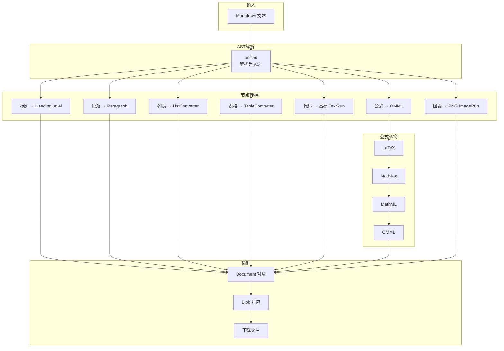
```mermaid
flowchart TB
    subgraph 输入
        MD2[Markdown 文本]
    end
    
    subgraph AST解析
        Parse2[unified<br/>解析为 AST]
    end
    
    subgraph 节点转换
        Heading[标题 → HeadingLevel]
        Para[段落 → Paragraph]
        List[列表 → ListConverter]
        Table[表格 → TableConverter]
        Code[代码 → 高亮 TextRun]
        MathNode[公式 → OMML]
        Chart[图表 → PNG ImageRun]
    end
    
    subgraph 公式转换
        LaTeX[LaTeX]
        MathJax[MathJax]
        MathML[MathML]
        OMML[OMML]
    end
    
    subgraph 输出
        Doc[Document 对象]
        Blob[Blob 打包]
        Download[下载文件]
    end
    
    MD2 --> Parse2
    Parse2 --> Heading & Para & List & Table & Code & MathNode & Chart
    MathNode --> LaTeX --> MathJax --> MathML --> OMML
    Heading & Para & List & Table & Code & OMML & Chart --> Doc --> Blob --> Download
```

**导出数据流的关键特性：**

1. **公式转换为原生格式**：不同于预览使用 KaTeX 渲染为 HTML，导出使用 MathJax 将 LaTeX 转换为 **Office Math Markup Language (OMML)**。OMML 是 Word 的原生公式格式，这意味着导出的公式在 Word 中完全可编辑，与手动输入的公式无异

2. **图表转换为高清图片**：图表在导出前被渲染为 PNG 图片并嵌入文档。为保证打印质量，图片采用 2x 或更高的设备像素比渲染

3. **代码保留语法高亮**：代码块的每个 token 都被转换为带颜色的 TextRun，在 Word 中保持语法高亮效果

4. **样式映射**：Markdown 的语义结构（标题级别、列表类型、引用块）被映射为 Word 的内置样式，确保文档结构清晰且可编辑

**预览与导出的处理差异：**

| 维度 | 预览数据流 | 导出数据流 |
|-----|----------|----------|
| **响应要求** | 实时响应 | 批处理 |
| **公式渲染** | KaTeX → HTML | MathJax → OMML（可编辑） |
| **图表处理** | 异步渲染 + 占位符 | 同步渲染 + 嵌入 PNG |
| **输出格式** | HTML 字符串 | DOCX Blob |
| **增量支持** | 支持块级增量 | 全量重新生成 |

### 2.4 平台运行时架构

每个平台都有其独特的运行时环境和约束条件。本节详细描述各平台的架构设计，帮助开发者理解平台特定的实现细节。

#### 2.4.1 Chrome 扩展架构

Chrome 扩展是本项目的旗舰平台，采用 **Manifest V3** 规范开发。Manifest V3 是 Chrome 扩展的最新架构，相比 V2 有更严格的安全限制和更好的性能表现。

Chrome 扩展的运行时由三个相互隔离的执行上下文组成，它们通过 `chrome.runtime` 消息 API 进行通信：

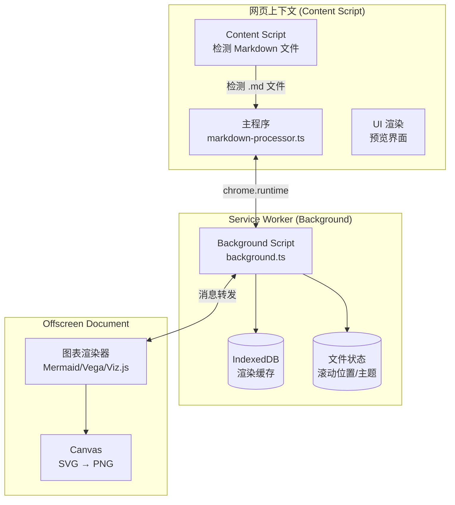
```mermaid
graph TB
    subgraph 网页上下文["网页上下文 (Content Script)"]
        CS[Content Script<br/>检测 Markdown 文件]
        Main[主程序<br/>markdown-processor.ts]
        UI[UI 渲染<br/>预览界面]
    end
    
    subgraph ServiceWorker["Service Worker (Background)"]
        BG[Background Script<br/>background.ts]
        Cache[(IndexedDB<br/>渲染缓存)]
        State[(文件状态<br/>滚动位置/主题)]
    end
    
    subgraph Offscreen["Offscreen Document"]
        Renderer[图表渲染器<br/>Mermaid/Vega/Viz.js]
        Canvas[Canvas<br/>SVG → PNG]
    end
    
    CS -->|检测 .md 文件| Main
    Main <-->|chrome.runtime| BG
    BG <-->|消息转发| Renderer
    BG --> Cache
    BG --> State
    Renderer --> Canvas
```

**三个执行上下文的职责分工：**

| 上下文 | 环境特点 | 核心职责 | 代码位置 |
|-------|---------|---------|---------|
| **Content Script** | 运行在网页上下文，可访问 DOM | 检测 .md 文件、执行主渲染逻辑、管理用户界面 | chrome/src/webview/ |
| **Service Worker** | 无 DOM 环境，长期后台运行 | 消息路由、缓存管理（IndexedDB）、状态持久化 | chrome/src/host/background.ts |
| **Offscreen Document** | 独立的 DOM 环境 | 图表库渲染（需要 DOM 的 Mermaid 等）、SVG 转 PNG | chrome/src/host/offscreen.ts |

**为什么需要 Offscreen Document？**

Manifest V3 的 Service Worker 没有 DOM 环境，但 Mermaid、Vega 等图表库需要 DOM 来渲染 SVG。Chrome 提供了 Offscreen Document API 来解决这个问题——它创建一个不可见的 HTML 页面，专门用于需要 DOM 的后台任务。

在我们的实现中，Content Script 将图表渲染请求发送给 Service Worker，Service Worker 转发给 Offscreen Document 执行渲染，渲染结果（SVG 或 PNG）再原路返回。这种架构确保了主页面的渲染性能不受图表渲染影响。

**消息通信流程：**

1. Content Script 检测到 Markdown 文件，触发渲染
2. 遇到图表代码块时，创建渲染任务并发送到 Service Worker
3. Service Worker 检查 IndexedDB 缓存，命中则直接返回
4. 缓存未命中，转发请求到 Offscreen Document
5. Offscreen Document 调用图表库渲染，返回结果
6. Service Worker 缓存结果并返回给 Content Script

#### 2.4.2 VS Code 扩展架构

VS Code 扩展采用 **Extension Host + Webview** 双进程架构。这是 VS Code 扩展的标准架构模式，Extension Host 运行在 Node.js 环境，Webview 运行在 Chromium 渲染进程的沙箱中。

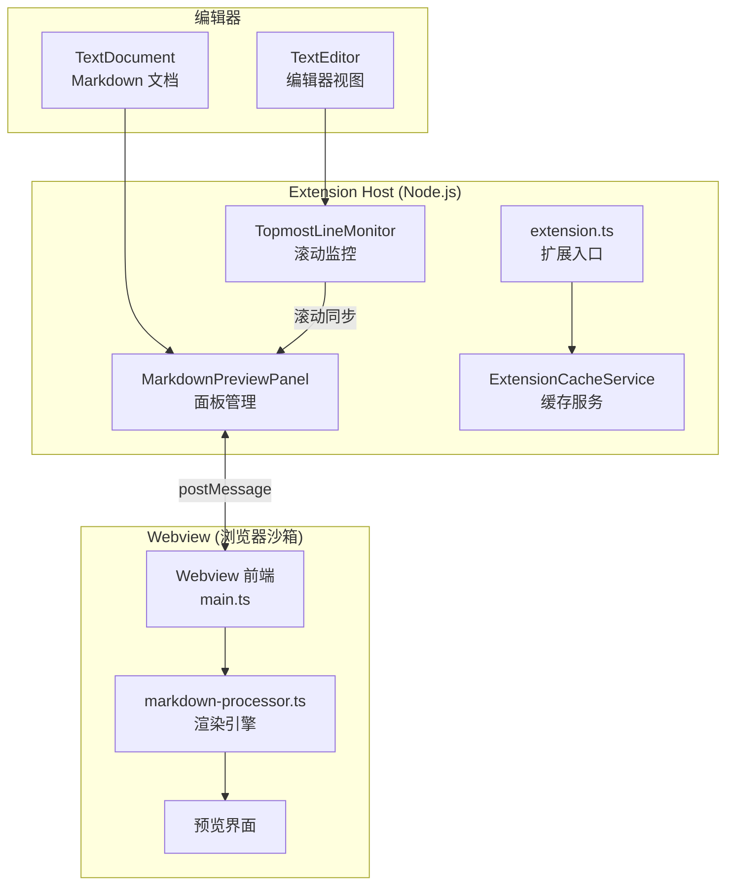
```mermaid
graph TB
    subgraph ExtensionHost["Extension Host (Node.js)"]
        Ext[extension.ts<br/>扩展入口]
        Panel[MarkdownPreviewPanel<br/>面板管理]
        Monitor[TopmostLineMonitor<br/>滚动监控]
        CacheSvc[ExtensionCacheService<br/>缓存服务]
    end
    
    subgraph Editor["编辑器"]
        Doc[TextDocument<br/>Markdown 文档]
        Editor2[TextEditor<br/>编辑器视图]
    end
    
    subgraph Webview["Webview (浏览器沙箱)"]
        WV[Webview 前端<br/>main.ts]
        Proc[markdown-processor.ts<br/>渲染引擎]
        Preview[预览界面]
    end
    
    Doc --> Panel
    Editor2 --> Monitor
    Panel <-->|postMessage| WV
    WV --> Proc --> Preview
    Monitor -->|滚动同步| Panel
    Ext --> CacheSvc
```

**Extension Host 的核心组件：**

| 组件 | 文件 | 职责 |
|-----|------|-----|
| **扩展入口** | extension.ts | 注册命令、激活扩展、管理生命周期 |
| **预览面板** | preview-panel.ts | 创建和管理 WebviewPanel，处理与 Webview 的通信 |
| **滚动监控** | TopmostLineMonitor | 追踪编辑器可见区域，实现双向滚动同步 |
| **缓存服务** | cache-service.ts | 使用 ExtensionContext.globalState 缓存渲染结果 |

**双向滚动同步的实现：**

VS Code 扩展的一个亮点是编辑器和预览面板的双向滚动同步：

1. **编辑器 → 预览**：TopmostLineMonitor 监听 `onDidChangeTextEditorVisibleRanges` 事件，获取当前可见的首行行号，通过 postMessage 发送给 Webview，Webview 滚动到对应位置
2. **预览 → 编辑器**：用户在预览面板点击某个元素时，Webview 通过 data-line 属性获取源码行号，发送给 Extension Host，Host 调用 `editor.revealLine()` 定位编辑器

**支持的文件类型：**

VS Code 扩展不仅支持 Markdown 文件，还支持以下语言文件的独立预览：

- `markdown` (.md) — Markdown 文档
- `mermaid` (.mermaid) — Mermaid 图表
- `vega` (.vega, .vl) — Vega/Vega-Lite 可视化
- `graphviz` (.gv, .dot) — Graphviz 图表
- `infographic` (.infographic) — AntV 信息图表

对于非 Markdown 文件，扩展会自动将内容包装在代码块中再渲染。

#### 2.4.3 Mobile App 架构

Mobile App 采用 **Flutter + WebView** 混合架构，这是移动端复用 Web 代码的常见方案。Flutter 负责原生的应用框架、系统集成、导航交互，WebView 负责加载和运行完整的 Markdown 渲染引擎。

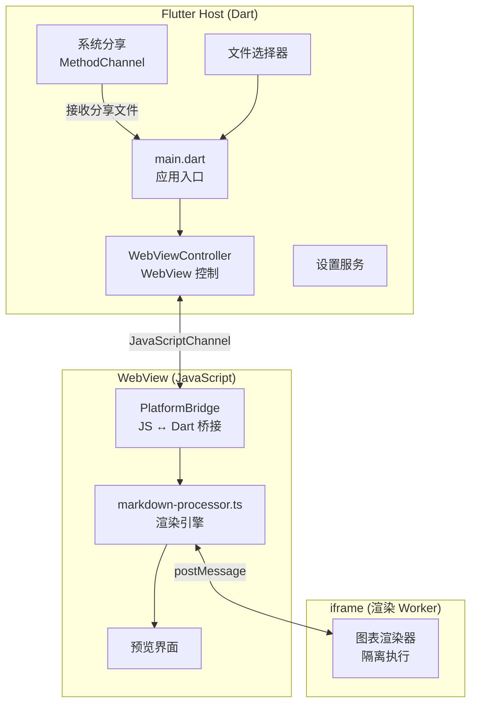
```mermaid
graph TB
    subgraph Flutter["Flutter Host (Dart)"]
        Main[main.dart<br/>应用入口]
        Controller[WebViewController<br/>WebView 控制]
        FilePicker[文件选择器]
        Share[系统分享<br/>MethodChannel]
        Settings[设置服务]
    end
    
    subgraph WebViewContainer["WebView (JavaScript)"]
        Bridge[PlatformBridge<br/>JS ↔ Dart 桥接]
        Proc2[markdown-processor.ts<br/>渲染引擎]
        Preview2[预览界面]
    end
    
    subgraph IframeWorker["iframe (渲染 Worker)"]
        Renderer2[图表渲染器<br/>隔离执行]
    end
    
    Main --> Controller
    Controller <-->|JavaScriptChannel| Bridge
    Share -->|接收分享文件| Main
    FilePicker --> Main
    Bridge --> Proc2 --> Preview2
    Proc2 <-->|postMessage| Renderer2
```

**Flutter Host 的服务模块：**

Mobile App 的 Flutter 层组织为多个独立的服务模块，位于 `mobile/lib/services/` 目录：

| 服务 | 文件 | 职责 |
|-----|------|-----|
| **缓存服务** | cache_service.dart | 图表渲染结果的本地缓存 |
| **国际化服务** | localization_service.dart | 加载和管理多语言资源 |
| **最近文件** | recent_files_service.dart | 记录和管理最近打开的文件 |
| **设置服务** | settings_service.dart | 用户偏好设置的持久化 |
| **主题资源** | theme_asset_service.dart | 加载主题相关的静态资源 |
| **主题注册** | theme_registry_service.dart | 管理可用的主题列表 |

**JS 与 Dart 的双向通信：**

WebView 和 Flutter 之间的通信通过两种机制实现：

1. **JavaScriptChannel**（Dart → JS 回调）：Flutter 注册一个名为 `FlutterBridge` 的 JavaScript 通道，WebView 中的 JS 代码可以调用 `FlutterBridge.postMessage()` 向 Dart 发送消息
2. **evaluateJavascript**（Dart → JS 调用）：Flutter 可以直接在 WebView 中执行 JavaScript 代码，用于传递文件内容、触发渲染等

**文件打开流程：**

1. 用户通过文件选择器或系统分享打开文件
2. Flutter 读取文件内容
3. 通过 `evaluateJavascript` 将内容传递给 WebView
4. WebView 中的渲染引擎处理 Markdown 并显示预览
5. 用户操作（滚动、点击、导出）通过 JavaScriptChannel 回传给 Flutter

**iframe 渲染隔离：**

与 Chrome 扩展类似，Mobile App 也使用 iframe 隔离图表渲染。主 WebView 中的渲染逻辑将图表渲染任务 postMessage 到一个隐藏的 iframe，渲染完成后结果返回主页面。这种隔离确保了即使图表渲染出错或超时，也不会影响主界面的响应性。

---

## 第三章 核心处理引擎

核心处理引擎是本扩展的技术心脏，负责将原始 Markdown 文本转换为丰富的 HTML 内容。这一章将深入剖析处理管道的各个组成部分，从文本解析到 DOM 更新的完整流程。

本章涵盖六个核心模块：**Markdown 处理管道** 负责语法解析和 HTML 生成；**块级分割器** 将文档拆分为独立的语义单元；**文档模型** 管理内存中的文档结构；**异步任务管理器** 协调图表等耗时渲染；**HTML 结果缓存** 避免重复计算；**滚动同步** 实现编辑器与预览窗口的双向联动。这些模块协同工作，在保证渲染质量的同时提供流畅的编辑体验。

### 3.1 Markdown 处理管道

#### 3.1.1 unified/remark/rehype 生态

本项目基于 **unified** 生态系统构建 Markdown 处理管道。unified 是一套通用的内容转换框架，被广泛应用于静态站点生成器、文档工具和内容管理系统中。其核心理念是将内容处理分解为「解析 → 转换 → 输出」三个阶段，每个阶段通过插件实现具体功能。

**为什么选择 unified？**

在技术选型阶段，我们评估了多种 Markdown 处理方案：marked、markdown-it、showdown 等。最终选择 unified 生态的原因有三：

1. **抽象语法树 (AST) 操作**：unified 将文档解析为 AST，允许在树结构上进行精确的查询和修改。这对于实现图表插件、公式渲染等高级功能至关重要——我们可以在 AST 层面识别代码块、替换为自定义节点，而非使用脆弱的正则表达式。

2. **丰富的插件生态**：remark（Markdown 处理）和 rehype（HTML 处理）提供了数百个现成插件，涵盖 GFM 扩展、数学公式、语法高亮等常见需求。这让我们能够专注于业务逻辑，而非重复造轮子。

3. **可组合的处理流水线**：插件可以像乐高积木一样自由组合，每个插件只负责单一职责。这种架构使得功能扩展变得简单——添加新语法只需编写一个插件并插入流水线。

**核心概念解析**

unified 生态包含三个核心组件，它们分别处理不同的内容格式：

- **remark**：专注于 Markdown 处理，使用 MDAST（Markdown Abstract Syntax Tree）作为内部表示。MDAST 节点类型包括 `heading`、`paragraph`、`code`、`list` 等，精确反映 Markdown 的语法结构。

- **rehype**：专注于 HTML 处理，使用 HAST（Hypertext Abstract Syntax Tree）作为内部表示。HAST 节点直接映射到 HTML 元素，如 `element`、`text`、`comment` 等。

- **unified**：统一的处理框架，协调 remark 和 rehype 的协作。通过 `remark-rehype` 桥接插件，可以将 MDAST 无缝转换为 HAST，从而在一个流水线中完成从 Markdown 到 HTML 的全部处理。

项目的核心处理逻辑位于 `src/core/markdown-processor.ts`，该模块定义了完整的 13 步处理流程。


```mermaid
flowchart LR
    subgraph remark["remark (MDAST)"]
        Parse[remarkParse<br/>解析]
        GFM[remarkGfm<br/>GitHub 扩展]
        Breaks[remarkBreaks<br/>软换行]
        Math[remarkMath<br/>数学公式]
        Super[remarkSuperSub<br/>上下标]
        TOC[remarkTocFilter<br/>TOC 过滤]
        Plugins[registerRemarkPlugins<br/>图表插件]
    end
    
    subgraph transform["转换"]
        Rehype[remarkRehype<br/>MDAST → HAST]
    end
    
    subgraph rehype["rehype (HAST)"]
        Slug[rehypeSlug<br/>标题 ID]
        Image[rehypeImageUri<br/>图片路径]
        Highlight[rehypeHighlight<br/>代码高亮]
        KaTeX[rehypeKatex<br/>公式渲染]
        Stringify[rehypeStringify<br/>HTML 输出]
    end
    
    MD[Markdown] --> Parse --> GFM --> Breaks --> Math --> Super --> TOC --> Plugins --> Rehype --> Slug --> Image --> Highlight --> KaTeX --> Stringify --> HTML[HTML]
```

#### 3.1.2 13 步处理流程详解

处理流水线由 13 个插件组成，按照严格的顺序执行。每个插件都有明确的职责边界，前一个插件的输出是后一个插件的输入。这种设计确保了处理过程的可预测性和可调试性。

**阶段一：Markdown 解析与增强 (步骤 1-7)**

这一阶段在 MDAST 层面操作，负责将原始文本解析为结构化的语法树，并进行语法扩展。

| 步骤 | 插件 | 职责 |
|-----|------|-----|
| 1 | `remarkParse` | 核心解析器，将 Markdown 文本转换为 MDAST。识别标题、段落、列表、代码块等基本语法元素。这是整个流水线的入口，所有后续处理都基于此步骤生成的 AST。 |
| 2 | `remarkGfm` | 添加 GitHub Flavored Markdown 扩展支持，包括表格语法、删除线 (`~~text~~`)、任务列表 (`- [ ]`)、自动链接识别等。这些扩展已成为现代 Markdown 的事实标准。 |
| 3 | `remarkBreaks` | 将源码中的软换行（单个换行符）转换为 `<br>` 元素。标准 Markdown 需要两个空格加换行才能产生换行，此插件简化了这一行为，更符合用户直觉。 |
| 4 | `remarkMath` | 识别数学公式语法：行内公式 `$...$` 和块级公式 `$$...$$`。解析器将公式内容提取为 `math` 和 `inlineMath` 节点，供后续 KaTeX 渲染使用。 |
| 5 | `remarkSuperSub` | 自定义插件，实现上下标语法扩展。`^上标^` 转换为 `<sup>` 标签，`~下标~` 转换为 `<sub>` 标签。常用于化学式（H~2~O）和数学表达式（x^2^）的简写。 |
| 6 | `remarkTocFilter` | 自定义插件，过滤文档中的 `[toc]` 或 `[TOC]` 标记。这些标记用于生成目录，但不应在渲染输出中显示原始文本。 |
| 7 | `registerRemarkPlugins` | 图表插件注册入口，将所有图表插件（Mermaid、Vega、Graphviz 等）接入处理流水线。这一步会遍历代码块节点，识别特定语言标识，并创建异步渲染任务。 |

**阶段二：AST 转换 (步骤 8)**

这一阶段是 MDAST 到 HAST 的桥接点，完成从 Markdown 语义到 HTML 语义的转换。

| 步骤 | 插件 | 职责 |
|-----|------|-----|
| 8 | `remarkRehype` | AST 转换器，将 MDAST 节点映射为对应的 HAST 节点。例如 `heading` 节点转换为 `h1`-`h6` 元素，`code` 节点转换为 `<pre><code>` 结构。此步骤还处理 `allowDangerousHtml` 选项，决定是否保留原始 HTML 内容。 |

**阶段三：HTML 增强与输出 (步骤 9-13)**

这一阶段在 HAST 层面操作，为 HTML 元素添加属性、执行样式处理、最终序列化为字符串。

| 步骤 | 插件 | 职责 |
|-----|------|-----|
| 9 | `rehypeSlug` | 为标题元素生成唯一的 `id` 属性，基于标题文本内容生成 slug。例如 `## 快速开始` 生成 `<h2 id="快速开始">`。这些 ID 用于文档内锚点链接和目录导航。 |
| 10 | `rehypeImageUri` | 自定义插件，处理图片的相对路径。在 VS Code Webview 环境中，普通文件路径无法直接访问，需要转换为 `vscode-webview-resource://` 协议。此插件调用平台层提供的 `toResourceUrl()` 方法完成转换。 |
| 11 | `rehypeHighlight` | 代码块语法高亮引擎，基于 highlight.js 实现。支持 100+ 编程语言的语法识别，为代码元素添加语义化的 CSS 类名，如 `hljs-keyword`、`hljs-string` 等。 |
| 12 | `rehypeKatex` | 数学公式渲染引擎，将步骤 4 识别的 `math` 节点转换为 KaTeX HTML 输出。生成的公式包含完整的样式信息，无需额外的 JavaScript 执行即可显示。 |
| 13 | `rehypeStringify` | 序列化器，将 HAST 树转换为最终的 HTML 字符串。配置 `allowDangerousHtml: true` 以保留图表插件生成的占位符 HTML，这些占位符将在异步阶段被替换为实际内容。 |

#### 3.1.3 自定义插件

项目实现了三个自定义 unified 插件：

**remark-super-sub** — 上下标语法扩展

```typescript
// 语法：^上标^ 和 ~下标~
// 输入：H~2~O 和 E=mc^2^
// 输出：H<sub>2</sub>O 和 E=mc<sup>2</sup>
```

**remark-toc-filter** — TOC 标记过滤

许多 Markdown 编辑器支持在文档中插入 `[toc]` 标记来生成目录。然而，如果渲染器不支持这一语法，标记文本会原样显示在输出中，影响阅读体验。此插件在 AST 阶段识别并移除这些标记节点，确保输出的整洁性。检测逻辑同时支持大小写变体 `[toc]` 和 `[TOC]`。

**rehype-image-uri** — 图片路径重写

VS Code Webview 运行在沙箱环境中，出于安全考虑，不能直接访问本地文件系统。所有资源必须通过特殊的 `vscode-webview-resource://` 协议加载。此插件遍历 HAST 中的 `img` 元素，将 `src` 属性中的相对路径转换为 Webview 可识别的资源 URI。转换过程依赖平台层提供的 `toResourceUrl()` 方法，该方法封装了 VS Code 的 `webview.asWebviewUri()` API。

对于 Chrome 和 Firefox 扩展，图片路径处理由浏览器原生完成，此插件不会生效。这体现了插件系统的平台适应性——相同的处理管道可以在不同环境中灵活配置。

### 3.2 块级分割器

块级分割器 (`src/core/markdown-block-splitter.ts`) 是增量渲染系统的基础组件，负责将 Markdown 文档分割为独立的语义块。这种分割使得系统能够精确识别文档中哪些部分发生了变化，从而只重新渲染受影响的区域，大幅提升大文档的编辑体验。

**为什么需要块级分割？**

传统的 Markdown 渲染器采用「全量渲染」策略：每次文档变化都重新处理整个文档。对于小型文档（几百行），这种方式性能足够；但对于大型技术文档（数千行、包含大量图表），全量渲染会导致明显的延迟。

块级分割器实现了「增量渲染」策略的第一步：将文档划分为独立的「渲染单元」。每个块有唯一标识和内容哈希，当文档变化时，系统只需对比新旧哈希即可确定哪些块需要重新渲染。这种策略将渲染复杂度从 O(文档大小) 降低到 O(变化区域大小)。

#### 3.2.1 BlockDetector 接口设计

分割器采用「检测器模式」实现，每种块类型对应一个独立的检测器。检测器接口定义了两个核心方法：`isStart()` 判断当前行是否为某类块的起始，`findEnd()` 从起始位置找到块的结束边界。

这种设计的优势在于：

1. **关注点分离**：每个检测器只负责一种块类型的识别，逻辑清晰、易于维护
2. **可扩展性**：添加新的块类型只需实现一个新的检测器
3. **优先级控制**：检测器按数组顺序调用，靠前的检测器优先匹配

#### 3.2.2 支持的块类型

分割器支持 9 种块类型，按优先级从高到低排列。优先级顺序至关重要——例如，围栏代码块内部可能包含看起来像表格或列表的文本，但应作为代码块整体处理，而非被拆分。

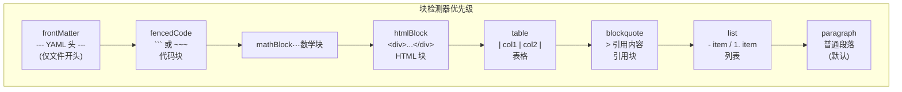
```mermaid
graph TB
    subgraph 块检测器["块检测器优先级"]
        FrontMatter["frontMatter<br/>--- YAML 头 ---<br/>(仅文件开头)"]
        FencedCode["fencedCode<br/>``` 或 ~~~<br/>代码块"]
        MathBlock["mathBlock<br/>$$...$$<br/>数学块"]
        HTMLBlock["htmlBlock<br/>&lt;div&gt;...&lt;/div&gt;<br/>HTML 块"]
        Table["table<br/>| col1 | col2 |<br/>表格"]
        Blockquote["blockquote<br/>&gt; 引用内容<br/>引用块"]
        List["list<br/>- item / 1. item<br/>列表"]
        Paragraph["paragraph<br/>普通段落<br/>(默认)"]
    end
    
    FrontMatter --> FencedCode --> MathBlock --> HTMLBlock --> Table --> Blockquote --> List --> Paragraph
```

**各检测器的识别逻辑**

| 检测器 | 起始标识 | 结束条件 | 特殊处理 |
|-------|---------|---------|---------|
| **frontMatter** | 文件首行为 `---` | 遇到下一个 `---` | 仅在文件开头有效 |
| **fencedCode** | 行首 `` ``` `` 或 `~~~` | 匹配同类型闭合标记 | 支持语言标识、闭合标记长度匹配 |
| **mathBlock** | 单独 `$$` 行 | 遇到下一个 `$$` | 用于 LaTeX 块级公式 |
| **htmlBlock** | 块级 HTML 标签起始 | 空行或文件结束 | 识别 30+ 块级标签 |
| **table** | 行首 `\|` 字符 | 行不以 `\|` 开头 | 连续的表格行合为一块 |
| **blockquote** | 行首 `>` 字符 | 非引用行（支持懒续行） | 空行后继续引用则合并 |
| **list** | 列表标记 (`-`, `*`, `+`, `1.` 等) | 非缩进非列表项文本 | 最复杂的检测逻辑 |
| **indentedCode** | 4 空格或 Tab 缩进 | 非缩进行 | 优先级低于列表 |
| **heading** | 行首 `#` 字符 | 单行块 | 标题总是独立成块 |

#### 3.2.3 列表检测算法

列表检测是所有块类型中最复杂的，因为 Markdown 列表有多种形态和边缘情况。一个健壮的列表检测器需要处理以下挑战：

**挑战一：多样的列表标记**

Markdown 标准支持 `-`、`*`、`+` 三种无序列表标记，以及 `1.` 格式的有序列表。此外，为了兼容从其他来源粘贴的内容（如 Word 文档、网页），分割器还支持 Unicode 项目符号：`•`、`◦`、`▪`、`▸`、`►`、`○`、`●` 等。检测器使用统一的正则表达式匹配所有变体。

**挑战二：松散列表与紧凑列表**

紧凑列表的各项之间没有空行，而松散列表的项之间有空行分隔。两者都是有效的 Markdown 语法，但松散列表在渲染时每项会包裹在 `<p>` 标签中。检测器需要识别空行后是否还有列表项，如果有则继续当前列表块。

**挑战三：列表延续内容**

列表项的内容可以跨越多行。非列表标记的文本行，如果有适当缩进，应视为前一列表项的延续而非新的段落。例如：

```markdown
- 第一项
  这是第一项的延续内容
- 第二项
```

检测器通过 `isIndentedContent()` 函数识别缩进内容（2 个空格或 Tab），将其归入当前列表块。

**挑战四：嵌套列表**

列表可以无限嵌套，子列表通过缩进表示。检测器不需要解析嵌套结构（那是 remark 解析器的职责），只需确保整个嵌套结构被识别为单一块。这通过持续追踪缩进内容实现。

### 3.3 文档模型 (MarkdownDocument)

`MarkdownDocument` (`src/core/markdown-document.ts`) 是增量渲染系统的核心数据结构，它维护文档在内存中的块级表示，并计算文档变化时的最小更新操作。这种设计借鉴了虚拟 DOM 的理念，但针对 Markdown 文档的特性进行了优化。

**设计目标**

1. **高效的变化检测**：通过内容哈希快速判断块是否发生变化
2. **稳定的块标识**：即使文档结构变化，已有块的 ID 尽可能保持不变
3. **最小化 DOM 操作**：生成精确的更新指令，避免不必要的重渲染
4. **支持滚动同步**：维护源码行号与块的映射关系

#### 3.3.1 BlockMeta 数据结构

每个语义块在内存中以 `BlockMeta` 结构存储。这个结构包含了渲染和同步所需的所有信息：

| 字段 | 类型 | 说明 |
|-----|------|------|
| `id` | string | 稳定唯一标识符，格式为 `block-{n}`。同一位置的块在多次更新中保持相同 ID。 |
| `hash` | string | 内容哈希值，由 `hashCode()` 函数计算。用于快速判断块内容是否变化。 |
| `startLine` | number | 源码起始行号（0-based）。用于滚动同步的行号映射。 |
| `lineCount` | number | 块在源码中占用的行数。与 `startLine` 配合计算块的行号范围。 |
| `content` | string | 原始 Markdown 内容，用于 Diff 计算和调试。 |
| `html` | string? | 渲染后的 HTML 内容（可选）。缓存渲染结果避免重复处理。 |
| `hasPlaceholder` | boolean? | 是否包含异步占位符。用于判断块是否需要等待异步渲染完成。 |

#### 3.3.2 DOM 命令系统

文档模型与 DOM 操作完全解耦。当文档内容更新时，`MarkdownDocument` 不直接操作 DOM，而是生成一系列「DOM 命令」，由平台层（Chrome/VS Code/Mobile）的渲染器执行。这种设计有几个重要优势：

**平台无关性**：相同的文档模型可以在不同平台上使用，只需实现对应的命令执行器。Chrome 扩展直接操作 `document`，VS Code 扩展通过 Webview 消息传递，Mobile 应用通过 Flutter WebView 通道。

**可测试性**：DOM 命令是纯数据结构，可以在无 DOM 环境中进行单元测试。只需验证给定输入产生预期的命令序列。

**可调试性**：命令序列可以被记录和回放，便于追踪渲染问题。

系统支持六种 DOM 命令，每种命令都有明确的语义：

| 命令类型 | 参数 | 操作说明 |
|---------|------|---------|
| `clear` | 无 | 清空整个内容容器，用于首次渲染或文档完全重置 |
| `append` | blockId, html, attrs | 在容器末尾追加新块，attrs 包含 data-block-id 等属性 |
| `insertBefore` | blockId, html, refId, attrs | 在指定块前插入新块，用于中间位置的插入操作 |
| `remove` | blockId | 删除指定块，用于文档内容删减 |
| `replace` | blockId, html, attrs | 替换指定块的内容，用于块内容变化 |
| `updateAttrs` | blockId, attrs | 仅更新块的属性，不改变内容（如行号更新） |

#### 3.3.3 增量更新算法

增量更新是文档模型的核心能力。当用户编辑文档时，系统需要快速计算出最小的 DOM 更新操作，避免不必要的重渲染。这个过程分为四个阶段：

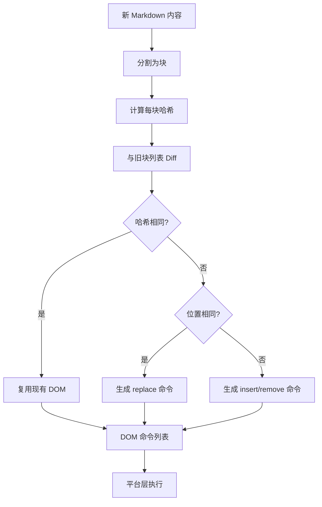
```mermaid
flowchart TB
    Input[新 Markdown 内容] --> Split[分割为块]
    Split --> Hash[计算每块哈希]
    Hash --> Diff[与旧块列表 Diff]
    
    Diff --> Keep{哈希相同?}
    Keep -->|是| Reuse[复用现有 DOM]
    Keep -->|否| Check{位置相同?}
    
    Check -->|是| Replace[生成 replace 命令]
    Check -->|否| InsertRemove[生成 insert/remove 命令]
    
    Reuse --> Commands[DOM 命令列表]
    Replace --> Commands
    InsertRemove --> Commands
    
    Commands --> Execute[平台层执行]
```

**阶段一：块分割与哈希计算**

新的 Markdown 内容首先经过块级分割器，得到一个 `BlockWithLine[]` 数组。每个块计算其内容哈希值。哈希函数采用快速的字符串哈希算法（djb2 变体），在保证碰撞率可接受的前提下实现 O(n) 时间复杂度。

**阶段二：Diff 算法**

系统使用基于最长公共子序列（LCS）的 Diff 算法比较新旧块列表。算法的核心思路是：以内容哈希为键，找出新旧列表中相同的块（保持操作），剩余的块则是需要插入或删除的。

Diff 算法的优化点：

- 首先比较列表首尾的块，快速处理常见的「末尾追加」和「开头插入」场景
- 使用 Map 建立哈希到块的索引，将查找复杂度从 O(n²) 降低到 O(n)
- 对于大量变化的情况（如粘贴整段内容），退化为全量更新以避免复杂计算

**阶段三：ID 分配与命令生成**

Diff 结果确定后，系统为新块分配 ID 并生成 DOM 命令：

- **keep 操作**：新块继承旧块的 ID，不生成 DOM 命令（或仅更新行号属性）
- **insert 操作**：为新块分配新 ID，生成 `append` 或 `insertBefore` 命令
- **delete 操作**：生成 `remove` 命令
- **replace 操作**：当块位置不变但内容变化时，继承旧 ID 并生成 `replace` 命令

**阶段四：命令执行**

生成的命令列表传递给平台层的渲染器执行。渲染器遍历命令，对真实 DOM 进行操作。执行顺序经过优化，先处理删除操作，再处理插入和替换，最后更新属性。

**性能优化效果**

| 编辑场景 | 传统方式 | 增量更新 |
|---------|---------|---------|
| 修改单个段落 | 重渲染整个文档 | 仅更新 1 个块 |
| 在中间插入段落 | 重渲染整个文档 | 插入 1 个块 + 更新后续块行号 |
| 删除多个段落 | 重渲染整个文档 | 删除对应块 |
| 修改代码块中的代码 | 重渲染整个文档 | 仅更新该代码块 |

### 3.4 异步任务管理器

图表渲染（Mermaid、Vega、Graphviz 等）是 CPU 密集型操作。如果在主线程同步执行这些操作，会导致界面冻结，影响用户体验。

`AsyncTaskManager`（定义在 `src/core/markdown-processor.ts`）采用「占位符 + 异步回填」的策略解决这个问题：在 Markdown 处理阶段，图表代码块被替换为轻量级的占位符 HTML；处理完成后，任务管理器并行执行所有图表渲染，将结果回填到对应的占位符位置。

**设计优势**

1. **非阻塞渲染**：Markdown 处理阶段快速完成，用户可以立即看到文本内容
2. **并行执行**：多个图表同时渲染，充分利用多核 CPU
3. **进度反馈**：支持进度回调，可显示渲染进度条
4. **优雅取消**：用户快速连续编辑时，能够取消过期的渲染任务

#### 3.4.1 处理流程

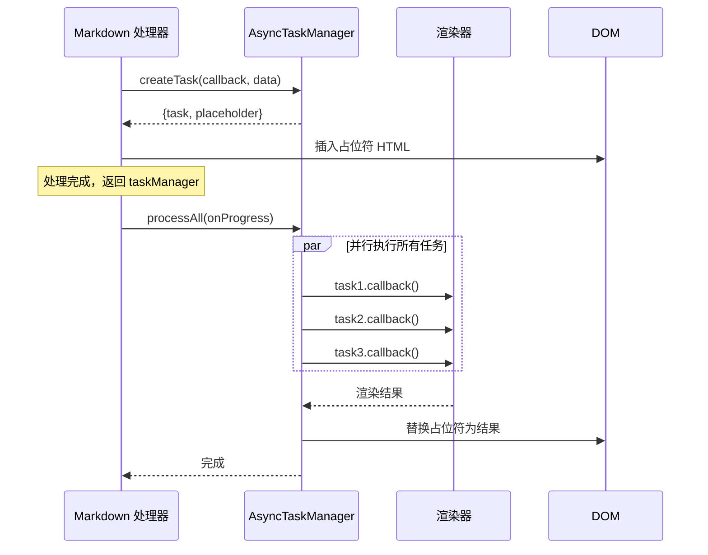
```mermaid
sequenceDiagram
    participant P as Markdown 处理器
    participant M as AsyncTaskManager
    participant R as 渲染器
    participant D as DOM
    
    P->>M: createTask(callback, data)
    M-->>P: {task, placeholder}
    P->>D: 插入占位符 HTML
    
    Note over P: 处理完成，返回 taskManager
    
    P->>M: processAll(onProgress)
    
    par 并行执行所有任务
        M->>R: task1.callback()
        M->>R: task2.callback()
        M->>R: task3.callback()
    end
    
    R-->>M: 渲染结果
    M->>D: 替换占位符为结果
    M-->>P: 完成
```

#### 3.4.2 任务生命周期

每个异步任务经历以下状态转换：

| 状态 | 说明 | 触发条件 |
|-----|------|---------|
| `ready` | 准备就绪，等待执行 | 任务创建时的默认状态 |
| `fetching` | 正在获取外部资源 | 图表定义为 URL 引用时，需要先 fetch 内容 |
| `processing` | 正在渲染 | 调用渲染器的 render() 方法 |
| `completed` | 渲染完成 | 渲染器返回结果 |
| `error` | 渲染失败 | 渲染器抛出异常或超时 |

#### 3.4.3 取消机制

当用户快速连续编辑时，前一次渲染可能尚未完成，新的渲染请求已经到来。如果不处理这种情况，会导致：

1. **资源浪费**：旧的渲染任务继续执行，消耗 CPU
2. **结果覆盖**：旧任务完成后可能覆盖新任务的结果
3. **状态混乱**：占位符 ID 冲突导致 DOM 操作错误

任务管理器通过 `TaskContext` 实现优雅取消。每个任务创建时绑定当前的 context 对象，渲染回调在关键检查点检查 `context.cancelled` 标志。当调用 `abort()` 方法时，context 被标记为已取消，所有绑定该 context 的任务将跳过后续操作。

这种设计的关键在于：取消是「协作式」的，而非「强制式」的。渲染器可以在安全的时机检查取消状态，完成必要的清理工作后退出，避免资源泄漏。

#### 3.4.4 典型使用场景

**场景一：首次打开文档**

用户打开一个包含 10 个 Mermaid 图表的文档。处理器快速完成 Markdown 解析，插入 10 个占位符（显示 loading 动画）。随后任务管理器并行启动 10 个渲染任务，待所有图表渲染完成后，占位符依次被替换为实际图片。

**场景二：连续快速编辑**

用户在编辑一段文字时快速输入。每次按键都触发一次渲染请求：

1. 第一次按键：启动渲染周期 A
2. 第二次按键：调用 `abort()` 取消周期 A，启动周期 B
3. 第三次按键：取消周期 B，启动周期 C
4. 用户停止输入，周期 C 正常完成

通过取消机制，只有最后一次的渲染任务会执行完成，避免了大量无效的 CPU 消耗。

**场景三：外部资源获取**

某个 Vega 图表的数据源是一个 URL。任务状态先设为 `fetching`，等待 fetch 完成后转为 `ready`。如果在 fetch 过程中收到取消信号，fetch 结果会被丢弃，不会触发后续渲染。

### 3.5 HTML 结果缓存

Markdown 处理涉及多个步骤：解析、AST 转换、HTML 生成、后处理等。对于频繁编辑的场景，如果每次都完整执行整个流水线，会产生不必要的计算开销。`HtmlResultCache` 通过缓存块级渲染结果，实现「内容不变则复用」的优化策略。

#### 3.5.1 LRU 缓存策略

缓存采用 LRU（Least Recently Used，最近最少使用）淘汰策略。当缓存容量达到上限时，优先淘汰最长时间未被访问的条目。这种策略基于「时间局部性」假设：最近使用的数据更可能在未来再次使用。

对于 Markdown 编辑场景，这个假设非常合理：

- 用户通常在文档的某个区域集中编辑
- 编辑区域周围的块会被频繁重新渲染
- 远离编辑区域的块虽然不变，但访问频率低

**实现细节**

缓存基于 JavaScript 的 `Map` 数据结构实现。`Map` 保持键值对的插入顺序，这使得 LRU 实现非常简洁：

- **读取时**：如果命中，先删除再重新插入，将条目移到末尾（最近使用）
- **写入时**：检查容量，如果已满则删除第一个条目（最旧的）

项目配置的默认缓存容量为 5000 个块。对于一份包含 200 个块的大型文档，可以同时缓存 25 个不同版本的完整渲染结果，足以覆盖大多数编辑场景。

#### 3.5.2 缓存 Key 设计

缓存 Key 由块的原始 Markdown 内容计算得到。使用哈希函数将任意长度的文本映射为固定长度的数字，作为 Map 的键。这种设计确保：

- **内容相同 → Key 相同**：相同内容的块必然命中缓存
- **快速计算**：哈希函数是 O(n) 复杂度，n 为内容长度
- **低碰撞率**：使用成熟的字符串哈希算法，实际碰撞概率极低

#### 3.5.3 不可缓存的情况

并非所有块的渲染结果都可以缓存。以下情况会跳过缓存：

**异步占位符块**

包含图表代码的块在处理后会生成占位符 HTML，而非最终图片。占位符的 ID 是动态生成的（如 `async-placeholder-1`），每次渲染周期都不同。如果缓存占位符 HTML，下次使用时 ID 会与新创建的异步任务不匹配，导致回填失败。

**外部资源引用**

如果块中的图片、链接等引用外部资源，而资源内容可能变化（如 CDN 上的图片被更新），缓存的 HTML 可能包含过时的内容。不过目前项目未针对这种情况做特殊处理，因为 Markdown 内容本身未变化时，外部资源的更新通常通过刷新页面来获取。

#### 3.5.4 缓存失效

缓存在以下情况下会被清空：

- **设置变更**：主题切换、字体大小调整等会影响渲染结果
- **语言切换**：i18n 文案变化影响错误提示等内容
- **手动刷新**：用户显式触发重新渲染

缓存失效通过 `clearHtmlResultCache()` 函数实现，该函数在设置变更的事件处理器中被调用。

### 3.6 滚动同步

滚动同步是提升用户体验的关键功能：当用户在编辑器中滚动时，预览窗口自动跟随到对应位置；反过来，当用户在预览窗口滚动时，编辑器也会同步显示对应的源码区域。这种双向联动让用户可以在编辑和预览之间无缝切换，无需手动定位。

滚动同步的核心挑战在于：**编辑器和预览窗口的「高度」不同**。源码中的一行可能在预览中占据很大空间（如一个复杂的表格），也可能被压缩（如连续的空行）。因此，不能简单地按「行号比例」映射滚动位置，而需要基于渲染后的实际布局进行计算。

本项目采用「块级映射 + 块内插值」的策略实现精确同步。每个渲染块都记录了其对应的源码行号范围，通过这个映射关系，可以在像素位置和行号之间双向转换。相关实现位于 `src/core/line-based-scroll.ts` 和 `src/core/markdown-document.ts`。

#### 3.6.1 映射原理

滚动同步基于两个关键概念：

**块 ID (blockId)**：每个渲染块在 DOM 中都有唯一的 `data-block-id` 属性，用于标识该块。

**块内进度 (progress)**：一个 0-1 之间的数值，表示当前位置在块内的相对位置。0 表示块的顶部，1 表示块的底部。

通过 `blockId + progress` 的组合，可以精确表示预览窗口中的任意位置。同样，源码中的行号也可以分解为「块索引 + 块内进度」的形式。这样，位置映射问题就转化为两个转换函数：

- `getLineFromBlockId(blockId, progress) → line`：预览位置 → 源码行号
- `getBlockPositionFromLine(line) → { blockId, progress }`：源码行号 → 预览位置

#### 3.6.2 双向同步机制

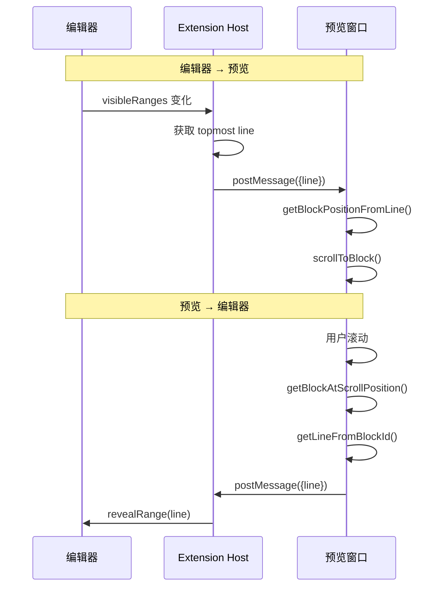
```mermaid
sequenceDiagram
    participant Editor as 编辑器
    participant Host as Extension Host
    participant Preview as 预览窗口
    
    Note over Editor,Preview: 编辑器 → 预览
    Editor->>Host: visibleRanges 变化
    Host->>Host: 获取 topmost line
    Host->>Preview: postMessage({line})
    Preview->>Preview: getBlockPositionFromLine()
    Preview->>Preview: scrollToBlock()
    
    Note over Editor,Preview: 预览 → 编辑器
    Preview->>Preview: 用户滚动
    Preview->>Preview: getBlockAtScrollPosition()
    Preview->>Preview: getLineFromBlockId()
    Preview->>Host: postMessage({line})
    Host->>Editor: revealRange(line)
```

**编辑器 → 预览 同步流程**

1. 用户在编辑器中滚动，触发 `visibleRanges` 变化事件
2. Extension Host 获取当前可见区域的最上方行号 (topmost line)
3. 通过消息通道发送行号到预览 Webview
4. 预览窗口调用 `getBlockPositionFromLine()` 将行号转换为 `{blockId, progress}`
5. 调用 `scrollToBlock()` 滚动到目标块的对应位置

**预览 → 编辑器 同步流程**

1. 用户在预览窗口滚动，触发 scroll 事件
2. 调用 `getBlockAtScrollPosition()` 获取当前滚动位置对应的块和进度
3. 调用 `getLineFromBlockId()` 将块位置转换为源码行号
4. 通过消息通道发送行号到 Extension Host
5. Host 调用 `revealRange()` 让编辑器显示对应行

#### 3.6.3 进度计算

块内进度的计算基于像素位置。假设当前滚动位置为 `scrollTop`，目标块的顶部位置为 `blockTop`，块高度为 `blockHeight`，则：

$$\text{progress} = \frac{\text{scrollTop} - \text{blockTop}}{\text{blockHeight}}$$

当 `scrollTop` 刚好在块顶部时，$\text{progress} = 0$；当 `scrollTop` 在块底部时，$\text{progress} = 1$。

反向计算（给定 progress 求滚动位置）：

$$\text{scrollTop} = \text{blockTop} + \text{progress} \times \text{blockHeight}$$

这种线性插值假设块内内容均匀分布。虽然实际情况并非如此（如代码块内部可能有长短不一的行），但对于大多数文档，这种近似已经足够精确。

#### 3.6.4 平台差异处理

不同平台的滚动实现略有差异，系统通过 `useWindowScroll` 参数进行适配：

| 平台 | 滚动容器 | 获取滚动位置 | 设置滚动位置 |
|-----|---------|------------|------------|
| **Chrome 扩展** | 整个窗口 | `window.scrollY` | `window.scrollTo()` |
| **VS Code 扩展** | Webview 内容容器 | `container.scrollTop` | `container.scrollTo()` |
| **Mobile 应用** | WebView 内容容器 | `container.scrollTop` | `container.scrollTo()` |

Chrome 扩展直接渲染为一个完整的网页，滚动发生在 `window` 级别。而 VS Code 和 Mobile 的预览窗口是嵌入式 Webview，有独立的内容容器，滚动发生在容器内部。

#### 3.6.5 防抖与性能优化

滚动事件触发频率很高（可达每秒数十次），直接处理会导致性能问题。系统采用以下优化措施：

1. **防抖处理**：滚动事件触发后等待短暂时间（如 50ms），如果期间没有新事件则执行同步，否则重置计时器
2. **阈值过滤**：如果计算出的目标行号与上次同步的行号相差不大（如小于 3 行），则跳过本次同步
3. **方向锁定**：当检测到用户正在进行连续滚动时，临时禁用反向同步，避免循环触发

---

## 第四章 插件系统

插件系统是 Markdown Viewer Extension 的核心架构之一，负责识别和处理文档中的各类图表代码块。通过精心设计的插件机制，系统能够将 Mermaid、Vega、Graphviz 等多种图表语言统一转换为可视化图片，同时保持代码的可维护性和可扩展性。

本章将深入介绍插件系统的设计理念、核心接口、各插件实现，以及完整的处理流程。

### 4.1 设计理念

插件系统采用 **集中注册、单次 AST 遍历** 的架构设计，在保证处理效率的同时，实现了良好的模块化和可扩展性。

#### 4.1.1 架构设计背景

在技术文档中，图表内容通常以代码块的形式嵌入，例如 ` ```mermaid ` 或 ` ```vega-lite `。传统的处理方式是为每种图表类型单独编写处理逻辑，这导致了代码重复和维护困难。

本项目采用了基于抽象类的插件架构，所有图表处理器都继承自统一的 `BasePlugin` 基类，共享通用的节点提取、任务创建和渲染接口。这种设计带来了以下优势：

- **代码复用**：公共逻辑集中在基类，子类只需实现差异化部分
- **统一管理**：所有插件在 `src/plugins/index.ts` 中集中注册
- **易于扩展**：新增图表类型只需创建新的插件类并注册即可
- **性能优化**：通过单次 AST 遍历处理所有图表，避免重复遍历开销

#### 4.1.2 核心设计原则

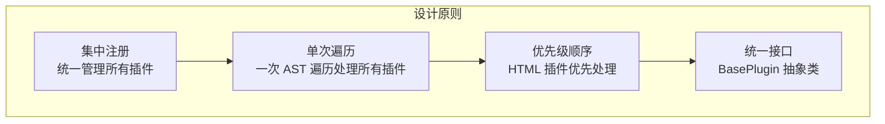
```mermaid
flowchart TB
    subgraph 设计原则
        P1[集中注册<br/>统一管理所有插件]
        P2[单次遍历<br/>一次 AST 遍历处理所有插件]
        P3[优先级顺序<br/>HTML 插件优先处理]
        P4[统一接口<br/>BasePlugin 抽象类]
    end
    
    P1 --> P2 --> P3 --> P4
```

**设计原则详解：**

1. **集中注册**：所有插件实例在 `plugins` 数组中统一声明，便于管理和调试。新增或移除插件只需修改数组内容，无需改动其他代码。

2. **单次遍历**：Markdown 文档解析为 AST（抽象语法树）后，系统只进行一次遍历，在遍历过程中依次检查每个节点是否匹配某个插件。这种设计避免了为每种图表类型单独遍历带来的性能损耗。

3. **优先级顺序**：插件数组中的顺序决定了处理优先级。当一个节点匹配多个插件时，排在前面的插件优先处理。这对于避免处理冲突至关重要。

4. **统一接口**：所有插件都实现相同的接口方法，包括 `extractContent()`、`createTaskData()`、`renderToCommon()` 等，使得调用方可以透明地处理不同类型的图表。

#### 4.1.3 插件注册与优先级

插件按照特定顺序注册到系统中，这个顺序直接决定了处理优先级。当一个 AST 节点可能被多个插件匹配时，系统会按照注册顺序依次检查，第一个成功匹配的插件将获得处理权。

当前系统注册了以下七个插件，按优先级从高到低排列：

| 优先级 | 插件 | 处理目标 | 说明 |
|:---:|------|---------|------|
| 1 | HtmlPlugin | 原生 HTML 块 | 必须优先，避免处理其他插件生成的 HTML 占位符 |
| 2 | MermaidPlugin | ` ```mermaid ` 代码块 | 流程图、时序图、类图等 |
| 3 | VegaLitePlugin | ` ```vega-lite ` 代码块 | 高级数据可视化语法 |
| 4 | VegaPlugin | ` ```vega ` 代码块 | 完整 Vega 规范 |
| 5 | SvgPlugin | ` ```svg ` 代码块和 `.svg` 图片 | 矢量图形 |
| 6 | DotPlugin | ` ```dot ` 代码块 | Graphviz 图表 |
| 7 | InfographicPlugin | ` ```infographic ` 代码块 | AntV 信息图 |

**为什么 HTML 插件必须优先？**

HTML 插件的优先级设计是整个系统正确运行的关键。原因在于：

1. **HTML 块的原生性**：Markdown 文档中可能包含原生的 HTML 代码块，这些内容应该保持原样渲染，而不是被误识别为其他类型。

2. **占位符冲突**：其他插件在处理图表时会生成 HTML 占位符（如 `<div id="async-placeholder-1">`），如果 HTML 插件不优先执行，它可能会在后续遍历中错误地处理这些占位符。

3. **处理时序**：在单次 AST 遍历中，HTML 节点和 code 节点是独立的节点类型。HTML 插件只处理 `html` 类型节点，其他插件主要处理 `code` 类型节点，优先级确保了处理逻辑不会交叉干扰。

### 4.2 BasePlugin 抽象类

`BasePlugin` 是所有插件的基类，定义在 `src/plugins/base-plugin.ts` 中。它采用模板方法模式，将通用逻辑封装在基类中，而将差异化行为通过可覆盖的方法暴露给子类。

这种设计使得大多数插件只需要简单地继承基类并指定类型标识符即可工作，而复杂的插件可以通过覆盖特定方法来实现自定义行为。

#### 4.2.1 核心接口定义

基类定义了插件的完整生命周期接口，从节点识别到最终渲染：

| 属性/方法 | 类型 | 说明 | 默认行为 |
|----------|------|------|---------|
| `type` | string | 插件类型标识符 | 构造时指定 |
| `nodeSelector` | getter | 要处理的 AST 节点类型数组 | `['code']` |
| `language` | getter | 代码块的语言标识 | 等于 `type` |
| `extractContent()` | method | 从 AST 节点提取内容 | 匹配语言后返回 `value` |
| `createTaskData()` | method | 创建异步渲染任务数据 | `{ code: content }` |
| `isInline()` | method | 是否行内渲染 | `false`（块级） |
| `isUrl()` | method | 内容是否为需要获取的 URL | `false` |
| `fetchContent()` | method | 获取 URL 对应的内容 | 抛出未实现异常 |
| `renderToCommon()` | method | 统一渲染入口 | 调用渲染器并返回结果 |

#### 4.2.2 节点选择器机制

`nodeSelector` 属性定义了插件关注的 AST 节点类型。默认值为 `['code']`，表示只处理代码块节点。某些插件需要处理多种节点类型，例如 SvgPlugin 需要同时处理代码块和图片节点。

当 AST 遍历到指定类型的节点时，系统会调用插件的 `extractContent()` 方法尝试提取内容。如果返回非空值，表示该插件可以处理这个节点。

#### 4.2.3 内容提取流程

`extractContent()` 是插件匹配的核心方法。默认实现执行以下检查：

1. **节点类型检查**：验证节点类型是否在 `nodeSelector` 数组中
2. **语言标识检查**：对于代码块节点，验证 `lang` 属性是否匹配插件的 `language`
3. **内容提取**：检查通过后返回节点的 `value` 属性

子类可以覆盖此方法实现更复杂的匹配逻辑，例如 VegaLitePlugin 支持 `vega-lite` 和 `vegalite` 两种语言标识，SvgPlugin 则需要检查图片 URL 是否以 `.svg` 结尾。

### 4.3 插件实现详解

每个插件继承自 `BasePlugin`，实现特定图表类型的处理逻辑。由于基类提供了完善的默认实现，大多数插件只需要极少的代码即可完成配置。

#### 4.3.1 MermaidPlugin

MermaidPlugin 处理 Mermaid 流程图、时序图、类图、状态图、甘特图、ER 图、饼图、思维导图等多种图表类型。Mermaid 是目前最流行的文本图表语言，其语法简洁直观，广泛应用于技术文档和软件设计。

由于 Mermaid 代码块的识别规则完全符合基类默认行为（匹配 ` ```mermaid ` 语言标识），因此插件实现非常简洁：

```typescript
export class MermaidPlugin extends BasePlugin {
  constructor() {
    super('mermaid');
  }
}
```

**支持的图表类型**：flowchart（流程图）、sequenceDiagram（时序图）、classDiagram（类图）、stateDiagram（状态图）、gantt（甘特图）、erDiagram（ER 图）、pie（饼图）、mindmap（思维导图）、gitGraph（Git 分支图）等。

#### 4.3.2 VegaPlugin 与 VegaLitePlugin

这两个插件处理基于 Vega 语法的数据可视化图表。Vega 是一套声明式的数据可视化语法，基于图形语法（Grammar of Graphics）理论设计，能够创建丰富的统计图表。

**VegaPlugin** 处理完整的 Vega 规范，提供底层的完整控制能力，适合需要精细定制的复杂可视化场景。

**VegaLitePlugin** 处理 Vega-Lite 规范，这是 Vega 的高级语法糖，用更简洁的配置实现常见图表。特别之处在于它支持两种语言标识：

```typescript
export class VegaLitePlugin extends BasePlugin {
  constructor() {
    super('vega-lite');
  }
  
  extractContent(node: AstNode): string | null {
    // 同时支持 'vega-lite' 和 'vegalite' 两种写法
    if (node.type === 'code' && (node.lang === 'vega-lite' || node.lang === 'vegalite')) {
      return node.value || null;
    }
    return null;
  }
}
```

这种兼容性设计考虑到不同用户的书写习惯，带连字符的 `vega-lite` 与不带连字符的 `vegalite` 都能正确识别。

#### 4.3.3 DotPlugin (Graphviz)

DotPlugin 处理 Graphviz DOT 语言编写的图表。DOT 是一种经典的图形描述语言，特别适合绘制有向图、无向图、网络拓扑图、状态机等结构化图形。其布局算法经过数十年的优化，能够自动计算最优的节点位置。

```typescript
export class DotPlugin extends BasePlugin {
  constructor() {
    super('dot');
  }
}
```

**支持的语言标识**：` ```dot `、` ```graphviz `、` ```gv `（通过渲染器层面的别名支持）

#### 4.3.4 SvgPlugin

SvgPlugin 是插件系统中最复杂的实现，因为它需要处理两种完全不同的内容来源：SVG 代码块和 SVG 图片文件。

**双重节点选择器**：与其他插件只处理代码块不同，SvgPlugin 需要同时监听 `code` 和 `image` 两种节点类型。当遇到 ` ```svg ` 代码块时提取 SVG 代码，当遇到 `` 图片引用时提取 URL。

**动态行内判断**：渲染结果的展示方式取决于内容来源。代码块中的 SVG 作为独立图表，应该以块级元素居中显示；而图片引用的 SVG 保持原有的行内语义，作为行内元素显示。插件通过记录当前处理的节点类型来实现这种动态判断。

**URL 内容获取**：对于图片引用方式，插件需要通过网络或本地文件系统获取 SVG 文件内容。这涉及到平台抽象层的 `DocumentService`，以确保在浏览器扩展、VS Code 扩展和移动端都能正确读取文件。

```typescript
export class SvgPlugin extends BasePlugin {
  private _currentNodeType: string | null = null;

  get nodeSelector() { return ['code', 'image']; }

  extractContent(node) {
    this._currentNodeType = node.type;
    
    // SVG 代码块
    if (node.type === 'code' && node.lang === 'svg') {
      return node.value || null;
    }
    // SVG 图片文件
    if (node.type === 'image' && node.url?.toLowerCase().endsWith('.svg')) {
      return node.url;
    }
    return null;
  }

  isInline() { return this._currentNodeType === 'image'; }
  isUrl(content) { return content.includes('/') || content.includes('\\'); }
}
```

#### 4.3.5 HtmlPlugin

HtmlPlugin 处理 Markdown 文档中直接嵌入的 HTML 代码。与其他插件不同，它监听的是 `html` 类型节点而非 `code` 类型。

在 Markdown 语法中，可以直接书写 HTML 代码，这些代码在解析时会被识别为独立的 HTML 节点。HtmlPlugin 的职责是识别这些节点，并通过安全过滤确保内容不包含恶意脚本。

**安全过滤**：插件内部调用 `sanitizeAndCheck()` 函数对 HTML 内容进行清理，移除潜在的 XSS 攻击代码、危险标签和空白内容。只有通过安全检查且包含有意义内容的 HTML 才会被处理。

```typescript
export class HtmlPlugin extends BasePlugin {
  constructor() { super('html'); }
  
  get nodeSelector() { return ['html']; }
  
  extractContent(node) {
    if (node.type !== 'html') return null;
    const { hasContent } = sanitizeAndCheck(node.value?.trim() || '');
    return hasContent ? node.value : null;
  }
}
```

#### 4.3.6 InfographicPlugin

InfographicPlugin 处理基于 AntV Infographic 库的信息图表。这种图表类型专门用于创建数据卡片、统计图表、信息图等适合汇报演示的可视化内容。

Infographic 使用独特的缩进式 DSL（领域特定语言）而非 JSON，语法更接近自然语言描述，降低了创建信息图表的门槛。

```typescript
export class InfographicPlugin extends BasePlugin {
  constructor() {
    super('infographic');
  }
}
```

**典型应用场景**：年度报告数据卡片、KPI 仪表盘、统计摘要图、信息长图等。

### 4.4 插件处理流程

插件系统的运行贯穿 Markdown 文档处理的多个阶段，从 AST 解析到最终的图片渲染。理解这个流程对于调试问题和扩展系统都至关重要。

#### 4.4.1 整体处理架构

插件处理分为三个主要阶段：

1. **AST 遍历阶段**：在 Markdown 解析完成后，系统遍历 AST 树，识别可处理的节点并创建异步任务
2. **HTML 生成阶段**：AST 转换为 HTML，图表节点被替换为占位符元素
3. **异步渲染阶段**：渲染器执行图表渲染，将结果回填到占位符位置

这种异步设计确保了页面能够快速呈现主体内容，而耗时的图表渲染在后台进行，完成后自动更新页面。

#### 4.4.2 完整处理流程

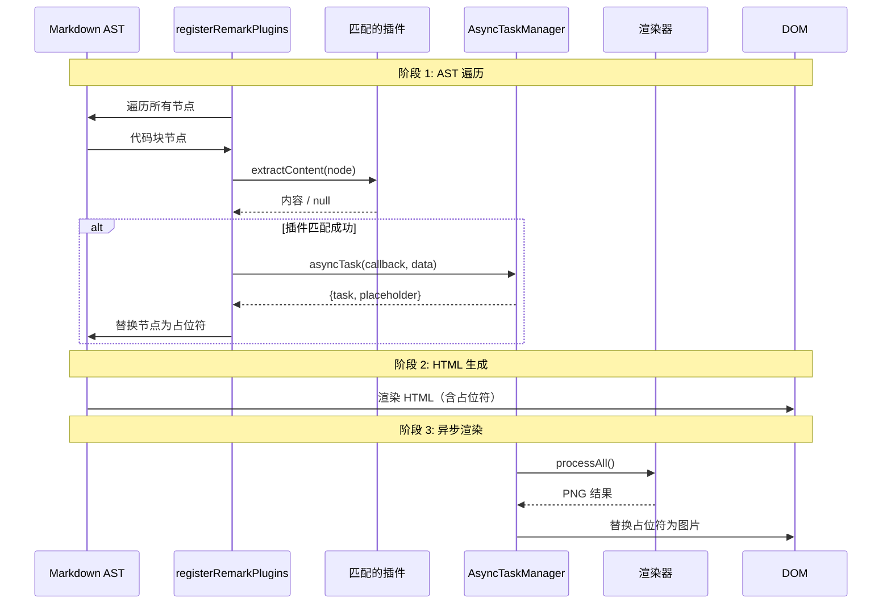
```mermaid
sequenceDiagram
    participant AST as Markdown AST
    participant Reg as registerRemarkPlugins
    participant Plugin as 匹配的插件
    participant Task as AsyncTaskManager
    participant Renderer as 渲染器
    participant DOM
    
    Note over AST,DOM: 阶段 1: AST 遍历
    Reg->>AST: 遍历所有节点
    AST->>Reg: 代码块节点
    Reg->>Plugin: extractContent(node)
    Plugin-->>Reg: 内容 / null
    
    alt 插件匹配成功
        Reg->>Task: asyncTask(callback, data)
        Task-->>Reg: {task, placeholder}
        Reg->>AST: 替换节点为占位符
    end
    
    Note over AST,DOM: 阶段 2: HTML 生成
    AST->>DOM: 渲染 HTML（含占位符）
    
    Note over AST,DOM: 阶段 3: 异步渲染
    Task->>Renderer: processAll()
    Renderer-->>Task: PNG 结果
    Task->>DOM: 替换占位符为图片
```

#### 4.4.3 节点匹配详解

在 AST 遍历阶段，`registerRemarkPlugins()` 函数创建了一个统一的 remark 插件。这个插件首先收集所有注册插件关注的节点类型（如 `code`、`image`、`html`），然后对每种类型进行遍历。

对于遇到的每个节点，系统按照插件注册顺序依次调用 `extractContent()` 方法：

- 如果返回 `null`，表示该插件不处理此节点，继续尝试下一个插件
- 如果返回非空内容，表示匹配成功，系统创建异步任务并停止检查后续插件

这种 "首次匹配即停止" 的策略确保了每个节点只被一个插件处理，避免了重复渲染。

#### 4.4.4 占位符机制

当插件匹配成功后，原始的 AST 节点被替换为一个占位符节点。这个占位符最终渲染为带有加载动画的 HTML 元素：

```html
<div id="async-placeholder-1" 
     class="async-placeholder mermaid-placeholder"
     data-source-hash="abc123"
     data-plugin-type="mermaid">
  <div class="async-loading">
    <div class="async-spinner"></div>
    <div class="async-text">Processing Mermaid...</div>
  </div>
</div>
```

占位符包含以下关键信息：

- **唯一 ID**：用于后续定位和替换
- **源内容哈希**：用于增量渲染时判断内容是否变化
- **插件类型**：用于样式和调试

#### 4.4.5 URL 内容的特殊处理

对于 SvgPlugin 处理的 SVG 图片引用，内容本身是一个 URL 而非实际的图表代码。这种情况需要额外的网络请求来获取内容。

系统通过以下机制处理这种异步获取：

1. **初始状态标记**：任务创建时状态为 `fetching` 而非 `ready`
2. **并行获取**：立即启动 `fetchContent()` 获取 URL 内容
3. **状态转换**：获取成功后更新任务数据并将状态设为 `ready`
4. **错误处理**：获取失败时将状态设为 `error`，显示错误信息

这种设计使得 URL 内容的获取与页面渲染并行进行，不会阻塞主流程。

### 4.5 UnifiedRenderResult 统一渲染结果

`UnifiedRenderResult` 是插件系统的核心数据结构之一，定义在 `src/types/render.ts` 中。它作为插件渲染的统一输出格式，支持 HTML 预览和 DOCX 导出两种完全不同的使用场景。

#### 4.5.1 设计动机

在项目早期，HTML 预览和 DOCX 导出使用不同的渲染路径，导致了大量的代码重复。为了解决这个问题，我们设计了 `UnifiedRenderResult` 作为中间格式——插件只需实现一次渲染逻辑，输出统一格式的结果，然后由不同的消费方（HTML 渲染器、DOCX 导出器）根据需要提取所需数据。

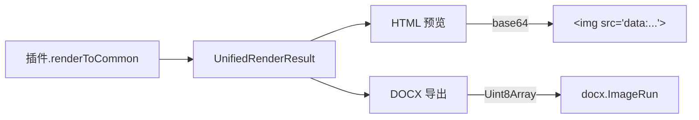
```mermaid
flowchart LR
    Plugin[插件.renderToCommon] --> Result[UnifiedRenderResult]
    
    Result --> HTML[HTML 预览]
    Result --> DOCX[DOCX 导出]
    
    HTML --> |base64| Img["&lt;img src='data:...'&gt;"]
    DOCX --> |Uint8Array| ImageRun[docx.ImageRun]
```

#### 4.5.2 类型结构

`UnifiedRenderResult` 包含三个核心字段：

**type** — 结果类型，指示渲染是否成功：

- `image`：渲染成功，content 包含图片数据
- `error`：渲染失败，content 包含错误信息
- `empty`：内容为空，无需渲染

**content** — 渲染内容，根据 type 不同包含不同数据：

- 成功时：`data`（Uint8Array，用于 DOCX）、`base64`（字符串，用于 HTML）、`width`、`height`、`format`
- 失败时：`text`（错误描述信息）
- 空内容时：空对象

**display** — 显示选项：

- `inline`：是否行内显示（true 为 `<span>`，false 为 `<div>`）
- `alignment`：对齐方式（`left`、`center`、`right`）

#### 4.5.3 结果类型对照

| type | 说明 | content 结构 | 典型场景 |
|------|------|-------------|---------|
| `image` | 渲染成功 | `{ data, base64, width, height, format }` | 正常的图表渲染 |
| `error` | 渲染失败 | `{ text: '错误描述' }` | 语法错误、渲染器异常 |
| `empty` | 内容为空 | `{}` | 空代码块、仅注释内容 |

#### 4.5.4 设计优势

这种统一格式的设计带来了多方面的好处：

1. **一次渲染，多处使用**：插件的 `renderToCommon()` 方法只需实现一次，结果可同时供 HTML 预览和 DOCX 导出使用

2. **解耦渲染与输出**：渲染逻辑不需要关心最终输出格式，专注于图表生成；输出格式转换由专门的工具函数处理

3. **统一的错误处理**：无论渲染成功或失败，都返回相同结构的结果，简化了调用方的错误处理逻辑

4. **完整的元数据**：结果中包含了宽度、高度、对齐方式等元数据，输出时无需额外计算

---

## 第五章 渲染器系统

渲染器系统是本项目图表功能的核心执行层。当用户在 Markdown 中编写 Mermaid、Vega、Graphviz 等图表代码时，渲染器负责将这些文本描述转换为可视化的图片输出。这一转换过程涉及多个技术挑战：不同图表库的 API 差异、异步渲染的复杂性、跨平台的兼容性、以及输出质量的一致性。

为了应对这些挑战，项目采用了 **模板方法设计模式（Template Method Pattern）**，通过抽象基类定义统一的渲染流程框架，由各具体渲染器实现特定的渲染逻辑。这种设计确保了：

- **接口一致性**：所有渲染器对外暴露相同的调用接口，调用方无需关心底层实现差异
- **代码复用**：通用功能（容器管理、缩放计算、SVG 转换等）在基类中实现一次，所有子类共享
- **扩展便利**：新增图表类型只需创建新的渲染器子类，无需修改现有代码

渲染器系统的完整实现位于 `src/renderers/` 目录下。

### 5.1 BaseRenderer 抽象类

`BaseRenderer` 是所有渲染器的基类，定义于 `src/renderers/base-renderer.ts`。它不仅规定了子类必须实现的抽象接口，还提供了一系列经过精心设计的工具方法，解决图表渲染中的共性问题。

#### 5.1.1 设计原则

`BaseRenderer` 的设计遵循以下原则：

1. **无状态渲染**：渲染器实例是共享的（单例），每次渲染使用独立的容器，确保并行渲染互不干扰
2. **懒加载初始化**：部分渲染器依赖较大的第三方库（如 WASM 模块），采用首次使用时初始化的策略
3. **失败快速**：通过 `validateInput()` 在渲染前进行输入验证，避免无效数据进入渲染流程
4. **资源自动清理**：容器创建与清理配对使用，防止 DOM 泄漏

#### 5.1.2 类继承结构

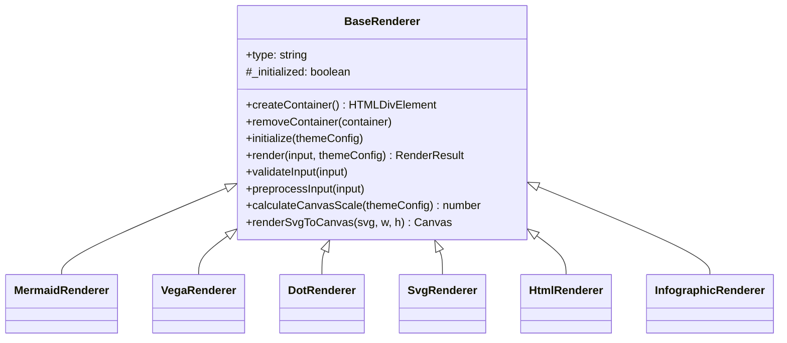
```mermaid
classDiagram
    class BaseRenderer {
        +type: string
        #_initialized: boolean
        +createContainer() HTMLDivElement
        +removeContainer(container)
        +initialize(themeConfig)
        +render(input, themeConfig) RenderResult
        +validateInput(input)
        +preprocessInput(input)
        +calculateCanvasScale(themeConfig) number
        +renderSvgToCanvas(svg, w, h) Canvas
    }
    
    class MermaidRenderer
    class VegaRenderer
    class DotRenderer
    class SvgRenderer
    class HtmlRenderer
    class InfographicRenderer
    
    BaseRenderer <|-- MermaidRenderer
    BaseRenderer <|-- VegaRenderer
    BaseRenderer <|-- DotRenderer
    BaseRenderer <|-- SvgRenderer
    BaseRenderer <|-- HtmlRenderer
    BaseRenderer <|-- InfographicRenderer
```

上图展示了渲染器的继承层次。`BaseRenderer` 作为抽象基类，定义了所有渲染器共有的属性和方法。六个具体渲染器分别处理不同类型的图表输入，它们继承基类的通用能力，并实现各自特定的渲染逻辑。

#### 5.1.3 离屏容器管理

图表渲染通常需要 DOM 环境来执行布局计算和样式应用。然而，我们不希望渲染过程中产生的临时元素影响用户界面。为此，`BaseRenderer` 实现了离屏容器机制：创建一个位于可视区域之外的 DOM 容器，在其中完成渲染工作，然后将结果导出为图片，最后清理容器。

离屏容器的实现有几个关键设计考量：

**唯一标识符生成**：每个容器使用时间戳加随机字符串作为 ID，确保并行渲染时不会产生 ID 冲突。这一点对于批量导出文档（可能同时渲染数十个图表）至关重要。

**定位策略**：容器使用绝对定位，坐标设为 (-9999px, -9999px)，将其移出可视区域。相比使用 `display: none` 或 `visibility: hidden`，这种方式确保元素仍然参与布局计算，图表库能够正确获取尺寸信息。

**生命周期管理**：容器在渲染开始时创建，渲染完成后立即清理。这种配对使用模式防止了 DOM 节点的累积，避免了潜在的内存泄漏问题。

```typescript
// Create off-screen container (supports parallel rendering)
createContainer(): HTMLDivElement {
  const container = document.createElement('div');
  container.id = 'render-container-' + Date.now() + '-' + Math.random().toString(36).substr(2, 9);
  container.style.cssText = 'position: absolute; left: -9999px; top: -9999px;';
  document.body.appendChild(container);
  return container;
}

// Cleanup container after rendering
removeContainer(container: HTMLElement): void {
  container.parentNode?.removeChild(container);
}
```

#### 5.1.4 缩放因子计算

图表最终会被嵌入到 Word 文档中。在这个过程中，图片尺寸会发生变化：DOCX 导出器默认会将 PNG 图片缩小到原尺寸的 1/4，以确保在不同 DPI 显示器上都能保持清晰。为了补偿这种缩小，渲染器在生成图片时需要预先放大。

缩放因子的计算公式为：$\frac{14}{16} \times \frac{\text{themeFontSize}}{12} \times 4$

这个公式包含三个组成部分：

- $\frac{14}{16}$：基础比例调整，确保与 Word 默认字号（14pt）的视觉一致性
- $\frac{\text{themeFontSize}}{12}$：字体大小的相对缩放，允许用户通过主题配置调整整体比例
- $4$：补偿 DOCX 导出时的 1/4 缩小

例如，当用户使用默认的 12pt 字号时，缩放因子约为 3.5；使用 14pt 字号时约为 4.08。这确保了无论用户选择什么字号，导出的图表都能保持适当的大小和清晰度。

```typescript
calculateCanvasScale(themeConfig: RendererThemeConfig | null): number {
  const baseFontSize = 12;
  const themeFontSize = themeConfig?.fontSize || baseFontSize;
  return (14.0 / 16.0) * (themeFontSize / baseFontSize) * 4.0;
}
```

#### 5.1.5 SVG 到 Canvas 的转换

大多数图表库（Mermaid、Graphviz、Infographic）的原生输出格式是 SVG。虽然 SVG 是矢量格式，理论上可以无损缩放，但在 Word 文档中，SVG 的支持并不完善。因此，渲染器需要将 SVG 转换为 PNG 位图格式。

`renderSvgToCanvas()` 方法实现了这一转换。其工作流程如下：

1. **Base64 编码**：将 SVG 字符串通过 `btoa(unescape(encodeURIComponent()))` 转换为 Base64 编码。这里的 `unescape(encodeURIComponent())` 组合处理非 ASCII 字符（如中文），确保编码过程不会丢失信息。

2. **Image 对象加载**：创建 `Image` 元素，将 Base64 编码的 SVG 作为数据 URI 设置为 `src`。图片加载是异步的，需要等待 `onload` 事件触发。

3. **Canvas 绘制**：创建指定尺寸的 Canvas 元素，使用 `drawImage()` 将加载完成的图片绘制到画布上。

4. **样式注入**：方法还会向 SVG 注入样式规则，确保 `foreignObject` 元素（用于嵌入 HTML 内容）能够正确溢出显示。

这种转换方式的优势在于利用浏览器原生的 SVG 渲染引擎，确保转换结果与浏览器显示完全一致。

```typescript
async renderSvgToCanvas(svgContent: string, width: number, height: number, 
                        fontFamily: string | null = null): Promise<HTMLCanvasElement> {
  // Inject style to ensure foreignObject content is visible
  svgContent = svgContent.replace(/<style>/, `<style>foreignObject { overflow: visible; }`);
  
  return new Promise((resolve, reject) => {
    const img = new Image();
    img.crossOrigin = 'Anonymous';

    // Convert SVG to base64 data URI
    const base64Svg = btoa(unescape(encodeURIComponent(svgContent)));
    img.src = `data:image/svg+xml;base64,${base64Svg}`;

    img.onload = () => {
      const canvas = document.createElement('canvas');
      canvas.width = width;
      canvas.height = height;
      const ctx = canvas.getContext('2d')!;
      
      if (fontFamily) {
        ctx.font = `14px ${fontFamily}`;
      }
      
      ctx.drawImage(img, 0, 0, width, height);
      resolve(canvas);
    };

    img.onerror = () => reject(new Error('Failed to load SVG into image'));
  });
}
```

### 5.2 渲染器实现

每个渲染器处理特定类型的图表输入，将源代码转换为 PNG 图片。虽然输入格式各异（Mermaid DSL、JSON、DOT 语言、HTML 等），但输出格式统一为 PNG，便于后续处理。下面详细介绍各渲染器的实现细节和技术要点。

#### 5.2.1 MermaidRenderer

`src/renderers/mermaid-renderer.ts` 处理 Mermaid 图表语法，支持流程图、时序图、类图、状态图、甘特图、ER 图等多种图表类型。Mermaid 是当前最流行的文本图表语言之一，其语法直观易学，非常适合在 Markdown 中嵌入使用。

**渲染流程**

MermaidRenderer 的渲染流程为：`Mermaid DSL → SVG → Canvas → PNG`

1. **预处理**：将代码中的 `\n` 字面量替换为 `<br>` 标签，支持节点标签内的换行显示
2. **主题配置**：调用 `applyThemeConfig()` 应用字体、背景等主题设置
3. **SVG 生成**：调用 `mermaid.render()` 生成 SVG
4. **字体等待**：调用 `document.fonts.ready` 等待 Web 字体加载完成
5. **尺寸获取**：从 SVG 的 `viewBox` 属性或宽高属性获取原始尺寸
6. **Canvas 转换**：使用基类的 `renderSvgToCanvas()` 将 SVG 转换为放大后的 Canvas
7. **PNG 导出**：调用 `canvas.toDataURL()` 导出为 PNG Base64

**主题配置机制**

Mermaid 的主题配置在每次渲染前都会重新应用，而非仅在初始化时设置。这是因为用户可能在预览过程中切换主题，渲染器需要响应这种变化。配置内容包括：

- 字体家族：优先使用主题指定的字体，回退到宋体系列
- 安全级别：设为 `loose` 以支持丰富的图表功能
- 背景色：设为透明，便于在各种背景上使用

**特殊处理细节**

```typescript
// Line break preprocessing - convert \n to <br> for labels
private preprocessCode(code: string): string {
  return code.replace(/\\n/g, '<br>');
}
```

换行处理是 MermaidRenderer 的一个重要细节。在 Mermaid 语法中，节点标签内的 `\n` 表示换行，但 Mermaid 库实际上需要 `<br>` 标签才能正确渲染换行。这个预处理步骤确保了用户编写的自然语法能够正确显示。

#### 5.2.2 VegaRenderer

`src/renderers/vega-renderer.ts` 处理 Vega 和 Vega-Lite 数据可视化规范。这两种规范都基于图形语法理论，允许用户通过声明式的 JSON 配置来定义数据图表，无需编写命令式的绑定代码。

Vega 是完整的可视化语法，提供对图表各方面的精细控制；Vega-Lite 是其高级抽象，通过合理的默认值简化常见图表的创建。两者共用一个渲染器，通过构造函数参数区分模式。

**渲染流程**

VegaRenderer 的渲染流程为：`JSON 规范 → vega-embed → Canvas → PNG`

与其他渲染器不同，VegaRenderer 直接使用 Canvas 作为中间格式，而非 SVG。这是因为 `vega-embed` 库的 `view.toCanvas()` 方法提供了高质量的 Canvas 输出，可以直接指定缩放因子，无需额外的 SVG 转换步骤。

**安全执行机制**

Vega 规范中可能包含表达式（如计算字段、条件判断），默认情况下这些表达式通过 `eval()` 执行，存在安全隐患。VegaRenderer 通过配置 `ast: true` 和 `expr: expressionInterpreter` 启用 AST 模式：

```typescript
const embedOptions = {
  ast: true,  // Enable AST mode
  expr: expressionInterpreter,  // Safe expression evaluation
  // ...
};
```

AST 模式会将表达式解析为抽象语法树，然后通过 `vega-interpreter` 安全执行，避免了任意代码执行的风险。这对于处理用户提供的不可信规范尤为重要。

**禁用自动排序**

Vega-Lite 默认会对分类数据进行字母顺序排序，这常常不符合用户预期——用户通常希望数据按原始顺序显示。VegaRenderer 通过递归遍历规范，为所有未显式指定排序的编码通道设置 `sort: null`：

```typescript
disableAutoSortRecursive(spec: VegaSpec): void {
  // Handle encoding in current spec
  if (spec.encoding) {
    this.disableAutoSort(spec.encoding);
  }
  // Handle layer, concat, facet, repeat compositions...
}
```

这个递归处理确保了复杂的组合视图（如分层图、并列图、分面图）中的所有子视图都能保持数据原始顺序。

#### 5.2.3 DotRenderer (Graphviz)

`src/renderers/dot-renderer.ts` 处理 Graphviz DOT 语言图表。DOT 是一种经典的图形描述语言，特别擅长绘制有向图、无向图、网络拓扑图和状态机等。其布局算法（如 dot、neato、fdp 等）经过多年优化，能够自动计算出美观的节点位置。

**WASM 技术选型**

传统的 Graphviz 是 C 语言编写的本地程序，无法在浏览器中直接运行。项目使用 `@viz-js/viz` 库，这是 Graphviz 编译为 WebAssembly（WASM）的版本。WASM 在浏览器沙箱中运行，既保证了安全性，又提供了接近原生的执行性能。

WASM 模块体积较大（约 2MB），且加载需要时间。DotRenderer 采用懒加载策略：在首次渲染时异步加载 WASM 模块，后续渲染复用已加载的实例。这避免了启动时的不必要开销，同时确保首次使用时的加载延迟只发生一次。

```typescript
async initialize(themeConfig: RendererThemeConfig | null = null): Promise<void> {
  this.viz = await instance();  // Load WASM module
  this._initialized = true;
}
```

**渲染流程**

DotRenderer 的渲染流程为：`DOT 语言 → Viz.js → SVG → Canvas → PNG`

1. **WASM 初始化**：确保 Viz.js 实例已加载
2. **SVG 生成**：调用 `viz.renderSVGElement()` 解析 DOT 代码并生成 SVG DOM 元素
3. **背景设置**：通过 `graphAttributes.bgcolor` 设置透明背景
4. **序列化**：使用 `XMLSerializer` 将 SVG DOM 元素转换为字符串
5. **Canvas 转换与 PNG 导出**：复用基类方法完成后续处理

**尺寸获取策略**

Graphviz 生成的 SVG 通常包含精确的 `viewBox` 属性，记录了图表的边界框。DotRenderer 优先从 `viewBox` 获取尺寸，若不存在则回退到 `width`/`height` 属性，确保在各种情况下都能获取正确的尺寸信息。

#### 5.2.4 SvgRenderer

`src/renderers/svg-renderer.ts` 处理直接嵌入在 Markdown 中的 SVG 代码块。与其他渲染器不同，它的输入已经是矢量图形，主要任务是将 SVG 转换为适合文档嵌入的 PNG 格式。

**输入验证**

SvgRenderer 实现了严格的输入验证，确保处理的确实是有效的 SVG 内容：

```typescript
validateInput(input: string): boolean {
  if (!input || typeof input !== 'string') {
    throw new Error('SVG input must be a non-empty string');
  }
  if (!input.includes('<svg')) {
    throw new Error('Invalid SVG: missing <svg> tag');
  }
  return true;
}
```

这种前置验证避免了将无效内容传入后续处理流程，提供了清晰的错误信息。

**渲染流程**

SvgRenderer 的渲染流程相对简单：`SVG 字符串 → DOMParser → 尺寸提取 → Canvas → PNG`

1. **DOM 解析**：使用 `DOMParser` 将 SVG 字符串解析为 DOM 树
2. **尺寸提取**：从 `viewBox` 或 `width`/`height` 属性获取原始尺寸
3. **Canvas 转换**：调用基类的 `renderSvgToCanvas()` 完成转换

**应用场景**

SvgRenderer 的典型使用场景包括：

- 用户直接编写的 SVG 图形代码
- 从其他工具导出的 SVG 文件内容
- 需要精确控制的自定义图标或图形

#### 5.2.5 HtmlRenderer

`src/renderers/html-renderer.ts` 处理 Markdown 中的原生 HTML 块，将其转换为图片嵌入文档。这是一个技术上颇具挑战性的渲染器——HTML 内容可能包含复杂的 CSS 样式和动态尺寸，而且存在安全隐患。

**安全清理机制**

HTML 内容可能来自不可信来源，可能包含恶意脚本、iframe 注入等安全威胁。HtmlRenderer 在渲染前调用 `sanitizeHtml()` 函数进行清理：

- 移除 `<script>` 标签及其内容
- 移除 `<iframe>`、`<embed>`、`<object>` 等嵌入元素
- 移除事件处理属性（如 `onclick`、`onerror`）
- 移除 `javascript:` 协议的链接

清理后的 HTML 才会进入渲染流程，确保不会执行任何潜在的恶意代码。

**foreignObject 渲染技术**

将 HTML 渲染为图片的传统方法是使用 `html2canvas` 等库，但这类库往往体积较大，且对 CSS 支持不完整。HtmlRenderer 采用了更轻量的方案：利用 SVG 的 `<foreignObject>` 元素。

`<foreignObject>` 允许在 SVG 中嵌入 XHTML 内容，浏览器会使用标准的 HTML 渲染引擎处理其中的内容。通过这种方式，HtmlRenderer 能够复用浏览器的原生渲染能力，确保 CSS 样式的正确应用。

**动态尺寸检测**

HTML 内容的尺寸是动态的，取决于内容本身和 CSS 样式。HtmlRenderer 使用了一种巧妙的红色边框标记技术来检测实际内容边界：

1. 为内容容器设置 `outline: 1px solid #ff0000`（红色轮廓）
2. 在大尺寸画布上渲染整个 SVG
3. 扫描画布的第一行和第一列像素，查找红色像素（R>200, G<50, B<50）
4. 红色像素的位置即为内容的右边界和下边界
5. 根据边界裁剪画布，得到精确尺寸的输出

```typescript
// Scan first row to find right edge (red outline is a vertical line)
const firstRow = tempCtx.getImageData(0, 0, w, 1).data;
let rightEdge = 1;
for (let x = w - 1; x >= 0; x--) {
  const idx = x * 4;
  if (firstRow[idx] > 200 && firstRow[idx + 1] < 50 && firstRow[idx + 2] < 50) {
    rightEdge = x;
    break;
  }
}
```

这种方法避免了使用 `getBoundingClientRect()` 等 DOM API，后者在离屏渲染场景下可能返回不准确的结果。

#### 5.2.6 InfographicRenderer

`src/renderers/infographic-renderer.ts` 处理基于 AntV 的信息图表。信息图表（Infographic）是一种将数据、信息以视觉化方式呈现的图表类型，常用于数据卡片、统计展示、汇报演示等场景。

**DSL 语法特点**

与其他图表语言不同，Infographic 使用缩进式的 DSL 语法而非 JSON。这种语法更加人性化，适合手写：

```
infographic scorecard
data
  title 季度销售报告
  items
    - label 总销售额
      value 1,234,567
    - label 同比增长
      value +15.2%
```

**异步渲染与事件驱动**

AntV Infographic 的渲染是异步的，且通过事件通知完成状态。InfographicRenderer 使用 Promise 包装事件监听：

```typescript
await new Promise<void>((resolve, reject) => {
  const timeout = setTimeout(() => {
    reject(new Error('Infographic render timeout after 10s'));
  }, 10000);

  infographic.on('rendered', () => {
    clearTimeout(timeout);
    resolve();
  });
  
  infographic.on('error', (err) => {
    clearTimeout(timeout);
    reject(new Error(formatErrorMessage(err)));
  });

  infographic.render(code);
});
```

这种事件驱动模式需要额外处理超时情况，防止因渲染失败导致的无限等待。渲染器设置了 10 秒的超时限制。

**资源嵌入技术**

信息图表可能引用外部资源（字体、图标等）。为确保导出的图片独立完整，InfographicRenderer 在导出 SVG 时启用资源嵌入：

```typescript
const svgDataUrl = await infographic.toDataURL({ 
  type: 'svg', 
  embedResources: true  // Embed fonts, icons into SVG
});
```

嵌入资源后的 SVG 是自包含的，可以在任何环境下正确显示。

**错误信息优化**

Infographic 的解析错误信息通常是数组形式，包含行号和原始文本。InfographicRenderer 对错误信息进行格式化处理，提供更友好的提示，包括期望的语法格式示例，帮助用户快速定位和修正语法问题。

### 5.3 渲染器与插件协作

渲染器系统不直接暴露给业务代码使用，而是通过渲染服务（RendererService）和插件系统进行协作。这种分层设计将渲染逻辑与业务逻辑解耦，便于独立测试和维护。

#### 5.3.1 渲染器注册表

所有渲染器实例在 `src/renderers/index.ts` 中统一注册，形成渲染器注册表：

```typescript
export const renderers: BaseRenderer[] = [
  new MermaidRenderer(),
  new VegaRenderer('vega-lite'),
  new VegaRenderer('vega'),
  new HtmlRenderer(),
  new SvgRenderer(),
  new DotRenderer(),
  new InfographicRenderer()
];
```

注册表的设计特点：

- **声明式配置**：新增渲染器只需添加一行实例化代码
- **类型分离**：VegaRenderer 创建了两个实例，分别处理 `vega` 和 `vega-lite` 类型
- **单例模式**：每种类型只有一个渲染器实例，通过无状态设计支持并发调用

#### 5.3.2 服务层封装

RendererService 是渲染器的门面（Facade），提供类型查找、初始化管理、异常处理等功能。调用方通过服务层访问渲染器，无需关心具体实现细节。

#### 5.3.3 调用流程

下图展示了从插件发起渲染请求到获取结果的完整流程：

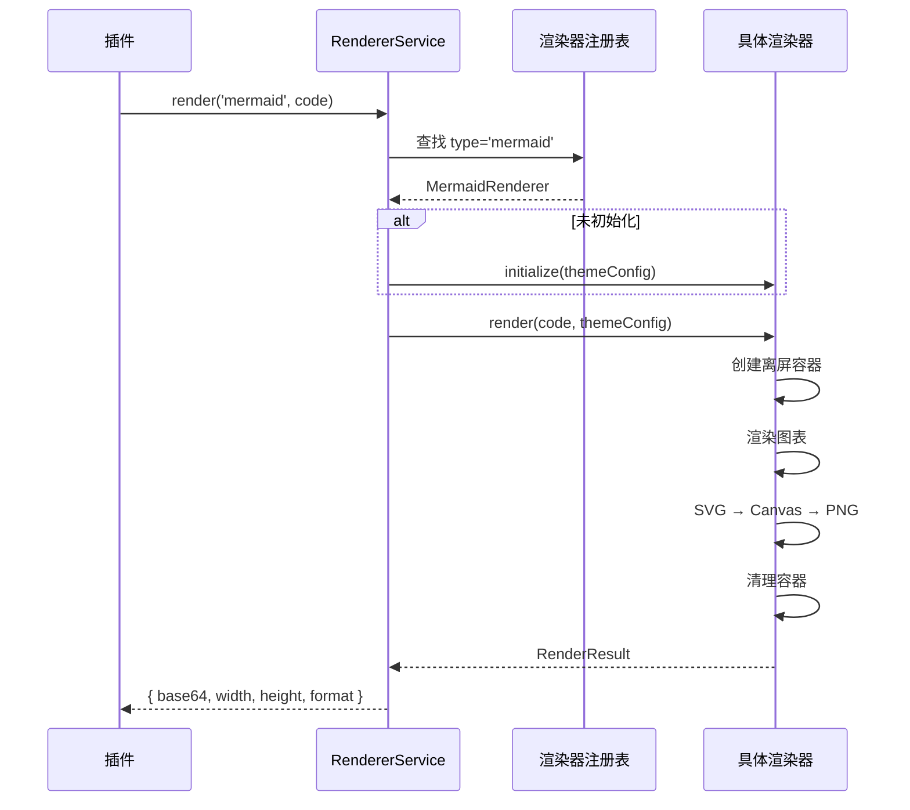
```mermaid
sequenceDiagram
    participant Plugin as 插件
    participant Service as RendererService
    participant Registry as 渲染器注册表
    participant Renderer as 具体渲染器
    
    Plugin->>Service: render('mermaid', code)
    Service->>Registry: 查找 type='mermaid'
    Registry-->>Service: MermaidRenderer
    
    alt 未初始化
        Service->>Renderer: initialize(themeConfig)
    end
    
    Service->>Renderer: render(code, themeConfig)
    Renderer->>Renderer: 创建离屏容器
    Renderer->>Renderer: 渲染图表
    Renderer->>Renderer: SVG → Canvas → PNG
    Renderer->>Renderer: 清理容器
    Renderer-->>Service: RenderResult
    Service-->>Plugin: { base64, width, height, format }
```

流程要点说明：

1. **类型路由**：服务层根据 `type` 参数在注册表中查找对应的渲染器
2. **懒初始化**：只在首次使用时初始化渲染器，避免启动延迟
3. **主题传递**：主题配置从插件层传递到渲染器，影响字体、颜色等视觉效果
4. **结果标准化**：所有渲染器返回统一格式的 `RenderResult`，包含 Base64 编码的 PNG 数据和尺寸信息

#### 5.3.4 RenderResult 格式

渲染结果采用统一的数据结构，便于后续处理：

```typescript
interface RenderResult {
  base64?: string;    // PNG Base64 encoded data (without data URI prefix)
  width: number;      // Image width in pixels
  height: number;     // Image height in pixels
  format: string;     // Format identifier ('png')
  success?: boolean;  // Success flag (for error handling)
  error?: string;     // Error message (when success is false)
}
```

`base64` 字段存储的是纯 Base64 数据，不包含 `data:image/png;base64,` 前缀，便于直接用于 DOCX 导出或其他二进制处理场景。

#### 5.3.5 渲染器特性对比

下表总结了各渲染器的技术特性，便于理解它们的差异和适用场景：

| 渲染器 | 输入格式 | 中间格式 | 依赖库 | 特殊功能 |
|-------|---------|---------|-------|---------|
| **MermaidRenderer** | Mermaid DSL | SVG | mermaid | 换行处理、字体等待 |
| **VegaRenderer** | JSON 规范 | Canvas | vega-embed, vega-interpreter | 安全表达式、禁用自动排序 |
| **DotRenderer** | DOT 语言 | SVG | @viz-js/viz (WASM) | 懒加载 WASM 模块 |
| **SvgRenderer** | SVG XML | SVG | 无 | 输入验证、尺寸解析 |
| **HtmlRenderer** | HTML | SVG foreignObject | 无 | 安全清理、像素扫描裁剪 |
| **InfographicRenderer** | 缩进 DSL | SVG | @antv/infographic | 资源嵌入、事件驱动渲染 |

---

## 第六章 平台适配层

### 6.1 设计背景与挑战

本项目需要在四个截然不同的运行环境中提供一致的用户体验：Chrome 扩展、Firefox 扩展、VS Code 扩展和移动端应用。这些平台在技术栈、安全模型和 API 能力上存在根本性差异：

**Chrome/Firefox 扩展**运行在浏览器的沙箱环境中，遵循 Web 扩展标准，但 Manifest V3 引入了 Service Worker 模式，不再支持持久后台页面和 DOM 操作。**VS Code 扩展**运行在 Electron 环境中，分为 Node.js 主进程（Extension Host）和浏览器沙箱（Webview）两个隔离的上下文。**移动端应用**采用 Flutter 框架，JavaScript 代码运行在 WebView 中，需要通过原生桥接访问文件系统。

面对这些差异，传统做法是为每个平台编写独立的代码库，但这会导致代码重复、功能不一致和维护成本高昂。本项目采用了一种更优雅的解决方案：**抽象统一的平台接口，共享核心业务逻辑，由各平台提供具体实现**。

### 6.2 架构设计原则

跨平台开发的核心挑战在于：**如何在不同环境中提供一致的功能，同时充分利用各平台的原生能力**。本项目通过 **依赖倒置（Dependency Inversion）** 原则，定义统一的平台抽象接口，由各平台提供具体实现。

这种设计带来了三个关键优势：

1. **代码复用**：Markdown 处理、插件系统、渲染逻辑、UI 组件等核心代码在所有平台间共享，约占代码总量的 70%
2. **一致体验**：用户在不同平台上获得相同的功能和界面，降低学习成本
3. **独立演进**：各平台可以独立优化实现细节，而不影响其他平台

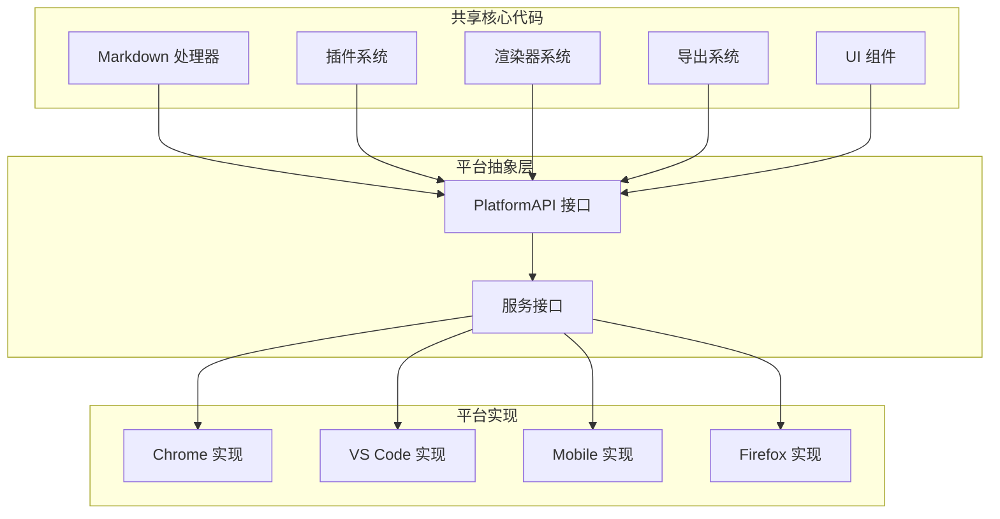
```mermaid
graph TB
    subgraph "共享核心代码"
        Core[Markdown 处理器]
        Plugins[插件系统]
        Renderers[渲染器系统]
        Exporters[导出系统]
        UI[UI 组件]
    end
    
    subgraph "平台抽象层"
        PlatformAPI[PlatformAPI 接口]
        Services[服务接口]
    end
    
    subgraph "平台实现"
        Chrome[Chrome 实现]
        VSCode[VS Code 实现]
        Mobile[Mobile 实现]
        Firefox[Firefox 实现]
    end
    
    Core --> PlatformAPI
    Plugins --> PlatformAPI
    Renderers --> PlatformAPI
    Exporters --> PlatformAPI
    UI --> PlatformAPI
    
    PlatformAPI --> Services
    
    Services --> Chrome
    Services --> VSCode
    Services --> Mobile
    Services --> Firefox
```

### 6.3 PlatformAPI 接口设计

#### 6.3.1 设计理念

`PlatformAPI` 是整个平台适配层的核心抽象。它定义了一组标准化的服务接口，涵盖了应用运行所需的所有平台能力：存储、缓存、渲染、文件操作、国际化和消息通信。这种设计借鉴了**控制反转（IoC）**思想——核心代码不直接依赖具体平台实现，而是依赖抽象接口，具体实现在运行时注入。

接口设计遵循以下原则：

1. **最小化原则**：每个服务接口只暴露必要的方法，避免平台特定功能泄漏
2. **异步优先**：所有可能涉及 I/O 的操作都返回 Promise，确保跨平台兼容
3. **无状态倾向**：服务尽量设计为无状态，简化测试和并发处理

#### 6.3.2 接口定义总览

`PlatformAPI` 是平台适配层的核心接口，定义于 `src/types/platform.ts`：

```typescript
interface PlatformAPI {
  // 平台标识
  platform: PlatformType;  // 'chrome' | 'firefox' | 'mobile' | 'vscode'
  
  // 核心服务
  cache: CacheService;        // 缓存管理
  renderer: RendererService;  // 图表渲染
  storage: StorageService;    // 设置存储
  file: FileService;          // 文件下载
  resource: ResourceService;  // 资源加载
  i18n: I18nService;          // 国际化
  message: MessageService;    // 消息通信
  
  // 可选服务
  document?: DocumentService; // 文档文件操作
}
```

#### 6.3.3 全局访问模式

平台 API 实例通过全局变量 `globalThis.platform` 暴露，允许任何模块无需显式导入即可访问。这种全局单例模式的选择是经过权衡的：

**为什么使用全局变量而非依赖注入？**

在典型的后端应用中，依赖注入是管理服务实例的首选方式。然而，在本项目的前端环境中，我们面临独特的挑战：

1. **模块加载顺序**：浏览器环境中，模块的加载顺序难以精确控制，而平台 API 需要在所有业务代码之前就绑定完成
2. **跨 Bundle 访问**：某些场景下（如动态加载的插件），代码可能来自不同的打包产物，无法通过 import 共享实例
3. **简化调用链**：避免将 platform 参数在函数调用链中逐层传递

**安全保障**：全局变量的风险在于可能被意外覆盖。我们通过 TypeScript 类型声明确保类型安全，并在初始化时进行单次赋值检查。

```typescript
// 类型声明 (src/types/platform.d.ts)
declare global {
  var platform: PlatformAPI | undefined;
  var bridge: PlatformBridgeAPI | undefined;  // Mobile 专用
}

// 使用示例
const settings = await globalThis.platform!.storage.get(['theme']);
const svg = await globalThis.platform!.renderer.render('mermaid', code);
```

#### 6.3.4 服务职责划分

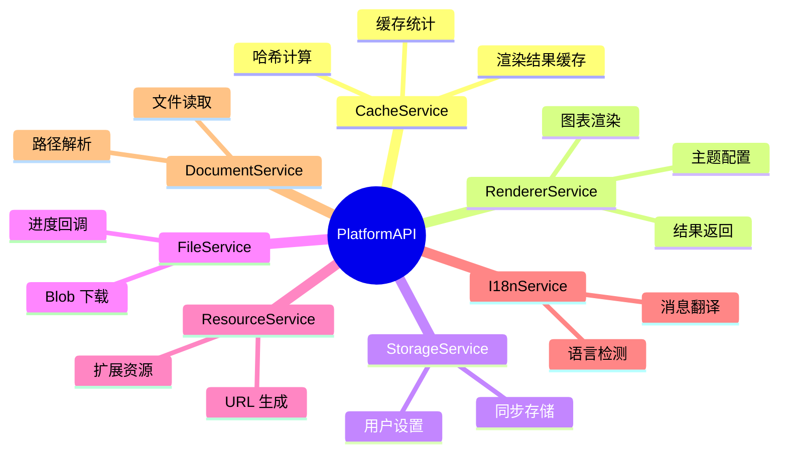
```mermaid
mindmap
  root((PlatformAPI))
    CacheService
      渲染结果缓存
      哈希计算
      缓存统计
    RendererService
      图表渲染
      主题配置
      结果返回
    StorageService
      用户设置
      同步存储
    FileService
      Blob 下载
      进度回调
    ResourceService
      扩展资源
      URL 生成
    I18nService
      消息翻译
      语言检测
    DocumentService
      文件读取
      路径解析
```

### 6.4 服务接口详解

本节详细介绍 PlatformAPI 中各个服务接口的设计目标、方法签名和平台实现差异。每个服务都针对特定的功能领域进行了抽象，确保核心代码可以在不了解底层实现细节的情况下正常工作。

#### 6.4.1 StorageService

**职责**：持久化存储用户设置和应用状态。

StorageService 是最基础的平台服务之一，负责管理用户偏好设置的持久化。设计时特别考虑了以下需求：

- **键值模型**：采用简单的键值对存储模型，足以满足设置存储需求，且所有平台都能高效实现
- **批量操作**：get/set 方法支持批量操作，减少跨上下文通信的往返次数
- **异步接口**：即使某些平台的存储 API 是同步的，统一使用 Promise 确保接口一致性

```typescript
interface StorageService {
  /** 获取指定键的值 */
  get(keys: string[]): Promise<Record<string, unknown>>;
  
  /** 设置键值对 */
  set(data: Record<string, unknown>): Promise<void>;
  
  /** 删除指定键 */
  remove(keys: string[]): Promise<void>;
}
```

**平台实现差异**：

| 平台 | 存储后端 | 特点 |
|-----|---------|-----|
| Chrome | `chrome.storage.local` | 跨设备同步（可选 sync） |
| Firefox | `browser.storage.local` | 兼容 WebExtension API |
| VS Code | `ExtensionContext.globalState` | 扩展级持久化 |
| Mobile | `SharedPreferences` / `NSUserDefaults` | 原生 Key-Value 存储 |

**存储内容示例**：

```typescript
{
  markdownViewerSettings: {
    theme: 'default',
    preferredLocale: 'zh_CN',
    codeTheme: 'github-dark',
    scrollSync: true,
    // ...
  }
}
```

#### 6.4.2 ResourceService

**职责**：加载扩展/应用内的静态资源（CSS、JSON、图片等）。

ResourceService 解决了一个跨平台开发的常见问题：**如何以统一的方式访问打包在应用内的静态资源**。不同平台的资源打包方式和访问协议差异很大：

- **Chrome/Firefox 扩展**：资源通过 `chrome-extension://` 或 `moz-extension://` 协议访问，需要使用扩展 API 获取完整 URL
- **VS Code 扩展**：Webview 中的资源必须通过特殊的 `vscode-webview-resource://` 协议访问，且需要在 `localResourceRoots` 中声明
- **Flutter 应用**：资源打包在 assets 目录中，访问路径因平台（Android/iOS）而异

通过 ResourceService，核心代码只需提供相对路径（如 `themes/default.json`），服务会自动转换为当前平台的正确 URL。

```typescript
interface ResourceService {
  /** 获取资源的完整 URL */
  getURL(path: string): string;
  
  /** 获取资源内容 */
  fetch(path: string): Promise<string>;
}
```

**URL 生成示例**：

| 平台 | 输入路径 | 输出 URL |
|-----|---------|---------|
| Chrome | `_locales/en/messages.json` | `chrome-extension://abc123/_locales/en/messages.json` |
| VS Code | `themes/default.json` | `https://file+.vscode-resource.vscode-cdn.net/.../themes/default.json` |
| Mobile | `assets/themes/default.json` | `file:///android_asset/flutter_assets/assets/themes/default.json` |

#### 6.4.3 I18nService

**职责**：提供多语言翻译支持，支持动态语言切换。

国际化是提升用户体验的重要因素。本项目支持 30 多种语言，I18nService 提供了统一的翻译接口，同时处理了各平台国际化机制的差异：

- **Chrome/Firefox**：使用扩展内置的 `chrome.i18n` API，语言由浏览器设置决定
- **VS Code**：通过 `vscode.l10n` API 或手动加载语言包实现
- **Mobile**：由 Flutter 端管理语言设置，通过桥接传递给 WebView

`setLocale` 方法是可选的，因为 Chrome 扩展不支持运行时切换语言（需要用户修改浏览器设置），而移动端可以在应用内切换。

```typescript
interface I18nService {
  /** 翻译消息键 */
  translate(key: string, substitutions?: string | string[]): string;
  
  /** 获取当前 UI 语言 */
  getUILanguage(): string;
  
  /** 动态设置语言（可选） */
  setLocale?(locale: string): Promise<void>;
}
```

**消息占位符替换**：

```typescript
// messages.json
{
  "exportProgress": {
    "message": "正在导出: $1/$2 ($3%)"
  }
}

// 使用
i18n.translate('exportProgress', ['5', '10', '50']);
// → "正在导出: 5/10 (50%)"
```

**语言回退策略**：

```
用户首选语言 → 浏览器/系统语言 → 英语 (fallback)
      ↓
  zh_CN → zh → en
```

#### 6.4.4 CacheService

**职责**：缓存图表渲染结果，避免重复渲染。

图表渲染是计算密集型操作。CacheService 通过缓存渲染结果，避免重复渲染，提升用户体验：

**缓存策略设计**：

- **内容寻址**：使用 SHA-256 哈希作为缓存键，相同内容必然命中缓存
- **主题感知**：缓存键包含主题配置，主题切换后会重新渲染
- **LRU 淘汰**：当缓存超过限制时，优先淘汰最久未访问的条目

**为什么需要平台特定实现？**

不同平台的持久化能力差异显著。Chrome 扩展可以使用 IndexedDB 存储大量缓存数据；VS Code 的 globalState 有大小限制，更适合存储小型数据；移动端需要考虑存储空间和内存压力。因此，虽然 CacheService 的接口统一，但各平台的实现策略有所不同。

```typescript
interface CacheService {
  /** 初始化缓存存储 */
  init(): Promise<void>;
  
  /** 计算内容哈希 */
  calculateHash(text: string): Promise<string>;
  
  /** 生成缓存键（包含内容+类型+主题） */
  generateKey(
    content: string, 
    type: string, 
    themeConfig?: RendererThemeConfig | null
  ): Promise<string>;
  
  /** 获取缓存 */
  get(key: string): Promise<unknown>;
  
  /** 设置缓存 */
  set(key: string, value: unknown, type?: string): Promise<boolean>;
  
  /** 清空缓存 */
  clear(): Promise<boolean>;
  
  /** 获取缓存统计 */
  getStats(): Promise<CacheStats | null>;
}
```

**缓存键生成算法**：

```typescript
// SHA-256 哈希组合
cacheKey = SHA256(content + type + JSON.stringify(themeConfig))
```

#### 6.4.5 RendererService

**职责**：统一管理图表渲染，提供主题配置。

RendererService 是连接业务代码和图表渲染引擎的桥梁。它封装了渲染的复杂性，包括：

- **渲染器选择**：根据 type 参数（mermaid、vega、dot 等）选择合适的渲染器
- **主题注入**：将当前主题配置传递给渲染器，确保图表样式与文档风格一致
- **结果标准化**：无论使用哪种渲染器，都返回统一的 RenderResult 格式

**渲染隔离的必要性**：

图表渲染库（Mermaid、Vega 等）通常需要 DOM 环境，且可能存在全局状态污染。在 Chrome Manifest V3 中，Service Worker 没有 DOM；在 VS Code 中，Webview 的主线程需要保持响应性。因此，渲染通常在隔离的环境中执行（Offscreen Document 或 iframe），RendererService 负责管理这种跨上下文的渲染调度。

```typescript
interface RendererService {
  /** 初始化渲染器 */
  init(): Promise<void>;
  
  /** 设置主题配置 */
  setThemeConfig(config: RendererThemeConfig): void;
  
  /** 获取当前主题配置 */
  getThemeConfig(): RendererThemeConfig | null;
  
  /** 渲染图表 */
  render(type: string, content: string | object): Promise<RenderResult>;
}
```

**渲染结果类型**：

```typescript
interface RenderResult {
  base64: string;      // Base64 编码的图片数据
  width: number;       // 图片宽度（像素）
  height: number;      // 图片高度（像素）
  format: string;      // 格式 ('png')
}
```

#### 6.4.6 FileService

**职责**：处理文件下载，支持分块上传（移动端）。

FileService 专注于文件导出场景，主要用于将渲染完成的 DOCX 文档保存到用户设备。看似简单的"下载"操作在不同平台上有截然不同的实现：

- **Chrome/Firefox**：使用 `chrome.downloads` API 或创建临时 `<a>` 标签触发下载
- **VS Code**：通过 Extension Host 调用 Node.js 的文件系统 API 写入文件
- **Mobile**：由于 WebView 无法直接访问文件系统，需要将数据传输到 Flutter 端处理

**移动端分块上传的技术背景**：

JavaScriptChannel 是 WebView 与 Flutter 通信的唯一通道，但它对单条消息的大小有限制（通常为几 MB）。一份包含多张高清图表的 DOCX 文档可能达到数十 MB，必须分块传输。分块机制还提供了进度回调能力，让用户了解导出进度。

```typescript
interface FileService {
  /** 下载 Blob 或 Base64 数据为文件 */
  download(
    blob: Blob | string, 
    filename: string, 
    options?: DownloadOptions
  ): Promise<void>;
}

interface DownloadOptions {
  saveAs?: boolean;       // 是否弹出保存对话框
  mimeType?: string;      // MIME 类型
  onProgress?: (progress: { uploaded: number; total: number }) => void;
}
```

**移动端分块上传**：

由于 JavaScript-Flutter 桥接的消息大小限制，大文件需要分块传输：

```typescript
// 分块大小: 512KB
const CHUNK_SIZE = 512 * 1024;

// 上传流程
for (let offset = 0; offset < data.length; offset += CHUNK_SIZE) {
  const chunk = data.slice(offset, offset + CHUNK_SIZE);
  await bridge.sendRequest('UPLOAD_FILE_CHUNK', {
    sessionId,
    chunk: base64Encode(chunk),
    offset,
    isLast: offset + CHUNK_SIZE >= data.length
  });
}
```

#### 6.4.7 DocumentService

**职责**：统一文档文件操作，提供路径解析和文件读取能力。

DocumentService 是为了解决**相对路径资源加载**问题而设计的。当 Markdown 文档中引用本地图片（如 ``）时，需要正确解析这些相对路径并加载资源内容。

**设计动机**：

在传统 Web 应用中，相对路径由浏览器自动解析。但在扩展和应用环境中，情况变得复杂：

1. **Chrome 扩展**：Content Script 运行在 `file://` 页面中，有同源策略限制
2. **VS Code Webview**：运行在沙箱中，完全无法访问文件系统，所有文件读取必须代理到 Extension Host
3. **Mobile**：WebView 没有文件系统访问权限，必须通过 Flutter 桥接

DocumentService 提供了统一的抽象，让核心代码无需关心这些差异。`readRelativeFile` 方法接收相对路径，内部处理路径解析、权限检查和内容读取，返回文件内容（文本或 Base64 编码的二进制数据）。

**VS Code 的特殊性**：

VS Code Webview 有独特的 URI 重写需求。本地资源必须通过 `webview.asWebviewUri()` 转换为安全的 `vscode-webview-resource://` URI。`needsUriRewrite` 属性标识这一需求，让图片渲染代码能够正确处理资源 URL。

```typescript
interface DocumentService {
  // === 上下文信息 ===
  readonly documentPath: string;   // 当前文档绝对路径
  readonly documentDir: string;    // 文档所在目录
  readonly baseUrl: string;        // 资源解析基准 URL
  readonly needsUriRewrite: boolean; // 是否需要 URI 重写（VS Code）
  
  // === 文件操作 ===
  readFile(absolutePath: string, options?: ReadFileOptions): Promise<string>;
  readRelativeFile(relativePath: string, options?: ReadFileOptions): Promise<string>;
  fetchRemote(url: string): Promise<Uint8Array>;
  
  // === 路径解析 ===
  resolvePath(relativePath: string): string;
  toResourceUrl(absolutePath: string): string;
  
  // === 上下文管理 ===
  setDocumentPath(path: string, baseUrl?: string): void;
}
```

**路径解析示例**：

```typescript
// documentPath: /Users/docs/manual/chapter1.md
// documentDir:  /Users/docs/manual/

resolvePath('./images/fig1.png')  // → /Users/docs/manual/images/fig1.png
resolvePath('../assets/logo.svg') // → /Users/docs/assets/logo.svg
resolvePath('/absolute/path.md')  // → /absolute/path.md
```

### 6.5 Chrome 平台实现

Chrome 扩展采用 **Manifest V3** 架构，是最复杂的平台实现，涉及多个运行上下文的协作。理解 Chrome 实现需要首先理解 Manifest V3 带来的架构变革。

#### 6.5.1 Manifest V3 的影响

2023 年，Chrome 强制要求扩展迁移到 Manifest V3，这对扩展架构产生了深远影响：

**从 Background Page 到 Service Worker**：传统的 Manifest V2 允许持久的后台页面，可以维持长期状态和 DOM 操作。Manifest V3 引入的 Service Worker 是事件驱动的，没有 DOM 环境，且会在空闲时被销毁。这意味着：

- 所有需要持久化的状态必须存储在 chrome.storage 或 IndexedDB 中
- DOM 相关操作（如图表渲染）必须在其他上下文中完成
- 长时间运行的任务需要特殊处理以防止 Service Worker 被杀死

**Offscreen Document 的引入**：为了解决 Service Worker 无法进行 DOM 操作的问题，Chrome 提供了 Offscreen Document API。它允许创建一个不可见的 HTML 页面，专门用于需要 DOM 的任务。本项目利用这一机制进行图表渲染。

#### 6.5.2 架构说明

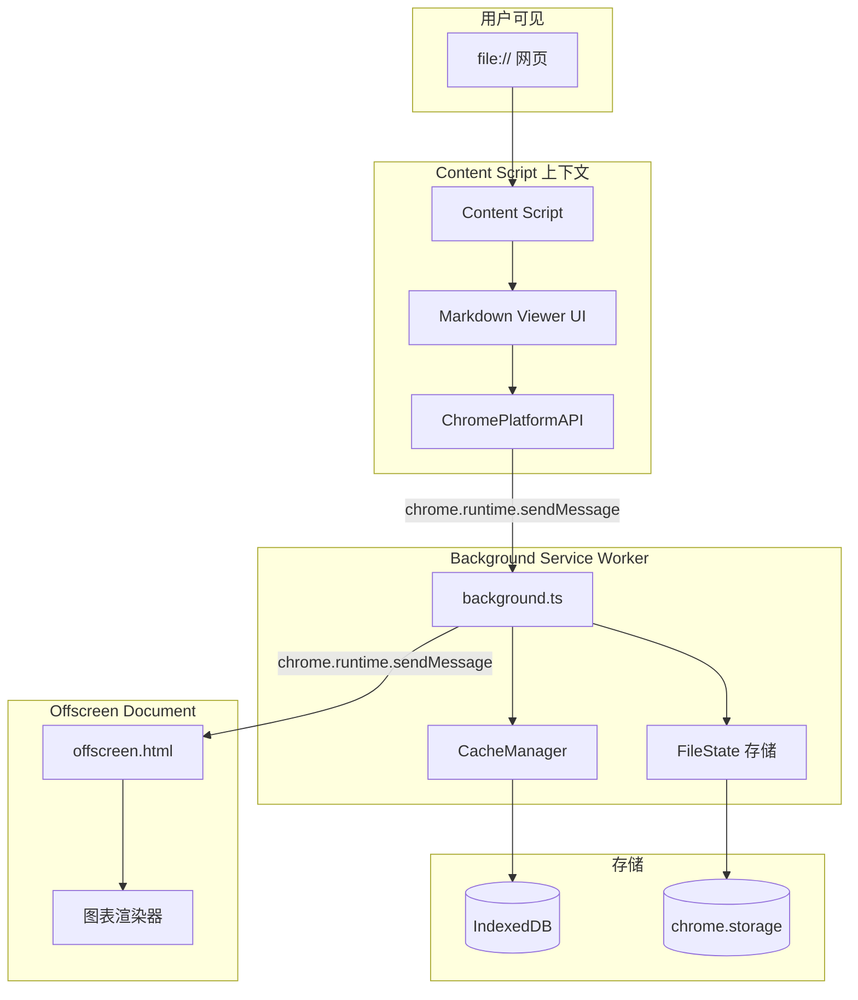
```mermaid
graph TB
    subgraph "用户可见"
        WebPage[file:// 网页]
    end
    
    subgraph "Content Script 上下文"
        CS[Content Script]
        Viewer[Markdown Viewer UI]
        Platform[ChromePlatformAPI]
    end
    
    subgraph "Background Service Worker"
        BG[background.ts]
        CacheManager[CacheManager]
        FileState[FileState 存储]
    end
    
    subgraph "Offscreen Document"
        OD[offscreen.html]
        Renderers[图表渲染器]
    end
    
    subgraph "存储"
        IDB[(IndexedDB)]
        Storage[(chrome.storage)]
    end
    
    WebPage --> CS
    CS --> Viewer
    Viewer --> Platform
    Platform -->|chrome.runtime.sendMessage| BG
    BG -->|chrome.runtime.sendMessage| OD
    BG --> CacheManager
    BG --> FileState
    CacheManager --> IDB
    FileState --> Storage
    OD --> Renderers
```

**三层架构说明**：

| 层级 | 文件 | 职责 | 生命周期 |
|-----|-----|-----|---------|
| **Content Script** | `webview/index.ts` | UI 渲染、用户交互 | 与页面同生命周期 |
| **Background SW** | `host/background.ts` | 消息路由、缓存、文件状态 | 按需唤醒 |
| **Offscreen Document** | `host/offscreen.ts` | Mermaid/Vega 等渲染 | 按需创建 |

**Content Script** 是用户直接交互的层面，运行在每个 `file://` 协议的 Markdown 文件页面中。它加载完整的 UI 组件，处理用户的滚动、点击、主题切换等操作。Content Script 可以访问页面 DOM，但无法直接使用大部分 Chrome API。

**Background Service Worker** 是扩展的"中枢神经"，处理来自 Content Script 的请求，管理缓存和文件状态，并协调 Offscreen Document 的创建和通信。由于 Service Worker 可能随时被销毁，所有状态都通过 IndexedDB 和 chrome.storage 持久化。

**Offscreen Document** 是专门用于图表渲染的隔离环境。它在需要时由 Background 创建，渲染完成后可以保持活跃以处理后续请求。这种设计既满足了 DOM 操作的需求，又避免了在 Content Script 中加载大型渲染库影响页面性能。

#### 6.5.3 消息流转

Chrome 平台使用 **统一信封格式** 进行消息通信。这种设计源于一个核心需求：**请求-响应的关联**。在异步消息传递中，发送方需要将响应与原始请求匹配，信封格式中的 `id` 字段解决了这个问题。

```typescript
// 请求信封
interface RequestEnvelope {
  id: string;         // 唯一请求 ID
  type: string;       // 消息类型
  payload: unknown;   // 载荷数据
  timestamp: number;  // 时间戳
  source: string;     // 来源标识
}

// 响应信封
interface ResponseEnvelope {
  type: 'RESPONSE';
  requestId: string;  // 对应请求 ID
  ok: boolean;        // 是否成功
  data?: unknown;     // 成功时的数据
  error?: {           // 失败时的错误
    message: string;
  };
}
```

**完整渲染流程**：

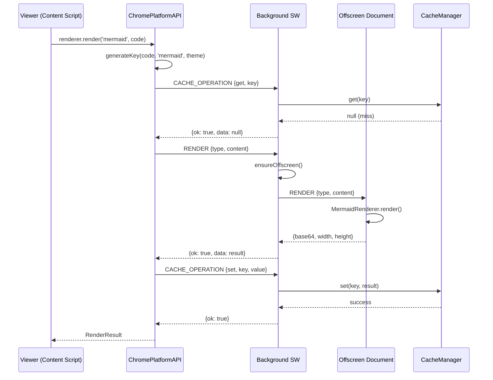
```mermaid
sequenceDiagram
    participant V as Viewer (Content Script)
    participant P as ChromePlatformAPI
    participant B as Background SW
    participant O as Offscreen Document
    participant C as CacheManager
    
    V->>P: renderer.render('mermaid', code)
    P->>P: generateKey(code, 'mermaid', theme)
    P->>B: CACHE_OPERATION {get, key}
    B->>C: get(key)
    C-->>B: null (miss)
    B-->>P: {ok: true, data: null}
    
    P->>B: RENDER {type, content}
    B->>B: ensureOffscreen()
    B->>O: RENDER {type, content}
    O->>O: MermaidRenderer.render()
    O-->>B: {base64, width, height}
    B-->>P: {ok: true, data: result}
    
    P->>B: CACHE_OPERATION {set, key, value}
    B->>C: set(key, result)
    C-->>B: success
    B-->>P: {ok: true}
    
    P-->>V: RenderResult
```

#### 6.5.4 缓存实现 (IndexedDB)

Chrome 使用 IndexedDB 存储渲染缓存，这是 Web 平台上最强大的客户端存储方案。选择 IndexedDB 而非 chrome.storage 的原因：

- **容量优势**：IndexedDB 几乎没有存储上限（受磁盘空间限制），而 chrome.storage.local 限制为 5MB
- **结构化查询**：支持索引，可以高效地按访问时间排序，实现 LRU 淘汰
- **二进制支持**：可以直接存储 Blob 和 ArrayBuffer，无需 Base64 编码

缓存由 `ExtensionCacheManager` 类管理，它封装了 IndexedDB 的复杂操作，提供简洁的 get/set/delete 接口。

```typescript
// 缓存条目结构
interface CacheItem {
  key: string;          // SHA-256 哈希键
  value: unknown;       // 缓存数据 (RenderResult)
  timestamp: number;    // 创建时间
  accessTime: number;   // 最后访问时间
  size: number;         // 数据大小 (bytes)
  type: string;         // 数据类型 ('mermaid', 'vega', ...)
}
```

**IndexedDB 索引设计**：

```typescript
// 创建对象存储和索引
const store = db.createObjectStore('cache', { keyPath: 'key' });
store.createIndex('timestamp', 'timestamp');   // 按创建时间
store.createIndex('accessTime', 'accessTime'); // 按访问时间 (LRU)
store.createIndex('size', 'size');             // 按大小
store.createIndex('type', 'type');             // 按类型
```

**LRU 淘汰策略**：

当缓存条目数或总大小超过阈值时，系统会自动淘汰最久未访问的条目。这种 LRU（Least Recently Used）策略确保热门内容保持在缓存中，而冷门内容逐渐被替换。每次访问缓存时都会更新 `accessTime`，淘汰时按此字段排序选择最老的条目删除。

```typescript
async evictIfNeeded(): Promise<void> {
  const stats = await this.getStats();
  
  // 检查是否超过限制
  if (stats.totalItems <= MAX_ITEMS && stats.totalSize <= MAX_SIZE) {
    return;
  }
  
  // 按 accessTime 升序排列，淘汰最久未访问的
  const oldestItems = await this.getOldestItems(EVICT_COUNT);
  for (const item of oldestItems) {
    await this.delete(item.key);
  }
}
```

**缓存操作 API**：

| 消息类型 | 操作 | 说明 |
|---------|-----|------|
| `CACHE_OPERATION` | `get` | 获取缓存，更新 accessTime |
| `CACHE_OPERATION` | `set` | 存储缓存，触发 LRU 淘汰 |
| `CACHE_OPERATION` | `delete` | 删除指定缓存 |
| `CACHE_OPERATION` | `clear` | 清空所有缓存 |
| `CACHE_OPERATION` | `getStats` | 获取缓存统计 |

### 6.6 VS Code 平台实现

VS Code 扩展运行在两个独立的上下文：**Extension Host**（Node.js 环境）和 **Webview**（浏览器沙箱环境），两者通过 postMessage 通信。这种架构既是安全设计的结果，也带来了独特的开发挑战。

#### 6.6.1 VS Code 扩展模型

VS Code 基于 Electron 构建，Extension Host 运行在独立的 Node.js 进程中，拥有完整的 Node.js API 访问权限——文件系统、网络、子进程等。Webview 则是一个严格隔离的 Chromium 渲染进程，有自己的 CSP（内容安全策略）限制。

**这种隔离设计的目的**：

1. **安全性**：防止恶意扩展直接操作 VS Code UI 或访问敏感数据
2. **稳定性**：Webview 崩溃不会影响编辑器主进程
3. **资源隔离**：每个 Webview 有独立的内存空间，避免相互干扰

**对本项目的影响**：

核心渲染代码运行在 Webview 中（复用浏览器扩展的代码），但文件读取、网络请求等操作必须代理到 Extension Host。这增加了通信开销，但换来了代码复用的巨大收益。

#### 6.6.2 架构说明

```mermaid
graph TB
    subgraph "VS Code 编辑器"
        Editor[Markdown 编辑器]
    end
    
    subgraph "Extension Host (Node.js)"
        Ext[extension.ts]
        Panel[MarkdownPreviewPanel]
        Cache[ExtensionCacheService]
        FS[文件系统访问]
    end
    
    subgraph "WebviewPanel (浏览器沙箱)"
        WV[Webview 内容]
        Platform[VSCodePlatformAPI]
        Viewer[Markdown Viewer UI]
        Iframe[iframe 渲染器]
    end
    
    subgraph "存储"
        State[(globalState)]
    end
    
    Editor -->|内容变更| Panel
    Panel -->|postMessage| WV
    WV --> Platform
    Platform --> Viewer
    Viewer -->|图表渲染| Iframe
    
    Panel <-->|请求/响应| Platform
    Panel --> Cache
    Panel --> FS
    Cache --> State
```

**双层架构说明**：

| 层级 | 环境 | 文件 | 能力 |
|-----|-----|-----|-----|
| **Extension Host** | Node.js | `extension.ts`, `preview-panel.ts` | 文件系统、VS Code API、持久化 |
| **Webview** | 浏览器沙箱 | `webview/main.ts`, `api-impl.ts` | DOM 操作、UI 渲染、受限网络 |

Extension Host 层由 `MarkdownPreviewPanel` 类管理，它负责创建 Webview 面板、监听编辑器事件、处理来自 Webview 的请求。每当用户打开或编辑 Markdown 文件时，Panel 会将最新内容推送到 Webview。

Webview 层加载与 Chrome 扩展共享的核心代码，包括 Markdown 处理器、UI 组件和插件系统。图表渲染同样在 iframe 中进行，以隔离渲染库的内存占用和潜在错误。

#### 6.6.3 Webview 通信

VS Code Webview 使用 **统一信封格式** 进行双向通信，与 Chrome 平台采用相同的协议设计。这种一致性使得消息处理逻辑可以在平台间共享。

**通信流程的特点**：

- **双向异步**：Extension Host 和 Webview 都可以主动发起消息，响应通过另一条消息返回
- **请求关联**：使用 `id` 和 `requestId` 字段将响应与请求匹配
- **类型安全**：TypeScript 类型定义确保消息格式正确

```typescript
// Extension Host → Webview
panel.webview.postMessage({
  id: 'host-1704384000-1',
  type: 'UPDATE_CONTENT',
  payload: { content, filename, documentBaseUri },
  timestamp: Date.now(),
  source: 'vscode-host',
});

// Webview → Extension Host
const vscode = acquireVsCodeApi();
vscode.postMessage({
  id: 'webview-1704384000-1',
  type: 'STORAGE_GET',
  payload: { keys: ['markdownViewerSettings'] },
  timestamp: Date.now(),
  source: 'vscode-webview',
});
```

**消息类型总览**：

| 方向 | 类型 | 说明 |
|-----|------|-----|
| Host → Webview | `UPDATE_CONTENT` | 发送文档内容 |
| Host → Webview | `SCROLL_TO_LINE` | 同步编辑器滚动位置 |
| Host → Webview | `OPEN_SETTINGS` | 打开设置面板 |
| Host → Webview | `EXPORT_DOCX` | 触发 DOCX 导出 |
| Webview → Host | `STORAGE_GET/SET` | 存储操作 |
| Webview → Host | `CACHE_OPERATION` | 缓存操作 |
| Webview → Host | `READ_LOCAL_FILE` | 读取本地文件 |
| Webview → Host | `FETCH_REMOTE_IMAGE` | 获取远程资源 |
| Webview → Host | `DOWNLOAD_FILE` | 下载文件 |
| Webview → Host | `READY` | Webview 就绪通知 |

#### 6.6.4 文件访问与 URI 转换

VS Code Webview 运行在严格的 CSP 沙箱中，无法直接访问文件系统。所有文件操作必须通过 Extension Host 代理。这是 VS Code 安全模型的核心设计，确保扩展的 Webview 不能未经授权访问用户文件。

**本地文件读取流程**：

当渲染器需要加载文档中引用的本地图片时，请求会通过以下路径处理：Webview 发送 `READ_LOCAL_FILE` 消息 → Extension Host 接收并验证路径 → 使用 Node.js fs 模块读取文件 → 将内容（可能是 Base64 编码）返回给 Webview。

```mermaid
sequenceDiagram
    participant W as Webview
    participant H as Extension Host
    participant F as 文件系统
    
    Note over W: 需要加载 ./images/fig.png
    W->>H: READ_LOCAL_FILE {filePath: './images/fig.png'}
    H->>H: 解析为绝对路径
    H->>F: fs.readFile(absolutePath)
    F-->>H: 文件内容
    H-->>W: {content: base64Data}
```

**URI 转换机制**：

VS Code Webview 有自己的安全 URI 方案。直接使用 `file://` 路径会被 CSP 阻止，必须通过 `webview.asWebviewUri()` 方法将本地路径转换为 `vscode-webview-resource://` URI。这个 URI 经过 VS Code 的安全检查，只允许访问在 `localResourceRoots` 中声明的目录。

当 Extension Host 向 Webview 发送文档内容时，会同时发送 `documentBaseUri`——文档目录的 Webview URI。Webview 使用这个基准 URI 解析文档中的相对图片路径。

```typescript
// Extension Host 计算文档目录的 Webview URI
const docDir = vscode.Uri.file(path.dirname(document.uri.fsPath));
const documentBaseUri = panel.webview.asWebviewUri(docDir).toString();
// → 'https://file+.vscode-resource.vscode-cdn.net/Users/docs/manual/'

// 发送给 Webview
postToWebview('UPDATE_CONTENT', {
  content,
  filename,
  documentBaseUri  // Webview 用此解析相对路径
});
```

**localResourceRoots 配置**：

`localResourceRoots` 是 Webview 安全模型的关键配置，它定义了 Webview 可以访问的本地目录白名单。配置不当会导致图片无法加载或安全风险。本项目的配置策略是：包含扩展自身的资源目录、所有工作区文件夹、以及当前文档所在目录（处理工作区外文件的情况）。

```typescript
const panel = vscode.window.createWebviewPanel(
  'markdownViewerAdvanced',
  'Preview',
  vscode.ViewColumn.Beside,
  {
    enableScripts: true,
    retainContextWhenHidden: true,
    localResourceRoots: [
      vscode.Uri.joinPath(extensionUri, 'webview'), // 扩展资源
      ...workspaceFolders.map(f => f.uri),          // 工作区文件夹
      vscode.Uri.file(path.dirname(document.uri.fsPath)) // 文档目录
    ]
  }
);
```

**远程资源获取**：

Webview 的 CSP 策略也限制了网络请求。当文档中包含远程图片（如 ``）时，Webview 无法直接 fetch。解决方案是通过 Extension Host 代理请求——Host 使用 Node.js 的网络能力获取资源，然后将内容返回给 Webview。

```typescript
// Webview
const imageData = await platform.document.fetchRemote('https://example.com/image.png');

// Extension Host 处理
case 'FETCH_REMOTE_IMAGE': {
  const { url } = payload;
  const response = await fetch(url);
  const buffer = await response.arrayBuffer();
  const base64 = Buffer.from(buffer).toString('base64');
  return { content: base64, contentType: response.headers.get('content-type') };
}
```

### 6.7 Mobile 平台实现

移动端采用 **Flutter + WebView** 混合架构：Flutter 提供原生 UI 外壳和文件系统访问，WebView 运行共享的 JavaScript 核心代码。这种架构结合了两个世界的优势——Flutter 的原生性能和跨平台能力，以及 WebView 中已有的成熟渲染代码。

#### 6.7.1 混合架构的设计考量

选择 Flutter + WebView 而非纯原生或纯 Web 方案，基于以下权衡：

**代码复用**：Markdown 渲染、插件系统、UI 组件等核心代码已经在浏览器扩展中实现并经过充分测试。将这些代码迁移到 Dart 不仅工作量巨大，还会引入不一致性风险。通过 WebView 复用现有代码，移动端开发周期缩短了约 60%。

**原生体验**：纯 WebView 应用在文件访问、分享集成、系统设置等方面体验较差。Flutter 外壳提供了原生级别的文件选择器、系统分享接收、设置界面等，让应用感觉像真正的原生应用。

**性能平衡**：渲染密集型操作（Markdown 解析、图表渲染）在 WebView 中的 JavaScript 引擎中执行，性能可接受。文件 I/O 和系统交互由 Flutter 原生代码处理，保证流畅度。

#### 6.7.2 架构说明

```mermaid
graph TB
    subgraph "Flutter 原生层"
        App[Flutter App]
        Share[分享接收器]
        FilePicker[文件选择器]
        Settings[设置页面]
    end
    
    subgraph "WebView 主渲染"
        WV[WebView Controller]
        Main[main.ts]
        Platform[MobilePlatformAPI]
        Viewer[Markdown Viewer]
    end
    
    subgraph "iframe 图表渲染"
        IF[隔离 iframe]
        Renderers[图表渲染器]
    end
    
    subgraph "原生服务"
        FS[(文件系统)]
        Cache[(缓存服务)]
        Prefs[(SharedPreferences)]
    end
    
    App --> WV
    Share --> App
    FilePicker --> App
    Settings --> App
    
    WV <-->|JavaScriptChannel| Main
    Main --> Platform
    Platform --> Viewer
    Viewer <-->|postMessage| IF
    IF --> Renderers
    
    App --> FS
    App --> Cache
    App --> Prefs
```

**三层架构说明**：

| 层级 | 技术栈 | 职责 |
|-----|-------|-----|
| **Flutter Host** | Dart | 原生 UI、文件系统、系统集成 |
| **WebView Main** | TypeScript | Markdown 处理、UI 渲染 |
| **iframe Worker** | TypeScript | 图表渲染（隔离环境） |

**Flutter Host** 是应用的入口和外壳，使用 Dart 语言开发。它管理应用生命周期、处理系统事件（如文件分享）、提供原生 UI 元素（导航栏、设置页面），并通过 `WebViewController` 管理 WebView。Flutter 层还负责主题资源管理、最近文件记录、设置持久化等。

**WebView Main** 加载打包后的 HTML/JS 资源，运行与浏览器扩展共享的核心代码。它接收 Flutter 传递的文档内容，进行 Markdown 解析和渲染，处理用户交互。

**iframe Worker** 与其他平台类似，用于隔离图表渲染。在移动设备上，内存管理尤为重要，iframe 隔离确保渲染库的内存可以被独立回收。

#### 6.7.3 JavaScript Channel 通信

Flutter 与 WebView 通过 `JavaScriptChannel` 双向通信。这是 Flutter WebView 插件提供的标准机制，类似于 Chrome 扩展的 postMessage，但有一些重要区别：

**单向通道设计**：`JavaScriptChannel` 只支持 WebView → Flutter 方向的消息发送。Flutter → WebView 需要通过 `runJavaScript()` 执行代码实现。这种不对称性需要在设计时特别处理。

**字符串传输**：所有消息必须序列化为字符串（JSON），不支持直接传递对象或二进制数据。大型二进制数据（如导出的 DOCX）需要 Base64 编码，并可能需要分块传输。

**Flutter → WebView**：

```dart
// Flutter 发送消息
_controller.runJavaScript('''
  window.receiveMessageFromHost(${jsonEncode(message)})
''');

// 消息格式
{
  "id": "flutter-1704384000-1",
  "type": "LOAD_MARKDOWN",
  "payload": {
    "content": "# Hello",
    "filename": "demo.md",
    "themeDataJson": "{...}"
  },
  "timestamp": 1704384000000,
  "source": "flutter-host"
}
```

**WebView → Flutter**：

```typescript
// WebView 发送消息
window.MarkdownViewer?.postMessage(JSON.stringify({
  id: 'webview-1704384000-1',
  type: 'READ_RELATIVE_FILE',
  payload: { path: './images/fig.png' },
  timestamp: Date.now(),
  source: 'mobile-webview'
}));
```

**Flutter 消息处理**：

```dart
// JavaScriptChannel 注册
_controller.addJavaScriptChannel(
  'MarkdownViewer',
  onMessageReceived: (JavaScriptMessage message) {
    _handleWebViewMessage(message.message);
  },
);

// 消息处理
void _handleWebViewMessage(String message) {
  final data = jsonDecode(message);
  final type = data['type'];
  final payload = data['payload'];
  final requestId = data['id'];
  
  switch (type) {
    case 'READ_RELATIVE_FILE':
      _handleReadFile(requestId, payload);
      break;
    case 'STORAGE_GET':
      _handleStorageGet(requestId, payload);
      break;
    // ... 其他消息类型
  }
}
```

**消息类型总览**：

| 方向 | 类型 | 说明 |
|-----|------|-----|
| Flutter → WV | `LOAD_MARKDOWN` | 加载文档内容 |
| Flutter → WV | `SET_THEME` | 应用主题 |
| Flutter → WV | `SET_LOCALE` | 设置语言 |
| WV → Flutter | `READY` | WebView 就绪 |
| WV → Flutter | `STORAGE_GET/SET` | 存储操作 |
| WV → Flutter | `READ_RELATIVE_FILE` | 读取文件 |
| WV → Flutter | `DOWNLOAD_FILE` | 下载文件 |
| WV → Flutter | `EXPORT_PROGRESS` | 导出进度 |
| WV → Flutter | `TOC_UPDATE` | 目录更新 |

#### 6.7.4 文件系统访问

移动端通过 Flutter 访问文件系统，WebView 无法直接操作文件。这种设计符合移动平台的安全模型——应用只能访问自己的沙箱目录和用户明确授权的文件。

**文件来源**：

移动应用支持多种文件打开方式，满足不同使用场景：

1. **文件选择器**：用户通过系统文件选择器主动选择要打开的文件。这是最常见的方式，用户有明确的操作意图
2. **分享接收**：用户从其他应用（如邮件、云盘）分享文件到本应用。这需要在 Android 的 Intent Filter 和 iOS 的 Share Extension 中进行配置
3. **最近文件**：应用记录用户打开过的文件，提供快速访问。最近文件列表存储在 SharedPreferences 中，包含路径和缓存的内容摘要

```dart
// 文件选择
Future<void> _pickFile() async {
  final result = await FilePicker.platform.pickFiles(
    type: FileType.custom,
    allowedExtensions: ['md', 'markdown', 'mermaid', 'vega', 'gv', 'dot'],
  );
  
  if (result != null) {
    final file = File(result.files.single.path!);
    final content = await file.readAsString();
    _loadMarkdownIntoWebView(content, result.files.single.name);
  }
}
```

**文件读取流程**：

```mermaid
sequenceDiagram
    participant V as Viewer (WebView)
    participant M as main.ts
    participant F as Flutter Host
    participant FS as 文件系统
    
    V->>M: 渲染包含 ./image.png 的文档
    M->>M: 检测到相对路径图片
    M->>F: READ_RELATIVE_FILE {path: './image.png', binary: true}
    F->>F: 解析绝对路径
    F->>FS: readAsBytes(absolutePath)
    FS-->>F: 文件内容
    F->>F: Base64 编码
    F-->>M: content: iVBORw0KGgo...
    M-->>V: data:image/png base64 编码图片
```

**分块上传（DOCX 导出）**：

移动端 JavaScript Channel 有消息大小限制（通常为 1-2 MB），而生成的 DOCX 文件可能达到数十 MB。分块上传机制解决了这个问题：

1. **开始会话**：WebView 发送 `UPLOAD_OPERATION start` 请求，告知文件名和预期大小，Flutter 返回一个会话令牌
2. **分块传输**：文件数据被切分为 512KB 的块，每块 Base64 编码后单独发送
3. **完成上传**：所有块发送完毕后，WebView 发送 `finalize` 请求，Flutter 将所有块合并并保存文件

这种设计还支持进度回调，让用户了解导出进度，提升大文件导出时的用户体验。

```typescript
// 分块配置
const CHUNK_SIZE = 512 * 1024; // 512KB

// 上传会话
interface UploadSession {
  filename: string;
  mimeType: string;
  chunks: Uint8Array[];
  totalSize: number;
}

// 分块上传流程
async uploadInChunks(data: Uint8Array, filename: string): Promise<void> {
  // 1. 开始上传会话
  const { token } = await bridge.sendRequest('UPLOAD_OPERATION', {
    operation: 'start',
    filename,
    expectedSize: data.length
  });
  
  // 2. 分块发送
  for (let offset = 0; offset < data.length; offset += CHUNK_SIZE) {
    const chunk = data.slice(offset, offset + CHUNK_SIZE);
    await bridge.sendRequest('UPLOAD_OPERATION', {
      operation: 'chunk',
      token,
      chunk: base64Encode(chunk),
      chunkIndex: Math.floor(offset / CHUNK_SIZE)
    });
  }
  
  // 3. 完成上传
  await bridge.sendRequest('UPLOAD_OPERATION', {
    operation: 'finalize',
    token
  });
}
```

### 6.8 平台实现对比

通过前面几节的详细分析，我们可以看到四个平台在实现细节上的差异和共性。以下表格提供了一个快速对比视图：

| 特性 | Chrome | VS Code | Mobile |
|-----|--------|---------|--------|
| **主渲染环境** | Content Script | WebviewPanel | WebView |
| **图表渲染** | Offscreen Document | iframe | iframe |
| **消息通道** | chrome.runtime | postMessage | JavaScriptChannel |
| **缓存存储** | IndexedDB | globalState | 内存 + 文件 |
| **文件访问** | Background 代理 | Extension Host 代理 | Flutter 代理 |
| **远程资源** | 直接 fetch | Host 代理 | 直接 fetch |
| **URI 转换** | file:// | vscode-webview-resource:// | file:// |

**关键洞察**：

**图表渲染策略的趋同**：尽管三个平台的渲染环境不同（Offscreen Document、iframe、iframe），但核心策略是一致的——在隔离环境中执行渲染，避免影响主 UI 线程。这种模式是处理计算密集型任务的最佳实践。

**文件访问的统一模式**：所有平台都采用"代理"模式访问文件系统。JavaScript 运行环境出于安全考虑无法直接访问文件，必须通过更高权限的宿主环境（Background、Extension Host、Flutter）代理。这是现代应用安全架构的必然结果。

**缓存策略的差异**：Chrome 使用 IndexedDB 支持大容量持久化缓存；VS Code 受 globalState 限制，更适合小型缓存；移动端采用内存缓存配合文件持久化的混合策略，平衡性能和存储空间。

**消息协议的统一**：虽然底层传输机制各异，但所有平台使用相同的信封格式和请求-响应协议。这种统一使得消息处理逻辑可以在平台间共享，大大简化了开发和维护。

---

## 第七章 消息通信机制

### 7.1 设计背景与挑战

跨平台应用的核心挑战之一是**统一不同运行环境间的通信机制**。本项目需要支持三大平台——Chrome/Firefox 浏览器扩展、VS Code 编辑器扩展、以及 Flutter 移动应用。每个平台都有其独特的运行环境和消息传递 API，这给代码复用和维护带来了巨大挑战。

**各平台的通信特性差异**

在深入设计之前，我们首先分析了各平台的底层通信机制：

| 平台 | 运行环境 | 原生通信 API | 响应模式 | 数据格式 |
|------|---------|-------------|---------|---------|
| **Chrome/Firefox** | Background + Content Script + Popup | `chrome.runtime.sendMessage` | 同步回调 `sendResponse` | 原生对象（自动序列化） |
| **VS Code** | Extension Host + Webview (iframe) | `vscode.postMessage` | 异步消息 | 原生对象 |
| **Flutter Mobile** | Dart + WebView (JS) | `JavaScriptChannel.postMessage` | 异步消息 | JSON 字符串 |
| **iframe 通信** | 父窗口 ↔ 子窗口 | `window.postMessage` | `event.source.postMessage` | 原生对象 |

从表中可以看出，不同平台在以下几个方面存在显著差异：

1. **响应机制不统一**：Chrome 扩展使用同步回调 `sendResponse`，其他平台则需要发送一条新消息来响应
2. **数据序列化方式不同**：Flutter 的 JavaScriptChannel 只接受 JSON 字符串，而其他平台可以传递原生 JavaScript 对象
3. **消息来源验证方式各异**：Chrome 提供 `MessageSender` 对象，postMessage 提供 `event.origin` 和 `event.source`
4. **生命周期管理不同**：Chrome 的 Service Worker 可能被休眠，VS Code 的 Webview 可能被销毁后重建

**设计目标**

针对上述差异，本项目设计了一套分层消息系统，核心目标是：

- **一致的开发体验**：业务代码无需关心底层平台差异，使用统一的 `channel.send()` 和 `channel.on()` API
- **请求/响应关联**：自动处理消息 ID 生成、响应匹配、超时控制，简化异步通信
- **类型安全**：通过 TypeScript 接口定义消息类型，确保编译时类型检查
- **可扩展性**：新平台只需实现简单的 `MessageTransport` 接口，即可接入整个消息系统

**架构概览**

整体架构采用经典的**分层设计模式**，将消息系统分为传输层（Transport）和协议层（Channel）：

```mermaid
graph TB
    subgraph "应用层"
        App[业务逻辑]
    end
    
    subgraph "协议层 (Channel)"
        SC[ServiceChannel]
        RC[RenderChannel]
        Base[BaseMessageChannel]
    end
    
    subgraph "传输层 (Transport)"
        CRT[ChromeRuntimeTransport]
        VWT[VSCodeWebviewTransport]
        FJT[FlutterJsChannelTransport]
        WPT[WindowPostMessageTransport]
    end
    
    subgraph "平台原生 API"
        CR[chrome.runtime.sendMessage]
        VP[vscode.postMessage]
        JSC[JavaScriptChannel]
        PM[window.postMessage]
    end
    
    App --> SC
    App --> RC
    SC --> Base
    RC --> Base
    
    Base --> CRT
    Base --> VWT
    Base --> FJT
    Base --> WPT
    
    CRT --> CR
    VWT --> VP
    FJT --> JSC
    WPT --> PM
```

### 7.2 分层设计

消息系统采用**两层架构**（Transport + Channel），将底层传输机制与上层协议处理彻底分离。这种设计借鉴了网络协议的分层思想，使得每一层可以独立演进、独立测试。

#### 7.2.1 架构层次说明

| 层级 | 职责 | 核心类/接口 | 关注点 |
|-----|-----|-----------|-------|
| **Transport 层** | 封装平台原生消息 API | `MessageTransport` 接口 | 如何发送和接收原始字节/对象 |
| **Channel 层** | 请求/响应关联、超时、监听器分发 | `BaseMessageChannel` 基类 | 消息语义、错误处理、超时控制 |

**Transport 层（传输层）** 是最底层的抽象，它的唯一职责是将消息从 A 点送到 B 点。Transport 不关心消息的含义，不处理超时，不维护任何状态——它只是一个"管道"。每个平台实现自己的 Transport：Chrome 扩展使用 `ChromeRuntimeTransport`，VS Code 使用 `VSCodeWebviewTransport`，Flutter 使用 `FlutterJsChannelTransport`，iframe 通信使用 `WindowPostMessageTransport`。

**Channel 层（协议层）** 建立在 Transport 之上，提供更高级的通信语义。它实现了请求-响应模式（RPC）、消息超时、错误处理、监听器管理等功能。所有这些逻辑在 `BaseMessageChannel` 基类中统一实现，各平台共享相同的代码。

#### 7.2.2 分层设计的核心优势

这种分层架构带来了多方面的工程优势：

**1. 可测试性大幅提升**

Transport 层可以轻松 Mock，测试 Channel 层的业务逻辑时无需启动真实的浏览器环境或 VS Code 实例。例如，可以创建一个 `MockTransport` 来模拟各种边界情况：

- 消息延迟到达
- 消息丢失
- 响应超时
- 错误响应

**2. 新平台接入成本极低**

当需要支持新平台时，只需实现 `MessageTransport` 接口的三个方法：`send()`、`onMessage()` 和可选的 `close()`。协议层的复杂逻辑（请求 ID 生成、超时控制、监听器管理等）完全复用，新平台可以在数十行代码内完成接入。

**3. 协议一致性保证**

所有平台使用相同的 `BaseMessageChannel` 实现，确保了消息信封格式、超时行为、错误处理逻辑的完全一致。这意味着在 Chrome 扩展中调试通过的消息流，在 VS Code 和 Flutter 中也将表现一致。

**4. 职责边界清晰**

Transport 层只负责"送信"，Channel 层只负责"协议处理"。这种清晰的职责划分使得代码更易理解、更易维护。当出现问题时，可以快速定位是传输层问题（消息发不出去）还是协议层问题（响应匹配失败）。

#### 7.2.3 代码组织结构

消息系统的代码分布在以下位置，体现了分层设计的思想：

```
src/messaging/                        # 核心消息系统（跨平台共享）
├── transports/
│   ├── transport.ts                 # Transport 接口定义
│   └── window-postmessage-transport.ts  # iframe 通信实现
├── base-channel.ts                  # Channel 基类实现
└── channels/
    ├── service-channel.ts           # 服务通道（存储、缓存等）
    └── render-channel.ts            # 渲染通道（图表渲染等）

chrome/src/transports/               # Chrome/Firefox 平台实现
└── chrome-runtime-transport.ts

vscode/src/transports/               # VS Code 平台实现
└── vscode-webview-transport.ts

mobile/src/transports/               # Flutter 平台实现
└── flutter-jschannel-transport.ts
```

核心的 Transport 接口和 Channel 基类放在 `src/messaging/` 目录下，作为所有平台的共享代码。各平台特定的 Transport 实现则放在对应平台的目录中，遵循"平台相关代码靠近平台入口"的组织原则。

### 7.3 Transport 接口

Transport 是消息系统的最底层抽象，负责与平台原生 API 交互。它的设计遵循"最小接口"原则——只定义必要的方法，将所有复杂性留给上层 Channel 处理。接口定义位于 `src/messaging/transports/transport.ts`。

#### 7.3.1 接口设计哲学

`MessageTransport` 接口只包含三个方法，这种极简设计是刻意为之的：

| 方法 | 职责 | 返回值说明 |
|-----|-----|-----------|
| `send(message)` | 发送原始消息到目标 | 可返回 Promise（异步）、值（同步响应）或 void |
| `onMessage(handler)` | 订阅入站消息 | 返回取消订阅函数 |
| `close()` | 清理资源（可选） | 释放事件监听器等 |

**`send()` 方法的灵活返回值**

`send()` 方法的返回值类型设计为 `Promise<unknown> | unknown | void`，这看似不统一，实则是对不同平台特性的精准适配：

- **Chrome 扩展**：`chrome.runtime.sendMessage` 可以通过 `sendResponse` 回调返回即时响应，此时 `send()` 返回 Promise 或直接返回响应值
- **VS Code / Flutter**：这些平台的消息 API 是单向的，响应需要通过另一条消息返回，因此 `send()` 返回 void
- **窗口消息**：`window.postMessage` 同样是单向的，返回 void

这种设计让 Channel 层可以利用 Chrome 的即时响应机制优化性能，同时保持与其他平台的兼容。

#### 7.3.2 TransportMeta 元数据

`TransportMeta` 是一个关键的辅助类型，它携带传输层的上下文信息，使 Channel 层能够正确回复消息。这个设计解决了不同平台响应机制不统一的问题。

**TransportMeta 的两个核心字段**

| 字段 | 类型 | 用途 |
|-----|-----|-----|
| `respond` | `(message: unknown) => void` | 使用底层机制回复发送方 |
| `raw` | `unknown` | 传输层特定的原始数据（调试/扩展用） |

**`respond` 字段的设计意图**

不同平台的响应机制差异很大，这是跨平台通信最棘手的问题之一：

| 平台 | 原生响应机制 | 特点 |
|-----|-------------|-----|
| **Chrome/Firefox** | `sendResponse` 回调 | 必须在消息处理函数返回前调用，或返回 true 表示异步响应 |
| **VS Code** | 再发一条消息 | 通过 `vscode.postMessage` 发送响应消息 |
| **Flutter Mobile** | 再发一条消息 | 通过 `MarkdownViewer.postMessage` 发送响应消息 |
| **window.postMessage** | `event.source.postMessage` | 使用消息来源窗口发送响应 |

`respond` 函数将这些差异封装在 Transport 层内部。Channel 层的请求处理器只需调用 `meta.respond(response)`，无需关心底层是通过回调、postMessage 还是其他机制实现响应。这种抽象使得业务代码可以完全平台无关。

**`raw` 字段的用途**

`raw` 字段保留了平台特定的原始信息，供调试和特殊场景使用：

- **Chrome 扩展**：包含 `MessageSender` 对象，可获取发送方的 tab ID、frame ID、扩展 ID 等
- **window.postMessage**：包含 `MessageEvent` 对象，可获取 origin、source 等安全相关信息
- **VS Code**：包含原始的 `MessageEvent`

这些信息在正常业务流程中通常不需要，但在实现安全验证、调试日志、性能分析等场景时非常有用。

### 7.4 Channel 实现

Channel 层是消息系统的核心，它在 Transport 之上构建了完整的请求/响应协议。本项目实现了一个基类 `BaseMessageChannel` 和两个业务通道 `ServiceChannel`、`RenderChannel`。

#### 7.4.1 BaseMessageChannel

`BaseMessageChannel` 是所有通道的抽象基类，实现了请求/响应关联、超时处理、监听器分发等核心功能。这是整个消息系统中最复杂的组件，代码位于 `src/messaging/base-channel.ts`。

**类的核心职责**

```mermaid
classDiagram
    class BaseMessageChannel {
        #transport: MessageTransport
        #timeoutMs: number
        #source: string
        -pending: Map~string, PendingRequest~
        -listeners: Map~string, Set~Handler~~
        -anyListeners: Set~AnyHandler~
        -requestHandlers: Map~string, Handler~
        +send(type, payload): Promise~unknown~
        +post(type, payload): void
        +on(type, handler): Unsubscribe
        +onAny(handler): Unsubscribe
        +handle(type, handler): Unsubscribe
        +close(): void
        #nextId(): string
        #handleIncoming(raw, meta): void
        #handleResponse(response): void
    }
    
    class ServiceChannel {
        +constructor(transport, options)
    }
    
    class RenderChannel {
        +constructor(transport, options)
    }
    
    BaseMessageChannel <|-- ServiceChannel
    BaseMessageChannel <|-- RenderChannel
```

**设计要点解析**

`BaseMessageChannel` 维护了四个关键的内部数据结构：

| 数据结构 | 类型 | 用途 |
|---------|-----|-----|
| `pending` | `Map<string, PendingRequest>` | 跟踪尚未收到响应的请求 |
| `listeners` | `Map<string, Set<Handler>>` | 按消息类型分组的事件监听器 |
| `anyListeners` | `Set<AnyHandler>` | 接收所有消息的通用监听器 |
| `requestHandlers` | `Map<string, Handler>` | RPC 请求处理器（每种类型只能注册一个） |

**`pending` Map 的工作原理**

当调用 `send()` 发送请求时，Channel 会：

1. 生成唯一的消息 ID（格式为 `${timestamp}-${counter}`）
2. 创建一个 Promise，将其 resolve/reject 函数存入 `pending` Map
3. 设置超时定时器，超时后自动 reject
4. 发送消息并等待响应

当响应到达时：

1. 根据 `requestId` 从 `pending` Map 中找到对应的 Promise
2. 清除超时定时器
3. 根据响应的 `ok` 字段决定 resolve 还是 reject

这种机制使得异步消息通信可以像调用异步函数一样简单：

```typescript
// 发送请求并等待响应，就像调用普通异步函数
const result = await channel.send('CACHE_GET', { key: 'my-key' });
```

**请求/响应关联的时序流程**

```mermaid
sequenceDiagram
    participant A as 发送方
    participant C as Channel
    participant T as Transport
    participant R as 接收方
    
    A->>C: send('GET_DATA', payload)
    C->>C: id = nextId() → 'msg-123'
    C->>C: pending.set('msg-123', {resolve, reject, timer})
    C->>T: send({id: 'msg-123', type: 'GET_DATA', payload})
    T->>R: 原生消息传递
    
    R-->>T: {type: 'RESPONSE', requestId: 'msg-123', ok: true, data}
    T-->>C: handleIncoming(response)
    C->>C: pending.get('msg-123')
    C->>C: clearTimeout(timer)
    C->>C: pending.delete('msg-123')
    C-->>A: resolve(data)
```

**超时控制机制**

每个请求都有独立的超时控制。默认超时时间为 30 秒，但可以在创建 Channel 时通过 `timeoutMs` 选项全局配置，也可以在单次 `send()` 调用时覆盖：

```typescript
// 全局配置：DOCX 导出需要较长时间
const channel = new ServiceChannel(transport, {
  timeoutMs: 300000  // 5 分钟
});

// 单次调用覆盖：这个请求特别快
const result = await channel.send('PING', null, {
  timeoutMs: 1000  // 1 秒
});
```

超时后，Promise 会被 reject，错误消息包含消息类型和超时时间，便于定位问题。

**RPC 处理器模式**

除了发送请求，Channel 也支持注册请求处理器来响应请求。这通过 `handle()` 方法实现：

```typescript
// 注册处理器
channel.handle('CACHE_GET', async (payload) => {
  const { key } = payload as { key: string };
  return await cacheManager.get(key);  // 返回值自动包装为成功响应
});
```

处理器的返回值会自动包装为成功响应（`ok: true`），抛出的异常会自动包装为失败响应（`ok: false`）。这种设计让请求处理代码保持简洁，无需手动构造响应对象。

#### 7.4.2 ServiceChannel

`ServiceChannel` 是为平台服务通信设计的专用通道，处理存储读写、缓存操作、文件访问等系统级功能。它直接继承自 `BaseMessageChannel`，目前没有添加额外功能，但作为独立类存在有其设计意图。

**设计意图**

将 `ServiceChannel` 和 `RenderChannel` 分离为两个独立类，而非直接使用 `BaseMessageChannel`，有以下考虑：

1. **语义清晰**：代码中看到 `ServiceChannel` 就知道是服务通信，看到 `RenderChannel` 就知道是渲染通信
2. **扩展预留**：未来可以为不同类型的通道添加特定功能，而不影响其他类型
3. **类型安全**：TypeScript 可以区分不同类型的 Channel，防止误用

**典型使用场景**

`ServiceChannel` 主要用于以下场景：

| 场景 | 通信方向 | 典型消息类型 |
|-----|---------|------------|
| **缓存操作** | Content Script → Background | `CACHE_GET`, `CACHE_SET`, `CACHE_DELETE` |
| **存储访问** | Webview → Extension Host | `STORAGE_GET`, `STORAGE_SET` |
| **DOCX 导出** | Webview → Background | `EXPORT_DOCX` |
| **文件读取** | Webview → Host | `READ_FILE`, `WRITE_FILE` |

**Chrome 扩展中的使用示例**

在 Chrome Content Script 中创建 ServiceChannel：

```typescript
const serviceChannel = new ServiceChannel(
  new ChromeRuntimeTransport(),
  {
    source: 'chrome-content',
    timeoutMs: 300000,  // 5 分钟（DOCX 导出需要较长时间）
  }
);

// 缓存操作示例
const cachedImage = await serviceChannel.send('CACHE_OPERATION', {
  operation: 'get',
  key: 'mermaid-sha256-abc123'
});
```

#### 7.4.3 RenderChannel

`RenderChannel` 专用于图表渲染通信，连接主窗口与渲染 Worker（通常是一个隐藏的 iframe）。图表渲染是 CPU 密集型操作，在独立的 iframe 中执行可以避免阻塞主线程。

**渲染架构概述**

图表渲染采用"主窗口 + 渲染 iframe"的架构：

```mermaid
graph LR
    subgraph 主窗口["主窗口 (Markdown 预览)"]
        A1[接收用户输入]
        A2[显示渲染结果]
        A3[管理 UI 状态]
    end
    
    subgraph 渲染iframe["渲染 iframe (Mermaid, Vega等)"]
        B1[加载图表库]
        B2[执行图表渲染]
        B3[返回 SVG/PNG]
    end
    
    主窗口 <-->|"RenderChannel<br/>WindowPostMessage"| 渲染iframe
```

**为什么使用 iframe 进行渲染**

将图表渲染放在 iframe 中有多重好处：

1. **主线程不阻塞**：图表渲染在 iframe 中执行，不会影响主窗口的响应性
2. **安全隔离**：图表代码可能执行用户提供的内容，iframe 提供了沙箱环境
3. **内存隔离**：大型图表库（如 Vega 全量版本）的内存占用被隔离在 iframe 中
4. **错误隔离**：渲染错误不会导致主窗口崩溃

**使用示例**

```typescript
// 创建与渲染 iframe 的通道
const renderChannel = new RenderChannel(
  new WindowPostMessageTransport(iframe.contentWindow!, {
    targetOrigin: '*',
    acceptSource: iframe.contentWindow
  }),
  { 
    source: 'parent-renderer',
    timeoutMs: 60000  // 复杂图表可能需要较长时间
  }
);

// 发送渲染请求
const result = await renderChannel.send('RENDER', {
  type: 'mermaid',
  content: 'graph LR\n  A[开始] --> B[处理]\n  B --> C[结束]'
});

// result 包含渲染后的 SVG 或 PNG 数据
```

### 7.5 信封格式

消息信封是通信协议的核心，它定义了消息的结构和语义。本项目设计了一套统一的信封格式，所有平台共享相同的协议，确保了跨平台通信的一致性。

#### 7.5.1 设计原则

信封格式的设计遵循以下原则：

1. **自描述性**：每条消息都包含足够的元数据，接收方可以独立理解和处理
2. **可追踪性**：消息 ID 和时间戳便于调试和日志分析
3. **扩展性**：预留了 `source` 等可选字段，便于未来扩展
4. **类型区分**：通过 `type` 字段区分请求、响应和推送消息

#### 7.5.2 请求信封 (RequestEnvelope)

请求信封用于发起 RPC 调用，必须包含唯一的 `id` 以便关联响应：

| 字段 | 类型 | 必填 | 说明 |
|-----|-----|-----|-----|
| `id` | string | ✓ | 唯一标识，格式为 `${timestamp}-${counter}` |
| `type` | string | ✓ | 消息类型，如 `CACHE_GET`、`RENDER` |
| `payload` | unknown | ✓ | 业务数据，类型由 `type` 决定 |
| `timestamp` | number | ✓ | 发送时间戳（毫秒） |
| `source` | string | | 来源标识，便于调试和路由 |

**请求信封示例**

```json
{
  "id": "1704384000000-42",
  "type": "CACHE_OPERATION",
  "payload": {
    "operation": "get",
    "key": "mermaid-sha256-abc123"
  },
  "timestamp": 1704384000000,
  "source": "chrome-content"
}
```

**ID 生成策略**

消息 ID 采用 `${Date.now()}-${counter}` 格式，结合时间戳和自增计数器。这种设计有以下优点：

- **唯一性保证**：同一毫秒内的多条消息通过计数器区分
- **有序性**：ID 自然有序，便于日志排序
- **可读性**：包含时间信息，调试时直观

#### 7.5.3 响应信封 (ResponseEnvelope)

响应信封用于回复请求，通过 `requestId` 与请求关联：

| 字段 | 类型 | 必填 | 说明 |
|-----|-----|-----|-----|
| `type` | `'RESPONSE'` | ✓ | 固定值，标识这是响应消息 |
| `requestId` | string | ✓ | 对应请求的 `id` |
| `ok` | boolean | ✓ | 操作是否成功 |
| `data` | unknown | | 成功时的返回数据 |
| `error` | object | | 失败时的错误信息 |

**成功响应示例**

```json
{
  "type": "RESPONSE",
  "requestId": "1704384000000-42",
  "ok": true,
  "data": {
    "base64": "iVBORw0KGgo...",
    "width": 800,
    "height": 600,
    "format": "png"
  }
}
```

**失败响应示例**

当请求处理失败时，`ok` 字段为 `false`，错误信息放在 `error` 对象中：

```json
{
  "type": "RESPONSE",
  "requestId": "1704384000000-42",
  "ok": false,
  "error": {
    "code": "RENDER_ERROR",
    "message": "Syntax error in mermaid diagram",
    "details": { "line": 3, "column": 15 }
  }
}
```

**错误信息结构设计**

`error` 对象包含三级信息，满足不同场景的需求：

| 字段 | 用途 | 示例 |
|-----|-----|-----|
| `code` | 程序化错误处理 | `RENDER_ERROR`, `TIMEOUT`, `NOT_FOUND` |
| `message` | 用户可读的错误描述 | "Syntax error in mermaid diagram" |
| `details` | 详细诊断信息（开发调试用） | `{ line: 3, column: 15 }` |

这种三级结构让错误处理既可以简单（只检查 `ok` 字段），也可以精确（根据 `code` 做特定处理），还可以详尽（使用 `details` 进行深入调试）。

#### 7.5.4 推送消息 (Push Message)

除了请求/响应模式，消息系统也支持单向推送消息。推送消息用于不需要响应的场景，如事件通知、状态同步等。

**请求与推送的区别**

| 特性 | 请求消息 (send) | 推送消息 (post) |
|-----|------------------|------------------|
| 返回值 | Promise（等待响应） | void（无返回） |
| 超时处理 | 有超时控制 | 无超时（发送即忘） |
| 适用场景 | 需要确认或获取数据 | 事件通知、单向同步 |

**推送消息的典型场景**

```typescript
// VS Code 编辑器 → Webview：跳转到指定行
channel.post('SCROLL_TO_LINE', { line: 42 });

// Content Script → Background：报告渲染完成事件
channel.post('RENDER_COMPLETE', { documentId: 'abc', duration: 1500 });

// Flutter Host → WebView：主题变更通知
channel.post('THEME_CHANGED', { theme: 'dark' });
```

推送消息虽然不等待响应，但仍然使用相同的信封格式（只是 `id` 字段不会被用于响应关联），保持了协议的一致性。

### 7.6 平台传输实现

本节详细介绍各平台的 Transport 实现，每个实现都针对特定平台的 API 特性进行了优化。

#### 7.6.1 ChromeRuntimeTransport

`ChromeRuntimeTransport` 用于 Chrome 和 Firefox 浏览器扩展的运行时消息通信。它封装了 `chrome.runtime.sendMessage` / `browser.runtime.sendMessage` API，是浏览器扩展中最常用的通信方式。

**浏览器扩展的通信上下文**

在浏览器扩展中，不同的脚本运行在不同的上下文中：

```mermaid
graph TB
    subgraph 浏览器扩展架构
        Popup["Popup Script"]
        Background["Background<br/>(Service Worker)"]
        Content["Content Script"]
        
        Popup <-->|"runtime.sendMessage"| Background
        Content <-->|"runtime.sendMessage"| Background
    end
```

**`willRespond` 参数详解**

这是 `ChromeRuntimeTransport` 最关键的配置项。它控制消息监听器的返回值，直接影响浏览器如何处理响应：

| 上下文 | willRespond | 原因 |
|-------|-------------|------|
| **Background** | `true` | 需要异步处理后发送响应，必须返回 true 告诉浏览器保持响应通道 |
| **Content Script** | `false` | 通常只发送请求不处理请求，返回 false 避免警告 |
| **Popup** | `false` | 与 Content Script 相同 |

**Firefox 兼容性处理**

Firefox 使用 `browser.*` API 而非 `chrome.*`，且返回 Promise 而非使用回调。Transport 内部自动检测并适配：

```typescript
// 自动选择正确的 API
const runtime = typeof globalThis.browser !== 'undefined' 
  ? globalThis.browser 
  : chrome;
```

这种设计让业务代码无需关心 Chrome 和 Firefox 的 API 差异。

#### 7.6.2 VSCodeWebviewTransport

`VSCodeWebviewTransport` 用于 VS Code Webview 与 Extension Host 之间的通信。VS Code 扩展的架构与浏览器扩展有显著不同，Webview 运行在独立的 iframe 中，与 Extension Host 之间通过特殊的消息 API 通信。

**VS Code 扩展架构**

```mermaid
graph LR
    subgraph VSCode["VS Code 扩展架构"]
        subgraph Host["Extension Host (Node.js)"]
            H1[文件系统访问]
            H2[配置管理]
            H3[VS Code API]
        end
        
        subgraph Web["Webview (iframe)"]
            W1[Markdown 渲染]
            W2[用户界面]
            W3[图表显示]
        end
        
        Host <-->|"postMessage"| Web
    end
```

**acquireVsCodeApi 的特殊性**

VS Code 为 Webview 提供了一个特殊的 API 获取函数 `acquireVsCodeApi()`，这个函数只能调用一次。Transport 在构造函数中获取并缓存这个 API：

```typescript
constructor() {
  if (typeof acquireVsCodeApi !== 'undefined') {
    this.vscode = acquireVsCodeApi();  // 只能调用一次
  }
}
```

**消息流向**

| 方向 | API | 说明 |
|-----|-----|-----|
| Webview → Host | `vscode.postMessage(message)` | Webview 主动发送 |
| Host → Webview | `webview.postMessage(message)` | Host 端调用 |

由于两个方向使用不同的 API，响应消息需要通过再发一条消息来实现，而非像 Chrome 那样使用回调。

**状态持久化**

VS Code Webview 可能在用户切换标签页时被销毁并重建。`VSCodeWebviewTransport` 提供了状态持久化 API：

```typescript
// 保存状态（Webview 销毁前自动保存）
transport.setState({ scrollPosition: 100, theme: 'dark' });

// 恢复状态（Webview 重建后读取）
const state = transport.getState();
```

#### 7.6.3 FlutterJsChannelTransport

`FlutterJsChannelTransport` 用于 Flutter 移动应用中 Dart 代码与 WebView 中的 JavaScript 之间的通信。这是移动端特有的通信方式。

**Flutter WebView 通信机制**

Flutter 的 `webview_flutter` 插件提供了 `JavaScriptChannel` 机制，允许 JavaScript 调用 Dart 代码：

```mermaid
graph LR
    subgraph Flutter["Flutter 移动应用架构"]
        subgraph Dart["Dart 原生层"]
            D1[文件系统]
            D2[平台功能]
            D3[分享/导出]
        end
        
        subgraph WebView["WebView (JavaScript)"]
            W1[Markdown 渲染]
            W2[用户界面]
        end
        
        WebView -->|"MarkdownViewer.postMessage"| Dart
        Dart -->|"runJavaScript(callback)"| WebView
    end
```

**双向通信实现**

| 方向 | 机制 | 数据格式 |
|-----|-----|---------|
| JS → Dart | `window.MarkdownViewer.postMessage(json)` | JSON 字符串 |
| Dart → JS | `controller.runJavaScript('callback(data)')` | JSON 字符串 |

注意 Flutter 的 JavaScriptChannel 只接受字符串，因此 Transport 需要在发送时序列化为 JSON：

```typescript
send(message: unknown): void {
  const json = JSON.stringify(message);  // 必须序列化
  window.MarkdownViewer?.postMessage(json);
}
```

**接收消息的特殊处理**

Dart 端通过 `runJavaScript` 调用 JavaScript 函数来发送消息，Transport 注册一个全局函数来接收：

```typescript
// 注册全局接收函数
window.__receiveMessageFromHost = (payload: unknown) => {
  handler(payload, meta);
};
```

#### 7.6.4 WindowPostMessageTransport

`WindowPostMessageTransport` 是最通用的 Transport 实现，基于标准的 `window.postMessage` API。它用于任何需要跨窗口通信的场景，最典型的是主窗口与渲染 iframe 之间的通信。

**应用场景**

| 场景 | 发送方 | 接收方 |
|-----|-------|-------|
| 图表渲染 | 主窗口（Markdown 预览） | 渲染 iframe（Mermaid/Vega） |
| 调试工具 | DevTools | 目标页面 |
| 跨域通信 | 父页面 | 嵌入的 iframe |

**安全性配置**

`window.postMessage` 存在安全风险，恶意页面可能发送伪造消息。Transport 提供了多层验证机制：

| 配置项 | 作用 | 推荐值 |
|-------|-----|-------|
| `targetOrigin` | 限制发送目标的 origin | 生产环境应指定具体 origin |
| `acceptOrigin` | 验证接收消息的 origin | 只接受可信来源 |
| `acceptSource` | 验证消息来源窗口 | 只接受特定 iframe |

**响应机制**

不同于 Chrome 的同步回调，`window.postMessage` 的响应需要使用消息来源窗口发送：

```typescript
respond: (message: unknown) => {
  // 使用消息来源窗口发送响应
  (event.source as Window)?.postMessage(message, event.origin || '*');
}
```

这种设计确保响应能够正确路由回发送方，即使在多个 iframe 并存的复杂场景中也能正确工作。

### 7.7 传输实现对比

本节对比四种 Transport 实现的关键特性，帮助开发者选择合适的传输方式并理解各平台的差异。

#### 7.7.1 特性对比表

| 特性 | ChromeRuntime | VSCodeWebview | FlutterJsChannel | WindowPostMessage |
|-----|--------------|---------------|-----------------|-------------------|
| **平台** | Chrome/Firefox | VS Code | Flutter Mobile | 通用（iframe） |
| **发送 API** | `runtime.sendMessage` | `vscode.postMessage` | `MarkdownViewer.postMessage` | `window.postMessage` |
| **响应机制** | `sendResponse` 回调 | 再发消息 | 再发消息 | `source.postMessage` |
| **消息格式** | 原生对象 | 原生对象 | JSON 字符串 | 原生对象 |
| **安全验证** | 扩展 ID | 内置沙箱 | 无 | origin/source |
| **调试支持** | DevTools | VS Code 调试器 | Flutter DevTools | DevTools |

#### 7.7.2 响应机制差异详解

各平台响应机制的差异是设计 Transport 层的主要原因。以下是各平台响应流程的对比：

**Chrome 扩展（同步回调）**

```
请求：ContentScript → Background
响应：sendResponse(data)  ← 通过回调同步返回
```

Chrome 的 `sendResponse` 必须在消息监听器返回之前调用（同步），或者监听器返回 `true` 表示将异步调用。这是一种优化设计，允许快速响应不需要等待完整的消息往返。

**VS Code / Flutter / PostMessage（异步消息）**

```
请求：Webview → Host
响应：Host.postMessage(response)  ← 发送新消息
```

这些平台没有同步回调机制，响应必须通过发送一条新消息来实现。Channel 层的 `pending` Map 正是为此设计的——它将响应消息与原始请求关联起来。

#### 7.7.3 序列化处理

大多数平台可以直接传递 JavaScript 对象，浏览器/运行时会自动处理序列化。但 Flutter 的 JavaScriptChannel 是个例外：

| 平台 | 序列化 | 反序列化 | 注意事项 |
|-----|-------|---------|---------|
| Chrome | 自动 | 自动 | 支持 Transferable 对象 |
| VS Code | 自动 | 自动 | 不支持函数、DOM 对象 |
| Flutter | 手动 JSON.stringify | 手动 JSON.parse | 只支持 JSON 兼容类型 |
| PostMessage | 结构化克隆 | 结构化克隆 | 支持 ArrayBuffer、Blob 等 |

Flutter 的手动序列化在 Transport 层透明处理，上层代码无需关心。

#### 7.7.4 调试建议

针对各平台的调试方式：

**Chrome 扩展**

- 使用 `chrome://extensions` 的开发者模式
- Background Script 的控制台在 Service Worker 面板
- Content Script 在页面的 DevTools 中

**VS Code 扩展**

- 使用 F5 启动调试会话
- Webview 调试：命令面板 → "Developer: Open Webview Developer Tools"

**Flutter 移动应用**

- Flutter DevTools 的 Network 面板
- 在 Dart 端添加日志拦截

**iframe 通信**

- 主窗口和 iframe 的 DevTools 都可以看到消息
- 使用 `console.log` 在消息处理器中记录

#### 7.7.5 选择指南

| 场景 | 推荐 Transport | 原因 |
|-----|---------------|-----|
| Chrome/Firefox 扩展内部通信 | ChromeRuntimeTransport | 平台原生，性能最优 |
| VS Code Webview ↔ Host | VSCodeWebviewTransport | 唯一选择 |
| Flutter App 内部通信 | FlutterJsChannelTransport | 唯一选择 |
| 页面与 iframe 通信 | WindowPostMessageTransport | 标准 API，跨域支持 |
| 测试/Mock | 自定义 MockTransport | 无副作用，可控行为 |

---

## 第八章 DOCX 导出系统

### 8.1 概述与价值主张

DOCX 导出是本项目的核心特性之一，也是与市面上其他 Markdown 工具最重要的差异化能力。该系统将 Markdown 文档转换为专业的 Word 文档，实现了以下高级功能：

**核心特性**

| 特性 | 实现方式 | 用户价值 |
|-----|---------|---------|
| **原生可编辑数学公式** | LaTeX → MathML → OMML | 导出后可在 Word 中直接编辑公式 |
| **语法高亮代码块** | rehype-highlight + 主题色 | 代码保持专业的着色效果 |
| **矢量图表** | 图表插件渲染为高清 PNG | Mermaid/Vega 等图表清晰嵌入 |
| **主题样式统一** | JSON 配置驱动 | 与预览效果一致的排版风格 |

**技术挑战**

将 Markdown 转换为高质量的 Word 文档面临多方面的技术挑战：

1. **格式映射复杂性**：Markdown 的简洁语法需要映射到 DOCX 的复杂 XML 结构，特别是表格、列表、引用块等嵌套元素
2. **数学公式转换**：LaTeX 语法到 Word 原生公式格式（OMML）的转换，需要经过 MathML 中间格式
3. **图表处理**：各类图表库（Mermaid、Vega、Graphviz）渲染后需要正确计算尺寸并嵌入
4. **样式一致性**：确保导出文档的视觉效果与浏览器预览保持一致
5. **性能优化**：大型文档（数百个图表/公式）的导出需要合理的进度反馈

**处理流程概览**

```mermaid
graph LR
    subgraph "输入"
        MD[Markdown 文本]
    end
    
    subgraph "处理流程"
        AST[解析为 AST]
        Convert[节点转换]
        Theme[主题应用]
        Pack[打包 DOCX]
    end
    
    subgraph "输出"
        DOCX[Word 文档]
    end
    
    MD --> AST --> Convert --> Theme --> Pack --> DOCX
    
    subgraph "资源处理"
        Math[数学公式<br/>LaTeX → OMML]
        Code[代码高亮<br/>rehype-highlight]
        Chart[图表渲染<br/>插件系统]
        Image[图片处理<br/>远程/本地]
    end
    
    Convert --> Math
    Convert --> Code
    Convert --> Chart
    Convert --> Image
```

整个导出系统围绕 `DocxExporter` 核心类构建，采用模块化设计将不同类型的内容转换分离到独立的转换器中。代码位于 `src/exporters/` 目录。

### 8.2 DocxExporter 主类

`DocxExporter` 是导出系统的核心协调者，负责管理整个导出流程。它采用**组合模式**，将复杂元素的转换委托给专门的转换器，自身专注于流程控制和资源管理。

#### 8.2.1 架构设计

```mermaid
classDiagram
    class DocxExporter {
        -renderer: PluginRenderer
        -imageCache: Map~string, ImageBufferResult~
        -themeStyles: DOCXThemeStyles
        -codeHighlighter: CodeHighlighter
        -tableConverter: TableConverter
        -blockquoteConverter: BlockquoteConverter
        -listConverter: ListConverter
        -inlineConverter: InlineConverter
        -progressCallback: DOCXProgressCallback
        +exportToDocx(markdown, filename, onProgress): Promise~DOCXExportResult~
        +setBaseUrl(url): void
        -initializeConverters(): void
        -parseMarkdown(markdown): DOCXASTNode
        -convertAstToDocx(ast): Promise~FileChild[]~
        -convertNode(node, parentStyle, listLevel): Promise~FileChild~
    }
    
    class TableConverter {
        +convertTable(node, listLevel): Promise~Table~
    }
    
    class ListConverter {
        +convertList(node): Promise~FileChild[]~
        +setConvertChildNode(fn): void
    }
    
    class BlockquoteConverter {
        +convertBlockquote(node, listLevel): Promise~Table~
        +setConvertChildNode(fn): void
    }
    
    class InlineConverter {
        +convertInlineNodes(nodes, style): Promise~InlineResult[]~
        +extractText(node): string
    }
    
    class CodeHighlighter {
        +highlightCode(code, language): TextRun[]
    }
    
    DocxExporter --> TableConverter
    DocxExporter --> ListConverter
    DocxExporter --> BlockquoteConverter
    DocxExporter --> InlineConverter
    DocxExporter --> CodeHighlighter
```

#### 8.2.2 核心职责分工

`DocxExporter` 与各转换器之间有清晰的职责划分：

| 组件 | 职责 | 依赖关系 |
|-----|-----|---------|
| **DocxExporter** | 流程控制、资源管理、AST 遍历 | 协调所有转换器 |
| **InlineConverter** | 行内元素：文本、链接、图片、公式 | 被其他转换器依赖 |
| **TableConverter** | 表格转换，支持对齐和斑马纹 | 依赖 InlineConverter |
| **ListConverter** | 有序/无序列表，多级嵌套 | 依赖 InlineConverter |
| **BlockquoteConverter** | 引用块，表格实现左边框 | 依赖 InlineConverter |
| **CodeHighlighter** | 代码语法高亮 | 独立，仅依赖主题配置 |

**InlineConverter 的核心地位**

`InlineConverter` 处于转换器层次的底部，被几乎所有其他转换器依赖。这是因为表格单元格、列表项、引用块内部都可能包含行内元素（文本、链接、图片等）。

#### 8.2.3 内部状态管理

`DocxExporter` 维护以下内部状态：

| 状态 | 类型 | 用途 |
|-----|-----|-----|
| `imageCache` | Map<string, ImageBufferResult> | 缓存已下载的图片，避免重复请求 |
| `linkDefinitions` | Map<string, LinkDefinition> | 存储引用式链接定义 `[ref]: url` |
| `listInstanceCounter` | number | 有序列表实例计数器，确保编号不冲突 |
| `totalResources` | number | 待处理的资源总数（图表+图片） |
| `processedResources` | number | 已处理的资源数，用于进度计算 |

**图片缓存机制**

同一张图片在文档中可能出现多次（如品牌 Logo），缓存机制避免了重复下载：

```typescript
// 检查缓存
if (this.imageCache.has(url)) {
  return this.imageCache.get(url)!;
}

// 下载并缓存
const result = await this.fetchImage(url);
this.imageCache.set(url, result);
return result;
```

#### 8.2.4 转换器初始化

转换器采用**延迟初始化**策略，在主题加载完成后才创建。这确保了所有转换器都能获得正确的样式配置：

```typescript
private initializeConverters(): void {
  if (!this.themeStyles) return;

  // 1. 首先创建 InlineConverter（被其他转换器依赖）
  this.inlineConverter = createInlineConverter({
    themeStyles: this.themeStyles,
    fetchImageAsBuffer: (url) => this.fetchImageAsBuffer(url),
    // ...
  });

  // 2. 创建其他转换器，注入 InlineConverter 的方法
  this.tableConverter = createTableConverter({
    themeStyles: this.themeStyles,
    convertInlineNodes: (nodes, style) => 
      this.inlineConverter!.convertInlineNodes(nodes, style)
  });

  // 3. 设置递归转换回调（支持嵌套内容）
  this.blockquoteConverter.setConvertChildNode(
    (node, nestLevel) => this.convertNode(node, {}, 0, nestLevel)
  );
}
```

**递归转换回调的设计意图**

`ListConverter` 和 `BlockquoteConverter` 需要支持任意嵌套内容。例如，引用块内可以包含代码块、列表、表格等。通过 `setConvertChildNode` 注入主类的 `convertNode` 方法，实现了这种灵活性，同时避免了循环依赖。

### 8.3 导出流程

导出流程是一个精心设计的多阶段异步过程，需要协调主题加载、MathJax 初始化、AST 解析、节点转换、DOCX 打包和文件下载等多个环节。

#### 8.3.1 流程时序图

```mermaid
sequenceDiagram
    participant U as 用户
    participant E as DocxExporter
    participant T as ThemeManager
    participant M as MathJax
    participant R as PluginRenderer
    participant P as Packer
    participant F as FileService
    
    U->>E: exportToDocx(markdown, filename)
    
    rect rgb(240, 248, 255)
        Note over E,T: 阶段 1: 初始化 (0%)
        E->>T: loadThemeForDOCX(themeId)
        T-->>E: DOCXThemeStyles
        E->>M: mathJaxReady()
        M-->>E: initialized
        E->>E: initializeConverters()
    end
    
    rect rgb(255, 248, 240)
        Note over E,R: 阶段 2: 资源渲染 (0-30%)
        E->>E: parseMarkdown(markdown) → AST
        E->>E: countResources(ast)
        loop 每个图表/图片节点
            E->>R: render(type, content)
            R-->>E: {base64, width, height}
            E->>E: reportResourceProgress()
        end
    end
    
    rect rgb(240, 255, 240)
        Note over E,P: 阶段 3: DOCX 打包 (30-85%)
        E->>E: convertAstToDocx(ast) → FileChild[]
        E->>P: new Document({sections, styles})
        E->>P: Packer.toBlob(doc)
        P-->>E: Blob
    end
    
    rect rgb(255, 240, 255)
        Note over E,F: 阶段 4: 下载 (85-100%)
        E->>F: downloadBlob(blob, filename)
        F-->>E: complete
    end
    
    E-->>U: {success: true}
```

#### 8.3.2 阶段详解

**阶段 1: 初始化 (0%)**

初始化阶段完成所有必要的准备工作：

| 步骤 | 操作 | 说明 |
|-----|-----|-----|
| 1 | 设置基准 URL | 用于解析相对路径的图片和链接 |
| 2 | 加载用户设置 | 读取 `docxHrDisplay` 等配置项 |
| 3 | 加载 DOCX 主题 | 将 JSON 主题转换为 DOCX 样式对象 |
| 4 | 初始化 MathJax | 加载 TeX 解析器和 MathML 输出（单例模式） |
| 5 | 创建转换器 | 实例化各专用转换器 |

MathJax 的初始化采用**单例模式**，首次导出时加载，后续导出复用已初始化的实例。这显著提升了连续导出的性能。

**阶段 2: 资源渲染 (0-30%)**

这是最耗时的阶段，需要遍历 AST 找出所有需要渲染的资源：

- **图表节点**：Mermaid、Vega、Graphviz、Infographic
- **图片节点**：远程图片需要下载，SVG 需要转换为 PNG
- **公式节点**：虽然 LaTeX 转换很快，但也计入资源计数

进度计算公式：$\text{progress} = \frac{\text{processedResources}}{\text{totalResources}} \times 30$

**阶段 3: DOCX 打包 (30-85%)**

这个阶段包含两个主要操作：

1. **AST → DOCX 元素**：递归遍历 AST，将每个节点转换为 docx 库的对象
2. **Document 打包**：调用 `Packer.toBlob()` 将 Document 对象序列化为 DOCX 格式的 Blob

`Packer.toBlob()` 是同步阻塞操作，无法获得真实进度。系统通过**定时器模拟进度**，基于资源渲染阶段的耗时估算打包时间（经验系数约 1.8x）。

**阶段 4: 下载 (85-100%)**

最后阶段将 Blob 保存为文件。在浏览器环境中使用 `URL.createObjectURL` + `<a>` 标签触发下载；在其他平台可能使用不同的文件保存 API。

### 8.4 AST 节点转换

节点转换是导出系统的核心逻辑，负责将 Markdown AST 的每个节点映射为对应的 DOCX 元素。`convertNode` 方法作为分发器，根据节点类型调用相应的转换方法。

#### 8.4.1 节点类型与转换策略

| 节点类型 | DOCX 元素 | 转换器 | 特殊处理 |
|---------|----------|-------|---------|
| `heading` | Paragraph (Heading 1-6) | 内置 | 使用 Word 标题样式 |
| `paragraph` | Paragraph | 内置 | 包含行内元素 |
| `list` | Paragraph (bullet/numbering) | ListConverter | 支持多级嵌套 |
| `code` | Paragraph | 内置 + CodeHighlighter | 语法高亮 |
| `blockquote` | Table (单列) | BlockquoteConverter | 表格模拟左边框 |
| `table` | Table | TableConverter | 斑马纹、对齐 |
| `thematicBreak` | Paragraph/PageBreak | 内置 | 可配置为分页符 |
| `math` | Paragraph + Math | 内置 | OMML 原生公式 |
| `mermaid/vega/...` | Paragraph + ImageRun | 插件系统 | 渲染为图片 |

#### 8.4.2 插件节点优先处理

`convertNode` 首先检查节点是否为插件节点（Mermaid、Vega、Graphviz、Infographic）。插件节点的识别通过 `getPluginForNode` 函数完成，它根据节点的代码块语言标识（如 `mermaid`、`vega`）判断：

```typescript
// 优先检查插件节点
const pluginResult = await convertNodeToDOCX(node, pluginRenderer, docxHelpers);
if (pluginResult) return pluginResult;

// 标准 Markdown 节点转换
switch (node.type) {
  case 'heading':     return this.convertHeading(node);
  case 'paragraph':   return await this.convertParagraph(node, parentStyle);
  // ...
}
```

#### 8.4.3 标题转换 (heading)

标题是文档结构的骨架。转换时使用 Word 的内置标题样式（Heading 1-6），这确保了：

- 标题出现在 Word 的导航窗格中
- 可以基于标题生成目录
- 标题样式可以在 Word 中统一修改

**转换要点**

| Markdown | DOCX | 说明 |
|---------|------|-----|
| `# H1` | HeadingLevel.HEADING_1 | 最大标题 |
| `## H2` | HeadingLevel.HEADING_2 | 章节标题 |
| ... | ... | ... |
| `###### H6` | HeadingLevel.HEADING_6 | 最小标题 |

标题内的行内元素（如加粗、链接）通过 `extractText` 提取纯文本，目前不支持标题内的复杂格式（这是 Word 标题样式的限制）。

#### 8.4.4 段落转换 (paragraph)

段落是最常见的节点类型，也是行内元素的容器。转换时需要处理段落内的所有子节点，包括文本、链接、图片、公式等。

**段落间距配置**

段落间距从主题配置中读取，支持以下属性：

| 属性 | 说明 | 单位 |
|-----|-----|-----|
| `paragraphBefore` | 段前间距 | twips (1/20 点) |
| `paragraphAfter` | 段后间距 | twips |
| `lineHeight` | 行高 | twips 或百分比 |

#### 8.4.5 列表转换 (list)

列表是 DOCX 中最复杂的元素之一，涉及编号定义、多级嵌套、列表实例等概念。

**有序列表 vs 无序列表**

| 类型 | Markdown | DOCX 属性 |
|-----|---------|----------|
| 无序 | `- item` | `bullet: { level: n }` |
| 有序 | `1. item` | `numbering: { reference, level: n }` |

**多级嵌套处理**

列表支持任意深度的嵌套，每级缩进通过 `level` 参数控制。`ListConverter` 使用递归方式处理嵌套，通过 `setConvertChildNode` 回调支持列表项内的任意内容（如代码块、引用块）。

**列表实例计数器**

有序列表需要唯一的 `reference` 标识符。`listInstanceCounter` 确保每个有序列表获得独立的编号序列，避免不同列表的编号相互干扰。

#### 8.4.6 表格转换 (table)

表格转换支持 GFM 表格语法的所有特性，包括列对齐和斑马纹样式。

**列对齐支持**

| Markdown 语法 | DOCX 对齐 |
|-------------|----------|
| `:---` | AlignmentType.LEFT |
| `:---:` | AlignmentType.CENTER |
| `---:` | AlignmentType.RIGHT |
| `---` | AlignmentType.LEFT (默认) |

**斑马纹样式**

表格可配置斑马纹（奇偶行不同背景色），提高可读性。样式从主题的 `tableStyles` 配置中读取。

#### 8.4.7 代码块转换 (code)

代码块转换是 DOCX 导出的亮点之一，实现了完整的语法高亮支持。

**转换流程**

1. 识别代码语言（从 `lang` 属性获取）
2. 调用 `CodeHighlighter.highlightCode()` 进行语法分析
3. 将高亮结果转换为带颜色的 `TextRun` 数组
4. 应用代码块样式（等宽字体、背景色、边框）

**缩进处理**

代码块可能出现在列表项或引用块内部，此时需要额外的左缩进：

$$\text{缩进量} = \text{listLevel} \times 720 + \text{blockquoteNestLevel} \times 360 \quad (\text{单位: twips})$$

#### 8.4.8 引用块转换 (blockquote)

引用块在 Markdown 中用 `>` 标记，视觉上表现为带左边框的缩进块。由于 Word 的段落样式不支持单边边框，系统使用**单列表格**来模拟这一效果。

**表格模拟的优势**

- 可以精确控制左边框的宽度和颜色
- 支持引用块内的任意嵌套内容（段落、列表、代码块等）
- 视觉效果与 Web 渲染保持一致

**嵌套引用处理**

引用块支持嵌套（`> > 嵌套引用`），通过 `blockquoteNestLevel` 参数跟踪嵌套深度，调整边框颜色或缩进。

#### 8.4.9 数学公式转换 (math)

数学公式转换详见 8.5 节，这里简要说明其在节点转换中的位置。

块级公式（`$$ ... $$`）转换为独立的段落，公式居中显示。行内公式（`$ ... $`）作为段落内的行内元素处理。

### 8.5 模块化转换器

导出系统采用**模块化设计**，每个复杂元素类型由独立的转换器处理。这种设计提高了代码的可维护性和可测试性，也便于未来扩展新的转换功能。

#### 8.5.1 转换器概览

| 转换器 | 文件 | 职责 | 代码行数 |
|-------|------|------|---------|
| **InlineConverter** | `docx-inline-converter.ts` | 行内元素：链接、图片、强调等 | ~500 行 |
| **TableConverter** | `docx-table-converter.ts` | 表格转换，支持对齐、边框、斑马纹 | ~150 行 |
| **ListConverter** | `docx-list-converter.ts` | 有序/无序列表，多级嵌套 | ~200 行 |
| **BlockquoteConverter** | `docx-blockquote-converter.ts` | 引用块，表格实现左边框 | ~100 行 |
| **CodeHighlighter** | `docx-code-highlighter.ts` | 代码语法高亮 | ~150 行 |

#### 8.5.2 InlineConverter 详解

`InlineConverter` 是最复杂的转换器，负责处理段落内的所有行内元素。它采用递归方式处理嵌套格式（如 `**_加粗斜体_**`）。

**支持的行内节点类型**

| 节点类型 | Markdown 语法 | DOCX 输出 |
|---------|--------------|----------|
| `text` | 纯文本 | TextRun |
| `strong` | `**粗体**` | TextRun (bold) |
| `emphasis` | `*斜体*` | TextRun (italics) |
| `delete` | `~~删除线~~` | TextRun (strike) |
| `inlineCode` | `` `代码` `` | TextRun (等宽字体) |
| `link` | `[文本](url)` | ExternalHyperlink |
| `image` | `` | ImageRun |
| `inlineMath` | `$公式$` | Math (OMML) |
| `superscript` | `^上标^` | TextRun (superScript) |
| `subscript` | `~下标~` | TextRun (subScript) |

**样式继承机制**

行内元素支持样式继承。例如，`**_加粗斜体_**` 的处理流程：

1. 遇到 `strong` 节点，设置 `bold: true`
2. 递归处理子节点，将 `bold` 传入 `parentStyle`
3. 遇到 `emphasis` 节点，设置 `italics: true`，保留继承的 `bold`
4. 最终 `text` 节点同时具有 `bold` 和 `italics`

**图片处理流程**

图片是行内元素中最复杂的类型，涉及以下处理：

1. **URL 解析**：支持绝对路径、相对路径、data URI
2. **格式检测**：根据扩展名或 MIME 类型判断图片格式
3. **SVG 转换**：DOCX 不支持 SVG，需要转换为 PNG
4. **尺寸计算**：确保图片不超过页面宽度
5. **缓存复用**：同一图片只下载/转换一次

#### 8.5.3 CodeHighlighter 详解

`CodeHighlighter` 使用 rehype-highlight（基于 highlight.js）进行语法高亮，将代码分析为带颜色的 token 序列。

**高亮流程**

```
源代码 → highlight.js 分析 → token 序列 → TextRun 数组
```

**Token 类型与颜色**

颜色方案从主题的 `codeTheme` 配置中加载，支持多种语法高亮主题。常见的 token 类型：

| Token 类型 | 说明 | 默认颜色 |
|-----------|-----|---------|
| `keyword` | 关键字 (if, for, class) | 蓝色 |
| `string` | 字符串 | 红色 |
| `comment` | 注释 | 绿色 |
| `number` | 数字 | 青色 |
| `function` | 函数名 | 棕色 |
| `class-name` | 类名 | 紫色 |
| `operator` | 运算符 | 默认色 |

**语言识别**

代码语言从代码块的语言标识（如 ` ```typescript`）中获取。如果未指定语言，highlight.js 会尝试自动检测，但可能不准确。建议始终显式指定语言。

### 8.6 数学公式转换

数学公式转换是 DOCX 导出的**核心特性之一**，实现了 LaTeX 到 Word 原生公式的转换。导出后的公式在 Word 中**完全可编辑**，这对学术文档和技术报告的生成非常重要。

#### 8.6.1 技术挑战与解决方案

将 LaTeX 公式转换为 Word 可编辑公式面临几个关键挑战：

| 挑战 | 描述 | 解决方案 |
|-----|------|---------|
| **格式差异** | LaTeX 和 OMML 是完全不同的标记语言 | 使用 MathJax 作为中间桥梁 |
| **符号覆盖** | MathJax 不支持所有 LaTeX 命令 | 预处理替换为 Unicode 字符 |
| **性能问题** | MathJax 初始化开销大 | 使用单例模式复用环境 |
| **XML 解析** | 需要将 OMML 字符串转为 docx 组件 | 使用 xml2js 解析后递归转换 |

#### 8.6.2 转换流程

```mermaid
graph LR
    subgraph "输入"
        LaTeX["LaTeX 公式<br/>$$\int_0^\infty e^{-x^2} dx$$"]
    end
    
    subgraph "转换流程"
        Pre[预处理<br/>不支持命令替换]
        MathJax[MathJax<br/>TeX → MathML]
        mml2omml[mml2omml<br/>MathML → OMML]
        xml2js[xml2js<br/>OMML → JSON]
        XmlComponent[docx<br/>JSON → XmlComponent]
    end
    
    subgraph "输出"
        OMML["Word 原生公式<br/>可编辑"]
    end
    
    LaTeX --> Pre --> MathJax --> mml2omml --> xml2js --> XmlComponent --> OMML
```

#### 8.6.3 预处理阶段

某些 LaTeX 命令（如 esint 包中的积分符号）MathJax 不支持，需要在转换前替换为等效的 Unicode 字符：

**不支持命令的 Unicode 映射**

| LaTeX 命令 | Unicode 字符 | 说明 |
|-----------|-------------|------|
| `\oiint` | ∯ (U+222F) | 曲面积分 |
| `\oiiint` | ∰ (U+2230) | 体积积分 |
| `\varointclockwise` | ∲ (U+2232) | 顺时针围线积分 |
| `\ointctrclockwise` | ∳ (U+2233) | 逆时针围线积分 |
| `\intclockwise` | ∱ (U+2231) | 顺时针积分 |
| `\amalg` | ⨿ (U+2A3F) | 合并符号 |

预处理使用正则表达式进行替换，确保不会误匹配命令的前缀（如 `\oint` 不应匹配 `\oiint` 的开头）。

#### 8.6.4 MathJax 转换阶段

使用 MathJax-full 库将 LaTeX 转换为 MathML。关键设计决策：

**单例模式环境管理**

MathJax 的初始化开销较大（需要加载 TeX 包、创建 DOM 适配器等），因此使用单例模式复用环境：

```typescript
let mathJaxEnvironment: MathJaxEnvironment | null = null;

function ensureMathJaxEnvironment(): MathJaxEnvironment {
  if (mathJaxEnvironment) return mathJaxEnvironment;
  // ... 初始化代码（单次执行）
}
```

**TeX 包配置**

加载 MathJax 的所有 TeX 包以支持丰富的 LaTeX 语法，但排除 `bussproofs` 包（用于证明树，很少使用且可能导致问题）。

**MathML 序列化**

使用 `SerializedMmlVisitor` 将 MathJax 的内部表示转换为标准 MathML 字符串。

#### 8.6.5 OMML 转换阶段

使用 `mml2omml` 库将 MathML 转换为 Office Math Markup Language (OMML)，这是 Word 原生理解的公式格式。

**为什么需要 OMML？**

- MathML 是 W3C 标准，但 Word 不直接支持
- OMML 是 Microsoft 的公式标记语言
- 只有 OMML 格式的公式在 Word 中才可编辑

**JSON 到 XmlComponent 的递归转换**

`mml2omml` 输出的是 XML 字符串，需要：

1. 使用 `xml2js` 解析为 JavaScript 对象
2. 递归遍历对象树
3. 转换为 `docx` 库的 `XmlComponent` 层次结构

这个递归转换过程需要正确处理：

- 元素的命名空间（`m:` 前缀）
- 属性的转换
- 文本节点的提取

### 8.7 图表转换

图表转换是 DOCX 导出系统与插件系统的**桥梁功能**。由于 Word 不支持 Mermaid、Vega 等声明式图表格式，系统将图表渲染为位图（PNG），然后作为图片嵌入文档。

#### 8.7.1 支持的图表类型

| 图表类型 | 插件 | 描述 | 渲染器 |
|---------|-----|------|-------|
| **Mermaid** | MermaidPlugin | 流程图、时序图、类图等 | mermaid.js |
| **Vega / Vega-Lite** | VegaPlugin | 数据可视化图表 | vega-embed |
| **Graphviz (DOT)** | GraphvizPlugin | 有向图、状态机 | @hpcc-js/wasm |
| **Infographic** | InfographicPlugin | 自定义信息图 | 内置渲染器 |

#### 8.7.2 转换流程

图表转换通过插件系统协调完成，遵循统一的接口规范：

```mermaid
sequenceDiagram
    participant E as DocxExporter
    participant P as Plugin System
    participant R as PluginRenderer
    participant I as ImageUtils
    
    E->>P: convertNodeToDOCX(node)
    P->>P: getPluginForNode(node) → MermaidPlugin
    P->>R: renderer.render('mermaid', content)
    R->>R: MermaidRenderer.render()
    R-->>P: {base64, width, height, format: 'png'}
    P->>I: convertPluginResultToDOCX(result)
    I->>I: base64 → Buffer
    I->>I: 计算适合页面的尺寸
    I-->>P: ImageRun
    P-->>E: Paragraph with ImageRun
```

#### 8.7.3 图表识别机制

系统通过代码块的语言标识识别图表类型：

| 语言标识 | 匹配规则 | 对应插件 |
|---------|---------|---------|
| `mermaid` | 精确匹配 | MermaidPlugin |
| `vega`, `vl`, `vega-lite` | 精确匹配 | VegaPlugin |
| `graphviz`, `dot`, `gv` | 精确匹配 | GraphvizPlugin |
| `infographic` | 精确匹配 | InfographicPlugin |

#### 8.7.4 图片尺寸计算

渲染器返回的图片可能非常大（如高分辨率图表），需要缩放以适应页面：

**尺寸约束**

- **最大宽度**：6 英寸（约 15.24 厘米），留出边距
- **单位转换**：像素 → EMU（English Metric Units）
- **等比缩放**：超宽图片按比例缩小，保持宽高比

**EMU 单位说明**

DOCX 使用 EMU 作为长度单位：

- 1 英寸 = 914400 EMU
- 假设屏幕 DPI = 96
- 转换公式：$\text{EMU} = \text{像素} \times \frac{914400}{96}$

#### 8.7.5 错误处理

图表渲染可能因为语法错误、资源加载失败等原因失败。系统采用**优雅降级**策略：

- 渲染失败时，在文档中插入红色错误提示文本
- 错误信息包含图表类型和具体错误消息
- 不中断整体导出流程

### 8.8 进度报告机制

DOCX 导出是一个**耗时操作**，特别是包含大量图表或图片时。进度报告机制让用户了解导出进度，提升使用体验。

#### 8.8.1 三阶段进度模型

导出过程分为三个阶段，每个阶段占不同的进度权重：

```
0%                    30%                   85%           100%
|=====资源渲染=========|========DOCX打包=======|===下载===|
[图表1][图表2][图片1]    [AST转换][打包]           [保存文件]
```

| 阶段 | 进度范围 | 操作内容 | 进度粒度 |
|-----|---------|---------|---------|
| **资源渲染** | 0-30% | 图表渲染、图片下载/转换 | 每个资源完成更新一次 |
| **DOCX 打包** | 30-85% | AST 转换、Document 创建 | 定时器模拟（100ms 间隔） |
| **文件保存** | 85-100% | Blob 下载或上传 | 根据传输进度更新 |

#### 8.8.2 阶段 1：资源渲染进度

资源渲染阶段是**真实进度**，每完成一个资源更新一次：

**统计资源数量**

在转换开始前，系统遍历 AST 统计需要处理的资源：

- 图表节点（Mermaid、Vega、Graphviz、Infographic）
- 图片节点（需要下载或转换的图片）

**进度更新回调**

每个资源处理完成后，调用 `reportResourceProgress()` 更新进度。进度百分比 = (已处理资源数 / 总资源数) × 30%

#### 8.8.3 阶段 2：打包进度模拟

`Packer.toBlob()` 是 docx 库的同步阻塞操作，无法获取真实进度。系统使用**定时器模拟**进度：

**经验估算**

打包时间通常与资源渲染时间成正比。系统根据渲染时间估算打包时间：

```typescript
const estimatedToBlobTime = renderTime * 1.8;
```

**模拟更新**

使用 100ms 间隔的定时器，根据经过时间计算预期进度。进度从 30% 逐渐增加到 84%，留出 1% 的余量以应对估算误差。

#### 8.8.4 阶段 3：文件保存进度

文件保存方式因平台而异：

| 平台 | 保存方式 | 进度来源 |
|-----|---------|---------|
| **浏览器** | Blob 下载 | 下载完成事件 |
| **VS Code** | 文件系统 API | 写入完成 |
| **Flutter** | 分块上传 | 每块上传完成 |

对于分块上传（如 Flutter 通过 JSChannel 发送），进度 = (已上传块数 / 总块数) × 15% + 85%

#### 8.8.5 用户体验优化

- **平滑动画**：前端使用 CSS transition 平滑过渡进度条
- **百分比显示**：同时显示数字百分比，让用户有明确预期
- **取消支持**：提供取消按钮，允许用户中止耗时导出
- **错误反馈**：导出失败时显示具体错误信息

---

## 第九章 主题系统

### 9.1 设计背景与目标

在技术文档编写中，视觉呈现的一致性至关重要。一份专业的文档不仅内容要准确，格式也需要统一规范——无论是字体选择、标题层级、表格样式，还是代码高亮配色，都应当遵循一套协调的设计规范。然而，不同的使用场景对文档风格有着不同的要求：学术论文需要严谨的三线表和规范的公式排版；商务报告需要简洁专业的无衬线字体；技术博客可能更偏好现代感的代码配色。

传统的 CSS 主题方案只能满足 Web 预览的需求，当用户需要导出 Word 文档时，样式就会丢失或变形。本项目的主题系统正是为了解决这个问题而设计——它采用 **JSON 配置驱动**的方式，将样式定义与输出格式解耦，**一套配置同时支持 CSS 渲染和 DOCX 导出**，确保用户在浏览器中预览的效果与最终导出的 Word 文档保持一致。

主题系统的核心设计目标包括：

- **双格式输出**：同一套主题配置自动转换为 CSS（Web 预览）和 DOCX 样式（Word 导出）
- **模块化资源**：字体、表格、代码、间距等样式资源分离存储，支持灵活组合
- **跨平台字体兼容**：通过字体配置文件解决 Web 与 Word、中文与西文的字体映射问题
- **丰富的预设主题**：提供 29 个精心设计的主题预设，覆盖专业、学术、创意等多种场景
- **扩展性**：基于 JSON 的配置格式，便于用户自定义或扩展新主题

```mermaid
graph TB
    subgraph "主题系统架构"
        direction TB
        
        subgraph "配置层"
            Registry["registry.json<br/>主题注册表"]
            FontConfig["font-config.json<br/>字体配置"]
            Presets["presets/*.json<br/>主题预设"]
            TableStyles["table-styles/*.json<br/>表格样式"]
            CodeThemes["code-themes/*.json<br/>代码主题"]
            Spacing["spacing-schemes/*.json<br/>间距方案"]
        end
        
        subgraph "管理层"
            TM["ThemeManager<br/>主题管理器"]
        end
        
        subgraph "转换层"
            ToCSS["theme-to-css.ts<br/>CSS 转换"]
            ToDOCX["theme-to-docx.ts<br/>DOCX 转换"]
        end
        
        subgraph "输出层"
            CSS["CSS 样式<br/>Web 渲染"]
            DOCX["DOCX 样式<br/>Word 导出"]
        end
    end
    
    Registry --> TM
    FontConfig --> TM
    Presets --> TM
    TM --> ToCSS
    TM --> ToDOCX
    TableStyles --> ToCSS
    TableStyles --> ToDOCX
    CodeThemes --> ToCSS
    CodeThemes --> ToDOCX
    Spacing --> ToCSS
    Spacing --> ToDOCX
    ToCSS --> CSS
    ToDOCX --> DOCX
```

### 9.2 ThemeManager

`ThemeManager` 是主题系统的**核心调度中心**，负责整个主题生命周期的管理。它采用**单例模式**设计，确保整个应用中只有一个主题管理实例，避免状态不一致的问题。

#### 9.2.1 核心职责

ThemeManager 承担以下关键职责：

1. **配置加载与缓存**：从文件系统加载字体配置（font-config.json）和主题注册表（registry.json），并在内存中缓存以提升后续访问性能

2. **主题切换**：提供主题加载、切换、保存等完整的主题管理 API，支持用户在运行时动态切换主题

3. **字体映射**：解决跨平台字体兼容性问题，将抽象的字体名称（如 "Times New Roman"）转换为具体平台可用的字体栈

4. **单位转换**：提供 pt/px/twips 等单位之间的转换工具，满足 CSS 和 DOCX 不同的单位要求

5. **主题元数据查询**：支持按分类查询可用主题列表，为主题选择器 UI 提供数据支持

#### 9.2.2 平台适配设计

ThemeManager 通过 `getPlatform()` 函数获取当前运行平台的 API 实例，这使得同一套主题管理逻辑可以在不同平台（Chrome 扩展、Firefox 扩展、VS Code 扩展、移动端 WebView）上复用。平台 API 提供了统一的资源访问和存储接口，ThemeManager 无需关心底层实现差异。

对于移动端 Flutter 应用，考虑到 WebView 无法直接访问本地文件系统，ThemeManager 提供了 `initializeWithData()` 方法，允许 Flutter 宿主预加载配置数据并通过 JavaScript Bridge 传递给 WebView。

```mermaid
classDiagram
    class ThemeManager {
        -currentTheme: Theme
        -fontConfig: FontConfigFile
        -registry: ThemeRegistry
        -initialized: boolean
        +initialize(): Promise~void~
        +initializeWithData(fontConfig, theme): void
        +loadTheme(themeId): Promise~Theme~
        +loadSelectedTheme(): Promise~string~
        +saveSelectedTheme(themeId): Promise~void~
        +switchTheme(themeId): Promise~Theme~
        +getAvailableThemes(): Promise~ThemeMetadata[]~
        +getThemesByCategory(): Promise~Record~
        +getFontFallback(fontName): string
        +getDocxFont(fontName): DocxFont
        +buildFontFamily(fontName): string
        +ptToPx(ptSize): string
        +ptToHalfPt(ptSize): number
        +ptToTwips(ptSize): number
    }
    
    class Theme {
        +id: string
        +name: string
        +name_en: string
        +fontScheme: FontScheme
        +tableStyle: string
        +codeTheme: string
        +spacing: string
    }
    
    class FontConfigFile {
        +fonts: Record~string, FontConfig~
    }
    
    class FontConfig {
        +webFallback: string
        +docx: DocxFont
    }
    
    class DocxFont {
        +ascii: string
        +eastAsia: string
        +hAnsi: string
        +cs: string
    }
    
    ThemeManager --> Theme
    ThemeManager --> FontConfigFile
    FontConfigFile --> FontConfig
    FontConfig --> DocxFont
```

#### 9.2.3 初始化流程

ThemeManager 采用**延迟初始化**（Lazy Initialization）策略。在应用启动时，ThemeManager 并不会立即加载所有配置，而是在首次需要访问主题数据时才触发初始化。这种设计减少了应用启动时间，同时避免了不必要的资源加载。

初始化过程分为两个阶段：

1. **加载字体配置**：从 `themes/font-config.json` 加载字体映射表，该文件定义了每种字体在 Web 和 DOCX 中的具体呈现方式

2. **加载主题注册表**：从 `themes/registry.json` 加载主题目录，获取所有可用主题的元数据和分类信息

初始化完成后，`initialized` 标志位被设置为 `true`，后续调用会跳过重复初始化，直接返回。

**移动端特殊处理**：由于 Flutter WebView 的限制，移动端无法直接通过 URL 加载本地资源。因此提供了 `initializeWithData()` 方法，允许 Flutter 侧预加载 JSON 配置并通过 JavaScript Bridge 注入到 WebView 中，绕过文件系统访问限制。

#### 9.2.4 主题加载与切换

主题切换是用户最常用的功能之一。ThemeManager 提供了完整的主题管理 API：

**主题加载 (`loadTheme`)**：根据主题 ID 从 `themes/presets/` 目录加载对应的 JSON 配置文件。加载成功后，主题配置被缓存到 `currentTheme` 属性中，供后续 CSS/DOCX 转换使用。

**用户偏好恢复 (`loadSelectedTheme`)**：从平台存储（Chrome Storage / localStorage / VS Code globalState）中读取用户上次选择的主题 ID。如果用户从未选择过主题，则返回默认值 `'default'`。

**主题切换 (`switchTheme`)**：组合了加载和保存两个操作——先加载新主题配置，再将用户选择持久化到存储中。这确保了用户下次打开应用时能够恢复到上次选择的主题。

主题切换的完整流程包括：

1. 调用 `loadTheme()` 加载新主题的 JSON 配置
2. 调用 `saveSelectedTheme()` 将主题 ID 保存到持久化存储
3. 触发主题应用逻辑（CSS 注入或重新渲染）

#### 9.2.5 字体配置管理

字体配置是主题系统中最复杂的部分之一，因为它需要同时解决**跨平台兼容**和**中西文混排**两个难题。

**跨平台字体问题**

同一个字体名称在不同平台上的可用性并不一致。例如：

- "Times New Roman" 在 Windows 上是系统字体，但在 macOS 上可能需要回退到 "Times"
- "宋体 (SimSun)" 是 Windows 中文字体，在 macOS 上对应的是 "STSong"
- Web 浏览器支持的字体与 Word 应用支持的字体也有差异

**中西文混排问题**

Word 文档对中文和西文使用**分离的字体设置**。一个段落可能同时使用 "Times New Roman" 渲染英文，使用 "宋体" 渲染中文。这种机制在 OOXML (Office Open XML) 规范中通过 `ascii`、`eastAsia`、`hAnsi`、`cs` 四个属性实现：

| 属性 | 用途 | 示例 |
|------|------|------|
| **ascii** | ASCII 字符 (0x00-0x7F) | Times New Roman |
| **eastAsia** | 东亚文字 (中日韩) | SimSun (宋体) |
| **hAnsi** | 高 ANSI 字符 | Times New Roman |
| **cs** | 复杂脚本 (阿拉伯语、希伯来语等) | Times New Roman |

**字体配置文件 (font-config.json)**

为了解决上述问题，ThemeManager 使用 `font-config.json` 文件定义字体映射关系。每种字体包含两部分配置：

- **webFallback**：CSS `font-family` 回退链，包含多个备选字体以确保跨平台显示
- **docx**：DOCX 导出时使用的中西文字体配对

例如，"Times New Roman" 的配置如下：

```json
{
  "Times New Roman": {
    "webFallback": "'Times New Roman', Times, Georgia, serif, SimSun, STSong",
    "docx": {
      "ascii": "Times New Roman",
      "eastAsia": "SimSun"
    }
  }
}
```

**单位转换工具**

ThemeManager 还提供了一组单位转换方法，用于在不同场景下正确转换尺寸值：

| 方法 | 用途 | 转换公式 |
|------|------|---------|
| `ptToPx()` | CSS 像素 | 1pt = 4/3 px (96 DPI) |
| `ptToHalfPt()` | DOCX 字号 | 1pt = 2 half-points |
| `ptToTwips()` | DOCX 间距 | 1pt = 20 twips |

这些转换基于标准的 96 DPI 屏幕分辨率和 OOXML 规范定义的单位系统。

### 9.3 主题注册表

主题注册表 (`registry.json`) 是主题系统的**目录索引**，它定义了所有可用主题及其元数据，支持主题的分类管理、推荐排序和动态发现。

#### 9.3.1 注册表设计理念

注册表采用**声明式配置**方式，将主题的组织结构与具体主题内容分离。这种设计带来以下好处：

1. **动态发现**：应用启动时只需加载注册表即可获取所有可用主题列表，无需扫描文件系统
2. **分类管理**：主题按用途分类（专业、学术、创意等），便于用户快速定位所需风格
3. **推荐机制**：为不同使用场景预设推荐主题，降低用户选择成本
4. **扩展友好**：添加新主题只需在注册表中增加一条记录，无需修改代码

#### 9.3.2 注册表结构

注册表包含三个核心部分：

- **themes**：主题列表，每个条目包含主题 ID、配置文件名、所属分类、是否为精选主题、排序权重
- **categories**：分类定义，包含中英文名称、描述和排序权重
- **recommendations**：场景推荐映射，为常见使用场景预设默认主题

#### 9.3.3 主题分类体系

主题系统按照**使用场景**和**字体风格**两个维度进行分类，共设置了 6 个分类，覆盖从正式文档到创意写作的各种需求：

| 分类 | 中文名 | 描述 | 适用场景 |
|------|-------|------|---------|
| **professional** | 专业 | 商务报告、正式文档 | 工作汇报、项目文档、技术规格书 |
| **academic** | 学术 | 学术论文、研究文档 | 学位论文、期刊投稿、研究报告 |
| **serif** | 衬线体 | 优雅衬线字体，长文阅读 | 书籍排版、深度阅读、印刷出版 |
| **sans-serif** | 无衬线 | 简洁现代，屏幕阅读 | 屏幕演示、在线文档、博客文章 |
| **chinese** | 中文字体 | 传统中文排版 | 中文论文、古典文学、书信文档 |
| **creative** | 创意 | 个性化风格 | 个人博客、创意写作、艺术项目 |

**分类设计原则**

分类的划分遵循以下原则：

1. **互斥但完备**：每个主题只属于一个分类，但所有分类合起来覆盖所有常见使用场景
2. **用户导向**：分类名称使用用户熟悉的术语（如"学术"、"商务"），而非技术术语
3. **均衡分布**：每个分类包含 2-5 个主题，避免某个分类过于臃肿或稀疏

#### 9.3.4 预设主题一览

系统内置了 **29 个精心设计的主题预设**，每个主题都针对特定使用场景进行了优化。以下是按分类组织的主题列表：

**专业类 (Professional)**

| 主题 | 字体 | 特点 |
|------|------|------|
| **default** | Times New Roman | 经典衬线，适合正式文档和论文 |
| **business** | Arial | 简洁专业，适合商务报告 |
| **technical** | Consolas + Arial | 代码友好，适合技术文档 |

**学术类 (Academic)**

| 主题 | 字体 | 特点 |
|------|------|------|
| **academic** | Times New Roman | 符合学术规范，三线表样式 |

**衬线体 (Serif)**

| 主题 | 字体 | 特点 |
|------|------|------|
| **elegant** | Georgia | 优雅大气，适合正式场合 |
| **palatino** | Palatino | 人文气息，适合书籍排版 |
| **garamond** | Garamond | 古典韵味，适合长文阅读 |

**无衬线 (Sans-serif)**

| 主题 | 字体 | 特点 |
|------|------|------|
| **verdana** | Verdana | 屏幕优化，清晰易读 |
| **century** | Century Gothic | 圆润简约，友好亲切 |

**中文字体 (Chinese)**

| 主题 | 字体 | 特点 |
|------|------|------|
| **heiti** | 黑体 | 现代中文，标题醒目 |
| **mixed** | 宋体 + Times | 中西混排优化 |

**创意类 (Creative)**

| 主题 | 字体 | 特点 |
|------|------|------|
| **typewriter** | Courier New | 打字机复古风格 |
| **water** | 衬线 + 蓝灰系 | 水墨淡雅风格 |
| **minimal** | 无衬线 | 极简主义设计 |

所有主题文件存储在 `src/themes/presets/` 目录下，以 JSON 格式定义，便于查看和自定义修改。

### 9.4 主题资源组织

主题系统采用**模块化资源组织**策略，将不同类型的样式配置分离存储，支持灵活组合。这种设计使得一个主题可以复用已有的表格样式或代码配色，大大降低了主题创建和维护的成本。

#### 9.4.1 资源目录结构

```
src/themes/
├── registry.json           # 主题注册表：主题目录索引
├── font-config.json        # 字体配置：跨平台字体映射
├── presets/                # 主题预设：29个完整主题定义
│   ├── default.json
│   ├── academic.json
│   └── ...
├── table-styles/           # 表格样式：9种表格边框方案
│   ├── grid.json           # 网格边框（默认）
│   ├── academic.json       # 学术三线表
│   ├── borderless.json     # 无边框
│   ├── zebra.json          # 斑马纹
│   └── ...
├── code-themes/            # 代码主题：6种语法高亮配色
│   ├── light-clean.json    # 清爽亮色（默认）
│   ├── colorful.json       # 彩色活泼
│   ├── high-contrast.json  # 高对比度
│   └── ...
└── spacing-schemes/        # 间距方案：3种段落间距
    ├── standard.json       # 标准（默认）
    ├── compact.json        # 紧凑
    └── relaxed.json        # 宽松
```

#### 9.4.2 资源引用机制

主题预设文件通过**字符串引用**关联其他资源。例如，`default.json` 主题引用了：

- `tableStyle: "grid"` → 加载 `table-styles/grid.json`
- `codeTheme: "light-clean"` → 加载 `code-themes/light-clean.json`
- `spacing: "standard"` → 加载 `spacing-schemes/standard.json`

这种松耦合的引用方式使得：

1. 同一表格样式可被多个主题复用
2. 用户可以混搭不同资源创建自定义组合
3. 新增资源类型只需添加新目录，无需修改现有代码

#### 9.4.3 fontScheme（字体方案）

`fontScheme` 是主题预设中最核心的配置部分，定义了文档中所有文本元素的字体样式。它采用**层级式结构**，分别定义正文、标题、代码三类文本的样式。

**正文样式 (body)**

正文样式是整个文档的基础，其他元素的样式会部分继承正文设置：

- **fontFamily**：主字体名称，如 "Times New Roman"，实际渲染时会通过字体配置转换为完整的回退链
- **fontSize**：基准字号，使用 pt（磅）单位，12pt 是学术文档的标准字号
- **lineHeight**：行高倍数，1.5 表示 1.5 倍行距，这是最常见的长文阅读行距

**标题样式 (headings)**

标题样式定义了 h1-h6 六级标题的外观。每级标题可以独立设置：

- **fontSize**：标题字号，通常递减（h1 最大，h6 最小）
- **fontWeight**：字重，通常为 `bold`
- **fontFamily**：可选，不设置时继承正文字体
- **alignment**：对齐方式，h1 常设为 `center`（居中），其他默认 `left`
- **spacing**：标题前后间距，控制标题与正文、标题与标题之间的空白

**代码样式 (code)**

代码样式专门用于行内代码和代码块：

- **fontFamily**：等宽字体，如 "Monaco"、"Consolas"
- **fontSize**：通常比正文略小（如 10pt），以适应代码块的紧凑排版
- **background**：代码背景色，浅灰色（如 `#f6f8fa`）是最常见的选择

**示例：default 主题的字体方案**

```json
{
  "fontScheme": {
    "body": {
      "fontFamily": "Times New Roman",
      "fontSize": "12pt",
      "lineHeight": 1.5
    },
    "headings": {
      "h1": { "fontSize": "22pt", "fontWeight": "bold", "alignment": "center" },
      "h2": { "fontSize": "18pt", "fontWeight": "bold" },
      "h3": { "fontSize": "16pt", "fontWeight": "bold" },
      "h4": { "fontSize": "14pt", "fontWeight": "bold" },
      "h5": { "fontSize": "13pt", "fontWeight": "bold" },
      "h6": { "fontSize": "12pt", "fontWeight": "bold" }
    },
    "code": {
      "fontFamily": "Monaco",
      "fontSize": "10pt",
      "background": "#f6f8fa"
    }
  }
}
```

#### 9.4.4 tableStyle（表格样式）

表格样式定义了 Markdown 表格的边框、背景、间距等视觉属性。系统提供了 **9 种预设表格样式**，覆盖从网格边框到学术三线表的各种需求。

**表格样式的核心配置项**

| 配置项 | 说明 |
|--------|------|
| **border** | 边框配置，支持全边框（grid）或特定位置边框（三线表） |
| **header** | 表头样式，包括背景色、字重、字号等 |
| **cell** | 单元格配置，主要是内边距设置 |
| **zebra** | 斑马纹配置，奇偶行交替背景色 |

**边框模式**

表格边框支持两种模式：

1. **网格模式 (grid)**：所有单元格都有边框，通过 `border.all` 统一定义
2. **三线表模式 (academic)**：只在特定位置显示边框，通过 `border.headerTop`、`border.headerBottom`、`border.lastRowBottom` 分别定义

三线表是学术论文中最常见的表格样式，其特点是：表头上方粗线、表头下方细线、表格底部细线，中间行无边框。

**9 种预设表格样式**

| 样式 | 中文名 | 特点 |
|------|-------|------|
| **grid** | 网格样式 | 完整边框，适合数据展示 |
| **academic** | 学术三线表 | 符合论文规范的三线表 |
| **borderless** | 无边框 | 极简风格，仅有间距分隔 |
| **zebra** | 斑马纹 | 奇偶行交替背景，易于阅读 |
| **compact** | 紧凑型 | 减少内边距，节省空间 |
| **minimal-gray** | 极简灰 | 浅灰边框，低调雅致 |
| **modern-tech** | 现代科技 | 圆角设计，科技感强 |
| **professional** | 专业商务 | 深色表头，商务风格 |
| **high-contrast** | 高对比度 | 深色边框，视觉突出 |

#### 9.4.5 codeTheme（代码高亮主题）

代码高亮主题定义了代码块中各类语法元素的颜色映射。系统基于 **highlight.js 的 Token 分类体系**设计颜色配置，确保与主流代码高亮方案兼容。

**Token 类型与颜色映射**

代码高亮的本质是将源代码解析为不同类型的 Token（词法单元），然后为每种 Token 类型指定不同的颜色。常见的 Token 类型包括：

| Token 类型 | 说明 | 示例 |
|------------|------|------|
| **keyword** | 关键字 | `if`、`for`、`return`、`class` |
| **string** | 字符串字面量 | `"hello"`、`'world'` |
| **number** | 数字字面量 | `42`、`3.14`、`0xFF` |
| **comment** | 注释 | `// 这是注释` |
| **title** | 函数/类名 | `function myFunc()` |
| **built_in** | 内置函数 | `console`、`Math`、`Array` |
| **type** | 类型名称 | `int`、`string`、`boolean` |
| **variable** | 变量名 | 上下文相关的变量标识 |
| **addition** | 新增内容 | Git diff 中的 `+` 行 |
| **deletion** | 删除内容 | Git diff 中的 `-` 行 |

**6 种预设代码主题**

| 主题 | 中文名 | 风格 | 适用场景 |
|------|-------|------|---------|
| **light-clean** | 清爽亮色 | GitHub 风格浅色 | 日常使用，打印友好 |
| **colorful** | 彩色活泼 | 高饱和度多彩 | 教学演示，视觉丰富 |
| **high-contrast** | 高对比度 | 深色背景亮色字 | 视力辅助，强调代码 |
| **business-contrast** | 商务对比 | 低饱和度专业 | 商务文档，正式场合 |
| **cool-modern** | 冷色现代 | 蓝紫色系 | 现代感，科技风格 |
| **warm-book** | 暖色书本 | 棕色系复古 | 书籍排版，阅读友好 |

**颜色配置结构**

每个代码主题包含一个 `colors` 对象，映射 Token 类型到具体的十六进制颜色值：

```json
{
  "id": "light-clean",
  "foreground": "#24292e",
  "colors": {
    "keyword": "#d73a49",
    "string": "#032f62",
    "number": "#005cc5",
    "comment": "#6a737d",
    "title": "#6f42c1"
  }
}
```

#### 9.4.6 spacing（间距方案）

间距方案控制文档中各元素之间的垂直空白。与固定像素值不同，本系统采用**相对比例**方式定义间距——所有间距值都是相对于正文字号的倍数，这使得间距能够随字号自动缩放，保持视觉比例协调。

**相对间距的计算方式**

假设正文字号为 12pt，间距比例为 0.833：

- 实际间距 = 12pt × 0.833 ≈ 10pt

当用户切换到 14pt 字号的主题时：

- 实际间距 = 14pt × 0.833 ≈ 11.7pt

这种相对定义方式确保了无论使用什么字号，文档的"疏密感"保持一致。

**间距配置项**

| 配置项 | 说明 | 标准值 |
|--------|------|--------|
| **paragraph** | 段落间距 | 0.833 (≈10pt) |
| **list** | 列表整体间距 | 1.083 (≈13pt) |
| **listItem** | 列表项间距 | 0.25 (≈3pt) |
| **horizontalRule.before** | 分隔线上方间距 | 1.667 (≈20pt) |
| **horizontalRule.after** | 分隔线下方间距 | 1.667 (≈20pt) |

**3 种预设间距方案**

| 方案 | 中文名 | 段落间距 | 适用场景 |
|------|-------|----------|---------|
| **standard** | 标准间距 | 0.833 | 一般阅读，适合大多数文档 |
| **compact** | 紧凑间距 | 0.5 | 节省空间，适合内容密集的文档 |
| **relaxed** | 宽松间距 | 1.2 | 舒适阅读，适合演示文档 |

间距方案与主题预设分离的设计，使得用户可以在保持字体风格不变的情况下，单独调整文档的疏密程度。

### 9.5 CSS 转换 (theme-to-css.ts)

CSS 转换模块负责将 JSON 格式的主题配置转换为浏览器可执行的 CSS 样式，用于 Web 预览渲染。这是主题系统实现**所见即所得**体验的关键环节。

#### 9.5.1 设计目标

CSS 转换的核心目标是：

1. **完整性**：覆盖所有 Markdown 元素的样式（标题、段落、列表、表格、代码、公式等）
2. **隔离性**：生成的样式限定在 `#markdown-content` 作用域内，避免污染页面其他元素
3. **动态性**：支持运行时切换主题，无需重新加载页面
4. **一致性**：CSS 渲染效果应尽可能接近最终 DOCX 导出效果

#### 9.5.2 转换流程

主题切换触发以下处理流程：

```mermaid
sequenceDiagram
    participant User as 用户
    participant TM as ThemeManager
    participant TtoC as theme-to-css
    participant DOM as DOM
    
    User->>TM: switchTheme('academic')
    TM->>TM: loadTheme('academic')
    TM-->>TtoC: theme, tableStyle, codeTheme, spacing
    TtoC->>TtoC: generateFontCSS()
    TtoC->>TtoC: generateTableCSS()
    TtoC->>TtoC: generateCodeCSS()
    TtoC->>TtoC: generateSpacingCSS()
    TtoC-->>DOM: applyThemeCSS(cssString)
    DOM->>DOM: 创建/更新 <style id="theme-dynamic-style">
```

**流程说明**：

1. **用户触发**：用户在主题选择器中选择新主题
2. **配置加载**：ThemeManager 加载主题预设及其关联的表格样式、代码主题、间距方案
3. **CSS 生成**：theme-to-css 模块分别生成字体、表格、代码、间距四部分 CSS
4. **样式应用**：将生成的 CSS 注入到页面的 `<style>` 标签中
5. **即时生效**：浏览器立即应用新样式，用户看到主题切换效果

#### 9.5.3 核心转换函数

`themeToCSS()` 是 CSS 转换的入口函数，它接收完整的主题配置，调用四个子函数分别生成各部分 CSS，最后合并输出。

**四大 CSS 生成器**

| 生成器 | 职责 | 输出内容 |
|--------|------|---------|
| `generateFontCSS()` | 字体样式 | 正文字体、标题样式、行高等 |
| `generateTableCSS()` | 表格样式 | 边框、背景、斑马纹等 |
| `generateCodeCSS()` | 代码高亮 | 代码块背景、语法颜色等 |
| `generateSpacingCSS()` | 间距样式 | 段落间距、列表间距等 |

每个生成器都是纯函数，接收配置对象，返回 CSS 字符串。这种设计便于单元测试和独立调试。

#### 9.5.4 字体 CSS 生成

字体 CSS 生成是转换过程中最核心的部分，需要处理正文、标题、代码三类文本的样式。

**正文样式生成**

正文样式设置在 `#markdown-content` 容器上，作为所有内容的基础样式。生成逻辑包括：

1. 调用 `themeManager.buildFontFamily()` 将字体名称转换为完整的 CSS font-family 回退链
2. 调用 `themeManager.ptToPx()` 将 pt 单位转换为 px 单位
3. 直接使用 lineHeight 数值（CSS 支持无单位行高）

**标题样式生成**

为 h1-h6 六级标题分别生成样式规则。每级标题可能包含：

- 字体大小（必需）
- 字重（通常为 bold）
- 对齐方式（h1 常居中）
- 上下间距（margin-top / margin-bottom）
- 独立字体（可选，不设置时继承正文）

**KaTeX 公式样式**

数学公式使用 KaTeX 渲染，默认字号与正文不一致。生成器会额外输出 `.katex { font-size: ... }` 规则，确保公式字号与正文协调。

#### 9.5.5 表格 CSS 生成

表格样式生成需要处理两种不同的边框模式：**网格模式**和**三线表模式**。

**网格模式处理**

当配置中存在 `border.all` 时，使用网格模式。生成的 CSS 为所有 `th` 和 `td` 单元格添加统一的边框样式：

```css
#markdown-content table th,
#markdown-content table td {
  border: 1pt solid #dfe2e5;
  padding: 8pt;
}
```

**三线表模式处理**

三线表通过 CSS 伪选择器实现特定位置的边框：

- `table th { border-top: ... }` — 表头上边框
- `table th { border-bottom: ... }` — 表头下边框
- `table tr:last-child td { border-bottom: ... }` — 最后一行下边框

这种选择器组合能够精确控制边框位置，实现学术文档常见的三线表效果。

**斑马纹实现**

斑马纹通过 `:nth-child(even)` 伪类选择器实现奇偶行交替背景色，提升大型表格的可读性：

```css
#markdown-content table tr:nth-child(even) {
  background-color: #f6f8fa;
}
```

#### 9.5.6 动态样式应用

生成的 CSS 需要注入到页面中才能生效。系统通过动态创建 `<style>` 元素实现主题的即时切换。

**样式注入机制**

`applyThemeCSS()` 函数负责将 CSS 字符串注入页面：

1. **查找已有样式**：检查是否存在 `id="theme-dynamic-style"` 的 style 元素
2. **移除旧样式**：如果存在，先移除旧的样式元素
3. **创建新样式**：创建新的 `<style>` 元素，设置 id 和 textContent
4. **注入页面**：将新元素添加到 `<head>` 中

这种"移除再创建"的策略比直接修改 textContent 更可靠，能避免某些浏览器的样式更新问题。

**完整的主题切换流程**

用户切换主题时，系统执行以下步骤：

1. 调用 `themeManager.switchTheme()` 加载新主题配置并保存用户选择
2. 加载主题关联的表格样式、代码主题、间距方案
3. 调用 `themeToCSS()` 生成完整的 CSS 字符串
4. 调用 `applyThemeCSS()` 将 CSS 注入页面
5. 浏览器重新渲染，用户看到新主题效果

整个过程快速完成，用户感受到的是即时的主题切换体验。

### 9.6 DOCX 样式转换 (theme-to-docx.ts)

DOCX 样式转换模块负责将 JSON 主题配置转换为 **docx 库**（[docx.js](https://docx.js.org/)）所需的样式对象。与 CSS 转换不同，DOCX 转换需要遵循 **OOXML (Office Open XML)** 规范，使用特定的单位系统和属性命名。

#### 9.6.1 设计挑战

DOCX 样式转换面临以下挑战：

1. **单位系统差异**：CSS 使用 px，而 DOCX 使用 half-points（半点）、twips（缇）、eighths of a point（八分之一点）等多种单位
2. **字体模型差异**：CSS 使用统一的 font-family，DOCX 需要为中西文分别指定字体
3. **样式继承差异**：CSS 样式通过选择器级联继承，DOCX 通过 basedOn 属性显式继承
4. **颜色格式差异**：CSS 使用 `#RRGGBB` 格式，DOCX 使用 `RRGGBB`（无 # 前缀）

#### 9.6.2 DOCXThemeStyles 结构

`DOCXThemeStyles` 是 DOCX 导出器使用的样式配置对象。它将主题配置转换为 docx.js 库能直接使用的格式：

| 属性 | 类型 | 说明 |
|------|------|------|
| **default** | `{ run, paragraph }` | 默认文档样式（正文） |
| **paragraphStyles** | `Record<string, Style>` | 段落样式集合（标题 h1-h6） |
| **characterStyles** | `{ code: Style }` | 字符样式（行内代码） |
| **tableStyles** | `DOCXTableStyle` | 表格样式配置 |
| **codeColors** | `DOCXCodeColors` | 代码语法高亮颜色映射 |

**Run vs Paragraph 样式**

在 OOXML 规范中，文档样式分为两个层级：

- **Run 样式**：控制文字本身的外观（字体、字号、颜色、粗斜体等）
- **Paragraph 样式**：控制段落的排版（对齐、间距、缩进等）

一个完整的段落样式同时包含这两部分定义。

#### 9.6.3 核心转换函数

`themeToDOCXStyles()` 是 DOCX 样式转换的入口函数，其结构与 CSS 转换类似，但输出的是结构化对象而非字符串。

**五大样式生成器**

| 生成器 | 职责 | 输出内容 |
|--------|------|---------|
| `generateDefaultStyle()` | 默认样式 | 正文字体、行距、段落间距 |
| `generateParagraphStyles()` | 段落样式 | h1-h6 标题样式定义 |
| `generateCharacterStyles()` | 字符样式 | 行内代码字符样式 |
| `generateTableStyles()` | 表格样式 | 边框、背景、单元格边距 |
| `generateCodeColors()` | 代码颜色 | 语法高亮颜色映射表 |

每个生成器都需要进行单位转换，将 JSON 配置中的 pt 值转换为 DOCX 所需的特定单位。

#### 9.6.4 默认样式生成

默认样式定义了文档正文的基础外观，是所有其他样式的继承基础。

**字号转换**

DOCX 使用 **half-points（半点）** 作为字号单位。例如：

- 12pt 字体 → 24 half-points
- 转换公式：$\text{fontSize}_{\text{halfPt}} = \text{fontSize}_{\text{pt}} \times 2$

**行距转换**

DOCX 行距使用 **240 基准**的数值系统：

- 单倍行距 = 240
- 1.5 倍行距 = 360
- 双倍行距 = 480
- 转换公式：$\text{lineSpacing} = \text{lineHeight} \times 240$

**段落间距转换**

段落间距使用 **twips（缇）** 单位，1 英寸 = 1440 twips，1 pt = 20 twips。

- 转换公式：$\text{spacing}_{\text{twips}} = \text{spacing}_{\text{pt}} \times 20$

间距方案中的相对比例需要先乘以基准字号得到 pt 值，再转换为 twips。

**行距补偿算法**

一个技术细节：Word 的行距会在段落下方产生额外空白（视觉上的"段后间距"）。为了使视觉效果更均匀，系统会进行行距补偿——将部分段后间距转移到段前间距，确保段落间距在视觉上均匀分布。

#### 9.6.5 标题样式生成

标题样式为 h1-h6 六级标题分别创建 Word 内置的 Heading 1 - Heading 6 样式。

**样式继承**

生成的标题样式通过 `basedOn: 'Normal'` 继承默认正文样式，同时通过 `next: 'Normal'` 指定标题后的下一段落自动使用正文样式。这符合 Word 用户的操作习惯——在标题后按回车，自动切换到正文格式。

**样式属性**

每个标题样式包含以下属性：

| 属性 | 说明 |
|------|------|
| `id` | 样式标识符（如 `Heading1`） |
| `name` | 样式显示名称（如 `Heading 1`） |
| `run.size` | 字号（half-points） |
| `run.bold` | 是否粗体 |
| `run.font` | 字体配置（中西文分离） |
| `paragraph.spacing` | 段前段后间距 |
| `paragraph.alignment` | 对齐方式（h1 常居中） |

**标题层级的行距设置**

标题通常使用 1.5 倍行距（360），与正文行距保持一致或略紧凑。这是因为标题通常只有一行，过大的行距反而显得松散。

#### 9.6.6 表格样式转换

表格样式转换需要将 JSON 配置转换为 OOXML 表格属性格式，主要涉及边框和单元格样式。

**边框样式转换**

DOCX 边框使用 **eighths of a point（八分之一点）** 作为宽度单位：

- 1pt 边框 → 8 eighths
- 转换公式：$\text{width}_{\text{eighths}} = \text{width}_{\text{pt}} \times 8$

边框样式映射：

- CSS `solid` / JSON `single` → DOCX `BorderStyle.SINGLE`
- CSS `dashed` → DOCX `BorderStyle.DASHED`
- CSS `dotted` → DOCX `BorderStyle.DOTTED`
- CSS `double` → DOCX `BorderStyle.DOUBLE`

**颜色格式转换**

DOCX 颜色格式为 6 位十六进制字符串（无 # 前缀）：

- CSS `#dfe2e5` → DOCX `dfe2e5`
- 转换：`color.replace('#', '')`

**单元格边距**

单元格内边距使用 twips 单位，与段落间距相同：

- 8pt 内边距 → 160 twips
- 上下左右四边分别设置

**斑马纹处理**

DOCX 表格斑马纹通过行级别的底色（shading）属性实现。导出器在遍历表格行时，根据行号奇偶性设置不同的背景色。

#### 9.6.7 完整主题加载

DOCX 导出时需要加载主题预设及其所有关联资源。`loadThemeForDOCX()` 函数封装了这一过程：

**加载流程**

1. **初始化 ThemeManager**：确保字体配置已加载
2. **加载主题预设**：根据主题 ID 加载 `presets/{themeId}.json`
3. **解析资源引用**：读取主题中的 `tableStyle`、`codeTheme`、`spacing` 引用
4. **加载关联资源**：分别加载对应的表格样式、代码主题、间距方案
5. **生成 DOCX 样式**：调用 `themeToDOCXStyles()` 转换为 DOCX 格式

**资源加载路径**

| 引用 | 加载路径 |
|------|---------|
| `tableStyle: "grid"` | `themes/table-styles/grid.json` |
| `codeTheme: "light-clean"` | `themes/code-themes/light-clean.json` |
| `spacing: "standard"` | `themes/spacing-schemes/standard.json` |

这种按需加载的机制确保了只有用户选择的主题相关资源被加载，避免了不必要的网络请求和内存占用。

#### 9.6.8 CSS 与 DOCX 单位对照

由于 CSS 和 OOXML 使用不同的单位系统，单位转换是主题系统的核心技术点之一。以下是完整的单位对照表：

| 属性类型 | CSS 单位 | DOCX 单位 | 转换公式 | 示例 |
|---------|---------|----------|---------|------|
| **字体大小** | px | half-points | $\text{pt} \times 2$ | 12pt → 24 |
| **段落间距** | px | twips | $\text{pt} \times 20$ | 10pt → 200 |
| **边框宽度** | px | eighths | $\text{pt} \times 8$ | 1pt → 8 |
| **行距** | 数值 | 240 基准 | $\text{lineHeight} \times 240$ | 1.5 → 360 |
| **单元格边距** | px | twips | $\text{pt} \times 20$ | 8pt → 160 |

**单位换算参考**

- **1 英寸** = 72 pt = 96 px (96 DPI) = 914400 EMU = 1440 twips
- **1 pt** = 20 twips = 2 half-points = 8 eighths = 4/3 px
- **EMU (English Metric Unit)** = Office 内部使用的高精度单位

**设计原则**

主题配置统一使用 **pt (磅)** 作为尺寸单位，这是因为：

1. pt 是印刷业标准单位，用户（尤其是文档编辑者）熟悉
2. pt 与 Word 界面显示一致，便于用户理解配置含义
3. pt 可以无损转换为 CSS px 和 DOCX 各种单位

### 9.7 本章小结

本章详细介绍了 Markdown Viewer Extension 的主题系统设计与实现。该系统的核心创新在于：

1. **JSON 驱动的配置方式**：使用声明式 JSON 配置定义主题，降低了主题创建和维护的门槛

2. **双格式输出能力**：同一套配置同时转换为 CSS（Web 预览）和 DOCX 样式（Word 导出），确保预览与导出的视觉一致性

3. **模块化资源组织**：字体、表格、代码、间距等资源分离存储，支持灵活组合和复用

4. **跨平台字体解决方案**：通过字体配置文件统一解决 Web/Word、中文/西文的字体映射问题

5. **丰富的预设主题**：29 个精心设计的主题预设覆盖专业、学术、创意等多种场景

主题系统使得用户无需了解 CSS 或 Word 样式的技术细节，只需选择一个主题，即可获得专业统一的文档外观——无论是在浏览器中预览，还是导出为 Word 文档。

---

## 第十章 缓存系统

### 10.1 设计背景与核心问题

Markdown 渲染是一个计算密集型操作，尤其是涉及图表（Mermaid、Graphviz、Vega）和数学公式（KaTeX）时。用户在浏览、编辑文档时可能会频繁触发重新渲染。如果每次都从头开始渲染，用户体验将会受到影响。

缓存系统的设计目标是：

- **消除重复计算**：相同内容只渲染一次，后续请求直接返回缓存结果
- **跨会话持久化**：关闭浏览器后再次打开，缓存仍然有效
- **智能淘汰策略**：自动清理不常用的缓存，避免存储空间无限增长
- **平台适配**：Chrome、VS Code、Mobile 三个平台使用不同存储后端，但提供统一的缓存接口

系统采用 **SHA-256 内容哈希**作为缓存键，确保相同内容生成相同的键值；使用 **LRU (Least Recently Used)** 策略淘汰旧条目，保证最常访问的内容始终在缓存中。

```mermaid
graph TB
    subgraph "缓存系统架构"
        direction TB
        
        subgraph "调用层"
            CS["Content Script<br/>内容脚本"]
            RW["Render Worker<br/>渲染 Worker"]
        end
        
        subgraph "代理层"
            BP["Background Proxy<br/>后台代理"]
        end
        
        subgraph "存储层 (Chrome)"
            CM["ExtensionCacheManager"]
            IDB["IndexedDB<br/>MarkdownViewerCache"]
        end
        
        subgraph "存储层 (VS Code)"
            ECS["ExtensionCacheService"]
            FS["File System<br/>globalStorageUri"]
        end
    end
    
    CS -->|"消息通道"| BP
    RW -->|"消息通道"| BP
    BP --> CM
    CM --> IDB
    
    BP -.-> ECS
    ECS --> FS
```

### 10.2 缓存架构

缓存系统采用分层架构设计，从上到下依次是调用层、代理层和存储层。这种分层设计实现了关注点分离：调用层专注于业务逻辑，代理层处理跨环境通信，存储层负责数据持久化。

#### 10.2.1 渲染结果缓存目标

缓存系统存储的不是原始 Markdown 文本，而是渲染后的 HTML、SVG 等结果。以下是各类型缓存的典型大小：

| 缓存类型 | 说明 | 典型大小 |
|---------|------|---------|
| **markdown** | 完整 Markdown 渲染 HTML | 10KB - 500KB |
| **mermaid** | Mermaid 图表 SVG | 5KB - 100KB |
| **vega** | Vega/Vega-Lite 图表 | 10KB - 200KB |
| **graphviz** | Graphviz DOT 图 | 5KB - 50KB |
| **infographic** | 信息图 SVG | 20KB - 500KB |
| **katex** | KaTeX 公式 HTML | 1KB - 10KB |

图表类型的渲染计算量较大，是缓存收益最明显的类型。当文档中包含多个图表或公式时，缓存能带来明显的性能提升。

#### 10.2.2 缓存层级与数据流

缓存系统的数据流设计遵循"就近缓存，逐级回源"的原则。当内容脚本发起渲染请求时，系统首先在 Background（Service Worker）中检查缓存，只有在缓存未命中时才调用 Render Worker 执行实际渲染。

```mermaid
graph LR
    subgraph "Content Script"
        Request[渲染请求]
    end
    
    subgraph "Background"
        CacheCheck{缓存检查}
        RenderWorker[Render Worker]
        CacheStore[缓存存储]
    end
    
    subgraph "Storage"
        IndexedDB[(IndexedDB)]
    end
    
    Request --> CacheCheck
    CacheCheck -->|命中| Response[返回结果]
    CacheCheck -->|未命中| RenderWorker
    RenderWorker --> CacheStore
    CacheStore --> IndexedDB
    CacheStore --> Response
```

**缓存查询流程详解**：

整个缓存查询流程分为六个步骤，设计上尽量减少不必要的 I/O 操作：

1. **请求接收**：Content Script 发送渲染请求，请求中包含原始内容和类型标识
2. **哈希计算**：Background 使用 Web Crypto API 计算内容的 SHA-256 哈希值，这个哈希值作为缓存键的主要组成部分
3. **缓存查询**：使用哈希值查询 IndexedDB，IndexedDB 的键值查询复杂度为 O(1)，非常高效
4. **命中处理**：如果缓存命中，更新条目的 `accessTime` 字段（用于 LRU 淘汰），然后直接返回缓存值
5. **未命中处理**：如果缓存未命中，将请求转发给 Render Worker 执行渲染
6. **结果存储**：渲染完成后，将结果存入缓存，同时返回给调用方。存储操作是异步的，不会阻塞响应返回

### 10.3 IndexedDB 存储

Chrome 扩展使用 IndexedDB 作为持久化存储后端。相比 `localStorage`（5MB 限制、同步 API、仅支持字符串），IndexedDB 提供了更大的存储空间（通常是磁盘空间的 50%）、异步 API、以及对复杂数据结构的原生支持。

缓存管理器 `ExtensionCacheManager`（位于 `src/utils/cache-manager.ts`）封装了所有 IndexedDB 操作，对外提供简洁的 `get/set/delete` 接口。

#### 10.3.1 CacheItem 数据结构

每个缓存条目都是一个 `CacheItem` 对象，包含键、值、元数据三部分信息。元数据用于实现 LRU 淘汰算法和缓存统计功能。

```typescript
// types/cache.ts
export interface CacheItem<T = unknown> {
  key: string;        // SHA-256 哈希 + 类型后缀
  value: T;           // 缓存值（HTML 字符串、SVG 等）
  type: string;       // 缓存类型 (markdown, mermaid, vega...)
  size: number;       // 数据大小（字节）
  timestamp: number;  // 创建时间戳
  accessTime: number; // 最后访问时间戳 (LRU 关键字段)
}
```

**字段说明**：

- `key`：由内容哈希和类型后缀组成，如 `a1b2c3d4...e5c2_markdown`，确保不同类型的相同内容有独立的缓存
- `value`：缓存的实际数据，对于 Markdown 是完整的 HTML 字符串，对于图表是 SVG 或 Canvas 数据
- `type`：用于统计和调试，帮助了解缓存的组成结构
- `size`：通过 `Blob` 计算的字节大小，用于缓存统计
- `timestamp` 和 `accessTime`：分别记录创建时间和最后访问时间，`accessTime` 是 LRU 淘汰的依据

#### 10.3.2 数据库初始化

IndexedDB 的初始化采用延迟加载模式：在创建 `ExtensionCacheManager` 实例时启动数据库连接，但不阻塞构造函数返回。调用方可以通过 `initPromise` 等待初始化完成，或者直接调用 `get/set` 方法（这些方法内部会自动等待初始化）。

数据库使用 `onupgradeneeded` 事件处理 schema 升级。当前版本（v1）创建一个名为 `renderCache` 的对象存储，使用 `key` 字段作为主键，并建立四个索引用于查询和淘汰。

```typescript
// cache-manager.ts - 数据库初始化逻辑
class ExtensionCacheManager {
  dbName = 'MarkdownViewerCache';
  dbVersion = 1;
  storeName = 'renderCache';
  maxItems: number;
  
  constructor(maxItems = 1000) {
    this.maxItems = maxItems;
    this.initPromise = this.initDB();
  }

  private async initDB(): Promise<IDBDatabase> {
    return new Promise((resolve, reject) => {
      const request = indexedDB.open(this.dbName, this.dbVersion);

      request.onupgradeneeded = (event) => {
        const db = (event.target as IDBOpenDBRequest).result;

        // Create object store for render cache
        if (!db.objectStoreNames.contains(this.storeName)) {
          const store = db.createObjectStore(this.storeName, { keyPath: 'key' });
          
          // Create indexes for efficient queries
          store.createIndex('timestamp', 'timestamp', { unique: false });
          store.createIndex('accessTime', 'accessTime', { unique: false });
          store.createIndex('size', 'size', { unique: false });
          store.createIndex('type', 'type', { unique: false });
        }
      };

      request.onsuccess = () => {
        this.db = request.result;
        resolve(this.db);
      };

      request.onerror = () => reject(request.error);
    });
  }
}
```

#### 10.3.3 索引设计

IndexedDB 索引是提升查询性能的关键。与关系型数据库类似，索引允许按特定字段快速定位数据，而无需扫描整个数据集。本项目创建了四个索引，每个索引服务于特定的使用场景：

| 索引名 | 字段 | 用途 | 使用场景 |
|-------|------|------|---------|
| **timestamp** | `timestamp` | 按创建时间排序 | 统计分析、调试 |
| **accessTime** | `accessTime` | LRU 淘汰排序 | 清理最久未访问的条目 |
| **size** | `size` | 计算总缓存大小 | 统计面板显示 |
| **type** | `type` | 按类型筛选 | 查看特定类型的缓存 |

其中，`accessTime` 索引是最重要的——LRU 淘汰算法依赖它来找出最久未访问的条目。通过索引，淘汰操作可以在 O(k) 时间内完成（k 是要删除的条目数），而非 O(n) 的全表扫描。

`size` 索引的一个巧妙用法是使用 **Key Cursor** 计算总大小：只遍历索引键（即 size 值），不加载完整的缓存数据，大幅减少内存占用和 I/O 开销。

### 10.4 缓存策略

缓存策略决定了缓存的有效性和效率。本系统采用基于内容哈希的键生成策略和 LRU 淘汰算法，实现了高命中率和可控的存储空间使用。

#### 10.4.1 缓存 Key 生成

缓存键的设计直接影响缓存命中率。一个好的键生成策略应该满足：

- **唯一性**：不同内容产生不同的键
- **确定性**：相同内容始终产生相同的键
- **紧凑性**：键不应该太长，避免索引膨胀

本系统使用 SHA-256 哈希算法生成 64 字符的十六进制哈希值，理论上碰撞概率低至 2^-128，可以认为是唯一的。哈希计算使用 Web Crypto API，这是浏览器原生提供的加密 API，性能优异且安全。

**主题配置的特殊处理**

渲染结果不仅取决于源内容，还受主题配置（字体、字号等）影响。因此，当用户切换主题时，即使内容不变，也需要重新渲染。系统通过将主题配置拼接到内容后再计算哈希来解决这个问题：

```typescript
async generateKey(
  content: string, 
  type: string, 
  themeConfig: RendererThemeConfig | null = null
): Promise<string> {
  let keyContent = content;
  
  // Theme config affects rendering result, include in key
  if (themeConfig?.fontFamily && themeConfig?.fontSize) {
    keyContent = `${content}_font:${themeConfig.fontFamily}_size:${themeConfig.fontSize}`;
  }
  
  const hash = await this.calculateHash(keyContent);
  return `${hash}_${type}`;  // e.g., "a1b2c3d4..._markdown"
}
```

**Key 结构示意**：

```
{SHA-256 哈希}_{类型}
例: 3f2a8b1c9e4d7f0a...e5c2_markdown
    └─────────────────────────┘  └────┘
           64 位哈希              类型后缀
```

类型后缀的作用是区分同一内容的不同渲染形式。例如，一段代码可能同时作为 Markdown 代码块（markdown 类型）和 Mermaid 图表（mermaid 类型）被缓存。

#### 10.4.2 LRU 淘汰算法

LRU（Least Recently Used，最近最少使用）是一种经典的缓存淘汰算法。其核心思想是：如果一个条目长时间未被访问，那么它在未来被访问的概率也较低，因此优先淘汰。

本系统在每次写入新缓存后，异步检查是否需要清理。异步清理的设计避免了写入操作被阻塞，保证了用户操作的流畅性。

**为什么选择 LRU？**

- **简单高效**：只需维护访问时间戳，无需复杂的统计
- **适应性强**：自动适应用户的访问模式
- **实现简单**：IndexedDB 的索引机制天然支持按时间排序

```mermaid
sequenceDiagram
    participant Set as set()
    participant Schedule as _scheduleAsyncCleanup
    participant Cleanup as _asyncCleanup
    participant IDB as IndexedDB
    
    Set->>IDB: 存入新条目
    Set->>Schedule: 调度异步清理
    Note over Schedule: 防止并发清理<br/>cleanupScheduled = true
    Schedule->>Schedule: setTimeout(100ms)
    Schedule->>Cleanup: 执行清理
    Cleanup->>IDB: 获取当前条目数
    
    alt 条目数 > maxItems
        Cleanup->>IDB: 按 accessTime 排序
        Cleanup->>IDB: 删除最旧的 (count - maxItems) 条
    end
    
    Note over Cleanup: cleanupInProgress = false
```

**并发控制机制**

异步清理引入了并发控制的挑战：如果多个写入操作同时触发清理，可能导致重复删除或数据不一致。系统使用两个标志位来解决这个问题：

- `cleanupScheduled`：防止重复调度，确保同一时间只有一个定时器在等待
- `cleanupInProgress`：防止并发执行，确保同一时间只有一个清理操作在运行

清理操作在独立的 IndexedDB 事务中执行，遵循"收集-排序-删除"的三步流程：首先收集所有条目的键和访问时间，然后按访问时间升序排序（最旧的在前），最后批量删除超出限制的条目。

#### 10.4.3 缓存容量配置

不同平台的存储环境和使用场景不同，因此缓存容量配置也有所差异：

| 平台 | 默认容量 | 清理阈值 | 存储位置 | 配置方式 |
|------|---------|---------|---------|---------|
| **Chrome** | 1000 条 | 超过即清理 | IndexedDB | 用户可配置 |
| **VS Code** | 500 条 | 400 条 | 文件系统 | 固定配置 |
| **Mobile** | 按需 | - | Flutter 管理 | 运行时决定 |

**Chrome 扩展**的容量可以通过设置页面调整。用户可以根据自己的使用频率和磁盘空间来选择合适的值。对于频繁处理大量文档的用户，可以适当增加容量以提高命中率。

**VS Code 扩展**采用双阈值策略：当缓存条目达到 400 条时开始清理，清理到最多 400 条为止。这种"提前清理"的策略避免了缓存空间被频繁占满的问题。

```typescript
// Chrome: Read capacity from user settings
async function initGlobalCacheManager(): Promise<ExtensionCacheManager | null> {
  const settings = await chrome.storage.sync.get(['maxCacheItems']);
  const maxCacheItems = settings.maxCacheItems ?? 1000;
  
  const manager = new ExtensionCacheManager(maxCacheItems);
  await manager.initPromise;
  return manager;
}

// VS Code: Fixed configuration
const MAX_CACHE_ITEMS = 500;
const CLEANUP_THRESHOLD = 400;
```

#### 10.4.4 缓存读取与更新

缓存的读取和写入是最频繁的操作，其性能直接影响用户体验。以下是设计中的关键考量：

**读取操作的 accessTime 更新问题**

理想情况下，每次读取缓存都应该更新 `accessTime`，以便 LRU 算法能准确反映访问模式。然而，IndexedDB 的 `readonly` 事务不允许修改数据。有两种解决方案：

1. 使用 `readwrite` 事务读取并更新——但 `readwrite` 事务会阻塞其他事务，影响并发性能
2. 在下次写入时批量更新——增加复杂度，且访问时间可能不精确

本系统选择了折中方案：读取使用 `readonly` 事务（快速），`accessTime` 在写入时更新为当前时间。这意味着对于只读访问的条目，`accessTime` 可能不是最新的，但这对 LRU 淘汰的影响很小——重要的是区分"最近使用"和"很久未用"，而非精确的访问时间。

**写入操作的原子性**

使用 `put` 方法而非 `add`，这样可以原子地插入新条目或更新已有条目，无需先检查是否存在。这简化了代码逻辑，也避免了竞态条件。

**大小估算**

使用 `Blob` 对象估算数据大小，这是浏览器环境下最可靠的方法。对于字符串直接传入，对于对象先 JSON 序列化。估算结果用于统计展示，不需要完全精确。

```typescript
// Estimate byte size of data
estimateSize(data: unknown): number {
  return new Blob([
    typeof data === 'string' ? data : JSON.stringify(data)
  ]).size;
}
```

### 10.5 平台实现差异

跨平台开发的一个核心挑战是处理不同运行环境的差异。缓存系统在三个平台上使用相同的缓存策略和接口设计，但底层存储和通信机制完全不同。这种"统一接口、差异实现"的设计模式，让业务代码可以不关心具体平台，大大降低了维护成本。

```mermaid
graph TB
    subgraph "Chrome 扩展"
        direction TB
        CS1["Content Script"]
        BG["Background<br/>(Service Worker)"]
        IDB1["IndexedDB<br/>MarkdownViewerCache"]
        
        CS1 -->|"chrome.runtime.sendMessage"| BG
        BG --> IDB1
    end
    
    subgraph "VS Code 扩展"
        direction TB
        WV["WebView"]
        EH["Extension Host"]
        FS["File System<br/>globalStorageUri/render-cache/"]
        
        WV -->|"postMessage"| EH
        EH --> FS
    end
    
    subgraph "Mobile (Flutter)"
        direction TB
        FW["Flutter WebView"]
        DC["Dart Code"]
        LS["Local Storage<br/>(SharedPreferences)"]
        
        FW -->|"JavaScriptChannel"| DC
        DC --> LS
    end
```

#### 10.5.1 Chrome: Background 管理 IndexedDB

Chrome 扩展架构中，Content Script 运行在网页上下文，每个标签页都有独立的 Content Script 实例。如果让 Content Script 直接访问 IndexedDB，会面临以下问题：

- **竞态条件**：多个标签页同时写入可能导致数据不一致
- **生命周期问题**：标签页关闭时 IndexedDB 连接可能未正确关闭
- **资源浪费**：每个 Content Script 都维护独立的数据库连接

因此，本项目将 IndexedDB 管理集中到 Background Script（Service Worker）中。Background Script 是单例的，在扩展生命周期内持续运行，非常适合管理共享资源。

Content Script 通过 `chrome.runtime.sendMessage` 发送缓存操作请求，Background Script 接收后执行实际的 IndexedDB 操作，再将结果返回。这种消息传递模式虽然增加了少量延迟（通常 < 1ms），但换来了数据一致性和代码简洁性。

**全局缓存管理器**

Background Script 在启动时初始化全局缓存管理器实例，后续所有缓存请求都通过这个单例处理：

```typescript
// chrome/src/host/background.ts
let globalCacheManager: ExtensionCacheManager | null = null;

// Initialize on startup
initGlobalCacheManager();

// Handle cache messages
chrome.runtime.onMessage.addListener((request, _sender, sendResponse) => {
  if (request.type === 'CACHE') {
    handleCacheMessage(request, sendResponse);
    return true;  // Async response
  }
});

async function handleCacheMessage(request: any, sendResponse: Function) {
  if (!globalCacheManager) {
    globalCacheManager = await initGlobalCacheManager();
  }
  
  const { action, key, value, dataType, limit } = request;
  
  switch (action) {
    case 'get':
      const item = await globalCacheManager.get(key);
      sendResponse({ data: item });
      break;
    case 'set':
      await globalCacheManager.set(key, value, dataType);
      sendResponse({ success: true });
      break;
    case 'delete':
      await globalCacheManager.delete(key);
      sendResponse({ success: true });
      break;
    case 'clear':
      await globalCacheManager.clear();
      sendResponse({ success: true });
      break;
    case 'getStats':
      const stats = await globalCacheManager.getStats(limit || 50);
      sendResponse({ data: stats });
      break;
  }
}
```

#### 10.5.2 VS Code: Extension Host 文件系统

VS Code 扩展的运行环境与浏览器扩展完全不同。WebView（渲染 Markdown 预览的窗口）运行在受限的 iframe 中，无法直接访问文件系统或 IndexedDB。所有持久化操作必须通过 Extension Host（扩展宿主进程）完成。

VS Code 提供了 `globalStorageUri` API，为每个扩展分配专属的存储目录。这个目录随 VS Code 安装存在，不会因为用户关闭窗口或重启而丢失。缓存服务 `ExtensionCacheService`（位于 `vscode/src/host/cache-service.ts`）将渲染结果保存为 JSON 文件，并维护一个索引文件用于快速查找。

**文件系统结构**：

```
~/.vscode/extensions/globalStorage/{extension-id}/
└── render-cache/
    ├── index.json          # 缓存索引（元数据）
    ├── a1b2c3d4.json       # 缓存条目 1（完整数据）
    ├── e5f6g7h8.json       # 缓存条目 2
    └── ...
```

**为什么使用文件系统而非 IndexedDB？**

- VS Code 的 WebView 环境对 IndexedDB 支持有限
- 文件系统操作可以在 Extension Host 中同步执行，简化错误处理
- JSON 文件可读性好，便于调试和问题排查
- VS Code 的 `workspace.fs` API 提供了跨平台的文件操作抽象

**索引文件设计**

索引文件 `index.json` 存储所有缓存条目的元数据，但不包含实际的缓存值。这样在启动时只需加载一个小文件即可重建内存索引，实际数据在需要时再按需加载。

```json
{
  "version": 1,
  "entries": {
    "content-hash-1": {
      "hash": "a1b2c3d4",
      "type": "markdown",
      "size": 12345,
      "accessTime": 1704326400000,
      "createdTime": 1704240000000
    },
    "content-hash-2": {
      "hash": "e5f6g7h8",
      "type": "mermaid",
      "size": 5678,
      "accessTime": 1704326500000,
      "createdTime": 1704241000000
    }
  }
}
```

**写入队列**

文件系统操作比 IndexedDB 慢得多，且并发写入可能导致文件损坏。`ExtensionCacheService` 使用写入队列（`writeQueue`）串行化所有写入操作，确保数据完整性。同时，索引文件的保存采用防抖（debounce）策略，避免频繁的磁盘 I/O。

#### 10.5.3 Mobile: Flutter 管理

Mobile 平台（iOS 和 Android）使用 Flutter 构建原生应用，Markdown 渲染仍然运行在 WebView 中。与浏览器扩展不同的是，Mobile WebView 没有持久化存储能力，所有缓存操作必须通过 JavaScript Channel 委托给 Flutter 端执行。

**JavaScript Channel 通信**

JavaScript Channel 是 Flutter WebView 提供的双向通信机制。WebView 中的 JavaScript 代码可以通过 `postMessage` 向 Flutter 发送消息，Flutter 则通过 `runJavaScript` 向 WebView 注入回调结果。

```dart
// Flutter 端缓存管理器
class CacheManager {
  final SharedPreferences _prefs;
  
  Future<String?> get(String key) async {
    return _prefs.getString('cache_$key');
  }
  
  Future<void> set(String key, String value) async {
    await _prefs.setString('cache_$key', value);
  }
}
```

**SharedPreferences vs SQLite**

Mobile 平台有两种常用的持久化方案：

- **SharedPreferences**：键值对存储，简单易用，适合小量数据
- **SQLite**：关系型数据库，功能强大，适合复杂查询

本项目选择 SharedPreferences 主要基于以下考虑：

1. 缓存数据结构简单，键值对存储足够
2. SharedPreferences 在 iOS 和 Android 上都有原生支持，无需额外依赖
3. 缓存操作以读写为主，不需要复杂查询

对于未来可能的性能优化，可以考虑迁移到 SQLite 或 Hive（Flutter 社区的高性能 NoSQL 数据库）。

#### 10.5.4 平台对比总结

下表总结了三个平台在缓存实现上的关键差异。尽管底层实现完全不同，但它们对外提供的接口是一致的——这正是跨平台架构设计的价值所在。

| 特性 | Chrome | VS Code | Mobile |
|------|--------|---------|--------|
| **存储后端** | IndexedDB | 文件系统 | SharedPreferences |
| **管理位置** | Background (SW) | Extension Host | Flutter Native |
| **通信方式** | chrome.runtime | postMessage | JavaScript Channel |
| **索引方式** | IndexedDB 索引 | index.json 文件 | Key 前缀 |
| **最大容量** | 1000 条（可配置） | 500 条（固定） | 按需（运行时决定） |
| **清理策略** | 异步 LRU | 延迟 LRU | Flutter 管理 |
| **持久化** | ✅ 自动 | ✅ 自动 | ✅ 自动 |
| **跨会话保留** | ✅ | ✅ | ✅ |

**统一缓存服务层**

为了让业务代码不关心平台差异，项目在 `src/services/cache-service.ts` 中实现了统一的 `CacheService` 类。这个类通过 `ServiceChannel` 与各平台后端通信，对外提供统一的 `get/set/delete/clear/getStats` 方法。

```typescript
// Unified cache service - platform agnostic
export class CacheService {
  constructor(channel: ServiceChannel) {
    this.channel = channel;
  }

  async get(key: string): Promise<unknown> {
    return this.channel.send('CACHE_OPERATION', { operation: 'get', key });
  }

  async set(key: string, value: unknown, type: string): Promise<boolean> {
    return this.channel.send('CACHE_OPERATION', { 
      operation: 'set', key, value, dataType: type 
    });
  }
  
  // ... other methods
}
```

这种分层设计的好处是：渲染器、UI 组件等业务代码只需要依赖 `CacheService` 接口，无需知道底层使用的是 IndexedDB、文件系统还是 SharedPreferences。当需要添加新平台（如 Electron 桌面应用）时，只需实现对应的后端处理器，业务代码无需任何修改。

---

## 第十一章 构建与部署

### 11.1 构建系统概述

项目采用 **esbuild** 作为核心打包工具，构建速度快。各平台使用独立的构建脚本，但共享相同的核心代码库，实现了"一次编写，多平台部署"的目标。

```mermaid
graph TB
    subgraph "源代码"
        Shared["src/<br/>共享核心"]
        Chrome["chrome/src/"]
        Firefox["firefox/src/"]
        VSCode["vscode/src/"]
        Mobile["mobile/src/"]
    end
    
    subgraph "构建流程"
        Build["esbuild 打包"]
        TypeCheck["TypeScript 类型检查"]
        I18n["国际化资源处理"]
        Assets["静态资源复制"]
    end
    
    subgraph "输出产物"
        ChromeDist["dist/chrome/"]
        FirefoxDist["dist/firefox/"]
        VSCodeDist["dist/vscode/"]
        MobileDist["mobile/build/"]
    end
    
    Shared --> Build
    Chrome --> Build
    Firefox --> Build
    VSCode --> Build
    Mobile --> Build
    
    Build --> TypeCheck
    TypeCheck --> I18n
    I18n --> Assets
    
    Assets --> ChromeDist
    Assets --> FirefoxDist
    Assets --> VSCodeDist
    Assets --> MobileDist
```

### 11.2 构建命令

项目在 `package.json` 中定义了完整的构建脚本：

| 命令 | 说明 | 输出目录 |
|------|------|---------|
| `npm run chrome` | 构建 Chrome 扩展 | dist/chrome/ |
| `npm run firefox` | 构建 Firefox 扩展 | dist/firefox/ |
| `npm run vscode` | 构建 VS Code 扩展 | dist/vscode/ |
| `npm run mobile` | 构建 Mobile WebView 资源 | mobile/build/ |
| `npm run typecheck` | TypeScript 类型检查 | - |

**构建流程特点**：

1. **版本同步**：构建时自动从 `package.json` 同步版本号到各平台的 manifest 文件
2. **翻译检查**：自动检测国际化资源中缺失或多余的翻译键
3. **Bundle 分析**：生成 `metafile.json`，可用于分析打包体积
4. **Tree Shaking**：自动移除未使用的代码，减小最终包体积

### 11.3 平台特定配置

#### 11.3.1 Chrome 扩展

Chrome 扩展使用 Manifest V3 规范，主要配置包括：

- **Service Worker**：`core/background.js` 作为后台服务
- **Content Scripts**：自动注入到 `.md`、`.mermaid`、`.vega` 等文件
- **权限**：`storage`、`unlimitedStorage`、`offscreen`、`downloads`
- **CSP**：允许 `wasm-unsafe-eval` 以支持 Graphviz WASM 渲染

#### 11.3.2 Firefox 扩展

Firefox 扩展基于 Chrome 版本适配，主要差异：

- 使用 `browser` API 而非 `chrome` API（通过 polyfill 兼容）
- Manifest V2 格式（Firefox 对 V3 支持仍在完善中）
- 不支持 Offscreen API，图表渲染在 Background Script 中完成

#### 11.3.3 VS Code 扩展

VS Code 扩展使用标准的 Extension API：

- **激活事件**：打开 Markdown 文件时激活
- **WebView**：用于渲染预览界面
- **命令注册**：导出 Word、PNG 等功能通过命令面板调用

### 11.4 发布流程

```mermaid
graph LR
    Dev["开发完成"] --> Test["运行测试"]
    Test --> Version["更新版本号"]
    Version --> Build["构建各平台"]
    Build --> Package["打包"]
    
    Package --> CWS["Chrome Web Store"]
    Package --> AMO["Firefox Add-ons"]
    Package --> VSM["VS Code Marketplace"]
    Package --> App["App Store / Play Store"]
```

**发布检查清单**：

1. 所有测试通过
2. 版本号已更新（遵循语义化版本）
3. CHANGELOG 已更新
4. 国际化资源完整
5. 隐私政策符合各平台要求

---

## 第十二章 测试策略

### 12.1 测试架构

项目采用分层测试策略，覆盖从单元测试到集成测试的完整链路。测试文件位于 `test/` 目录。

```mermaid
graph TB
    subgraph "测试层次"
        Unit["单元测试<br/>核心算法、工具函数"]
        Integration["集成测试<br/>渲染流程、消息通道"]
        E2E["端到端测试<br/>完整用户流程"]
    end
    
    Unit --> Integration
    Integration --> E2E
```

### 12.2 测试覆盖范围

| 测试模块 | 文件 | 测试内容 |
|---------|------|---------|
| **Markdown 处理** | markdown-processor.test.js | Markdown 解析、渲染管线 |
| **文档分割** | markdown-block-splitter.test.js | 大文档分块算法 |
| **文档模型** | markdown-document.test.js | 文档数据结构 |
| **公式转换** | docx-math-converter.test.js | LaTeX 到 OMML 转换 |
| **标题编号** | heading-numbering.test.ts | 多级标题自动编号 |
| **Lint 检查** | markdown-linter.test.ts | Markdown 格式检查 |

### 12.3 运行测试

```bash
# 运行所有测试
npx fibjs test/all.test.js

# 运行单个测试文件
npx fibjs test/markdown-processor.test.js

# TypeScript 类型检查
npm run typecheck
```

### 12.4 测试最佳实践

**单元测试原则**：

- 每个测试只验证一个行为
- 使用有意义的测试描述
- 测试边界条件和异常情况
- 保持测试独立，不依赖执行顺序

**集成测试重点**：

- 消息通道的请求-响应流程
- 缓存命中与未命中场景
- 跨组件的数据流转

---

## 第十三章 总结

本技术规格说明书详细阐述了 Markdown Viewer Extension 的完整架构设计与实现细节。项目的核心价值在于：

### 13.1 技术亮点

1. **跨平台架构**：通过消息通道抽象和统一服务层，实现 Chrome、Firefox、VS Code、Mobile 四平台代码复用率超过 80%

2. **插件化设计**：图表渲染、主题系统、导出功能均采用插件架构，便于扩展和维护

3. **性能优化**：
   - 增量渲染减少不必要的 DOM 操作
   - LRU 缓存避免重复渲染
   - Web Worker 隔离计算密集型任务

4. **用户体验**：
   - 一键导出专业排版的 Word 文档
   - LaTeX 公式转换为原生可编辑格式
   - 丰富的主题定制选项

### 13.2 架构原则

整个项目遵循以下设计原则：

- **关注点分离**：渲染、通信、存储各司其职
- **依赖倒置**：业务代码依赖抽象接口，不依赖具体实现
- **开闭原则**：对扩展开放，对修改封闭
- **最小知识原则**：组件间通过明确定义的接口通信

### 13.3 文档维护

本文档应随代码更新而同步更新。如有疑问或发现不一致之处，请参考源代码实现或联系项目维护者。

---

**文档版本**: 1.4.1  
**最后更新**: 2026-01-05  
**维护者**: xicilion