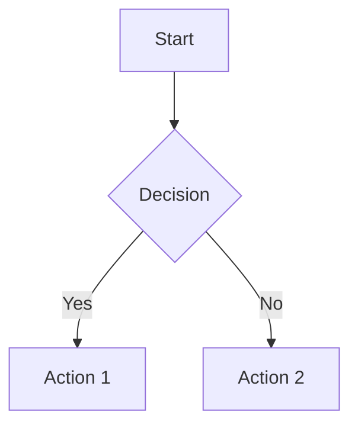

# Diagram Features

Markdown Viewer can convert code-based diagrams into high-resolution images during Word export. This is one of its most powerful features.

## Supported Diagram Types

| Type | Syntax | Best For |
|------|--------|----------|
| [Mermaid](mermaid.md) | `mermaid` | Flowcharts, sequences, architecture |
| [Vega/Vega-Lite](vega.md) | `vega`, `vega-lite` | Data visualization |
| [Draw.io](drawio.md) | `drawio` | Architecture, network, UML |
| [Canvas](canvas.md) | `canvas` | Mind maps, knowledge graphs |
| [Infographic](infographic.md) | `infographic` | Statistics, presentations |
| [Graphviz DOT](graphviz.md) | `dot` | Network graphs, dependencies |

---

## How It Works

1. **Write diagrams as code** in your Markdown file
2. **Preview** them rendered in the browser
3. **Export to Word** — diagrams become high-resolution PNG images

### Example Workflow

**Write this in Markdown:**

````markdown

````

**See it rendered** in the browser as a beautiful flowchart.

**Export to Word** — it becomes a crisp, high-resolution image.

---

## Time Savings

| Task | Traditional | With Markdown Viewer |
|------|-------------|---------------------|
| 15 flowcharts | ~2 hours | ~5 minutes |
| Modify one diagram | Redraw + re-export | Edit code + re-export |
| Quarterly report (5 charts) | ~30 minutes | ~3 minutes |

---

## Diagram Comparison

### When to Use Each Type

| Diagram Type | Use Cases | Examples |
|--------------|-----------|----------|
| **Mermaid** | Process flows, system architecture, sequences | Workflows, API flows, class diagrams |
| **Vega/Vega-Lite** | Data-driven charts | Sales data, analytics, dashboards |
| **Draw.io** | Professional diagrams, rich shape libraries | AWS/Azure architecture, UML, network topology |
| **Canvas** | Spatial layouts, free positioning | Mind maps, concept maps, planning boards |
| **Infographic** | Presentations, statistics | KPIs, comparisons, summaries |
| **Graphviz DOT** | Complex relationships, hierarchies | Dependency trees, org charts, state machines |

---

## Quality & Resolution

All diagrams are rendered at high resolution for crisp output:

- **PNG format** for maximum compatibility
- **Transparent backgrounds** where supported
- **Theme-aware fonts** matching your document style
- **Scalable output** based on your settings

---

## Explore Each Type

- [Mermaid Diagrams](mermaid.md) — The most versatile option
- [Vega/Vega-Lite](vega.md) — For data visualization
- [Draw.io](drawio.md) — For professional architecture diagrams
- [Canvas](canvas.md) — For spatial mind maps
- [Infographic](infographic.md) — For presentations
- [Graphviz DOT](graphviz.md) — For complex graphs
