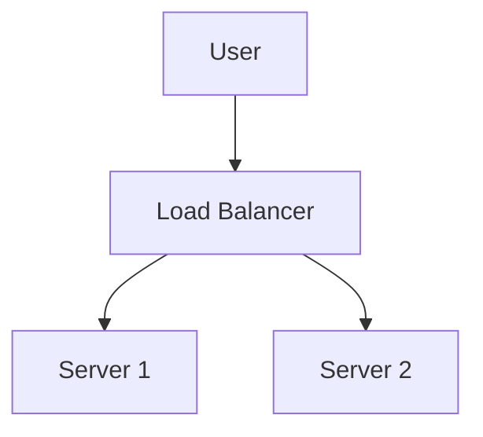

# Markdown Viewer

[English](README.en.md) · [简体中文](README.zh-CN.md) · [繁體中文](README.zh-TW.md) · [Русский](README.ru.md) · [日本語](README.ja.md) · [हिन्दी](README.hi.md) · [한국어](README.ko.md) · [Deutsch](README.de.md) · [Português (Brasil)](README.pt-BR.md) · [Português (Portugal)](README.pt-PT.md) · [Nederlands](README.nl.md) · [Українська](README.uk.md) · [Tiếng Việt](README.vi.md) · [Беларуская](README.be.md) · [Français](README.fr.md) · [Italiano](README.it.md) · [Bahasa Indonesia](README.id.md) · [Español](README.es.md) · [ไทย](README.th.md) · [Svenska](README.sv.md) · [Türkçe](README.tr.md) · [Eesti](README.et.md) · [Bahasa Melayu](README.ms.md) · [Polski](README.pl.md) · [Suomi](README.fi.md) · [Lietuvių](README.lt.md) · [Norsk](README.no.md) · [Dansk](README.da.md)

**Markdown у ідэальны Word адным клікам — Mermaid, Graphviz, Vega, інфаграфіка, LaTeX (рэдагуемы), падсветка кода, лакальная апрацоўка**

*Цалкам бясплатна · 18+ прафесійных тэмаў · 28 моў інтэрфейсу*

🚀 **Install Now:** https://chromewebstore.google.com/detail/markdown-viewer/jekhhoflgcfoikceikgeenibinpojaoi

---

Вы любіце пісаць у Markdown — чыста, эфектыўна, зручна для кантролю версій.  
Але ў рэшце рэшт вам заўсёды патрэбен дакумент Word.

**Стары кашмар:**

😫 Ручныя скрыншоты блок-схем · Капіраванне формул становіцца бязладдзем · Фарматаванне коду ўручную · Наладка табліц ячэйка за ячэйкай · Яшчэ 30 хвілін на каляроўку шрыфтоў, водступаў і колераў пасля экспарту

**Адзін дакумент: 1 гадзіна напісання, 2 гадзіны фарматавання.**

---

**Цяпер гэта займае ўсяго 1 секунду.**

Націсніце, каб спампаваць і атрымаць ідэальны дакумент Word:
- ✅ Дыяграмы Mermaid → Выявы высокай раздзяляльнасці
- ✅ Графы Graphviz DOT → Выявы высокай раздзяляльнасці
- ✅ Формулы LaTeX → Рэдагуемыя раўнанні Word
- ✅ Аўтаматычнае падсвечванне сінтаксісу (100+ моў)
- ✅ 18+ прафесійных тэм адным клікам
- ✅ Цалкам бясплатна, лакальная апрацоўка

**Выдаткуйце час на напісанне, а не на фарматаванне.**

---

## 💫 Паглядзіце ў дзеянні

### Тэхнічная дакументацыя: 15 блок-схем, 2 гадзіны → 5 хвілін

**Раней:** Дыяграма draw.io → Экспарт PNG → Уставіць у Word → Змяніць памер → Паўтарыць 15 разоў = **2 гадзіны**

**Цяпер:** Напісаць код Mermaid → Націснуць спампаваць = **5 хвілін**

## Архітэктура сістэмы

``````markdown

``````

Патрэбныя змены? Змяніце код і экспартуйце зноў. **Эканомія 115 хвілін.**

### Навуковая праца: 50+ формул, 3 гадзіны → 10 хвілін

**Раней:** Рэдактар раўнанняў Word па адным АБО платная падпіска на інструмент = **3 гадзіны + Платная падпіска**

**Цяпер:** Пішыце сінтаксіс LaTeX непасрэдна → Націсніце спампаваць = **10 хвілін + Бясплатна**

Given mass $m$ and acceleration $a$, according to Newton's second law:

```markdown
$$
F = ma = m\frac{dv}{dt} = m\frac{d^2x}{dt^2}
$$
```

Экспартуйце як родны фармат Word, цалкам рэдагуецца. **Не выява, а сапраўдны аб'ект раўнання.**

### Камандная супрацоўніцтва: Тыднёвыя справаздачы, 1 гадзіна → 1 хвіліна

**Раней:** Скапіраваць змесціва → Усталяваць фармат → Наладзіць спісы → Дадаць стылі → Дыяграмы Excel + скрыншоты = **1 гадзіна штотыдзень**

**Цяпер:** Адкрыць файл → Выбраць тэму → Націснуць спампаваць = **1 хвіліна**

Выберыце тэму "Business", дыяграмы даных Vega-Lite аўтаматычна канвертуюцца ў выявы высокай раздзяляльнасці, прафесійны выгляд. **Эканомія 59 хвілін штотыдзень.**

**Бізнес-выпадкі:**
- 📊 Тэндэнцыі продажаў (лінейныя дыяграмы)
- 📈 Параўнанне долі рынку (слупковыя дыяграмы)
- 🎯 Дасягненне KPI (індыкатары)
- 📉 Аналіз выдаткаў (складзеныя дыяграмы)

Дазвольце даным гаварыць, генеруйце прафесійныя справаздачы адным клікам.

---

## 🎯 Тры асноўныя функцыі

### 1. Аўтаматычная канверсія дыяграм

**Дыяграмы Mermaid** · **Graphviz DOT** · **Дыяграмы даных Vega/Vega-Lite** · **Infographic** · Выявы SVG · Складаныя табліцы HTML

**Mermaid:** Блок-схемы, дыяграмы паслядоўнасці, дыяграмы класаў, дыяграмы станаў → Тэхнічная дакументацыя, дызайн архітэктуры  
**Graphviz DOT:** Накіраваныя/ненакіраваныя графы, сеткавая тапалогія, аўтаматы станаў → Архітэктура сістэмы, аналіз залежнасцей  
**Vega/Vega-Lite:** Слупковыя дыяграмы, лінейныя дыяграмы, дыяграмы рассеяння, цеплавыя карты → Бізнес-справаздачы, аналітыка даных  
**Infographic:** Статыстычныя дыяграмы, інфаграфіка, візуалізацыя даных → Прэзентацыя даных, візуальнае апавяданне

**Параўнанне часу:** Складаная дыяграма паслядоўнасці (10 аб'ектаў)
- Традыцыйныя інструменты: Маляванне 30хв + Змена 20хв + Наладка 10хв + Экспарт 5хв = **65 хвілін**
- Markdown Viewer: Напісанне коду 5хв + Змена 30сек + Экспарт 1сек = **6 хвілін**

**Бізнес-сцэнар:** Кв артальная справаздача па продажах (5 слупковых дыяграм)
- Дыяграмы Excel + скрыншоты: Выбар даных 15хв + Фарматаванне 10хв + Скрыншот 5хв = **30 хвілін**
- Vega-Lite: Даныя JSON 2хв + Экспарт адным клікам = **3 хвіліны**

**Дакладна, прафесійна, шматразова выкарыстоўваецца.**

### 2. Ідэальная канверсія формул

LaTeX → Рэдагуемыя раўнанні Word (не выявы!)

Пасля экспарту вы можаце:
- ✅ Працягнуць рэдагаванне ў Word
- ✅ Наладзіць памер шрыфту
- ✅ Змяняць сімвалы і зменныя
- ✅ Капіраваць у іншыя дакументы

**Адна формула, два падыходы:**
- ❌ Рэдактар раўнанняў Word: Клік...клік...клік...выбраць сімвалы...наладзіць пазіцыі
- ✅ LaTeX: `\int_0^\infty e^{-x^2}dx` Гатова

### 3. 18+ прафесійных тэм

Розныя сцэнарыі, розныя стылі, пераключэнне адным клікам:

- 📊 Business / Technical → Бізнес-справаздачы, тэхнічная дакументацыя
- 📚 Academic / Palatino → Навуковыя артыкулы, кнігавыданне  
- 🇨🇳 Songti / Heiti / Mixed → Кітайскія дакументы
- 🎨 Typewriter / Sakura → Крэатыўны кантэнт

**WYSIWYG:** Прадпрагляд выглядае дакладна як экспартаваны Word. Без здагадак, без спроб.

**Больш ніякіх ручных наладак:** Шрыфт, памер, міжрадковы інтэрвал, водступы паміж абзацамі, фон коду...

---

## ⚡ Хуткі як маланка досвед

### Разумны кэш: Першы раз 5с, другі раз 1с

Дакумент з 50 дыяграмамі Mermaid:
- **Першае адкрыццё:** Тэкст адлюстроўваецца імгненна, дыяграмы рэндэрыцца ў фоне, усё гатова на працягу 5с
- **Другое адкрыццё:** Загрузка з кэша, імгненнае адлюстраванне (<1с)
- **Тэкст зменены:** Усё яшчэ імгненна (дыяграмы з кэша)
- **Дыяграма зменена:** Толькі перарэндэрыць зменены дыяграмы

**У 10 разоў хутчэй за Word, у 100 разоў меншыя файлы.**

### Паляпшэнне чытання

- **Тры макеты:** Звычайны (1000px) / Поўнаэкранны / Вузкі (530px, прадпрагляд эфекту Word)
- **Гнуткае маштабаванне:** 50%-400%, спалучэнні клавіш `Ctrl/Cmd +` `-` `0`
- **Разумны змест:** Аўтаматычны выманне загалоўкаў, навігацыя па бакавой панэлі, `Ctrl/Cmd + B` для пераключэння
- **Памяць пазіцыі:** Аўтаматычнае захаванне пазіцыі пракруткі, працяг чытання ў наступны раз
- **Гісторыя:** Адсочванне нядаўна адкрытых дакументаў

---

## 🚀 Хуткі старт - 3 крокі

### Крок 1: Усталяваць пашырэнне (30 секунд)

1. Адкрыйце браўзэр Chrome
2. Наведайце Chrome Web Store
3. Пашукайце "Markdown Viewer"
4. Націсніце "Add to Chrome"
5. ✅ Усталёўка завершана

### Крок 2: Дазволіць доступ да файлаў (1 хвіліна)

**Калі вы хочаце адкрываць лакальныя файлы .md:**

1. Адкрыйце `chrome://extensions/`
2. Знайдзіце Markdown Viewer
3. Уключыце "Allow access to file URLs"
4. ✅ Цяпер вы можаце двойчы клікнуць, каб адкрыць лакальныя файлы Markdown

**Не патрабуецца, калі:**
- Толькі прагляд анлайн-дакументаў (GitHub, блогі і г.д.)
- Выкарыстанне функцыі браўзера "Open File"

### Хуткі старт

**Адкрыць дакументы:** Двойчы клікніце файлы .md або перацягніце ў браўзэр · Дакументы GitHub аўтаматычна рэндэрыцца

**Экспартаваць у Word:** Націсніце кнопку спампоўвання або `Ctrl/Cmd + S` → Бачыць прагрэс → Аўтаматычнае захаванне

**Пераключыць тэмы:** Націсніце панэль інструментаў → Выберыце тэму → Прымяніць імгненна

**Наладзіць выгляд:** `+`/`-` маштаб · Пераключэнне макета · `Ctrl/Cmd + B` змест

---

## 🎁 Поўныя функцыі

### Поўная падтрымка сінтаксісу Markdown

Загалоўкі · Абзацы · Тоўсты · Курсіў · Перакрэслены · Спісы · Спісы задач · Цытаты · Блокі коду (100+ моў падсветкі) · Табліцы · Спасылкі · Выявы · Дыяграмы Mermaid · Дыяграмы Vega / Vega-Lite · Дыяграмы Infographic · Формулы LaTeX · HTML · Пашырэнні GFM

### 18 тэм

**Бізнес:** Default · Business · Technical  
**Акадэмічны:** Academic  
**Serif:** Palatino · Garamond · Cambria · Elegant  
**Sans-serif:** Verdana · Trebuchet · Century  
**Кітайскі:** Songti · Heiti · Mixed  
**Крэатыўны:** Typewriter · Sakura · Water · Minimal

### 28 моў інтэрфейсу

English · 简体中文 · 繁體中文 · Русский · 日本語 · हिन्दी · 한국어 · Deutsch · Português (Brasil) · Português (Portugal) · Nederlands · Українська · Tiếng Việt · Беларуская · Français · Italiano · Bahasa Indonesia · Español · ไทย · Svenska · Türkçe · Eesti · Bahasa Melayu · Polski · Suomi · Lietuvių · Norsk · Dansk

---

## 💎 Канкурэнтныя перавагі

|  | Ручныя скрыншоты | CLI інструменты | Анлайн-сэрвісы | Настольныя рэдактары | Markdown Viewer |
|---|:---:|:---:|:---:|:---:|:---:|
| **Прастата выкарыстання** | Стомна | Патрабуецца наладка | Патрабуецца загрузка | Патрабуецца ўсталёўка | ✅ Адзін клік |
| **Mermaid** | Ручны скрыншот | Патрабуецца плагін | ✅ Падтрымліваецца | ✅ Падтрымліваецца | ✅ Роднная падтрымка |
| **Матэматычныя формулы** | Выявы | Выявы | Выявы | Выявы | ✅ Рэдагуецца |
| **Прыватнасць** | ✅ Лакальна | ✅ Лакальна | ❌ Загрузка ў воблака | ✅ Лакальна | ✅ Лакальна |
| **Тэмы** | - | - | 3-5 | 5-10 | ✅ 18+ |
| **Аўтаномны** | ✅ | ✅ | ❌ | ✅ | ✅ |
| **Прамы прагляд GitHub** | ❌ | ❌ | ❌ | ❌ | ✅ |
| **Кошт** | Бясплатна | Бясплатна | Платныя планы | Платныя планы | ✅ Бясплатна |

**Асноўная перавага: Хутчэй, танней, бяспечней, магутней.**

---

## ❓ FAQ

**П: Ці магу я рэдагаваць экспартаваны дакумент Word?**  
А: Так. Стандартны фармат .docx, матэматычныя формулы рэдагуюцца, не выявы.

**П: Якія дыяграмы падтрымліваюцца?**  
А: Усе дыяграмы Mermaid (блок-схема, паслядоўнасць, gantt, клас, стан, круг, ER і г.д.), дыяграмы візуалізацыі даных Vega / Vega-Lite, статыстычныя дыяграмы Infographic + аўтаматычная канверсія SVG.

**П: Ці ёсць абмежаванне па памеры файла?**  
А: Абмежаванняў няма. Разумны кэш, дакументы з 100+ дыяграмамі адкрываюцца імгненна.

**П: Ці патрабуецца інтэрнэт?**  
А: Не. Цалкам лакальная апрацоўка, працуе аўтаномна.

**П: Ці будуць мае дакументы загружаны?**  
А: Ніколі. Уся апрацоўка адбываецца лакальна.

**П: Як пераключыць тэмы?**  
А: Націсніце значок панэлі інструментаў → Выберыце тэму → Прымяніць імгненна.

**П: Ці магу я наладзіць тэмы?**  
А: У цяперашні час 18 прадусталяваных тэм, наладка неўзабаве.

**П: Ці будуць вялікія дакументы тармазіць?**  
А: Не. Паступовая загрузка + разумны кэш, тэкст адлюстроўваецца імгненна, дыяграмы рэндэрыцца ў фоне (першы раз 5с, другі раз 1с).

**П: Ці займае кэш шмат месца?**  
А: Па змаўчанні максімум 1000 элементаў, прыкладна 500 МБ, можна наладзіць або ачысціць у наладах.

**П: Якія браўзэры падтрымліваюцца?**  
А: Chrome і браўзэры на аснове Chromium (Edge, Brave, Opera).

**П: Якія версіі Word могуць адкрыць экспартаваны файл?**  
А: Word 2016+ цалкам падтрымліваецца, Word 2013 таксама працуе. Цалкам сумяшчальны з WPS Office.

**П: Ці магу я экспартаваць у PDF?**  
А: У цяперашні час толькі Word, PDF запланавана. Вы можаце экспартаваць у Word, затым захаваць як PDF.

**П: Якая тэма мне падыходзіць?**  
А: Бізнес-справаздачы → Business · Навуковыя артыкулы → Academic · Тэхнічная дакументацыя → Technical · Кітайскія дакументы → Songti/Mixed

**П: У чым розніца паміж Vega і Mermaid?**  
А: **Mermaid** для блок-схем, дыяграм архітэктуры і іншых схематычных дыяграм; **Vega/Vega-Lite** для візуалізацыі даных, такіх як дыяграмы продажаў, фінансавыя справаздачы і іншыя бізнес-дыяграмы на аснове даных. Яны дапаўняюць адзін аднаго для розных сцэнараў.

**П: Як стварыць дыяграмы з Vega-Lite?**  
А: Выкарыстоўвайце блок коду ````vega-lite` у Markdown са спецыфікацыяй дыяграмы ў фармаце JSON. Глядзіце [афіцыйныя прыклады Vega-Lite](https://vega.github.io/vega-lite/examples/).

---

## 🔒 Абавязацельства па прыватнасці

- ✅ Уся апрацоўка выконваецца лакальна, ніколі не загружаецца
- ✅ Без адсочвання, без збору асабістых даных
- ✅ Адкрыты зыходны код, правяраемы і празрысты
- ✅ Бяспека ўхвалена Chrome Web Store (Manifest V3)

**Ваша прыватнасць абаронена на 100%.**

---

## 🆘 Атрымаць дапамогу

📖 [Поўная дакументацыя](https://github.com/xicilion/markdown-viewer-extension) · 🐛 [Паведаміць аб праблемах](https://github.com/xicilion/markdown-viewer-extension/issues) · 💡 [Запыты на функцыі](https://github.com/xicilion/markdown-viewer-extension/issues) · ⭐ [GitHub Star](https://github.com/xicilion/markdown-viewer-extension)

---

## 🎉 Пачніце зараз

**Усталюйце за 30 секунд, пачынайце выкарыстоўваць адразу:**

1. Наведайце Chrome Web Store → Пашукайце "Markdown Viewer"
2. Націсніце "Add to Chrome"
3. Націсніце "Manage Extensions", Уключыце "Allow access to file URLs"
4. Перацягніце файлы `.md` у браўзэр
5. ✅ Пачынайце выкарыстоўваць

**Вы атрымаеце:** Markdown → Word канверсія адным клікам · Mermaid аўтаматычная канверсія · LaTeX рэдагуемыя формулы · 100+ моў падсветка сінтаксісу · 18+ тэм · Разумны кэш · Цалкам бясплатна

**Ідэальна для:** Тэхнічных пісьменнікаў · Студэнтаў/даследчыкаў · Менеджэраў прадуктаў · Распрацоўшчыкаў · Усіх, хто выкарыстоўвае Markdown

---

## 📜 Ліцэнзія адкрытага зыходнага коду

Гэты праект з'яўляецца адкрытым зыходным кодам па ліцэнзіі ISC. Запрашаем ставіць Star, паведамляць аб праблемах, прапаноўваць функцыі і ўносіць уклад у код.

**URL праекта:** https://github.com/xicilion/markdown-viewer-extension

---

**Спыніце марнаваць час на фарматаванне**

**Засяродзьцеся на напісанні, дазвольце Markdown Viewer апрацаваць усё астатняе**

🚀 **Усталяваць зараз:** https://chromewebstore.google.com/detail/markdown-viewer/jekhhoflgcfoikceikgeenibinpojaoi

*Цалкам бясплатна · Лакальная апрацоўка · Абароненая прыватнасць*
