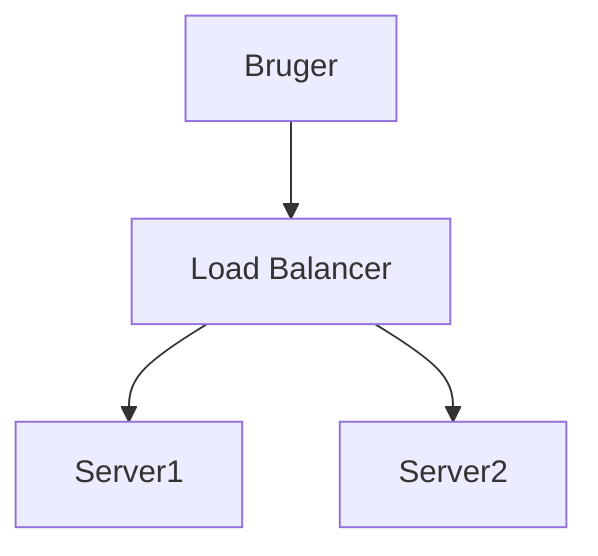

# Markdown Viewer

[简体中文](README.zh-CN.md) · [繁體中文](README.zh-TW.md) · [English](README.en.md) · [Русский](README.ru.md) · [日本語](README.ja.md) · [한국어](README.ko.md) · [Português (Brasil)](README.pt-BR.md) · [Português (Portugal)](README.pt-PT.md) · [Español](README.es.md) · [Deutsch](README.de.md) · [Français](README.fr.md) · [Українська](README.uk.md) · [Tiếng Việt](README.vi.md) · [Italiano](README.it.md) · [Türkçe](README.tr.md) · [Bahasa Indonesia](README.id.md) · [Lietuvių](README.lt.md) · [Nederlands](README.nl.md) · [Suomi](README.fi.md) · [ไทย](README.th.md) · [Polski](README.pl.md) · [हिन्दी](README.hi.md) · [Svenska](README.sv.md) · [Norsk](README.no.md) · [Dansk](README.da.md)

**Skriv dokumenter i Markdown, eksporter perfekte Word-dokumenter med ét klik.**

*Helt gratis · Lokal behandling · 18+ professionelle temaer · Understøtter 23 sprog*

🚀 **Installer nu:** https://chromewebstore.google.com/detail/markdown-viewer/jekhhoflgcfoikceikgeenibinpojaoi

---

Du elsker at skrive i Markdown — simpelt, effektivt, versionskontrol-venligt.  
Men til sidst har du altid brug for et Word-dokument.

**Det tidligere mareridt:**

😫 Manuelle screenshots af flowcharts · Matematiske formler ødelægges ved kopiering · Manuel kodeformatering · Juster tabeller celle for celle · Efter eksport, en halv time til at justere skrifttyper, mellemrum og farver

**Ét dokument: 1 times skrivning, 2 timers formatering.**

---

**Nu tager det kun 1 sekund.**

Klik for at downloade og få et perfekt Word-dokument:
- ✅ Mermaid-diagrammer → HD-billeder
- ✅ Graphviz DOT-grafer → HD-billeder
- ✅ LaTeX-formler → Redigerbare Word-formler
- ✅ Automatisk kodehøjdepunktering (100+ sprog)
- ✅ 18+ professionelle temaer med ét klik
- ✅ Helt gratis, lokal behandling

**Brug din tid på at skrive, ikke på formatering.**

---

## 💫 Se de faktiske resultater

### Teknisk dokumentation: 15 flowcharts, 2 timer → 5 minutter

**Før:** tegn i draw.io → eksporter PNG → indsæt i Word → juster størrelse → gentag 15 gange = **2 timer**

**Nu:** Skriv diagrammer med Mermaid-kode → klik for at downloade = **5 minutter**

## Systemarkitektur

``````markdown

``````

Ændring? Ændr koden og eksporter igen. **Spar 115 minutter.**

### Akademisk artikel: 50+ formler, 3 timer → 10 minutter

**Før:** Word formeleditor én efter én ELLER betalt værktøjsabonnement = **3 timer + Betalt abonnement**

**Nu:** Skriv LaTeX-syntaks direkte → klik for at downloade = **10 minutter + Gratis**

Givet masse $m$ og acceleration $a$, ifølge Newtons anden lov:

```markdown
$$
F = ma = m\frac{dv}{dt} = m\frac{d^2x}{dt^2}
$$
```

Eksporteret som indbygget Word-format, fuldt redigerbart. **Ikke et billede, men et ægte ligningsobjekt.**

### Teamsamarbejde: Ugentlige rapporter, 1 time → 1 minut

**Før:** Kopier indhold → Indstil format → Juster lister → Tilføj styling → Excel-diagrammer + screenshots = **1 time ugentligt**

**Nu:** Åbn fil → Vælg tema → Klik for at downloade = **1 minut**

Vælg "Business"-tema, Vega-Lite datadiagrammer konverteres automatisk til højopløsningsbilleder, professionelt udseende. **Spar 59 minutter ugentligt.**

**Forretningscases:**
- 📊 Salgstrends (linjediagrammer)
- 📈 Markedsandelsammenligning (søjlediagrammer)
- 🎯 KPI-opnåelse (målere)
- 📉 Omkostningsanalyse (stablede diagrammer)

Lad data tale, generer professionelle rapporter med ét klik.

---

## 🎯 Tre kernefunktioner

### 1. Automatisk diagramkonvertering

**Mermaid-diagrammer** · **Graphviz DOT** · **Vega/Vega-Lite datadiagrammer** · **Infographic** · SVG-billeder · Komplekse HTML-tabeller

**Mermaid:** Flowcharts, sekvensdiagrammer, klassediagrammer, tilstandsdiagrammer → Teknisk dokumentation, arkitekturdesign  
**Graphviz DOT:** Rettede/urettede grafer, netværkstopologi, tilstandsmaskiner → Systemarkitektur, afhængighedsanalyse  
**Vega/Vega-Lite:** Søjlediagrammer, linjediagrammer, punktdiagrammer, varmekort → Forretningsrapporter, dataanalyse  
**Infographic:** Statistiske diagrammer, infografikker, datavisualisering → Datapræsentation, visuel historiefortælling

**Tidssammenligning:** Komplekst sekvensdiagram (10 objekter)
- Traditionelle værktøjer: Tegn 30min + Modificer 20min + Juster 10min + Eksporter 5min = **65 minutter**
- Markdown Viewer: Skriv kode 5min + Modificer 30sek + Eksporter 1sek = **6 minutter**

**Forretningsscenarie:** Kvartalsvis salgsrapport (5 søjlediagrammer)
- Excel-diagrammer + screenshots: Vælg data 15min + Formater 10min + Screenshot 5min = **30 minutter**
- Vega-Lite: JSON-data 2min + Ét klik eksport = **3 minutter**

**Præcis, professionel, genanvendelig.**

### 2. Perfekt formelkonvertering

LaTeX → Word redigerbare ligninger (ikke billeder!)

Efter eksport kan du:
- ✅ Fortsætte med at redigere i Word
- ✅ Justere skriftstørrelse
- ✅ Modificere symboler og variabler
- ✅ Kopiere til andre dokumenter

**Én formel, to tilgange:**
- ❌ Word formeleditor: Klik...klik...klik...vælg symboler...juster positioner
- ✅ LaTeX: `\int_0^\infty e^{-x^2}dx` Færdig

### 3. 18+ professionelle temaer

Forskellige scenarier, forskellige stilarter, skift med ét klik:

- 📊 Business / Technical → Forretningsrapporter, teknisk dokumentation
- 📚 Academic / Palatino → Akademiske artikler, bogsætning  
- 🇨🇳 Songti / Heiti / Mixed → Kinesiske dokumenter
- 🎨 Typewriter / Sakura → Kreativt indhold

**WYSIWYG:** Forhåndsvisningen ser nøjagtigt ud som eksporteret Word. Ingen gætværk, ingen forsøg.

**Ingen flere manuelle justeringer:** Skrifttype, størrelse, linjeafstand, afsnitsafstand, kodebaggrund...

---

## ⚡ Lynhurtig oplevelse

### Smart cache: Første gang 5s, anden gang 1s

Dokument med 50 Mermaid-diagrammer:
- **Første åbning:** Tekst vises øjeblikkeligt, diagrammer renderes i baggrunden, alt færdigt inden for 5s
- **Anden åbning:** Indlæs fra cache, øjeblikkelig visning (<1s)
- **Tekst modificeret:** Stadig øjeblikkeligt (diagrammer fra cache)
- **Diagram modificeret:** Genrender kun ændrede diagrammer

**10x hurtigere end Word, 100x mindre filer.**

### Læseforbedringer

- **Tre layouts:** Normal (1000px) / Fuld skærm / Smal (530px, forhåndsvisning Word-effekt)
- **Fleksibel zoom:** 50%-400%, genveje `Ctrl/Cmd +` `-` `0`
- **Smart indholdsfortegnelse:** Auto-udtræk overskrifter, sidebjælkenavigation, `Ctrl/Cmd + B` for at skifte
- **Positionshukommelse:** Auto-gem scrollposition, fortsæt med at læse næste gang
- **Historik:** Spor nyligt åbnede dokumenter

---

## 🚀 Hurtig start - 3 trin

### Trin 1: Installer udvidelse (30 sekunder)

1. Åbn Chrome-browser
2. Besøg Chrome Web Store
3. Søg "Markdown Viewer"
4. Klik "Tilføj til Chrome"
5. ✅ Installation fuldført

### Trin 2: Tillad filadgang (1 minut)

**Hvis du vil åbne lokale .md-filer:**

1. Åbn `chrome://extensions/`
2. Find Markdown Viewer
3. Aktivér "Tillad adgang til fil-URL'er"
4. ✅ Nu kan du dobbeltklikke for at åbne lokale Markdown-filer

**Ikke nødvendigt hvis:**
- Kun visning af online dokumenter (GitHub, blogs osv.)
- Brug af browserens "Åbn fil"-funktion

### Hurtig start

**Åbn dokumenter:** Dobbeltklik .md-filer, eller træk til browser · GitHub-dokumenter auto-renderet

**Eksporter til Word:** Klik downloadknap eller `Ctrl/Cmd + S` → Se fremskridt → Auto-gem

**Skift temaer:** Klik værktøjslinje → Vælg tema → Anvend øjeblikkeligt

**Juster visning:** `+`/`-` zoom · Layout skift · `Ctrl/Cmd + B` indholdsfortegnelse

---

## 🎁 Komplette funktioner

### Fuld Markdown-syntaksstøtte

Overskrifter · Afsnit · Fed · Kursiv · Gennemstreget · Lister · Opgavelister · Blokcitater · Kodeblokke (100+ sprog fremhævet) · Tabeller · Links · Billeder · Mermaid-diagrammer · Vega / Vega-Lite diagrammer · Infographic diagrammer · LaTeX-formler · HTML · GFM-udvidelser

### 18 temaer

**Business:** Default · Business · Technical  
**Akademisk:** Academic  
**Serif:** Palatino · Garamond · Cambria · Elegant  
**Sans-serif:** Verdana · Trebuchet · Century  
**Kinesisk:** Songti · Heiti · Mixed  
**Kreativ:** Typewriter · Sakura · Water · Minimal

### 25 grænsefladesprog

简体中文 · 繁體中文 · English · Русский · 日本語 · 한국어 · Português (Brasil) · Português (Portugal) · Español · Deutsch · Français · Українська · Tiếng Việt · Italiano · Türkçe · Bahasa Indonesia · Lietuvių · Nederlands · Suomi · ไทย · Polski · हिन्दी · Svenska · Norsk · Dansk

---

## 💎 Konkurrencefordele

|  | Manuelle screenshots | CLI-værktøjer | Onlinetjenester | Desktop-editorer | Markdown Viewer |
|---|:---:|:---:|:---:|:---:|:---:|
| **Brugervenlighed** | Besværligt | Opsætning nødvendig | Upload nødvendig | Installation nødvendig | ✅ Ét klik |
| **Mermaid** | Manuel screenshot | Plugin nødvendig | ✅ Understøttet | ✅ Understøttet | ✅ Indbygget support |
| **Matematikeformler** | Billeder | Billeder | Billeder | Billeder | ✅ Redigerbar |
| **Privatliv** | ✅ Lokal | ✅ Lokal | ❌ Cloud-upload | ✅ Lokal | ✅ Lokal |
| **Temaer** | - | - | 3-5 | 5-10 | ✅ 18+ |
| **Offline** | ✅ | ✅ | ❌ | ✅ | ✅ |
| **GitHub direkte visning** | ❌ | ❌ | ❌ | ❌ | ✅ |
| **Pris** | Gratis | Gratis | Betalte planer | Betalte planer | ✅ Gratis |

**Kernefordel: Hurtigere, billigere, sikrere, mere kraftfuld.**

---

## ❓ Ofte stillede spørgsmål

**Sp: Kan jeg redigere det eksporterede Word-dokument?**  
Sv: Ja. Standard .docx-format, matematikformler er redigerbare, ikke billeder.

**Sp: Hvilke diagrammer understøttes?**  
Sv: Alle Mermaid-diagrammer (flowchart, sekvens, gantt, klasse, tilstand, cirkel, ER osv.), Vega / Vega-Lite datavisualiseringsdiagrammer, Infographic statistiske diagrammer + SVG auto-konvertering.

**Sp: Er der en filstørrelsesbegrænsning?**  
Sv: Ingen begrænsning. Smart cache, dokumenter med 100+ diagrammer åbner øjeblikkeligt.

**Sp: Kræver det internet?**  
Sv: Nej. Fuldstændig lokal behandling, fungerer offline.

**Sp: Vil mine dokumenter blive uploadet?**  
Sv: Aldrig. Al behandling sker lokalt.

**Sp: Hvordan skifter jeg temaer?**  
Sv: Klik værktøjslinjeikon → Vælg tema → Anvend øjeblikkeligt.

**Sp: Kan jeg tilpasse temaer?**  
Sv: I øjeblikket 18 forudindstillede temaer, tilpasning kommer snart.

**Sp: Vil store dokumenter hænge?**  
Sv: Nej. Progressiv indlæsning + smart cache, tekst vises øjeblikkeligt, diagrammer renderes i baggrunden (første 5s, anden 1s).

**Sp: Optager cachen meget plads?**  
Sv: Standard maks. 1000 elementer, ca. 500 MB, justerbar eller rydbar i indstillinger.

**Sp: Hvilke browsere understøttes?**  
Sv: Chrome og Chromium-baserede browsere (Edge, Brave, Opera).

**Sp: Hvilke Word-versioner kan åbne den eksporterede fil?**  
Sv: Word 2016+ fuldt understøttet, Word 2013 virker også. Fuldt kompatibel med WPS Office.

**Sp: Kan jeg eksportere til PDF?**  
Sv: I øjeblikket kun Word, PDF planlagt. Du kan eksportere til Word og derefter gemme som PDF.

**Sp: Hvilket tema passer til mig?**  
Sv: Forretningsrapporter → Business · Akademiske artikler → Academic · Teknisk dokumentation → Technical · Kinesiske dokumenter → Songti/Mixed

**Sp: Hvad er forskellen mellem Vega og Mermaid?**  
Sv: **Mermaid** er til flowcharts, arkitekturdiagrammer og andre skematiske diagrammer; **Vega/Vega-Lite** er til datavisualisering som salgsdiagrammer, finansielle rapporter og andre datadrevne forretningsdiagrammer. De komplementerer hinanden til forskellige scenarier.

**Sp: Hvordan opretter man diagrammer med Vega-Lite?**  
Sv: Brug ````vega-lite` kodeblok i Markdown med JSON-format diagramspecifikation. Se [Vega-Lite officielle eksempler](https://vega.github.io/vega-lite/examples/).

---

## 🔒 Privatlivsforpligtelse

- ✅ Al behandling udført lokalt, aldrig uploadet
- ✅ Ingen sporing, ingen indsamling af personlige data
- ✅ Open source-kode, reviderbar og gennemsigtig
- ✅ Chrome Web Store sikkerhedsgodkendt (Manifest V3)

**Dit privatliv er 100% beskyttet.**

---

## 🆘 Få hjælp

📖 [Fuld dokumentation](https://github.com/xicilion/markdown-viewer-extension) · 🐛 [Rapporter problemer](https://github.com/xicilion/markdown-viewer-extension/issues) · 💡 [Funktionsanmodninger](https://github.com/xicilion/markdown-viewer-extension/issues) · ⭐ [GitHub Star](https://github.com/xicilion/markdown-viewer-extension)

---

## 🎉 Kom i gang nu

**Installer på 30 sekunder, begynd at bruge med det samme:**

1. Besøg Chrome Web Store → Søg "Markdown Viewer"
2. Klik "Tilføj til Chrome"
3. Klik "Administrer udvidelser", aktiver "Tillad adgang til fil-URL'er"
4. Træk `.md`-filer til browser
5. ✅ Begynd at bruge

**Du får:** Markdown → Word ét-klik konvertering · Mermaid auto-konvertering · LaTeX redigerbare formler · 100+ sprog syntaksfremhævning · 18+ temaer · Smart cache · Fuldstændig gratis

**Perfekt til:** Tekniske forfattere · Studerende/forskere · Produktchefer · Udviklere · Alle der bruger Markdown

---

## 📜 Open source-licens

Dette projekt er open source under ISC-licens. Velkommen til at give Star, rapportere problemer, foreslå funktioner og bidrage med kode.

**Projekt-URL:** https://github.com/xicilion/markdown-viewer-extension

---

**Stop med at spilde tid på formatering**

**Fokuser på at skrive, lad Markdown Viewer håndtere alt andet**

🚀 **Installer nu:** https://chromewebstore.google.com/detail/markdown-viewer/jekhhoflgcfoikceikgeenibinpojaoi

*Fuldstændig gratis · Lokal behandling · Privatliv beskyttet*
