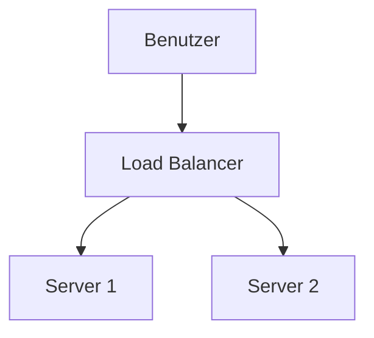

# Markdown Viewer

[简体中文](README.zh-CN.md) · [繁體中文](README.zh-TW.md) · [English](README.en.md) · [Русский](README.ru.md) · [日本語](README.ja.md) · [한국어](README.ko.md) · [Português (Brasil)](README.pt-BR.md) · [Português (Portugal)](README.pt-PT.md) · [Español](README.es.md) · [Deutsch](README.de.md) · [Français](README.fr.md) · [Українська](README.uk.md) · [Tiếng Việt](README.vi.md) · [Italiano](README.it.md) · [Türkçe](README.tr.md) · [Bahasa Indonesia](README.id.md) · [Lietuvių](README.lt.md) · [Nederlands](README.nl.md) · [Suomi](README.fi.md) · [ไทย](README.th.md) · [Polski](README.pl.md) · [हिन्दी](README.hi.md) · [Svenska](README.sv.md) · [Norsk](README.no.md) · [Dansk](README.da.md)

**In Markdown schreiben, mit einem Klick perfekt nach Word exportieren.**

*Völlig kostenlos · Lokale Verarbeitung · 18+ professionelle Themes · 25 Sprachen*

🚀 **Jetzt installieren:** https://chromewebstore.google.com/detail/markdown-viewer/jekhhoflgcfoikceikgeenibinpojaoi

---

Sie lieben es, in Markdown zu schreiben – sauber, effizient, versionskontrollfreundlich.  
Aber irgendwann brauchen Sie immer ein Word-Dokument.

**Der alte Albtraum:**

😫 Flussdiagramme manuell screenshot · Formeln kopieren wird chaotisch · Code manuell formatieren · Tabellen Zelle für Zelle anpassen · Nach dem Export weitere 30 Minuten für Schriftarten, Abstände und Farben

**Ein Dokument: 1 Stunde schreiben, 2 Stunden formatieren.**

---

**Jetzt dauert es nur 1 Sekunde.**

Klicken Sie auf Download und erhalten Sie ein perfektes Word-Dokument:
- ✅ Mermaid-Diagramme → Hochauflösende Bilder
- ✅ Graphviz DOT-Graphen → Hochauflösende Bilder
- ✅ LaTeX-Formeln → Bearbeitbare Word-Gleichungen
- ✅ Automatische Syntaxhervorhebung (100+ Sprachen)
- ✅ 18+ professionelle Themes mit einem Klick
- ✅ Völlig kostenlos, lokale Verarbeitung

**Verbringen Sie Zeit mit dem Schreiben, nicht mit der Formatierung.**

---

## 💫 Sehen Sie es in Aktion

### Technische Dokumentation: 15 Flussdiagramme, 2 Stunden → 5 Minuten

**Vorher:** draw.io Diagramm → PNG exportieren → In Word einfügen → Größe anpassen → 15 Mal wiederholen = **2 Stunden**

**Jetzt:** Mermaid-Code schreiben → Download klicken = **5 Minuten**

## Systemarchitektur

``````markdown

``````

Änderungen nötig? Code ändern und neu exportieren. **Sparen Sie 115 Minuten.**

### Akademisches Paper: 50+ Formeln, 3 Stunden → 10 Minuten

**Vorher:** Word-Formeleditor einzeln ODER bezahltes Tool-Abo = **3 Stunden + Bezahltes Abo**

**Jetzt:** LaTeX-Syntax direkt schreiben → Download klicken = **10 Minuten + Kostenlos**

Gegeben Masse $m$ und Beschleunigung $a$, nach Newtons zweitem Gesetz:

```markdown
$$
F = ma = m\frac{dv}{dt} = m\frac{d^2x}{dt^2}
$$
```

Als natives Word-Format exportiert, vollständig bearbeitbar. **Kein Bild, sondern ein echtes Gleichungsobjekt.**

### Teamzusammenarbeit: Wöchentliche Berichte, 1 Stunde → 1 Minute

**Vorher:** Inhalt kopieren → Format einstellen → Listen anpassen → Styling hinzufügen → Excel-Diagramme + Screenshots = **1 Stunde wöchentlich**

**Jetzt:** Datei öffnen → Theme wählen → Download klicken = **1 Minute**

Wählen Sie das "Business"-Theme, Vega-Lite-Datendiagramme werden automatisch in hochauflösende Bilder konvertiert, professionelles Aussehen. **Sparen Sie 59 Minuten wöchentlich.**

**Business-Anwendungsfälle:**
- 📊 Verkaufstrends (Liniendiagramme)
- 📈 Marktanteilsvergleich (Balkendiagramme)
- 🎯 KPI-Erreichung (Messgeräte)
- 📉 Kostenanalyse (gestapelte Diagramme)

Lassen Sie Daten sprechen, generieren Sie professionelle Berichte mit einem Klick.

---

## 🎯 Drei Kernfunktionen

### 1. Automatische Diagrammkonvertierung

**Mermaid-Diagramme** · **Graphviz DOT** · **Vega/Vega-Lite-Datendiagramme** · **Infographic** · SVG-Bilder · Komplexe HTML-Tabellen

**Mermaid:** Flussdiagramme, Sequenzdiagramme, Klassendiagramme, Zustandsdiagramme → Technische Dokumente, Architekturdesign  
**Graphviz DOT:** Gerichtete/ungerichtete Graphen, Netzwerktopologie, Zustandsautomaten → Systemarchitektur, Abhängigkeitsanalyse  
**Vega/Vega-Lite:** Balkendiagramme, Liniendiagramme, Streudiagramme, Heatmaps → Geschäftsberichte, Datenanalyse  
**Infographic:** Statistische Diagramme, Infografiken, Datenvisualisierung → Datenpräsentation, visuelles Storytelling

**Zeitvergleich:** Komplexes Sequenzdiagramm (10 Objekte)
- Traditionelle Tools: Zeichnen 30min + Ändern 20min + Anpassen 10min + Exportieren 5min = **65 Minuten**
- Markdown Viewer: Code schreiben 5min + Ändern 30s + Exportieren 1s = **6 Minuten**

**Business-Szenario:** Quartalsumsatzbericht (5 Balkendiagramme)
- Excel-Diagramme + Screenshots: Daten auswählen 15min + Formatieren 10min + Screenshot 5min = **30 Minuten**
- Vega-Lite: JSON-Daten 2min + Ein-Klick-Export = **3 Minuten**

**Präzise, professionell, wiederverwendbar.**

### 2. Perfekte Formelkonvertierung

LaTeX → Bearbeitbare Word-Gleichungen (keine Bilder!)

Nach dem Export können Sie:
- ✅ In Word weiter bearbeiten
- ✅ Schriftgröße anpassen
- ✅ Symbole und Variablen ändern
- ✅ In andere Dokumente kopieren

**Eine Formel, zwei Ansätze:**
- ❌ Word-Formeleditor: Klick...Klick...Klick...Symbole auswählen...Positionen anpassen
- ✅ LaTeX: `\int_0^\infty e^{-x^2}dx` Fertig

### 3. 18+ professionelle Themes

Verschiedene Szenarien, verschiedene Stile, Ein-Klick-Wechsel:

- 📊 Business / Technical → Geschäftsberichte, technische Dokumente
- 📚 Academic / Palatino → Akademische Arbeiten, Buchsatz  
- 🇨🇳 Songti / Heiti / Mixed → Chinesische Dokumente
- 🎨 Typewriter / Sakura → Kreative Inhalte

**WYSIWYG:** Die Vorschau sieht genauso aus wie das exportierte Word. Kein Raten, kein Ausprobieren.

**Keine manuellen Anpassungen mehr:** Schriftart, Größe, Zeilenabstand, Absatzabstand, Code-Hintergrundfarbe...

---

## ⚡ Blitzschnelle Erfahrung

### Intelligenter Cache: Erstes Mal 5s, zweites Mal 1s

Dokument mit 50 Mermaid-Diagrammen:
- **Erstes Öffnen:** Text wird sofort angezeigt, Diagramme werden im Hintergrund gerendert, alles innerhalb von 5s erledigt
- **Zweites Öffnen:** Aus Cache laden, sofortige Anzeige (<1s)
- **Text geändert:** Immer noch sofort (Diagramme aus Cache)
- **Diagramm geändert:** Nur geänderte Diagramme neu rendern

**10x schneller als Word, 100x kleinere Dateien.**

### Leseverbesserung

- **Drei Layouts:** Normal (1000px) / Vollbild / Schmal (530px, Vorschau-Word-Effekt)
- **Flexibler Zoom:** 50%-400%, Tastenkombinationen `Strg/Cmd +` `-` `0`
- **Intelligentes Inhaltsverzeichnis:** Überschriften automatisch extrahieren, Seitenleistennavigation, `Strg/Cmd + B` zum Umschalten
- **Positionsspeicher:** Scrollposition automatisch speichern, nächstes Mal weiterlesen
- **Verlauf:** Zuletzt geöffnete Dokumente verfolgen

---

## 🚀 Schnellstart - 3 Schritte

### Schritt 1: Erweiterung installieren (30 Sekunden)

1. Chrome-Browser öffnen
2. Chrome Web Store besuchen
3. "Markdown Viewer" suchen
4. "Zu Chrome hinzufügen" klicken
5. ✅ Installation abgeschlossen

### Schritt 2: Dateizugriff erlauben (1 Minute)

**Wenn Sie lokale .md-Dateien öffnen möchten:**

1. `chrome://extensions/` öffnen
2. Markdown Viewer finden
3. "Zugriff auf Datei-URLs zulassen" aktivieren
4. ✅ Jetzt können Sie lokale Markdown-Dateien per Doppelklick öffnen

**Nicht erforderlich, wenn:**
- Nur Online-Dokumente anzeigen (GitHub, Blogs usw.)
- Browser-Funktion "Datei öffnen" verwenden

### Schnellstart

**Dokumente öffnen:** .md-Dateien doppelklicken oder in Browser ziehen · GitHub-Dokumente werden automatisch gerendert

**Nach Word exportieren:** Download-Button klicken oder `Strg/Cmd + S` → Fortschritt sehen → Automatisch speichern

**Themes wechseln:** Symbolleiste klicken → Theme wählen → Sofort anwenden

**Ansicht anpassen:** `+`/`-` Zoom · Layout wechseln · `Strg/Cmd + B` Inhaltsverzeichnis

---

## 🎁 Vollständige Funktionen

### Volle Markdown-Syntax-Unterstützung

Überschriften · Absätze · Fett · Kursiv · Durchgestrichen · Listen · Aufgabenlisten · Blockzitate · Codeblöcke (100+ Sprachen hervorgehoben) · Tabellen · Links · Bilder · Mermaid-Diagramme · Vega/Vega-Lite-Diagramme · Infographic-Diagramme · LaTeX-Formeln · HTML · GFM-Erweiterungen

### 18 Themes

**Business:** Default · Business · Technical  
**Akademisch:** Academic  
**Serif:** Palatino · Garamond · Cambria · Elegant  
**Sans-serif:** Verdana · Trebuchet · Century  
**Chinesisch:** Songti · Heiti · Mixed  
**Kreativ:** Typewriter · Sakura · Water · Minimal

### 25 Oberflächensprachen

简体中文 · 繁體中文 · English · Русский · 日本語 · 한국어 · Português (Brasil) · Português (Portugal) · Español · Deutsch · Français · Українська · Tiếng Việt · Italiano · Türkçe · Bahasa Indonesia · Lietuvių · Nederlands · Suomi · ไทย · Polski · हिन्दी · Svenska · Norsk · Dansk

---

## 💎 Wettbewerbsvorteile

|  | Manuelle Screenshots | CLI-Tools | Online-Dienste | Desktop-Editoren | Markdown Viewer |
|---|:---:|:---:|:---:|:---:|:---:|
| **Benutzerfreundlichkeit** | Mühsam | Setup erforderlich | Upload erforderlich | Installation erforderlich | ✅ Ein-Klick |
| **Mermaid** | Manueller Screenshot | Plugin erforderlich | ✅ Unterstützt | ✅ Unterstützt | ✅ Native Unterstützung |
| **Mathe-Formeln** | Bilder | Bilder | Bilder | Bilder | ✅ Bearbeitbar |
| **Privatsphäre** | ✅ Lokal | ✅ Lokal | ❌ Cloud-Upload | ✅ Lokal | ✅ Lokal |
| **Themes** | - | - | 3-5 | 5-10 | ✅ 18+ |
| **Offline** | ✅ | ✅ | ❌ | ✅ | ✅ |
| **GitHub Direktansicht** | ❌ | ❌ | ❌ | ❌ | ✅ |
| **Preis** | Kostenlos | Kostenlos | Bezahlpläne | Bezahlpläne | ✅ Kostenlos |

**Kernvorteil: Schneller, günstiger, sicherer, leistungsstärker.**

---

## ❓ FAQ

**F: Kann ich das exportierte Word-Dokument bearbeiten?**  
A: Ja. Standard-.docx-Format, mathematische Formeln sind bearbeitbar, keine Bilder.

**F: Welche Diagramme werden unterstützt?**  
A: Alle Mermaid-Diagramme (Flussdiagramm, Sequenz, Gantt, Klasse, Zustand, Kreisdiagramm, ER usw.), Vega/Vega-Lite-Datenvisualisierungsdiagramme, Infographic-Statistikdiagramme + SVG-Autokonvertierung.

**F: Gibt es eine Dateigrößenbeschränkung?**  
A: Keine Beschränkung. Intelligenter Cache, Dokumente mit 100+ Diagrammen öffnen sich sofort.

**F: Ist eine Internetverbindung erforderlich?**  
A: Nein. Vollständig lokale Verarbeitung, funktioniert offline.

**F: Werden meine Dokumente hochgeladen?**  
A: Niemals. Alle Verarbeitung erfolgt lokal.

**F: Wie wechsle ich Themes?**  
A: Symbolleistensymbol klicken → Theme wählen → Sofort anwenden.

**F: Kann ich Themes anpassen?**  
A: Derzeit 18 voreingestellte Themes, Anpassung in Planung.

**F: Werden große Dokumente langsam?**  
A: Nein. Progressives Laden + intelligenter Cache, Text wird sofort angezeigt, Diagramme werden im Hintergrund gerendert (erstes Mal 5s, zweites Mal 1s).

**F: Nimmt der Cache viel Speicherplatz ein?**  
A: Standardmäßig max. 1000 Elemente, ca. 500 MB, in Einstellungen anpassbar oder löschbar.

**F: Welche Browser werden unterstützt?**  
A: Chrome und Chromium-basierte Browser (Edge, Brave, Opera).

**F: Welche Word-Versionen können die exportierte Datei öffnen?**  
A: Word 2016+ vollständig unterstützt, Word 2013 funktioniert auch. Vollständig kompatibel mit WPS Office.

**F: Kann ich nach PDF exportieren?**  
A: Derzeit nur Word, PDF geplant. Sie können erst nach Word exportieren und dann als PDF speichern.

**F: Welches Theme passt zu mir?**  
A: Geschäftsberichte → Business · Akademische Arbeiten → Academic · Technische Dokumente → Technical · Chinesische Dokumente → Songti/Mixed

**F: Was ist der Unterschied zwischen Vega und Mermaid?**  
A: **Mermaid** ist für Flussdiagramme, Architekturdiagramme und andere schematische Diagramme; **Vega/Vega-Lite** ist für Datenvisualisierung wie Verkaufsdiagramme, Finanzberichte und andere datengesteuerte Geschäftsdiagramme. Sie ergänzen sich für verschiedene Szenarien.

**F: Wie erstelle ich Diagramme mit Vega-Lite?**  
A: Verwenden Sie ````vega-lite` Codeblock in Markdown mit JSON-Format-Diagrammspezifikation. Siehe [Vega-Lite offizielle Beispiele](https://vega.github.io/vega-lite/examples/).

---

## 🔒 Datenschutzversprechen

- ✅ Alle Verarbeitung erfolgt lokal, niemals hochgeladen
- ✅ Keine Verfolgung, keine Erfassung persönlicher Daten
- ✅ Open-Source-Code, prüfbar und transparent
- ✅ Chrome Web Store Sicherheit genehmigt (Manifest V3)

**Ihre Privatsphäre ist zu 100% geschützt.**

---

## 🆘 Hilfe erhalten

📖 [Vollständige Dokumentation](https://github.com/xicilion/markdown-viewer-extension) · 🐛 [Probleme melden](https://github.com/xicilion/markdown-viewer-extension/issues) · 💡 [Feature-Anfragen](https://github.com/xicilion/markdown-viewer-extension/issues) · ⭐ [GitHub Star](https://github.com/xicilion/markdown-viewer-extension)

---

## 🎉 Jetzt loslegen

**In 30 Sekunden installieren, sofort nutzen:**

1. Chrome Web Store besuchen → "Markdown Viewer" suchen
2. "Zu Chrome hinzufügen" klicken
3. "Erweiterungen verwalten" klicken, "Zugriff auf Datei-URLs zulassen" aktivieren
4. `.md`-Dateien in Browser ziehen
5. ✅ Nutzung beginnen

**Sie erhalten:** Markdown → Word Ein-Klick-Konvertierung · Mermaid Auto-Konvertierung · LaTeX bearbeitbare Formeln · 100+ Sprachen Syntaxhervorhebung · 18+ Themes · Intelligenter Cache · Völlig kostenlos

**Perfekt für:** Technische Autoren · Studenten/Forscher · Produktmanager · Entwickler · Jeder, der Markdown verwendet

---

## 📜 Open-Source-Lizenz

Dieses Projekt ist unter ISC-Lizenz Open Source. Willkommen zu Star, Probleme melden, Features vorschlagen und Code beitragen.

**Projekt-URL:** https://github.com/xicilion/markdown-viewer-extension

---

**Verschwenden Sie keine Zeit mehr mit Formatierung**

**Konzentrieren Sie sich aufs Schreiben, lassen Sie Markdown Viewer alles andere erledigen**

🚀 **Jetzt installieren:** https://chromewebstore.google.com/detail/markdown-viewer/jekhhoflgcfoikceikgeenibinpojaoi

*Völlig kostenlos · Lokale Verarbeitung · Datenschutz geschützt*
