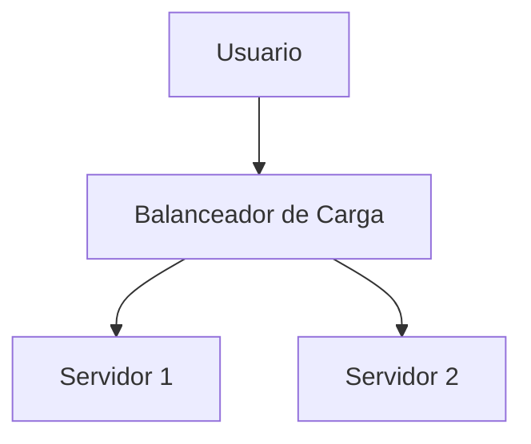

# Markdown Viewer

[English](README.en.md) · [简体中文](README.zh-CN.md) · [繁體中文](README.zh-TW.md) · [Русский](README.ru.md) · [日本語](README.ja.md) · [हिन्दी](README.hi.md) · [한국어](README.ko.md) · [Deutsch](README.de.md) · [Português (Brasil)](README.pt-BR.md) · [Português (Portugal)](README.pt-PT.md) · [Nederlands](README.nl.md) · [Українська](README.uk.md) · [Tiếng Việt](README.vi.md) · [Беларуская](README.be.md) · [Français](README.fr.md) · [Italiano](README.it.md) · [Bahasa Indonesia](README.id.md) · [Español](README.es.md) · [ไทย](README.th.md) · [Svenska](README.sv.md) · [Türkçe](README.tr.md) · [Eesti](README.et.md) · [Bahasa Melayu](README.ms.md) · [Polski](README.pl.md) · [Suomi](README.fi.md) · [Lietuvių](README.lt.md) · [Norsk](README.no.md) · [Dansk](README.da.md)

**Markdown a Word perfecto con un clic — Mermaid, Graphviz, Vega, infografía, LaTeX (editable), resaltado de código, procesamiento local**

*Completamente gratis · 18+ temas profesionales · 28 idiomas*

🚀 **Instalar Ahora:** https://chromewebstore.google.com/detail/markdown-viewer/jekhhoflgcfoikceikgeenibinpojaoi

---

Te encanta escribir en Markdown: limpio, eficiente, compatible con control de versiones.  
Pero eventualmente, siempre necesitas un documento de Word.

**La vieja pesadilla:**

😫 Diagramas de flujo con captura manual · Fórmulas copiadas se vuelven desordenadas · Formatear código manualmente · Ajustar tablas celda por celda · Pasar otros 30 minutos ajustando fuentes, espaciado y colores después de exportar

**Un documento: 1 hora escribiendo, 2 horas formateando.**

---

**Ahora solo toma 1 segundo.**

Haz clic para descargar y obtener un documento de Word perfecto:
- ✅ Diagramas Mermaid → Imágenes de alta resolución
- ✅ Grafos Graphviz DOT → Imágenes de alta resolución
- ✅ Fórmulas LaTeX → Ecuaciones editables de Word
- ✅ Resaltado de sintaxis automático (100+ lenguajes)
- ✅ 18+ temas profesionales con un clic
- ✅ Completamente gratis, procesamiento local

**Dedica tiempo a escribir, no a formatear.**

---

## 💫 Míralo en Acción

### Documentación Técnica: 15 Diagramas de Flujo, 2 Horas → 5 Minutos

**Antes:** Diagrama draw.io → Exportar PNG → Insertar en Word → Redimensionar → Repetir 15 veces = **2 horas**

**Ahora:** Escribir código Mermaid → Clic en descargar = **5 minutos**

## Arquitectura del Sistema

``````markdown

``````

¿Necesitas cambios? Modifica el código y vuelve a exportar. **Ahorra 115 minutos.**

### Artículo Académico: 50+ Fórmulas, 3 Horas → 10 Minutos

**Antes:** Editor de ecuaciones de Word uno por uno O suscripción a herramienta de pago = **3 horas + Suscripción de pago**

**Ahora:** Escribir sintaxis LaTeX directamente → Clic en descargar = **10 minutos + Gratis**

Dada la masa $m$ y la aceleración $a$, según la segunda ley de Newton:

```markdown
$$
F = ma = m\frac{dv}{dt} = m\frac{d^2x}{dt^2}
$$
```

Exportado como formato nativo de Word, completamente editable. **No es una imagen, sino un objeto de ecuación real.**

### Colaboración en Equipo: Informes Semanales, 1 Hora → 1 Minuto

**Antes:** Copiar contenido → Establecer formato → Ajustar listas → Agregar estilo → Gráficos de Excel + capturas = **1 hora semanal**

**Ahora:** Abrir archivo → Elegir tema → Clic en descargar = **1 minuto**

Elige el tema "Business", los gráficos de datos Vega-Lite se convierten automáticamente en imágenes de alta resolución, aspecto profesional. **Ahorra 59 minutos semanales.**

**Casos de uso empresarial:**
- 📊 Tendencias de ventas (gráficos de líneas)
- 📈 Comparación de cuota de mercado (gráficos de barras)
- 🎯 Logro de KPI (medidores)
- 📉 Análisis de costos (gráficos apilados)

Deja que los datos hablen, genera informes profesionales con un clic.

---

## 🎯 Tres Funciones Principales

### 1. Conversión Automática de Diagramas

**Diagramas Mermaid** · **Graphviz DOT** · **Gráficos de Datos Vega/Vega-Lite** · **Infographic** · Imágenes SVG · Tablas HTML complejas

**Mermaid:** Diagramas de flujo, diagramas de secuencia, diagramas de clase, diagramas de estado → Documentos técnicos, diseño de arquitectura  
**Graphviz DOT:** Grafos dirigidos/no dirigidos, topología de red, máquinas de estado → Arquitectura de sistemas, análisis de dependencias  
**Vega/Vega-Lite:** Gráficos de barras, gráficos de líneas, diagramas de dispersión, mapas de calor → Informes empresariales, análisis de datos  
**Infographic:** Gráficos estadísticos, infografías, visualización de datos → Presentación de datos, narrativa visual

**Comparación de tiempo:** Diagrama de secuencia complejo (10 objetos)
- Herramientas tradicionales: Dibujar 30min + Modificar 20min + Ajustar 10min + Exportar 5min = **65 minutos**
- Markdown Viewer: Escribir código 5min + Modificar 30s + Exportar 1s = **6 minutos**

**Escenario empresarial:** Informe de ventas trimestral (5 gráficos de barras)
- Gráficos de Excel + capturas: Seleccionar datos 15min + Formatear 10min + Captura 5min = **30 minutos**
- Vega-Lite: Datos JSON 2min + Exportación con un clic = **3 minutos**

**Preciso, profesional, reutilizable.**

### 2. Conversión Perfecta de Fórmulas

LaTeX → Ecuaciones editables de Word (¡no imágenes!)

Después de exportar, puedes:
- ✅ Continuar editando en Word
- ✅ Ajustar tamaño de fuente
- ✅ Modificar símbolos y variables
- ✅ Copiar a otros documentos

**Una fórmula, dos enfoques:**
- ❌ Editor de ecuaciones de Word: Clic...clic...clic...seleccionar símbolos...ajustar posiciones
- ✅ LaTeX: `\int_0^\infty e^{-x^2}dx` Listo

### 3. 18+ Temas Profesionales

Diferentes escenarios, diferentes estilos, cambio con un clic:

- 📊 Business / Technical → Informes empresariales, documentos técnicos
- 📚 Academic / Palatino → Artículos académicos, composición de libros  
- 🇨🇳 Songti / Heiti / Mixed → Documentos en chino
- 🎨 Typewriter / Sakura → Contenido creativo

**WYSIWYG:** La vista previa se ve exactamente como el Word exportado. Sin adivinanzas, sin pruebas.

**No más ajustes manuales:** Fuente, tamaño, interlineado, espaciado de párrafos, color de fondo del código...

---

## ⚡ Experiencia Ultrarrápida

### Caché Inteligente: Primera Vez 5s, Segunda Vez 1s

Documento con 50 diagramas Mermaid:
- **Primera apertura:** El texto se muestra instantáneamente, los diagramas se renderizan en segundo plano, todo listo en 5s
- **Segunda apertura:** Cargar desde caché, visualización instantánea (<1s)
- **Texto modificado:** Aún instantáneo (diagramas desde caché)
- **Diagrama modificado:** Solo re-renderizar diagramas modificados

**10x más rápido que Word, archivos 100x más pequeños.**

### Mejoras de Lectura

- **Tres diseños:** Normal (1000px) / Pantalla completa / Estrecho (530px, efecto de vista previa de Word)
- **Zoom flexible:** 50%-400%, atajos `Ctrl/Cmd +` `-` `0`
- **Índice inteligente:** Extraer encabezados automáticamente, navegación en barra lateral, `Ctrl/Cmd + B` para alternar
- **Memoria de posición:** Guardar automáticamente posición de desplazamiento, continuar leyendo la próxima vez
- **Historial:** Rastrear documentos recientemente abiertos

---

## 🚀 Inicio Rápido - 3 Pasos

### Paso 1: Instalar Extensión (30 segundos)

1. Abrir navegador Chrome
2. Visitar Chrome Web Store
3. Buscar "Markdown Viewer"
4. Hacer clic en "Añadir a Chrome"
5. ✅ Instalación completa

### Paso 2: Permitir Acceso a Archivos (1 minuto)

**Si deseas abrir archivos .md locales:**

1. Abrir `chrome://extensions/`
2. Encontrar Markdown Viewer
3. Activar "Permitir acceso a URL de archivos"
4. ✅ Ahora puedes hacer doble clic para abrir archivos Markdown locales

**No es necesario si:**
- Solo ves documentos en línea (GitHub, blogs, etc.)
- Usas la función "Abrir archivo" del navegador

### Inicio Rápido

**Abrir documentos:** Hacer doble clic en archivos .md o arrastrar al navegador · Documentos de GitHub se renderizan automáticamente

**Exportar a Word:** Hacer clic en botón de descarga o `Ctrl/Cmd + S` → Ver progreso → Guardar automáticamente

**Cambiar temas:** Hacer clic en barra de herramientas → Elegir tema → Aplicar instantáneamente

**Ajustar vista:** `+`/`-` zoom · Cambiar diseño · `Ctrl/Cmd + B` índice

---

## 🎁 Funciones Completas

### Soporte Completo de Sintaxis Markdown

Encabezados · Párrafos · Negrita · Cursiva · Tachado · Listas · Listas de tareas · Citas · Bloques de código (100+ lenguajes resaltados) · Tablas · Enlaces · Imágenes · Diagramas Mermaid · Gráficos Vega/Vega-Lite · Gráficos Infographic · Fórmulas LaTeX · HTML · Extensiones GFM

### 18 Temas

**Negocios:** Default · Business · Technical  
**Académico:** Academic  
**Serif:** Palatino · Garamond · Cambria · Elegant  
**Sans-serif:** Verdana · Trebuchet · Century  
**Chino:** Songti · Heiti · Mixed  
**Creativo:** Typewriter · Sakura · Water · Minimal

### 28 Idiomas de Interfaz

English · 简体中文 · 繁體中文 · Русский · 日本語 · हिन्दी · 한국어 · Deutsch · Português (Brasil) · Português (Portugal) · Nederlands · Українська · Tiếng Việt · Беларуская · Français · Italiano · Bahasa Indonesia · Español · ไทย · Svenska · Türkçe · Eesti · Bahasa Melayu · Polski · Suomi · Lietuvių · Norsk · Dansk

---

## 💎 Ventajas Competitivas

|  | Capturas Manuales | Herramientas CLI | Servicios en Línea | Editores de Escritorio | Markdown Viewer |
|---|:---:|:---:|:---:|:---:|:---:|
| **Facilidad de Uso** | Tedioso | Configuración necesaria | Carga necesaria | Instalación necesaria | ✅ Un clic |
| **Mermaid** | Captura manual | Plugin necesario | ✅ Soportado | ✅ Soportado | ✅ Soporte nativo |
| **Fórmulas Matemáticas** | Imágenes | Imágenes | Imágenes | Imágenes | ✅ Editable |
| **Privacidad** | ✅ Local | ✅ Local | ❌ Carga en la nube | ✅ Local | ✅ Local |
| **Temas** | - | - | 3-5 | 5-10 | ✅ 18+ |
| **Sin Conexión** | ✅ | ✅ | ❌ | ✅ | ✅ |
| **Vista Directa de GitHub** | ❌ | ❌ | ❌ | ❌ | ✅ |
| **Precio** | Gratis | Gratis | Planes de pago | Planes de pago | ✅ Gratis |

**Ventaja principal: Más rápido, más barato, más seguro, más potente.**

---

## ❓ Preguntas Frecuentes

**P: ¿Puedo editar el documento de Word exportado?**  
R: Sí. Formato .docx estándar, las fórmulas matemáticas son editables, no imágenes.

**P: ¿Qué diagramas están soportados?**  
R: Todos los diagramas Mermaid (flujo, secuencia, gantt, clase, estado, circular, ER, etc.), gráficos de visualización de datos Vega/Vega-Lite, gráficos estadísticos Infographic + auto-conversión SVG.

**P: ¿Hay límite de tamaño de archivo?**  
R: Sin límite. Caché inteligente, documentos con 100+ diagramas se abren instantáneamente.

**P: ¿Requiere internet?**  
R: No. Procesamiento completamente local, funciona sin conexión.

**P: ¿Mis documentos serán cargados?**  
R: Nunca. Todo el procesamiento ocurre localmente.

**P: ¿Cómo cambio los temas?**  
R: Hacer clic en icono de barra de herramientas → Elegir tema → Aplicar instantáneamente.

**P: ¿Puedo personalizar los temas?**  
R: Actualmente 18 temas preestablecidos, personalización en planificación.

**P: ¿Los documentos grandes se vuelven lentos?**  
R: No. Carga progresiva + caché inteligente, el texto se muestra instantáneamente, los diagramas se renderizan en segundo plano (primera vez 5s, segunda vez 1s).

**P: ¿El caché ocupa mucho espacio?**  
R: Predeterminado máx. 1000 elementos, aproximadamente 500 MB, ajustable o borrable en configuración.

**P: ¿Qué navegadores están soportados?**  
R: Chrome y navegadores basados en Chromium (Edge, Brave, Opera).

**P: ¿Qué versiones de Word pueden abrir el archivo exportado?**  
R: Word 2016+ completamente soportado, Word 2013 también funciona. Totalmente compatible con WPS Office.

**P: ¿Puedo exportar a PDF?**  
R: Actualmente solo Word, PDF planificado. Puedes exportar primero a Word y luego guardar como PDF.

**P: ¿Qué tema me conviene?**  
R: Informes empresariales → Business · Artículos académicos → Academic · Documentos técnicos → Technical · Documentos en chino → Songti/Mixed

**P: ¿Cuál es la diferencia entre Vega y Mermaid?**  
R: **Mermaid** es para diagramas de flujo, diagramas de arquitectura y otros diagramas esquemáticos; **Vega/Vega-Lite** es para visualización de datos como gráficos de ventas, informes financieros y otros gráficos empresariales basados en datos. Se complementan para diferentes escenarios.

**P: ¿Cómo crear gráficos con Vega-Lite?**  
R: Usa bloque de código ````vega-lite` en Markdown con especificación de gráfico en formato JSON. Ver [ejemplos oficiales de Vega-Lite](https://vega.github.io/vega-lite/examples/).

---

## 🔒 Compromiso de Privacidad

- ✅ Todo el procesamiento se realiza localmente, nunca se carga
- ✅ Sin seguimiento, sin recopilación de datos personales
- ✅ Código de código abierto, auditable y transparente
- ✅ Seguridad aprobada por Chrome Web Store (Manifest V3)

**Tu privacidad está 100% protegida.**

---

## 🆘 Obtener Ayuda

📖 [Documentación Completa](https://github.com/xicilion/markdown-viewer-extension) · 🐛 [Reportar Problemas](https://github.com/xicilion/markdown-viewer-extension/issues) · 💡 [Solicitudes de Funciones](https://github.com/xicilion/markdown-viewer-extension/issues) · ⭐ [GitHub Star](https://github.com/xicilion/markdown-viewer-extension)

---

## 🎉 Comienza Ahora

**Instala en 30 segundos, comienza a usar inmediatamente:**

1. Visita Chrome Web Store → Busca "Markdown Viewer"
2. Haz clic en "Añadir a Chrome"
3. Haz clic en "Administrar extensiones", activa "Permitir acceso a URL de archivos"
4. Arrastra archivos `.md` al navegador
5. ✅ Comienza a usar

**Obtendrás:** Conversión Markdown → Word con un clic · Auto-conversión Mermaid · Fórmulas LaTeX editables · Resaltado de sintaxis de 100+ lenguajes · 18+ temas · Caché inteligente · Completamente gratis

**Perfecto para:** Escritores técnicos · Estudiantes/investigadores · Gerentes de producto · Desarrolladores · Cualquiera que use Markdown

---

## 📜 Licencia de Código Abierto

Este proyecto es de código abierto bajo licencia ISC. Bienvenido a Star, reportar problemas, sugerir funciones y contribuir código.

**URL del proyecto:** https://github.com/xicilion/markdown-viewer-extension

---

**Deja de perder tiempo en formateo**

**Concéntrate en escribir, deja que Markdown Viewer maneje todo lo demás**

🚀 **Instalar Ahora:** https://chromewebstore.google.com/detail/markdown-viewer/jekhhoflgcfoikceikgeenibinpojaoi

*Completamente Gratis · Procesamiento Local · Privacidad Protegida*
