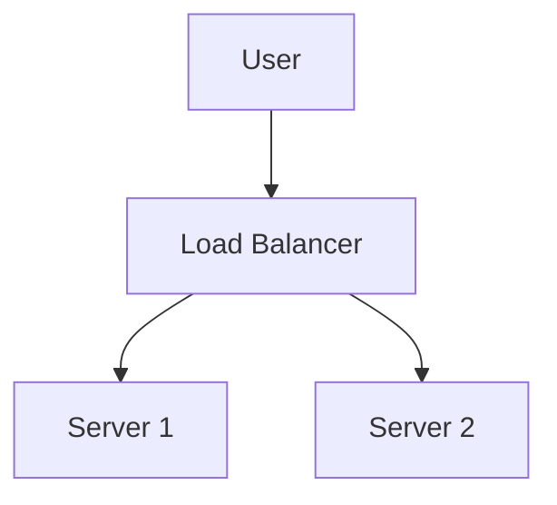

# Markdown Viewer

**Markdown täiuslikuks Wordiks ühe klõpsuga — Mermaid, Vega, Draw.io, Canvas, infograafika, Graphviz, LaTeX (redigeeritav), koodi esiletõstmine, kohalik töötlemine**

*Täiesti tasuta · 29+ professionaalset teemat · 28 keele tugi*

🚀 **Install Now:** https://chromewebstore.google.com/detail/markdown-viewer/jekhhoflgcfoikceikgeenibinpojaoi

---

Teile meeldib Markdownis kirjutada — puhas, tõhus, versioonikontrolli sõbralik.  
Kuid lõpuks vajate alati Word-dokumenti.

**Vana õudusunenägu:**

😫 Käsitsi ekraanipiltide voodiagrammid · Kopeeri-kleebi valemid muutuvad segaseks · Vorminda kood käsitsi · Kohanda tabeleid lahtrite kaupa · Kuluta veel 30 minutit fontide, vahe ja värvide korrigeerimisele pärast eksportimist

**Üks dokument: 1 tund kirjutamist, 2 tundi vormindamist.**

---

**Nüüd võtab see vaid 1 sekundi.**

Klõpsake allalaadimiseks ja saage täiuslik Word-dokument:
- ✅ Mermaid diagrammid → Kõrge eraldusvõimega pildid
- ✅ Vega/Vega-Lite andmegraafikud → Kõrge eraldusvõimega pildid
- ✅ Draw.io diagrammid → Kõrge eraldusvõimega pildid
- ✅ Canvas diagrammid → Kõrge eraldusvõimega pildid
- ✅ Infographic graafikud → Kõrge eraldusvõimega pildid
- ✅ Graphviz DOT graafikud → Kõrge eraldusvõimega pildid
- ✅ LaTeX valemid → Word redigeeritavad võrrandid
- ✅ Automaatne süntaksi esiletõstmine (100+ keelt)
- ✅ 29+ professionaalset teemat ühe klikiga
- ✅ Täiesti tasuta, kohalik töötlemine

**Kulutage aega kirjutamisele, mitte vormindamisele.**

---

## 💫 Vaadake seda tegevuses

### Tehniline dokumentatsioon: 15 voodiagrammi, 2 tundi → 5 minutit

**Enne:** draw.io diagramm → Ekspordi PNG → Sisesta Wordi → Muuda suurust → Korda 15 korda = **2 tundi**

**Nüüd:** Kirjuta Mermaid kood → Klõpsa allalaadimist = **5 minutit**

## Süsteemi arhitektuur

``````markdown

``````

Kas on vaja muudatusi? Muutke koodi ja eksportige uuesti. **Säästa 115 minutit.**

### Akadeemiline töö: 50+ valemit, 3 tundi → 10 minutit

**Enne:** Word võrrandiredaktor ükshaaval VÕI tasuline tööriista tellimus = **3 tundi + Tasuline tellimus**

**Nüüd:** Kirjutage LaTeX süntaks otse → Klõpsake allalaadimist = **10 minutit + Tasuta**

Antud mass $m$ ja kiirendus $a$, Newtoni teise seaduse järgi:

```markdown
$$
F = ma = m\frac{dv}{dt} = m\frac{d^2x}{dt^2}
$$
```

Ekspordi Word'i oma vorminguna, täielikult redigeeritav. **Mitte pilt, vaid tõeline võrrandi objekt.**

### Meeskonnatöö: Nädalaaruanded, 1 tund → 1 minut

**Enne:** Kopeeri sisu → Määra vorming → Kohanda loendeid → Lisa laad → Exceli graafikud + ekraanipildid = **1 tund nädalas**

**Nüüd:** Ava fail → Vali teema → Klõpsa allalaadimist = **1 minut**

Vali "Business" teema, Vega-Lite andmegraafikud teisenduvad automaatselt kõrge eraldusvõimega piltideks, professionaalne välimus. **Säästa 59 minutit nädalas.**

**Ärikasutuse juhtumid:**
- 📊 Müügitrendid (joondiagrammid)
- 📈 Turuosa võrdlus (tulpdiagrammid)
- 🎯 KPI saavutamine (näidikud)
- 📉 Kulude analüüs (virn diagrammid)

Laseme andmetel rääkida, looge professionaalseid aruandeid ühe klikiga.

---

## 🎯 Kolm põhifunktsiooni

### 1. Automaatne diagrammide teisendamine

**Mermaid** · **Vega/Vega-Lite** · **Draw.io** · **Canvas** · **Infographic** · **Graphviz DOT** · SVG pildid · Keerukad HTML tabelid

**Mermaid:** Voodiagrammid, järjestusdiagrammid, klassi diagrammid, olekudiagrammid → Tehniline dokumentatsioon, arhitektuuri kujundus  
**Vega/Vega-Lite:** Tulpdiagrammid, joondiagrammid, hajuvusdiagrammid, soojuskaardid → Äriaruanded, andmeanalüüs  
**Draw.io:** Arhitektuuri diagrammid, võrgu topoloogiad, UML diagrammid → Süsteemi kujundus, tehniline dokumentatsioon  
**Canvas:** Mõttekaardid, teadmiste graafikud, kontseptsiooni kaardid → Ajurünnak, planeerimistahvlid  
**Infographic:** Statistilised graafikud, infograafikud, andmete visualiseerimine → Andmete esitlus, visuaalne jutustamine  
**Graphviz DOT:** Suunatud/suunamata graafikud, võrgu topoloogia, olekuautomaadid → Sõltuvuste analüüs, keerukad graafikud

**Aja võrdlus:** Keeruline järjestusdiagramm (10 objekti)
- Traditsioonilised tööriistad: Joonistamine 30min + Muutmine 20min + Kohendamine 10min + Eksportimine 5min = **65 minutit**
- Markdown Viewer: Koodi kirjutamine 5min + Muutmine 30sek + Eksportimine 1sek = **6 minutit**

**Äristsenaarium:** Kvartali müügiaruanne (5 tulpdiagrammi)
- Exceli graafikud + ekraanipildid: Andmete valimine 15min + Vormindamine 10min + Ekraanipilt 5min = **30 minutit**
- Vega-Lite: JSON andmed 2min + Ühe klikiga eksport = **3 minutit**

**Täpne, professionaalne, taaskasutatav.**

### 2. Täiuslik valemite teisendamine

LaTeX → Word redigeeritavad võrrandid (mitte pildid!)

Pärast eksportimist saate:
- ✅ Jätkata redigeerimist Wordis
- ✅ Kohandada fondi suurust
- ✅ Muuta sümboleid ja muutujaid
- ✅ Kopeerida teistesse dokumentidesse

**Üks valem, kaks lähenemist:**
- ❌ Word võrrandi redaktor: Klõps...klõps...klõps...vali sümbolid...kohenda positsioone
- ✅ LaTeX: `\int_0^\infty e^{-x^2}dx` Valmis

### 3. 29+ professionaalset teemat

Erinevad stsenaariumid, erinevad stiilid, ühe klikiga vahetamine:

- 📊 Business / Technical → Äriaruanded, tehniline dokumentatsioon
- 📚 Academic / Palatino → Akadeemilised tööd, raamatute küljendamine  
- 🇨🇳 Heiti / Mixed → Hiina dokumendid
- 🎨 Typewriter / Handwritten → Loominguline sisu

**WYSIWYG:** Eelvaade näeb välja täpselt nagu eksporditud Word. Pole vajadust aimata ega katsetada.

**Enam mingeid käsitsi kohandusi:** Font, suurus, reasamm, lõigusamm, koodi taust...

---

## ⚡ Välkkiire kogemus

### Nutikas vahemälu: Esimene kord 5s, teine kord 1s

Dokument 50 Mermaid diagrammiga:
- **Esimene avamine:** Tekst kuvatakse kohe, diagrammid renderdatakse taustal, kõik valmis 5 sekundi jooksul
- **Teine avamine:** Laadida vahemälust, kohene kuvamine (<1s)
- **Tekst muudetud:** Ikka kohene (diagrammid vahemälust)
- **Diagramm muudetud:** Ainult muudetud diagrammid renderdatakse uuesti

**10x kiirem kui Word, 100x väiksemad failid.**

### Lugemise täiustamine

- **Kolm paigutust:** Tavaline (1000px) / Täisekraan / Kitsas (530px, eelvaade Word efekt)
- **Paindlik suum:** 50%-400%, otseteed `Ctrl/Cmd +` `-` `0`
- **Nutikas sisukord:** Automaatne pealkirjade eraldumine, külgribanavigatsion, `Ctrl/Cmd + B` lülitamiseks
- **Positsiooni mälu:** Automaatne kerimispositsiooni salvestamine, jätkake lugemist järgmine kord
- **Ajalugu:** Jälgige hiljuti avatud dokumente

---

## 🚀 Kiire algus - 3 sammu

### Samm 1: Installi laiendus (30 sekundit)

1. Avage Chrome brauser
2. Külastage Chrome Web Store'i
3. Otsige "Markdown Viewer"
4. Klõpsake "Add to Chrome"
5. ✅ Installimine lõpetatud

### Samm 2: Luba failide juurdepääs (1 minut)

**Kui soovite avada kohalikke .md faile:**

1. Avage `chrome://extensions/`
2. Leidke Markdown Viewer
3. Lubage "Allow access to file URLs"
4. ✅ Nüüd saate topeltklõpsata kohalike Markdown failide avamiseks

**Pole vaja, kui:**
- Vaatate ainult veebi dokumente (GitHub, blogid jne)
- Kasutate brauseri "Open File" funktsiooni

### Kiire algus

**Ava dokumendid:** Topeltklõpsake .md failidel või lohistage brauserisse · GitHubi dokumendid automaatselt renderdatud

**Ekspordi Wordi:** Klõpsake allalaadimise nuppu või `Ctrl/Cmd + S` → Vaadake edenemist → Automaatne salvestamine

**Vaheta teemasid:** Klõpsake tööriistaribale → Valige teema → Rakendage kohe

**Kohanda vaadet:** `+`/`-` suum · Paigutuse vahetamine · `Ctrl/Cmd + B` sisukord

---

## 🎁 Täielikud funktsioonid

### Täielik Markdowni süntaksi tugi

Pealkirjad · Lõigud · Rasvane · Kursiiv · Läbikriipsutatud · Loendid · Ülesannete loendid · Plokki tsitaadid · Koodiplokid (100+ keelt esiletõstetud) · Tabelid · Lingid · Pildid · Mermaid diagrammid · Vega / Vega-Lite graafikud · Draw.io diagrammid · Canvas diagrammid · Infographic graafikud · Graphviz DOT graafikud · LaTeX valemid · HTML · GFM laiendused

### 29 teemat

**Classic:** Default · Academic · Business · Manuscript · Newspaper  
**Reading:** Palatino · Garamond · Typewriter · Elegant  
**Modern:** Technical · Swiss · Minimal  
**Creative:** Magazine · Century · Handwritten · Verdana  
**Chinese:** Heiti · Mixed · Water  
**Playful:** Rainbow · Starry · Candy · Dinosaur · Space · Garden  
**Nature:** Forest · Ocean · Coral · Sunset

### 28 liidese keelt

English · 简体中文 · 繁體中文 · Русский · 日本語 · हिन्दी · 한국어 · Deutsch · Português (Brasil) · Português (Portugal) · Nederlands · Українська · Tiếng Việt · Беларуская · Français · Italiano · Bahasa Indonesia · Español · ไทย · Svenska · Türkçe · Eesti · Bahasa Melayu · Polski · Suomi · Lietuvių · Norsk · Dansk

---

## 💎 Konkurentsieelised

|  | Käsitsi ekraanipildid | CLI tööriistad | Veebiteenused | Töölaua redaktorid | Markdown Viewer |
|---|:---:|:---:|:---:|:---:|:---:|
| **Kasutusmugavus** | Tüütu | Vajalik seadistamine | Vajalik üleslaadimine | Vajalik installimine | ✅ Üks klõps |
| **Mermaid** | Käsitsi ekraanipilt | Vajalik pistikprogramm | ✅ Toetatud | ✅ Toetatud | ✅ Natiivne tugi |
| **Matemaatilised valemid** | Pildid | Pildid | Pildid | Pildid | ✅ Redigeeritav |
| **Privaatsus** | ✅ Kohalik | ✅ Kohalik | ❌ Pilve üleslaadimine | ✅ Kohalik | ✅ Kohalik |
| **Teemad** | - | - | 3-5 | 5-10 | ✅ 29+ |
| **Võrguühenduseta** | ✅ | ✅ | ❌ | ✅ | ✅ |
| **GitHubi otsene vaade** | ❌ | ❌ | ❌ | ❌ | ✅ |
| **Hind** | Tasuta | Tasuta | Tasulised paketid | Tasulised paketid | ✅ Tasuta |

**Põhieelis: Kiirem, odavam, turvalisem, võimsam.**

---

## ❓ KKK

**K: Kas saan eksporditud Word-dokumenti redigeerida?**  
V: Jah. Standardne .docx formaat, matemaatilised valemid on redigeeritavad, mitte pildid.

**K: Millised diagrammid on toetatud?**  
V: Kõik Mermaid diagrammid (voodiagramm, järjestus, gantt, klass, olek, piruk, ER jne), Vega / Vega-Lite andmete visualiseerimise graafikud, Draw.io arhitektuuri diagrammid, Canvas mõttekaardid, Infographic statistilised graafikud, Graphviz DOT graafikud + SVG automaatne teisendamine.

**K: Kas failisuurusel on piirang?**  
V: Pirangut pole. Nutikas vahemälu, 100+ diagrammiga dokumendid avanevad kohe.

**K: Kas see vajab internetti?**  
V: Ei. Täielikult kohalik töötlemine, töötab võrguühenduseta.

**K: Kas minu dokumendid laaditakse üles?**  
V: Mitte kunagi. Kogu töötlemine toimub kohalikult.

**K: Kuidas teemasid vahetada?**  
V: Klõpsake tööriistariba ikoonil → Valige teema → Rakendage kohe.

**K: Kas saan teemasid kohandada?**  
V: Praegu 29 eelseadistatud teemat, kohandamine tuleb varsti.

**K: Kas suured dokumendid jooksevad aeglaselt?**  
V: Ei. Järk-järguline laadimine + nutikas vahemälu, tekst kuvatakse kohe, diagrammid renderdatakse taustal (esimene 5s, teine 1s).

**K: Kas vahemälu võtab palju ruumi?**  
V: Vaikimisi maksimaalselt 1000 elementi, ligikaudu 500 MB, seadetes reguleeritav või tühjendatav.

**K: Milliseid brausereid toetatakse?**  
V: Chrome ja Chromiumi-põhised brauserid (Edge, Brave, Opera).

**K: Millised Wordi versioonid saavad eksporditud faili avada?**  
V: Word 2016+ täielikult toetatud, Word 2013 töötab samuti. Täielikult ühilduv WPS Office'iga.

**K: Kas saan eksportida PDF-i?**  
V: Praegu ainult Word, PDF on plaanis. Saate eksportida Wordi ja seejärel salvestada PDF-ina.

**K: Milline teema sobib mulle?**  
V: Äriaruanded → Business · Akadeemilised tööd → Academic · Tehniline dokumentatsioon → Technical · Hiina dokumendid → Heiti/Mixed

**K: Mis vahe on Vegal ja Mermaidil?**  
V: **Mermaid** on voodiagrammide, arhitektuuri diagrammide ja muude skemaatiliste diagrammide jaoks; **Vega/Vega-Lite** on andmete visualiseerimise jaoks, nagu müügidiagrammid, finantsaruanded ja muud andmepõhised ärigraafikud. Need täiendavad üksteist erinevate stsenaariumide puhul.

**K: Kuidas luua Vega-Lite'iga graafikuid?**  
V: Kasutage Markdownis ````vega-lite` koodiplokki JSON-vormingus graafiku spetsifikatsiooniga. Vaadake [Vega-Lite ametlikke näiteid](https://vega.github.io/vega-lite/examples/).

---

## 🔒 Privaatsuse kohustus

- ✅ Kogu töötlemine toimub kohalikult, ei laadita kunagi üles
- ✅ Jälgimine puudub, isikuandmeid ei koguta
- ✅ Avatud lähtekood, auditeeritav ja läbipaistev
- ✅ Chrome Web Store'i turvalisuse heaks kiidetud (Manifest V3)

**Teie privaatsus on 100% kaitstud.**

---

## 🆘 Hankige abi

📖 [Täielik dokumentatsioon](https://github.com/markdown-viewer/markdown-viewer-extension) · 🐛 [Teatage probleemidest](https://github.com/markdown-viewer/markdown-viewer-extension/issues) · 💡 [Funktsioonide taotlused](https://github.com/markdown-viewer/markdown-viewer-extension/issues) · ⭐ [GitHub Star](https://github.com/markdown-viewer/markdown-viewer-extension)

---

## 🎉 Alustage kohe

**Installige 30 sekundiga, hakake kohe kasutama:**

1. Külastage Chrome Web Store'i → Otsige "Markdown Viewer"
2. Klõpsake "Add to Chrome"
3. Klõpsake "Manage Extensions", lubage "Allow access to file URLs"
4. Lohistage `.md` failid brauserisse
5. ✅ Hakake kasutama

**Saate:** Markdown → Word ühe klikiga teisendamine · Mermaid/Vega/Draw.io/Canvas/Infographic/Graphviz automaatne teisendamine · LaTeX redigeeritavad valemid · 100+ keele süntaksi esiletõstmine · 29+ teemat · Nutikas vahemälu · Täiesti tasuta

**Ideaalne:** Tehnilised kirjutajad · Üliõpilased/teadlased · Tootejuhid · Arendajad · Igaüks, kes kasutab Markdowni

---

## 📜 Avatud lähtekoodi litsents

See projekt on avatud lähtekoodiga ISC litsentsi alusel. Tere tulemast Star'ima, teatama probleemidest, soovitama funktsioone ja panustama koodi.

**Projekti URL:** https://github.com/markdown-viewer/markdown-viewer-extension

---

**Lõpetage aja raiskamine vormindamisele**

**Keskenduge kirjutamisele, laske Markdown Vieweril hoolitseda ülejäänu eest**

🚀 **Installige kohe:** https://chromewebstore.google.com/detail/markdown-viewer/jekhhoflgcfoikceikgeenibinpojaoi

*Täiesti tasuta · Kohalik töötlemine · Privaatsus kaitstud*
