# Markdown Viewer

**Markdown täydelliseksi Wordiksi yhdellä napsautuksella — Mermaid, Vega, Draw.io, Canvas, infografiikka, Graphviz, LaTeX (muokattava), koodin korostus, paikallinen käsittely**

*Täysin ilmainen · 29+ ammattimaista teemaa · 28 kielen tuki*

🚀 **Asenna nyt:** https://chromewebstore.google.com/detail/markdown-viewer/jekhhoflgcfoikceikgeenibinpojaoi

---

Rakastat kirjoittaa Markdownilla — siistiä, tehokasta, versionhallinnan ystävällistä.  
Mutta lopulta tarvitset aina Word-dokumentin.

**Aiempi painajainen:**

😫 Vuokaavioiden manuaaliset kuvakaappaukset · Kopioidut kaavat muuttuvat sekaviksi · Koodin manuaalinen muotoilu · Taulukoiden solukohtainen säätö · Viennin jälkeen vielä puoli tuntia fonttien, välistysten ja värien säätöön

**Yksi dokumentti: 1 tunti kirjoittamista, 2 tuntia muotoilua.**

---

**Nyt vain 1 sekunti.**

Klikkaa lataa ja saat täydellisen Word-dokumentin:
- ✅ Mermaid-kaaviot → Korkearesoluutioiset kuvat
- ✅ Vega/Vega-Lite-datakaaviot → Korkearesoluutioiset kuvat
- ✅ Draw.io-kaaviot → Korkearesoluutioiset kuvat
- ✅ Canvas-kaaviot → Korkearesoluutioiset kuvat
- ✅ Infographic-kaaviot → Korkearesoluutioiset kuvat
- ✅ Graphviz DOT -kaaviot → Korkearesoluutioiset kuvat
- ✅ LaTeX-kaavat → Wordin muokattavat kaavat
- ✅ Automaattinen syntaksikorostus (100+ kieltä)
- ✅ 29+ ammattimaista teemaa yhdellä klikkauksella
- ✅ Täysin ilmainen, paikallinen käsittely

**Käytä aikasi kirjoittamiseen, ei muotoiluun.**

---

## 💫 Katso käytännön tulokset

### Tekninen dokumentaatio: 15 vuokaaviota, 2 tuntia → 5 minuuttia

**Ennen:** draw.io piirros → vie PNG → lisää Wordiin → säädä kokoa → toista 15 kertaa = **2 tuntia**

**Nyt:** Kirjoita Mermaid-koodilla → klikkaa lataa = **5 minuuttia**

## Järjestelmäarkkitehtuuri

``````markdown

```mermaid
graph TB
    A[Käyttäjä] --> B[Kuormantasaaja]
    B --> C[Palvelin1]
    B --> D[Palvelin2]
```

``````

Muutoksia? Muokkaa koodia ja vie uudelleen. **Säästä 115 minuuttia.**

### Akateeminen artikkeli: 50+ kaavaa, 3 tuntia → 10 minuuttia

**Ennen:** Wordin kaavaeditori yksi kerrallaan TAI maksullinen tilaus = **3 tuntia + Maksullinen tilaus**

**Nyt:** Kirjoita LaTeX-syntaksilla suoraan → klikkaa lataa = **10 minuuttia + Ilmainen**

Olkoon massan $m$ ja kiihtyvyys $a$, Newtonin toisen lain mukaan:

```markdown
$$
F = ma = m\frac{dv}{dt} = m\frac{d^2x}{dt^2}
$$
```

Viety natiivina Word-muotona, täysin muokattavissa. **Ei kuva, vaan aito kaavaobjekti.**

### Tiimityö: Viikkoraportti, 1 tunti → 1 minuutti

**Ennen:** Kopioi sisältö → aseta muotoilu → säädä luettelot → lisää tyylit → Excel-kaaviot + kuvakaappaukset = **1 tunti viikossa**

**Nyt:** Avaa tiedosto → valitse teema → klikkaa lataa = **1 minuutti**

Valitse "Business"-teema, Vega-Lite-datakaaviot muuntuvat automaattisesti korkearesoluutioisiksi kuviksi, ammattimaisen näköisiksi. **Säästä 59 minuuttia viikossa.**

**Liiketoimintaskenaariot:**
- 📊 Myyntitrendit (viivakaaviot)
- 📈 Markkinaosuusvertailu (pylväskaaviot)
- 🎯 KPI-saavutukset (mittarit)
- 📉 Kustannusanalyysi (pinotut kaaviot)

Anna datan puhua, luo ammattimaiset raportit yhdellä klikkauksella.

---

## 🎯 Kolme ydinominaisuutta

### 1. Automaattinen kaaviomuunnos

**Mermaid** · **Vega/Vega-Lite** · **Draw.io** · **Canvas** · **Infographic** · **Graphviz DOT** · SVG-kuvat · Monimutkaiset HTML-taulukot

**Mermaid:** Vuokaaviot, sekvenssikaaviot, luokkakaaviot, tilakaaviot → Tekniset dokumentit, arkkitehtuurisuunnittelu  
**Vega/Vega-Lite:** Pylväskaaviot, viivakaaviot, hajontakaaviot, lämpökartat → Liiketoimintaraportit, data-analyysi  
**Draw.io:** Arkkitehtuurikaaviot, verkkotopologiat, UML-kaaviot → Järjestelmäsuunnittelu, tekninen dokumentaatio  
**Canvas:** Miellekartat, tietograafit, käsitekartat → Aivoriihi, suunnittelutaulut  
**Infographic:** Tilastokaaviot, infografiikat, datan visualisointi → Datan esittäminen, visuaalinen tarinankerto  
**Graphviz DOT:** Ohjatut ja ohjaamattomat kaaviot, verkkotopologia, tilakonekartat → Riippuvuusanalyysi, monimutkaiset kaaviot

**Aikavertailu:** Monimutkainen sekvenssikaavio (10 objektia)
- Perinteiset työkalut: Piirtäminen 30min + Muokkaus 20min + Säätö 10min + Vienti 5min = **65 minuuttia**
- Markdown Viewer: Koodin kirjoitus 5min + Muokkaus 30s + Vienti 1s = **6 minuuttia**

**Liiketoimintaskenaario:** Neljännesvuoden myyntiraportti (5 pylväskaaviota)
- Excel-kaaviot + kuvakaappaukset: Datan valinta 15min + Muotoilu 10min + Kuvakaappaus 5min = **30 minuuttia**
- Vega-Lite: JSON-data 2min + Yhden klikkauksen vienti = **3 minuuttia**

**Tarkka, ammattimainen, uudelleenkäytettävä.**

### 2. Täydellinen kaavamuunnos

LaTeX → Wordin muokattavat kaavat (ei kuvia!)

Viennin jälkeen voit:
- ✅ Jatkaa muokkausta Wordissa
- ✅ Säätää fonttikokoa
- ✅ Muokata symboleja ja muuttujia
- ✅ Kopioida muihin dokumentteihin

**Yksi kaava, kaksi lähestymistapaa:**
- ❌ Wordin kaavaeditori: Klikkaa...klikkaa...klikkaa...valitse symbolit...säädä sijainteja
- ✅ LaTeX: `\int_0^\infty e^{-x^2}dx` Valmis

### 3. 29+ ammattimaista teemaa

Eri skenaariot, eri tyylit, vaihda yhdellä klikkauksella:

- 📊 Business / Technical → Liiketoimintaraportit, tekniset dokumentit
- 📚 Academic / Palatino → Akateemiset artikkelit, kirjojen taitto  
- 🇨🇳 Heiti / Mixed → Kiinalaiset dokumentit
- 🎨 Typewriter / Handwritten → Luova sisältö

**WYSIWYG:** Esikatselu näyttää täsmälleen samalta kuin viety Word. Ei arvailua, ei kokeilua.

**Ei enää manuaalisia säätöjä:** Fontti, koko, riviväli, kappaleväli, koodin taustaväri...

---

## ⚡ Salamannopea kokemus

### Älykäs välimuisti: Ensimmäinen kerta 5s, toinen kerta 1s

Dokumentti, jossa 50 Mermaid-kaaviota:
- **Ensimmäinen avaus:** Teksti näkyy heti, kaaviot renderöidään taustalla, kaikki valmista 5 sekunnissa
- **Toinen avaus:** Lataa välimuistista, välitön näyttö (<1s)
- **Tekstiä muokattu:** Edelleen välitön (kaaviot välimuistista)
- **Kaaviota muokattu:** Vain muutetut kaaviot renderöidään uudelleen

**10x nopeampi kuin Word, 100x pienemmät tiedostot.**

### Lukemisen parannukset

- **Kolme asettelua:** Normaali (1000px) / Koko näyttö / Kapea (530px, esikatselun Word-efekti)
- **Joustava zoomaus:** 50%-400%, pikanäppäimet `Ctrl/Cmd +` `-` `0`
- **Älykäs sisällysluettelo:** Automaattinen otsikoiden poiminta, sivupalkkinavigointi, `Ctrl/Cmd + B` vaihto
- **Sijaintimuisti:** Automaattinen vierityssijainnin tallennus, jatka lukemista seuraavalla kerralla
- **Historia:** Seuraa äskettäin avattuja dokumentteja

---

## 🚀 Pika-aloitus - 3 vaihetta

### Vaihe 1: Asenna laajennus (30 sekuntia)

1. Avaa Chrome-selain
2. Vieraile Chrome Web Storessa
3. Hae "Markdown Viewer"
4. Klikkaa "Lisää Chromeen"
5. ✅ Asennus valmis

### Vaihe 2: Salli tiedostojen käyttö (1 minuutti)

**Jos haluat avata paikallisia .md-tiedostoja:**

1. Avaa `chrome://extensions/`
2. Etsi Markdown Viewer
3. Ota käyttöön "Salli pääsy tiedosto-URL-osoitteisiin"
4. ✅ Nyt voit avata paikalliset Markdown-tiedostot kaksoisklikkaamalla

**Ei tarvita, jos:**
- Katsot vain online-dokumentteja (GitHub, blogit jne.)
- Käytät selaimen "Avaa tiedosto" -toimintoa

### Pika-aloitus

**Avaa dokumentteja:** Kaksoisklikkaa .md-tiedostoja tai vedä selaimeen · GitHub-dokumentit automaattisesti renderöity

**Vie Wordiin:** Klikkaa lataa-painiketta tai `Ctrl/Cmd + S` → Katso edistyminen → Automaattinen tallennus

**Vaihda teemoja:** Klikkaa työkalupalkkia → Valitse teema → Käytä välittömästi

**Säädä näkymää:** `+`/`-` zoomaus · Vaihda asettelua · `Ctrl/Cmd + B` sisällysluettelo

---

## 🎁 Täydelliset ominaisuudet

### Täysi Markdown-syntaksituki

Otsikot · Kappaleet · Lihavoitu · Kursivoitu · Yliviivaus · Luettelot · Tehtävälistat · Lainaukset · Koodilohkot (100+ kielen korostus) · Taulukot · Linkit · Kuvat · Mermaid-kaaviot · Vega / Vega-Lite -kaaviot · Draw.io-kaaviot · Canvas-kaaviot · Infographic-kaaviot · Graphviz DOT -kaaviot · LaTeX-kaavat · HTML · GFM-laajennukset

### 29 teemaa

**Classic:** Default · Academic · Business · Manuscript · Newspaper  
**Reading:** Palatino · Garamond · Typewriter · Elegant  
**Modern:** Technical · Swiss · Minimal  
**Creative:** Magazine · Century · Handwritten · Verdana  
**Chinese:** Heiti · Mixed · Water  
**Playful:** Rainbow · Starry · Candy · Dinosaur · Space · Garden  
**Nature:** Forest · Ocean · Coral · Sunset

### 28 käyttöliittymän kieltä

English · 简体中文 · 繁體中文 · Русский · 日本語 · हिन्दी · 한국어 · Deutsch · Português (Brasil) · Português (Portugal) · Nederlands · Українська · Tiếng Việt · Беларуская · Français · Italiano · Bahasa Indonesia · Español · ไทย · Svenska · Türkçe · Eesti · Bahasa Melayu · Polski · Suomi · Lietuvių · Norsk · Dansk

---

## 💎 Kilpailuedut

|  | Manuaaliset kuvakaappaukset | CLI-työkalut | Online-palvelut | Työpöytäeditorit | Markdown Viewer |
|---|:---:|:---:|:---:|:---:|:---:|
| **Helppokäyttöisyys** | Työlästä | Asennus tarvitaan | Lataus tarvitaan | Asennus tarvitaan | ✅ Yksi klikkaus |
| **Mermaid** | Manuaalinen kuvakaappaus | Laajennus tarvitaan | ✅ Tuettu | ✅ Tuettu | ✅ Natiivi tuki |
| **Matemaattiset kaavat** | Kuvat | Kuvat | Kuvat | Kuvat | ✅ Muokattavissa |
| **Yksityisyys** | ✅ Paikallinen | ✅ Paikallinen | ❌ Pilvilataus | ✅ Paikallinen | ✅ Paikallinen |
| **Teemat** | - | - | 3-5 | 5-10 | ✅ 29+ |
| **Offline-käyttö** | ✅ | ✅ | ❌ | ✅ | ✅ |
| **GitHub-suora katselu** | ❌ | ❌ | ❌ | ❌ | ✅ |
| **Hinta** | Ilmainen | Ilmainen | Maksulliset suunnitelmat | Maksulliset suunnitelmat | ✅ Ilmainen |

**Ydinetu: Nopeampi, halvempi, turvallisempi, tehokkaampi.**

---

## ❓ Usein kysytyt kysymykset

**K: Voinko muokata vietyä Word-dokumenttia?**  
A: Kyllä. Standardi .docx-muoto, matemaattiset kaavat ovat muokattavissa, eivät kuvia.

**K: Mitä kaavioita tuetaan?**  
A: Kaikki Mermaid-kaaviot (vuokaavio, sekvenssi, gantt, luokka, tila, piirakka, ER jne.), Vega / Vega-Lite -datavisualisointikaaviot, Draw.io-arkkitehtuurikaaviot, Canvas-miellekartat, Infographic-tilastokaaviot, Graphviz DOT -kaaviot + SVG-automaattimuunnos.

**K: Onko tiedoston koolle rajoitusta?**  
A: Ei rajoitusta. Älykäs välimuisti, dokumentit, joissa on 100+ kaaviota, avautuvat välittömästi.

**K: Tarvitaanko internet-yhteyttä?**  
A: Ei. Täysin paikallinen käsittely, toimii offline-tilassa.

**K: Ladataanko dokumenttini?**  
A: Ei koskaan. Kaikki käsittely tapahtuu paikallisesti.

**K: Miten vaihdan teemoja?**  
A: Klikkaa työkalupalkin kuvaketta → Valitse teema → Käytä välittömästi.

**K: Voinko mukauttaa teemoja?**  
A: Tällä hetkellä 29 esiasetettua teemaa, mukautus tulossa.

**K: Hidastavatko suuret dokumentit?**  
A: Ei. Progressiivinen lataus + älykäs välimuisti, teksti näkyy välittömästi, kaaviot renderöidään taustalla (ensimmäinen 5s, toinen 1s).

**K: Vievätkö välimuistit paljon tilaa?**  
A: Oletuksena max 1000 kohdetta, noin 500 MB, säädettävissä tai tyhjennettävissä asetuksista.

**K: Mitä selaimia tuetaan?**  
A: Chrome ja Chromium-pohjaiset selaimet (Edge, Brave, Opera).

**K: Millä Word-versioilla viedyn tiedoston voi avata?**  
A: Word 2016+ täysin tuettu, Word 2013 toimii myös. Täysin yhteensopiva WPS Officen kanssa.

**K: Voinko viedä PDF:ään?**  
A: Tällä hetkellä vain Word, PDF suunnitteilla. Voit ensin viedä Wordiin ja tallentaa sitten PDF:nä.

**K: Mikä teema sopii minulle?**  
A: Liiketoimintaraportit → Business · Akateemiset artikkelit → Academic · Tekniset dokumentit → Technical · Kiinalaiset dokumentit → Heiti/Mixed

**K: Mikä ero on Vegalla ja Mermaidilla?**  
A: **Mermaid** sopii vuokaavioihin, arkkitehtuurikaavioihin ja muihin kaavamaisiin diagrammeihin; **Vega/Vega-Lite** sopii datavisualisointiin, kuten myyntikaavioihin, talousraportteihin ja muihin dataan perustuviin liiketoimintakaavioihin. Ne täydentävät toisiaan eri skenaarioissa.

**K: Miten luon kaavioita Vega-Litellä?**  
A: Käytä ````vega-lite` koodilohkoa Markdownissa JSON-muotoisella kaaviomäärittelyllä. Katso [Vega-Lite virallisia esimerkkejä](https://vega.github.io/vega-lite/examples/).

---

## 🔒 Yksityisyyslupaus

- ✅ Kaikki käsittely suoritetaan paikallisesti, ei koskaan ladata
- ✅ Ei seurantaa, ei henkilötietojen keräämistä
- ✅ Avoimen lähdekoodin koodi, tarkastettavissa ja läpinäkyvä
- ✅ Chrome Web Store -turvallisuus hyväksytty (Manifest V3)

**Yksityisyytesi on 100% suojattu.**

---

## 🆘 Hanki apua

📖 [Täysi dokumentaatio](https://github.com/markdown-viewer/markdown-viewer-extension) · 🐛 [Ilmoita ongelmista](https://github.com/markdown-viewer/markdown-viewer-extension/issues) · 💡 [Ominaisuuspyynnöt](https://github.com/markdown-viewer/markdown-viewer-extension/issues) · ⭐ [GitHub-tähti](https://github.com/markdown-viewer/markdown-viewer-extension)

---

## 🎉 Aloita nyt

**Asenna 30 sekunnissa, aloita käyttö välittömästi:**

1. Vieraile Chrome Web Storessa → Hae "Markdown Viewer"
2. Klikkaa "Lisää Chromeen"
3. Klikkaa "Hallinnoi laajennuksia", ota käyttöön "Salli pääsy tiedosto-URL-osoitteisiin"
4. Vedä `.md`-tiedostot selaimeen
5. ✅ Aloita käyttö

**Saat:** Markdown → Word yhden klikkauksen muunnos · Mermaid/Vega/Draw.io/Canvas/Infographic/Graphviz automaattimuunnos · LaTeX muokattavat kaavat · 100+ kielen syntaksikorostus · 29+ teemaa · Älykäs välimuisti · Täysin ilmainen

**Täydellinen:** Tekniset kirjoittajat · Opiskelijat/tutkijat · Tuotepäälliköt · Kehittäjät · Kuka tahansa Markdownia käyttävä

---

## 📜 Avoimen lähdekoodin lisenssi

Tämä projekti on avoimen lähdekoodin ISC-lisenssillä. Tervetuloa antamaan tähti, ilmoittamaan ongelmista, ehdottamaan ominaisuuksia ja osallistumaan koodiin.

**Projektin URL:** https://github.com/markdown-viewer/markdown-viewer-extension

---

**Älä tuhlaa aikaasi muotoiluun**

**Keskity kirjoittamiseen, anna Markdown Viewerin hoitaa kaikki muu**

🚀 **Asenna nyt:** https://chromewebstore.google.com/detail/markdown-viewer/jekhhoflgcfoikceikgeenibinpojaoi

*Täysin ilmainen · Paikallinen käsittely · Yksityisyys suojattu*
