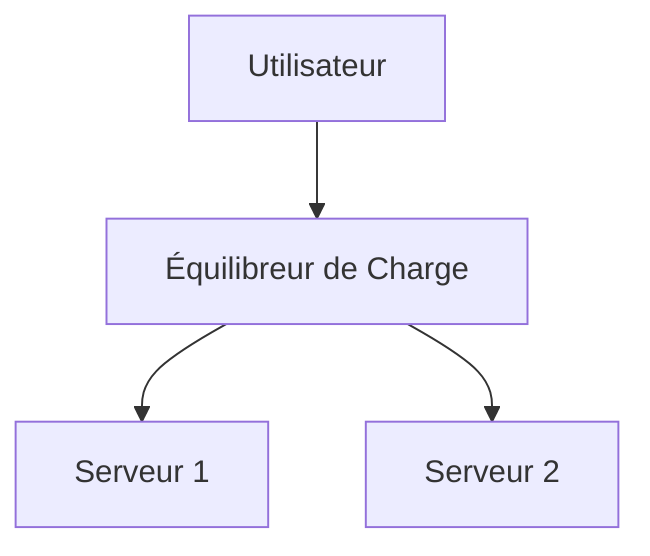

# Markdown Viewer

**Markdown vers Word parfait en un clic — Mermaid, Vega, Draw.io, Canvas, infographie, Graphviz, LaTeX (modifiable), coloration syntaxique, traitement local**

*Entièrement gratuit · 29+ thèmes professionnels · 28 langues*

🚀 **Installer Maintenant:** https://chromewebstore.google.com/detail/markdown-viewer/jekhhoflgcfoikceikgeenibinpojaoi

---

Vous aimez écrire en Markdown — propre, efficace, compatible avec le contrôle de version.  
Mais finalement, vous avez toujours besoin d'un document Word.

**L'ancien cauchemar:**

😫 Diagrammes de flux par capture d'écran manuelle · Formules copiées deviennent désordonnées · Formater le code manuellement · Ajuster les tableaux cellule par cellule · Passer 30 minutes supplémentaires à ajuster les polices, l'espacement et les couleurs après l'export

**Un document: 1 heure d'écriture, 2 heures de formatage.**

---

**Maintenant, cela ne prend qu'1 seconde.**

Cliquez pour télécharger et obtenir un document Word parfait:
- ✅ Diagrammes Mermaid → Images haute résolution
- ✅ Graphiques Vega/Vega-Lite → Images haute résolution
- ✅ Diagrammes Draw.io → Images haute résolution
- ✅ Diagrammes Canvas → Images haute résolution
- ✅ Graphiques Infographic → Images haute résolution
- ✅ Graphes Graphviz DOT → Images haute résolution
- ✅ Formules LaTeX → Équations Word éditables
- ✅ Coloration syntaxique automatique (100+ langages)
- ✅ 29+ thèmes professionnels en un clic
- ✅ Entièrement gratuit, traitement local

**Passez du temps à écrire, pas à formater.**

---

## 💫 Voyez-le en Action

### Documentation Technique: 15 Organigrammes, 2 Heures → 5 Minutes

**Avant:** Diagramme draw.io → Exporter PNG → Insérer dans Word → Redimensionner → Répéter 15 fois = **2 heures**

**Maintenant:** Écrire le code Mermaid → Cliquer sur télécharger = **5 minutes**

## Architecture du Système

``````markdown

``````

Besoin de modifications? Modifier le code et réexporter. **Économisez 115 minutes.**

### Article Académique: 50+ Formules, 3 Heures → 10 Minutes

**Avant:** Éditeur d'équations Word un par un OU abonnement à un outil payant = **3 heures + Abonnement payant**

**Maintenant:** Écrire la syntaxe LaTeX directement → Cliquer sur télécharger = **10 minutes + Gratuit**

Étant donné une masse $m$ et une accélération $a$, selon la deuxième loi de Newton:

```markdown
$$
F = ma = m\frac{dv}{dt} = m\frac{d^2x}{dt^2}
$$
```

Exporté au format Word natif, entièrement éditable. **Pas une image, mais un véritable objet équation.**

### Collaboration d'Équipe: Rapports Hebdomadaires, 1 Heure → 1 Minute

**Avant:** Copier le contenu → Définir le format → Ajuster les listes → Ajouter le style → Graphiques Excel + captures d'écran = **1 heure par semaine**

**Maintenant:** Ouvrir le fichier → Choisir le thème → Cliquer sur télécharger = **1 minute**

Choisissez le thème "Business", les graphiques de données Vega-Lite se convertissent automatiquement en images haute résolution, aspect professionnel. **Économisez 59 minutes par semaine.**

**Cas d'usage professionnel:**
- 📊 Tendances des ventes (graphiques linéaires)
- 📈 Comparaison de parts de marché (graphiques à barres)
- 🎯 Réalisation des KPI (jauges)
- 📉 Analyse des coûts (graphiques empilés)

Laissez les données parler, générez des rapports professionnels en un clic.

---

## 🎯 Trois Fonctions Principales

### 1. Conversion Automatique de Diagrammes

**Mermaid** · **Vega/Vega-Lite** · **Draw.io** · **Canvas** · **Infographic** · **Graphviz DOT** · Images SVG · Tableaux HTML complexes

**Mermaid:** Organigrammes, diagrammes de séquence, diagrammes de classe, diagrammes d'état → Documents techniques, conception d'architecture  
**Vega/Vega-Lite:** Graphiques à barres, graphiques linéaires, nuages de points, cartes thermiques → Rapports d'affaires, analyse de données  
**Draw.io:** Diagrammes d'architecture, topologie réseau, diagrammes UML → Conception système, documentation technique  
**Canvas:** Cartes mentales, graphes de connaissances, cartes conceptuelles → Brainstorming, tableaux de planification  
**Infographic:** Graphiques statistiques, infographies, visualisation de données → Présentation de données, narration visuelle  
**Graphviz DOT:** Graphes orientés/non orientés, topologie réseau, machines à états → Analyse des dépendances, graphes complexes

**Comparaison de temps:** Diagramme de séquence complexe (10 objets)
- Outils traditionnels: Dessiner 30min + Modifier 20min + Ajuster 10min + Exporter 5min = **65 minutes**
- Markdown Viewer: Écrire le code 5min + Modifier 30s + Exporter 1s = **6 minutes**

**Scénario professionnel:** Rapport de ventes trimestriel (5 graphiques à barres)
- Graphiques Excel + captures: Sélectionner les données 15min + Formater 10min + Capture 5min = **30 minutes**
- Vega-Lite: Données JSON 2min + Export en un clic = **3 minutes**

**Précis, professionnel, réutilisable.**

### 2. Conversion Parfaite de Formules

LaTeX → Équations Word éditables (pas des images!)

Après l'export, vous pouvez:
- ✅ Continuer l'édition dans Word
- ✅ Ajuster la taille de la police
- ✅ Modifier les symboles et les variables
- ✅ Copier vers d'autres documents

**Une formule, deux approches:**
- ❌ Éditeur d'équations Word: Clic...clic...clic...sélectionner symboles...ajuster positions
- ✅ LaTeX: `\int_0^\infty e^{-x^2}dx` Terminé

### 3. 29+ Thèmes Professionnels

Différents scénarios, différents styles, changement en un clic:

- 📊 Business / Technical → Rapports d'affaires, documents techniques
- 📚 Academic / Palatino → Articles académiques, composition de livres  
- 🇨🇳 Heiti / Mixed → Documents chinois
- 🎨 Typewriter / Handwritten → Contenu créatif

**WYSIWYG:** L'aperçu ressemble exactement au Word exporté. Pas de devinette, pas d'essai.

**Plus d'ajustements manuels:** Police, taille, interligne, espacement des paragraphes, couleur de fond du code...

---

## ⚡ Expérience Ultra-Rapide

### Cache Intelligent: Première Fois 5s, Deuxième Fois 1s

Document avec 50 diagrammes Mermaid:
- **Première ouverture:** Le texte s'affiche instantanément, les diagrammes se rendent en arrière-plan, tout est terminé en 5s
- **Deuxième ouverture:** Charger depuis le cache, affichage instantané (<1s)
- **Texte modifié:** Toujours instantané (diagrammes depuis le cache)
- **Diagramme modifié:** Seuls les diagrammes modifiés sont re-rendus

**10x plus rapide que Word, fichiers 100x plus petits.**

### Améliorations de Lecture

- **Trois mises en page:** Normal (1000px) / Plein écran / Étroit (530px, effet aperçu Word)
- **Zoom flexible:** 50%-400%, raccourcis `Ctrl/Cmd +` `-` `0`
- **Table des matières intelligente:** Extraction automatique des en-têtes, navigation dans la barre latérale, `Ctrl/Cmd + B` pour basculer
- **Mémoire de position:** Sauvegarde automatique de la position de défilement, continuer la lecture la prochaine fois
- **Historique:** Suivre les documents récemment ouverts

---

## 🚀 Démarrage Rapide - 3 Étapes

### Étape 1: Installer l'Extension (30 secondes)

1. Ouvrir le navigateur Chrome
2. Visiter Chrome Web Store
3. Rechercher "Markdown Viewer"
4. Cliquer sur "Ajouter à Chrome"
5. ✅ Installation terminée

### Étape 2: Autoriser l'Accès aux Fichiers (1 minute)

**Si vous voulez ouvrir des fichiers .md locaux:**

1. Ouvrir `chrome://extensions/`
2. Trouver Markdown Viewer
3. Activer "Autoriser l'accès aux URL de fichiers"
4. ✅ Vous pouvez maintenant double-cliquer pour ouvrir des fichiers Markdown locaux

**Pas nécessaire si:**
- Vous ne consultez que des documents en ligne (GitHub, blogs, etc.)
- Vous utilisez la fonction "Ouvrir le fichier" du navigateur

### Démarrage Rapide

**Ouvrir des documents:** Double-cliquer sur les fichiers .md ou les faire glisser vers le navigateur · Les documents GitHub sont automatiquement rendus

**Exporter vers Word:** Cliquer sur le bouton de téléchargement ou `Ctrl/Cmd + S` → Voir la progression → Sauvegarde automatique

**Changer de thèmes:** Cliquer sur la barre d'outils → Choisir le thème → Appliquer instantanément

**Ajuster la vue:** `+`/`-` zoom · Changer de mise en page · `Ctrl/Cmd + B` table des matières

---

## 🎁 Fonctionnalités Complètes

### Support Complet de la Syntaxe Markdown

En-têtes · Paragraphes · Gras · Italique · Barré · Listes · Listes de tâches · Citations · Blocs de code (100+ langages surlignés) · Tableaux · Liens · Images · Diagrammes Mermaid · Graphiques Vega / Vega-Lite · Diagrammes Draw.io · Diagrammes Canvas · Graphiques Infographic · Graphes Graphviz DOT · Formules LaTeX · HTML · Extensions GFM

### 29 Thèmes

**Classic:** Default · Academic · Business · Manuscript · Newspaper  
**Reading:** Palatino · Garamond · Typewriter · Elegant  
**Modern:** Technical · Swiss · Minimal  
**Creative:** Magazine · Century · Handwritten · Verdana  
**Chinese:** Heiti · Mixed · Water  
**Playful:** Rainbow · Starry · Candy · Dinosaur · Space · Garden  
**Nature:** Forest · Ocean · Coral · Sunset

### 28 Langues d'Interface

English · 简体中文 · 繁體中文 · Русский · 日本語 · हिन्दी · 한국어 · Deutsch · Português (Brasil) · Português (Portugal) · Nederlands · Українська · Tiếng Việt · Беларуская · Français · Italiano · Bahasa Indonesia · Español · ไทย · Svenska · Türkçe · Eesti · Bahasa Melayu · Polski · Suomi · Lietuvių · Norsk · Dansk

---

## 💎 Avantages Compétitifs

|  | Captures Manuelles | Outils CLI | Services en Ligne | Éditeurs de Bureau | Markdown Viewer |
|---|:---:|:---:|:---:|:---:|:---:|
| **Facilité d'Utilisation** | Fastidieux | Configuration requise | Upload requis | Installation requise | ✅ Un clic |
| **Mermaid** | Capture manuelle | Plugin requis | ✅ Supporté | ✅ Supporté | ✅ Support natif |
| **Formules Mathématiques** | Images | Images | Images | Images | ✅ Éditable |
| **Confidentialité** | ✅ Local | ✅ Local | ❌ Upload cloud | ✅ Local | ✅ Local |
| **Thèmes** | - | - | 3-5 | 5-10 | ✅ 29+ |
| **Hors Ligne** | ✅ | ✅ | ❌ | ✅ | ✅ |
| **Vue Directe GitHub** | ❌ | ❌ | ❌ | ❌ | ✅ |
| **Prix** | Gratuit | Gratuit | Plans payants | Plans payants | ✅ Gratuit |

**Avantage principal: Plus rapide, moins cher, plus sûr, plus puissant.**

---

## ❓ FAQ

**Q: Puis-je éditer le document Word exporté?**  
A: Oui. Format .docx standard, les formules mathématiques sont éditables, pas des images.

**Q: Quels diagrammes sont supportés?**  
A: Tous les diagrammes Mermaid (flux, séquence, gantt, classe, état, camembert, ER, etc.), graphiques de visualisation de données Vega / Vega-Lite, diagrammes Draw.io, diagrammes JSON Canvas, graphiques statistiques Infographic, graphes Graphviz DOT + auto-conversion SVG.

**Q: Y a-t-il une limite de taille de fichier?**  
A: Aucune limite. Cache intelligent, les documents avec 100+ diagrammes s'ouvrent instantanément.

**Q: Nécessite-t-il internet?**  
A: Non. Traitement complètement local, fonctionne hors ligne.

**Q: Mes documents seront-ils uploadés?**  
A: Jamais. Tout le traitement se fait localement.

**Q: Comment changer les thèmes?**  
A: Cliquer sur l'icône de la barre d'outils → Choisir le thème → Appliquer instantanément.

**Q: Puis-je personnaliser les thèmes?**  
A: Actuellement 29 thèmes prédéfinis, personnalisation à venir.

**Q: Les gros documents ralentissent-ils?**  
A: Non. Chargement progressif + cache intelligent, le texte s'affiche instantanément, les diagrammes se rendent en arrière-plan (première fois 5s, deuxième fois 1s).

**Q: Le cache occupe-t-il beaucoup d'espace?**  
A: Par défaut max 1000 éléments, environ 500 MB, ajustable ou effaçable dans les paramètres.

**Q: Quels navigateurs sont supportés?**  
A: Chrome et navigateurs basés sur Chromium (Edge, Brave, Opera).

**Q: Quelles versions de Word peuvent ouvrir le fichier exporté?**  
A: Word 2016+ entièrement supporté, Word 2013 fonctionne aussi. Totalement compatible avec WPS Office.

**Q: Puis-je exporter en PDF?**  
A: Actuellement Word uniquement, PDF prévu. Vous pouvez d'abord exporter en Word puis enregistrer en PDF.

**Q: Quel thème me convient?**  
A: Rapports d'affaires → Business · Articles académiques → Academic · Documents techniques → Technical · Documents chinois → Heiti/Mixed

**Q: Quelle est la différence entre Vega et Mermaid?**  
A: **Mermaid** est pour les organigrammes, diagrammes d'architecture et autres diagrammes schématiques; **Vega/Vega-Lite** est pour la visualisation de données comme les graphiques de ventes, rapports financiers et autres graphiques d'affaires basés sur les données. Ils se complètent pour différents scénarios.

**Q: Comment créer des graphiques avec Vega-Lite?**  
A: Utilisez un bloc de code ````vega-lite` dans Markdown avec spécification de graphique au format JSON. Voir [exemples officiels Vega-Lite](https://vega.github.io/vega-lite/examples/).

---

## 🔒 Engagement de Confidentialité

- ✅ Tout le traitement effectué localement, jamais uploadé
- ✅ Pas de suivi, pas de collecte de données personnelles
- ✅ Code open source, auditable et transparent
- ✅ Sécurité approuvée par Chrome Web Store (Manifest V3)

**Votre confidentialité est protégée à 100%.**

---

## 🆘 Obtenir de l'Aide

📖 [Documentation Complète](https://github.com/markdown-viewer/markdown-viewer-extension) · 🐛 [Signaler des Problèmes](https://github.com/markdown-viewer/markdown-viewer-extension/issues) · 💡 [Demandes de Fonctionnalités](https://github.com/markdown-viewer/markdown-viewer-extension/issues) · ⭐ [GitHub Star](https://github.com/markdown-viewer/markdown-viewer-extension)

---

## 🎉 Commencez Maintenant

**Installez en 30 secondes, commencez à utiliser immédiatement:**

1. Visitez Chrome Web Store → Recherchez "Markdown Viewer"
2. Cliquez sur "Ajouter à Chrome"
3. Cliquez sur "Gérer les extensions", activez "Autoriser l'accès aux URL de fichier"
4. Faites glisser les fichiers `.md` vers le navigateur
5. ✅ Commencez à utiliser

**Vous obtiendrez:** Conversion Markdown → Word en un clic · 6 types de diagrammes (Mermaid / Vega / Draw.io / Canvas / Infographic / Graphviz) · Formules LaTeX éditables · Coloration syntaxique de 100+ langages · 29+ thèmes · Cache intelligent · Entièrement gratuit

**Parfait pour:** Rédacteurs techniques · Étudiants/chercheurs · Chefs de produit · Développeurs · Toute personne utilisant Markdown

---

## 📜 Licence Open Source

Ce projet est open source sous licence ISC. Bienvenue pour Star, signaler des problèmes, suggérer des fonctionnalités et contribuer au code.

**URL du projet:** https://github.com/markdown-viewer/markdown-viewer-extension

---

**Arrêtez de perdre du temps sur le formatage**

**Concentrez-vous sur l'écriture, laissez Markdown Viewer gérer tout le reste**

🚀 **Installer Maintenant:** https://chromewebstore.google.com/detail/markdown-viewer/jekhhoflgcfoikceikgeenibinpojaoi

*Entièrement Gratuit · Traitement Local · Confidentialité Protégée*
