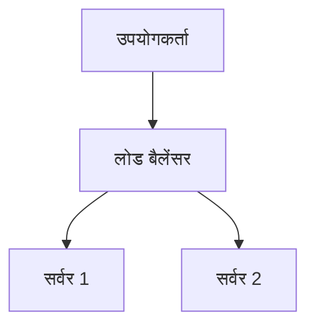

# Markdown Viewer

**Markdown में लिखें, एक क्लिक से परफेक्ट Word में एक्सपोर्ट करें।**

*पूरी तरह मुफ्त · स्थानीय प्रोसेसिंग · 18+ पेशेवर थीम · 23 भाषाओं का समर्थन*

---

आप Markdown में लिखना पसंद करते हैं — साफ, कुशल, संस्करण नियंत्रण के अनुकूल।  
लेकिन अंततः, आपको हमेशा एक Word दस्तावेज़ की आवश्यकता होती है।

**पुराना दुःस्वप्न:**

😫 फ्लोचार्ट मैन्युअल स्क्रीनशॉट · कॉपी-पेस्ट फॉर्मूले गड़बड़ हो जाते हैं · कोड को मैन्युअली फॉर्मेट करें · टेबल को सेल-दर-सेल समायोजित करें · एक्सपोर्ट के बाद फॉन्ट, स्पेसिंग और रंग समायोजित करने में आधा घंटा और

**एक दस्तावेज़: 1 घंटा लेखन, 2 घंटे फॉर्मेटिंग।**

---

**अब केवल 1 सेकंड लगता है।**

डाउनलोड पर क्लिक करें और एक परफेक्ट Word दस्तावेज़ प्राप्त करें:
- ✅ Mermaid आरेख → उच्च-रिज़ॉल्यूशन छवियां
- ✅ LaTeX फॉर्मूले → Word संपादन योग्य समीकरण
- ✅ स्वचालित सिंटैक्स हाइलाइटिंग (100+ भाषाएं)
- ✅ एक क्लिक से 18+ पेशेवर थीम
- ✅ पूरी तरह मुफ्त, स्थानीय प्रोसेसिंग

**लेखन पर समय बिताएं, फॉर्मेटिंग पर नहीं।**

---

## 💫 वास्तविक परिणाम देखें

### तकनीकी दस्तावेज़ीकरण: 15 फ्लोचार्ट, 2 घंटे → 5 मिनट

**पहले:** draw.io आरेख → PNG एक्सपोर्ट → Word में सम्मिलित → आकार बदलें → 15 बार दोहराएं = **2 घंटे**

**अब:** Mermaid कोड लिखें → डाउनलोड पर क्लिक करें = **5 मिनट**

## सिस्टम आर्किटेक्चर

``````markdown

``````

परिवर्तन की आवश्यकता? कोड संशोधित करें और पुनः एक्सपोर्ट करें। **115 मिनट बचाएं।**

### अकादमिक पेपर: 50+ फॉर्मूले, 3 घंटे → 10 मिनट

**पहले:** Word समीकरण संपादक एक-एक करके या सशुल्क टूल सदस्यता = **3 घंटे + सशुल्क सदस्यता**

**अब:** LaTeX सिंटैक्स सीधे लिखें → डाउनलोड पर क्लिक करें = **10 मिनट + मुफ्त**

द्रव्यमान $m$ और त्वरण $a$ दिया गया है, न्यूटन के दूसरे नियम के अनुसार:

```markdown
$$
F = ma = m\frac{dv}{dt} = m\frac{d^2x}{dt^2}
$$
```

मूल Word प्रारूप के रूप में एक्सपोर्ट, पूरी तरह से संपादन योग्य। **छवि नहीं, बल्कि वास्तविक समीकरण ऑब्जेक्ट।**

### टीम सहयोग: साप्ताहिक रिपोर्ट, 1 घंटा → 1 मिनट

**पहले:** सामग्री कॉपी करें → प्रारूप सेट करें → सूचियां समायोजित करें → स्टाइलिंग जोड़ें → Excel चार्ट + स्क्रीनशॉट = **साप्ताहिक 1 घंटा**

**अब:** फ़ाइल खोलें → थीम चुनें → डाउनलोड पर क्लिक करें = **1 मिनट**

"Business" थीम चुनें, Vega-Lite डेटा चार्ट स्वचालित रूप से उच्च-रिज़ॉल्यूशन छवियों में परिवर्तित हो जाते हैं, पेशेवर रूप। **साप्ताहिक 59 मिनट बचाएं।**

**व्यावसायिक उपयोग के मामले:**
- 📊 बिक्री रुझान (लाइन चार्ट)
- 📈 बाजार हिस्सेदारी तुलना (बार चार्ट)
- 🎯 KPI उपलब्धि (गेज)
- 📉 लागत विश्लेषण (स्टैक्ड चार्ट)

डेटा को बोलने दें, एक क्लिक से पेशेवर रिपोर्ट उत्पन्न करें।

---

## 🎯 तीन मुख्य विशेषताएं

### 1. स्वचालित आरेख रूपांतरण

**Mermaid आरेख** · **Vega/Vega-Lite डेटा चार्ट** · SVG छवियां · जटिल HTML तालिकाएं

**Mermaid:** फ्लोचार्ट, अनुक्रम आरेख, क्लास आरेख, स्टेट आरेख → तकनीकी दस्तावेज़, आर्किटेक्चर डिज़ाइन  
**Vega/Vega-Lite:** बार चार्ट, लाइन चार्ट, स्कैटर प्लॉट, हीटमैप → व्यावसायिक रिपोर्ट, डेटा विश्लेषण

**समय तुलना:** जटिल अनुक्रम आरेख (10 ऑब्जेक्ट)
- पारंपरिक उपकरण: ड्रॉइंग 30मिन + संशोधित 20मिन + समायोजित 10मिन + एक्सपोर्ट 5मिन = **65 मिनट**
- Markdown Viewer: कोड लिखें 5मिन + संशोधित 30से + एक्सपोर्ट 1से = **6 मिनट**

**व्यावसायिक परिदृश्य:** तिमाही बिक्री रिपोर्ट (5 बार चार्ट)
- Excel चार्टिंग + स्क्रीनशॉट: डेटा चुनें 15मिन + प्रारूप 10मिन + स्क्रीनशॉट 5मिन = **30 मिनट**
- Vega-Lite: JSON डेटा 2मिन + एक-क्लिक एक्सपोर्ट = **3 मिनट**

**सटीक, पेशेवर, पुन: प्रयोज्य।**

### 2. परिपूर्ण फॉर्मूला रूपांतरण

LaTeX → Word संपादन योग्य समीकरण (छवियां नहीं!)

एक्सपोर्ट के बाद, आप कर सकते हैं:
- ✅ Word में संपादन जारी रखें
- ✅ फ़ॉन्ट आकार समायोजित करें
- ✅ प्रतीक और चर संशोधित करें
- ✅ अन्य दस्तावेज़ों में कॉपी करें

**एक फॉर्मूला, दो दृष्टिकोण:**
- ❌ Word समीकरण संपादक: क्लिक...क्लिक...क्लिक...प्रतीक चुनें...स्थिति समायोजित करें
- ✅ LaTeX: `\int_0^\infty e^{-x^2}dx` हो गया

### 3. 18+ पेशेवर थीम

विभिन्न परिदृश्य, विभिन्न शैलियाँ, एक क्लिक से स्विच करें:

- 📊 Business / Technical → व्यावसायिक रिपोर्ट, तकनीकी दस्तावेज़
- 📚 Academic / Palatino → अकादमिक पेपर, पुस्तक टाइपसेटिंग  
- 🇨🇳 Songti / Heiti / Mixed → चीनी दस्तावेज़
- 🎨 Typewriter / Sakura → रचनात्मक सामग्री

**WYSIWYG:** पूर्वावलोकन बिल्कुल एक्सपोर्ट किए गए Word जैसा दिखता है। अनुमान नहीं, परीक्षण नहीं।

**अब मैन्युअल समायोजन की आवश्यकता नहीं:** फ़ॉन्ट, आकार, लाइन स्पेसिंग, पैराग्राफ स्पेसिंग, कोड पृष्ठभूमि रंग...

---

## ⚡ बिजली की गति का अनुभव

### स्मार्ट कैश: पहली बार 5s, दूसरी बार 1s

50 Mermaid आरेखों वाला दस्तावेज़:
- **पहली बार खोलना:** पाठ तुरंत प्रदर्शित होता है, आरेख पृष्ठभूमि में रेंडर होते हैं, 5 सेकंड के भीतर सब पूर्ण
- **दूसरी बार खोलना:** कैश से लोड करें, तत्काल प्रदर्शन (<1s)
- **पाठ संशोधित:** अभी भी तत्काल (कैश से आरेख)
- **आरेख संशोधित:** केवल परिवर्तित आरेख पुनः रेंडर करें

**Word से 10 गुना तेज, 100 गुना छोटी फ़ाइलें।**

### पठन संवर्धन

- **तीन लेआउट:** सामान्य (1000px) / पूर्ण स्क्रीन / संकीर्ण (530px, Word प्रभाव पूर्वावलोकन)
- **लचीला ज़ूम:** 50%-400%, शॉर्टकट `Ctrl/Cmd +` `-` `0`
- **स्मार्ट सामग्री तालिका:** शीर्षक स्वचालित निष्कर्षण, साइडबार नेविगेशन, `Ctrl/Cmd + B` टॉगल करें
- **स्थिति स्मृति:** स्क्रॉल स्थिति स्वचालित सहेजें, अगली बार पढ़ना जारी रखें
- **इतिहास:** हाल ही में खोले गए दस्तावेज़ों को ट्रैक करें

---

## 🚀 त्वरित प्रारंभ - 3 चरण

### चरण 1: एक्सटेंशन इंस्टॉल करें (30 सेकंड)

1. Chrome ब्राउज़र खोलें
2. Chrome वेब स्टोर पर जाएं
3. "Markdown Viewer" खोजें
4. "Chrome में जोड़ें" पर क्लिक करें
5. ✅ इंस्टॉलेशन पूर्ण

### चरण 2: फ़ाइल पहुंच की अनुमति दें (1 मिनट)

**यदि आप स्थानीय .md फ़ाइलें खोलना चाहते हैं:**

1. `chrome://extensions/` खोलें
2. Markdown Viewer खोजें
3. "फ़ाइल URL तक पहुंच की अनुमति दें" सक्षम करें
4. ✅ अब आप स्थानीय Markdown फ़ाइलों को डबल-क्लिक से खोल सकते हैं

**आवश्यक नहीं यदि:**
- केवल ऑनलाइन दस्तावेज़ देख रहे हैं (GitHub, ब्लॉग आदि)
- ब्राउज़र की "फ़ाइल खोलें" सुविधा का उपयोग कर रहे हैं

### त्वरित प्रारंभ

**दस्तावेज़ खोलें:** .md फ़ाइलों को डबल-क्लिक करें या ब्राउज़र में ड्रैग करें · GitHub दस्तावेज़ स्वचालित रेंडर किए गए

**Word में एक्सपोर्ट करें:** डाउनलोड बटन पर क्लिक करें या `Ctrl/Cmd + S` → प्रगति देखें → स्वचालित सहेजें

**थीम बदलें:** टूलबार पर क्लिक करें → थीम चुनें → तुरंत लागू करें

**दृश्य समायोजित करें:** `+`/`-` ज़ूम · लेआउट स्विच करें · `Ctrl/Cmd + B` सामग्री तालिका

---

## 🎁 संपूर्ण सुविधाएं

### पूर्ण Markdown सिंटैक्स समर्थन

शीर्षक · पैराग्राफ · बोल्ड · इटैलिक · स्ट्राइकथ्रू · सूचियां · कार्य सूचियां · उद्धरण · कोड ब्लॉक (100+ भाषाओं में हाइलाइट) · तालिकाएं · लिंक · छवियां · Mermaid आरेख · Vega / Vega-Lite चार्ट · LaTeX फॉर्मूले · HTML · GFM एक्सटेंशन

### 18 थीम

**व्यवसाय:** Default · Business · Technical  
**अकादमिक:** Academic  
**सेरिफ:** Palatino · Garamond · Cambria · Elegant  
**सैन्स-सेरिफ:** Verdana · Trebuchet · Century  
**चीनी:** Songti · Heiti · Mixed  
**रचनात्मक:** Typewriter · Sakura · Water · Minimal

### 23 इंटरफ़ेस भाषाएं

सरलीकृत चीनी · पारंपरिक चीनी · English · Deutsch · Español · Français · Italiano · Nederlands · Português (BR) · Português (PT) · Polski · Русский · 日本語 · 한국어 · ไทย · Tiếng Việt · हिन्दी · Bahasa Indonesia · Dansk · Suomi · Norsk · Svenska · Türkçe

---

## 💎 प्रतिस्पर्धी लाभ

|  | मैन्युअल स्क्रीनशॉट | CLI उपकरण | ऑनलाइन सेवाएं | डेस्कटॉप संपादक | Markdown Viewer |
|---|:---:|:---:|:---:|:---:|:---:|
| **उपयोग में आसानी** | थकाऊ | सेटअप आवश्यक | अपलोड आवश्यक | इंस्टॉल आवश्यक | ✅ एक-क्लिक |
| **Mermaid** | मैन्युअल स्क्रीनशॉट | प्लगइन आवश्यक | ✅ समर्थित | ✅ समर्थित | ✅ मूल समर्थन |
| **गणित फॉर्मूले** | छवियां | छवियां | छवियां | छवियां | ✅ संपादन योग्य |
| **गोपनीयता** | ✅ स्थानीय | ✅ स्थानीय | ❌ क्लाउड अपलोड | ✅ स्थानीय | ✅ स्थानीय |
| **थीम** | - | - | 3-5 | 5-10 | ✅ 18+ |
| **ऑफ़लाइन** | ✅ | ✅ | ❌ | ✅ | ✅ |
| **GitHub सीधा दृश्य** | ❌ | ❌ | ❌ | ❌ | ✅ |
| **कीमत** | मुफ्त | मुफ्त | सशुल्क योजनाएं | सशुल्क योजनाएं | ✅ मुफ्त |

**मुख्य लाभ: तेज़, सस्ता, सुरक्षित, अधिक शक्तिशाली।**

---

## ❓ अक्सर पूछे जाने वाले प्रश्न

**प्रश्न: क्या मैं एक्सपोर्ट किए गए Word दस्तावेज़ को संपादित कर सकता हूं?**  
उ: हां। मानक .docx प्रारूप, गणित फॉर्मूले संपादन योग्य हैं, छवियां नहीं।

**प्रश्न: कौन से आरेख समर्थित हैं?**  
उ: सभी Mermaid आरेख (फ्लोचार्ट, अनुक्रम, गैंट, क्लास, स्टेट, पाई, ER आदि), Vega / Vega-Lite डेटा विज़ुअलाइज़ेशन चार्ट + SVG स्वचालित रूपांतरण।

**प्रश्न: क्या फ़ाइल आकार की सीमा है?**  
उ: कोई सीमा नहीं। स्मार्ट कैश, 100+ आरेखों वाले दस्तावेज़ तुरंत खुलते हैं।

**प्रश्न: क्या इंटरनेट की आवश्यकता है?**  
उ: नहीं। पूरी तरह से स्थानीय प्रसंस्करण, ऑफ़लाइन काम करता है।

**प्रश्न: क्या मेरे दस्तावेज़ अपलोड किए जाएंगे?**  
उ: कभी नहीं। सभी प्रसंस्करण स्थानीय रूप से होता है।

**प्रश्न: थीम कैसे बदलें?**  
उ: टूलबार आइकन पर क्लिक करें → थीम चुनें → तुरंत लागू करें।

**प्रश्न: क्या मैं थीम को अनुकूलित कर सकता हूं?**  
उ: वर्तमान में 18 पूर्वनिर्धारित थीम, अनुकूलन जल्द आ रहा है।

**प्रश्न: क्या बड़े दस्तावेज़ धीमे होंगे?**  
उ: नहीं। प्रगतिशील लोडिंग + स्मार्ट कैश, पाठ तुरंत प्रदर्शित होता है, आरेख पृष्ठभूमि में रेंडर होते हैं (पहली बार 5s, दूसरी बार 1s)।

**प्रश्न: क्या कैश बहुत अधिक स्थान लेता है?**  
उ: डिफ़ॉल्ट अधिकतम 1000 आइटम, लगभग 500 MB, सेटिंग्स में समायोज्य या साफ़ करने योग्य।

**प्रश्न: कौन से ब्राउज़र समर्थित हैं?**  
उ: Chrome और Chromium-आधारित ब्राउज़र (Edge, Brave, Opera)।

**प्रश्न: एक्सपोर्ट की गई फ़ाइल किस Word संस्करण में खुल सकती है?**  
उ: Word 2016+ पूरी तरह समर्थित, Word 2013 भी काम करता है। WPS Office के साथ पूरी तरह संगत।

**प्रश्न: क्या मैं PDF में एक्सपोर्ट कर सकता हूं?**  
उ: वर्तमान में केवल Word, PDF योजनाबद्ध। आप पहले Word में एक्सपोर्ट कर सकते हैं फिर PDF के रूप में सहेज सकते हैं।

**प्रश्न: कौन सी थीम मेरे लिए उपयुक्त है?**  
उ: व्यावसायिक रिपोर्ट → Business · अकादमिक पेपर → Academic · तकनीकी दस्तावेज़ → Technical · चीनी दस्तावेज़ → Songti/Mixed

**प्रश्न: Vega और Mermaid में क्या अंतर है?**  
उ: **Mermaid** फ्लोचार्ट, आर्किटेक्चर आरेख और अन्य योजनाबद्ध आरेखों के लिए है; **Vega/Vega-Lite** डेटा विज़ुअलाइज़ेशन के लिए है जैसे बिक्री चार्ट, वित्तीय रिपोर्ट और अन्य डेटा-संचालित व्यावसायिक चार्ट। वे विभिन्न परिदृश्यों के लिए एक-दूसरे के पूरक हैं।

**प्रश्न: Vega-Lite के साथ चार्ट कैसे बनाएं?**  
उ: Markdown में ````vega-lite` कोड ब्लॉक का उपयोग करें JSON प्रारूप चार्ट विनिर्देश के साथ। [Vega-Lite आधिकारिक उदाहरण](https://vega.github.io/vega-lite/examples/) देखें।

---

## 🔒 गोपनीयता प्रतिबद्धता

- ✅ सभी प्रसंस्करण स्थानीय रूप से किया जाता है, कभी अपलोड नहीं किया जाता
- ✅ कोई ट्रैकिंग नहीं, कोई व्यक्तिगत डेटा संग्रह नहीं
- ✅ ओपन सोर्स कोड, ऑडिट योग्य और पारदर्शी
- ✅ Chrome वेब स्टोर सुरक्षा स्वीकृत (Manifest V3)

**आपकी गोपनीयता 100% सुरक्षित है।**

---

## 🆘 सहायता प्राप्त करें

📖 [पूर्ण दस्तावेज़ीकरण](https://github.com/xicilion/markdown-viewer-extension) · 🐛 [समस्याओं की रिपोर्ट करें](https://github.com/xicilion/markdown-viewer-extension/issues) · 💡 [सुविधा अनुरोध](https://github.com/xicilion/markdown-viewer-extension/issues) · ⭐ [GitHub स्टार](https://github.com/xicilion/markdown-viewer-extension)

---

## 🎉 अभी शुरू करें

**30 सेकंड में इंस्टॉल करें, तुरंत उपयोग शुरू करें:**

1. Chrome वेब स्टोर पर जाएं → "Markdown Viewer" खोजें
2. "Chrome में जोड़ें" पर क्लिक करें
3. "एक्सटेंशन प्रबंधित करें" पर क्लिक करें, "फ़ाइल URLs तक पहुंच की अनुमति दें" सक्षम करें
4. `.md` फ़ाइलों को ब्राउज़र में खींचें
5. ✅ उपयोग शुरू करें

**आप प्राप्त करेंगे:** Markdown → Word एक-क्लिक रूपांतरण · Mermaid स्वचालित रूपांतरण · LaTeX संपादन योग्य फॉर्मूले · 100+ भाषाओं का सिंटैक्स हाइलाइटिंग · 18+ थीम · स्मार्ट कैश · पूरी तरह मुफ्त

**के लिए उपयुक्त:** तकनीकी लेखक · छात्र/शोधकर्ता · उत्पाद प्रबंधक · डेवलपर्स · कोई भी जो Markdown का उपयोग करता है

---

## 📜 ओपन सोर्स लाइसेंस

यह प्रोजेक्ट ISC लाइसेंस के तहत ओपन सोर्स है। स्टार देने, समस्याओं की रिपोर्ट करने, सुविधाओं का सुझाव देने और कोड योगदान करने के लिए स्वागत है।

**प्रोजेक्ट URL:** https://github.com/xicilion/markdown-viewer-extension

---

**फॉर्मेटिंग पर अपना समय बर्बाद न करें**

**लेखन पर ध्यान केंद्रित करें, बाकी सब Markdown Viewer को संभालने दें**

### [🚀 अभी इंस्टॉल करें](https://chromewebstore.google.com/detail/markdown-viewer/jekhhoflgcfoikceikgeenibinpojaoi)

*पूरी तरह मुफ्त · स्थानीय प्रसंस्करण · गोपनीयता सुरक्षित*
