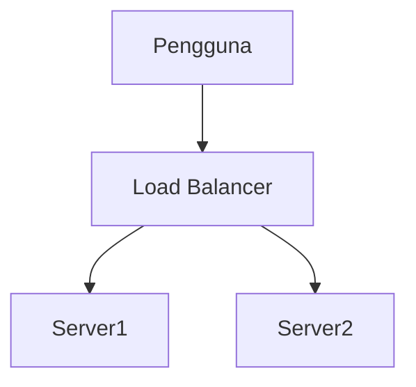

# Markdown Viewer

**Tulis dalam Markdown, ekspor ke Word sempurna dengan satu klik.**

*Sepenuhnya gratis · Pemrosesan lokal · 18+ tema profesional · Mendukung 23 bahasa*

---

Anda suka menulis dalam Markdown — bersih, efisien, ramah kontrol versi.  
Tapi pada akhirnya, Anda selalu memerlukan dokumen Word.

**Mimpi buruk lama:**

😫 Screenshot diagram alur manual · Rumus salin-tempel jadi berantakan · Format kode manual · Sesuaikan tabel sel demi sel · Setelah ekspor, setengah jam lagi untuk menyesuaikan font, spasi, dan warna

**Satu dokumen: 1 jam menulis, 2 jam memformat.**

---

**Sekarang hanya butuh 1 detik.**

Klik unduh dan dapatkan dokumen Word sempurna:
- ✅ Diagram Mermaid → Gambar resolusi tinggi
- ✅ Rumus LaTeX → Persamaan Word yang dapat diedit
- ✅ Penyorotan sintaks otomatis (100+ bahasa)
- ✅ 18+ tema profesional dengan satu klik
- ✅ Sepenuhnya gratis, pemrosesan lokal

**Habiskan waktu untuk menulis, bukan memformat.**

---

## 💫 Lihat hasil nyata

### Dokumentasi Teknis: 15 diagram alur, 2 jam → 5 menit

**Sebelumnya:** gambar draw.io → ekspor PNG → sisipkan ke Word → sesuaikan ukuran → ulangi 15 kali = **2 jam**

**Sekarang:** Tulis diagram dengan kode Mermaid → klik unduh = **5 menit**

## Arsitektur Sistem

``````markdown

``````

Perlu perubahan? Ubah kode dan ekspor ulang. **Hemat 115 menit.**

### Makalah Akademik: 50+ rumus, 3 jam → 10 menit

**Sebelumnya:** Editor persamaan Word satu per satu ATAU langganan alat berbayar = **3 jam + Langganan berbayar**

**Sekarang:** Tulis sintaks LaTeX langsung → klik unduh = **10 menit + Gratis**

Diberikan massa $m$ dan percepatan $a$, menurut hukum kedua Newton:

```markdown
$$
F = ma = m\frac{dv}{dt} = m\frac{d^2x}{dt^2}
$$
```

Diekspor sebagai format Word asli, sepenuhnya dapat diedit. **Bukan gambar, tapi objek persamaan nyata.**

### Kolaborasi Tim: Laporan Mingguan, 1 jam → 1 menit

**Sebelumnya:** Salin konten → Atur format → Sesuaikan daftar → Tambah gaya → Grafik Excel + screenshot = **1 jam per minggu**

**Sekarang:** Buka file → Pilih tema → Klik unduh = **1 menit**

Pilih tema "Business", grafik data Vega-Lite otomatis dikonversi menjadi gambar resolusi tinggi, tampilan profesional. **Hemat 59 menit per minggu.**

**Kasus penggunaan bisnis:**
- 📊 Tren penjualan (grafik garis)
- 📈 Perbandingan pangsa pasar (grafik batang)
- 🎯 Pencapaian KPI (pengukur)
- 📉 Analisis biaya (grafik bertumpuk)

Biarkan data berbicara, hasilkan laporan profesional dengan satu klik.

---

## 🎯 Tiga Fitur Utama

### 1. Konversi Diagram Otomatis

**Diagram Mermaid** · **Grafik Data Vega/Vega-Lite** · Gambar SVG · Tabel HTML kompleks

**Mermaid:** Diagram alur, diagram urutan, diagram kelas, diagram status → Dokumen teknis, desain arsitektur  
**Vega/Vega-Lite:** Grafik batang, grafik garis, plot sebar, peta panas → Laporan bisnis, analisis data

**Perbandingan waktu:** Diagram urutan kompleks (10 objek)
- Alat tradisional: Menggambar 30mnt + Memodifikasi 20mnt + Menyesuaikan 10mnt + Mengekspor 5mnt = **65 menit**
- Markdown Viewer: Menulis kode 5mnt + Memodifikasi 30dtk + Mengekspor 1dtk = **6 menit**

**Skenario bisnis:** Laporan penjualan kuartalan (5 grafik batang)
- Grafik Excel + screenshot: Memilih data 15mnt + Memformat 10mnt + Screenshot 5mnt = **30 menit**
- Vega-Lite: Data JSON 2mnt + Ekspor satu klik = **3 menit**

**Presisi, profesional, dapat digunakan kembali.**

### 2. Konversi Rumus Sempurna

LaTeX → Persamaan Word yang dapat diedit (bukan gambar!)

Setelah ekspor, Anda dapat:
- ✅ Lanjutkan mengedit di Word
- ✅ Sesuaikan ukuran font
- ✅ Modifikasi simbol dan variabel
- ✅ Salin ke dokumen lain

**Satu rumus, dua pendekatan:**
- ❌ Editor persamaan Word: Klik...klik...klik...pilih simbol...sesuaikan posisi
- ✅ LaTeX: `\int_0^\infty e^{-x^2}dx` Selesai

### 3. 18+ Tema Profesional

Skenario berbeda, gaya berbeda, beralih dengan satu klik:

- 📊 Business / Technical → Laporan bisnis, dokumen teknis
- 📚 Academic / Palatino → Makalah akademik, penyusunan buku  
- 🇨🇳 Songti / Heiti / Mixed → Dokumen Cina
- 🎨 Typewriter / Sakura → Konten kreatif

**WYSIWYG:** Pratinjau terlihat persis seperti Word yang diekspor. Tidak perlu menebak, tidak perlu mencoba.

**Tidak perlu penyesuaian manual lagi:** Font, ukuran, jarak baris, jarak paragraf, warna latar belakang kode...

---

## ⚡ Pengalaman Secepat Kilat

### Cache Cerdas: Pertama kali 5d, kedua kali 1d

Dokumen dengan 50 diagram Mermaid:
- **Pembukaan pertama:** Teks ditampilkan langsung, diagram dirender di latar belakang, semua selesai dalam 5 detik
- **Pembukaan kedua:** Muat dari cache, tampilan instan (<1d)
- **Teks dimodifikasi:** Masih instan (diagram dari cache)
- **Diagram dimodifikasi:** Hanya diagram yang diubah yang dirender ulang

**10x lebih cepat dari Word, file 100x lebih kecil.**

### Peningkatan Membaca

- **Tiga tata letak:** Normal (1000px) / Layar penuh / Sempit (530px, pratinjau efek Word)
- **Zoom fleksibel:** 50%-400%, pintasan `Ctrl/Cmd +` `-` `0`
- **Daftar isi cerdas:** Ekstraksi judul otomatis, navigasi sidebar, `Ctrl/Cmd + B` untuk toggle
- **Memori posisi:** Simpan posisi scroll otomatis, lanjutkan membaca di lain waktu
- **Riwayat:** Lacak dokumen yang baru dibuka

---

## 🚀 Mulai Cepat - 3 Langkah

### Langkah 1: Instal Ekstensi (30 detik)

1. Buka browser Chrome
2. Kunjungi Chrome Web Store
3. Cari "Markdown Viewer"
4. Klik "Tambahkan ke Chrome"
5. ✅ Instalasi selesai

### Langkah 2: Izinkan Akses File (1 menit)

**Jika Anda ingin membuka file .md lokal:**

1. Buka `chrome://extensions/`
2. Temukan Markdown Viewer
3. Aktifkan "Izinkan akses ke URL file"
4. ✅ Sekarang Anda dapat membuka file Markdown lokal dengan klik ganda

**Tidak perlu jika:**
- Hanya melihat dokumen online (GitHub, blog, dll.)
- Menggunakan fungsi "Buka File" browser

### Mulai Cepat

**Buka dokumen:** Klik ganda file .md atau seret ke browser · Dokumen GitHub dirender otomatis

**Ekspor ke Word:** Klik tombol unduh atau `Ctrl/Cmd + S` → Lihat kemajuan → Simpan otomatis

**Beralih tema:** Klik toolbar → Pilih tema → Terapkan langsung

**Sesuaikan tampilan:** `+`/`-` zoom · Beralih tata letak · `Ctrl/Cmd + B` daftar isi

---

## 🎁 Fitur Lengkap

### Dukungan Sintaks Markdown Penuh

Judul · Paragraf · Tebal · Miring · Coret · Daftar · Daftar tugas · Kutipan · Blok kode (penyorotan 100+ bahasa) · Tabel · Tautan · Gambar · Diagram Mermaid · Grafik Vega / Vega-Lite · Rumus LaTeX · HTML · Ekstensi GFM

### 18 Tema

**Bisnis:** Default · Business · Technical  
**Akademik:** Academic  
**Serif:** Palatino · Garamond · Cambria · Elegant  
**Sans-serif:** Verdana · Trebuchet · Century  
**Cina:** Songti · Heiti · Mixed  
**Kreatif:** Typewriter · Sakura · Water · Minimal

### 23 Bahasa Antarmuka

Cina Sederhana · Cina Tradisional · English · Deutsch · Español · Français · Italiano · Nederlands · Português (BR) · Português (PT) · Polski · Русский · 日本語 · 한국어 · ไทย · Tiếng Việt · हिन्दी · Bahasa Indonesia · Dansk · Suomi · Norsk · Svenska · Türkçe

---

## 💎 Keunggulan Kompetitif

|  | Screenshot Manual | Alat CLI | Layanan Online | Editor Desktop | Markdown Viewer |
|---|:---:|:---:|:---:|:---:|:---:|
| **Kemudahan Penggunaan** | Merepotkan | Perlu pengaturan | Perlu upload | Perlu instalasi | ✅ Satu klik |
| **Mermaid** | Screenshot manual | Perlu plugin | ✅ Didukung | ✅ Didukung | ✅ Dukungan native |
| **Rumus Matematika** | Gambar | Gambar | Gambar | Gambar | ✅ Dapat diedit |
| **Privasi** | ✅ Lokal | ✅ Lokal | ❌ Upload cloud | ✅ Lokal | ✅ Lokal |
| **Tema** | - | - | 3-5 | 5-10 | ✅ 18+ |
| **Offline** | ✅ | ✅ | ❌ | ✅ | ✅ |
| **Tampilan Langsung GitHub** | ❌ | ❌ | ❌ | ❌ | ✅ |
| **Harga** | Gratis | Gratis | Paket berbayar | Paket berbayar | ✅ Gratis |

**Keunggulan inti: Lebih cepat, lebih murah, lebih aman, lebih kuat.**

---

## ❓ Pertanyaan yang Sering Diajukan

**T: Bisakah saya mengedit dokumen Word yang diekspor?**  
J: Ya. Format .docx standar, rumus matematika dapat diedit, bukan gambar.

**T: Diagram apa yang didukung?**  
J: Semua diagram Mermaid (flowchart, sequence, gantt, class, state, pie, ER, dll.), grafik visualisasi data Vega / Vega-Lite + konversi SVG otomatis.

**T: Apakah ada batasan ukuran file?**  
J: Tidak ada batasan. Cache cerdas, dokumen dengan 100+ diagram terbuka langsung.

**T: Apakah memerlukan internet?**  
J: Tidak. Pemrosesan sepenuhnya lokal, bekerja offline.

**T: Apakah dokumen saya akan diunggah?**  
J: Tidak pernah. Semua pemrosesan terjadi secara lokal.

**T: Bagaimana cara beralih tema?**  
J: Klik ikon toolbar → Pilih tema → Terapkan langsung.

**T: Bisakah saya menyesuaikan tema?**  
J: Saat ini 18 tema preset, penyesuaian akan datang.

**T: Apakah dokumen besar akan lambat?**  
J: Tidak. Pemuatan progresif + cache cerdas, teks ditampilkan langsung, diagram dirender di latar belakang (pertama 5d, kedua 1d).

**T: Apakah cache memakan banyak ruang?**  
J: Standar maks 1000 item, sekitar 500 MB, dapat disesuaikan atau dihapus di pengaturan.

**T: Browser apa yang didukung?**  
J: Chrome dan browser berbasis Chromium (Edge, Brave, Opera).

**T: Versi Word mana yang dapat membuka file yang diekspor?**  
J: Word 2016+ sepenuhnya didukung, Word 2013 juga berfungsi. Sepenuhnya kompatibel dengan WPS Office.

**T: Bisakah saya mengekspor ke PDF?**  
J: Saat ini hanya Word, PDF direncanakan. Anda dapat mengekspor ke Word terlebih dahulu lalu menyimpan sebagai PDF.

**T: Tema mana yang cocok untuk saya?**  
J: Laporan bisnis → Business · Makalah akademik → Academic · Dokumen teknis → Technical · Dokumen Cina → Songti/Mixed

**T: Apa perbedaan antara Vega dan Mermaid?**  
J: **Mermaid** untuk diagram alur, diagram arsitektur, dan diagram skematik lainnya; **Vega/Vega-Lite** untuk visualisasi data seperti grafik penjualan, laporan keuangan, dan grafik bisnis berbasis data lainnya. Keduanya saling melengkapi untuk skenario berbeda.

**T: Bagaimana cara membuat grafik dengan Vega-Lite?**  
J: Gunakan blok kode ````vega-lite` dalam Markdown dengan spesifikasi grafik format JSON. Lihat [contoh resmi Vega-Lite](https://vega.github.io/vega-lite/examples/).

---

## 🔒 Komitmen Privasi

- ✅ Semua pemrosesan dilakukan secara lokal, tidak pernah diunggah
- ✅ Tidak ada pelacakan, tidak ada pengumpulan data pribadi
- ✅ Kode open source, dapat diaudit dan transparan
- ✅ Keamanan Chrome Web Store disetujui (Manifest V3)

**Privasi Anda 100% dilindungi.**

---

## 🆘 Dapatkan Bantuan

📖 [Dokumentasi Lengkap](https://github.com/xicilion/markdown-viewer-extension) · 🐛 [Laporkan Masalah](https://github.com/xicilion/markdown-viewer-extension/issues) · 💡 [Permintaan Fitur](https://github.com/xicilion/markdown-viewer-extension/issues) · ⭐ [Bintang GitHub](https://github.com/xicilion/markdown-viewer-extension)

---

## 🎉 Mulai Sekarang

**Instal dalam 30 detik, mulai gunakan langsung:**

1. Kunjungi Chrome Web Store → Cari "Markdown Viewer"
2. Klik "Tambahkan ke Chrome"
3. Klik "Kelola ekstensi", aktifkan "Izinkan akses ke URL file"
4. Seret file `.md` ke browser
5. ✅ Mulai gunakan

**Anda akan mendapatkan:** Konversi Markdown → Word satu klik · Konversi Mermaid otomatis · Rumus LaTeX yang dapat diedit · Penyorotan sintaks 100+ bahasa · 18+ tema · Cache cerdas · Sepenuhnya gratis

**Sempurna untuk:** Penulis teknis · Mahasiswa/peneliti · Manajer produk · Pengembang · Siapa saja yang menggunakan Markdown

---

## 📜 Lisensi Open Source

Proyek ini adalah open source di bawah lisensi ISC. Selamat datang untuk memberi bintang, melaporkan masalah, menyarankan fitur, dan berkontribusi kode.

**URL Proyek:** https://github.com/xicilion/markdown-viewer-extension

---

**Jangan buang waktu Anda untuk memformat**

**Fokus pada penulisan, biarkan Markdown Viewer menangani yang lain**

### [🚀 Instal Sekarang](https://chromewebstore.google.com/detail/markdown-viewer/jekhhoflgcfoikceikgeenibinpojaoi)

*Sepenuhnya Gratis · Pemrosesan Lokal · Privasi Terlindungi*
