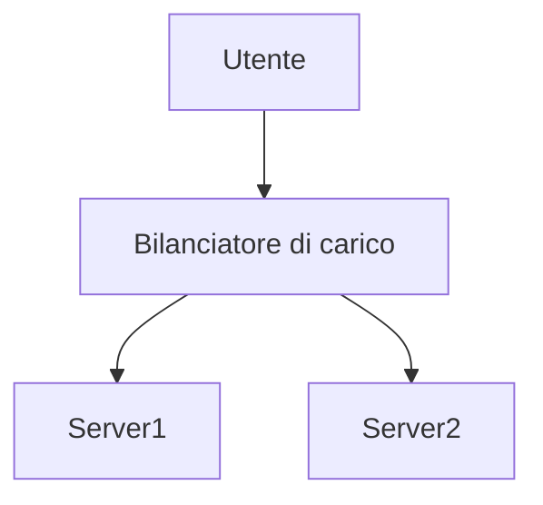

# Markdown Viewer

[English](README.en.md) · [简体中文](README.zh-CN.md) · [繁體中文](README.zh-TW.md) · [Русский](README.ru.md) · [日本語](README.ja.md) · [हिन्दी](README.hi.md) · [한국어](README.ko.md) · [Deutsch](README.de.md) · [Português (Brasil)](README.pt-BR.md) · [Português (Portugal)](README.pt-PT.md) · [Nederlands](README.nl.md) · [Українська](README.uk.md) · [Tiếng Việt](README.vi.md) · [Беларуская](README.be.md) · [Français](README.fr.md) · [Italiano](README.it.md) · [Bahasa Indonesia](README.id.md) · [Español](README.es.md) · [ไทย](README.th.md) · [Svenska](README.sv.md) · [Türkçe](README.tr.md) · [Eesti](README.et.md) · [Bahasa Melayu](README.ms.md) · [Polski](README.pl.md) · [Suomi](README.fi.md) · [Lietuvių](README.lt.md) · [Norsk](README.no.md) · [Dansk](README.da.md)

**Markdown in Word perfetto con un clic — Mermaid, Graphviz, Vega, infografica, LaTeX (modificabile), evidenziazione codice, elaborazione locale**

*Completamente gratuito · 18+ temi professionali · 28 lingue*

🚀 **Installa subito:** https://chromewebstore.google.com/detail/markdown-viewer/jekhhoflgcfoikceikgeenibinpojaoi

---

Ti piace scrivere in Markdown — semplice, efficiente, amico del controllo di versione.  
Ma alla fine, hai sempre bisogno di un documento Word.

**L'incubo di prima:**

😫 Screenshot manuali dei diagrammi di flusso · Le formule matematiche si rovinano quando copiate · Formattazione manuale del codice · Regolazione cella per cella delle tabelle · Dopo l'esportazione, mezz'ora per regolare font, spaziatura e colori

**Un documento: 1 ora di scrittura, 2 ore di formattazione.**

---

**Ora ci vuole solo 1 secondo.**

Clicca per scaricare e ottieni un documento Word perfetto:
- ✅ Diagrammi Mermaid → Immagini ad alta definizione
- ✅ Grafi Graphviz DOT → Immagini ad alta definizione
- ✅ Formule LaTeX → Formule modificabili in Word
- ✅ Evidenziazione automatica del codice (100+ linguaggi)
- ✅ 18+ temi professionali con un clic
- ✅ Completamente gratuito, elaborazione locale

**Dedica il tuo tempo alla scrittura, non alla formattazione.**

---

## 💫 Guarda i risultati reali

### Documentazione tecnica: 15 diagrammi di flusso, 2 ore → 5 minuti

**Prima:** draw.io disegno → esporta PNG → inserisci in Word → regola dimensioni → ripeti 15 volte = **2 ore**

**Ora:** Scrivi diagrammi con codice Mermaid → clicca per scaricare = **5 minuti**

## Architettura di sistema

``````markdown

``````

Modifica? Cambia il codice e riesporta. **Risparmia 115 minuti.**

### Articolo accademico: 50+ formule, 3 ore → 10 minuti

**Prima:** Inserimento uno per uno nell'editor di formule Word o abbonamento a strumenti a pagamento = **3 ore + abbonamento a pagamento**

**Ora:** Scrivi direttamente con sintassi LaTeX → clicca per scaricare = **10 minuti + gratuito**

Sia la massa del punto materiale $m$, l'accelerazione $a$, secondo la seconda legge di Newton:

```markdown
$$
F = ma = m\frac{dv}{dt} = m\frac{d^2x}{dt^2}
$$
```

Dopo l'esportazione è in formato nativo Word, modificabile. **Non è un'immagine, è un vero oggetto formula.**

### Collaborazione di team: rapporto settimanale, 1 ora → 1 minuto

**Prima:** Copia contenuto → imposta formato → regola elenchi → aggiungi sfondo → screenshot grafici Excel = **1 ora a settimana**

**Ora:** Apri file → scegli tema → clicca per scaricare = **1 minuto**

Scegli il tema "Business", i grafici dati Vega-Lite si convertono automaticamente in immagini ad alta definizione, professionali ed eleganti. **Risparmia 59 minuti a settimana.**

**Esempi di scenari aziendali:**
- 📊 Grafico tendenze vendite (grafico a linee)
- 📈 Confronto quote di mercato (grafico a barre)
- 🎯 Tasso di raggiungimento KPI (dashboard)
- 📉 Analisi dei costi (grafico a pila)

Parla con i dati, genera rapporti professionali con un clic.

---

## 🎯 Tre funzionalità principali

### 1. Conversione automatica dei grafici

**Diagrammi di flusso Mermaid** · **Graphviz DOT** · **Grafici dati Vega/Vega-Lite** · **Infographic** · Immagini SVG · Tabelle HTML complesse

**Mermaid:** Diagrammi di flusso, diagrammi di sequenza, diagrammi di classe, diagrammi di stato → Documentazione tecnica, progettazione architetturale  
**Graphviz DOT:** Grafi orientati/non orientati, topologia di rete, macchine a stati → Architettura di sistema, analisi delle dipendenze  
**Vega/Vega-Lite:** Grafici a barre, grafici a linee, grafici a dispersione, mappe di calore → Rapporti aziendali, analisi dati  
**Infographic:** Grafici statistici, infografiche, visualizzazione dati → Presentazione dati, storytelling visivo

**Confronto tempi:** Diagramma di sequenza complesso (10 oggetti)
- Strumenti tradizionali: disegno 30 min + modifica 20 min + regolazione 10 min + esportazione 5 min = **65 minuti**
- Markdown Viewer: scrivi codice 5 min + modifica 30 sec + esporta 1 sec = **6 minuti**

**Scenario aziendale:** Rapporto vendite trimestrale (5 grafici a barre)
- Grafico Excel + screenshot: selezione dati 15 min + regolazione formato 10 min + screenshot salvataggio 5 min = **30 minuti**
- Vega-Lite: dati JSON 2 min + esportazione con un clic = **3 minuti**

**Preciso, professionale, riutilizzabile.**

### 2. Conversione perfetta delle formule matematiche

LaTeX → Formule modificabili in Word (non immagini!)

Dopo l'esportazione puoi:
- ✅ Continuare a modificare in Word
- ✅ Regolare la dimensione del font
- ✅ Modificare simboli e variabili
- ✅ Copiare in altri documenti

**Una formula, due modi di scriverla:**
- ❌ Editor di formule Word: clic clic clic clic clic...seleziona simbolo...regola posizione
- ✅ LaTeX: `\int_0^\infty e^{-x^2}dx` fatto

### 3. 18+ temi professionali

Scenari diversi, stili diversi, cambio con un clic:

- 📊 Business / Technical → Rapporti aziendali, documentazione tecnica
- 📚 Academic / Palatino → Articoli accademici, impaginazione libri  
- 🇨🇳 宋体 / 黑体 / 混排 → Documenti cinesi
- 🎨 Typewriter / Sakura → Contenuti creativi

**WYSIWYG:** Come appare nell'anteprima, così sarà in Word. Nessuna congettura, nessuna prova.

**Non dovrai più regolare manualmente:** Font, dimensione font, interlinea, spaziatura paragrafi, colore sfondo codice...

---

## ⚡ Esperienza velocissima

### Cache intelligente: prima volta 5 secondi, seconda volta 1 secondo

Documento contenente 50 diagrammi Mermaid:
- **Prima apertura:** Testo visualizzato immediatamente, diagrammi renderizzati in background, tutto completato in 5 secondi
- **Seconda apertura:** Caricamento da cache, visualizzazione istantanea (<1 secondo)
- **Modifica testo:** Ancora apertura istantanea (diagrammi caricati da cache)
- **Modifica diagrammi:** Solo i diagrammi modificati vengono ri-renderizzati

**Apertura 10 volte più veloce di Word, file 100 volte più piccolo.**

### Miglioramenti di lettura

- **Tre layout:** Normale (1000px) / Schermo intero / Stretto (530px, anteprima effetto Word)
- **Zoom flessibile:** 50%-400%, tasti rapidi `Ctrl/Cmd +` `-` `0`
- **Sommario intelligente:** Estrazione automatica titoli, navigazione barra laterale, `Ctrl/Cmd + B` per alternare
- **Memoria posizione:** Salvataggio automatico posizione scroll, continua lettura la prossima volta
- **Cronologia:** Registra documenti aperti recentemente

---

## 🚀 Avvio rapido - 3 passi

### Primo passo: Installa l'estensione (30 secondi)

1. Apri il browser Chrome
2. Visita Chrome Web Store
3. Cerca "Markdown Viewer"
4. Clicca "Aggiungi a Chrome"
5. ✅ Installazione completata

### Secondo passo: Consenti accesso a file locali (1 minuto)

**Se vuoi aprire file .md sul tuo computer:**

1. Apri `chrome://extensions/`
2. Trova Markdown Viewer
3. Attiva "Consenti l'accesso agli URL dei file"
4. ✅ Ora puoi fare doppio clic per aprire file Markdown locali

**Non hai bisogno di questo passo se:**
- Guardi solo documenti online (GitHub, blog, ecc.)
- Usi la funzione "Apri file" del browser

### Avvio rapido

**Apri documento:** Doppio clic su file .md, o trascina nel browser · Documenti GitHub riconosciuti e renderizzati automaticamente

**Esporta Word:** Clicca pulsante download o `Ctrl/Cmd + S` → Vedi indicatore progresso → Salvataggio automatico

**Cambia tema:** Clicca barra strumenti → Seleziona tema → Applicazione immediata

**Regola vista:** `+`/`-` zoom · Cambio layout · `Ctrl/Cmd + B` sommario

---

## 🎁 Funzionalità complete

### Supporto completo sintassi Markdown

Titoli · Paragrafi · Grassetto · Corsivo · Barrato · Elenchi · Liste di attività · Citazioni · Blocchi di codice (evidenziazione 100+ linguaggi) · Tabelle · Link · Immagini · Diagrammi Mermaid · Grafici Vega / Vega-Lite · Grafici Infographic · Formule LaTeX · HTML · Estensioni GFM

### 18 temi

**Business:** Default · Business · Technical  
**Accademico:** Academic  
**Serif:** Palatino · Garamond · Cambria · Elegant  
**Sans-serif:** Verdana · Trebuchet · Century  
**Cinese:** 宋体 · 黑体 · 混排  
**Creativo:** Typewriter · Sakura · Water · Minimal

### 28 lingue di interfaccia

English · 简体中文 · 繁體中文 · Русский · 日本語 · हिन्दी · 한국어 · Deutsch · Português (Brasil) · Português (Portugal) · Nederlands · Українська · Tiếng Việt · Беларуская · Français · Italiano · Bahasa Indonesia · Español · ไทย · Svenska · Türkçe · Eesti · Bahasa Melayu · Polski · Suomi · Lietuvių · Norsk · Dansk

---

## 💎 Vantaggi comparativi

|  | Screenshot manuale | Strumenti CLI | Servizi online | Editor desktop | Markdown Viewer |
|---|:---:|:---:|:---:|:---:|:---:|
| **Difficoltà operativa** | Complessa | Richiede config | Richiede upload | Richiede install | ✅ Un clic |
| **Mermaid** | Screenshot manuale | Richiede plugin | ✅ Supporto | ✅ Supporto | ✅ Supporto nativo |
| **Formule matematiche** | Immagine | Immagine | Immagine | Immagine | ✅ Modificabili |
| **Privacy e sicurezza** | ✅ Locale | ✅ Locale | ❌ Upload cloud | ✅ Locale | ✅ Locale |
| **Numero temi** | - | - | 3-5 | 5-10 | ✅ 18+ |
| **Uso offline** | ✅ | ✅ | ❌ | ✅ | ✅ |
| **Visualizza direttamente GitHub** | ❌ | ❌ | ❌ | ❌ | ✅ |
| **Prezzo** | Gratuito | Gratuito | Parzialmente a pagamento | Parzialmente a pagamento | ✅ Gratuito |

**Vantaggi principali: più veloce, più economico, più sicuro, funzionalità più potenti.**

---

## ❓ Domande frequenti

**D: I documenti Word esportati sono modificabili?**  
R: Sì. Formato .docx standard, formule matematiche modificabili, non sono immagini.

**D: Quali grafici sono supportati?**  
R: Tutti i diagrammi Mermaid (diagrammi di flusso, diagrammi di sequenza, diagrammi di Gantt, diagrammi di classe, diagrammi di stato, diagrammi a torta, diagrammi ER, ecc.), grafici di visualizzazione dati Vega / Vega-Lite, grafici statistici Infographic + conversione automatica SVG.

**D: C'è un limite di dimensione del file?**  
R: Nessun limite. Cache intelligente, documenti con 100+ grafici si aprono istantaneamente.

**D: È necessaria la connessione Internet?**  
R: No. Elaborazione completamente locale, utilizzabile offline.

**D: I documenti vengono caricati?**  
R: Mai caricati. Tutta l'elaborazione è completata localmente.

**D: Come cambiare tema?**  
R: Clicca icona barra strumenti → Seleziona tema → Applicazione immediata.

**D: Posso personalizzare i temi?**  
R: Attualmente 18 temi predefiniti, funzionalità di personalizzazione in programma.

**D: I documenti grandi rallentano?**  
R: No. Caricamento progressivo + cache intelligente, testo visualizzato immediatamente, diagrammi renderizzati in background (prima volta 5 sec, seconda volta 1 sec).

**D: La cache occupa molto spazio?**  
R: Per impostazione predefinita massimo 1000 elementi, circa 500 MB, regolabile o cancellabile nelle impostazioni.

**D: Quali browser sono supportati?**  
R: Chrome e browser basati su Chromium (Edge, Brave, Opera).

**D: In quale versione di Word si possono aprire i documenti esportati?**  
R: Supporto perfetto per Word 2016+, anche Word 2013 può aprirli. WPS Office completamente compatibile.

**D: È supportata l'esportazione PDF?**  
R: Attualmente solo Word, PDF in programma. Puoi prima esportare in Word e poi salvare come PDF.

**D: Quale tema è adatto a me?**  
R: Rapporti aziendali → Business · Articoli accademici → Academic · Documentazione tecnica → Technical · Documenti cinesi → 宋体/混排

**D: Qual è la differenza tra Vega e Mermaid?**  
R: **Mermaid** è adatto per disegnare diagrammi di flusso, diagrammi di architettura e altri diagrammi schematici; **Vega/Vega-Lite** è adatto per visualizzazione dati, come grafici di vendita, rendiconti finanziari e altri grafici aziendali basati su dati reali. I due si complementano, coprendo scenari diversi.

**D: Come creare grafici con Vega-Lite?**  
R: Usa blocchi di codice ````vega-lite` in Markdown, con contenuto in formato JSON della specifica del grafico. Vedi esempi nella [documentazione ufficiale Vega-Lite](https://vega.github.io/vega-lite/examples/).

---

## 🔒 Impegno sulla privacy

- ✅ Tutta l'elaborazione completata localmente, mai caricata
- ✅ Non traccia comportamenti d'uso, non raccoglie informazioni personali
- ✅ Codice open source verificabile, trasparente e affidabile
- ✅ Superato controllo sicurezza Chrome Web Store (Manifest V3)

**La tua privacy è protetta al 100%.**

---

## 🆘 Ottieni aiuto

📖 [Documentazione completa](https://github.com/xicilion/markdown-viewer-extension) · 🐛 [Segnala problema](https://github.com/xicilion/markdown-viewer-extension/issues) · 💡 [Suggerisci funzionalità](https://github.com/xicilion/markdown-viewer-extension/issues) · ⭐ [Supporto GitHub](https://github.com/xicilion/markdown-viewer-extension)

---

## 🎉 Inizia subito

**Installa in 30 secondi, prova immediatamente:**

1. Visita Chrome Web Store → Cerca "Markdown Viewer"
2. Clicca「Aggiungi a Chrome」
3. Clicca「Gestisci estensioni」, attiva「Consenti l'accesso agli URL dei file」
4. Trascina file `.md` nel browser
5. ✅ Inizia a usare

**Otterrai:** Conversione Markdown → Word con un clic · Conversione automatica Mermaid in immagini · Formule LaTeX modificabili · Evidenziazione codice 100+ linguaggi · 18+ temi · Cache intelligente · Completamente gratuito

**Adatto per:** Scrittori tecnici · Studenti/Ricercatori · Product Manager · Sviluppatori · Chiunque usi Markdown

---

## 📜 Licenza open source

Questo progetto è open source con licenza ISC. Benvenuti Star di supporto, segnalazione problemi, suggerimenti, contributi al codice.

**Indirizzo progetto:** https://github.com/xicilion/markdown-viewer-extension

---

**Non lasciare più che la regolazione della formattazione sprechi il tuo tempo**

**Concentra le energie sulla scrittura, lascia che Markdown Viewer gestisca tutto il resto**

🚀 **Installa subito:** https://chromewebstore.google.com/detail/markdown-viewer/jekhhoflgcfoikceikgeenibinpojaoi

*Completamente gratuito · Elaborazione locale · Privacy sicura*
