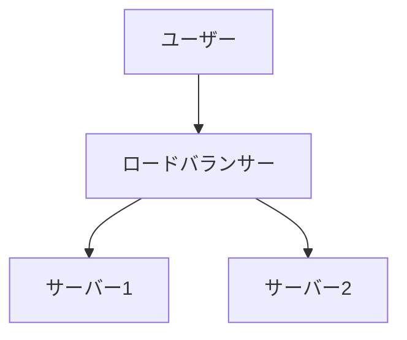

# Markdown Viewer

[English](README.en.md) · [简体中文](README.zh-CN.md) · [繁體中文](README.zh-TW.md) · [Русский](README.ru.md) · [日本語](README.ja.md) · [हिन्दी](README.hi.md) · [한국어](README.ko.md) · [Deutsch](README.de.md) · [Português (Brasil)](README.pt-BR.md) · [Português (Portugal)](README.pt-PT.md) · [Nederlands](README.nl.md) · [Українська](README.uk.md) · [Tiếng Việt](README.vi.md) · [Беларуская](README.be.md) · [Français](README.fr.md) · [Italiano](README.it.md) · [Bahasa Indonesia](README.id.md) · [Español](README.es.md) · [ไทย](README.th.md) · [Svenska](README.sv.md) · [Türkçe](README.tr.md) · [Eesti](README.et.md) · [Bahasa Melayu](README.ms.md) · [Polski](README.pl.md) · [Suomi](README.fi.md) · [Lietuvių](README.lt.md) · [Norsk](README.no.md) · [Dansk](README.da.md)

**Markdown をワンクリックで完璧な Word に — Mermaid、Graphviz、Vega、インフォグラフィック、LaTeX（編集可能）、コードハイライト、ローカル処理**

*完全無料 · 18+ のプロフェッショナルテーマ · 28 言語サポート*

🚀 **今すぐインストール:** https://chromewebstore.google.com/detail/markdown-viewer/jekhhoflgcfoikceikgeenibinpojaoi

---

Markdownで書くのが好きですよね。クリーンで効率的で、バージョン管理に優しい。  
でも最終的には、いつもWord文書が必要になります。

**以前の悪夢:**

😫 フローチャートを手動でスクリーンショット · 数式をコピーペーストすると乱れる · コードを手動でフォーマット · テーブルをセルごとに調整 · エクスポート後にフォント、間隔、色の調整に30分

**1つの文書：1時間の執筆、2時間のフォーマット。**

---

**今では1秒で完了。**

ダウンロードをクリックして完璧なWord文書を取得：
- ✅ Mermaidダイアグラム → 高解像度画像
- ✅ Graphviz DOTグラフ → 高解像度画像
- ✅ LaTeX数式 → Word編集可能な数式
- ✅ 自動構文ハイライト（100+言語）
- ✅ ワンクリックで18+プロフェッショナルテーマ
- ✅ 完全無料、ローカル処理

**執筆に時間を使い、フォーマットには使わない。**

---

## 💫 実際の動作を見る

### 技術文書：15個のフローチャート、2時間 → 5分

**以前:** draw.ioダイアグラム → PNG出力 → Wordに挿入 → サイズ変更 → 15回繰り返し = **2時間**

**今:** Mermaidコード記述 → ダウンロードクリック = **5分**

## システムアーキテクチャ

``````markdown

``````

変更が必要？コードを修正して再エクスポート。**115分節約。**

### 学術論文：50+数式、3時間 → 10分

**以前:** Word数式エディタで1つずつ OR 有料ツールのサブスクリプション = **3時間 + 有料サブスクリプション**

**今:** LaTeX構文を直接記述 → ダウンロードクリック = **10分 + 無料**

質点の質量を $m$、加速度を $a$ とすると、ニュートンの第二法則により：

```markdown
$$
F = ma = m\frac{dv}{dt} = m\frac{d^2x}{dt^2}
$$
```

ネイティブWordフォーマットでエクスポート、完全編集可能。**画像ではなく、本物の数式オブジェクト。**

### チームコラボレーション：週次レポート、1時間 → 1分

**以前:** コンテンツコピー → フォーマット設定 → リスト調整 → スタイル追加 → Excelチャート+スクリーンショット = **週1時間**

**今:** ファイルを開く → テーマ選択 → ダウンロードクリック = **1分**

「Business」テーマを選択、Vega-Liteデータチャートが自動的に高解像度画像に変換、プロフェッショナルな外観。**週59分節約。**

**ビジネスユースケース:**
- 📊 売上トレンド（折れ線グラフ）
- 📈 市場シェア比較（棒グラフ）
- 🎯 KPI達成（ゲージ）
- 📉 コスト分析（積み上げグラフ）

データに語らせ、ワンクリックでプロフェッショナルなレポートを生成。

---

## 🎯 3つのコア機能

### 1. 自動ダイアグラム変換

**Mermaidダイアグラム** · **Graphviz DOT** · **Vega/Vega-Liteデータチャート** · **Infographic** · SVG画像 · 複雑なHTMLテーブル

**Mermaid:** フローチャート、シーケンス図、クラス図、状態図 → 技術文書、アーキテクチャ設計  
**Graphviz DOT:** 有向グラフ/無向グラフ、ネットワークトポロジー、状態マシン → システムアーキテクチャ、依存分析  
**Vega/Vega-Lite:** 棒グラフ、折れ線グラフ、散布図、ヒートマップ → ビジネスレポート、データ分析  
**Infographic:** 統計チャート、インフォグラフィック、データ可視化 → データプレゼンテーション、ビジュアルストーリーテリング

**時間比較:** 複雑なシーケンス図（10オブジェクト）
- 従来のツール: 描画30分 + 修正20分 + 調整10分 + エクスポート5分 = **65分**
- Markdown Viewer: コード記述5分 + 修正30秒 + エクスポート1秒 = **6分**

**ビジネスシナリオ:** 四半期売上レポート（5つの棒グラフ）
- Excelチャート+スクリーンショット: データ選択15分 + フォーマット10分 + スクリーンショット5分 = **30分**
- Vega-Lite: JSONデータ2分 + ワンクリックエクスポート = **3分**

**正確、プロフェッショナル、再利用可能。**

### 2. 完璧な数式変換

LaTeX → Word編集可能な数式（画像ではありません！）

エクスポート後、以下が可能：
- ✅ Wordで編集を続ける
- ✅ フォントサイズを調整
- ✅ 記号と変数を修正
- ✅ 他の文書にコピー

**1つの数式、2つのアプローチ:**
- ❌ Word数式エディタ: クリック...クリック...クリック...記号を選択...位置を調整
- ✅ LaTeX: `\int_0^\infty e^{-x^2}dx` 完了

### 3. 18+プロフェッショナルテーマ

異なるシナリオ、異なるスタイル、ワンクリック切り替え：

- 📊 Business / Technical → ビジネスレポート、技術文書
- 📚 Academic / Palatino → 学術論文、書籍組版  
- 🇨🇳 Songti / Heiti / Mixed → 中国語文書
- 🎨 Typewriter / Sakura → クリエイティブコンテンツ

**WYSIWYG:** プレビューがエクスポートされたWordと完全に同じ。推測不要、試行不要。

**手動調整不要:** フォント、サイズ、行間、段落間隔、コード背景色...

---

## ⚡ 超高速体験

### スマートキャッシュ：初回5秒、2回目1秒

50個のMermaidダイアグラムを含む文書：
- **初回オープン:** テキストは即座に表示、ダイアグラムはバックグラウンドでレンダリング、5秒以内に完了
- **2回目オープン:** キャッシュから読み込み、即座に表示（<1秒）
- **テキスト修正:** 依然として即座（ダイアグラムはキャッシュから）
- **ダイアグラム修正:** 変更されたダイアグラムのみ再レンダリング

****Wordより10倍速く、ファイルサイズは100倍小さい。**

### 読書機能強化

- **3つのレイアウト:** 通常（1000px）/ フルスクリーン / 狭い（530px、Wordプレビュー効果）
- **柔軟なズーム:** 50%-400%、ショートカット `Ctrl/Cmd +` `-` `0`
- **スマート目次:** 見出しを自動抽出、サイドバーナビゲーション、`Ctrl/Cmd + B` で切り替え
- **位置記憶:** スクロール位置を自動保存、次回続きから読める
- **履歴:** 最近開いたドキュメントを追跡

---

## 🚀 クイックスタート - 3ステップ

### ステップ1: 拡張機能をインストール（30秒）

1. Chromeブラウザを開く
2. Chrome Web Storeにアクセス
3. "Markdown Viewer"を検索
4. 「Chromeに追加」をクリック
5. ✅ インストール完了

### ステップ2: ファイルアクセスを許可（1分）

**ローカル.mdファイルを開きたい場合:**

1. `chrome://extensions/`を開く
2. Markdown Viewerを見つける
3. 「ファイルのURLへのアクセスを許可する」を有効化
4. ✅ ローカルMarkdownファイルをダブルクリックで開けるようになりました

**不要な場合:**
- オンラインドキュメントのみ表示（GitHub、ブログなど）
- ブラウザの「ファイルを開く」機能を使用

### クイックスタート

**文書を開く:** .mdファイルをダブルクリック、またはブラウザにドラッグ · GitHubドキュメントは自動レンダリング

**Wordにエクスポート:** ダウンロードボタンをクリック または `Ctrl/Cmd + S` → 進行状況を確認 → 自動保存

**テーマを切り替え:** ツールバーをクリック → テーマを選択 → 即座に適用

**ビューを調整:** `+`/`-` ズーム · レイアウト切り替え · `Ctrl/Cmd + B` 目次

---

## 🎁 完全な機能

### 完全なMarkdown構文サポート

見出し · 段落 · 太字 · 斜体 · 取り消し線 · リスト · タスクリスト · 引用 · コードブロック（100+言語ハイライト）· テーブル · リンク · 画像 · Mermaidダイアグラム · Vega/Vega-Liteチャート · Infographicチャート · LaTeX数式 · HTML · GFM拡張

### 18テーマ

**ビジネス:** Default · Business · Technical  
**学術:** Academic  
**セリフ:** Palatino · Garamond · Cambria · Elegant  
**サンセリフ:** Verdana · Trebuchet · Century  
**中国語:** Songti · Heiti · Mixed  
**クリエイティブ:** Typewriter · Sakura · Water · Minimal

### 28のインターフェース言語

English · 简体中文 · 繁體中文 · Русский · 日本語 · हिन्दी · 한국어 · Deutsch · Português (Brasil) · Português (Portugal) · Nederlands · Українська · Tiếng Việt · Беларуская · Français · Italiano · Bahasa Indonesia · Español · ไทย · Svenska · Türkçe · Eesti · Bahasa Melayu · Polski · Suomi · Lietuvių · Norsk · Dansk

---

## 💎 競争優位性

|  | 手動スクリーンショット | CLIツール | オンラインサービス | デスクトップエディタ | Markdown Viewer |
|---|:---:|:---:|:---:|:---:|:---:|
| **使いやすさ** | 面倒 | セットアップ必要 | アップロード必要 | インストール必要 | ✅ ワンクリック |
| **Mermaid** | 手動スクリーンショット | プラグイン必要 | ✅ サポート | ✅ サポート | ✅ ネイティブサポート |
| **数学式** | 画像 | 画像 | 画像 | 画像 | ✅ 編集可能 |
| **プライバシー** | ✅ ローカル | ✅ ローカル | ❌ クラウドアップロード | ✅ ローカル | ✅ ローカル |
| **テーマ** | - | - | 3-5 | 5-10 | ✅ 18+ |
| **オフライン** | ✅ | ✅ | ❌ | ✅ | ✅ |
| **GitHub直接表示** | ❌ | ❌ | ❌ | ❌ | ✅ |
| **価格** | 無料 | 無料 | 有料プラン | 有料プラン | ✅ 無料 |

**コアアドバンテージ：より速く、より安く、より安全、より強力。**

---

## ❓ よくある質問

**Q: エクスポートされたWord文書は編集できますか？**  
A: はい。標準の.docx形式で、数式は編集可能で、画像ではありません。

**Q: どのようなダイアグラムがサポートされていますか？**  
A: すべてのMermaidダイアグラム（フローチャート、シーケンス、ガント、クラス、状態、円グラフ、ERなど）、Vega/Vega-Liteデータ可視化チャート、Infographic統計チャート + SVG自動変換。

**Q: ファイルサイズに制限はありますか？**  
A: 制限なし。スマートキャッシュで、100+ダイアグラムの文書も瞬時に開きます。

**Q: インターネットが必要ですか？**  
A: いいえ。完全にローカル処理、オフラインで動作します。

**Q: 文書はアップロードされますか？**  
A: 絶対にありません。すべての処理はローカルで行われます。

**Q: テーマを変更するには？**  
A: ツールバーアイコンをクリック → テーマを選択 → 即座に適用。

**Q: テーマをカスタマイズできますか？**  
A: 現在18のプリセットテーマ、カスタマイズは計画中です。

**Q: 大きな文書は遅くなりますか？**  
A: いいえ。プログレッシブローディング + スマートキャッシュで、テキストは即座に表示、ダイアグラムはバックグラウンドでレンダリング（初回5秒、2回目1秒）。

**Q: キャッシュは多くのスペースを使用しますか？**  
A: デフォルトで最大1000項目、約500 MB、設定で調整または削除可能。

**Q: どのブラウザがサポートされていますか？**  
A: ChromeおよびChromiumベースのブラウザ（Edge、Brave、Opera）。

**Q: エクスポートされたファイルはどのWordバージョンで開けますか？**  
A: Word 2016+完全サポート、Word 2013も動作します。WPS Officeと完全互換。

**Q: PDFにエクスポートできますか？**  
A: 現在Wordのみ、PDF対応を計画中。まずWordにエクスポートしてからPDFとして保存できます。

**Q: どのテーマが適していますか？**  
A: ビジネスレポート → Business · 学術論文 → Academic · 技術文書 → Technical · 中国語文書 → Songti/Mixed

**Q: VegaとMermaidの違いは何ですか？**  
A: **Mermaid**はフローチャート、アーキテクチャ図などの図式的なダイアグラム用；**Vega/Vega-Lite**は売上チャート、財務レポートなどのデータ駆動型ビジネスチャートのためのデータ可視化用。異なるシナリオで補完し合います。

**Q: Vega-Liteでチャートを作成するには？**  
A: Markdownで````vega-lite`コードブロックを使用し、JSON形式のチャート仕様を記述します。[Vega-Lite公式例](https://vega.github.io/vega-lite/examples/)を参照。

---

## 🔒 プライバシーの約束

- ✅ すべての処理はローカルで完了、絶対にアップロードしません
- ✅ トラッキングなし、個人データ収集なし
- ✅ オープンソースコード、監査可能で透明
- ✅ Chrome Web Storeセキュリティ承認済み（Manifest V3）

**あなたのプライバシーは100%保護されています。**

---

## 🆘 ヘルプを得る

📖 [完全ドキュメント](https://github.com/xicilion/markdown-viewer-extension) · 🐛 [問題を報告](https://github.com/xicilion/markdown-viewer-extension/issues) · 💡 [機能リクエスト](https://github.com/xicilion/markdown-viewer-extension/issues) · ⭐ [GitHub Star](https://github.com/xicilion/markdown-viewer-extension)

---

## 🎉 今すぐ始める

**30秒でインストール、すぐに使用開始:**

1. Chrome Web Storeにアクセス → "Markdown Viewer"を検索
2. 「Chromeに追加」をクリック
3. 「拡張機能を管理」をクリック、「ファイルのURLへのアクセスを許可する」を有効化
4. `.md`ファイルをブラウザにドラッグ
5. ✅ 使用開始

**得られるもの:** Markdown → Wordワンクリック変換 · Mermaid自動変換 · LaTeX編集可能数式 · 100+言語構文ハイライト · 18+テーマ · スマートキャッシュ · 完全無料

**最適な対象:** 技術ライター · 学生/研究者 · プロダクトマネージャー · 開発者 · Markdownを使用するすべての人

---

## 📜 オープンソースライセンス

このプロジェクトはISCライセンスの下でオープンソースです。Starの歓迎、問題報告、機能提案、コード貢献。

**プロジェクトURL:** https://github.com/xicilion/markdown-viewer-extension

---

**フォーマットに時間を無駄にしないでください**

**執筆に集中し、他のすべてはMarkdown Viewerに任せてください**

🚀 **今すぐインストール:** https://chromewebstore.google.com/detail/markdown-viewer/jekhhoflgcfoikceikgeenibinpojaoi

*完全無料 · ローカル処理 · プライバシー保護*
