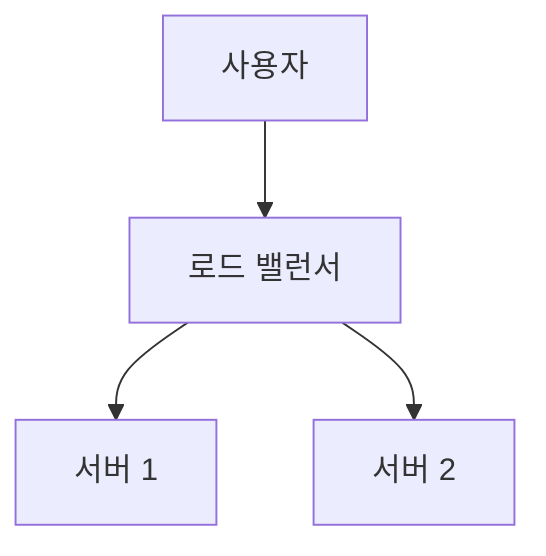

# Markdown Viewer

[简体中文](README.zh-CN.md) · [繁體中文](README.zh-TW.md) · [English](README.en.md) · [Русский](README.ru.md) · [日本語](README.ja.md) · [한국어](README.ko.md) · [Português (Brasil)](README.pt-BR.md) · [Português (Portugal)](README.pt-PT.md) · [Español](README.es.md) · [Deutsch](README.de.md) · [Français](README.fr.md) · [Українська](README.uk.md) · [Tiếng Việt](README.vi.md) · [Italiano](README.it.md) · [Türkçe](README.tr.md) · [Bahasa Indonesia](README.id.md) · [Lietuvių](README.lt.md) · [Nederlands](README.nl.md) · [Suomi](README.fi.md) · [ไทย](README.th.md) · [Polski](README.pl.md) · [हिन्दी](README.hi.md) · [Svenska](README.sv.md) · [Norsk](README.no.md) · [Dansk](README.da.md)

**Markdown으로 작성하고, 클릭 한 번으로 완벽한 Word 문서로 내보내기.**

*완전 무료 · 로컬 처리 · 18+ 전문 테마 · 25개 언어 지원*

🚀 **지금 설치:** https://chromewebstore.google.com/detail/markdown-viewer/jekhhoflgcfoikceikgeenibinpojaoi

---

여러분은 Markdown으로 글쓰기를 좋아합니다 — 깔끔하고, 효율적이며, 버전 관리 친화적입니다.  
하지만 결국, 항상 Word 문서가 필요합니다.

**과거의 악몽:**

😫 순서도를 수동으로 스크린샷 · 복사-붙여넣기한 수식이 엉망이 됨 · 코드를 수동으로 포맷 · 표를 셀별로 조정 · 내보낸 후 글꼴, 간격, 색상을 조정하는 데 또 30분 소요

**하나의 문서: 작성 1시간, 포맷팅 2시간.**

---

**이제는 단 1초면 됩니다.**

다운로드를 클릭하면 완벽한 Word 문서를 얻습니다:
- ✅ Mermaid 다이어그램 → 고해상도 이미지
- ✅ Graphviz DOT 그래프 → 고해상도 이미지
- ✅ LaTeX 수식 → Word 편집 가능한 수식
- ✅ 자동 구문 강조 (100+ 언어)
- ✅ 클릭 한 번으로 18+ 전문 테마
- ✅ 완전 무료, 로컬 처리

**작성에 시간을 쓰고, 포맷팅에는 쓰지 마세요.**

---

## 💫 실제 동작 확인하기

### 기술 문서: 15개 순서도, 2시간 → 5분

**이전:** draw.io 다이어그램 → PNG 내보내기 → Word에 삽입 → 크기 조정 → 15번 반복 = **2시간**

**지금:** Mermaid 코드 작성 → 다운로드 클릭 = **5분**

## 시스템 아키텍처

``````markdown

``````

변경이 필요한가요? 코드를 수정하고 다시 내보내기. **115분 절약.**

### 학술 논문: 50+ 수식, 3시간 → 10분

**이전:** Word 수식 편집기로 하나씩 입력 또는 유료 도구 구독 = **3시간 + 유료 구독**

**지금:** LaTeX 구문을 직접 작성 → 다운로드 클릭 = **10분 + 무료**

질량 $m$과 가속도 $a$가 주어졌을 때, 뉴턴의 제2법칙에 따라:

```markdown
$$
F = ma = m\frac{dv}{dt} = m\frac{d^2x}{dt^2}
$$
```

네이티브 Word 형식으로 내보내기, 완전히 편집 가능. **이미지가 아니라 실제 수식 객체입니다.**

### 팀 협업: 주간 보고서, 1시간 → 1분

**이전:** 콘텐츠 복사 → 형식 설정 → 목록 조정 → 스타일 추가 → Excel 차트 + 스크린샷 = **주당 1시간**

**지금:** 파일 열기 → 테마 선택 → 다운로드 클릭 = **1분**

"Business" 테마를 선택하면, Vega-Lite 데이터 차트가 고해상도 이미지로 자동 변환되어 전문적인 모습을 갖춥니다. **주당 59분 절약.**

**비즈니스 사용 사례:**
- 📊 판매 추세 (선 차트)
- 📈 시장 점유율 비교 (막대 차트)
- 🎯 KPI 달성률 (게이지)
- 📉 비용 분석 (누적 차트)

데이터로 말하고, 클릭 한 번으로 전문 보고서를 생성하세요.

---

## 🎯 세 가지 핵심 기능

### 1. 자동 다이어그램 변환

**Mermaid 다이어그램** · **Graphviz DOT** · **Vega/Vega-Lite 데이터 차트** · **Infographic** · SVG 이미지 · 복잡한 HTML 테이블

**Mermaid:** 순서도, 시퀀스 다이어그램, 클래스 다이어그램, 상태 다이어그램 → 기술 문서, 아키텍처 설계  
**Graphviz DOT:** 방향/무방향 그래프, 네트워크 토폴로지, 상태 머신 → 시스템 아키텍처, 의존성 분석  
**Vega/Vega-Lite:** 막대 차트, 선 차트, 산점도, 히트맵 → 비즈니스 보고서, 데이터 분석  
**Infographic:** 통계 차트, 인포그래픽, 데이터 시각화 → 데이터 프레젠테이션, 비주얼 스토리텔링

**시간 비교:** 복잡한 시퀀스 다이어그램 (10개 객체)
- 기존 도구: 그리기 30분 + 수정 20분 + 조정 10분 + 내보내기 5분 = **65분**
- Markdown Viewer: 코드 작성 5분 + 수정 30초 + 내보내기 1초 = **6분**

**비즈니스 시나리오:** 분기별 판매 보고서 (5개 막대 차트)
- Excel 차트 + 스크린샷: 데이터 선택 15분 + 포맷 10분 + 스크린샷 5분 = **30분**
- Vega-Lite: JSON 데이터 2분 + 원클릭 내보내기 = **3분**

**정확하고, 전문적이며, 재사용 가능합니다.**

### 2. 완벽한 수식 변환

LaTeX → Word 편집 가능한 수식 (이미지가 아닙니다!)

내보낸 후 다음을 할 수 있습니다:
- ✅ Word에서 계속 편집
- ✅ 글꼴 크기 조정
- ✅ 기호와 변수 수정
- ✅ 다른 문서에 복사

**하나의 수식, 두 가지 접근법:**
- ❌ Word 수식 편집기: 클릭...클릭...클릭...기호 선택...위치 조정
- ✅ LaTeX: `\int_0^\infty e^{-x^2}dx` 완료

### 3. 18+ 전문 테마

다양한 시나리오, 다양한 스타일, 원클릭 전환:

- 📊 Business / Technical → 비즈니스 보고서, 기술 문서
- 📚 Academic / Palatino → 학술 논문, 책 조판  
- 🇨🇳 Songti / Heiti / Mixed → 중국어 문서
- 🎨 Typewriter / Sakura → 창의적인 콘텐츠

**WYSIWYG:** 미리보기가 내보낸 Word와 정확히 같습니다. 추측도, 시행착오도 없습니다.

**더 이상 수동 조정 필요 없음:** 글꼴, 크기, 줄 간격, 단락 간격, 코드 배경색...

---

## ⚡ 초고속 경험

### 스마트 캐시: 첫 번째 5초, 두 번째 1초

50개의 Mermaid 다이어그램이 있는 문서:
- **첫 번째 열기:** 텍스트가 즉시 표시되고, 다이어그램은 백그라운드에서 렌더링, 5초 내에 모두 완료
- **두 번째 열기:** 캐시에서 로드, 즉시 표시 (<1초)
- **텍스트 수정:** 여전히 즉시 (캐시에서 다이어그램 로드)
- **다이어그램 수정:** 변경된 다이어그램만 다시 렌더링

**Word보다 10배 빠르고, 파일은 100배 작습니다.**

### 읽기 향상

- **세 가지 레이아웃:** 일반 (1000px) / 전체 화면 / 좁음 (530px, Word 효과 미리보기)
- **유연한 확대/축소:** 50%-400%, 단축키 `Ctrl/Cmd +` `-` `0`
- **스마트 목차:** 제목 자동 추출, 사이드바 탐색, `Ctrl/Cmd + B`로 토글
- **위치 기억:** 스크롤 위치 자동 저장, 다음에 계속 읽기
- **기록:** 최근 연 문서 추적

---

## 🚀 빠른 시작 - 3단계

### 1단계: 확장 프로그램 설치 (30초)

1. Chrome 브라우저 열기
2. Chrome 웹 스토어 방문
3. "Markdown Viewer" 검색
4. "Chrome에 추가" 클릭
5. ✅ 설치 완료

### 2단계: 파일 액세스 허용 (1분)

**로컬 .md 파일을 열고 싶다면:**

1. `chrome://extensions/` 열기
2. Markdown Viewer 찾기
3. "파일 URL에 대한 액세스 허용" 활성화
4. ✅ 이제 로컬 Markdown 파일을 더블클릭으로 열 수 있습니다

**필요하지 않은 경우:**
- 온라인 문서만 보기 (GitHub, 블로그 등)
- 브라우저의 "파일 열기" 기능 사용

### 빠른 시작

**문서 열기:** .md 파일을 더블클릭하거나 브라우저로 드래그 · GitHub 문서 자동 렌더링

**Word로 내보내기:** 다운로드 버튼 클릭 또는 `Ctrl/Cmd + S` → 진행 상황 확인 → 자동 저장

**테마 전환:** 도구 모음 클릭 → 테마 선택 → 즉시 적용

**보기 조정:** `+`/`-` 확대/축소 · 레이아웃 전환 · `Ctrl/Cmd + B` 목차

---

## 🎁 완전한 기능

### 전체 Markdown 구문 지원

제목 · 단락 · 굵게 · 기울임꼴 · 취소선 · 목록 · 작업 목록 · 인용 · 코드 블록 (100+ 언어 강조) · 표 · 링크 · 이미지 · Mermaid 다이어그램 · Vega / Vega-Lite 차트 · Infographic 차트 · LaTeX 수식 · HTML · GFM 확장

### 18개 테마

**비즈니스:** Default · Business · Technical  
**학술:** Academic  
**세리프:** Palatino · Garamond · Cambria · Elegant  
**산세리프:** Verdana · Trebuchet · Century  
**중국어:** Songti · Heiti · Mixed  
**창의적:** Typewriter · Sakura · Water · Minimal

### 25개 인터페이스 언어

简体中文 · 繁體中文 · English · Русский · 日本語 · 한국어 · Português (Brasil) · Português (Portugal) · Español · Deutsch · Français · Українська · Tiếng Việt · Italiano · Türkçe · Bahasa Indonesia · Lietuvių · Nederlands · Suomi · ไทย · Polski · हिन्दी · Svenska · Norsk · Dansk

---

## 💎 경쟁 우위

|  | 수동 스크린샷 | CLI 도구 | 온라인 서비스 | 데스크톱 편집기 | Markdown Viewer |
|---|:---:|:---:|:---:|:---:|:---:|
| **사용 편의성** | 번거로움 | 설정 필요 | 업로드 필요 | 설치 필요 | ✅ 원클릭 |
| **Mermaid** | 수동 스크린샷 | 플러그인 필요 | ✅ 지원 | ✅ 지원 | ✅ 기본 지원 |
| **수학 수식** | 이미지 | 이미지 | 이미지 | 이미지 | ✅ 편집 가능 |
| **프라이버시** | ✅ 로컬 | ✅ 로컬 | ❌ 클라우드 업로드 | ✅ 로컬 | ✅ 로컬 |
| **테마 수** | - | - | 3-5개 | 5-10개 | ✅ 18+개 |
| **오프라인** | ✅ | ✅ | ❌ | ✅ | ✅ |
| **GitHub 직접 보기** | ❌ | ❌ | ❌ | ❌ | ✅ |
| **가격** | 무료 | 무료 | 유료 플랜 | 유료 플랜 | ✅ 무료 |

**핵심 우위: 더 빠르고, 더 저렴하며, 더 안전하고, 더 강력합니다.**

---

## ❓ 자주 묻는 질문

**Q: 내보낸 Word 문서를 편집할 수 있나요?**  
A: 예. 표준 .docx 형식이며, 수학 수식은 편집 가능하고 이미지가 아닙니다.

**Q: 어떤 다이어그램을 지원하나요?**  
A: 모든 Mermaid 다이어그램 (순서도, 시퀀스, 간트, 클래스, 상태, 파이, ER 등), Vega / Vega-Lite 데이터 시각화 차트, Infographic 통계 차트 + SVG 자동 변환.

**Q: 파일 크기 제한이 있나요?**  
A: 제한 없음. 스마트 캐시로 100+ 다이어그램 문서도 즉시 열립니다.

**Q: 인터넷이 필요한가요?**  
A: 아니요. 완전히 로컬 처리, 오프라인 작동.

**Q: 문서가 업로드되나요?**  
A: 절대 안 됩니다. 모든 처리는 로컬에서 완료됩니다.

**Q: 테마를 어떻게 전환하나요?**  
A: 도구 모음 아이콘 클릭 → 테마 선택 → 즉시 적용.

**Q: 테마를 사용자 정의할 수 있나요?**  
A: 현재 18개 프리셋 테마 제공, 사용자 정의 기능은 곧 제공 예정.

**Q: 큰 문서가 느려지나요?**  
A: 아니요. 점진적 로딩 + 스마트 캐시로 텍스트는 즉시 표시되고, 다이어그램은 백그라운드에서 렌더링 (첫 번째 5초, 두 번째 1초).

**Q: 캐시가 많은 공간을 차지하나요?**  
A: 기본값 최대 1000개 항목, 약 500MB, 설정에서 조정하거나 지울 수 있습니다.

**Q: 어떤 브라우저를 지원하나요?**  
A: Chrome 및 Chromium 기반 브라우저 (Edge, Brave, Opera).

**Q: 내보낸 Word 파일을 어떤 버전에서 열 수 있나요?**  
A: Word 2016+ 완벽 지원, Word 2013도 작동. WPS Office와 완전 호환.

**Q: PDF로 내보낼 수 있나요?**  
A: 현재 Word만 가능, PDF는 계획 중. Word로 내보낸 후 PDF로 저장할 수 있습니다.

**Q: 어떤 테마가 저에게 맞나요?**  
A: 비즈니스 보고서 → Business · 학술 논문 → Academic · 기술 문서 → Technical · 중국어 문서 → Songti/Mixed

**Q: Vega와 Mermaid의 차이점은 무엇인가요?**  
A: **Mermaid**는 순서도, 아키텍처 다이어그램 등 개략도에 적합하고, **Vega/Vega-Lite**는 판매 차트, 재무 보고서 등 실제 데이터 기반 비즈니스 차트의 데이터 시각화에 적합합니다. 서로 보완하여 다양한 시나리오를 커버합니다.

**Q: Vega-Lite로 차트를 어떻게 만드나요?**  
A: A: Markdown에서 ````vega-lite` 코드 블록을 사용하고 JSON 형식의 차트 사양을 작성합니다. [Vega-Lite 공식 예제](https://vega.github.io/vega-lite/examples/)를 참조하세요.

---

## 🔒 개인정보 보호 약속

- ✅ 모든 처리는 로컬에서 완료, 절대 업로드하지 않음
- ✅ 추적 없음, 개인 데이터 수집 없음
- ✅ 오픈 소스 코드, 감사 가능하고 투명함
- ✅ Chrome 웹 스토어 보안 승인 (Manifest V3)

**귀하의 개인정보는 100% 보호됩니다.**

---

## 🆘 도움 받기

📖 [전체 문서](https://github.com/xicilion/markdown-viewer-extension) · 🐛 [문제 보고](https://github.com/xicilion/markdown-viewer-extension/issues) · 💡 [기능 제안](https://github.com/xicilion/markdown-viewer-extension/issues) · ⭐ [GitHub 지원](https://github.com/xicilion/markdown-viewer-extension)

---

## 🎉 지금 시작하기

**30초 설치, 즉시 경험:**

1. Chrome 웹 스토어 방문 → "Markdown Viewer" 검색
2. 「Chrome에 추가」 클릭
3. 「확장 프로그램 관리」 클릭, 「파일 URL에 대한 액세스 허용」 활성화
4. `.md` 파일을 브라우저로 드래그
5. ✅ 사용 시작

**얻을 수 있는 것:** Markdown → Word 원클릭 변환 · Mermaid 자동 변환 · LaTeX 편집 가능 수식 · 100+ 언어 코드 강조 · 18+ 테마 · 스마트 캐시 · 완전 무료

**적합한 대상:** 기술 작성자 · 학생/연구원 · 제품 관리자 · 개발자 · Markdown을 사용하는 모든 사람

---

## 📜 오픈 소스 라이선스

이 프로젝트는 ISC 라이선스로 오픈 소스입니다. Star로 지원하고, 문제를 보고하고, 제안하고, 코드를 기여해 주세요.

**프로젝트 주소:** https://github.com/xicilion/markdown-viewer-extension

---

**더 이상 포맷 조정에 시간을 낭비하지 마세요**

**작성에 집중하고, 나머지는 Markdown Viewer에 맡기세요**

🚀 **지금 설치:** https://chromewebstore.google.com/detail/markdown-viewer/jekhhoflgcfoikceikgeenibinpojaoi

*완전 무료 · 로컬 처리 · 개인정보 보호*
