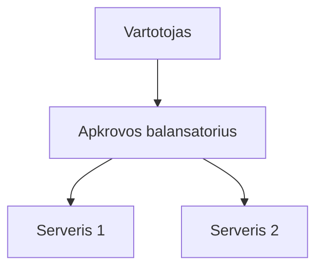

# Markdown Viewer

[English](README.en.md) · [简体中文](README.zh-CN.md) · [繁體中文](README.zh-TW.md) · [Русский](README.ru.md) · [日本語](README.ja.md) · [हिन्दी](README.hi.md) · [한국어](README.ko.md) · [Deutsch](README.de.md) · [Português (Brasil)](README.pt-BR.md) · [Português (Portugal)](README.pt-PT.md) · [Nederlands](README.nl.md) · [Українська](README.uk.md) · [Tiếng Việt](README.vi.md) · [Беларуская](README.be.md) · [Français](README.fr.md) · [Italiano](README.it.md) · [Bahasa Indonesia](README.id.md) · [Español](README.es.md) · [ไทย](README.th.md) · [Svenska](README.sv.md) · [Türkçe](README.tr.md) · [Eesti](README.et.md) · [Bahasa Melayu](README.ms.md) · [Polski](README.pl.md) · [Suomi](README.fi.md) · [Lietuvių](README.lt.md) · [Norsk](README.no.md) · [Dansk](README.da.md)

**Markdown į tobulą Word vienu spustelėjimu — Mermaid, Graphviz, Vega, infografika, LaTeX (redaguojamas), kodo paryškinimas, vietinis apdorojimas**

*Visiškai nemokama · 18+ profesionalių temų · 28 kalbų palaikymas*

🚀 **Install Now:** https://chromewebstore.google.com/detail/markdown-viewer/jekhhoflgcfoikceikgeenibinpojaoi

---

Jums patinka rašyti Markdown formatu — švaru, efektyvu ir patogu versijų kontrolei.  
Tačiau galiausiai vis tiek prireikia Word dokumento.

**Senas košmaras:**

😫 Diagramas daryti su ekrano nuotraukomis · Formulės po kopijavimo išsikraipo · Kodą formatuoti ranka · Lenteles derinti langelis po langelio · Po eksporto dar 30 min tvarkyti šriftus, tarpus ir spalvas

**Vienas dokumentas: 1 val. rašymo, 2 val. formatavimo.**

---

**Dabar užtenka 1 sekundės.**

Paspauskite atsisiuntimą ir gaukite tvarkingą Word dokumentą:
- ✅ Mermaid diagramos → aukštos raiškos vaizdai
- ✅ Graphviz DOT grafai → aukštos raiškos vaizdai
- ✅ LaTeX formulės → redaguojamos Word lygtys
- ✅ Automatinis sintaksės paryškinimas (100+ kalbų)
- ✅ 18+ profesionalių temų vienu paspaudimu
- ✅ Visiškai nemokama, vietinis apdorojimas

**Skirkite laiką turiniui, o ne formatavimui.**

---

## 💫 Pamatykite veikiant

### Techninė dokumentacija: 15 schemų, 2 valandos → 5 minutės

**Anksčiau:** draw.io diagrama → Eksportuoti PNG → Įterpti į Word → Pakeisti dydį → Pakartoti 15 kartų = **2 valandos**

**Dabar:** Parašykite Mermaid kodą → Paspauskite atsisiųsti = **5 minutės**

## Sistemos architektūra

``````markdown

``````

Reikia pakeitimų? Modifikuokite kodą ir eksportuokite iš naujo. **Sutaupote 115 minučių.**

### Mokslinis straipsnis: 50+ formulių, 3 valandos → 10 minučių

**Anksčiau:** Word formulių redaktorius po vieną ARBA mokama prenumerata = **3 valandos + Mokama prenumerata**

**Dabar:** Rašykite LaTeX sintaksę tiesiogiai → Paspauskite atsisiųsti = **10 minučių + Nemokamai**

Esant masei $m$ ir pagreičiui $a$, pagal antrąjį Niutono dėsnį:

```markdown
$$
F = ma = m\frac{dv}{dt} = m\frac{d^2x}{dt^2}
$$
```

Eksportuokite natyviu Word formatu, pilnai redaguojama. **Tai ne paveikslėlis, o tikras formulės objektas.**

### Komandinis darbas: savaitinės ataskaitos, 1 valanda → 1 minutė

**Anksčiau:** Kopijuoti turinį → Nustatyti formatą → Koreguoti sąrašus → Pridėti stilių → Excel diagramos + ekrano nuotraukos = **1 valanda kas savaitę**

**Dabar:** Atidaryti failą → Pasirinkti temą → Paspausti atsisiųsti = **1 minutė**

Pasirinkite „Business" temą, Vega-Lite duomenų diagramos automatiškai konvertuojamos į aukštos raiškos vaizdus, profesionali išvaizda. **Sutaupote 59 minutes kas savaitę.**

**Verslo scenarijai:**
- 📊 Pardavimų tendencijos (linijinės diagramos)
- 📈 Rinkos dalies palyginimas (stulpelinės diagramos)
- 🎯 KPI pasiekimai (matuokliai)
- 📉 Išlaidų analizė (sudėtinės diagramos)

Tegul duomenys kalba patys, generuokite profesionalias ataskaitas vienu paspaudimu.

---

## 🎯 Trys pagrindinės funkcijos

### 1. Automatinis diagramų konvertavimas

**Mermaid diagramos** · **Graphviz DOT** · **Vega/Vega-Lite duomenų diagramos** · **Infografika** · SVG vaizdai · Sudėtingos HTML lentelės

**Mermaid:** Srautų schemos, sekų diagramos, klasių diagramos, būsenų diagramos → Techninė dokumentacija, architektūros projektavimas  
**Graphviz DOT:** Kryptiniai/nekryptiniai grafai, tinklo topologija, būsenų mašinos → Sistemos architektūra, priklausomybių analizė  
**Vega/Vega-Lite:** Stulpelinės, linijinės, taškinės diagramos, šilumos žemėlapiai → Verslo ataskaitos, duomenų analitika  
**Infografika:** Statistinės diagramos, infografika, duomenų vizualizacija → Duomenų pristatymas, vizualinis pasakojimas

**Laiko palyginimas:** Sudėtinga sekų diagrama (10 objektų)
- Tradiciniai įrankiai: Piešti 30min + Modifikuoti 20min + Koreguoti 10min + Eksportuoti 5min = **65 minutės**
- Markdown Viewer: Parašyti kodą 5min + Modifikuoti 30s + Eksportuoti 1s = **6 minutės**

**Verslo scenarijus:** Ketvirčio pardavimų ataskaita (5 stulpelinės diagramos)
- Excel diagramos + ekrano nuotraukos: Pasirinkti duomenis 15min + Formatuoti 10min + Ekrano nuotraukos 5min = **30 minučių**
- Vega-Lite: JSON duomenys 2min + Eksportuoti vienu paspaudimu = **3 minutės**

**Tiksliai, profesionaliai, pakartotinai naudojama.**

### 2. Tobulas formulių konvertavimas

LaTeX → Word redaguojamos lygtys (ne paveikslėliai!)

Po eksportavimo galite:
- ✅ Tęsti redagavimą Word'e
- ✅ Koreguoti šrifto dydį
- ✅ Modifikuoti simbolius ir kintamuosius
- ✅ Kopijuoti į kitus dokumentus

**Viena formulė, du būdai:**
- ❌ Word lygčių redaktorius: Spausti...spausti...spausti...pasirinkti simbolius...koreguoti pozicijas
- ✅ LaTeX: `\int_0^\infty e^{-x^2}dx` Atlikta

### 3. 18+ profesionalių temų

Skirtingi scenarijai, skirtingi stiliai, perjungimas vienu paspaudimu:

- 📊 Business / Technical → Verslo ataskaitos, techninė dokumentacija
- 📚 Academic / Palatino → Moksliniai straipsniai, knygų maketavimas  
- 🇨🇳 Songti / Heiti / Mixed → Kiniški dokumentai
- 🎨 Typewriter / Sakura → Kūrybinis turinys

**WYSIWYG:** Peržiūra atrodo tiksliai kaip eksportuotas Word. Jokių spėlionių, jokių bandymų.

**Daugiau jokių rankinio koregavimo:** Šriftas, dydis, eilučių tarpai, pastraipų tarpai, kodo fonas...

---

## ⚡ Žaibiškai greita patirtis

### Išmani talpykla: pirmą kartą 5s, antrą kartą 1s

Dokumentas su 50 Mermaid diagramų:
- **Pirmas atidarymas:** Tekstas rodomas akimirksniu, diagramos renderinamos fone, viskas paruošta per 5s
- **Antras atidarymas:** Įkelti iš talpyklos, akimirksniu rodoma (<1s)
- **Tekstas modifikuotas:** Vis dar akimirksniu (diagramos iš talpyklos)
- **Diagrama modifikuota:** Tik pakeista diagrama renderinama iš naujo

**10x greičiau nei Word, 100x mažesni failai.**

### Skaitymo patobulinimas

- **Trys išdėstymai:** Įprastas (1000px) / Visas ekranas / Siauras (530px, Word peržiūros efektas)
- **Lankstus mastelis:** 50%-400%, spartieji klavišai `Ctrl/Cmd +` `-` `0`
- **Išmanus turinys:** Automatinis antraščių ištraukimas, šoninė navigacija, `Ctrl/Cmd + B` perjungti
- **Pozicijos atmintis:** Automatinis slinkties pozicijos išsaugojimas, tęsti skaitymą kitą kartą
- **Istorija:** Sekti neseniai atidarytus dokumentus

---

## 🚀 Greita pradžia – 3 žingsniai

### 1 žingsnis: Įdiekite plėtinį (30 sekundžių)

1. Atidarykite Chrome naršyklę
2. Apsilankykite Chrome Web Store
3. Ieškokite „Markdown Viewer"
4. Paspauskite „Pridėti prie Chrome"
5. ✅ Diegimas baigtas

### 2 žingsnis: Leiskite prieigą prie failų (1 minutė)

**Jei norite atidaryti vietinius .md failus:**

1. Atidarykite `chrome://extensions/`
2. Raskite Markdown Viewer
3. Įjunkite „Leisti prieigą prie failų URL"
4. ✅ Dabar galite dukart spustelėti, kad atidarytumėte vietinius Markdown failus

**Nereikia, jei:**
- Tik žiūrite internetinius dokumentus (GitHub, tinklaraščiai ir kt.)
- Naudojate naršyklės „Atidaryti failą" funkciją

### Greita pradžia

**Atidaryti dokumentus:** Dukart spustelėkite .md failus arba vilkite į naršyklę · GitHub dokumentai automatiškai renderinami

**Eksportuoti į Word:** Paspauskite atsisiuntimo mygtuką arba `Ctrl/Cmd + S` → Stebėkite progresą → Automatinis išsaugojimas

**Pakeisti temą:** Paspauskite įrankių juostą → Pasirinkite temą → Pritaikoma akimirksniu

**Koreguoti vaizdą:** `+`/`-` mastelis · Išdėstymo perjungimas · `Ctrl/Cmd + B` turinys

---

## 🎁 Pilnas funkcionalumas

### Pilnas Markdown sintaksės palaikymas

Antraštės · Pastraipos · Pusjuodis · Kursyvas · Perbrauktas · Sąrašai · Užduočių sąrašai · Citatos · Kodo blokai (100+ kalbų paryškinimas) · Lentelės · Nuorodos · Vaizdai · Mermaid diagramos · Vega / Vega-Lite diagramos · Infografikos diagramos · LaTeX formulės · HTML · GFM plėtiniai

### 18 temų

**Verslas:** Default · Business · Technical  
**Akademinis:** Academic  
**Serifai:** Palatino · Garamond · Cambria · Elegant  
**Be serifų:** Verdana · Trebuchet · Century  
**Kiniški:** Songti · Heiti · Mixed  
**Kūrybiniai:** Typewriter · Sakura · Water · Minimal

### 28 sąsajos kalbos

English · 简体中文 · 繁體中文 · Русский · 日本語 · हिन्दी · 한국어 · Deutsch · Português (Brasil) · Português (Portugal) · Nederlands · Українська · Tiếng Việt · Беларуская · Français · Italiano · Bahasa Indonesia · Español · ไทย · Svenska · Türkçe · Eesti · Bahasa Melayu · Polski · Suomi · Lietuvių · Norsk · Dansk

---

## 💎 Konkurenciniai pranašumai

|  | Rankinės ekrano nuotraukos | CLI įrankiai | Internetinės paslaugos | Darbalaukio redaktoriai | Markdown Viewer |
|---|:---:|:---:|:---:|:---:|:---:|
| **Paprastumas** | Varginantis | Reikia nustatyti | Reikia įkelti | Reikia įdiegti | ✅ Vienas paspaudimas |
| **Mermaid** | Rankinė ekrano nuotrauka | Reikia papildinio | ✅ Palaikoma | ✅ Palaikoma | ✅ Natyvus palaikymas |
| **Formulės** | Vaizdai | Vaizdai | Vaizdai | Vaizdai | ✅ Redaguojamos |
| **Privatumas** | ✅ Vietinis | ✅ Vietinis | ❌ Įkėlimas į debesis | ✅ Vietinis | ✅ Vietinis |
| **Temos** | - | - | 3-5 | 5-10 | ✅ 18+ |
| **Neprisijungus** | ✅ | ✅ | ❌ | ✅ | ✅ |
| **GitHub peržiūra** | ❌ | ❌ | ❌ | ❌ | ✅ |
| **Kaina** | Nemokama | Nemokama | Mokami planai | Mokami planai | ✅ Nemokama |

**Pagrindinis pranašumas: Greičiau, pigiau, saugiau, galingiau.**

---

## ❓ DUK

**Q: Ar galiu redaguoti eksportuotą Word dokumentą?**  
A: Taip. Standartinis .docx formatas, matematinės formulės redaguojamos, ne vaizdai.

**Q: Kokios diagramos palaikomos?**  
A: Visos Mermaid diagramos (srautų schema, seka, Gantt, klasė, būsena, skritulinė, ER ir kt.), Vega / Vega-Lite duomenų vizualizacijos diagramos, Infographic statistinės diagramos + SVG automatinis konvertavimas.

**Q: Ar yra failo dydžio limitas?**  
A: Jokių limitų. Išmani talpykla, dokumentai su 100+ diagramų atsidaro akimirksniu.

**Q: Ar reikia interneto?**  
A: Ne. Visiškai vietinis apdorojimas, veikia neprisijungus.

**Q: Ar mano dokumentai bus įkelti?**  
A: Niekada. Visas apdorojimas vyksta vietoje.

**Q: Kaip pakeisti temą?**  
A: Paspauskite įrankių juostos piktogramą → Pasirinkite temą → Pritaikoma akimirksniu.

**Q: Ar galiu pritaikyti temas?**  
A: Šiuo metu 18 iš anksto nustatytų temų, pritaikymas netrukus.

**Q: Ar dideli dokumentai veiks lėtai?**  
A: Ne. Progresyvus įkėlimas + išmani talpykla, tekstas rodomas akimirksniu, diagramos renderinamos fone (pirmą kartą 5s, antrą kartą 1s).

**Q: Ar talpykla užima daug vietos?**  
A: Numatytas maksimumas 1000 elementų, apytiksliai 500 MB, galima koreguoti arba išvalyti nustatymuose.

**Q: Kokios naršyklės palaikomos?**  
A: Chrome ir Chromium pagrįstos naršyklės (Edge, Brave, Opera).

**Q: Kurios Word versijos gali atidaryti eksportuotą failą?**  
A: Word 2016+ pilnai palaikomas, Word 2013 taip pat veikia. Pilnai suderinama su WPS Office.

**Q: Ar galiu eksportuoti į PDF?**  
A: Šiuo metu tik Word, PDF planuojamas. Galite eksportuoti į Word, tada išsaugoti kaip PDF.

**Q: Kuri tema man tinka?**  
A: Verslo ataskaitos → Business · Moksliniai straipsniai → Academic · Techninė dokumentacija → Technical · Kiniški dokumentai → Songti/Mixed

**Q: Koks skirtumas tarp Vega ir Mermaid?**  
A: **Mermaid** skirtas srautų schemoms, architektūros diagramoms ir kitoms schematinėms diagramoms; **Vega/Vega-Lite** skirtas duomenų vizualizacijai, tokiai kaip pardavimų diagramos, finansinės ataskaitos ir kitos duomenimis paremtos verslo diagramos. Jos papildo viena kitą skirtinguose scenarijuose.

**Q: Kaip sukurti diagramas su Vega-Lite?**  
A: Naudokite ````vega-lite` kodo bloką Markdown su JSON formato diagramos specifikacija. Žiūrėkite [oficialius Vega-Lite pavyzdžius](https://vega.github.io/vega-lite/examples/).

---

## 🔒 Privatumo įsipareigojimas

- ✅ Visas apdorojimas vyksta vietoje, niekada neįkeliamas
- ✅ Jokio sekimo, jokio asmeninių duomenų rinkimo
- ✅ Atvirojo kodo, audituojamas ir skaidrus
- ✅ Chrome Web Store saugumo patvirtintas (Manifest V3)

**Jūsų privatumas 100% apsaugotas.**

---

## 🆘 Gauti pagalbą

📖 [Pilna dokumentacija](https://github.com/xicilion/markdown-viewer-extension) · 🐛 [Pranešti apie problemą](https://github.com/xicilion/markdown-viewer-extension/issues) · 💡 [Funkcijų užklausos](https://github.com/xicilion/markdown-viewer-extension/issues) · ⭐ [GitHub Star](https://github.com/xicilion/markdown-viewer-extension)

---

## 🎉 Pradėkite dabar

**Įdiekite per 30 sekundžių, pradėkite naudoti iš karto:**

1. Apsilankykite Chrome Web Store → Ieškokite „Markdown Viewer"
2. Paspauskite „Pridėti prie Chrome"
3. Paspauskite „Tvarkyti plėtinius", įjunkite „Leisti prieigą prie failų URL"
4. Vilkite `.md` failus į naršyklę
5. ✅ Pradėkite naudoti

**Jūs gausite:** Markdown → Word konvertavimas vienu paspaudimu · Automatinis Mermaid konvertavimas · Redaguojamos LaTeX formulės · 100+ kalbų sintaksės paryškinimas · 18+ temų · Išmani talpykla · Visiškai nemokama

**Puikiai tinka:** Techniniams rašytojams · Studentams/tyrėjams · Produktų vadybininkams · Programuotojams · Visiems, naudojantiems Markdown

---

## 📜 Atvirojo kodo licencija

Šis projektas yra atvirojo kodo pagal ISC licenciją. Kviečiame pridėti Star, pranešti apie problemas, siūlyti funkcijas ir prisidėti prie kodo.

**Projekto URL:** https://github.com/xicilion/markdown-viewer-extension

---

**Nustokite gaišti laiką formatavimui**

**Susikoncentruokite į rašymą, leiskite Markdown Viewer pasirūpinti viskuo kitu**

🚀 **Įdiegti dabar:** https://chromewebstore.google.com/detail/markdown-viewer/jekhhoflgcfoikceikgeenibinpojaoi

*Visiškai nemokama · Vietinis apdorojimas · Privatumas apsaugotas*
