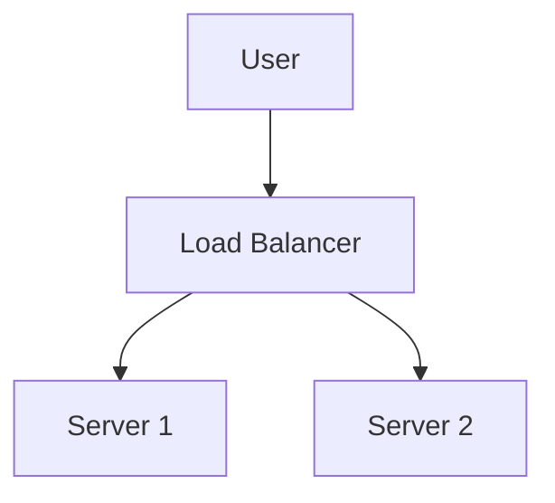

# Markdown Viewer

[English](README.en.md) · [简体中文](README.zh-CN.md) · [繁體中文](README.zh-TW.md) · [Русский](README.ru.md) · [日本語](README.ja.md) · [हिन्दी](README.hi.md) · [한국어](README.ko.md) · [Deutsch](README.de.md) · [Português (Brasil)](README.pt-BR.md) · [Português (Portugal)](README.pt-PT.md) · [Nederlands](README.nl.md) · [Українська](README.uk.md) · [Tiếng Việt](README.vi.md) · [Беларуская](README.be.md) · [Français](README.fr.md) · [Italiano](README.it.md) · [Bahasa Indonesia](README.id.md) · [Español](README.es.md) · [ไทย](README.th.md) · [Svenska](README.sv.md) · [Türkçe](README.tr.md) · [Eesti](README.et.md) · [Bahasa Melayu](README.ms.md) · [Polski](README.pl.md) · [Suomi](README.fi.md) · [Lietuvių](README.lt.md) · [Norsk](README.no.md) · [Dansk](README.da.md)

**Markdown ke Word sempurna dengan satu klik — Mermaid, Graphviz, Vega, infografik, LaTeX (boleh diedit), penyerlahan kod, pemprosesan tempatan**

*Sepenuhnya percuma · 18+ tema profesional · Sokongan 28 bahasa*

🚀 **Install Now:** https://chromewebstore.google.com/detail/markdown-viewer/jekhhoflgcfoikceikgeenibinpojaoi

---

Anda suka menulis dalam Markdown — bersih, cekap, mesra kawalan versi.  
Tetapi akhirnya, anda sentiasa memerlukan dokumen Word.

**Mimpi ngeri lama:**

😫 Tangkapan skrin carta alir secara manual · Salin-tampal formula jadi berselerak · Format kod dengan tangan · Laraskan jadual sel demi sel · Habis 30 minit lagi untuk mengubah fon, jarak, dan warna selepas eksport

**Satu dokumen: 1 jam menulis, 2 jam memformat.**

---

**Sekarang hanya ambil 1 saat.**

Klik untuk muat turun dan dapatkan dokumen Word yang sempurna:
- ✅ Gambar rajah Mermaid → Imej resolusi tinggi
- ✅ Graf Graphviz DOT → Imej resolusi tinggi
- ✅ Formula LaTeX → Persamaan Word boleh diedit
- ✅ Penyorotan sintaks automatik (100+ bahasa)
- ✅ 18+ tema profesional dengan satu klik
- ✅ Percuma sepenuhnya, pemprosesan tempatan

**Luangkan masa untuk menulis, bukan memformat.**

---

## 💫 Lihat Dalam Tindakan

### Dokumentasi Teknikal: 15 Carta Alir, 2 Jam → 5 Minit

**Sebelum:** Gambar rajah draw.io → Eksport PNG → Masukkan ke Word → Ubah saiz → Ulang 15 kali = **2 jam**

**Sekarang:** Tulis kod Mermaid → Klik muat turun = **5 minit**

## Seni Bina Sistem

``````markdown

``````

Perlu perubahan? Ubah suai kod dan eksport semula. **Jimat 115 minit.**

### Kertas Akademik: 50+ Formula, 3 Jam → 10 Minit

**Sebelum:** Editor persamaan Word satu per satu ATAU langganan alat berbayar = **3 jam + Langganan berbayar**

**Sekarang:** Tulis sintaks LaTeX terus → Klik muat turun = **10 minit + Percuma**

Diberi jisim $m$ dan pecutan $a$, mengikut hukum kedua Newton:

```markdown
$$
F = ma = m\frac{dv}{dt} = m\frac{d^2x}{dt^2}
$$
```

Eksport sebagai format Word asli, boleh diedit sepenuhnya. **Bukan imej, tetapi objek persamaan sebenar.**

### Kolaborasi Pasukan: Laporan Mingguan, 1 Jam → 1 Minit

**Sebelum:** Salin kandungan → Tetapkan format → Laraskan senarai → Tambah gaya → Carta Excel + tangkapan skrin = **1 jam setiap minggu**

**Sekarang:** Buka fail → Pilih tema → Klik muat turun = **1 minit**

Pilih tema "Business", carta data Vega-Lite auto-tukar ke imej resolusi tinggi, penampilan profesional. **Jimat 59 minit setiap minggu.**

**Kes penggunaan perniagaan:**
- 📊 Trend jualan (carta garis)
- 📈 Perbandingan bahagian pasaran (carta bar)
- 🎯 Pencapaian KPI (tolok)
- 📉 Analisis kos (carta bertindan)

Biarkan data bercakap, jana laporan profesional dengan satu klik.

---

## 🎯 Tiga Ciri Teras

### 1. Penukaran Gambar Rajah Automatik

**Gambar Rajah Mermaid** · **Graphviz DOT** · **Carta Data Vega/Vega-Lite** · **Infographic** · Imej SVG · Jadual HTML kompleks

**Mermaid:** Carta alir, gambar rajah urutan, gambar rajah kelas, gambar rajah keadaan → Dokumen teknikal, reka bentuk seni bina  
**Graphviz DOT:** Graf berarah/tidak berarah, topologi rangkaian, mesin keadaan → Seni bina sistem, analisis kebergantungan  
**Vega/Vega-Lite:** Carta bar, carta garis, plot serakan, peta haba → Laporan perniagaan, analitik data  
**Infographic:** Carta statistik, infografik, visualisasi data → Persembahan data, penceritaan visual

**Perbandingan masa:** Gambar rajah urutan kompleks (10 objek)
- Alat tradisional: Lukis 30min + Ubah suai 20min + Laraskan 10min + Eksport 5min = **65 minit**
- Markdown Viewer: Tulis kod 5min + Ubah suai 30sec + Eksport 1sec = **6 minit**

**Senario perniagaan:** Laporan jualan suku tahunan (5 carta bar)
- Carta Excel + tangkapan skrin: Pilih data 15min + Format 10min + Tangkapan skrin 5min = **30 minit**
- Vega-Lite: Data JSON 2min + Eksport satu klik = **3 minit**

**Tepat, profesional, boleh guna semula.**

### 2. Penukaran Formula Sempurna

LaTeX → Persamaan Word boleh diedit (bukan imej!)

Selepas eksport, anda boleh:
- ✅ Terus mengedit dalam Word
- ✅ Laraskan saiz fon
- ✅ Ubah suai simbol dan pembolehubah
- ✅ Salin ke dokumen lain

**Satu formula, dua pendekatan:**
- ❌ Editor persamaan Word: Klik...klik...klik...pilih simbol...laraskan kedudukan
- ✅ LaTeX: `\int_0^\infty e^{-x^2}dx` Selesai

### 3. 18+ Tema Profesional

Senario berbeza, gaya berbeza, tukar dengan satu klik:

- 📊 Business / Technical → Laporan perniagaan, dokumen teknikal
- 📚 Academic / Palatino → Kertas akademik, tipografi buku  
- 🇨🇳 Songti / Heiti / Mixed → Dokumen Cina
- 🎨 Typewriter / Sakura → Kandungan kreatif

**WYSIWYG:** Pratonton kelihatan tepat seperti Word yang dieksport. Tiada tekaan, tiada percubaan.

**Tiada lagi pelarasan manual:** Fon, saiz, jarak baris, jarak perenggan, latar belakang kod...

---

## ⚡ Pengalaman Pantas Seperti Kilat

### Cache Pintar: Kali Pertama 5s, Kali Kedua 1s

Dokumen dengan 50 gambar rajah Mermaid:
- **Buka pertama:** Teks dipaparkan serta-merta, gambar rajah dirender di latar belakang, semua selesai dalam 5s
- **Buka kedua:** Muat dari cache, paparan segera (<1s)
- **Teks diubah suai:** Masih segera (gambar rajah dari cache)
- **Gambar rajah diubah suai:** Hanya render semula gambar rajah yang berubah

**10x lebih pantas daripada Word, 100x fail lebih kecil.**

### Peningkatan Pembacaan

- **Tiga reka letak:** Biasa (1000px) / Skrin penuh / Sempit (530px, pratonton kesan Word)
- **Zum fleksibel:** 50%-400%, pintasan `Ctrl/Cmd +` `-` `0`
- **TOC pintar:** Auto-ekstrak tajuk, navigasi bar sisi, `Ctrl/Cmd + B` untuk togol
- **Ingatan kedudukan:** Auto-simpan kedudukan skrol, teruskan membaca kali seterusnya
- **Sejarah:** Jejaki dokumen yang dibuka baru-baru ini

---

## 🚀 Mula Pantas - 3 Langkah

### Langkah 1: Pasang Sambungan (30 saat)

1. Buka pelayar Chrome
2. Lawati Chrome Web Store
3. Cari "Markdown Viewer"
4. Klik "Add to Chrome"
5. ✅ Pemasangan selesai

### Langkah 2: Benarkan Akses Fail (1 minit)

**Jika anda ingin membuka fail .md tempatan:**

1. Buka `chrome://extensions/`
2. Cari Markdown Viewer
3. Dayakan "Allow access to file URLs"
4. ✅ Sekarang anda boleh klik dua kali untuk membuka fail Markdown tempatan

**Tidak diperlukan jika:**
- Hanya melihat dokumen dalam talian (GitHub, blog, dll.)
- Menggunakan fungsi "Open File" pelayar

### Mula Pantas

**Buka dokumen:** Klik dua kali fail .md, atau seret ke pelayar · Dokumen GitHub auto-render

**Eksport ke Word:** Klik butang muat turun atau `Ctrl/Cmd + S` → Lihat kemajuan → Auto-simpan

**Tukar tema:** Klik bar alat → Pilih tema → Guna serta-merta

**Laraskan paparan:** `+`/`-` zum · Tukar reka letak · `Ctrl/Cmd + B` TOC

---

## 🎁 Ciri Lengkap

### Sokongan Sintaks Markdown Penuh

Tajuk · Perenggan · Tebal · Italik · Garis lorek · Senarai · Senarai tugas · Petikan blok · Blok kod (100+ bahasa ditonjolkan) · Jadual · Pautan · Imej · Gambar rajah Mermaid · Carta Vega / Vega-Lite · Carta Infographic · Formula LaTeX · HTML · Sambungan GFM

### 18 Tema

**Perniagaan:** Default · Business · Technical  
**Akademik:** Academic  
**Serif:** Palatino · Garamond · Cambria · Elegant  
**Sans-serif:** Verdana · Trebuchet · Century  
**Cina:** Songti · Heiti · Mixed  
**Kreatif:** Typewriter · Sakura · Water · Minimal

### 28 bahasa antara muka

English · 简体中文 · 繁體中文 · Русский · 日本語 · हिन्दी · 한국어 · Deutsch · Português (Brasil) · Português (Portugal) · Nederlands · Українська · Tiếng Việt · Беларуская · Français · Italiano · Bahasa Indonesia · Español · ไทย · Svenska · Türkçe · Eesti · Bahasa Melayu · Polski · Suomi · Lietuvių · Norsk · Dansk

---

## 💎 Kelebihan Kompetitif

|  | Tangkapan Skrin Manual | Alat CLI | Perkhidmatan Dalam Talian | Editor Desktop | Markdown Viewer |
|---|:---:|:---:|:---:|:---:|:---:|
| **Kemudahan Penggunaan** | Memenatkan | Perlu setup | Perlu muat naik | Perlu pasang | ✅ Satu klik |
| **Mermaid** | Tangkapan skrin manual | Perlu plugin | ✅ Disokong | ✅ Disokong | ✅ Sokongan asli |
| **Formula Matematik** | Imej | Imej | Imej | Imej | ✅ Boleh diedit |
| **Privasi** | ✅ Tempatan | ✅ Tempatan | ❌ Muat naik awan | ✅ Tempatan | ✅ Tempatan |
| **Tema** | - | - | 3-5 | 5-10 | ✅ 18+ |
| **Luar Talian** | ✅ | ✅ | ❌ | ✅ | ✅ |
| **Paparan Terus GitHub** | ❌ | ❌ | ❌ | ❌ | ✅ |
| **Harga** | Percuma | Percuma | Pelan berbayar | Pelan berbayar | ✅ Percuma |

**Kelebihan teras: Lebih pantas, lebih murah, lebih selamat, lebih berkuasa.**

---

## ❓ FAQ

**S: Bolehkah saya mengedit dokumen Word yang dieksport?**  
J: Ya. Format .docx standard, formula matematik boleh diedit, bukan imej.

**S: Gambar rajah mana yang disokong?**  
J: Semua gambar rajah Mermaid (carta alir, urutan, gantt, kelas, keadaan, pai, ER, dll.), carta visualisasi data Vega / Vega-Lite, carta statistik Infographic + penukaran auto SVG.

**S: Adakah had saiz fail?**  
J: Tiada had. Cache pintar, dokumen dengan 100+ gambar rajah dibuka serta-merta.

**S: Adakah ia memerlukan internet?**  
J: Tidak. Pemprosesan tempatan sepenuhnya, berfungsi luar talian.

**S: Adakah dokumen saya akan dimuat naik?**  
J: Tidak sama sekali. Semua pemprosesan berlaku secara tempatan.

**S: Bagaimana untuk tukar tema?**  
J: Klik ikon bar alat → Pilih tema → Guna serta-merta.

**S: Bolehkah saya menyesuaikan tema?**  
J: Pada masa ini 18 tema praset, penyesuaian akan datang tidak lama lagi.

**S: Adakah dokumen besar akan lag?**  
J: Tidak. Pemuatan progresif + cache pintar, teks dipaparkan serta-merta, gambar rajah dirender di latar belakang (pertama 5s, kedua 1s).

**S: Adakah cache mengambil banyak ruang?**  
J: Lalai maksimum 1000 item, kira-kira 500 MB, boleh dilaraskan atau dibersihkan dalam tetapan.

**S: Pelayar mana yang disokong?**  
J: Chrome dan pelayar berasaskan Chromium (Edge, Brave, Opera).

**S: Versi Word mana yang boleh membuka fail yang dieksport?**  
J: Word 2016+ disokong sepenuhnya, Word 2013 juga berfungsi. Serasi sepenuhnya dengan WPS Office.

**S: Bolehkah saya eksport ke PDF?**  
J: Pada masa ini Word sahaja, PDF dirancang. Anda boleh eksport ke Word kemudian simpan sebagai PDF.

**S: Tema mana yang sesuai untuk saya?**  
J: Laporan perniagaan → Business · Kertas akademik → Academic · Dokumen teknikal → Technical · Dokumen Cina → Songti/Mixed

**S: Apakah perbezaan antara Vega dan Mermaid?**  
J: **Mermaid** adalah untuk carta alir, gambar rajah seni bina, dan gambar rajah skematik lain; **Vega/Vega-Lite** adalah untuk visualisasi data seperti carta jualan, laporan kewangan, dan carta perniagaan berasaskan data lain. Mereka saling melengkapi untuk senario yang berbeza.

**S: Bagaimana untuk mencipta carta dengan Vega-Lite?**  
J: Gunakan blok kod ````vega-lite` dalam Markdown dengan spesifikasi carta format JSON. Lihat [contoh rasmi Vega-Lite](https://vega.github.io/vega-lite/examples/).

---

## 🔒 Komitmen Privasi

- ✅ Semua pemprosesan dilakukan secara tempatan, tidak pernah dimuat naik
- ✅ Tiada penjejakan, tiada pengumpulan data peribadi
- ✅ Kod sumber terbuka, boleh diaudit dan telus
- ✅ Kelulusan keselamatan Chrome Web Store (Manifest V3)

**Privasi anda dilindungi 100%.**

---

## 🆘 Dapatkan Bantuan

📖 [Dokumentasi Lengkap](https://github.com/xicilion/markdown-viewer-extension) · 🐛 [Laporkan Isu](https://github.com/xicilion/markdown-viewer-extension/issues) · 💡 [Permintaan Ciri](https://github.com/xicilion/markdown-viewer-extension/issues) · ⭐ [GitHub Star](https://github.com/xicilion/markdown-viewer-extension)

---

## 🎉 Mula Sekarang

**Pasang dalam 30 saat, mula guna serta-merta:**

1. Lawati Chrome Web Store → Cari "Markdown Viewer"
2. Klik "Add to Chrome"
3. Klik "Manage Extensions" , Dayakan "Allow access to file URLs"
4. Seret fail `.md` ke pelayar
5. ✅ Mula guna

**Anda akan dapat:** Markdown → Word penukaran satu klik · Mermaid auto-tukar · Formula LaTeX boleh diedit · 100+ bahasa penyorotan sintaks · 18+ tema · Cache pintar · Percuma sepenuhnya

**Sempurna untuk:** Penulis teknikal · Pelajar/penyelidik · Pengurus produk · Pembangun · Sesiapa yang menggunakan Markdown

---

## 📜 Lesen Sumber Terbuka

Projek ini adalah sumber terbuka di bawah lesen ISC. Selamat datang untuk Star, laporkan isu, cadangkan ciri, dan sumbangkan kod.

**URL Projek:** https://github.com/xicilion/markdown-viewer-extension

---

**Berhenti membazir masa untuk memformat**

**Fokus pada penulisan, biarkan Markdown Viewer menguruskan yang lain**

🚀 **Pasang Sekarang:** https://chromewebstore.google.com/detail/markdown-viewer/jekhhoflgcfoikceikgeenibinpojaoi

*Percuma Sepenuhnya · Pemprosesan Tempatan · Privasi Dilindungi*
