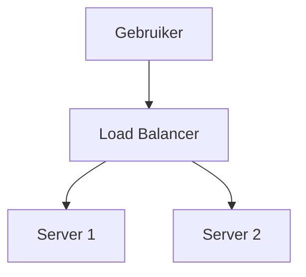

# Markdown Viewer

[English](README.en.md) · [简体中文](README.zh-CN.md) · [繁體中文](README.zh-TW.md) · [Русский](README.ru.md) · [日本語](README.ja.md) · [हिन्दी](README.hi.md) · [한국어](README.ko.md) · [Deutsch](README.de.md) · [Português (Brasil)](README.pt-BR.md) · [Português (Portugal)](README.pt-PT.md) · [Nederlands](README.nl.md) · [Українська](README.uk.md) · [Tiếng Việt](README.vi.md) · [Беларуская](README.be.md) · [Français](README.fr.md) · [Italiano](README.it.md) · [Bahasa Indonesia](README.id.md) · [Español](README.es.md) · [ไทย](README.th.md) · [Svenska](README.sv.md) · [Türkçe](README.tr.md) · [Eesti](README.et.md) · [Bahasa Melayu](README.ms.md) · [Polski](README.pl.md) · [Suomi](README.fi.md) · [Lietuvių](README.lt.md) · [Norsk](README.no.md) · [Dansk](README.da.md)

**Markdown naar perfect Word met één klik — Mermaid, Graphviz, Vega, infographic, LaTeX (bewerkbaar), code-accentuering, lokale verwerking**

*Volledig gratis · 18+ professionele thema's · 28 talen*

🚀 **Installeer nu:** https://chromewebstore.google.com/detail/markdown-viewer/jekhhoflgcfoikceikgeenibinpojaoi

---

Je houdt van schrijven in Markdown — schoon, efficiënt, versiebeheer-vriendelijk.  
Maar uiteindelijk heb je altijd een Word-document nodig.

**De oude nachtmerrie:**

😫 Handmatige screenshots van stroomdiagrammen · Gekopieerde formules worden rommelig · Code handmatig formatteren · Tabellen cel voor cel aanpassen · Nog eens 30 minuten besteden aan het aanpassen van lettertypen, afstand en kleuren na export

**Eén document: 1 uur schrijven, 2 uur formatteren.**

---

**Nu duurt het slechts 1 seconde.**

Klik om te downloaden en krijg een perfect Word-document:
- ✅ Mermaid-diagrammen → Afbeeldingen met hoge resolutie
- ✅ Graphviz DOT-grafen → Afbeeldingen met hoge resolutie
- ✅ LaTeX-formules → Bewerkbare Word-vergelijkingen
- ✅ Automatische syntaxismarkering (100+ talen)
- ✅ 18+ professionele thema's met één klik
- ✅ Volledig gratis, lokale verwerking

**Besteed tijd aan schrijven, niet aan formatteren.**

---

## 💫 Zie het in actie

### Technische documentatie: 15 stroomdiagrammen, 2 uur → 5 minuten

**Voorheen:** draw.io diagram → PNG exporteren → In Word invoegen → Formaat wijzigen → 15 keer herhalen = **2 uur**

**Nu:** Mermaid-code schrijven → Klik downloaden = **5 minuten**

## Systeemarchitectuur

``````markdown

``````

Wijzigingen nodig? Wijzig code en exporteer opnieuw. **Bespaar 115 minuten.**

### Academisch artikel: 50+ formules, 3 uur → 10 minuten

**Voorheen:** Word-vergelijkingseditor één voor één OF betaald hulpmiddel-abonnement = **3 uur + Betaald abonnement**

**Nu:** LaTeX-syntaxis direct schrijven → Klik downloaden = **10 minuten + Gratis**

Gegeven massa $m$ en versnelling $a$, volgens de tweede wet van Newton:

```markdown
$$
F = ma = m\frac{dv}{dt} = m\frac{d^2x}{dt^2}
$$
```

Exporteren als native Word-formaat, volledig bewerkbaar. **Geen afbeelding, maar een echt vergelijkingsobject.**

### Teamsamenwerking: Wekelijkse rapporten, 1 uur → 1 minuut

**Voorheen:** Inhoud kopiëren → Formaat instellen → Lijsten aanpassen → Styling toevoegen → Excel-grafieken + screenshots = **1 uur per week**

**Nu:** Bestand openen → Thema kiezen → Klik downloaden = **1 minuut**

Kies het "Business"-thema, Vega-Lite datagrafieken worden automatisch geconverteerd naar afbeeldingen met hoge resolutie, professionele uitstraling. **Bespaar 59 minuten per week.**

**Zakelijke use cases:**
- 📊 Verkooptrends (lijngrafieken)
- 📈 Marktaandeelvergelijking (staafdiagrammen)
- 🎯 KPI-prestaties (meters)
- 📉 Kostenanalyse (gestapelde diagrammen)

Laat data spreken, genereer professionele rapporten met één klik.

---

## 🎯 Drie kernfuncties

### 1. Automatische diagramconversie

**Mermaid-diagrammen** · **Graphviz DOT** · **Vega/Vega-Lite datagrafieken** · **Infographic** · SVG-afbeeldingen · Complexe HTML-tabellen

**Mermaid:** Stroomdiagrammen, sequentiediagrammen, klassediagrammen, toestandsdiagrammen → Technische documentatie, architectuurontwerp  
**Graphviz DOT:** Gerichte/ongerichte grafen, netwerktopologie, toestandsmachines → Systeemarchitectuur, afhankelijkheidsanalyse  
**Vega/Vega-Lite:** Staafdiagrammen, lijngrafieken, spreidingsdiagrammen, heatmaps → Zakelijke rapporten, data-analyse  
**Infographic:** Statistische grafieken, infographics, datavisualisatie → Datapresentatie, visueel verhalen vertellen

**Tijdvergelijking:** Complex sequentiediagram (10 objecten)
- Traditionele hulpmiddelen: Tekenen 30min + Wijzigen 20min + Aanpassen 10min + Exporteren 5min = **65 minuten**
- Markdown Viewer: Code schrijven 5min + Wijzigen 30sec + Exporteren 1sec = **6 minuten**

**Zakelijk scenario:** Kwartaalverkooprapport (5 staafdiagrammen)
- Excel-grafieken + screenshots: Data selecteren 15min + Formatteren 10min + Screenshot 5min = **30 minuten**
- Vega-Lite: JSON-data 2min + Eén klik exporteren = **3 minuten**

**Nauwkeurig, professioneel, herbruikbaar.**

### 2. Perfecte formuleconversie

LaTeX → Bewerkbare Word-vergelijkingen (geen afbeeldingen!)

Na export kunt u:
- ✅ Blijven bewerken in Word
- ✅ Lettergrootte aanpassen
- ✅ Symbolen en variabelen wijzigen
- ✅ Kopiëren naar andere documenten

**Eén formule, twee benaderingen:**
- ❌ Word vergelijkingseditor: Klik...klik...klik...symbolen selecteren...posities aanpassen
- ✅ LaTeX: `\int_0^\infty e^{-x^2}dx` Klaar

### 3. 18+ professionele thema's

Verschillende scenario's, verschillende stijlen, één klik wisselen:

- 📊 Business / Technical → Zakelijke rapporten, technische documentatie
- 📚 Academic / Palatino → Academische artikelen, boektypografie  
- 🇨🇳 Songti / Heiti / Mixed → Chinese documenten
- 🎨 Typewriter / Sakura → Creatieve inhoud

**WYSIWYG:** Voorbeeldweergave ziet er precies zo uit als geëxporteerd Word. Geen gissen, geen testen.

**Geen handmatige aanpassingen meer:** Lettertype, grootte, regelafstand, alinea-afstand, code-achtergrond...

---

## ⚡ Bliksemsnelle ervaring

### Slimme cache: Eerste keer 5s, tweede keer 1s

Document met 50 Mermaid-diagrammen:
- **Eerste keer openen:** Tekst wordt direct weergegeven, diagrammen worden op de achtergrond weergegeven, alles binnen 5s voltooid
- **Tweede keer openen:** Laden uit cache, directe weergave (<1s)
- **Tekst gewijzigd:** Nog steeds direct (diagrammen uit cache)
- **Diagram gewijzigd:** Alleen gewijzigde diagrammen opnieuw weergeven

**10x sneller dan Word, 100x kleinere bestanden.**

### Leesverbetering

- **Drie lay-outs:** Normaal (1000px) / Volledig scherm / Smal (530px, voorbeeld Word-effect)
- **Flexibele zoom:** 50%-400%, sneltoetsen `Ctrl/Cmd +` `-` `0`
- **Slimme inhoudsopgave:** Automatisch koppen extraheren, zijbalknavigatie, `Ctrl/Cmd + B` om te schakelen
- **Positiegeheugen:** Scrollpositie automatisch opslaan, volgende keer verder lezen
- **Geschiedenis:** Recent geopende documenten bijhouden

---

## 🚀 Snelstart - 3 stappen

### Stap 1: Extensie installeren (30 seconden)

1. Open Chrome-browser
2. Bezoek Chrome Web Store
3. Zoek "Markdown Viewer"
4. Klik "Toevoegen aan Chrome"
5. ✅ Installatie voltooid

### Stap 2: Bestandstoegang toestaan (1 minuut)

**Als u lokale .md-bestanden wilt openen:**

1. Open `chrome://extensions/`
2. Zoek Markdown Viewer
3. Schakel "Toegang tot bestands-URL's toestaan" in
4. ✅ Nu kunt u dubbelklikken om lokale Markdown-bestanden te openen

**Niet nodig als:**
- Alleen online documentatie bekijken (GitHub, blogs, enz.)
- Gebruik van de "Bestand openen"-functie van de browser

### Snel starten

**Documenten openen:** Dubbelklik op .md-bestanden, of sleep naar browser · GitHub-documenten automatisch weergegeven

**Exporteren naar Word:** Klik downloadknop of `Ctrl/Cmd + S` → Zie voortgang → Automatisch opslaan

**Thema's wisselen:** Klik werkbalk → Kies thema → Direct toepassen

**Weergave aanpassen:** `+`/`-` zoom · Lay-out wisselen · `Ctrl/Cmd + B` inhoudsopgave

---

## 🎁 Volledige functies

### Volledige ondersteuning voor Markdown-syntaxis

Koppen · Alinea's · Vet · Cursief · Doorhalen · Lijsten · Takenlijsten · Citaten · Codeblokken (100+ talen gemarkeerd) · Tabellen · Links · Afbeeldingen · Mermaid-diagrammen · Vega / Vega-Lite grafieken · Infographic grafieken · LaTeX-formules · HTML · GFM-extensies

### 18 thema's

**Zakelijk:** Default · Business · Technical  
**Academisch:** Academic  
**Serif:** Palatino · Garamond · Cambria · Elegant  
**Sans-serif:** Verdana · Trebuchet · Century  
**Chinees:** Songti · Heiti · Mixed  
**Creatief:** Typewriter · Sakura · Water · Minimal

### 28 interfacetalen

English · 简体中文 · 繁體中文 · Русский · 日本語 · हिन्दी · 한국어 · Deutsch · Português (Brasil) · Português (Portugal) · Nederlands · Українська · Tiếng Việt · Беларуская · Français · Italiano · Bahasa Indonesia · Español · ไทย · Svenska · Türkçe · Eesti · Bahasa Melayu · Polski · Suomi · Lietuvių · Norsk · Dansk

---

## 💎 Concurrentievoordelen

|  | Handmatige screenshots | CLI-hulpmiddelen | Online diensten | Desktop-editors | Markdown Viewer |
|---|:---:|:---:|:---:|:---:|:---:|
| **Gebruiksgemak** | Vervelend | Setup nodig | Upload nodig | Installatie nodig | ✅ Één klik |
| **Mermaid** | Handmatige screenshot | Plugin nodig | ✅ Ondersteund | ✅ Ondersteund | ✅ Native ondersteuning |
| **Wiskundige formules** | Afbeeldingen | Afbeeldingen | Afbeeldingen | Afbeeldingen | ✅ Bewerkbaar |
| **Privacy** | ✅ Lokaal | ✅ Lokaal | ❌ Cloud-upload | ✅ Lokaal | ✅ Lokaal |
| **Thema's** | - | - | 3-5 | 5-10 | ✅ 18+ |
| **Offline** | ✅ | ✅ | ❌ | ✅ | ✅ |
| **GitHub directe weergave** | ❌ | ❌ | ❌ | ❌ | ✅ |
| **Prijs** | Gratis | Gratis | Betaalde plannen | Betaalde plannen | ✅ Gratis |

**Kernvoordeel: Sneller, goedkoper, veiliger, krachtiger.**

---

## ❓ Veelgestelde vragen

**V: Kan ik het geëxporteerde Word-document bewerken?**  
A: Ja. Standaard .docx-formaat, wiskundige formules zijn bewerkbaar, geen afbeeldingen.

**V: Welke diagrammen worden ondersteund?**  
A: Alle Mermaid-diagrammen (stroomdiagram, sequentie, gantt, klasse, toestand, taart, ER, enz.), Vega / Vega-Lite datavisualisatiegrafieken, Infographic statistische grafieken + SVG automatische conversie.

**V: Is er een bestandsgroottelimiet?**  
A: Geen limiet. Slimme cache, documenten met 100+ diagrammen openen direct.

**V: Is internet vereist?**  
A: Nee. Volledig lokale verwerking, werkt offline.

**V: Worden mijn documenten geüpload?**  
A: Nooit. Alle verwerking gebeurt lokaal.

**V: Hoe wissel ik van thema?**  
A: Klik werkbalkpictogram → Selecteer thema → Direct toepassen.

**V: Kan ik thema's aanpassen?**  
A: Momenteel 18 vooraf ingestelde thema's, aanpassing komt binnenkort.

**V: Vertragen grote documenten?**  
A: Nee. Progressief laden + slimme cache, tekst wordt direct weergegeven, diagrammen worden op de achtergrond weergegeven (eerste 5s, tweede 1s).

**V: Neemt cache veel ruimte in beslag?**  
A: Standaard maximaal 1000 items, ongeveer 500 MB, aanpasbaar of wisbaarbaar in instellingen.

**V: Welke browsers worden ondersteund?**  
A: Chrome en op Chromium gebaseerde browsers (Edge, Brave, Opera).

**V: Welke Word-versies kunnen het geëxporteerde bestand openen?**  
A: Word 2016+ volledig ondersteund, Word 2013 werkt ook. Volledig compatibel met WPS Office.

**V: Kan ik exporteren naar PDF?**  
A: Momenteel alleen Word, PDF is gepland. U kunt exporteren naar Word en vervolgens opslaan als PDF.

**V: Welk thema past bij mij?**  
A: Zakelijke rapporten → Business · Academische artikelen → Academic · Technische documentatie → Technical · Chinese documenten → Songti/Mixed

**V: Wat is het verschil tussen Vega en Mermaid?**  
A: **Mermaid** is voor stroomdiagrammen, architectuurdiagrammen en andere schematische diagrammen; **Vega/Vega-Lite** is voor datavisualisatie zoals verkoopgrafieken, financiële rapporten en andere datagedreven zakelijke grafieken. Ze vullen elkaar aan voor verschillende scenario's.

**V: Hoe maak ik grafieken met Vega-Lite?**  
A: Gebruik ````vega-lite` codeblok in Markdown met JSON-formaat grafiekspecificatie. Zie [Vega-Lite officiële voorbeelden](https://vega.github.io/vega-lite/examples/).

---

## 🔒 Privacytoezegging

- ✅ Alle verwerking gebeurt lokaal, nooit geüpload
- ✅ Geen tracking, geen persoonlijke gegevensverzameling
- ✅ Open-sourcecode, controleerbaar en transparant
- ✅ Chrome Web Store veiligheidsgoedkeuring (Manifest V3)

**Uw privacy is 100% beschermd.**

---

## 🆘 Hulp krijgen

📖 [Volledige documentatie](https://github.com/xicilion/markdown-viewer-extension) · 🐛 [Problemen melden](https://github.com/xicilion/markdown-viewer-extension/issues) · 💡 [Functieverzoeken](https://github.com/xicilion/markdown-viewer-extension/issues) · ⭐ [GitHub Star](https://github.com/xicilion/markdown-viewer-extension)

---

## 🎉 Begin nu

**Installeer in 30 seconden, begin direct met gebruiken:**

1. Bezoek Chrome Web Store → Zoek "Markdown Viewer"
2. Klik "Toevoegen aan Chrome"
3. Klik "Extensies beheren", schakel "Toegang tot bestands-URL's toestaan" in
4. Sleep `.md`-bestanden naar browser
5. ✅ Begin met gebruiken

**U krijgt:** Markdown → Word één klik conversie · Mermaid automatische conversie · LaTeX bewerkbare formules · 100+ talen syntaxisaccentuering · 18+ thema's · Slimme cache · Volledig gratis

**Perfect voor:** Technische schrijvers · Studenten/onderzoekers · Productmanagers · Ontwikkelaars · Iedereen die Markdown gebruikt

---

## 📜 Open-sourcelicentie

Dit project is open source onder ISC-licentie. Welkom om te sterren, problemen te melden, functies voor te stellen en code bij te dragen.

**Project-URL:** https://github.com/xicilion/markdown-viewer-extension

---

**Stop met tijd verspillen aan formatteren**

**Focus op schrijven, laat Markdown Viewer al het andere afhandelen**

🚀 **Installeer nu:** https://chromewebstore.google.com/detail/markdown-viewer/jekhhoflgcfoikceikgeenibinpojaoi

*Volledig gratis · Lokale verwerking · Privacy beschermd*
