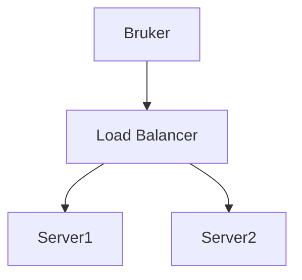

# Markdown Viewer

[English](README.en.md) · [简体中文](README.zh-CN.md) · [繁體中文](README.zh-TW.md) · [Русский](README.ru.md) · [日本語](README.ja.md) · [हिन्दी](README.hi.md) · [한국어](README.ko.md) · [Deutsch](README.de.md) · [Português (Brasil)](README.pt-BR.md) · [Português (Portugal)](README.pt-PT.md) · [Nederlands](README.nl.md) · [Українська](README.uk.md) · [Tiếng Việt](README.vi.md) · [Беларуская](README.be.md) · [Français](README.fr.md) · [Italiano](README.it.md) · [Bahasa Indonesia](README.id.md) · [Español](README.es.md) · [ไทย](README.th.md) · [Svenska](README.sv.md) · [Türkçe](README.tr.md) · [Eesti](README.et.md) · [Bahasa Melayu](README.ms.md) · [Polski](README.pl.md) · [Suomi](README.fi.md) · [Lietuvių](README.lt.md) · [Norsk](README.no.md) · [Dansk](README.da.md)

**Markdown til perfekt Word med ett klikk — Mermaid, Graphviz, Vega, infografikk, LaTeX (redigerbar), kodeuthevning, lokal behandling**

*Helt gratis · 18+ profesjonelle temaer · 28 språk*

🚀 **Installer nå:** https://chromewebstore.google.com/detail/markdown-viewer/jekhhoflgcfoikceikgeenibinpojaoi

---

Du elsker å skrive i Markdown — rent, effektivt, versjonskontrollvennlig.  
Men til slutt trenger du alltid et Word-dokument.

**Det gamle marerittet:**

😫 Manuelle skjermbilder av flytdiagrammer · Matematiske formler ødelegges ved kopiering · Manuell kodeformatering · Juster tabeller celle for celle · Etter eksport, en halv time til å justere fonter, mellomrom og farger

**Ett dokument: 1 time skriving, 2 timer formatering.**

---

**Nå tar det bare 1 sekund.**

Klikk for å laste ned og få et perfekt Word-dokument:
- ✅ Mermaid-diagrammer → HD-bilder
- ✅ Graphviz DOT-grafer → HD-bilder
- ✅ LaTeX-formler → Redigerbare Word-formler
- ✅ Automatisk syntaksutheving (100+ språk)
- ✅ 18+ profesjonelle temaer med ett klikk
- ✅ Helt gratis, lokal behandling

**Bruk tiden din på å skrive, ikke på formatering.**

---

## 💫 Se de faktiske resultatene

### Teknisk dokumentasjon: 15 flytdiagrammer, 2 timer → 5 minutter

**Før:** tegn i draw.io → eksporter PNG → sett inn i Word → juster størrelse → gjenta 15 ganger = **2 timer**

**Nå:** Skriv diagrammer med Mermaid-kode → klikk for å laste ned = **5 minutter**

## Systemarkitektur

``````markdown

``````

Trenger endringer? Endre kode og eksporter på nytt. **Spar 115 minutter.**

### Akademisk artikkel: 50+ formler, 3 timer → 10 minutter

**Før:** Word formelredigerer én etter én ELLER betalt verktøyabonnement = **3 timer + Betalt abonnement**

**Nå:** Skriv LaTeX-syntaks direkte → klikk for å laste ned = **10 minutter + Gratis**

Gitt masse $m$ og akselerasjon $a$, i henhold til Newtons andre lov:

```markdown
$$
F = ma = m\frac{dv}{dt} = m\frac{d^2x}{dt^2}
$$
```

Eksportert som native Word-format, fullt redigerbar. **Ikke et bilde, men et ekte formelobjekt.**

### Teamsamarbeid: Ukentlige rapporter, 1 time → 1 minutt

**Før:** Kopier innhold → Sett format → Juster lister → Legg til styling → Excel-diagrammer + skjermbilder = **1 time per uke**

**Nå:** Åpne fil → Velg tema → Klikk for å laste ned = **1 minutt**

Velg "Business"-temaet, Vega-Lite datadiagrammer konverteres automatisk til høyoppløselige bilder, profesjonelt utseende. **Spar 59 minutter per uke.**

**Forretningsbrukstilfeller:**
- 📊 Salgstrender (linjediagrammer)
- 📈 Markedsandelssammenligning (stolpediagrammer)
- 🎯 KPI-oppnåelse (målere)
- 📉 Kostnadsanalyse (stablede diagrammer)

La dataene snakke, generer profesjonelle rapporter med ett klikk.

---

## 🎯 Tre kjernefunksjoner

### 1. Automatisk diagramkonvertering

**Mermaid-diagrammer** · **Graphviz DOT-grafer** · **Vega/Vega-Lite datadiagrammer** · **Infographic** · SVG-bilder · Komplekse HTML-tabeller

**Mermaid:** Flytdiagrammer, sekvensdiagrammer, klassediagrammer, tilstandsdiagrammer → Tekniske dokumenter, arkitekturdesign  
**Graphviz DOT:** Rettede og urettede grafer, tilstandsmaskiner, organisasjonskart → Systemarkitektur, datadataflyt  
**Vega/Vega-Lite:** Stolpediagrammer, linjediagrammer, spredningsplott, varmekart → Forretningsrapporter, dataanalyse  
**Infographic:** Statistiske diagrammer, infografikk, datavisualisering → Datapresentasjon, visuell historiefortelling

**Tidssammenligning:** Komplekst sekvensdiagram (10 objekter)
- Tradisjonelle verktøy: Tegning 30min + Endring 20min + Justering 10min + Eksport 5min = **65 minutter**
- Markdown Viewer: Skriv kode 5min + Endre 30sek + Eksporter 1sek = **6 minutter**

**Forretningsscenario:** Kvartalsvis salgsrapport (5 stolpediagrammer)
- Excel-diagrammer + skjermbilder: Velg data 15min + Formater 10min + Skjermbilde 5min = **30 minutter**
- Vega-Lite: JSON-data 2min + Ett-klikks-eksport = **3 minutter**

**Presist, profesjonelt, gjenbrukbart.**

### 2. Perfekt formelkonvertering

LaTeX → Redigerbare Word-formler (ikke bilder!)

Etter eksport kan du:
- ✅ Fortsette redigering i Word
- ✅ Justere fontstørrelse
- ✅ Endre symboler og variabler
- ✅ Kopiere til andre dokumenter

**Én formel, to tilnærminger:**
- ❌ Word formelredigerer: Klikk...klikk...klikk...velg symboler...juster posisjoner
- ✅ LaTeX: `\int_0^\infty e^{-x^2}dx` Ferdig

### 3. 18+ profesjonelle temaer

Forskjellige scenarioer, forskjellige stiler, bytt med ett klikk:

- 📊 Business / Technical → Forretningsrapporter, tekniske dokumenter
- 📚 Academic / Palatino → Akademiske artikler, boktypesetting  
- 🇨🇳 Songti / Heiti / Mixed → Kinesiske dokumenter
- 🎨 Typewriter / Sakura → Kreativt innhold

**WYSIWYG:** Forhåndsvisning ser nøyaktig ut som eksportert Word. Ingen gjetning, ingen prøving.

**Ingen manuelle justeringer lenger:** Font, størrelse, linjeavstand, avsnittavstand, kodebakgrunnsfarge...

---

## ⚡ Lynrask opplevelse

### Smart hurtigbuffer: Første gang 5s, andre gang 1s

Dokument med 50 Mermaid-diagrammer:
- **Første åpning:** Tekst vises umiddelbart, diagrammer rendres i bakgrunnen, alt ferdig innen 5 sekunder
- **Andre åpning:** Last fra hurtigbuffer, øyeblikkelig visning (<1s)
- **Tekst endret:** Fortsatt øyeblikkelig (diagrammer fra hurtigbuffer)
- **Diagram endret:** Bare endrede diagrammer rendres på nytt

**10x raskere enn Word, 100x mindre filer.**

### Leseforbedringer

- **Tre oppsett:** Normal (1000px) / Fullskjerm / Smal (530px, forhåndsvisning Word-effekt)
- **Fleksibel zoom:** 50%-400%, snarveier `Ctrl/Cmd +` `-` `0`
- **Smart innholdsfortegnelse:** Automatisk utvinning av overskrifter, sidelinjenavigering, `Ctrl/Cmd + B` for å bytte
- **Posisjonsminne:** Automatisk lagring av rulleposisjon, fortsett lesing neste gang
- **Historikk:** Spor nylig åpnede dokumenter

---

## 🚀 Rask start - 3 trinn

### Trinn 1: Installer utvidelse (30 sekunder)

1. Åpne Chrome-nettleser
2. Besøk Chrome Web Store
3. Søk etter "Markdown Viewer"
4. Klikk "Legg til i Chrome"
5. ✅ Installasjon fullført

### Trinn 2: Tillat filtilgang (1 minutt)

**Hvis du vil åpne lokale .md-filer:**

1. Åpne `chrome://extensions/`
2. Finn Markdown Viewer
3. Aktiver "Tillat tilgang til fil-URL-er"
4. ✅ Nå kan du dobbeltklikke for å åpne lokale Markdown-filer

**Ikke nødvendig hvis:**
- Kun se online-dokumenter (GitHub, blogger, etc.)
- Bruk nettleserens "Åpne fil"-funksjon

### Rask start

**Åpne dokumenter:** Dobbeltklikk .md-filer eller dra til nettleser · GitHub-dokumenter automatisk rendret

**Eksporter til Word:** Klikk nedlastingsknapp eller `Ctrl/Cmd + S` → Se fremdrift → Automatisk lagring

**Bytt temaer:** Klikk verktøylinje → Velg tema → Bruk umiddelbart

**Juster visning:** `+`/`-` zoom · Bytt oppsett · `Ctrl/Cmd + B` innholdsfortegnelse

---

## 🎁 Komplette funksjoner

### Full Markdown-syntaksstøtte

Overskrifter · Avsnitt · Fet · Kursiv · Gjennomstreking · Lister · Oppgavelister · Sitater · Kodeblokker (100+ språk uthevet) · Tabeller · Lenker · Bilder · Mermaid-diagrammer · Vega / Vega-Lite-diagrammer · Infographic-diagrammer · LaTeX-formler · HTML · GFM-utvidelser

### 18 temaer

**Forretning:** Default · Business · Technical  
**Akademisk:** Academic  
**Serif:** Palatino · Garamond · Cambria · Elegant  
**Sans-serif:** Verdana · Trebuchet · Century  
**Kinesisk:** Songti · Heiti · Mixed  
**Kreativ:** Typewriter · Sakura · Water · Minimal

### 28 grensesnittspråk

English · 简体中文 · 繁體中文 · Русский · 日本語 · हिन्दी · 한국어 · Deutsch · Português (Brasil) · Português (Portugal) · Nederlands · Українська · Tiếng Việt · Беларуская · Français · Italiano · Bahasa Indonesia · Español · ไทย · Svenska · Türkçe · Eesti · Bahasa Melayu · Polski · Suomi · Lietuvių · Norsk · Dansk

---

## 💎 Konkurransefortrinn

|  | Manuelle skjermbilder | CLI-verktøy | Online-tjenester | Skrivebordseditorer | Markdown Viewer |
|---|:---:|:---:|:---:|:---:|:---:|
| **Brukervennlighet** | Kjedelig | Oppsett nødvendig | Opplasting nødvendig | Installasjon nødvendig | ✅ Ett klikk |
| **Mermaid** | Manuelt skjermbilde | Plugin nødvendig | ✅ Støttet | ✅ Støttet | ✅ Innfødt støtte |
| **Matematiske formler** | Bilder | Bilder | Bilder | Bilder | ✅ Redigerbar |
| **Personvern** | ✅ Lokal | ✅ Lokal | ❌ Skyopplasting | ✅ Lokal | ✅ Lokal |
| **Temaer** | - | - | 3-5 | 5-10 | ✅ 18+ |
| **Frakoblet** | ✅ | ✅ | ❌ | ✅ | ✅ |
| **GitHub direkte visning** | ❌ | ❌ | ❌ | ❌ | ✅ |
| **Pris** | Gratis | Gratis | Betalte planer | Betalte planer | ✅ Gratis |

**Kjernefordel: Raskere, billigere, tryggere, kraftigere.**

---

## ❓ Ofte stilte spørsmål

**S: Kan jeg redigere det eksporterte Word-dokumentet?**  
A: Ja. Standard .docx-format, matematiske formler er redigerbare, ikke bilder.

**S: Hvilke diagrammer støttes?**  
A: Alle Mermaid-diagrammer (flytdiagram, sekvens, gantt, klasse, tilstand, pai, ER, etc.), Vega / Vega-Lite datavisualiseringsdiagrammer, Infographic statistiske diagrammer + SVG automatisk konvertering.

**S: Er det en filstørrelsesgrense?**  
A: Ingen grense. Smart hurtigbuffer, dokumenter med 100+ diagrammer åpnes øyeblikkelig.

**S: Kreves det internett?**  
A: Nei. Fullstendig lokal behandling, fungerer frakoblet.

**S: Vil dokumentene mine bli lastet opp?**  
A: Aldri. All behandling skjer lokalt.

**S: Hvordan bytte temaer?**  
A: Klikk verktøylinjeikon → Velg tema → Bruk umiddelbart.

**S: Kan jeg tilpasse temaer?**  
A: For øyeblikket 18 forhåndsinnstilte temaer, tilpasning kommer snart.

**S: Vil store dokumenter bli trege?**  
A: Nei. Progressiv lasting + smart hurtigbuffer, tekst vises umiddelbart, diagrammer rendres i bakgrunnen (første gang 5s, andre gang 1s).

**S: Tar hurtigbufferen mye plass?**  
A: Standard maks 1000 elementer, ca. 500 MB, justerbart eller ryddbart i innstillinger.

**S: Hvilke nettlesere støttes?**  
A: Chrome og Chromium-baserte nettlesere (Edge, Brave, Opera).

**S: Hvilke Word-versjoner kan åpne den eksporterte filen?**  
A: Word 2016+ fullt støttet, Word 2013 fungerer også. Fullt kompatibel med WPS Office.

**S: Kan jeg eksportere til PDF?**  
A: For øyeblikket kun Word, PDF planlagt. Du kan først eksportere til Word, deretter lagre som PDF.

**S: Hvilket tema passer for meg?**  
A: Forretningsrapporter → Business · Akademiske artikler → Academic · Tekniske dokumenter → Technical · Kinesiske dokumenter → Songti/Mixed

**S: Hva er forskjellen mellom Vega og Mermaid?**  
A: **Mermaid** er for flytdiagrammer, arkitekturdiagrammer og andre skjematiske diagrammer; **Vega/Vega-Lite** er for datavisualisering som salgsdiagrammer, økonomiske rapporter og andre datadrevne forretningsdiagrammer. De utfyller hverandre for forskjellige scenarioer.

**S: Hvordan lage diagrammer med Vega-Lite?**  
A: Bruk ````vega-lite` kodeblokk i Markdown med JSON-format diagramspesifikasjon. Se [Vega-Lite offisielle eksempler](https://vega.github.io/vega-lite/examples/).

---

## 🔒 Personvernløfte

- ✅ All behandling utføres lokalt, lastes aldri opp
- ✅ Ingen sporing, ingen innsamling av persondata
- ✅ Åpen kildekode, kan revideres og er gjennomsiktig
- ✅ Chrome Web Store sikkerhet godkjent (Manifest V3)

**Ditt personvern er 100% beskyttet.**

---

## 🆘 Få hjelp

📖 [Full dokumentasjon](https://github.com/xicilion/markdown-viewer-extension) · 🐛 [Rapporter problemer](https://github.com/xicilion/markdown-viewer-extension/issues) · 💡 [Funksjonsforespørsler](https://github.com/xicilion/markdown-viewer-extension/issues) · ⭐ [GitHub-stjerne](https://github.com/xicilion/markdown-viewer-extension)

---

## 🎉 Kom i gang nå

**Installer på 30 sekunder, start bruk umiddelbart:**

1. Besøk Chrome Web Store → Søk etter "Markdown Viewer"
2. Klikk "Legg til i Chrome"
3. Klikk "Administrer utvidelser", aktiver "Tillat tilgang til fil-URLer"
4. Dra `.md`-filer til nettleser
5. ✅ Start bruk

**Du får:** Markdown → Word ett-klikks-konvertering · Mermaid automatisk konvertering · LaTeX redigerbare formler · 100+ språk syntaksutheving · 18+ temaer · Smart hurtigbuffer · Fullstendig gratis

**Perfekt for:** Tekniske forfattere · Studenter/forskere · Produktledere · Utviklere · Alle som bruker Markdown

---

## 📜 Åpen kildekode-lisens

Dette prosjektet er åpen kildekode under ISC-lisens. Velkommen til å gi stjerne, rapportere problemer, foreslå funksjoner og bidra med kode.

**Prosjekt-URL:** https://github.com/xicilion/markdown-viewer-extension

---

**Ikke kast bort tiden din på formatering**

**Fokuser på skriving, la Markdown Viewer håndtere alt annet**

🚀 **Installer nå:** https://chromewebstore.google.com/detail/markdown-viewer/jekhhoflgcfoikceikgeenibinpojaoi

*Fullstendig gratis · Lokal behandling · Personvern beskyttet*
