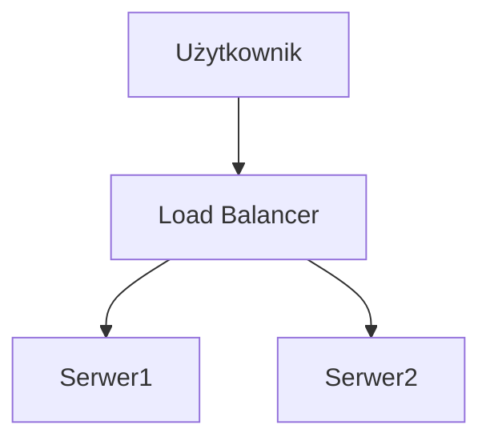

# Markdown Viewer

[English](README.en.md) · [简体中文](README.zh-CN.md) · [繁體中文](README.zh-TW.md) · [Русский](README.ru.md) · [日本語](README.ja.md) · [हिन्दी](README.hi.md) · [한국어](README.ko.md) · [Deutsch](README.de.md) · [Português (Brasil)](README.pt-BR.md) · [Português (Portugal)](README.pt-PT.md) · [Nederlands](README.nl.md) · [Українська](README.uk.md) · [Tiếng Việt](README.vi.md) · [Беларуская](README.be.md) · [Français](README.fr.md) · [Italiano](README.it.md) · [Bahasa Indonesia](README.id.md) · [Español](README.es.md) · [ไทย](README.th.md) · [Svenska](README.sv.md) · [Türkçe](README.tr.md) · [Eesti](README.et.md) · [Bahasa Melayu](README.ms.md) · [Polski](README.pl.md) · [Suomi](README.fi.md) · [Lietuvių](README.lt.md) · [Norsk](README.no.md) · [Dansk](README.da.md)

**Markdown do perfekcyjnego Worda jednym kliknięciem — Mermaid, Graphviz, Vega, infografika, LaTeX (edytowalny), podświetlanie kodu, lokalne przetwarzanie**

*Całkowicie za darmo · 18+ profesjonalnych motywów · Obsługa 28 języków*

🚀 **Zainstaluj teraz:** https://chromewebstore.google.com/detail/markdown-viewer/jekhhoflgcfoikceikgeenibinpojaoi

---

Lubisz pisać w Markdown — prosty, wydajny, przyjazny dla kontroli wersji.  
Ale ostatecznie zawsze potrzebujesz dokumentu Word.

**Dawny koszmar:**

😫 Ręczne zrzuty ekranu schematów blokowych · Formuły matematyczne przy kopiowaniu się psują · Ręczne formatowanie kodu · Regulacja tabeli komórka po komórce · Po eksporcie pół godziny na dostosowanie czcionek, odstępów i kolorów

**Jeden dokument: 1 godzina pisania, 2 godziny formatowania.**

---

**Teraz zajmuje to tylko 1 sekundę.**

Kliknij, aby pobrać i uzyskać doskonały dokument Word:
- ✅ Diagramy Mermaid → Obrazy w wysokiej rozdzielczości
- ✅ Grafy Graphviz DOT → Obrazy w wysokiej rozdzielczości
- ✅ Formuły LaTeX → Edytowalne formuły Word
- ✅ Automatyczne podświetlanie kodu (100+ języków)
- ✅ 18+ profesjonalnych motywów jednym kliknięciem
- ✅ Całkowicie za darmo, przetwarzanie lokalne

**Poświęć czas na pisanie, a nie na formatowanie.**

---

## 💫 Zobacz rzeczywiste efekty

### Dokumentacja techniczna: 15 schematów blokowych, 2 godziny → 5 minut

**Wcześniej:** draw.io rysowanie → eksport PNG → wstaw do Word → dostosuj rozmiar → powtórz 15 razy = **2 godziny**

**Teraz:** Pisz diagramy kodem Mermaid → kliknij, aby pobrać = **5 minut**

## Architektura systemu

``````markdown

``````

Modyfikacja? Zmień kod i eksportuj ponownie. **Oszczędność 115 minut.**

### Artykuł naukowy: 50+ formuł, 3 godziny → 10 minut

**Wcześniej:** Wprowadzanie jeden po drugim w edytorze formuł Word lub płatna subskrypcja narzędzi = **3 godziny + płatna subskrypcja**

**Teraz:** Pisz bezpośrednio składnią LaTeX → kliknij, aby pobrać = **10 minut + za darmo**

Niech masa punktu materialnego wynosi $m$, przyspieszenie $a$, zgodnie z drugą zasadą dynamiki Newtona:

```markdown
$$
F = ma = m\frac{dv}{dt} = m\frac{d^2x}{dt^2}
$$
```

Po eksporcie jest w natywnym formacie Word, nadal edytowalny. **To nie jest obraz, to prawdziwy obiekt formuły.**

### Współpraca zespołowa: raport tygodniowy, 1 godzina → 1 minuta

**Wcześniej:** Kopiowanie treści → ustawianie formatu → dostosowanie list → dodawanie tła → zrzuty ekranu wykresów Excel = **1 godzina tygodniowo**

**Teraz:** Otwórz plik → wybierz motyw → kliknij, aby pobrać = **1 minuta**

Wybierz motyw "Business", wykresy danych Vega-Lite automatycznie konwertują się na obrazy w wysokiej rozdzielczości, profesjonalne i eleganckie. **Oszczędność 59 minut tygodniowo.**

**Przykłady scenariuszy biznesowych:**
- 📊 Wykres trendów sprzedaży (wykres liniowy)
- 📈 Porównanie udziałów w rynku (wykres słupkowy)
- 🎯 Wskaźnik realizacji KPI (dashboard)
- 📉 Analiza kosztów (wykres skumulowany)

Mów danymi, generuj profesjonalne raporty jednym kliknięciem.

---

## 🎯 Trzy główne funkcje

### 1. Automatyczna konwersja wykresów

**Schematy blokowe Mermaid** · **Graphviz DOT** · **Wykresy danych Vega/Vega-Lite** · **Infographic** · Obrazy SVG · Złożone tabele HTML

**Mermaid:** Schematy blokowe, diagramy sekwencji, diagramy klas, diagramy stanów → Dokumentacja techniczna, projektowanie architektury  
**Graphviz DOT:** Grafy skierowane/nieskierowane, topologia sieci, automaty stanowe → Architektura systemów, analiza zależności  
**Vega/Vega-Lite:** Wykresy słupkowe, liniowe, punktowe, mapy cieplne → Raporty biznesowe, analiza danych  
**Infographic:** Wykresy statystyczne, infografiki, wizualizacja danych → Prezentacja danych, wizualne opowiadanie historii

**Porównanie czasu:** Złożony diagram sekwencji (10 obiektów)
- Tradycyjne narzędzia: rysowanie 30 min + modyfikacja 20 min + dostosowanie 10 min + eksport 5 min = **65 minut**
- Markdown Viewer: pisanie kodu 5 min + modyfikacja 30 sek + eksport 1 sek = **6 minut**

**Scenariusz biznesowy:** Raport sprzedaży kwartalnej (5 wykresów słupkowych)
- Wykres Excel + zrzut ekranu: wybór danych 15 min + dostosowanie formatu 10 min + zrzut ekranu zapis 5 min = **30 minut**
- Vega-Lite: dane JSON 2 min + eksport jednym kliknięciem = **3 minuty**

**Precyzyjny, profesjonalny, wielokrotnego użytku.**

### 2. Doskonała konwersja formuł matematycznych

LaTeX → Edytowalne formuły Word (nie obrazy!)

Po eksporcie możesz:
- ✅ Kontynuować edycję w Word
- ✅ Dostosować rozmiar czcionki
- ✅ Modyfikować symbole i zmienne
- ✅ Kopiować do innych dokumentów

**Jedna formuła, dwa sposoby pisania:**
- ❌ Edytor formuł Word: klik klik klik klik klik...wybierz symbol...dostosuj pozycję
- ✅ LaTeX: `\int_0^\infty e^{-x^2}dx` gotowe

### 3. 18+ profesjonalnych motywów

Różne scenariusze, różne style, zmiana jednym kliknięciem:

- 📊 Business / Technical → Raporty biznesowe, dokumentacja techniczna
- 📚 Academic / Palatino → Artykuły naukowe, składanie książek  
- 🇨🇳 宋体 / 黑体 / 混排 → Dokumenty chińskie
- 🎨 Typewriter / Sakura → Treści kreatywne

**WYSIWYG:** Jak wygląda w podglądzie, tak będzie w Word. Bez zgadywania, bez prób.

**Nie musisz już ręcznie dostosowywać:** Czcionki, rozmiaru czcionki, odstępów między wierszami, odstępów między akapitami, koloru tła kodu...

---

## ⚡ Błyskawiczne doświadczenie

### Inteligentna pamięć podręczna: pierwszy raz 5 sekund, drugi raz 1 sekunda

Dokument zawierający 50 diagramów Mermaid:
- **Pierwsze otwarcie:** Tekst wyświetlany natychmiast, diagramy renderowane w tle, wszystko ukończone w 5 sekund
- **Drugie otwarcie:** Wczytywanie z pamięci podręcznej, natychmiastowe wyświetlanie (<1 sekunda)
- **Modyfikacja tekstu:** Nadal natychmiastowe otwarcie (diagramy wczytane z pamięci podręcznej)
- **Modyfikacja diagramów:** Tylko zmodyfikowane diagramy są ponownie renderowane

**Otwieranie 10 razy szybsze niż Word, plik 100 razy mniejszy.**

### Ulepszenia czytania

- **Trzy układy:** Normalny (1000px) / Pełny ekran / Wąski (530px, podgląd efektu Word)
- **Elastyczne powiększanie:** 50%-400%, skróty klawiszowe `Ctrl/Cmd +` `-` `0`
- **Inteligentny spis treści:** Automatyczna ekstrakcja nagłówków, nawigacja w pasku bocznym, `Ctrl/Cmd + B` przełącza
- **Pamięć pozycji:** Automatyczny zapis pozycji przewijania, kontynuuj czytanie następnym razem
- **Historia:** Rejestruje ostatnio otwarte dokumenty

---

## 🚀 Szybki start - 3 kroki

### Krok pierwszy: Zainstaluj rozszerzenie (30 sekund)

1. Otwórz przeglądarkę Chrome
2. Odwiedź Chrome Web Store
3. Wyszukaj "Markdown Viewer"
4. Kliknij "Dodaj do Chrome"
5. ✅ Instalacja zakończona

### Krok drugi: Zezwól na dostęp do plików lokalnych (1 minuta)

**Jeśli chcesz otwierać pliki .md na swoim komputerze:**

1. Otwórz `chrome://extensions/`
2. Znajdź Markdown Viewer
3. Włącz "Zezwalaj na dostęp do adresów URL plików"
4. ✅ Teraz możesz podwójnie kliknąć, aby otworzyć lokalne pliki Markdown

**Nie potrzebujesz tego kroku, jeśli:**
- Patrzysz tylko na dokumenty online (GitHub, blogi itp.)
- Używasz funkcji "Otwórz plik" przeglądarki

### Szybki start

**Otwórz dokument:** Podwójne kliknięcie pliku .md lub przeciągnij do przeglądarki · Dokumenty GitHub automatycznie rozpoznawane i renderowane

**Eksportuj Word:** Kliknij przycisk pobierania lub `Ctrl/Cmd + S` → Zobacz wskaźnik postępu → Automatyczny zapis

**Zmień motyw:** Kliknij pasek narzędzi → Wybierz motyw → Natychmiastowe zastosowanie

**Dostosuj widok:** `+`/`-` powiększanie · Zmiana układu · `Ctrl/Cmd + B` spis treści

---

## 🎁 Pełna funkcjonalność

### Pełne wsparcie składni Markdown

Nagłówki · Akapity · Pogrubienie · Kursywa · Przekreślenie · Listy · Listy zadań · Cytaty · Bloki kodu (podświetlanie 100+ języków) · Tabele · Linki · Obrazy · Diagramy Mermaid · Wykresy Vega / Vega-Lite · Wykresy Infographic · Formuły LaTeX · HTML · Rozszerzenia GFM

### 18 motywów

**Biznes:** Default · Business · Technical  
**Akademicki:** Academic  
**Szeryfowe:** Palatino · Garamond · Cambria · Elegant  
**Bezszeryfowe:** Verdana · Trebuchet · Century  
**Chiński:** 宋体 · 黑体 · 混排  
**Kreatywny:** Typewriter · Sakura · Water · Minimal

### 28 języków interfejsu

English · 简体中文 · 繁體中文 · Русский · 日本語 · हिन्दी · 한국어 · Deutsch · Português (Brasil) · Português (Portugal) · Nederlands · Українська · Tiếng Việt · Беларуская · Français · Italiano · Bahasa Indonesia · Español · ไทย · Svenska · Türkçe · Eesti · Bahasa Melayu · Polski · Suomi · Lietuvių · Norsk · Dansk

---

## 💎 Przewaga konkurencyjna

|  | Ręczny zrzut ekranu | Narzędzia CLI | Usługi online | Edytor desktopowy | Markdown Viewer |
|---|:---:|:---:|:---:|:---:|:---:|
| **Trudność obsługi** | Złożona | Wymaga konfiguracji | Wymaga przesyłania | Wymaga instalacji | ✅ Jedno kliknięcie |
| **Mermaid** | Ręczny zrzut ekranu | Wymaga wtyczki | ✅ Wsparcie | ✅ Wsparcie | ✅ Natywne wsparcie |
| **Formuły matematyczne** | Obraz | Obraz | Obraz | Obraz | ✅ Edytowalne |
| **Prywatność i bezpieczeństwo** | ✅ Lokalnie | ✅ Lokalnie | ❌ Przesyłanie do chmury | ✅ Lokalnie | ✅ Lokalnie |
| **Liczba motywów** | - | - | 3-5 | 5-10 | ✅ 18+ |
| **Użycie offline** | ✅ | ✅ | ❌ | ✅ | ✅ |
| **Bezpośrednie przeglądanie GitHub** | ❌ | ❌ | ❌ | ❌ | ✅ |
| **Cena** | Za darmo | Za darmo | Częściowo płatne | Częściowo płatne | ✅ Za darmo |

**Kluczowe zalety: szybszy, tańszy, bezpieczniejszy, potężniejsze funkcje.**

---

## ❓ Najczęściej zadawane pytania

**P: Czy eksportowane dokumenty Word są edytowalne?**  
O: Tak. Standardowy format .docx, formuły matematyczne edytowalne, nie są obrazami.

**P: Jakie wykresy są obsługiwane?**  
O: Wszystkie diagramy Mermaid (schematy blokowe, diagramy sekwencji, wykresy Gantta, diagramy klas, diagramy stanów, wykresy kołowe, diagramy ER itp.), wykresy wizualizacji danych Vega / Vega-Lite, wykresy statystyczne Infographic + automatyczna konwersja SVG.

**P: Czy jest limit rozmiaru pliku?**  
O: Bez limitu. Inteligentna pamięć podręczna, dokumenty ze 100+ wykresami otwierają się natychmiast.

**P: Czy wymagane jest połączenie internetowe?**  
O: Nie. Całkowicie lokalne przetwarzanie, dostępne offline.

**P: Czy dokumenty są przesyłane?**  
O: Nigdy nie przesyłane. Całe przetwarzanie odbywa się lokalnie.

**P: Jak zmienić motyw?**  
O: Kliknij ikonę paska narzędzi → Wybierz motyw → Natychmiastowe zastosowanie.

**P: Czy mogę dostosować motywy?**  
O: Obecnie 18 predefiniowanych motywów, funkcja dostosowywania w planach.

**P: Czy duże dokumenty powodują spowolnienie?**  
O: Nie. Progresywne ładowanie + inteligentna pamięć podręczna, tekst wyświetlany natychmiast, diagramy renderowane w tle (pierwszy raz 5 sek, drugi raz 1 sek).

**P: Czy pamięć podręczna zajmuje dużo miejsca?**  
O: Domyślnie maksymalnie 1000 elementów, około 500 MB, można dostosować lub wyczyścić w ustawieniach.

**P: Jakie przeglądarki są obsługiwane?**  
O: Chrome i przeglądarki oparte na Chromium (Edge, Brave, Opera).

**P: W której wersji Word można otwierać eksportowane dokumenty?**  
O: Doskonałe wsparcie dla Word 2016+, Word 2013 również może je otwierać. WPS Office w pełni kompatybilny.

**P: Czy obsługiwany jest eksport do PDF?**  
O: Obecnie tylko Word, PDF w planach. Możesz najpierw wyeksportować do Word, a następnie zapisać jako PDF.

**P: Który motyw jest dla mnie odpowiedni?**  
O: Raporty biznesowe → Business · Artykuły naukowe → Academic · Dokumentacja techniczna → Technical · Dokumenty chińskie → 宋体/混排

**P: Jaka jest różnica między Vega a Mermaid?**  
O: **Mermaid** nadaje się do rysowania schematów blokowych, diagramów architektury i innych diagramów schematycznych; **Vega/Vega-Lite** nadaje się do wizualizacji danych, takich jak wykresy sprzedaży, sprawozdania finansowe i inne wykresy biznesowe oparte na rzeczywistych danych. Oba się uzupełniają, obejmując różne scenariusze.

**P: Jak tworzyć wykresy za pomocą Vega-Lite?**  
O: Użyj bloków kodu ````vega-lite` w Markdown, z zawartością w formacie JSON specyfikacji wykresu. Zobacz przykłady w [oficjalnej dokumentacji Vega-Lite](https://vega.github.io/vega-lite/examples/).

---

## 🔒 Zobowiązanie do prywatności

- ✅ Całe przetwarzanie odbywa się lokalnie, nigdy nie przesyłane
- ✅ Nie śledzi zachowań użytkownika, nie zbiera informacji osobistych
- ✅ Kod otwartoźródłowy do audytu, przejrzysty i wiarygodny
- ✅ Przeszedł kontrolę bezpieczeństwa Chrome Web Store (Manifest V3)

**Twoja prywatność jest chroniona w 100%.**

---

## 🆘 Uzyskaj pomoc

📖 [Pełna dokumentacja](https://github.com/xicilion/markdown-viewer-extension) · 🐛 [Zgłoś problem](https://github.com/xicilion/markdown-viewer-extension/issues) · 💡 [Zaproponuj funkcję](https://github.com/xicilion/markdown-viewer-extension/issues) · ⭐ [Wsparcie GitHub](https://github.com/xicilion/markdown-viewer-extension)

---

## 🎉 Zacznij teraz

**Zainstaluj w 30 sekund, wypróbuj natychmiast:**

1. Odwiedź Chrome Web Store → Wyszukaj "Markdown Viewer"
2. Kliknij「Dodaj do Chrome」
3. Kliknij「Zarządzaj rozszerzeniami」, włącz「Zezwalaj na dostęp do adresów URL plików」
4. Przeciągnij plik `.md` do przeglądarki
5. ✅ Zacznij używać

**Otrzymasz:** Konwersję Markdown → Word jednym kliknięciem · Automatyczną konwersję Mermaid na obrazy · Edytowalne formuły LaTeX · Podświetlanie kodu 100+ języków · 18+ motywów · Inteligentną pamięć podręczną · Całkowicie za darmo

**Odpowiedni dla:** Pisarzy technicznych · Studentów/Badaczy · Product Managerów · Deweloperów · Każdego korzystającego z Markdown

---

## 📜 Licencja open source

Ten projekt jest otwartoźródłowy na licencji ISC. Mile widziane Gwiazdki wsparcia, zgłaszanie problemów, sugestie, wkład w kod.

**Adres projektu:** https://github.com/xicilion/markdown-viewer-extension

---

**Nie pozwól, aby dostosowywanie formatowania marnowało Twój czas**

**Skup energię na pisaniu, pozwól Markdown Viewer obsłużyć resztę**

🚀 **Zainstaluj teraz:** https://chromewebstore.google.com/detail/markdown-viewer/jekhhoflgcfoikceikgeenibinpojaoi

*Całkowicie za darmo · Przetwarzanie lokalne · Bezpieczna prywatność*
