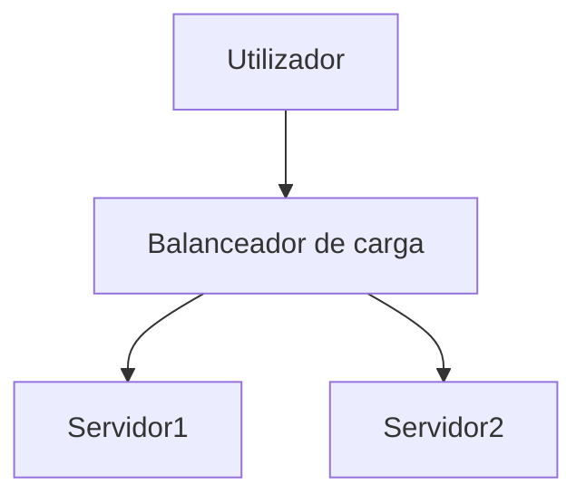

# Markdown Viewer

[简体中文](README.zh-CN.md) · [繁體中文](README.zh-TW.md) · [English](README.en.md) · [Русский](README.ru.md) · [日本語](README.ja.md) · [한국어](README.ko.md) · [Português (Brasil)](README.pt-BR.md) · [Português (Portugal)](README.pt-PT.md) · [Español](README.es.md) · [Deutsch](README.de.md) · [Français](README.fr.md) · [Українська](README.uk.md) · [Tiếng Việt](README.vi.md) · [Italiano](README.it.md) · [Türkçe](README.tr.md) · [Bahasa Indonesia](README.id.md) · [Lietuvių](README.lt.md) · [Nederlands](README.nl.md) · [Suomi](README.fi.md) · [ไทย](README.th.md) · [Polski](README.pl.md) · [हिन्दी](README.hi.md) · [Svenska](README.sv.md) · [Norsk](README.no.md) · [Dansk](README.da.md)

**Escreva documentos em Markdown, exporte Word perfeitos com um clique.**

*Totalmente gratuito · Processamento local · 18+ temas profissionais · Suporte a 25 idiomas*

🚀 **Instale agora:** https://chromewebstore.google.com/detail/markdown-viewer/jekhhoflgcfoikceikgeenibinpojaoi

---

Gosta de escrever em Markdown — simples, eficiente, amigo do controlo de versão.  
Mas no final, precisa sempre de um documento Word.

**O pesadelo de antes:**

😫 Capturas de ecrã manuais de fluxogramas · Fórmulas matemáticas corrompem-se ao copiar · Formatação manual de código · Ajuste célula a célula de tabelas · Após exportar, meia hora para ajustar tipos de letra, espaçamento e cores

**Um documento: 1 hora de escrita, 2 horas de formatação.**

---

**Agora demora apenas 1 segundo.**

Clique para descarregar e obtenha um documento Word perfeito:
- ✅ Diagramas Mermaid → Imagens em alta definição
- ✅ Grafos Graphviz DOT → Imagens em alta definição
- ✅ Fórmulas LaTeX → Fórmulas editáveis no Word
- ✅ Destaque automático de código (100+ linguagens)
- ✅ 18+ temas profissionais com um clique
- ✅ Totalmente gratuito, processamento local

**Dedique o seu tempo à escrita, não à formatação.**

---

## 💫 Veja os resultados reais

### Documentação técnica: 15 fluxogramas, 2 horas → 5 minutos

**Antes:** desenho no draw.io → exportar PNG → inserir no Word → ajustar tamanho → repetir 15 vezes = **2 horas**

**Agora:** Escrever diagramas com código Mermaid → clicar para descarregar = **5 minutos**

## Arquitetura do sistema

``````markdown

``````

Modificação? Altere o código e exporte novamente. **Poupe 115 minutos.**

### Artigo académico: 50+ fórmulas, 3 horas → 10 minutos

**Antes:** Inserção uma a uma no editor de fórmulas do Word ou subscrição de ferramentas pagas = **3 horas + subscrição paga**

**Agora:** Escreva diretamente com sintaxe LaTeX → clique para descarregar = **10 minutos + gratuito**

Seja a massa do ponto material $m$, a aceleração $a$, de acordo com a segunda lei de Newton:

```markdown
$$
F = ma = m\frac{dv}{dt} = m\frac{d^2x}{dt^2}
$$
```

Após a exportação está em formato nativo do Word, editável. **Não é uma imagem, é um objeto de fórmula real.**

### Colaboração em equipa: relatório semanal, 1 hora → 1 minuto

**Antes:** Copiar conteúdo → definir formato → ajustar listas → adicionar fundo → capturar gráficos do Excel = **1 hora por semana**

**Agora:** Abrir ficheiro → escolher tema → clicar para descarregar = **1 minuto**

Escolha o tema "Business", gráficos de dados Vega-Lite são convertidos automaticamente em imagens de alta definição, profissionais e elegantes. **Poupe 59 minutos por semana.**

**Exemplos de cenários empresariais:**
- 📊 Gráfico de tendências de vendas (gráfico de linhas)
- 📈 Comparação de quota de mercado (gráfico de barras)
- 🎯 Taxa de alcance de KPI (painel)
- 📉 Análise de custos (gráfico empilhado)

Fale com dados, gere relatórios profissionais com um clique.

---

## 🎯 Três funcionalidades principais

### 1. Conversão automática de gráficos

**Fluxogramas Mermaid** · **Graphviz DOT** · **Gráficos de dados Vega/Vega-Lite** · **Infographic** · Imagens SVG · Tabelas HTML complexas

**Mermaid:** Fluxogramas, diagramas de sequência, diagramas de classe, diagramas de estado → Documentação técnica, design de arquitetura  
**Graphviz DOT:** Grafos dirigidos/não dirigidos, topologia de rede, máquinas de estado → Arquitetura de sistemas, análise de dependências  
**Vega/Vega-Lite:** Gráficos de barras, linhas, dispersão, mapas de calor → Relatórios empresariais, análise de dados  
**Infographic:** Gráficos estatísticos, infográficos, visualização de dados → Apresentação de dados, narrativa visual

**Comparação de tempo:** Diagrama de sequência complexo (10 objetos)
- Ferramentas tradicionais: desenho 30 min + modificação 20 min + ajuste 10 min + exportação 5 min = **65 minutos**
- Markdown Viewer: escrever código 5 min + modificação 30 seg + exportar 1 seg = **6 minutos**

**Cenário empresarial:** Relatório de vendas trimestrais (5 gráficos de barras)
- Gráfico Excel + captura de ecrã: seleção de dados 15 min + ajuste de formato 10 min + captura e gravação 5 min = **30 minutos**
- Vega-Lite: dados JSON 2 min + exportação com um clique = **3 minutos**

**Preciso, profissional, reutilizável.**

### 2. Conversão perfeita de fórmulas matemáticas

LaTeX → Fórmulas editáveis no Word (não imagens!)

Após a exportação pode:
- ✅ Continuar a editar no Word
- ✅ Ajustar tamanho do tipo de letra
- ✅ Modificar símbolos e variáveis
- ✅ Copiar para outros documentos

**Uma fórmula, duas formas de escrever:**
- ❌ Editor de fórmulas do Word: clique clique clique clique clique...selecionar símbolo...ajustar posição
- ✅ LaTeX: `\int_0^\infty e^{-x^2}dx` pronto

### 3. 18+ temas profissionais

Cenários diferentes, estilos diferentes, mudança com um clique:

- 📊 Business / Technical → Relatórios empresariais, documentação técnica
- 📚 Academic / Palatino → Artigos académicos, paginação de livros  
- 🇨🇳 宋体 / 黑体 / 混排 → Documentos chineses
- 🎨 Typewriter / Sakura → Conteúdos criativos

**WYSIWYG:** Como aparece na pré-visualização, assim será no Word. Sem adivinhações, sem tentativas.

**Não precisará mais de ajustar manualmente:** Tipo de letra, tamanho do tipo de letra, entrelinhas, espaçamento entre parágrafos, cor de fundo do código...

---

## ⚡ Experiência ultrarápida

### Cache inteligente: primeira vez 5 segundos, segunda vez 1 segundo

Documento contendo 50 diagramas Mermaid:
- **Primeira abertura:** Texto exibido imediatamente, diagramas renderizados em segundo plano, tudo concluído em 5 segundos
- **Segunda abertura:** Carregamento do cache, exibição instantânea (<1 segundo)
- **Modificação de texto:** Ainda abertura instantânea (diagramas carregados do cache)
- **Modificação de diagramas:** Apenas os diagramas modificados são re-renderizados

**Abertura 10 vezes mais rápida que o Word, ficheiro 100 vezes menor.**

### Melhorias de leitura

- **Três layouts:** Normal (1000px) / Ecrã completo / Estreito (530px, pré-visualização do efeito Word)
- **Zoom flexível:** 50%-400%, atalhos `Ctrl/Cmd +` `-` `0`
- **Sumário inteligente:** Extração automática de títulos, navegação na barra lateral, `Ctrl/Cmd + B` alterna
- **Memória de posição:** Gravação automática da posição de rolagem, continue a ler da próxima vez
- **Histórico:** Regista documentos abertos recentemente

---

## 🚀 Início rápido - 3 passos

### Primeiro passo: Instale a extensão (30 segundos)

1. Abra o navegador Chrome
2. Visite a Chrome Web Store
3. Procure "Markdown Viewer"
4. Clique em "Adicionar ao Chrome"
5. ✅ Instalação concluída

### Segundo passo: Permita acesso a ficheiros locais (1 minuto)

**Se deseja abrir ficheiros .md no seu computador:**

1. Abra `chrome://extensions/`
2. Encontre Markdown Viewer
3. Ative "Permitir acesso a URLs de ficheiro"
4. ✅ Agora pode clicar duas vezes para abrir ficheiros Markdown locais

**Não precisa deste passo se:**
- Visualizar apenas documentos online (GitHub, blogues, etc.)
- Usar a função "Abrir ficheiro" do navegador

### Início rápido

**Abrir documento:** Clique duplo no ficheiro .md ou arraste para o navegador · Documentos do GitHub reconhecidos e renderizados automaticamente

**Exportar Word:** Clique no botão de descarga ou `Ctrl/Cmd + S` → Veja o indicador de progresso → Gravação automática

**Mudar tema:** Clique na barra de ferramentas → Selecione tema → Aplicação imediata

**Ajustar visualização:** `+`/`-` zoom · Mudança de layout · `Ctrl/Cmd + B` sumário

---

## 🎁 Funcionalidade completa

### Suporte completo à sintaxe Markdown

Títulos · Parágrafos · Negrito · Itálico · Rasurado · Listas · Listas de tarefas · Citações · Blocos de código (destaque de 100+ linguagens) · Tabelas · Ligações · Imagens · Diagramas Mermaid · Gráficos Vega / Vega-Lite · Gráficos Infographic · Fórmulas LaTeX · HTML · Extensões GFM

### 18 temas

**Negócios:** Default · Business · Technical  
**Académico:** Academic  
**Serifadas:** Palatino · Garamond · Cambria · Elegant  
**Sem serifa:** Verdana · Trebuchet · Century  
**Chinês:** 宋体 · 黑体 · 混排  
**Criativo:** Typewriter · Sakura · Water · Minimal

### 25 idiomas de interface

简体中文 · 繁體中文 · English · Русский · 日本語 · 한국어 · Português (Brasil) · Português (Portugal) · Español · Deutsch · Français · Українська · Tiếng Việt · Italiano · Türkçe · Bahasa Indonesia · Lietuvių · Nederlands · Suomi · ไทย · Polski · हिन्दी · Svenska · Norsk · Dansk

---

## 💎 Vantagens comparativas

|  | Captura manual | Ferramentas CLI | Serviços online | Editor desktop | Markdown Viewer |
|---|:---:|:---:|:---:|:---:|:---:|
| **Dificuldade de operação** | Complexa | Requer configuração | Requer carregamento | Requer instalação | ✅ Um clique |
| **Mermaid** | Captura manual | Requer plugin | ✅ Suporte | ✅ Suporte | ✅ Suporte nativo |
| **Fórmulas matemáticas** | Imagem | Imagem | Imagem | Imagem | ✅ Editáveis |
| **Privacidade e segurança** | ✅ Local | ✅ Local | ❌ Carregamento na nuvem | ✅ Local | ✅ Local |
| **Número de temas** | - | - | 3-5 | 5-10 | ✅ 18+ |
| **Uso offline** | ✅ | ✅ | ❌ | ✅ | ✅ |
| **Visualizar diretamente no GitHub** | ❌ | ❌ | ❌ | ❌ | ✅ |
| **Preço** | Gratuito | Gratuito | Parcialmente pago | Parcialmente pago | ✅ Gratuito |

**Vantagens principais: mais rápido, mais barato, mais seguro, funcionalidades mais poderosas.**

---

## ❓ Perguntas frequentes

**P: Os documentos Word exportados são editáveis?**  
R: Sim. Formato .docx padrão, fórmulas matemáticas editáveis, não são imagens.

**P: Quais gráficos são suportados?**  
R: Todos os diagramas Mermaid (fluxogramas, diagramas de sequência, gráficos de Gantt, diagramas de classe, diagramas de estado, gráficos circulares, diagramas ER, etc.), gráficos de visualização de dados Vega / Vega-Lite, gráficos estatísticos Infographic + conversão automática de SVG.

**P: Existe limite de tamanho de ficheiro?**  
R: Sem limite. Cache inteligente, documentos com 100+ gráficos abrem instantaneamente.

**P: É necessária ligação à internet?**  
R: Não. Processamento completamente local, disponível offline.

**P: Os documentos são enviados?**  
R: Nunca enviados. Todo o processamento é concluído localmente.

**P: Como mudar o tema?**  
R: Clique no ícone da barra de ferramentas → Selecione tema → Aplicação imediata.

**P: Posso personalizar temas?**  
R: Atualmente 18 temas predefinidos, funcionalidade de personalização nos planos.

**P: Documentos grandes causam lentidão?**  
R: Não. Carregamento progressivo + cache inteligente, texto exibido imediatamente, diagramas renderizados em segundo plano (primeira vez 5 seg, segunda vez 1 seg).

**P: O cache ocupa muito espaço?**  
R: Por predefinição máximo de 1000 itens, aproximadamente 500 MB, ajustável ou limpável nas configurações.

**P: Quais navegadores são suportados?**  
R: Chrome e navegadores baseados em Chromium (Edge, Brave, Opera).

**P: Em qual versão do Word os documentos exportados podem ser abertos?**  
R: Suporte perfeito para Word 2016+, Word 2013 também pode abrir. WPS Office totalmente compatível.

**P: É suportada a exportação para PDF?**  
R: Atualmente apenas Word, PDF nos planos. Pode primeiro exportar para Word e depois gravar como PDF.

**P: Qual tema é adequado para mim?**  
R: Relatórios empresariais → Business · Artigos académicos → Academic · Documentação técnica → Technical · Documentos chineses → 宋体/混排

**P: Qual é a diferença entre Vega e Mermaid?**  
R: **Mermaid** é adequado para desenhar fluxogramas, diagramas de arquitetura e outros diagramas esquemáticos; **Vega/Vega-Lite** é adequado para visualização de dados, como gráficos de vendas, relatórios financeiros e outros gráficos empresariais baseados em dados reais. Os dois complementam-se, cobrindo cenários diferentes.

**P: Como criar gráficos com Vega-Lite?**  
R: Use blocos de código ````vega-lite` no Markdown, com conteúdo em formato JSON da especificação do gráfico. Veja exemplos na [documentação oficial do Vega-Lite](https://vega.github.io/vega-lite/examples/).

---

## 🔒 Compromisso com a privacidade

- ✅ Todo o processamento concluído localmente, nunca enviado
- ✅ Não rastreia comportamentos de uso, não recolhe informações pessoais
- ✅ Código aberto auditável, transparente e confiável
- ✅ Aprovado na verificação de segurança da Chrome Web Store (Manifest V3)

**A sua privacidade é 100% protegida.**

---

## 🆘 Obtenha ajuda

📖 [Documentação completa](https://github.com/xicilion/markdown-viewer-extension) · 🐛 [Relatar problema](https://github.com/xicilion/markdown-viewer-extension/issues) · 💡 [Sugerir funcionalidade](https://github.com/xicilion/markdown-viewer-extension/issues) · ⭐ [Suporte no GitHub](https://github.com/xicilion/markdown-viewer-extension)

---

## 🎉 Comece agora

**Instale em 30 segundos, experimente imediatamente:**

1. Visite a Chrome Web Store → Procure "Markdown Viewer"
2. Clique em「Adicionar ao Chrome」
3. Clique em「Gerir extensões」, ative「Permitir acesso a URLs de ficheiros」
4. Arraste ficheiro `.md` para o navegador
5. ✅ Comece a usar

**Obterá:** Conversão Markdown → Word com um clique · Conversão automática de Mermaid em imagens · Fórmulas LaTeX editáveis · Destaque de código 100+ linguagens · 18+ temas · Cache inteligente · Totalmente gratuito

**Adequado para:** Escritores técnicos · Estudantes/Investigadores · Gestores de produto · Programadores · Qualquer pessoa que use Markdown

---

## 📜 Licença open source

Este projeto é open source sob licença ISC. Bem-vindas Estrelas de apoio, relatar problemas, sugestões, contribuições de código.

**Endereço do projeto:** https://github.com/xicilion/markdown-viewer-extension

---

**Não deixe que o ajuste de formatação desperdice o seu tempo**

**Concentre a sua energia na escrita, deixe o Markdown Viewer cuidar do resto**

🚀 **Instale agora:** https://chromewebstore.google.com/detail/markdown-viewer/jekhhoflgcfoikceikgeenibinpojaoi

*Totalmente gratuito · Processamento local · Privacidade segura*
