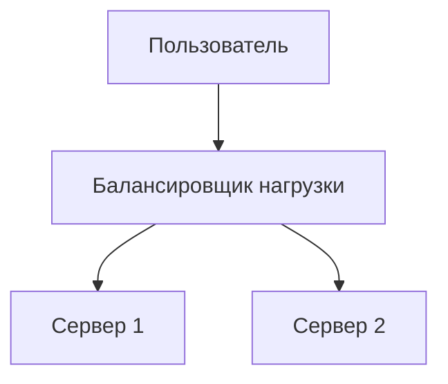

# Markdown Viewer

**Markdown в идеальный Word в один клик — Mermaid, Vega, Draw.io, Canvas, инфографика, Graphviz, LaTeX (редактируемый), подсветка кода, локальная обработка**

*Совершенно бесплатно · 29+ профессиональных тем · 28 языков интерфейса*

🚀 **Установить сейчас:** https://chromewebstore.google.com/detail/markdown-viewer/jekhhoflgcfoikceikgeenibinpojaoi

---

Вы любите писать в Markdown — чисто, эффективно, удобно для контроля версий.  
Но в конце концов, вам всегда нужен документ Word.

**Старый кошмар:**

😫 Ручные скриншоты блок-схем · Скопированные формулы превращаются в беспорядок · Ручное форматирование кода · Настройка таблиц ячейка за ячейкой · Ещё 30 минут на настройку шрифтов, интервалов и цветов после экспорта

**Один документ: 1 час написания, 2 часа форматирования.**

---

**Теперь это занимает всего 1 секунду.**

Нажмите скачать и получите идеальный документ Word:
- ✅ Диаграммы Mermaid → Изображения высокого разрешения
- ✅ Диаграммы данных Vega/Vega-Lite → Изображения высокого разрешения
- ✅ Диаграммы Draw.io → Изображения высокого разрешения
- ✅ Диаграммы Canvas → Изображения высокого разрешения
- ✅ Инфографика Infographic → Изображения высокого разрешения
- ✅ Графы Graphviz DOT → Изображения высокого разрешения
- ✅ Формулы LaTeX → Редактируемые уравнения Word
- ✅ Автоматическая подсветка синтаксиса (100+ языков)
- ✅ 29+ профессиональных тем одним кликом
- ✅ Полностью бесплатно, локальная обработка

**Тратьте время на написание, а не на форматирование.**

---

## 💫 Посмотрите на практике

### Техническая документация: 15 блок-схем, 2 часа → 5 минут

**Раньше:** диаграмма draw.io → Экспорт PNG → Вставка в Word → Изменение размера → Повторить 15 раз = **2 часа**

**Теперь:** Написать код Mermaid → Нажать скачать = **5 минут**

## Системная архитектура

``````markdown

``````

Нужны изменения? Измените код и переэкспортируйте. **Экономия 115 минут.**

### Научная статья: 50+ формул, 3 часа → 10 минут

**Раньше:** Редактор формул Word одна за другой ИЛИ платная подписка на инструмент = **3 часа + Платная подписка**

**Теперь:** Напишите синтаксис LaTeX напрямую → Нажмите скачать = **10 минут + Бесплатно**

Дана масса $m$ и ускорение $a$, согласно второму закону Ньютона:

```markdown
$$
F = ma = m\frac{dv}{dt} = m\frac{d^2x}{dt^2}
$$
```

Экспорт в собственном формате Word, полностью редактируемый. **Не изображение, а настоящий объект уравнения.**

### Командная работа: Еженедельные отчёты, 1 час → 1 минута

**Раньше:** Копировать контент → Установить формат → Настроить списки → Добавить стилизацию → Диаграммы Excel + скриншоты = **1 час еженедельно**

**Теперь:** Открыть файл → Выбрать тему → Нажать скачать = **1 минута**

Выберите тему "Business", диаграммы данных Vega-Lite автоматически конвертируются в изображения высокого разрешения, профессиональный вид. **Экономия 59 минут еженедельно.**

**Бизнес-сценарии:**
- 📊 Тренды продаж (линейные графики)
- 📈 Сравнение доли рынка (столбчатые диаграммы)
- 🎯 Достижение KPI (индикаторы)
- 📉 Анализ затрат (накопительные диаграммы)

Пусть данные говорят, генерируйте профессиональные отчёты одним кликом.

---

## 🎯 Три основные функции

### 1. Автоматическая конвертация диаграмм

**Диаграммы Mermaid** · **Диаграммы данных Vega/Vega-Lite** · **Диаграммы Draw.io** · **Диаграммы Canvas** · **Диаграммы Infographic** · **Graphviz DOT** · Изображения SVG · Сложные HTML-таблицы

**Mermaid:** Блок-схемы, диаграммы последовательностей, диаграммы классов, диаграммы состояний → Техническая документация, проектирование архитектуры  
**Vega/Vega-Lite:** Столбчатые диаграммы, линейные графики, точечные диаграммы, тепловые карты → Бизнес-отчёты, анализ данных  
**Draw.io:** Архитектурные диаграммы, топология сети, UML-диаграммы → Проектирование систем, техническая документация  
**Canvas:** Ментальные карты, доски планирования, графы знаний → Мозговой штурм, концептуальное картирование  
**Infographic:** Статистические диаграммы, инфографика, визуализация данных → Презентация данных, визуальное повествование  
**Graphviz DOT:** Ориентированные/неориентированные графы, деревья зависимостей → Системная архитектура, анализ зависимостей

**Сравнение времени:** Сложная диаграмма последовательностей (10 объектов)
- Традиционные инструменты: Рисование 30 мин + Изменение 20 мин + Настройка 10 мин + Экспорт 5 мин = **65 минут**
- Markdown Viewer: Написать код 5 мин + Изменить 30 сек + Экспортировать 1 сек = **6 минут**

**Бизнес-сценарий:** Квартальный отчёт о продажах (5 столбчатых диаграмм)
- Диаграммы Excel + скриншоты: Выбор данных 15 мин + Форматирование 10 мин + Скриншот 5 мин = **30 минут**
- Vega-Lite: Данные JSON 2 мин + Экспорт одним кликом = **3 минуты**

**Точно, профессионально, многократно используемо.**

### 2. Идеальная конвертация формул

LaTeX → Редактируемые уравнения Word (не изображения!)

После экспорта вы можете:
- ✅ Продолжить редактирование в Word
- ✅ Настроить размер шрифта
- ✅ Изменить символы и переменные
- ✅ Скопировать в другие документы

**Одна формула, два подхода:**
- ❌ Редактор формул Word: Клик...клик...клик...выбрать символы...настроить позиции
- ✅ LaTeX: `\int_0^\infty e^{-x^2}dx` Готово

### 3. 29+ профессиональных тем

Разные сценарии, разные стили, переключение одним кликом:

- 📊 Business / Technical → Бизнес-отчёты, техническая документация
- 📚 Academic / Palatino → Научные статьи, книжная вёрстка  
- 🇨🇳 Heiti / Mixed → Китайские документы
- 🎨 Typewriter / Handwritten → Творческий контент

**WYSIWYG:** Предпросмотр выглядит точно как экспортированный Word. Без догадок, без проб.

**Больше никаких ручных настроек:** Шрифт, размер, межстрочный интервал, интервал между абзацами, цвет фона кода...

---

## ⚡ Молниеносная скорость

### Умный кэш: Первый раз 5с, второй раз 1с

Документ с 50 диаграммами Mermaid:
- **Первое открытие:** Текст отображается мгновенно, диаграммы рендерятся в фоне, всё готово за 5с
- **Второе открытие:** Загрузка из кэша, мгновенное отображение (<1с)
- **Изменён текст:** Всё ещё мгновенно (диаграммы из кэша)
- **Изменена диаграмма:** Перерендериваются только изменённые диаграммы

**В 10 раз быстрее Word, файлы в 100 раз меньше.**

### Улучшения чтения

- **Три макета:** Нормальный (1000px) / Полный экран / Узкий (530px, предпросмотр эффекта Word)
- **Гибкий масштаб:** 50%-400%, горячие клавиши `Ctrl/Cmd +` `-` `0`
- **Умное оглавление:** Автоматическое извлечение заголовков, навигация по боковой панели, `Ctrl/Cmd + B` для переключения
- **Память позиции:** Автосохранение позиции прокрутки, продолжить чтение в следующий раз
- **История:** Отслеживание недавно открытых документов

---

## 🚀 Быстрый старт - 3 шага

### Шаг 1: Установить расширение (30 секунд)

1. Открыть браузер Chrome
2. Посетить Chrome Web Store
3. Найти "Markdown Viewer"
4. Нажать "Добавить в Chrome"
5. ✅ Установка завершена

### Шаг 2: Разрешить доступ к файлам (1 минута)

**Если вы хотите открывать локальные .md файлы:**

1. Открыть `chrome://extensions/`
2. Найти Markdown Viewer
3. Включить "Разрешить доступ к URL-адресам файлов"
4. ✅ Теперь вы можете открывать локальные файлы Markdown двойным щелчком

**Не требуется, если:**
- Просматриваете только онлайн документы (GitHub, блоги и т.д.)
- Используете функцию "Открыть файл" браузера

### Быстрый старт

**Открыть документы:** Двойной щелчок по .md файлам или перетащите в браузер · Документы GitHub автоматически рендерятся

**Экспорт в Word:** Нажмите кнопку скачать или `Ctrl/Cmd + S` → Посмотрите прогресс → Автосохранение

**Переключить темы:** Нажмите на панель инструментов → Выберите тему → Применить мгновенно

**Настроить вид:** `+`/`-` масштаб · Переключение макета · `Ctrl/Cmd + B` оглавление

---

## 🎁 Полные возможности

### Полная поддержка синтаксиса Markdown

Заголовки · Абзацы · Жирный · Курсив · Зачёркнутый · Списки · Списки задач · Цитаты · Блоки кода (подсветка 100+ языков) · Таблицы · Ссылки · Изображения · Диаграммы Mermaid · Диаграммы Vega / Vega-Lite · Диаграммы Draw.io · Диаграммы Canvas · Диаграммы Infographic · Графы Graphviz DOT · Формулы LaTeX · HTML · Расширения GFM

### 29 тем

**Classic:** Default · Academic · Business · Manuscript · Newspaper  
**Reading:** Palatino · Garamond · Typewriter · Elegant  
**Modern:** Technical · Swiss · Minimal  
**Creative:** Magazine · Century · Handwritten · Verdana  
**Chinese:** Heiti · Mixed · Water  
**Playful:** Rainbow · Starry · Candy · Dinosaur · Space · Garden  
**Nature:** Forest · Ocean · Coral · Sunset

### 28 языков интерфейса

English · 简体中文 · 繁體中文 · Русский · 日本語 · हिन्दी · 한국어 · Deutsch · Português (Brasil) · Português (Portugal) · Nederlands · Українська · Tiếng Việt · Беларуская · Français · Italiano · Bahasa Indonesia · Español · ไทย · Svenska · Türkçe · Eesti · Bahasa Melayu · Polski · Suomi · Lietuvių · Norsk · Dansk

---

## 💎 Конкурентные преимущества

|  | Ручные скриншоты | CLI инструменты | Онлайн-сервисы | Десктопные редакторы | Markdown Viewer |
|---|:---:|:---:|:---:|:---:|:---:|
| **Простота использования** | Утомительно | Требуется настройка | Требуется загрузка | Требуется установка | ✅ Один клик |
| **Mermaid** | Ручной скриншот | Требуется плагин | ✅ Поддерживается | ✅ Поддерживается | ✅ Встроенная поддержка |
| **Математические формулы** | Изображения | Изображения | Изображения | Изображения | ✅ Редактируемые |
| **Конфиденциальность** | ✅ Локально | ✅ Локально | ❌ Загрузка в облако | ✅ Локально | ✅ Локально |
| **Количество тем** | - | - | 3-5 | 5-10 | ✅ 29+ |
| **Офлайн** | ✅ | ✅ | ❌ | ✅ | ✅ |
| **Прямой просмотр GitHub** | ❌ | ❌ | ❌ | ❌ | ✅ |
| **Цена** | Бесплатно | Бесплатно | Платные планы | Платные планы | ✅ Бесплатно |

**Основное преимущество: Быстрее, дешевле, безопаснее, мощнее.**

---

## ❓ Часто задаваемые вопросы

**В: Могу ли я редактировать экспортированный документ Word?**  
О: Да. Стандартный формат .docx, математические формулы редактируемы, не изображения.

**В: Какие диаграммы поддерживаются?**  
О: Все диаграммы Mermaid (блок-схема, последовательность, Гантт, класс, состояние, круговая, ER и т.д.), диаграммы визуализации данных Vega / Vega-Lite, диаграммы Draw.io, диаграммы JSON Canvas, статистические диаграммы Infographic, графы Graphviz DOT + автоконвертация SVG.

**В: Есть ли ограничение на размер файла?**  
О: Нет ограничений. Умный кэш, документы со 100+ диаграммами открываются мгновенно.

**В: Нужен ли интернет?**  
О: Нет. Полностью локальная обработка, работает офлайн.

**В: Будут ли загружены документы?**  
О: Никогда. Вся обработка выполняется локально.

**В: Как переключить темы?**  
О: Нажмите значок на панели инструментов → Выберите тему → Применить мгновенно.

**В: Могу ли я настроить темы?**  
О: В настоящее время 29 предустановленных тем, настройка скоро появится.

**В: Будут ли тормозить большие документы?**  
О: Нет. Прогрессивная загрузка + умный кэш, текст отображается мгновенно, диаграммы рендерятся в фоне (первый раз 5с, второй раз 1с).

**В: Занимает ли кэш много места?**  
О: По умолчанию максимум 1000 элементов, приблизительно 500 МБ, можно настроить или очистить в настройках.

**В: Какие браузеры поддерживаются?**  
О: Chrome и браузеры на основе Chromium (Edge, Brave, Opera).

**В: В какой версии Word можно открыть экспортированный файл?**  
О: Word 2016+ полностью поддерживается, Word 2013 тоже работает. Полная совместимость с WPS Office.

**В: Могу ли я экспортировать в PDF?**  
О: В настоящее время только Word, PDF планируется. Вы можете экспортировать в Word, затем сохранить как PDF.

**В: Какая тема мне подходит?**  
О: Бизнес-отчёты → Business · Научные статьи → Academic · Техническая документация → Technical · Китайские документы → Heiti/Mixed

**В: В чём разница между Vega и Mermaid?**  
О: **Mermaid** для блок-схем, архитектурных диаграмм и других схематических диаграмм; **Vega/Vega-Lite** для визуализации данных, таких как диаграммы продаж, финансовые отчёты и другие бизнес-диаграммы на основе данных. Они дополняют друг друга для разных сценариев.

**В: Как создать диаграммы с Vega-Lite?**  
О: Используйте блок кода ````vega-lite` в Markdown со спецификацией диаграммы в формате JSON. См. [официальные примеры Vega-Lite](https://vega.github.io/vega-lite/examples/).

---

## 🔒 Обязательство по конфиденциальности

- ✅ Вся обработка выполняется локально, никогда не загружается
- ✅ Без отслеживания, без сбора личных данных
- ✅ Открытый исходный код, проверяемый и прозрачный
- ✅ Одобрено безопасностью Chrome Web Store (Manifest V3)

**Ваша конфиденциальность защищена на 100%.**

---

## 🆘 Получить помощь

📖 [Полная документация](https://github.com/markdown-viewer/markdown-viewer-extension) · 🐛 [Сообщить о проблеме](https://github.com/markdown-viewer/markdown-viewer-extension/issues) · 💡 [Запрос функции](https://github.com/markdown-viewer/markdown-viewer-extension/issues) · ⭐ [Поддержка GitHub](https://github.com/markdown-viewer/markdown-viewer-extension)

---

## 🎉 Начните прямо сейчас

**Установка за 30 секунд, мгновенный опыт:**

1. Посетите Chrome Web Store → Найдите "Markdown Viewer"
2. Нажмите「Добавить в Chrome」
3. Нажмите「Управление расширениями」, включите「Разрешить доступ к URL-адресам файлов」
4. Перетащите файл `.md` в браузер
5. ✅ Начните использовать

**Вы получите:** Markdown → Word конвертация одним кликом · 6 типов диаграмм (Mermaid / Vega / Draw.io / Canvas / Infographic / Graphviz) · Редактируемые формулы LaTeX · Подсветка кода 100+ языков · 29+ тем · Умный кэш · Полностью бесплатно

**Для:** Технических писателей · Студентов/Исследователей · Продакт-менеджеров · Разработчиков · Всех, кто использует Markdown

---

## 📜 Лицензия открытого исходного кода

Этот проект является открытым исходным кодом по лицензии ISC. Приветствуется поддержка Star, сообщения о проблемах, предложения функций, вклад в код.

**URL проекта:** https://github.com/markdown-viewer/markdown-viewer-extension

---

**Больше не тратьте время на форматирование**

**Сосредоточьтесь на написании, позвольте Markdown Viewer обработать всё остальное**

🚀 **Установить сейчас:** https://chromewebstore.google.com/detail/markdown-viewer/jekhhoflgcfoikceikgeenibinpojaoi

*Полностью бесплатно · Локальная обработка · Безопасная конфиденциальность*
