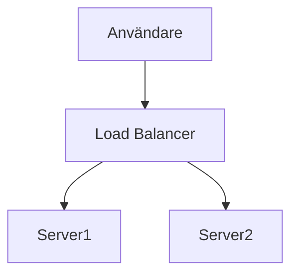

# Markdown Viewer

[English](README.en.md) · [简体中文](README.zh-CN.md) · [繁體中文](README.zh-TW.md) · [Русский](README.ru.md) · [日本語](README.ja.md) · [हिन्दी](README.hi.md) · [한국어](README.ko.md) · [Deutsch](README.de.md) · [Português (Brasil)](README.pt-BR.md) · [Português (Portugal)](README.pt-PT.md) · [Nederlands](README.nl.md) · [Українська](README.uk.md) · [Tiếng Việt](README.vi.md) · [Беларуская](README.be.md) · [Français](README.fr.md) · [Italiano](README.it.md) · [Bahasa Indonesia](README.id.md) · [Español](README.es.md) · [ไทย](README.th.md) · [Svenska](README.sv.md) · [Türkçe](README.tr.md) · [Eesti](README.et.md) · [Bahasa Melayu](README.ms.md) · [Polski](README.pl.md) · [Suomi](README.fi.md) · [Lietuvių](README.lt.md) · [Norsk](README.no.md) · [Dansk](README.da.md)

**Markdown till perfekt Word med ett klick — Mermaid, Graphviz, Vega, infografik, LaTeX (redigerbar), kodmarkering, lokal bearbetning**

*Helt gratis · 18+ professionella teman · 28 språk*

🚀 **Installera nu:** https://chromewebstore.google.com/detail/markdown-viewer/jekhhoflgcfoikceikgeenibinpojaoi

---

Du älskar att skriva i Markdown — rent, effektivt, versionskontrollvänligt.  
Men till slut behöver du alltid ett Word-dokument.

**Den gamla mardrömmen:**

😫 Manuella skärmbilder av flödesscheman · Matematiska formler blir röriga vid kopiering · Manuell kodformatering · Justera tabeller cell för cell · Efter export, en halv timme till för att justera typsnitt, avstånd och färger

**Ett dokument: 1 timme skrivande, 2 timmar formatering.**

---

**Nu tar det bara 1 sekund.**

Klicka för att ladda ner och få ett perfekt Word-dokument:
- ✅ Mermaid-diagram → Högupplösta bilder
- ✅ Graphviz DOT-grafer → Högupplösta bilder
- ✅ LaTeX-formler → Redigerbara Word-formler
- ✅ Automatisk syntaxmarkering (100+ språk)
- ✅ 18+ professionella teman med ett klick
- ✅ Helt gratis, lokal bearbetning

**Ägna tiden åt att skriva, inte åt formatering.**

---

## 💫 Se de faktiska resultaten

### Teknisk dokumentation: 15 flödesscheman, 2 timmar → 5 minuter

**Före:** rita i draw.io → exportera PNG → infoga i Word → justera storlek → upprepa 15 gånger = **2 timmar**

**Nu:** Skriv diagram med Mermaid-kod → klicka för att ladda ner = **5 minuter**

## Systemarkitektur

``````markdown

``````

Behöver ändringar? Ändra kod och exportera igen. **Spara 115 minuter.**

### Akademisk artikel: 50+ formler, 3 timmar → 10 minuter

**Före:** Word formelredigerare en i taget ELLER betald verktygsprenumeration = **3 timmar + Betald prenumeration**

**Nu:** Skriv LaTeX-syntax direkt → klicka för att ladda ner = **10 minuter + Gratis**

Givet massa $m$ och acceleration $a$, enligt Newtons andra lag:

```markdown
$$
F = ma = m\frac{dv}{dt} = m\frac{d^2x}{dt^2}
$$
```

Exporterat som native Word-format, fullt redigerbart. **Inte en bild, utan ett äkta formelobjekt.**

### Teamsamarbete: Veckorapporter, 1 timme → 1 minut

**Före:** Kopiera innehåll → Ställ in format → Justera listor → Lägg till styling → Excel-diagram + skärmbilder = **1 timme per vecka**

**Nu:** Öppna fil → Välj tema → Klicka för att ladda ner = **1 minut**

Välj "Business"-temat, Vega-Lite datadiagram konverteras automatiskt till högupplösta bilder, professionellt utseende. **Spara 59 minuter per vecka.**

**Affärsanvändningsfall:**
- 📊 Försäljningstrender (linjediagram)
- 📈 Marknadsandelsjämförelse (stapeldiagram)
- 🎯 KPI-uppnåelse (mätare)
- 📉 Kostnadsanalys (staplade diagram)

Låt data tala, generera professionella rapporter med ett klick.

---

## 🎯 Tre kärnfunktioner

### 1. Automatisk diagramkonvertering

**Mermaid-diagram** · **Graphviz DOT-grafer** · **Vega/Vega-Lite datadiagram** · **Infographic** · SVG-bilder · Komplexa HTML-tabeller

**Mermaid:** Flödesscheman, sekvensdiagram, klassdiagram, tillståndsdiagram → Tekniska dokument, arkitekturdesign  
**Graphviz DOT:** Riktade och oriktade grafer, tillståndsdiagram, organisationsscheman → Systemarkitektur, dataflöde  
**Vega/Vega-Lite:** Stapeldiagram, linjediagram, spridningsdiagram, värmekarta → Affärsrapporter, dataanalys  
**Infographic:** Statistiska diagram, infografik, datavisualisering → Datapresentation, visuellt berättande

**Tidsjämförelse:** Komplext sekvensdiagram (10 objekt)
- Traditionella verktyg: Rita 30min + Ändra 20min + Justera 10min + Exportera 5min = **65 minuter**
- Markdown Viewer: Skriv kod 5min + Ändra 30sek + Exportera 1sek = **6 minuter**

**Affärsscenario:** Kvartalsvis försäljningsrapport (5 stapeldiagram)
- Excel-diagram + skärmbilder: Välj data 15min + Formatera 10min + Skärmbild 5min = **30 minuter**
- Vega-Lite: JSON-data 2min + Ett-klicks-export = **3 minuter**

**Precist, professionellt, återanvändbart.**

### 2. Perfekt formelkonvertering

LaTeX → Redigerbara Word-formler (inte bilder!)

Efter export kan du:
- ✅ Fortsätta redigera i Word
- ✅ Justera teckenstorlek
- ✅ Ändra symboler och variabler
- ✅ Kopiera till andra dokument

**En formel, två tillvägagångssätt:**
- ❌ Word formelredigerare: Klicka...klicka...klicka...välj symboler...justera positioner
- ✅ LaTeX: `\int_0^\infty e^{-x^2}dx` Klart

### 3. 18+ professionella teman

Olika scenarier, olika stilar, byt med ett klick:

- 📊 Business / Technical → Affärsrapporter, tekniska dokument
- 📚 Academic / Palatino → Akademiska artiklar, bokformatering  
- 🇨🇳 Songti / Heiti / Mixed → Kinesiska dokument
- 🎨 Typewriter / Sakura → Kreativt innehåll

**WYSIWYG:** Förhandsgranskning ser exakt ut som exporterad Word. Ingen gissning, ingen provning.

**Inga manuella justeringar längre:** Typsnitt, storlek, radavstånd, styckeavstånd, kodbakgrundsfärg...

---

## ⚡ Blixtsnabb upplevelse

### Smart cache: Första gången 5s, andra gången 1s

Dokument med 50 Mermaid-diagram:
- **Första öppningen:** Text visas omedelbart, diagram renderas i bakgrunden, allt klart inom 5 sekunder
- **Andra öppningen:** Ladda från cache, omedelbar visning (<1s)
- **Text ändrad:** Fortfarande omedelbart (diagram från cache)
- **Diagram ändrat:** Endast ändrade diagram renderas om

**10x snabbare än Word, 100x mindre filer.**

### Läsförbättringar

- **Tre layouter:** Normal (1000px) / Helskärm / Smal (530px, förhandsgranskning Word-effekt)
- **Flexibel zoom:** 50%-400%, genvägar `Ctrl/Cmd +` `-` `0`
- **Smart innehållsförteckning:** Automatisk extrahering av rubriker, sidopanelnavigering, `Ctrl/Cmd + B` för att växla
- **Positionsminne:** Automatisk sparning av rullningsposition, fortsätt läsa nästa gång
- **Historik:** Spåra nyligen öppnade dokument

---

## 🚀 Snabbstart - 3 steg

### Steg 1: Installera tillägg (30 sekunder)

1. Öppna Chrome-webbläsare
2. Besök Chrome Web Store
3. Sök efter "Markdown Viewer"
4. Klicka "Lägg till i Chrome"
5. ✅ Installation klar

### Steg 2: Tillåt filåtkomst (1 minut)

**Om du vill öppna lokala .md-filer:**

1. Öppna `chrome://extensions/`
2. Hitta Markdown Viewer
3. Aktivera "Tillåt åtkomst till fil-URL:er"
4. ✅ Nu kan du dubbelklicka för att öppna lokala Markdown-filer

**Behövs inte om:**
- Endast visar online-dokument (GitHub, bloggar, etc.)
- Använder webbläsarens "Öppna fil"-funktion

### Snabbstart

**Öppna dokument:** Dubbelklicka .md-filer eller dra till webbläsare · GitHub-dokument automatiskt renderade

**Exportera till Word:** Klicka nedladdningsknapp eller `Ctrl/Cmd + S` → Se framsteg → Automatisk sparning

**Byt teman:** Klicka verktygsfält → Välj tema → Tillämpa omedelbart

**Justera vy:** `+`/`-` zoom · Byt layout · `Ctrl/Cmd + B` innehållsförteckning

---

## 🎁 Kompletta funktioner

### Fullt Markdown-syntaxstöd

Rubriker · Stycken · Fetstil · Kursiv · Genomstruken · Listor · Uppgiftslistor · Citat · Kodblock (100+ språk markerade) · Tabeller · Länkar · Bilder · Mermaid-diagram · Vega / Vega-Lite-diagram · Infographic-diagram · LaTeX-formler · HTML · GFM-tillägg

### 18 teman

**Affärs:** Default · Business · Technical  
**Akademisk:** Academic  
**Serif:** Palatino · Garamond · Cambria · Elegant  
**Sans-serif:** Verdana · Trebuchet · Century  
**Kinesiska:** Songti · Heiti · Mixed  
**Kreativ:** Typewriter · Sakura · Water · Minimal

### 28 gränssnittsspråk

English · 简体中文 · 繁體中文 · Русский · 日本語 · हिन्दी · 한국어 · Deutsch · Português (Brasil) · Português (Portugal) · Nederlands · Українська · Tiếng Việt · Беларуская · Français · Italiano · Bahasa Indonesia · Español · ไทย · Svenska · Türkçe · Eesti · Bahasa Melayu · Polski · Suomi · Lietuvių · Norsk · Dansk

---

## 💎 Konkurrensfördelar

|  | Manuella skärmbilder | CLI-verktyg | Onlinetjänster | Skrivbordsredigerare | Markdown Viewer |
|---|:---:|:---:|:---:|:---:|:---:|
| **Användarvänlighet** | Tråkigt | Kräver inställning | Kräver uppladdning | Kräver installation | ✅ Ett klick |
| **Mermaid** | Manuell skärmbild | Plugin krävs | ✅ Stöds | ✅ Stöds | ✅ Inbyggt stöd |
| **Matematiska formler** | Bilder | Bilder | Bilder | Bilder | ✅ Redigerbar |
| **Integritet** | ✅ Lokal | ✅ Lokal | ❌ Molnuppladdning | ✅ Lokal | ✅ Lokal |
| **Teman** | - | - | 3-5 | 5-10 | ✅ 18+ |
| **Offline** | ✅ | ✅ | ❌ | ✅ | ✅ |
| **GitHub direkt visning** | ❌ | ❌ | ❌ | ❌ | ✅ |
| **Pris** | Gratis | Gratis | Betalda planer | Betalda planer | ✅ Gratis |

**Kärnfördel: Snabbare, billigare, säkrare, kraftfullare.**

---

## ❓ Vanliga frågor

**F: Kan jag redigera det exporterade Word-dokumentet?**  
S: Ja. Standard .docx-format, matematiska formler är redigerbara, inte bilder.

**F: Vilka diagram stöds?**  
S: Alla Mermaid-diagram (flödesschema, sekvens, gantt, klass, tillstånd, cirkel, ER, etc.), Vega / Vega-Lite datavisualiseringsdiagram, Infographic statistiska diagram + SVG automatisk konvertering.

**F: Finns det en filstorleksgräns?**  
S: Ingen gräns. Smart cache, dokument med 100+ diagram öppnas omedelbart.

**F: Krävs internet?**  
S: Nej. Helt lokal bearbetning, fungerar offline.

**F: Kommer mina dokument att laddas upp?**  
S: Aldrig. All bearbetning sker lokalt.

**F: Hur byter jag teman?**  
S: Klicka verktygsfältsikon → Välj tema → Tillämpa omedelbart.

**F: Kan jag anpassa teman?**  
S: För närvarande 18 förinställda teman, anpassning kommer snart.

**F: Kommer stora dokument att bli långsamma?**  
S: Nej. Progressiv laddning + smart cache, text visas omedelbart, diagram renderas i bakgrunden (första 5s, andra 1s).

**F: Tar cache mycket utrymme?**  
S: Standard max 1000 objekt, cirka 500 MB, justerbart eller rensbart i inställningar.

**F: Vilka webbläsare stöds?**  
S: Chrome och Chromium-baserade webbläsare (Edge, Brave, Opera).

**F: Vilka Word-versioner kan öppna den exporterade filen?**  
S: Word 2016+ fullt stöd, Word 2013 fungerar också. Helt kompatibel med WPS Office.

**F: Kan jag exportera till PDF?**  
S: För närvarande endast Word, PDF planerat. Du kan först exportera till Word och sedan spara som PDF.

**F: Vilket tema passar mig?**  
S: Affärsrapporter → Business · Akademiska artiklar → Academic · Tekniska dokument → Technical · Kinesiska dokument → Songti/Mixed

**F: Vad är skillnaden mellan Vega och Mermaid?**  
S: **Mermaid** är för flödesscheman, arkitekturdiagram och andra schematiska diagram; **Vega/Vega-Lite** är för datavisualisering som försäljningsdiagram, finansiella rapporter och andra datadrivna affärsdiagram. De kompletterar varandra för olika scenarier.

**F: Hur skapar jag diagram med Vega-Lite?**  
S: Använd ````vega-lite` kodblock i Markdown med JSON-format diagramspecifikation. Se [Vega-Lite officiella exempel](https://vega.github.io/vega-lite/examples/).

---

## 🔒 Integritetsåtagande

- ✅ All bearbetning görs lokalt, laddas aldrig upp
- ✅ Ingen spårning, ingen insamling av personuppgifter
- ✅ Öppen källkod, granskningsbar och transparent
- ✅ Chrome Web Store säkerhet godkänd (Manifest V3)

**Din integritet är 100% skyddad.**

---

## 🆘 Få hjälp

📖 [Full dokumentation](https://github.com/xicilion/markdown-viewer-extension) · 🐛 [Rapportera problem](https://github.com/xicilion/markdown-viewer-extension/issues) · 💡 [Funktionsförfrågningar](https://github.com/xicilion/markdown-viewer-extension/issues) · ⭐ [GitHub-stjärna](https://github.com/xicilion/markdown-viewer-extension)

---

## 🎉 Kom igång nu

**Installera på 30 sekunder, börja använda omedelbart:**

1. Besök Chrome Web Store → Sök efter "Markdown Viewer"
2. Klicka "Lägg till i Chrome"
3. Klicka "Hantera tillägg", aktivera "Tillåt åtkomst till fil-URL:er"
4. Dra `.md`-filer till webbläsare
5. ✅ Börja använda

**Du får:** Markdown → Word ett-klicks-konvertering · Mermaid automatisk konvertering · LaTeX redigerbara formler · 100+ språk syntaxmarkering · 18+ teman · Smart cache · Helt gratis

**Perfekt för:** Tekniska författare · Studenter/forskare · Produktchefer · Utvecklare · Alla som använder Markdown

---

## 📜 Öppen källkod-licens

Detta projekt är öppen källkod under ISC-licens. Välkommen att ge stjärna, rapportera problem, föreslå funktioner och bidra med kod.

**Projekt-URL:** https://github.com/xicilion/markdown-viewer-extension

---

**Slösa inte din tid på formatering**

**Fokusera på skrivande, låt Markdown Viewer hantera allt annat**

🚀 **Installera nu:** https://chromewebstore.google.com/detail/markdown-viewer/jekhhoflgcfoikceikgeenibinpojaoi

*Helt gratis · Lokal bearbetning · Integritet skyddad*
