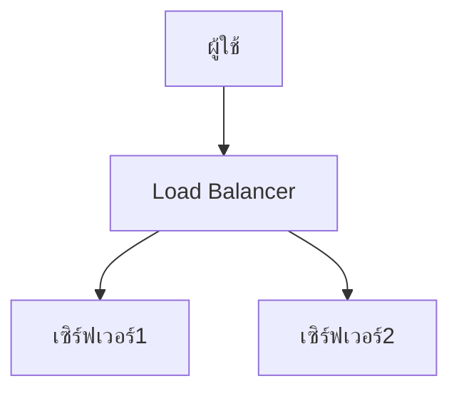

# Markdown Viewer

[English](README.en.md) · [简体中文](README.zh-CN.md) · [繁體中文](README.zh-TW.md) · [Русский](README.ru.md) · [日本語](README.ja.md) · [हिन्दी](README.hi.md) · [한국어](README.ko.md) · [Deutsch](README.de.md) · [Português (Brasil)](README.pt-BR.md) · [Português (Portugal)](README.pt-PT.md) · [Nederlands](README.nl.md) · [Українська](README.uk.md) · [Tiếng Việt](README.vi.md) · [Беларуская](README.be.md) · [Français](README.fr.md) · [Italiano](README.it.md) · [Bahasa Indonesia](README.id.md) · [Español](README.es.md) · [ไทย](README.th.md) · [Svenska](README.sv.md) · [Türkçe](README.tr.md) · [Eesti](README.et.md) · [Bahasa Melayu](README.ms.md) · [Polski](README.pl.md) · [Suomi](README.fi.md) · [Lietuvių](README.lt.md) · [Norsk](README.no.md) · [Dansk](README.da.md)

**Markdown สู่ Word สมบูรณ์แบบในคลิกเดียว — Mermaid, Graphviz, Vega, อินโฟกราฟิก, LaTeX (แก้ไขได้), ไฮไลท์โค้ด, ประมวลผลในเครื่อง**

*ฟรีโดยสมบูรณ์ · 18+ ธีมระดับมืออาชีพ · รองรับ 28 ภาษา*

🚀 **ติดตั้งเลย:** https://chromewebstore.google.com/detail/markdown-viewer/jekhhoflgcfoikceikgeenibinpojaoi

---

คุณชอบเขียนด้วย Markdown — สะอาด มีประสิทธิภาพ เป็นมิตรกับการควบคุมเวอร์ชัน  
แต่ท้ายที่สุดคุณมักต้องการเอกสาร Word เสมอ

**ฝันร้ายในอดีต:**

😫 จับภาพหน้าจอผังงานด้วยตนเอง · สูตรคณิตศาสตร์คัดลอกแล้วเละ · จัดรูปแบบโค้ดด้วยตนเอง · ปรับตารางทีละเซลล์ · หลังส่งออกยังต้องใช้เวลาครึ่งชั่วโมงปรับแต่งฟอนต์ ระยะห่าง และสี

**เอกสารหนึ่งฉบับ: เขียน 1 ชั่วโมง จัดรูปแบบ 2 ชั่วโมง**

---

**ตอนนี้ใช้เวลาเพียง 1 วินาที**

คลิกดาวน์โหลดและได้เอกสาร Word ที่สมบูรณ์แบบ:
- ✅ ไดอะแกรม Mermaid → ภาพความละเอียดสูง
- ✅ Graphviz DOT → ภาพความละเอียดสูง
- ✅ สูตร LaTeX → สมการ Word ที่แก้ไขได้
- ✅ ไฮไลต์ไวยากรณ์อัตโนมัติ (100+ ภาษา)
- ✅ ธีมมืออาชีพ 18+ แบบด้วยคลิกเดียว
- ✅ ฟรีทั้งหมด ประมวลผลในเครื่อง

**ใช้เวลากับการเขียน ไม่ใช่การจัดรูปแบบ**

---

## 💫 ดูผลลัพธ์จริง

### เอกสารทางเทคนิค: ผังงาน 15 อัน, 2 ชั่วโมง → 5 นาที

**ก่อนหน้า:** วาดด้วย draw.io → ส่งออก PNG → แทรกใน Word → ปรับขนาด → ทำซ้ำ 15 ครั้ง = **2 ชั่วโมง**

**ตอนนี้:** เขียนไดอะแกรมด้วยโค้ด Mermaid → คลิกดาวน์โหลด = **5 นาที**

## สถาปัตยกรรมระบบ

``````markdown

``````

ต้องการเปลี่ยนแปลง? แก้ไขโค้ดและส่งออกใหม่ **ประหยัด 115 นาที**

### บทความวิชาการ: สูตร 50+ อัน, 3 ชั่วโมง → 10 นาที

**ก่อนหน้า:** ตัวแก้ไขสมการ Word ทีละอัน หรือ สมัครสมาชิกเครื่องมือแบบเสียเงิน = **3 ชั่วโมง + สมัครสมาชิกแบบเสียเงิน**

**ตอนนี้:** เขียนไวยากรณ์ LaTeX โดยตรง → คลิกดาวน์โหลด = **10 นาที + ฟรี**

กำหนดมวล $m$ และความเร่ง $a$ ตามกฎข้อที่สองของนิวตัน:

```markdown
$$
F = ma = m\frac{dv}{dt} = m\frac{d^2x}{dt^2}
$$
```

ส่งออกเป็นรูปแบบ Word ดั้งเดิม แก้ไขได้อย่างสมบูรณ์ **ไม่ใช่รูปภาพ แต่เป็นวัตถุสมการจริง**

### การทำงานร่วมกันในทีม: รายงานรายสัปดาห์, 1 ชั่วโมง → 1 นาที

**ก่อนหน้า:** คัดลอกเนื้อหา → ตั้งค่ารูปแบบ → ปรับรายการ → เพิ่มสไตล์ → แผนภูมิ Excel + จับภาพหน้าจอ = **1 ชั่วโมงต่อสัปดาห์**

**ตอนนี้:** เปิดไฟล์ → เลือกธีม → คลิกดาวน์โหลด = **1 นาที**

เลือกธีม "Business" แผนภูมิข้อมูล Vega-Lite แปลงเป็นภาพความละเอียดสูงโดยอัตโนมัติ ดูมืออาชีพ **ประหยัด 59 นาทีต่อสัปดาห์**

**กรณีการใช้งานทางธุรกิจ:**
- 📊 แนวโน้มการขาย (แผนภูมิเส้น)
- 📈 เปรียบเทียบส่วนแบ่งตลาด (แผนภูมิแท่ง)
- 🎯 การบรรลุ KPI (มาตรวัด)
- 📉 การวิเคราะห์ต้นทุน (แผนภูมิแบบเรียงซ้อน)

ปล่อยให้ข้อมูลพูด สร้างรายงานมืออาชีพด้วยคลิกเดียว

---

## 🎯 ฟีเจอร์หลักสามอย่าง

### 1. การแปลงไดอะแกรมอัตโนมัติ

**ไดอะแกรม Mermaid** · **Graphviz DOT** · **แผนภูมิข้อมูล Vega/Vega-Lite** · **Infographic** · ภาพ SVG · ตาราง HTML ที่ซับซ้อน

**Mermaid:** ผังงาน แผนภาพลำดับ แผนภาพคลาส แผนภาพสถานะ → เอกสารทางเทคนิค การออกแบบสถาปัตยกรรม  
**Graphviz DOT:** กราฟแบบมีทิศทาง/ไม่มีทิศทาง โทโพโลยีเครือข่าย เครื่องจักรสถานะ → สถาปัตยกรรมระบบ การวิเคราะห์การพึ่งพา  
**Vega/Vega-Lite:** แผนภูมิแท่ง แผนภูมิเส้น แผนภูมิกระจาย แผนที่ความร้อน → รายงานธุรกิจ การวิเคราะห์ข้อมูล  
**Infographic:** แผนภูมิสถิติ อินโฟกราฟิก การแสดงภาพข้อมูล → การนำเสนอข้อมูล การเล่าเรื่องด้วยภาพ

**เปรียบเทียบเวลา:** แผนภาพลำดับที่ซับซ้อน (10 วัตถุ)
- เครื่องมือแบบดั้งเดิม: วาด 30นาที + แก้ไข 20นาที + ปรับแต่ง 10นาที + ส่งออก 5นาที = **65 นาที**
- Markdown Viewer: เขียนโค้ด 5นาที + แก้ไข 30วิ + ส่งออก 1วิ = **6 นาที**

**สถานการณ์ทางธุรกิจ:** รายงานการขายรายไตรมาส (แผนภูมิแท่ง 5 อัน)
- แผนภูมิ Excel + จับภาพหน้าจอ: เลือกข้อมูล 15นาที + จัดรูปแบบ 10นาที + จับภาพหน้าจอ 5นาที = **30 นาที**
- Vega-Lite: ข้อมูล JSON 2นาที + ส่งออกคลิกเดียว = **3 นาที**

**แม่นยำ มืออาชีพ นำกลับมาใช้ได้**

### 2. การแปลงสูตรที่สมบูรณ์แบบ

LaTeX → สมการ Word ที่แก้ไขได้ (ไม่ใช่รูปภาพ!)

หลังจากส่งออก คุณสามารถ:
- ✅ แก้ไขต่อใน Word
- ✅ ปรับขนาดฟอนต์
- ✅ แก้ไขสัญลักษณ์และตัวแปร
- ✅ คัดลอกไปยังเอกสารอื่น

**สูตรหนึ่งอัน สองแนวทาง:**
- ❌ ตัวแก้ไขสมการ Word: คลิก...คลิก...คลิก...เลือกสัญลักษณ์...ปรับตำแหน่ง
- ✅ LaTeX: `\int_0^\infty e^{-x^2}dx` เสร็จสิ้น

### 3. ธีมมืออาชีพ 18+ แบบ

สถานการณ์ต่างกัน สไตล์ต่างกัน สลับด้วยคลิกเดียว:

- 📊 Business / Technical → รายงานธุรกิจ เอกสารทางเทคนิค
- 📚 Academic / Palatino → บทความวิชาการ การเรียงพิมพ์หนังสือ  
- 🇨🇳 Songti / Heiti / Mixed → เอกสารภาษาจีน
- 🎨 Typewriter / Sakura → เนื้อหาสร้างสรรค์

**WYSIWYG:** ตัวอย่างดูเหมือน Word ที่ส่งออกทุกประการ ไม่ต้องเดา ไม่ต้องลอง

**ไม่ต้องปรับแต่งด้วยตนเองอีกต่อไป:** ฟอนต์ ขนาด ระยะห่างบรรทัด ระยะห่างย่อหน้า สีพื้นหลังโค้ด...

---

## ⚡ ประสบการณ์เร็วสุดๆ

### แคชอัจฉริยะ: ครั้งแรก 5 วินาที ครั้งที่สอง 1 วินาที

เอกสารที่มีไดอะแกรม Mermaid 50 อัน:
- **เปิดครั้งแรก:** ข้อความแสดงทันที ไดอะแกรมแสดงผลในพื้นหลัง ทั้งหมดเสร็จภายใน 5 วินาที
- **เปิดครั้งที่สอง:** โหลดจากแคช แสดงทันที (<1วิ)
- **แก้ไขข้อความ:** ยังคงทันที (ไดอะแกรมจากแคช)
- **แก้ไขไดอะแกรม:** แสดงผลใหม่เฉพาะไดอะแกรมที่เปลี่ยนแปลง

**เร็วกว่า Word 10 เท่า ไฟล์เล็กกว่า 100 เท่า**

### การปรับปรุงการอ่าน

- **เค้าโครงสามแบบ:** ปกติ (1000px) / เต็มหน้าจอ / แคบ (530px, ตัวอย่างเอฟเฟกต์ Word)
- **ซูมที่ยืดหยุ่น:** 50%-400% แป้นพิมพ์ลัด `Ctrl/Cmd +` `-` `0`
- **สารบัญอัจฉริยะ:** สกัดหัวข้ออัตโนมัติ การนำทางแถบด้านข้าง `Ctrl/Cmd + B` เพื่อสลับ
- **ความจำตำแหน่ง:** บันทึกตำแหน่งการเลื่อนอัตโนมัติ อ่านต่อในครั้งถัดไป
- **ประวัติ:** ติดตามเอกสารที่เปิดล่าสุด

---

## 🚀 เริ่มต้นอย่างรวดเร็ว - 3 ขั้นตอน

### ขั้นตอนที่ 1: ติดตั้งส่วนขยาย (30 วินาที)

1. เปิดเบราว์เซอร์ Chrome
2. เยี่ยมชม Chrome Web Store
3. ค้นหา "Markdown Viewer"
4. คลิก "เพิ่มไปยัง Chrome"
5. ✅ การติดตั้งเสร็จสมบูรณ์

### ขั้นตอนที่ 2: อนุญาตการเข้าถึงไฟล์ (1 นาที)

**หากคุณต้องการเปิดไฟล์ .md ในเครื่อง:**

1. เปิด `chrome://extensions/`
2. ค้นหา Markdown Viewer
3. เปิดใช้งาน "อนุญาตการเข้าถึง URL ของไฟล์"
4. ✅ ตอนนี้คุณสามารถดับเบิลคลิกเพื่อเปิดไฟล์ Markdown ในเครื่อง

**ไม่จำเป็นหาก:**
- ดูเฉพาะเอกสารออนไลน์ (GitHub บล็อก ฯลฯ)
- ใช้ฟังก์ชัน "เปิดไฟล์" ของเบราว์เซอร์

### เริ่มต้นอย่างรวดเร็ว

**เปิดเอกสาร:** ดับเบิลคลิกไฟล์ .md หรือลากไปที่เบราว์เซอร์ · เอกสาร GitHub แสดงผลอัตโนมัติ

**ส่งออกเป็น Word:** คลิกปุ่มดาวน์โหลดหรือ `Ctrl/Cmd + S` → ดูความคืบหน้า → บันทึกอัตโนมัติ

**สลับธีม:** คลิกแถบเครื่องมือ → เลือกธีม → ใช้ทันที

**ปรับมุมมอง:** `+`/`-` ซูม · สลับเค้าโครง · `Ctrl/Cmd + B` สารบัญ

---

## 🎁 ฟีเจอร์ครบครัน

### รองรับไวยากรณ์ Markdown อย่างสมบูรณ์

หัวเรื่อง · ย่อหน้า · ตัวหนา · ตัวเอียง · ขีดฆ่า · รายการ · รายการงาน · คำพูดอ้างอิง · บล็อกโค้ด (ไฮไลต์ 100+ ภาษา) · ตาราง · ลิงก์ · รูปภาพ · ไดอะแกรม Mermaid · แผนภูมิ Vega / Vega-Lite · แผนภูมิ Infographic · สูตร LaTeX · HTML · ส่วนขยาย GFM

### ธีม 18 แบบ

**ธุรกิจ:** Default · Business · Technical  
**วิชาการ:** Academic  
**Serif:** Palatino · Garamond · Cambria · Elegant  
**Sans-serif:** Verdana · Trebuchet · Century  
**จีน:** Songti · Heiti · Mixed  
**สร้างสรรค์:** Typewriter · Sakura · Water · Minimal

### 28 ภาษาอินเทอร์เฟซ

English · 简体中文 · 繁體中文 · Русский · 日本語 · हिन्दी · 한국어 · Deutsch · Português (Brasil) · Português (Portugal) · Nederlands · Українська · Tiếng Việt · Беларуская · Français · Italiano · Bahasa Indonesia · Español · ไทย · Svenska · Türkçe · Eesti · Bahasa Melayu · Polski · Suomi · Lietuvių · Norsk · Dansk

---

## 💎 ข้อได้เปรียบในการแข่งขัน

|  | จับภาพหน้าจอด้วยตนเอง | เครื่องมือ CLI | บริการออนไลน์ | โปรแกรมแก้ไขบนเดสก์ท็อป | Markdown Viewer |
|---|:---:|:---:|:---:|:---:|:---:|
| **ความง่ายในการใช้งาน** | น่าเบื่อ | ต้องตั้งค่า | ต้องอัปโหลด | ต้องติดตั้ง | ✅ คลิกเดียว |
| **Mermaid** | จับภาพหน้าจอด้วยตนเอง | ต้องใช้ปลั๊กอิน | ✅ รองรับ | ✅ รองรับ | ✅ รองรับแบบดั้งเดิม |
| **สูตรคณิตศาสตร์** | รูปภาพ | รูปภาพ | รูปภาพ | รูปภาพ | ✅ แก้ไขได้ |
| **ความเป็นส่วนตัว** | ✅ ในเครื่อง | ✅ ในเครื่อง | ❌ อัปโหลดบนคลาวด์ | ✅ ในเครื่อง | ✅ ในเครื่อง |
| **ธีม** | - | - | 3-5 | 5-10 | ✅ 18+ |
| **ออฟไลน์** | ✅ | ✅ | ❌ | ✅ | ✅ |
| **ดู GitHub โดยตรง** | ❌ | ❌ | ❌ | ❌ | ✅ |
| **ราคา** | ฟรี | ฟรี | แผนแบบเสียเงิน | แผนแบบเสียเงิน | ✅ ฟรี |

**ข้อได้เปรียบหลัก: เร็วกว่า ถูกกว่า ปลอดภัยกว่า ทรงพลังกว่า**

---

## ❓ คำถามที่พบบ่อย

**ถาม: ฉันสามารถแก้ไขเอกสาร Word ที่ส่งออกได้หรือไม่?**  
ตอบ: ได้ รูปแบบ .docx มาตรฐาน สูตรคณิตศาสตร์แก้ไขได้ ไม่ใช่รูปภาพ

**ถาม: รองรับไดอะแกรมอะไรบ้าง?**  
ตอบ: ไดอะแกรม Mermaid ทั้งหมด (ผังงาน ลำดับ gantt คลาส สถานะ วงกลม ER ฯลฯ) แผนภูมิการแสดงข้อมูล Vega / Vega-Lite แผนภูมิสถิติ Infographic + การแปลง SVG อัตโนมัติ

**ถาม: มีข้อจำกัดเรื่องขนาดไฟล์หรือไม่?**  
ตอบ: ไม่มีข้อจำกัด แคชอัจฉริยะ เอกสารที่มีไดอะแกรม 100+ อันเปิดได้ทันที

**ถาม: ต้องการอินเทอร์เน็ตหรือไม่?**  
ตอบ: ไม่ต้อง ประมวลผลในเครื่องทั้งหมด ทำงานแบบออฟไลน์

**ถาม: เอกสารของฉันจะถูกอัปโหลดหรือไม่?**  
ตอบ: ไม่เลย การประมวลผลทั้งหมดเกิดขึ้นในเครื่อง

**ถาม: จะสลับธีมได้อย่างไร?**  
ตอบ: คลิกไอคอนแถบเครื่องมือ → เลือกธีม → ใช้ทันที

**ถาม: ฉันสามารถปรับแต่งธีมได้หรือไม่?**  
ตอบ: ปัจจุบันมี 18 ธีมที่ตั้งไว้ล่วงหน้า การปรับแต่งกำลังจะมา

**ถาม: เอกสารขนาดใหญ่จะช้าหรือไม่?**  
ตอบ: ไม่ การโหลดแบบค่อยเป็นค่อยไป + แคชอัจฉริยะ ข้อความแสดงทันที ไดอะแกรมแสดงผลในพื้นหลัง (ครั้งแรก 5วิ ครั้งที่สอง 1วิ)

**ถาม: แคชใช้พื้นที่มากหรือไม่?**  
ตอบ: ค่าเริ่มต้นสูงสุด 1000 รายการ ประมาณ 500 MB ปรับหรือล้างได้ในการตั้งค่า

**ถาม: รองรับเบราว์เซอร์ใดบ้าง?**  
ตอบ: Chrome และเบราว์เซอร์ที่ใช้ Chromium (Edge, Brave, Opera)

**ถาม: เวอร์ชัน Word ไหนสามารถเปิดไฟล์ที่ส่งออกได้?**  
ตอบ: Word 2016+ รองรับอย่างเต็มที่ Word 2013 ก็ใช้ได้ เข้ากันได้อย่างสมบูรณ์กับ WPS Office

**ถาม: ฉันสามารถส่งออกเป็น PDF ได้หรือไม่?**  
ตอบ: ปัจจุบันเฉพาะ Word, PDF อยู่ในแผน คุณสามารถส่งออกเป็น Word ก่อนแล้วบันทึกเป็น PDF

**ถาม: ธีมไหนเหมาะกับฉัน?**  
ตอบ: รายงานธุรกิจ → Business · บทความวิชาการ → Academic · เอกสารทางเทคนิค → Technical · เอกสารภาษาจีน → Songti/Mixed

**ถาม: ความแตกต่างระหว่าง Vega และ Mermaid คืออะไร?**  
ตอบ: **Mermaid** สำหรับผังงาน แผนภาพสถาปัตยกรรม และไดอะแกรมเชิงแผนผังอื่นๆ **Vega/Vega-Lite** สำหรับการแสดงข้อมูลเช่นแผนภูมิการขาย รายงานทางการเงิน และแผนภูมิธุรกิจที่ขับเคลื่อนด้วยข้อมูลอื่นๆ ทั้งสองเสริมกันสำหรับสถานการณ์ที่แตกต่างกัน

**ถาม: จะสร้างแผนภูมิด้วย Vega-Lite ได้อย่างไร?**  
ตอบ: ใช้บล็อกโค้ด ````vega-lite` ใน Markdown พร้อมข้อกำหนดแผนภูมิรูปแบบ JSON ดู [ตัวอย่างอย่างเป็นทางการของ Vega-Lite](https://vega.github.io/vega-lite/examples/)

---

## 🔒 คำมั่นสัญญาด้านความเป็นส่วนตัว

- ✅ การประมวลผลทั้งหมดทำในเครื่อง ไม่มีการอัปโหลด
- ✅ ไม่มีการติดตาม ไม่มีการรวบรวมข้อมูลส่วนบุคคล
- ✅ โค้ดโอเพนซอร์ส ตรวจสอบได้และโปร่งใส
- ✅ ความปลอดภัย Chrome Web Store อนุมัติแล้ว (Manifest V3)

**ความเป็นส่วนตัวของคุณได้รับการปกป้อง 100%**

---

## 🆘 รับความช่วยเหลือ

📖 [เอกสารฉบับเต็ม](https://github.com/xicilion/markdown-viewer-extension) · 🐛 [รายงานปัญหา](https://github.com/xicilion/markdown-viewer-extension/issues) · 💡 [คำขอฟีเจอร์](https://github.com/xicilion/markdown-viewer-extension/issues) · ⭐ [ให้ดาว GitHub](https://github.com/xicilion/markdown-viewer-extension)

---

## 🎉 เริ่มต้นเลย

**ติดตั้งใน 30 วินาที เริ่มใช้งานทันที:**

1. เยี่ยมชม Chrome Web Store → ค้นหา "Markdown Viewer"
2. คลิก "เพิ่มไปยัง Chrome"
3. คลิก "จัดการส่วนขยาย" เปิดใช้งาน "อนุญาตให้เข้าถึง URL ไฟล์"
4. ลากไฟล์ `.md` ไปที่เบราว์เซอร์
5. ✅ เริ่มใช้งาน

**คุณจะได้รับ:** การแปลง Markdown → Word คลิกเดียว · การแปลง Mermaid อัตโนมัติ · สูตร LaTeX ที่แก้ไขได้ · ไฮไลต์ไวยากรณ์ 100+ ภาษา · ธีม 18+ แบบ · แคชอัจฉริยะ · ฟรีทั้งหมด

**เหมาะสำหรับ:** นักเขียนด้านเทคนิค · นักเรียน/นักวิจัย · ผู้จัดการผลิตภัณฑ์ · นักพัฒนา · ทุกคนที่ใช้ Markdown

---

## 📜 ใบอนุญาตโอเพนซอร์ส

โครงการนี้เป็นโอเพนซอร์สภายใต้ใบอนุญาต ISC ยินดีต้อนรับการให้ดาว รายงานปัญหา เสนอแนะฟีเจอร์ และมีส่วนร่วมในโค้ด

**URL โครงการ:** https://github.com/xicilion/markdown-viewer-extension

---

**อย่าเสียเวลากับการจัดรูปแบบ**

**มุ่งเน้นที่การเขียน ปล่อยให้ Markdown Viewer จัดการที่เหลือทั้งหมด**

🚀 **ติดตั้งเลย:** https://chromewebstore.google.com/detail/markdown-viewer/jekhhoflgcfoikceikgeenibinpojaoi

*ฟรีทั้งหมด · ประมวลผลในเครื่อง · ความเป็นส่วนตัวได้รับการปกป้อง*
