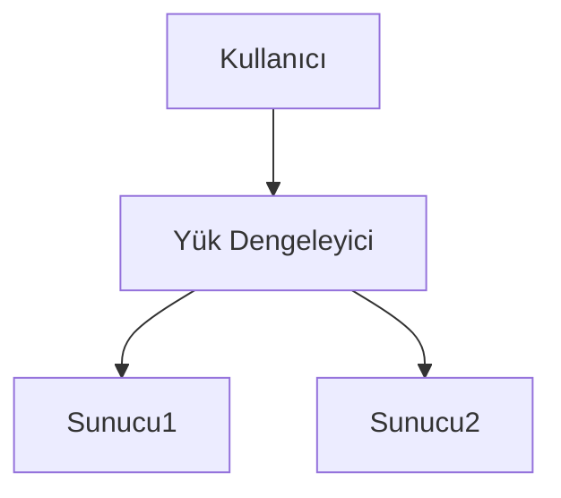

# Markdown Viewer

[简体中文](README.zh-CN.md) · [繁體中文](README.zh-TW.md) · [English](README.en.md) · [Русский](README.ru.md) · [日本語](README.ja.md) · [한국어](README.ko.md) · [Português (Brasil)](README.pt-BR.md) · [Português (Portugal)](README.pt-PT.md) · [Español](README.es.md) · [Deutsch](README.de.md) · [Français](README.fr.md) · [Українська](README.uk.md) · [Tiếng Việt](README.vi.md) · [Italiano](README.it.md) · [Türkçe](README.tr.md) · [Bahasa Indonesia](README.id.md) · [Lietuvių](README.lt.md) · [Nederlands](README.nl.md) · [Suomi](README.fi.md) · [ไทย](README.th.md) · [Polski](README.pl.md) · [हिन्दी](README.hi.md) · [Svenska](README.sv.md) · [Norsk](README.no.md) · [Dansk](README.da.md)

**Markdown ile yazın, tek tıkla mükemmel Word'e aktarın.**

*Tamamen ücretsiz · Yerel işleme · 18+ profesyonel tema · 25 dil desteği*

🚀 **Şimdi Yükleyin:** https://chromewebstore.google.com/detail/markdown-viewer/jekhhoflgcfoikceikgeenibinpojaoi

---

Markdown ile yazmayı seviyorsunuz — temiz, verimli, sürüm kontrolüne uygun.  
Ama sonunda her zaman bir Word belgesine ihtiyacınız oluyor.

**Eski kabus:**

😫 Akış şemalarının manuel ekran görüntüleri · Kopyala-yapıştır formüller karmaşık hale geliyor · Kodu manuel olarak biçimlendirme · Tabloları hücre hücre ayarlama · Dışa aktardıktan sonra yazı tiplerini, aralıkları ve renkleri ayarlamak için yarım saat daha

**Bir belge: 1 saat yazma, 2 saat biçimlendirme.**

---

**Şimdi sadece 1 saniye sürüyor.**

İndirmek için tıklayın ve mükemmel bir Word belgesi alın:
- ✅ Mermaid diyagramları → Yüksek çözünürlüklü görüntüler
- ✅ Graphviz DOT grafikleri → Yüksek çözünürlüklü görüntüler
- ✅ LaTeX formülleri → Düzenlenebilir Word denklemleri
- ✅ Otomatik sözdizimi vurgulama (100+ dil)
- ✅ Tek tıkla 18+ profesyonel tema
- ✅ Tamamen ücretsiz, yerel işleme

**Zamanınızı yazmaya ayırın, biçimlendirmeye değil.**

---

## 💫 Gerçek sonuçları görün

### Teknik dokümantasyon: 15 akış şeması, 2 saat → 5 dakika

**Önce:** draw.io ile çizim → PNG dışa aktar → Word'e ekle → boyutu ayarla → 15 kez tekrarla = **2 saat**

**Şimdi:** Mermaid koduyla diyagram yaz → indirmek için tıkla = **5 dakika**

## Sistem Mimarisi

``````markdown

``````

Değişiklik mi gerekiyor? Kodu değiştir ve yeniden dışa aktar. **115 dakika tasarruf edin.**

### Akademik makale: 50+ formül, 3 saat → 10 dakika

**Önce:** Word denklem düzenleyici tek tek VEYA ücretli araç aboneliği = **3 saat + Ücretli abonelik**

**Şimdi:** LaTeX sözdizimini doğrudan yaz → indirmek için tıkla = **10 dakika + Ücretsiz**

Kütle $m$ ve ivme $a$ verildiğinde, Newton'un ikinci yasasına göre:

```markdown
$$
F = ma = m\frac{dv}{dt} = m\frac{d^2x}{dt^2}
$$
```

Yerel Word biçiminde dışa aktarıldı, tamamen düzenlenebilir. **Bir görüntü değil, gerçek bir denklem nesnesi.**

### Ekip işbirliği: Haftalık raporlar, 1 saat → 1 dakika

**Önce:** İçeriği kopyala → Biçimi ayarla → Listeleri ayarla → Stil ekle → Excel grafikleri + ekran görüntüleri = **Haftada 1 saat**

**Şimdi:** Dosyayı aç → Tema seç → İndirmek için tıkla = **1 dakika**

"Business" temasını seçin, Vega-Lite veri grafikleri otomatik olarak yüksek çözünürlüklü görüntülere dönüştürülür, profesyonel görünüm. **Haftada 59 dakika tasarruf edin.**

**İş kullanım örnekleri:**
- 📊 Satış trendleri (çizgi grafikler)
- 📈 Pazar payı karşılaştırması (çubuk grafikler)
- 🎯 KPI başarısı (göstergeler)
- 📉 Maliyet analizi (yığılmış grafikler)

Verilerin konuşmasına izin verin, tek tıkla profesyonel raporlar oluşturun.

---

## 🎯 Üç Temel Özellik

### 1. Otomatik Diyagram Dönüştürme

**Mermaid Diyagramları** · **Graphviz DOT** · **Vega/Vega-Lite Veri Grafikleri** · **Infographic** · SVG görselleri · Karmaşık HTML tabloları

**Mermaid:** Akış şemaları, sıra diyagramları, sınıf diyagramları, durum diyagramları → Teknik belgeler, mimari tasarım  
**Graphviz DOT:** Yönlendirilmiş/yönlendirilmemiş graflar, ağ topolojisi, durum makineleri → Sistem mimarisi, bağımlılık analizi  
**Vega/Vega-Lite:** Çubuk grafikler, çizgi grafikler, dağılım grafikleri, ısı haritaları → İş raporları, veri analizi  
**Infographic:** İstatistiksel grafikler, infografikler, veri görselleştirme → Veri sunumu, görsel hikaye anlatımı

**Zaman karşılaştırması:** Karmaşık sıra diyagramı (10 nesne)
- Geleneksel araçlar: Çizim 30dk + Değiştirme 20dk + Ayarlama 10dk + Dışa aktarma 5dk = **65 dakika**
- Markdown Viewer: Kod yazma 5dk + Değiştirme 30sn + Dışa aktarma 1sn = **6 dakika**

**İş senaryosu:** Üç aylık satış raporu (5 çubuk grafik)
- Excel grafikleri + ekran görüntüleri: Veri seçme 15dk + Biçimlendirme 10dk + Ekran görüntüsü 5dk = **30 dakika**
- Vega-Lite: JSON verisi 2dk + Tek tıkla dışa aktarma = **3 dakika**

**Hassas, profesyonel, yeniden kullanılabilir.**

### 2. Mükemmel Formül Dönüştürme

LaTeX → Düzenlenebilir Word denklemleri (görüntü değil!)

Dışa aktardıktan sonra yapabilirsiniz:
- ✅ Word'de düzenlemeye devam edin
- ✅ Yazı tipi boyutunu ayarlayın
- ✅ Sembolleri ve değişkenleri değiştirin
- ✅ Diğer belgelere kopyalayın

**Bir formül, iki yaklaşım:**
- ❌ Word denklem düzenleyici: Tıkla...tıkla...tıkla...sembolleri seç...konumları ayarla
- ✅ LaTeX: `\int_0^\infty e^{-x^2}dx` Bitti

### 3. 18+ Profesyonel Tema

Farklı senaryolar, farklı stiller, tek tıkla geçiş yapın:

- 📊 Business / Technical → İş raporları, teknik belgeler
- 📚 Academic / Palatino → Akademik makaleler, kitap dizgisi  
- 🇨🇳 Songti / Heiti / Mixed → Çince belgeler
- 🎨 Typewriter / Sakura → Yaratıcı içerik

**WYSIWYG:** Önizleme, dışa aktarılan Word ile tam olarak aynı görünür. Tahmin yok, deneme yok.

**Artık manuel ayarlamaya gerek yok:** Yazı tipi, boyut, satır aralığı, paragraf aralığı, kod arka plan rengi...

---

## ⚡ Yıldırım Hızı Deneyim

### Akıllı Önbellek: İlk seferde 5s, ikincisinde 1s

50 Mermaid diyagramlı belge:
- **İlk açılış:** Metin anında gösterilir, diyagramlar arka planda oluşturulur, 5 saniye içinde tamamlanır
- **İkinci açılış:** Önbellekten yükle, anında gösterim (<1s)
- **Metin değiştirildi:** Hala anında (diyagramlar önbellekten)
- **Diyagram değiştirildi:** Yalnızca değiştirilen diyagramlar yeniden oluşturulur

**Word'den 10 kat daha hızlı, 100 kat daha küçük dosyalar.**

### Okuma İyileştirmeleri

- **Üç düzen:** Normal (1000px) / Tam ekran / Dar (530px, Word efekti önizlemesi)
- **Esnek yakınlaştırma:** %50-400, kısayollar `Ctrl/Cmd +` `-` `0`
- **Akıllı içindekiler:** Başlıkları otomatik çıkarma, kenar çubuğu gezinme, `Ctrl/Cmd + B` ile değiştirme
- **Konum hafızası:** Kaydırma konumunu otomatik kaydetme, bir dahaki sefere okumaya devam etme
- **Geçmiş:** Son açılan belgeleri takip etme

---

## 🚀 Hızlı Başlangıç - 3 Adım

### Adım 1: Uzantıyı Yükleyin (30 saniye)

1. Chrome tarayıcısını açın
2. Chrome Web Store'u ziyaret edin
3. "Markdown Viewer" araması yapın
4. "Chrome'a Ekle"ye tıklayın
5. ✅ Kurulum tamamlandı

### Adım 2: Dosya Erişimine İzin Verin (1 dakika)

**Yerel .md dosyalarını açmak istiyorsanız:**

1. `chrome://extensions/` açın
2. Markdown Viewer'ı bulun
3. "Dosya URL'lerine erişime izin ver"i etkinleştirin
4. ✅ Artık yerel Markdown dosyalarını çift tıklayarak açabilirsiniz

**Gerekli değilse:**
- Yalnızca çevrimiçi belgeleri görüntülüyorsanız (GitHub, bloglar vb.)
- Tarayıcının "Dosya Aç" işlevini kullanıyorsanız

### Hızlı Başlangıç

**Belgeleri açın:** .md dosyalarını çift tıklayın veya tarayıcıya sürükleyin · GitHub belgeleri otomatik olarak oluşturulur

**Word'e aktarın:** İndirme düğmesine tıklayın veya `Ctrl/Cmd + S` → İlerlemeyi görün → Otomatik kaydetme

**Temaları değiştirin:** Araç çubuğuna tıklayın → Tema seçin → Hemen uygulayın

**Görünümü ayarlayın:** `+`/`-` yakınlaştırma · Düzen değiştirme · `Ctrl/Cmd + B` içindekiler

---

## 🎁 Eksiksiz Özellikler

### Tam Markdown Sözdizimi Desteği

Başlıklar · Paragraflar · Kalın · İtalik · Üstü çizili · Listeler · Görev listeleri · Alıntılar · Kod blokları (100+ dil vurgulanmış) · Tablolar · Bağlantılar · Resimler · Mermaid diyagramları · Vega / Vega-Lite grafikleri · Infographic grafikleri · LaTeX formülleri · HTML · GFM uzantıları

### 18 Tema

**İş:** Default · Business · Technical  
**Akademik:** Academic  
**Serif:** Palatino · Garamond · Cambria · Elegant  
**Sans-serif:** Verdana · Trebuchet · Century  
**Çince:** Songti · Heiti · Mixed  
**Yaratıcı:** Typewriter · Sakura · Water · Minimal

### 25 Arayüz Dili

简体中文 · 繁體中文 · English · Русский · 日本語 · 한국어 · Português (Brasil) · Português (Portugal) · Español · Deutsch · Français · Українська · Tiếng Việt · Italiano · Türkçe · Bahasa Indonesia · Lietuvių · Nederlands · Suomi · ไทย · Polski · हिन्दी · Svenska · Norsk · Dansk

---

## 💎 Rekabet Avantajları

|  | Manuel Ekran Görüntüleri | CLI Araçları | Çevrimiçi Hizmetler | Masaüstü Düzenleyiciler | Markdown Viewer |
|---|:---:|:---:|:---:|:---:|:---:|
| **Kullanım Kolaylığı** | Sıkıcı | Kurulum gerekli | Yükleme gerekli | Kurulum gerekli | ✅ Tek tık |
| **Mermaid** | Manuel ekran görüntüsü | Eklenti gerekli | ✅ Destekleniyor | ✅ Destekleniyor | ✅ Yerel destek |
| **Matematik Formülleri** | Görüntüler | Görüntüler | Görüntüler | Görüntüler | ✅ Düzenlenebilir |
| **Gizlilik** | ✅ Yerel | ✅ Yerel | ❌ Buluta yükleme | ✅ Yerel | ✅ Yerel |
| **Temalar** | - | - | 3-5 | 5-10 | ✅ 18+ |
| **Çevrimdışı** | ✅ | ✅ | ❌ | ✅ | ✅ |
| **GitHub Doğrudan Görünüm** | ❌ | ❌ | ❌ | ❌ | ✅ |
| **Fiyat** | Ücretsiz | Ücretsiz | Ücretli planlar | Ücretli planlar | ✅ Ücretsiz |

**Temel avantaj: Daha hızlı, daha ucuz, daha güvenli, daha güçlü.**

---

## ❓ Sık Sorulan Sorular

**S: Dışa aktarılan Word belgesini düzenleyebilir miyim?**  
C: Evet. Standart .docx biçimi, matematik formülleri düzenlenebilir, görüntü değil.

**S: Hangi diyagramlar destekleniyor?**  
C: Tüm Mermaid diyagramları (akış şeması, sıra, gantt, sınıf, durum, pasta, ER vb.), Vega / Vega-Lite veri görselleştirme grafikleri, Infographic istatistiksel grafikler + SVG otomatik dönüştürme.

**S: Dosya boyutu sınırı var mı?**  
C: Sınır yok. Akıllı önbellek, 100+ diyagramlı belgeler anında açılır.

**S: İnternet gerekli mi?**  
C: Hayır. Tamamen yerel işleme, çevrimdışı çalışır.

**S: Belgelerim yüklenecek mi?**  
C: Asla. Tüm işlemler yerel olarak gerçekleşir.

**S: Temaları nasıl değiştiririm?**  
C: Araç çubuğu simgesine tıklayın → Tema seçin → Hemen uygulayın.

**S: Temaları özelleştirebilir miyim?**  
C: Şu anda 18 önceden ayarlanmış tema, özelleştirme yakında geliyor.

**S: Büyük belgeler yavaş olur mu?**  
C: Hayır. Aşamalı yükleme + akıllı önbellek, metin anında gösterilir, diyagramlar arka planda oluşturulur (ilk 5s, ikinci 1s).

**S: Önbellek çok alan kaplar mı?**  
C: Varsayılan maksimum 1000 öğe, yaklaşık 500 MB, ayarlarda ayarlanabilir veya temizlenebilir.

**S: Hangi tarayıcılar destekleniyor?**  
C: Chrome ve Chromium tabanlı tarayıcılar (Edge, Brave, Opera).

**S: Dışa aktarılan dosya hangi Word sürümlerinde açılabilir?**  
C: Word 2016+ tam destek, Word 2013 de çalışır. WPS Office ile tamamen uyumlu.

**S: PDF'ye aktarabilir miyim?**  
C: Şu anda sadece Word, PDF planlanıyor. Önce Word'e aktarabilir, sonra PDF olarak kaydedebilirsiniz.

**S: Hangi tema bana uyar?**  
C: İş raporları → Business · Akademik makaleler → Academic · Teknik belgeler → Technical · Çince belgeler → Songti/Mixed

**S: Vega ve Mermaid arasındaki fark nedir?**  
C: **Mermaid** akış şemaları, mimari diyagramlar ve diğer şematik diyagramlar içindir; **Vega/Vega-Lite** satış grafikleri, finansal raporlar ve diğer veriye dayalı iş grafikleri gibi veri görselleştirme içindir. Farklı senaryolar için birbirini tamamlarlar.

**S: Vega-Lite ile nasıl grafik oluşturulur?**  
C: Markdown'da ````vega-lite` kod bloğunu JSON biçimli grafik spesifikasyonu ile kullanın. [Vega-Lite resmi örneklerine](https://vega.github.io/vega-lite/examples/) bakın.

---

## 🔒 Gizlilik Taahhüdü

- ✅ Tüm işlemler yerel olarak yapılır, asla yüklenmez
- ✅ İzleme yok, kişisel veri toplama yok
- ✅ Açık kaynak kodu, denetlenebilir ve şeffaf
- ✅ Chrome Web Store güvenliği onaylandı (Manifest V3)

**Gizliliğiniz %100 korunur.**

---

## 🆘 Yardım Alın

📖 [Tam Dokümantasyon](https://github.com/xicilion/markdown-viewer-extension) · 🐛 [Sorunları Bildirin](https://github.com/xicilion/markdown-viewer-extension/issues) · 💡 [Özellik İstekleri](https://github.com/xicilion/markdown-viewer-extension/issues) · ⭐ [GitHub Yıldızı](https://github.com/xicilion/markdown-viewer-extension)

---

## 🎉 Şimdi Başlayın

**30 saniyede yükleyin, hemen kullanmaya başlayın:**

1. Chrome Web Store'u ziyaret edin → "Markdown Viewer" araması yapın
2. "Chrome'a Ekle"ye tıklayın
3. "Uzantıları yönet"e tıklayın, "Dosya URL'lerine erişime izin ver"i etkinleştirin
4. `.md` dosyalarını tarayıcıya sürükleyin
5. ✅ Kullanmaya başlayın

**Elde edecekleriniz:** Markdown → Word tek tık dönüştürme · Mermaid otomatik dönüştürme · LaTeX düzenlenebilir formüller · 100+ dil sözdizimi vurgulama · 18+ tema · Akıllı önbellek · Tamamen ücretsiz

**Mükemmel:** Teknik yazarlar · Öğrenciler/araştırmacılar · Ürün yöneticileri · Geliştiriciler · Markdown kullanan herkes

---

## 📜 Açık Kaynak Lisansı

Bu proje ISC lisansı altında açık kaynaktır. Yıldız vermeniz, sorun bildirmeniz, özellik önermeniz ve kod katkısında bulunmanız için bekliyoruz.

**Proje URL'si:** https://github.com/xicilion/markdown-viewer-extension

---

**Zamanınızı biçimlendirmeye harcamayın**

**Yazmaya odaklanın, geri kalan her şeyi Markdown Viewer'a bırakın**

🚀 **Şimdi Yükleyin:** https://chromewebstore.google.com/detail/markdown-viewer/jekhhoflgcfoikceikgeenibinpojaoi

*Tamamen Ücretsiz · Yerel İşleme · Gizlilik Korumalı*
