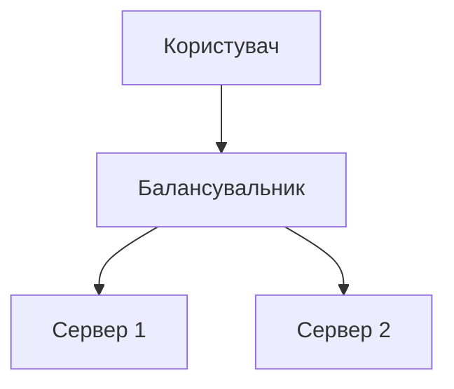

# Markdown Viewer

[English](README.en.md) · [简体中文](README.zh-CN.md) · [繁體中文](README.zh-TW.md) · [Русский](README.ru.md) · [日本語](README.ja.md) · [हिन्दी](README.hi.md) · [한국어](README.ko.md) · [Deutsch](README.de.md) · [Português (Brasil)](README.pt-BR.md) · [Português (Portugal)](README.pt-PT.md) · [Nederlands](README.nl.md) · [Українська](README.uk.md) · [Tiếng Việt](README.vi.md) · [Беларуская](README.be.md) · [Français](README.fr.md) · [Italiano](README.it.md) · [Bahasa Indonesia](README.id.md) · [Español](README.es.md) · [ไทย](README.th.md) · [Svenska](README.sv.md) · [Türkçe](README.tr.md) · [Eesti](README.et.md) · [Bahasa Melayu](README.ms.md) · [Polski](README.pl.md) · [Suomi](README.fi.md) · [Lietuvių](README.lt.md) · [Norsk](README.no.md) · [Dansk](README.da.md)

**Markdown у ідеальний Word одним кліком — Mermaid, Graphviz, Vega, інфографіка, LaTeX (редагований), підсвітка коду, локальна обробка**

*Повністю безкоштовно · 18+ професійних тем · 28 мови інтерфейсу*

🚀 **Install Now:** https://chromewebstore.google.com/detail/markdown-viewer/jekhhoflgcfoikceikgeenibinpojaoi

---

Ви любите писати в Markdown — це чисто, ефективно та дружньо до контролю версій.  
Але зрештою завжди потрібен документ Word.

**Старий кошмар:**

😫 Скріншоти схем вручну · Формули після копіювання «ламаються» · Код форматувати вручну · Таблиці налаштовувати по клітинці · Після експорту ще 30 хвилин підганяти шрифти, відступи й кольори

**Один документ: 1 година написання, 2 години форматування.**

---

**Тепер це займає лише 1 секунду.**

Натисніть «Завантажити» й отримайте ідеальний Word-документ:
- ✅ Діаграми Mermaid → зображення у високій роздільності
- ✅ Графи Graphviz DOT → зображення у високій роздільності
- ✅ Формули LaTeX → редаговані рівняння у Word
- ✅ Автопідсвічування синтаксису (100+ мов)
- ✅ 18+ професійних тем в один клік
- ✅ Повністю безкоштовно, локальна обробка

**Витрачайте час на зміст, а не на форматування.**

---

## 💫 Подивіться в дії

### Технічна документація: 15 блок-схем, 2 години → 5 хвилин

**Раніше:** draw.io діаграма → Експорт PNG → Вставка у Word → Масштабування → Повторити 15 разів = **2 години**

**Тепер:** Напишіть код Mermaid → Натисніть завантажити = **5 хвилин**

## Архітектура системи

``````markdown

``````

Потрібні зміни? Відредагуйте код і експортуйте знову. **Економія 115 хвилин.**

### Наукова стаття: 50+ формул, 3 години → 10 хвилин

**Раніше:** Редактор формул Word по одній АБО платна підписка = **3 години + Платна підписка**

**Тепер:** Пишіть синтаксис LaTeX напряму → Натисніть завантажити = **10 хвилин + Безкоштовно**

За масою $m$ та прискоренням $a$, згідно з другим законом Ньютона:

```markdown
$$
F = ma = m\frac{dv}{dt} = m\frac{d^2x}{dt^2}
$$
```

Експорт у рідному форматі Word, повністю редаговані. **Не зображення, а справжній об'єкт формули.**

### Командна робота: щотижневі звіти, 1 година → 1 хвилина

**Раніше:** Копіювати контент → Налаштувати формат → Виправити списки → Додати стилі → Діаграми Excel + скріншоти = **1 година щотижня**

**Тепер:** Відкрийте файл → Виберіть тему → Натисніть завантажити = **1 хвилина**

Виберіть тему «Business», діаграми Vega-Lite автоматично конвертуються у зображення високої роздільності, професійний вигляд. **Економія 59 хвилин щотижня.**

**Бізнес-сценарії:**
- 📊 Тренди продажів (лінійні графіки)
- 📈 Порівняння частки ринку (стовпчикові діаграми)
- 🎯 Досягнення KPI (датчики)
- 📉 Аналіз витрат (складені діаграми)

Нехай дані говорять самі за себе — створюйте професійні звіти в один клік.

---

## 🎯 Три основні функції

### 1. Автоматичне перетворення діаграм

**Діаграми Mermaid** · **Graphviz DOT** · **Діаграми даних Vega/Vega-Lite** · **Інфографіка** · SVG-зображення · Складні HTML-таблиці

**Mermaid:** Блок-схеми, діаграми послідовності, класів, станів → Технічна документація, проєктування архітектури  
**Graphviz DOT:** Орієнтовані/неорієнтовані графи, мережева топологія, автомати → Системна архітектура, аналіз залежностей  
**Vega/Vega-Lite:** Стовпчикові, лінійні, точкові діаграми, теплові карти → Бізнес-звіти, аналітика даних  
**Інфографіка:** Статистичні діаграми, інфографіка, візуалізація даних → Презентація даних, візуальне оповідання

**Порівняння часу:** Складна діаграма послідовності (10 об'єктів)
- Традиційні інструменти: Малювання 30хв + Редагування 20хв + Налаштування 10хв + Експорт 5хв = **65 хвилин**
- Markdown Viewer: Написати код 5хв + Редагування 30с + Експорт 1с = **6 хвилин**

**Бізнес-сценарій:** Квартальний звіт продажів (5 стовпчикових діаграм)
- Excel діаграми + скріншоти: Вибір даних 15хв + Форматування 10хв + Скріншоти 5хв = **30 хвилин**
- Vega-Lite: JSON дані 2хв + Експорт в один клік = **3 хвилини**

**Точно, професійно, багаторазово.**

### 2. Ідеальне перетворення формул

LaTeX → Редаговані формули Word (не зображення!)

Після експорту ви можете:
- ✅ Продовжувати редагування у Word
- ✅ Змінювати розмір шрифту
- ✅ Модифікувати символи та змінні
- ✅ Копіювати в інші документи

**Одна формула, два підходи:**
- ❌ Редактор формул Word: Клік...клік...клік...вибір символів...налаштування позицій
- ✅ LaTeX: `\int_0^\infty e^{-x^2}dx` Готово

### 3. 18+ професійних тем

Різні сценарії, різні стилі, перемикання в один клік:

- 📊 Business / Technical → Бізнес-звіти, технічна документація
- 📚 Academic / Palatino → Наукові статті, верстка книг  
- 🇨🇳 Songti / Heiti / Mixed → Китайські документи
- 🎨 Typewriter / Sakura → Креативний контент

**WYSIWYG:** Попередній перегляд виглядає точно як експортований Word. Без здогадок, без проб.

**Більше ніяких ручних налаштувань:** Шрифт, розмір, міжрядковий інтервал, відступи абзаців, фон коду...

---

## ⚡ Блискавична швидкість

### Розумний кеш: перший раз 5с, другий раз 1с

Документ із 50 діаграмами Mermaid:
- **Перше відкриття:** Текст відображається миттєво, діаграми рендеряться у фоні, все готово за 5с
- **Друге відкриття:** Завантаження з кешу, миттєве відображення (<1с)
- **Текст змінено:** Все ще миттєво (діаграми з кешу)
- **Діаграму змінено:** Перерендерюється лише змінена діаграма

**У 10 разів швидше за Word, файли у 100 разів менші.**

### Покращення читання

- **Три макети:** Звичайний (1000px) / Повноекранний / Вузький (530px, попередній перегляд Word)
- **Гнучке масштабування:** 50%-400%, гарячі клавіші `Ctrl/Cmd +` `-` `0`
- **Розумний зміст:** Автовитяг заголовків, бічна навігація, `Ctrl/Cmd + B` для перемикання
- **Пам'ять позиції:** Автозбереження позиції прокрутки, продовження читання наступного разу
- **Історія:** Відстеження нещодавно відкритих документів

---

## 🚀 Швидкий старт — 3 кроки

### Крок 1: Встановіть розширення (30 секунд)

1. Відкрийте браузер Chrome
2. Перейдіть до Chrome Web Store
3. Знайдіть "Markdown Viewer"
4. Натисніть «Додати до Chrome»
5. ✅ Встановлення завершено

### Крок 2: Дозвольте доступ до файлів (1 хвилина)

**Якщо ви хочете відкривати локальні .md файли:**

1. Відкрийте `chrome://extensions/`
2. Знайдіть Markdown Viewer
3. Увімкніть «Дозволити доступ до URL-адрес файлів»
4. ✅ Тепер ви можете двічі клікнути, щоб відкрити локальні Markdown-файли

**Не потрібно, якщо:**
- Переглядаєте лише онлайн-документи (GitHub, блоги тощо)
- Використовуєте функцію браузера «Відкрити файл»

### Швидкий старт

**Відкриття документів:** Двічі клікніть на .md файли або перетягніть у браузер · GitHub-документи рендеряться автоматично

**Експорт у Word:** Натисніть кнопку завантаження або `Ctrl/Cmd + S` → Спостерігайте прогрес → Автозбереження

**Зміна теми:** Натисніть на панель інструментів → Виберіть тему → Застосовується миттєво

**Налаштування перегляду:** `+`/`-` масштаб · Перемикання макета · `Ctrl/Cmd + B` зміст

---

## 🎁 Повний функціонал

### Повна підтримка синтаксису Markdown

Заголовки · Абзаци · Жирний · Курсив · Закреслений · Списки · Списки завдань · Цитати · Блоки коду (100+ мов з підсвічуванням) · Таблиці · Посилання · Зображення · Діаграми Mermaid · Діаграми Vega / Vega-Lite · Інфографіка · Формули LaTeX · HTML · Розширення GFM

### 18 тем

**Бізнес:** Default · Business · Technical  
**Академічні:** Academic  
**Із засічками:** Palatino · Garamond · Cambria · Elegant  
**Без засічок:** Verdana · Trebuchet · Century  
**Китайські:** Songti · Heiti · Mixed  
**Креативні:** Typewriter · Sakura · Water · Minimal

### 28 мови інтерфейсу

English · 简体中文 · 繁體中文 · Русский · 日本語 · हिन्दी · 한국어 · Deutsch · Português (Brasil) · Português (Portugal) · Nederlands · Українська · Tiếng Việt · Беларуская · Français · Italiano · Bahasa Indonesia · Español · ไทย · Svenska · Türkçe · Eesti · Bahasa Melayu · Polski · Suomi · Lietuvių · Norsk · Dansk

---

## 💎 Конкурентні переваги

|  | Скріншоти вручну | CLI-інструменти | Онлайн-сервіси | Десктопні редактори | Markdown Viewer |
|---|:---:|:---:|:---:|:---:|:---:|
| **Простота** | Втомлює | Потребує налаштування | Потребує завантаження | Потребує встановлення | ✅ Один клік |
| **Mermaid** | Скріншот вручну | Потрібен плагін | ✅ Підтримується | ✅ Підтримується | ✅ Нативна підтримка |
| **Формули** | Зображення | Зображення | Зображення | Зображення | ✅ Редаговані |
| **Приватність** | ✅ Локально | ✅ Локально | ❌ Завантаження в хмару | ✅ Локально | ✅ Локально |
| **Теми** | - | - | 3-5 | 5-10 | ✅ 18+ |
| **Офлайн** | ✅ | ✅ | ❌ | ✅ | ✅ |
| **Перегляд GitHub** | ❌ | ❌ | ❌ | ❌ | ✅ |
| **Ціна** | Безкоштовно | Безкоштовно | Платні плани | Платні плани | ✅ Безкоштовно |

**Основна перевага: Швидше, дешевше, безпечніше, потужніше.**

---

## ❓ Часті запитання

**Q: Чи можна редагувати експортований документ Word?**  
A: Так. Стандартний формат .docx, математичні формули редаговані, а не зображення.

**Q: Які діаграми підтримуються?**  
A: Усі діаграми Mermaid (блок-схема, послідовність, Gantt, клас, стан, кругова, ER тощо), діаграми візуалізації даних Vega / Vega-Lite, статистичні діаграми Infographic + автоконвертація SVG.

**Q: Чи є обмеження на розмір файлу?**  
A: Без обмежень. Розумний кеш, документи зі 100+ діаграмами відкриваються миттєво.

**Q: Чи потрібен інтернет?**  
A: Ні. Повністю локальна обробка, працює офлайн.

**Q: Чи будуть мої документи завантажені кудись?**  
A: Ніколи. Вся обробка відбувається локально.

**Q: Як змінити тему?**  
A: Натисніть іконку панелі інструментів → Виберіть тему → Застосовується миттєво.

**Q: Чи можна налаштувати теми?**  
A: Наразі 18 попередньо встановлених тем, кастомізація незабаром.

**Q: Чи будуть великі документи гальмувати?**  
A: Ні. Прогресивне завантаження + розумний кеш, текст відображається миттєво, діаграми рендеряться у фоні (перший раз 5с, другий раз 1с).

**Q: Чи займає кеш багато місця?**  
A: За замовчуванням максимум 1000 елементів, приблизно 500 МБ, можна налаштувати або очистити в налаштуваннях.

**Q: Які браузери підтримуються?**  
A: Chrome та браузери на базі Chromium (Edge, Brave, Opera).

**Q: Які версії Word можуть відкрити експортований файл?**  
A: Word 2016+ повністю підтримується, Word 2013 також працює. Повна сумісність із WPS Office.

**Q: Чи можна експортувати в PDF?**  
A: Наразі лише Word, PDF планується. Можете експортувати у Word, потім зберегти як PDF.

**Q: Яка тема мені підходить?**  
A: Бізнес-звіти → Business · Наукові статті → Academic · Технічна документація → Technical · Китайські документи → Songti/Mixed

**Q: Яка різниця між Vega та Mermaid?**  
A: **Mermaid** для блок-схем, архітектурних діаграм та інших схематичних діаграм; **Vega/Vega-Lite** для візуалізації даних, таких як діаграми продажів, фінансові звіти та інші бізнес-діаграми на основі даних. Вони доповнюють один одного для різних сценаріїв.

**Q: Як створити діаграми з Vega-Lite?**  
A: Використовуйте блок коду ````vega-lite` у Markdown зі специфікацією діаграми у форматі JSON. Дивіться [офіційні приклади Vega-Lite](https://vega.github.io/vega-lite/examples/).

---

## 🔒 Зобов'язання щодо конфіденційності

- ✅ Вся обробка виконується локально, ніколи не завантажується
- ✅ Без відстеження, без збору персональних даних
- ✅ Відкритий код, прозорий для аудиту
- ✅ Схвалено безпекою Chrome Web Store (Manifest V3)

**Ваша конфіденційність захищена на 100%.**

---

## 🆘 Отримати допомогу

📖 [Повна документація](https://github.com/xicilion/markdown-viewer-extension) · 🐛 [Повідомити про проблему](https://github.com/xicilion/markdown-viewer-extension/issues) · 💡 [Запити на функції](https://github.com/xicilion/markdown-viewer-extension/issues) · ⭐ [GitHub Star](https://github.com/xicilion/markdown-viewer-extension)

---

## 🎉 Почніть зараз

**Встановіть за 30 секунд, почніть використовувати одразу:**

1. Перейдіть до Chrome Web Store → Знайдіть "Markdown Viewer"
2. Натисніть «Додати до Chrome»
3. Натисніть «Керувати розширеннями», увімкніть «Дозволити доступ до URL-адрес файлів»
4. Перетягніть `.md` файли у браузер
5. ✅ Почніть використовувати

**Ви отримаєте:** Markdown → Word конвертація в один клік · Автоконвертація Mermaid · Редаговані формули LaTeX · Підсвічування синтаксису 100+ мов · 18+ тем · Розумний кеш · Повністю безкоштовно

**Ідеально для:** Технічних письменників · Студентів/дослідників · Продакт-менеджерів · Розробників · Усіх, хто використовує Markdown

---

## 📜 Ліцензія відкритого коду

Цей проєкт має відкритий код під ліцензією ISC. Ласкаво просимо ставити Star, повідомляти про проблеми, пропонувати функції та робити внесок у код.

**URL проєкту:** https://github.com/xicilion/markdown-viewer-extension

---

**Припиніть витрачати час на форматування**

**Зосередьтеся на написанні, нехай Markdown Viewer зробить все інше**

🚀 **Встановити зараз:** https://chromewebstore.google.com/detail/markdown-viewer/jekhhoflgcfoikceikgeenibinpojaoi

*Повністю безкоштовно · Локальна обробка · Конфіденційність захищена*
