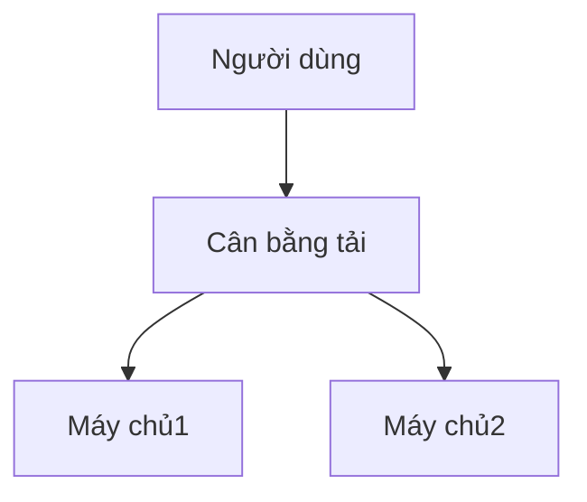

# Markdown Viewer

[简体中文](README.zh-CN.md) · [繁體中文](README.zh-TW.md) · [English](README.en.md) · [Русский](README.ru.md) · [日本語](README.ja.md) · [한국어](README.ko.md) · [Português (Brasil)](README.pt-BR.md) · [Português (Portugal)](README.pt-PT.md) · [Español](README.es.md) · [Deutsch](README.de.md) · [Français](README.fr.md) · [Українська](README.uk.md) · [Tiếng Việt](README.vi.md) · [Italiano](README.it.md) · [Türkçe](README.tr.md) · [Bahasa Indonesia](README.id.md) · [Lietuvių](README.lt.md) · [Nederlands](README.nl.md) · [Suomi](README.fi.md) · [ไทย](README.th.md) · [Polski](README.pl.md) · [हिन्दी](README.hi.md) · [Svenska](README.sv.md) · [Norsk](README.no.md) · [Dansk](README.da.md)

**Viết tài liệu bằng Markdown, xuất Word hoàn hảo chỉ một cú nhấp chuột.**

*Hoàn toàn miễn phí · Xử lý cục bộ · 18+ chủ đề chuyên nghiệp · Hỗ trợ 25 ngôn ngữ*

🚀 **Cài đặt ngay:** https://chromewebstore.google.com/detail/markdown-viewer/jekhhoflgcfoikceikgeenibinpojaoi

---

Bạn thích viết bằng Markdown — sạch sẽ, hiệu quả, thân thiện với kiểm soát phiên bản.  
Nhưng cuối cùng, bạn luôn cần một tài liệu Word.

**Cơn ác mộng cũ:**

😫 Chụp màn hình sơ đồ luồng thủ công · Công thức toán sao chép-dán bị lộn xộn · Định dạng mã thủ công · Điều chỉnh bảng từng ô · Sau khi xuất, thêm nửa giờ để điều chỉnh font chữ, khoảng cách và màu sắc

**Một tài liệu: 1 giờ viết, 2 giờ định dạng.**

---

**Bây giờ chỉ mất 1 giây.**

Nhấp tải xuống và nhận tài liệu Word hoàn hảo:
- ✅ Sơ đồ Mermaid → Hình ảnh độ phân giải cao
- ✅ Graphviz DOT → Hình ảnh độ phân giải cao
- ✅ Công thức LaTeX → Phương trình Word có thể chỉnh sửa
- ✅ Tự động làm nổi bật cú pháp (100+ ngôn ngữ)
- ✅ 18+ chủ đề chuyên nghiệp chỉ một cú nhấp chuột
- ✅ Hoàn toàn miễn phí, xử lý cục bộ

**Dành thời gian cho việc viết, không phải định dạng.**

---

## 💫 Xem kết quả thực tế

### Tài liệu kỹ thuật: 15 sơ đồ luồng, 2 giờ → 5 phút

**Trước đây:** vẽ bằng draw.io → xuất PNG → chèn vào Word → điều chỉnh kích thước → lặp lại 15 lần = **2 giờ**

**Bây giờ:** Viết sơ đồ bằng mã Mermaid → nhấp tải xuống = **5 phút**

## Kiến trúc hệ thống

``````markdown

``````

Cần thay đổi? Sửa mã và xuất lại. **Tiết kiệm 115 phút.**

### Bài báo học thuật: 50+ công thức, 3 giờ → 10 phút

**Trước đây:** Trình soạn thảo phương trình Word từng cái một HOẶC đăng ký công cụ trả phí = **3 giờ + Đăng ký trả phí**

**Bây giờ:** Viết cú pháp LaTeX trực tiếp → nhấp tải xuống = **10 phút + Miễn phí**

Cho khối lượng $m$ và gia tốc $a$, theo định luật thứ hai của Newton:

```markdown
$$
F = ma = m\frac{dv}{dt} = m\frac{d^2x}{dt^2}
$$
```

Xuất dưới dạng định dạng Word gốc, hoàn toàn có thể chỉnh sửa. **Không phải hình ảnh, mà là đối tượng phương trình thực sự.**

### Cộng tác nhóm: Báo cáo hàng tuần, 1 giờ → 1 phút

**Trước đây:** Sao chép nội dung → Đặt định dạng → Điều chỉnh danh sách → Thêm kiểu dáng → Biểu đồ Excel + chụp màn hình = **1 giờ mỗi tuần**

**Bây giờ:** Mở tệp → Chọn chủ đề → Nhấp tải xuống = **1 phút**

Chọn chủ đề "Business", biểu đồ dữ liệu Vega-Lite tự động chuyển đổi thành hình ảnh độ phân giải cao, giao diện chuyên nghiệp. **Tiết kiệm 59 phút mỗi tuần.**

**Các trường hợp sử dụng kinh doanh:**
- 📊 Xu hướng bán hàng (biểu đồ đường)
- 📈 So sánh thị phần (biểu đồ cột)
- 🎯 Đạt được KPI (đồng hồ đo)
- 📉 Phân tích chi phí (biểu đồ xếp chồng)

Để dữ liệu nói, tạo báo cáo chuyên nghiệp chỉ một cú nhấp chuột.

---

## 🎯 Ba tính năng cốt lõi

### 1. Chuyển đổi sơ đồ tự động

**Sơ đồ Mermaid** · **Graphviz DOT** · **Biểu đồ dữ liệu Vega/Vega-Lite** · **Infographic** · Hình ảnh SVG · Bảng HTML phức tạp

**Mermaid:** Sơ đồ luồng, sơ đồ tuần tự, sơ đồ lớp, sơ đồ trạng thái → Tài liệu kỹ thuật, thiết kế kiến trúc  
**Graphviz DOT:** Đồ thị có hướng/vô hướng, cấu trúc liên kết mạng, máy trạng thái → Kiến trúc hệ thống, phân tích phụ thuộc  
**Vega/Vega-Lite:** Biểu đồ cột, biểu đồ đường, biểu đồ phân tán, bản đồ nhiệt → Báo cáo kinh doanh, phân tích dữ liệu  
**Infographic:** Biểu đồ thống kê, infographic, trực quan hóa dữ liệu → Trình bày dữ liệu, kể chuyện bằng hình ảnh

**So sánh thời gian:** Sơ đồ tuần tự phức tạp (10 đối tượng)
- Công cụ truyền thống: Vẽ 30phút + Sửa đổi 20phút + Điều chỉnh 10phút + Xuất 5phút = **65 phút**
- Markdown Viewer: Viết mã 5phút + Sửa đổi 30giây + Xuất 1giây = **6 phút**

**Tình huống kinh doanh:** Báo cáo bán hàng quý (5 biểu đồ cột)
- Biểu đồ Excel + chụp màn hình: Chọn dữ liệu 15phút + Định dạng 10phút + Chụp màn hình 5phút = **30 phút**
- Vega-Lite: Dữ liệu JSON 2phút + Xuất một cú nhấp chuột = **3 phút**

**Chính xác, chuyên nghiệp, có thể tái sử dụng.**

### 2. Chuyển đổi công thức hoàn hảo

LaTeX → Phương trình Word có thể chỉnh sửa (không phải hình ảnh!)

Sau khi xuất, bạn có thể:
- ✅ Tiếp tục chỉnh sửa trong Word
- ✅ Điều chỉnh kích thước phông chữ
- ✅ Sửa đổi ký hiệu và biến
- ✅ Sao chép sang tài liệu khác

**Một công thức, hai cách tiếp cận:**
- ❌ Trình soạn thảo phương trình Word: Nhấp...nhấp...nhấp...chọn ký hiệu...điều chỉnh vị trí
- ✅ LaTeX: `\int_0^\infty e^{-x^2}dx` Xong

### 3. 18+ chủ đề chuyên nghiệp

Các tình huống khác nhau, phong cách khác nhau, chuyển đổi chỉ một cú nhấp chuột:

- 📊 Business / Technical → Báo cáo kinh doanh, tài liệu kỹ thuật
- 📚 Academic / Palatino → Bài báo học thuật, sắp chữ sách  
- 🇨🇳 Songti / Heiti / Mixed → Tài liệu tiếng Trung
- 🎨 Typewriter / Sakura → Nội dung sáng tạo

**WYSIWYG:** Xem trước trông giống hệt Word đã xuất. Không đoán, không thử.

**Không còn điều chỉnh thủ công:** Phông chữ, kích thước, khoảng cách dòng, khoảng cách đoạn, màu nền mã...

---

## ⚡ Trải nghiệm nhanh như chớp

### Bộ nhớ cache thông minh: Lần đầu 5s, lần thứ hai 1s

Tài liệu có 50 sơ đồ Mermaid:
- **Lần mở đầu tiên:** Văn bản hiển thị ngay lập tức, sơ đồ được hiển thị ở chế độ nền, tất cả hoàn thành trong vòng 5 giây
- **Lần mở thứ hai:** Tải từ bộ nhớ cache, hiển thị tức thì (<1s)
- **Văn bản đã sửa đổi:** Vẫn tức thì (sơ đồ từ bộ nhớ cache)
- **Sơ đồ đã sửa đổi:** Chỉ hiển thị lại sơ đồ đã thay đổi

**Nhanh hơn Word 10 lần, tệp nhỏ hơn 100 lần.**

### Cải thiện đọc

- **Ba bố cục:** Bình thường (1000px) / Toàn màn hình / Hẹp (530px, xem trước hiệu ứng Word)
- **Phóng to linh hoạt:** 50%-400%, phím tắt `Ctrl/Cmd +` `-` `0`
- **Mục lục thông minh:** Tự động trích xuất tiêu đề, điều hướng thanh bên, `Ctrl/Cmd + B` để chuyển đổi
- **Bộ nhớ vị trí:** Tự động lưu vị trí cuộn, tiếp tục đọc lần sau
- **Lịch sử:** Theo dõi tài liệu đã mở gần đây

---

## 🚀 Bắt đầu nhanh - 3 bước

### Bước 1: Cài đặt tiện ích (30 giây)

1. Mở trình duyệt Chrome
2. Truy cập Chrome Web Store
3. Tìm kiếm "Markdown Viewer"
4. Nhấp "Thêm vào Chrome"
5. ✅ Cài đặt hoàn tất

### Bước 2: Cho phép truy cập tệp (1 phút)

**Nếu bạn muốn mở tệp .md cục bộ:**

1. Mở `chrome://extensions/`
2. Tìm Markdown Viewer
3. Bật "Cho phép truy cập URL tệp"
4. ✅ Bây giờ bạn có thể nhấp đúp để mở tệp Markdown cục bộ

**Không cần thiết nếu:**
- Chỉ xem tài liệu trực tuyến (GitHub, blog, v.v.)
- Sử dụng chức năng "Mở tệp" của trình duyệt

### Bắt đầu nhanh

**Mở tài liệu:** Nhấp đúp vào tệp .md hoặc kéo vào trình duyệt · Tài liệu GitHub tự động hiển thị

**Xuất sang Word:** Nhấp nút tải xuống hoặc `Ctrl/Cmd + S` → Xem tiến trình → Tự động lưu

**Chuyển đổi chủ đề:** Nhấp thanh công cụ → Chọn chủ đề → Áp dụng ngay lập tức

**Điều chỉnh chế độ xem:** `+`/`-` phóng to · Chuyển đổi bố cục · `Ctrl/Cmd + B` mục lục

---

## 🎁 Tính năng đầy đủ

### Hỗ trợ cú pháp Markdown đầy đủ

Tiêu đề · Đoạn văn · Đậm · Nghiêng · Gạch ngang · Danh sách · Danh sách nhiệm vụ · Trích dẫn · Khối mã (làm nổi bật 100+ ngôn ngữ) · Bảng · Liên kết · Hình ảnh · Sơ đồ Mermaid · Biểu đồ Vega / Vega-Lite · Biểu đồ Infographic · Công thức LaTeX · HTML · Phần mở rộng GFM

### 18 chủ đề

**Kinh doanh:** Default · Business · Technical  
**Học thuật:** Academic  
**Serif:** Palatino · Garamond · Cambria · Elegant  
**Sans-serif:** Verdana · Trebuchet · Century  
**Trung Quốc:** Songti · Heiti · Mixed  
**Sáng tạo:** Typewriter · Sakura · Water · Minimal

### 25 ngôn ngữ giao diện

简体中文 · 繁體中文 · English · Русский · 日本語 · 한국어 · Português (Brasil) · Português (Portugal) · Español · Deutsch · Français · Українська · Tiếng Việt · Italiano · Türkçe · Bahasa Indonesia · Lietuvių · Nederlands · Suomi · ไทย · Polski · हिन्दी · Svenska · Norsk · Dansk

---

## 💎 Lợi thế cạnh tranh

|  | Chụp màn hình thủ công | Công cụ CLI | Dịch vụ trực tuyến | Trình soạn thảo máy tính để bàn | Markdown Viewer |
|---|:---:|:---:|:---:|:---:|:---:|
| **Dễ sử dụng** | Tẻ nhạt | Cần thiết lập | Cần tải lên | Cần cài đặt | ✅ Một cú nhấp chuột |
| **Mermaid** | Chụp màn hình thủ công | Cần plugin | ✅ Được hỗ trợ | ✅ Được hỗ trợ | ✅ Hỗ trợ gốc |
| **Công thức toán học** | Hình ảnh | Hình ảnh | Hình ảnh | Hình ảnh | ✅ Có thể chỉnh sửa |
| **Quyền riêng tư** | ✅ Cục bộ | ✅ Cục bộ | ❌ Tải lên đám mây | ✅ Cục bộ | ✅ Cục bộ |
| **Chủ đề** | - | - | 3-5 | 5-10 | ✅ 18+ |
| **Ngoại tuyến** | ✅ | ✅ | ❌ | ✅ | ✅ |
| **Xem trực tiếp GitHub** | ❌ | ❌ | ❌ | ❌ | ✅ |
| **Giá** | Miễn phí | Miễn phí | Gói trả phí | Gói trả phí | ✅ Miễn phí |

**Lợi thế cốt lõi: Nhanh hơn, rẻ hơn, an toàn hơn, mạnh mẽ hơn.**

---

## ❓ Câu hỏi thường gặp

**H: Tôi có thể chỉnh sửa tài liệu Word đã xuất không?**  
Đ: Có. Định dạng .docx tiêu chuẩn, công thức toán học có thể chỉnh sửa, không phải hình ảnh.

**H: Những sơ đồ nào được hỗ trợ?**  
Đ: Tất cả sơ đồ Mermaid (sơ đồ luồng, tuần tự, gantt, lớp, trạng thái, tròn, ER, v.v.), biểu đồ trực quan hóa dữ liệu Vega / Vega-Lite, biểu đồ thống kê Infographic + chuyển đổi SVG tự động.

**H: Có giới hạn kích thước tệp không?**  
Đ: Không có giới hạn. Bộ nhớ cache thông minh, tài liệu có 100+ sơ đồ mở ngay lập tức.

**H: Có cần internet không?**  
Đ: Không. Xử lý hoàn toàn cục bộ, hoạt động ngoại tuyến.

**H: Tài liệu của tôi có được tải lên không?**  
Đ: Không bao giờ. Tất cả xử lý diễn ra cục bộ.

**H: Làm thế nào để chuyển đổi chủ đề?**  
Đ: Nhấp biểu tượng thanh công cụ → Chọn chủ đề → Áp dụng ngay lập tức.

**H: Tôi có thể tùy chỉnh chủ đề không?**  
Đ: Hiện tại có 18 chủ đề được thiết lập sẵn, tùy chỉnh sắp ra mắt.

**H: Tài liệu lớn có bị chậm không?**  
Đ: Không. Tải tiến bộ + bộ nhớ cache thông minh, văn bản hiển thị ngay lập tức, sơ đồ được hiển thị ở chế độ nền (lần đầu 5s, lần thứ hai 1s).

**H: Bộ nhớ cache có chiếm nhiều dung lượng không?**  
Đ: Mặc định tối đa 1000 mục, khoảng 500 MB, có thể điều chỉnh hoặc xóa trong cài đặt.

**H: Những trình duyệt nào được hỗ trợ?**  
Đ: Chrome và trình duyệt dựa trên Chromium (Edge, Brave, Opera).

**H: Tệp đã xuất có thể mở được trong phiên bản Word nào?**  
Đ: Word 2016+ được hỗ trợ đầy đủ, Word 2013 cũng hoạt động. Hoàn toàn tương thích với WPS Office.

**H: Tôi có thể xuất sang PDF không?**  
Đ: Hiện tại chỉ Word, PDF đang được lên kế hoạch. Bạn có thể xuất sang Word trước rồi lưu dưới dạng PDF.

**H: Chủ đề nào phù hợp với tôi?**  
Đ: Báo cáo kinh doanh → Business · Bài báo học thuật → Academic · Tài liệu kỹ thuật → Technical · Tài liệu tiếng Trung → Songti/Mixed

**H: Sự khác biệt giữa Vega và Mermaid là gì?**  
Đ: **Mermaid** dành cho sơ đồ luồng, sơ đồ kiến trúc và các sơ đồ minh họa khác; **Vega/Vega-Lite** dành cho trực quan hóa dữ liệu như biểu đồ bán hàng, báo cáo tài chính và các biểu đồ kinh doanh dựa trên dữ liệu khác. Chúng bổ sung cho nhau cho các tình huống khác nhau.

**H: Làm thế nào để tạo biểu đồ với Vega-Lite?**  
Đ: Sử dụng khối mã ````vega-lite` trong Markdown với đặc tả biểu đồ định dạng JSON. Xem [ví dụ chính thức Vega-Lite](https://vega.github.io/vega-lite/examples/).

---

## 🔒 Cam kết về quyền riêng tư

- ✅ Tất cả xử lý được thực hiện cục bộ, không bao giờ tải lên
- ✅ Không theo dõi, không thu thập dữ liệu cá nhân
- ✅ Mã nguồn mở, có thể kiểm toán và minh bạch
- ✅ Bảo mật Chrome Web Store đã được phê duyệt (Manifest V3)

**Quyền riêng tư của bạn được bảo vệ 100%.**

---

## 🆘 Nhận trợ giúp

📖 [Tài liệu đầy đủ](https://github.com/xicilion/markdown-viewer-extension) · 🐛 [Báo cáo vấn đề](https://github.com/xicilion/markdown-viewer-extension/issues) · 💡 [Yêu cầu tính năng](https://github.com/xicilion/markdown-viewer-extension/issues) · ⭐ [Sao GitHub](https://github.com/xicilion/markdown-viewer-extension)

---

## 🎉 Bắt đầu ngay

**Cài đặt trong 30 giây, bắt đầu sử dụng ngay lập tức:**

1. Truy cập Chrome Web Store → Tìm kiếm "Markdown Viewer"
2. Nhấp "Thêm vào Chrome"
3. Nhấp "Quản lý tiện ích mở rộng", bật "Cho phép truy cập URL tệp"
4. Kéo tệp `.md` vào trình duyệt
5. ✅ Bắt đầu sử dụng

**Bạn sẽ nhận được:** Chuyển đổi Markdown → Word một cú nhấp chuột · Chuyển đổi Mermaid tự động · Công thức LaTeX có thể chỉnh sửa · Làm nổi bật cú pháp 100+ ngôn ngữ · 18+ chủ đề · Bộ nhớ cache thông minh · Hoàn toàn miễn phí

**Hoàn hảo cho:** Nhà văn kỹ thuật · Sinh viên/nhà nghiên cứu · Người quản lý sản phẩm · Nhà phát triển · Bất kỳ ai sử dụng Markdown

---

## 📜 Giấy phép mã nguồn mở

Dự án này là mã nguồn mở theo giấy phép ISC. Hoan nghênh Star hỗ trợ, báo cáo vấn đề, đề xuất tính năng, đóng góp mã.

**Địa chỉ dự án:** https://github.com/xicilion/markdown-viewer-extension

---

**Đừng để định dạng lãng phí thời gian của bạn nữa**

**Tập trung vào viết, để Markdown Viewer xử lý mọi thứ khác**

🚀 **Cài đặt ngay:** https://chromewebstore.google.com/detail/markdown-viewer/jekhhoflgcfoikceikgeenibinpojaoi

*Hoàn toàn miễn phí · Xử lý cục bộ · Bảo vệ quyền riêng tư*
