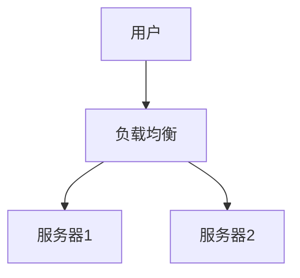

# Markdown Viewer

[English](README.en.md) · [简体中文](README.zh-CN.md) · [繁體中文](README.zh-TW.md) · [Русский](README.ru.md) · [日本語](README.ja.md) · [हिन्दी](README.hi.md) · [한국어](README.ko.md) · [Deutsch](README.de.md) · [Português (Brasil)](README.pt-BR.md) · [Português (Portugal)](README.pt-PT.md) · [Nederlands](README.nl.md) · [Українська](README.uk.md) · [Tiếng Việt](README.vi.md) · [Беларуская](README.be.md) · [Français](README.fr.md) · [Italiano](README.it.md) · [Bahasa Indonesia](README.id.md) · [Español](README.es.md) · [ไทย](README.th.md) · [Svenska](README.sv.md) · [Türkçe](README.tr.md) · [Eesti](README.et.md) · [Bahasa Melayu](README.ms.md) · [Polski](README.pl.md) · [Suomi](README.fi.md) · [Lietuvių](README.lt.md) · [Norsk](README.no.md) · [Dansk](README.da.md)

**Markdown 一键导出完美 Word — Mermaid 流程图、Graphviz、Vega 图表、信息图、LaTeX 公式自动转为可编辑格式，代码高亮，本地处理**

*完全免费 · 18+ 专业主题 · 支持 28 种语言*

🚀 **立即安装:** https://chromewebstore.google.com/detail/markdown-viewer/jekhhoflgcfoikceikgeenibinpojaoi

---

您喜欢用 Markdown 写作 —— 简洁、高效、版本控制友好。  
但最终，您总是需要一份 Word 文档。

**以前的噩梦：**

😫 流程图手动截图 · 数学公式复制粘贴变乱码 · 代码手动调格式 · 表格逐个单元格调整 · 导出后再花半小时调字体间距颜色

**一篇文档：写作 1 小时，调格式 2 小时。**

---

**现在只需 1 秒钟。**

点击下载，获得完美 Word 文档：
- ✅ Mermaid 图表 → 高清图片
- ✅ Graphviz DOT 图 → 高清图片
- ✅ LaTeX 公式 → Word 可编辑公式
- ✅ 代码自动高亮（100+ 语言）
- ✅ 18+ 专业主题一键切换
- ✅ 完全免费，本地处理

**把时间花在写作上，而不是调格式上。**

---

## 💫 看看实际效果

### 技术文档：15 个流程图，2 小时 → 5 分钟

**以前：** draw.io 画图 → 导出 PNG → 插入 Word → 调大小 → 重复 15 次 = **2 小时**

**现在：** Mermaid 代码写图 → 点击下载 = **5 分钟**

## 系统架构

``````markdown

``````

修改？改代码重新导出。**节省 115 分钟。**

### 学术论文：50+ 公式，3 小时 → 10 分钟

**以前：** Word 公式编辑器逐个输入 或 付费工具订阅 = **3 小时 + 付费订阅**

**现在：** LaTeX 语法直接写 → 点击下载 = **10 分钟 + 免费**

设质点质量为 $m$，加速度为 $a$，根据牛顿第二定律：

```markdown
$$
F = ma = m\frac{dv}{dt} = m\frac{d^2x}{dt^2}
$$
```

导出后是 Word 原生格式，可继续编辑。**不是图片，是真正的公式对象。**

### 团队协作：每周报告，1 小时 → 1 分钟

**以前：** 复制内容 → 设置格式 → 调列表 → 加背景 → Excel制图截图 = **每周 1 小时**

**现在：** 打开文件 → 选主题 → 点击下载 = **1 分钟**

选择"商务"主题，Vega-Lite 数据图表自动转换为高清图片，专业美观。**每周节省 59 分钟。**

**商务场景示例：**
- 📊 销售趋势图（折线图）
- 📈 市场份额对比（柱状图）
- 🎯 KPI 达成率（仪表盘）
- 📉 成本分析（堆叠图）

用数据说话，一键生成专业报告。

---

## 🎯 三大核心功能

### 1. 图表自动转换

**Mermaid 流程图** · **Graphviz DOT 图** · **Vega/Vega-Lite 数据图表** · **Infographic** · SVG 图片 · 复杂 HTML 表格

**Mermaid：** 流程图、时序图、类图、状态图 → 技术文档、架构设计  
**Graphviz DOT：** 有向图/无向图、网络拓扑、状态机 → 系统架构、依赖分析  
**Vega/Vega-Lite：** 柱状图、折线图、散点图、热力图 → 商务报告、数据分析  
**Infographic：** 统计图表、信息图、数据可视化 → 数据展示、视觉叙事

**时间对比：** 复杂时序图（10个对象）
- 传统工具：画图30分钟 + 修改20分钟 + 调整10分钟 + 导出5分钟 = **65分钟**
- Markdown Viewer：写代码5分钟 + 修改30秒 + 导出1秒 = **6分钟**

**商务场景：** 季度销售报表（5个柱状图）
- Excel 制图 + 截图：选数据15分钟 + 调格式10分钟 + 截图保存5分钟 = **30分钟**
- Vega-Lite：JSON数据2分钟 + 一键导出 = **3分钟**

**精确、专业、可复用。**

### 2. 数学公式完美转换

LaTeX → Word 可编辑公式（不是图片！）

导出后可以：
- ✅ 在 Word 中继续编辑
- ✅ 调整字体大小
- ✅ 修改符号和变量
- ✅ 复制到其他文档

**一个公式，两种写法：**
- ❌ Word 公式编辑器：点点点点点...选符号...调位置
- ✅ LaTeX：`\int_0^\infty e^{-x^2}dx` 完事

### 3. 18+ 专业主题

不同场景，不同风格，一键切换：

- 📊 Business / Technical → 商务报告、技术文档
- 📚 Academic / Palatino → 学术论文、书籍排版  
- 🇨🇳 宋体 / 黑体 / 混排 → 中文文档
- 🎨 Typewriter / Sakura → 创意内容

**所见即所得：** 预览什么样，Word 就什么样。不用猜，不用试。

**再也不用手动调：** 字体、字号、行距、段间距、代码背景色...

---

## ⚡ 极速体验

### 智能缓存：第一次 5 秒，第二次 1 秒

包含 50 个 Mermaid 图表的文档：
- **第一次打开：** 文字立即显示，图表后台渲染，5秒内全部完成
- **第二次打开：** 从缓存读取，瞬间显示（<1秒）
- **修改文字：** 还是秒开（图表从缓存读取）
- **修改图表：** 只重新渲染修改的图表

**打开速度比 Word 快 10 倍，文件小 100 倍。**

### 阅读增强

- **三种布局：** 正常（1000px）/ 满屏 / 窄屏（530px，预览Word效果）
- **灵活缩放：** 50%-400%，快捷键 `Ctrl/Cmd +` `-` `0`
- **智能目录：** 自动提取标题，侧边栏跳转，`Ctrl/Cmd + B` 切换
- **位置记忆：** 自动保存滚动位置，下次继续阅读
- **历史记录：** 记录最近打开的文档

---

## 🚀 快速开始 - 3 步上手

### 第一步：安装扩展（30 秒）

1. 打开 Chrome 浏览器
2. 访问 Chrome Web Store
3. 搜索 "Markdown Viewer"
4. 点击"添加至 Chrome"
5. ✅ 安装完成

### 第二步：允许访问本地文件（1 分钟）

**如果您要打开电脑上的 .md 文件：**

1. 打开 `chrome://extensions/`
2. 找到 Markdown Viewer
3. 开启"允许访问文件网址"
4. ✅ 现在可以双击打开本地 Markdown 文件了

**不需要这一步的情况：**
- 只看在线文档（GitHub、博客等）
- 通过浏览器"打开文件"功能

### 快速开始

**打开文档：** 双击 .md 文件，或拖拽到浏览器 · GitHub 文档自动识别渲染

**导出 Word：** 点击下载按钮 或 `Ctrl/Cmd + S` → 看进度提示 → 自动保存

**切换主题：** 点击工具栏 → 选择主题 → 立即应用

**调整视图：** `+`/`-` 缩放 · 布局切换 · `Ctrl/Cmd + B` 目录

---

## 🎁 完整功能

### Markdown 语法全支持

标题 · 段落 · 粗体 · 斜体 · 删除线 · 列表 · 任务列表 · 引用 · 代码块（100+ 语言高亮）· 表格 · 链接 · 图片 · Mermaid 图表 · Vega / Vega-Lite 图表 · Infographic 图表 · LaTeX 公式 · HTML · GFM 扩展

### 18 个主题

**商务：** Default · Business · Technical  
**学术：** Academic  
**衬线：** Palatino · Garamond · Cambria · Elegant  
**无衬线：** Verdana · Trebuchet · Century  
**中文：** 宋体 · 黑体 · 混排  
**创意：** Typewriter · Sakura · Water · Minimal

### 28 种界面语言

English · 简体中文 · 繁體中文 · Русский · 日本語 · हिन्दी · 한국어 · Deutsch · Português (Brasil) · Português (Portugal) · Nederlands · Українська · Tiếng Việt · Беларуская · Français · Italiano · Bahasa Indonesia · Español · ไทย · Svenska · Türkçe · Eesti · Bahasa Melayu · Polski · Suomi · Lietuvių · Norsk · Dansk

---

## 💎 对比优势

|  | 手动截图 | 命令行工具 | 在线服务 | 桌面编辑器 | Markdown Viewer |
|---|:---:|:---:|:---:|:---:|:---:|
| **操作难度** | 繁琐 | 需配置 | 需上传 | 需安装 | ✅ 一键 |
| **Mermaid** | 手动截图 | 需插件 | ✅ 支持 | ✅ 支持 | ✅ 原生支持 |
| **数学公式** | 图片 | 图片 | 图片 | 图片 | ✅ 可编辑 |
| **隐私安全** | ✅ 本地 | ✅ 本地 | ❌ 上传云端 | ✅ 本地 | ✅ 本地 |
| **主题数量** | - | - | 3-5 个 | 5-10 个 | ✅ 18+ 个 |
| **离线使用** | ✅ | ✅ | ❌ | ✅ | ✅ |
| **GitHub 直接查看** | ❌ | ❌ | ❌ | ❌ | ✅ |
| **价格** | 免费 | 免费 | 部分付费 | 部分付费 | ✅ 免费 |

**核心优势：更快、更便宜、更安全、功能更强大。**

---

## ❓ 常见问题

**Q: 导出的 Word 能编辑吗？**  
A: 能。标准 .docx 格式，数学公式可编辑，不是图片。

**Q: 支持哪些图表？**  
A: 所有 Mermaid 图表（流程图、时序图、甘特图、类图、状态图、饼图、ER图等）、Vega / Vega-Lite 数据可视化图表、Infographic 统计图表 + SVG 自动转换。

**Q: 文件大小有限制吗？**  
A: 无限制。智能缓存，100+ 图表的文档也秒开。

**Q: 需要联网吗？**  
A: 不需要。完全本地处理，离线可用。

**Q: 文档会被上传吗？**  
A: 绝不上传。所有处理在本地完成。

**Q: 如何切换主题？**  
A: 点击工具栏图标 → 选择主题 → 立即应用。

**Q: 可以自定义主题吗？**  
A: 目前 18 个预设主题，自定义功能规划中。

**Q: 大文档会卡吗？**  
A: 不会。渐进式加载 + 智能缓存，文字立即显示，图表后台渲染（首次 5 秒，二次 1 秒）。

**Q: 缓存占用空间大吗？**  
A: 默认最多 1000 项，约 500 MB，可在设置中调整或清空。

**Q: 支持哪些浏览器？**  
A: Chrome 及 Chromium 内核浏览器（Edge、Brave、Opera）。

**Q: 导出的 Word 在哪个版本能打开？**  
A: Word 2016+ 完美支持，Word 2013 也能打开。WPS Office 完全兼容。

**Q: 支持导出 PDF 吗？**  
A: 目前仅 Word，PDF 在规划中。可先导出 Word 再另存为 PDF。

**Q: 哪个主题适合我？**  
A: 商务报告 → Business · 学术论文 → Academic · 技术文档 → Technical · 中文文档 → 宋体/混排

**Q: Vega 和 Mermaid 有什么区别？**  
A: **Mermaid** 适合画流程图、架构图等示意图；**Vega/Vega-Lite** 适合数据可视化，如销售图表、财务报表等基于真实数据的商务图表。两者互补，覆盖不同场景。

**Q: 如何使用 Vega-Lite 创建图表？**  
A: 在 Markdown 中使用 ````vega-lite` 代码块，内容为 JSON 格式的图表规范。示例见 [Vega-Lite 官方文档](https://vega.github.io/vega-lite/examples/)。

---

## 🔒 隐私承诺

- ✅ 所有处理在本地完成，绝不上传
- ✅ 不追踪使用行为，不收集个人信息
- ✅ 代码开源可审计，透明可信
- ✅ 通过 Chrome Web Store 安全审核（Manifest V3）

**您的隐私 100% 受保护。**

---

## 🆘 获取帮助

📖 [完整文档](https://github.com/xicilion/markdown-viewer-extension) · 🐛 [报告问题](https://github.com/xicilion/markdown-viewer-extension/issues) · 💡 [功能建议](https://github.com/xicilion/markdown-viewer-extension/issues) · ⭐ [GitHub 支持](https://github.com/xicilion/markdown-viewer-extension)

---

## 🎉 立即开始

**30 秒安装，立即体验：**

1. 访问 Chrome Web Store → 搜索 "Markdown Viewer"
2. 点击「添加至 Chrome」
3. 点击「管理扩展」，启用「允许访问文件网址」
4. 拖拽 `.md` 文件到浏览器
5. ✅ 开始使用

**您将获得：** Markdown → Word 一键转换 · Mermaid 自动转图 · LaTeX 可编辑公式 · 100+ 语言代码高亮 · 18+ 主题 · 智能缓存 · 完全免费

**适合：** 技术写作者 · 学生/研究员 · 产品经理 · 开发者 · 任何用 Markdown 的人

---

## 📜 开源协议

本项目采用 ISC 协议开源。欢迎 Star 支持、报告问题、提出建议、贡献代码。

**项目地址：** https://github.com/xicilion/markdown-viewer-extension

---

**不要再让格式调整浪费您的时间**

**把精力放在写作上，让 Markdown Viewer 处理其他一切**

🚀 **立即安装:** https://chromewebstore.google.com/detail/markdown-viewer/jekhhoflgcfoikceikgeenibinpojaoi

*完全免费 · 本地处理 · 隐私安全*
