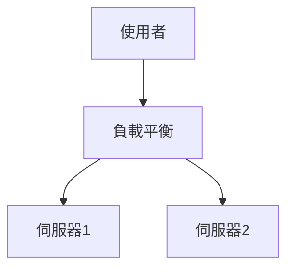

# Markdown Viewer

**用 Markdown 寫文檔，一鍵匯出完美 Word。**

*完全免費 · 本地處理 · 18+ 專業主題 · 支援 23 種語言*

---

您喜歡用 Markdown 寫作 —— 簡潔、高效、版本控制友好。  
但最終，您總是需要一份 Word 文檔。

**以前的噩夢：**

😫 流程圖手動截圖 · 數學公式複製貼上變亂碼 · 程式碼手動調格式 · 表格逐個單元格調整 · 匯出後再花半小時調字體間距顏色

**一篇文檔：寫作 1 小時，調格式 2 小時。**

---

**現在只需 1 秒鐘。**

點擊下載，獲得完美 Word 文檔：
- ✅ Mermaid 圖表 → 高清圖片
- ✅ LaTeX 公式 → Word 可編輯公式
- ✅ 程式碼自動高亮（100+ 語言）
- ✅ 18+ 專業主題一鍵切換
- ✅ 完全免費，本地處理

**把時間花在寫作上，而不是調格式上。**

---

## 💫 看看實際效果

### 技術文檔：15 個流程圖，2 小時 → 5 分鐘

**以前：** draw.io 畫圖 → 匯出 PNG → 插入 Word → 調大小 → 重複 15 次 = **2 小時**

**現在：** Mermaid 程式碼寫圖 → 點擊下載 = **5 分鐘**

## 系統架構

``````markdown

``````

修改？改程式碼重新匯出。**節省 115 分鐘。**

### 學術論文：50+ 公式，3 小時 → 10 分鐘

**以前：** Word 公式編輯器逐個輸入 或 付費工具訂閱 = **3 小時 + 付費訂閱**

**現在：** LaTeX 語法直接寫 → 點擊下載 = **10 分鐘 + 免費**

設質點質量為 $m$，加速度為 $a$，根據牛頓第二定律：

```markdown
$$
F = ma = m\frac{dv}{dt} = m\frac{d^2x}{dt^2}
$$
```

匯出後是 Word 原生格式，可繼續編輯。**不是圖片，是真正的公式物件。**

### 團隊協作：每週報告，1 小時 → 1 分鐘

**以前：** 複製內容 → 設定格式 → 調列表 → 加背景 → Excel製圖截圖 = **每週 1 小時**

**現在：** 開啟檔案 → 選主題 → 點擊下載 = **1 分鐘**

選擇「商務」主題，Vega-Lite 資料圖表自動轉換為高清圖片，專業美觀。**每週節省 59 分鐘。**

**商務場景示例：**
- 📊 銷售趨勢圖（折線圖）
- 📈 市場份額對比（柱狀圖）
- 🎯 KPI 達成率（儀表板）
- 📉 成本分析（堆疊圖）

用資料說話，一鍵生成專業報告。

---

## 🎯 三大核心功能

### 1. 圖表自動轉換

**Mermaid 流程圖** · **Vega/Vega-Lite 資料圖表** · SVG 圖片 · 複雜 HTML 表格

**Mermaid：** 流程圖、時序圖、類別圖、狀態圖 → 技術文檔、架構設計  
**Vega/Vega-Lite：** 柱狀圖、折線圖、散點圖、熱力圖 → 商務報告、資料分析

**時間對比：** 複雜時序圖（10個物件）
- 傳統工具：畫圖30分鐘 + 修改20分鐘 + 調整10分鐘 + 匯出5分鐘 = **65分鐘**
- Markdown Viewer：寫程式碼5分鐘 + 修改30秒 + 匯出1秒 = **6分鐘**

**商務場景：** 季度銷售報表（5個柱狀圖）
- Excel 製圖 + 截圖：選資料15分鐘 + 調格式10分鐘 + 截圖儲存5分鐘 = **30分鐘**
- Vega-Lite：JSON資料2分鐘 + 一鍵匯出 = **3分鐘**

**精確、專業、可複用。**

### 2. 數學公式完美轉換

LaTeX → Word 可編輯公式（不是圖片！）

匯出後可以：
- ✅ 在 Word 中繼續編輯
- ✅ 調整字體大小
- ✅ 修改符號和變數
- ✅ 複製到其他文檔

**一個公式，兩種寫法：**
- ❌ Word 公式編輯器：點點點點點...選符號...調位置
- ✅ LaTeX：`\int_0^\infty e^{-x^2}dx` 完事

### 3. 18+ 專業主題

不同場景，不同風格，一鍵切換：

- 📊 Business / Technical → 商務報告、技術文檔
- 📚 Academic / Palatino → 學術論文、書籍排版  
- 🇨🇳 宋體 / 黑體 / 混排 → 中文文檔
- 🎨 Typewriter / Sakura → 創意內容

**所見即所得：** 預覽什麼樣，Word 就什麼樣。不用猜，不用試。

**再也不用手動調：** 字體、字號、行距、段間距、程式碼背景色...

---

## ⚡ 極速體驗

### 智慧快取：第一次 5 秒，第二次 1 秒

包含 50 個 Mermaid 圖表的文檔：
- **第一次開啟：** 文字立即顯示，圖表後台渲染，5秒內全部完成
- **第二次開啟：** 從快取讀取，瞬間顯示（<1秒）
- **修改文字：** 還是秒開（圖表從快取讀取）
- **修改圖表：** 只重新渲染修改的圖表

**開啟速度比 Word 快 10 倍，檔案小 100 倍。**

### 閱讀增強

- **三種佈局：** 正常（1000px）/ 滿屏 / 窄屏（530px，預覽Word效果）
- **靈活縮放：** 50%-400%，快捷鍵 `Ctrl/Cmd +` `-` `0`
- **智慧目錄：** 自動擷取標題，側邊欄跳轉，`Ctrl/Cmd + B` 切換
- **位置記憶：** 自動儲存捲動位置，下次繼續閱讀
- **歷史記錄：** 記錄最近開啟的文檔

---

## 🚀 快速開始 - 3 步上手

### 第一步：安裝擴充功能（30 秒）

1. 開啟 Chrome 瀏覽器
2. 造訪 Chrome Web Store
3. 搜尋 "Markdown Viewer"
4. 點擊「加到 Chrome」
5. ✅ 安裝完成

### 第二步：允許存取本機檔案（1 分鐘）

**如果您要開啟電腦上的 .md 檔案：**

1. 開啟 `chrome://extensions/`
2. 找到 Markdown Viewer
3. 啟用「允許存取檔案網址」
4. ✅ 現在可以按兩下開啟本機 Markdown 檔案了

**不需要這一步的情況：**
- 只看線上文檔（GitHub、部落格等）
- 透過瀏覽器「開啟檔案」功能

### 快速開始

**開啟文檔：** 按兩下 .md 檔案，或拖曳到瀏覽器 · GitHub 文檔自動識別渲染

**匯出 Word：** 點擊下載按鈕 或 `Ctrl/Cmd + S` → 看進度提示 → 自動儲存

**切換主題：** 點擊工具列 → 選擇主題 → 立即套用

**調整檢視：** `+`/`-` 縮放 · 佈局切換 · `Ctrl/Cmd + B` 目錄

---

## 🎁 完整功能

### Markdown 語法全支援

標題 · 段落 · 粗體 · 斜體 · 刪除線 · 列表 · 任務列表 · 引用 · 程式碼區塊（100+ 語言高亮）· 表格 · 連結 · 圖片 · Mermaid 圖表 · Vega / Vega-Lite 圖表 · LaTeX 公式 · HTML · GFM 擴充

### 18 個主題

**商務：** Default · Business · Technical  
**學術：** Academic  
**襯線：** Palatino · Garamond · Cambria · Elegant  
**無襯線：** Verdana · Trebuchet · Century  
**中文：** 宋體 · 黑體 · 混排  
**創意：** Typewriter · Sakura · Water · Minimal

### 23 種介面語言

簡體中文 · 繁體中文 · English · Deutsch · Español · Français · Italiano · Nederlands · Português (BR) · Português (PT) · Polski · Русский · 日本語 · 한국어 · ไทย · Tiếng Việt · हिन्दी · Bahasa Indonesia · Dansk · Suomi · Norsk · Svenska · Türkçe

---

## 💎 對比優勢

|  | 手動截圖 | 命令列工具 | 線上服務 | 桌面編輯器 | Markdown Viewer |
|---|:---:|:---:|:---:|:---:|:---:|
| **操作難度** | 繁瑣 | 需設定 | 需上傳 | 需安裝 | ✅ 一鍵 |
| **Mermaid** | 手動截圖 | 需外掛 | ✅ 支援 | ✅ 支援 | ✅ 原生支援 |
| **數學公式** | 圖片 | 圖片 | 圖片 | 圖片 | ✅ 可編輯 |
| **隱私安全** | ✅ 本機 | ✅ 本機 | ❌ 上傳雲端 | ✅ 本機 | ✅ 本機 |
| **主題數量** | - | - | 3-5 個 | 5-10 個 | ✅ 18+ 個 |
| **離線使用** | ✅ | ✅ | ❌ | ✅ | ✅ |
| **GitHub 直接檢視** | ❌ | ❌ | ❌ | ❌ | ✅ |
| **價格** | 免費 | 免費 | 部分付費 | 部分付費 | ✅ 免費 |

**核心優勢：更快、更便宜、更安全、功能更強大。**

---

## ❓ 常見問題

**Q: 匯出的 Word 能編輯嗎？**  
A: 能。標準 .docx 格式，數學公式可編輯，不是圖片。

**Q: 支援哪些圖表？**  
A: 所有 Mermaid 圖表（流程圖、時序圖、甘特圖、類別圖、狀態圖、圓餅圖、ER圖等）、Vega / Vega-Lite 資料視覺化圖表 + SVG 自動轉換。

**Q: 檔案大小有限制嗎？**  
A: 無限制。智慧快取，100+ 圖表的文檔也秒開。

**Q: 需要聯網嗎？**  
A: 不需要。完全本機處理，離線可用。

**Q: 文檔會被上傳嗎？**  
A: 絕不上傳。所有處理在本機完成。

**Q: 如何切換主題？**  
A: 點擊工具列圖示 → 選擇主題 → 立即套用。

**Q: 可以自訂主題嗎？**  
A: 目前 18 個預設主題，自訂功能規劃中。

**Q: 大文檔會卡嗎？**  
A: 不會。漸進式載入 + 智慧快取，文字立即顯示，圖表後台渲染（首次 5 秒，二次 1 秒）。

**Q: 快取佔用空間大嗎？**  
A: 預設最多 1000 項，約 500 MB，可在設定中調整或清空。

**Q: 支援哪些瀏覽器？**  
A: Chrome 及 Chromium 核心瀏覽器（Edge、Brave、Opera）。

**Q: 匯出的 Word 在哪個版本能開啟？**  
A: Word 2016+ 完美支援，Word 2013 也能開啟。WPS Office 完全相容。

**Q: 支援匯出 PDF 嗎？**  
A: 目前僅 Word，PDF 在規劃中。可先匯出 Word 再另存為 PDF。

**Q: 哪個主題適合我？**  
A: 商務報告 → Business · 學術論文 → Academic · 技術文檔 → Technical · 中文文檔 → 宋體/混排

**Q: Vega 和 Mermaid 有什麼區別？**  
A: **Mermaid** 適合畫流程圖、架構圖等示意圖；**Vega/Vega-Lite** 適合資料視覺化，如銷售圖表、財務報表等基於真實資料的商務圖表。兩者互補，覆蓋不同場景。

**Q: 如何使用 Vega-Lite 建立圖表？**  
A: A: 在 Markdown 中使用 ````vega-lite` 程式碼區塊，內容為 JSON 格式的圖表規範。範例見 [Vega-Lite 官方文檔](https://vega.github.io/vega-lite/examples/)。

---

## 🔒 隱私承諾

- ✅ 所有處理在本機完成，絕不上傳
- ✅ 不追蹤使用行為，不收集個人資訊
- ✅ 程式碼開源可稽核，透明可信
- ✅ 通過 Chrome Web Store 安全審核（Manifest V3）

**您的隱私 100% 受保護。**

---

## 🆘 獲取協助

📖 [完整文檔](https://github.com/xicilion/markdown-viewer-extension) · 🐛 [回報問題](https://github.com/xicilion/markdown-viewer-extension/issues) · 💡 [功能建議](https://github.com/xicilion/markdown-viewer-extension/issues) · ⭐ [GitHub 支援](https://github.com/xicilion/markdown-viewer-extension)

---

## 🎉 立即開始

**30 秒安裝，立即體驗：**

1. 造訪 Chrome Web Store → 搜尋 "Markdown Viewer"
2. 點擊「加到 Chrome」
3. 點擊「管理擴充功能」，啟用「允許存取檔案網址」
4. 拖曳 `.md` 檔案到瀏覽器
5. ✅ 開始使用

**您將獲得：** Markdown → Word 一鍵轉換 · Mermaid 自動轉圖 · LaTeX 可編輯公式 · 100+ 語言程式碼高亮 · 18+ 主題 · 智慧快取 · 完全免費

**適合：** 技術寫作者 · 學生/研究員 · 產品經理 · 開發者 · 任何用 Markdown 的人

---

## 📜 開源協定

本專案採用 ISC 協定開源。歡迎 Star 支援、回報問題、提出建議、貢獻程式碼。

**專案位址：** https://github.com/xicilion/markdown-viewer-extension

---

**不要再讓格式調整浪費您的時間**

**把精力放在寫作上，讓 Markdown Viewer 處理其他一切**

### [🚀 立即安裝](https://chromewebstore.google.com/detail/markdown-viewer/jekhhoflgcfoikceikgeenibinpojaoi)

*完全免費 · 本機處理 · 隱私安全*
