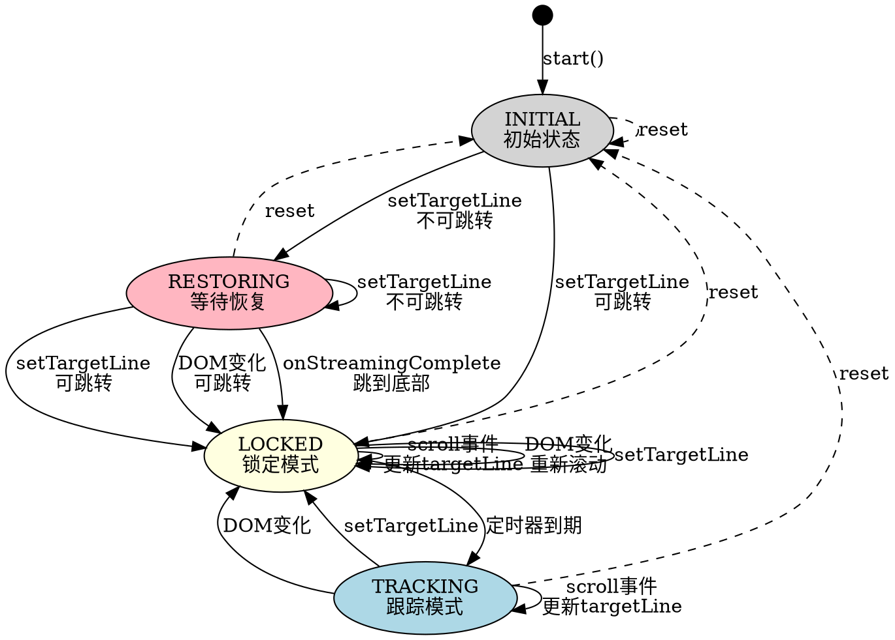

# Scroll Sync Controller 状态设计

## 核心概念

**阅读位置（Reading Position）**：用户当前正在阅读的源代码行号，用 `targetLine` 表示。

## 使用场景

### 场景 1：初始加载/恢复滚动位置

**阶段 1 - 等待可跳转条件**：
1. `setTargetLine(savedLine)` 设置恢复目标
2. 流式渲染开始，DOM 逐步增长
3. 每次 DOM 变化检查跳转条件
4. **跳转条件**：`目标位置 + 可视区域高度 <= 文档总高度`
5. 条件不满足时等待（目标 block 未渲染，或文档还不够长）

**阶段 2 - 条件满足，首次定位**：
6. 文档增长到足够高度，跳转条件满足
7. `correctPositionDrift()` 执行跳转
8. 进入 LOCKED 状态

**阶段 3 - 渲染完成检查**：
9. 流式渲染完成时检查是否已跳转
10. 如果还未跳转（文档太短，`savedLine` 超出文档范围）
11. 强制跳转到文档底部

**阶段 4 - 异步渲染，位置维护**：
12. 后续异步渲染（图表等）由场景 3 处理

### 场景 2：流式加载完成后用户主动滚动
1. 流式渲染完成，当前在第 10 行
2. 用户滚动到第 50 行（想看别的内容）
3. **期望**：用户滚动后 `targetLine` 更新为 50
4. 后续异步渲染导致的 DOM 变化应保持在第 50 行

### 场景 3：异步渲染（图表等）
1. 流式渲染完成，用户在第 30 行阅读
2. Mermaid 图表异步渲染完成，DOM 高度变化
3. 滚动位置应保持在第 30 行

### 场景 4：编辑器同步（VSCode）
1. 用户在编辑器点击第 100 行
2. 预览自动滚动到第 100 行
3. 用户继续在预览中滚动，位置同步回编辑器

## 跳转条件判断

```typescript
/**
 * 检查是否可以跳转到目标位置
 * 条件：目标 block 已存在（可以计算位置）
 * 浏览器会自动将滚动位置限制在有效范围内
 */
function canScrollToTarget(): boolean {
  const targetPos = getScrollPositionForLine(targetLine);
  return targetPos !== null;  // 目标 block 存在即可跳转
}
```

## 状态定义

### 滚动状态（ScrollState）

```
INITIAL   - 初始状态（刚启动或重置后，等待调用 setTargetLine）
RESTORING - 等待恢复位置（已设置目标，等待 DOM 足够高）
TRACKING  - 跟踪模式，响应用户滚动，更新 targetLine
LOCKED    - 锁定模式，程序化滚动中
```

### 状态分组

**初始加载阶段**：
- INITIAL → 等待设置恢复目标
- RESTORING → 等待 DOM 足够高

**正常运行阶段**：
- TRACKING → 跟踪用户滚动
- LOCKED → 程序化滚动中

### 状态说明

| 状态 | 含义 | scroll 事件处理 | DOM 变化处理 |
|-----|------|----------------|-------------|
| INITIAL | 等待恢复目标 | 忽略 | 忽略 |
| RESTORING | 等待 DOM 足够高 | 忽略（DOM 变化导致） | 检查跳转条件 |
| TRACKING | 跟踪用户滚动 | 更新 targetLine，报告位置 | 位置维护 |
| LOCKED | 程序化滚动中 | 更新 targetLine，不报告 | 重新滚动 |

### 状态变量

| 变量 | 类型 | 用途 |
|-----|------|------|
| `targetLine` | number | 当前阅读位置（行号） |
| `scrollState` | enum | 当前滚动状态 |
| `lastContentHeight` | number | 上次内容高度，用于检测 DOM 变化 |

## 状态转移图



**约束**：
- `setTargetLine()` 可从任意状态调用，根据当前状态决定行为
- `reset()` 从任意状态回到 INITIAL

## 状态-事件矩阵

| 事件 | INITIAL | RESTORING | TRACKING | LOCKED |
|-----|---------|-----------|----------|--------|
| **setTargetLine(line)** | 设置 targetLine，检查跳转：可跳转→LOCKED，否则→RESTORING | 更新 targetLine，检查跳转：可跳转→LOCKED，否则保持 | 执行跳转 → LOCKED | 更新 targetLine，重新跳转，重置定时器 → LOCKED |
| **scroll 事件** | 忽略 | 忽略（DOM变化导致，非用户行为） | 更新 targetLine，报告位置 → TRACKING | 更新 targetLine，不报告 → LOCKED |
| **DOM 变化** | 忽略 | 检查跳转：可跳转→LOCKED，否则保持 | 执行位置维护 → LOCKED | 重新跳转，重置定时器 → LOCKED |
| **onStreamingComplete** | 忽略 | 尝试跳转到targetLine，否则跳到底部 → LOCKED | 忽略 | 忽略 |
| **定时器到期** | - | - | - | → TRACKING |
| **reset()** | → INITIAL | → INITIAL | → INITIAL | → INITIAL |

**说明**：
- `-` 表示该状态下不存在此事件
- RESTORING 状态忽略 scroll 事件，因为此时的 scroll 都是 DOM 变化导致的浏览器自动调整

## 事件处理

### 1. 滚动事件（scroll）

**触发**：浏览器 scroll 事件

**INITIAL 状态**：忽略

**RESTORING 状态**：忽略（此时的 scroll 事件是 DOM 变化导致的浏览器自动调整，不是用户行为）

**TRACKING 状态**：
1. 更新 `targetLine` 为当前滚动位置
2. 报告位置变化（防抖）
3. 保持 TRACKING 状态

**LOCKED 状态**：
1. 更新 `targetLine` 为当前滚动位置（**关键！**）
2. **不**报告位置变化
3. 保持 LOCKED 状态

### 2. DOM 变化（Content Change）

**触发**：MutationObserver 或 ResizeObserver 检测到内容高度变化

**RESTORING 状态**：
1. 检查跳转条件：`canScrollToTarget()`
2. 条件满足：执行跳转，进入 LOCKED
3. 条件不满足：保持 RESTORING，等待更多内容

**TRACKING 状态**：
1. 进入 LOCKED 状态
2. 滚动到 `targetLine` 位置
3. 启动定时器

**LOCKED 状态**：
1. 保持 LOCKED 状态
2. 重新滚动到 `targetLine` 位置
3. 重置定时器

### 3. 设置目标行（setTargetLine）

**触发**：初始加载恢复位置 或 编辑器同步

**处理**：
1. 设置 `targetLine`
2. 检查当前是否可以跳转
3. 可以跳转：执行跳转，进入 LOCKED
4. 不能跳转：
   - INITIAL/RESTORING 状态：进入 RESTORING，等待 DOM 变化
   - TRACKING/LOCKED 状态：执行跳转（浏览器会自动限制在有效范围内）

### 4. 流式渲染完成（onStreamingComplete）

**触发**：外部调用，表示初始 DOM 渲染完成

**RESTORING 状态**：
1. 先尝试跳转到 targetLine
2. 如果目标 block 存在：执行跳转，进入 LOCKED
3. 如果目标 block 不存在：跳转到文档底部，进入 LOCKED

**其他状态**：无操作

### 5. 重置（reset）

**触发**：文档切换

**处理**：
1. 重置 `targetLine` 为 0
2. 重置 `lastContentHeight` 为 0
3. 取消定时器
4. 进入 INITIAL 状态

## 典型调用流程

### 初始加载
```typescript
controller.start();
controller.setTargetLine(savedLine);  // 可能进入 RESTORING
// ... 流式渲染 ...
controller.onStreamingComplete();
```

### 切换文档
```typescript
controller.reset();                   // 重置状态
controller.setTargetLine(savedLine);  // 可能进入 RESTORING
// ... 流式渲染 ...
controller.onStreamingComplete();
```

### 编辑器同步
```typescript
// 文档已加载完成，用户在编辑器中点击
controller.setTargetLine(editorLine);
```
