# DOT 图表 (Graphviz) 完整演示

[返回主测试文档](./test.md)

本文档包含 DOT/Graphviz 图表的完整演示，涵盖各种图类型和样式特性。

---

## 1. 有向图 (Digraph)

### 1.1 简单有向图

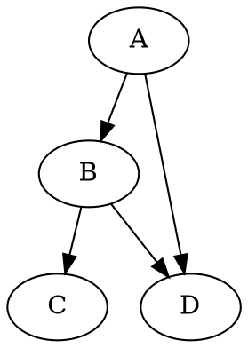

### 1.2 带样式的有向图

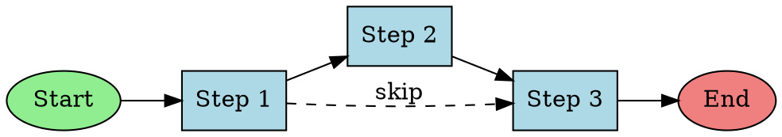

### 1.3 复杂有向图

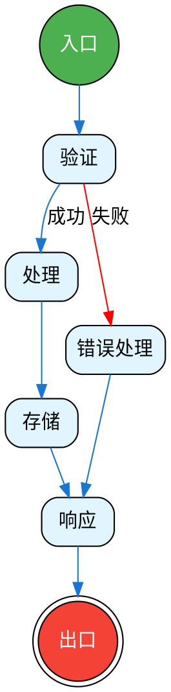

---

## 2. 无向图 (Graph)

### 2.1 基础无向图

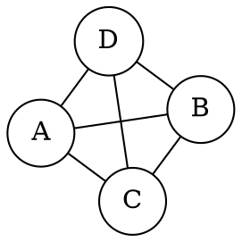

### 2.2 网络拓扑图

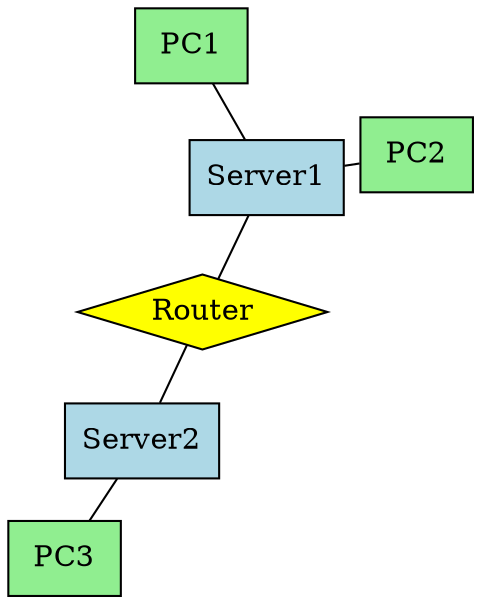

---

## 3. 子图和集群

### 3.1 前后端架构

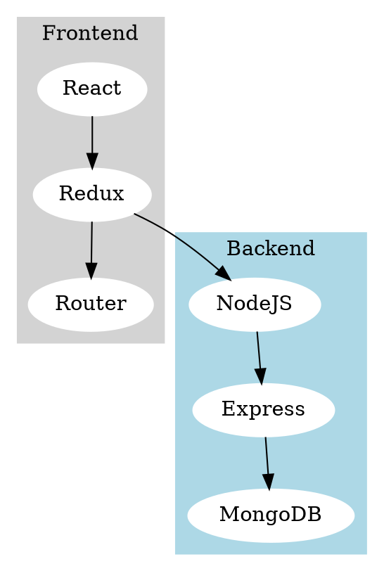

### 3.2 多层架构图

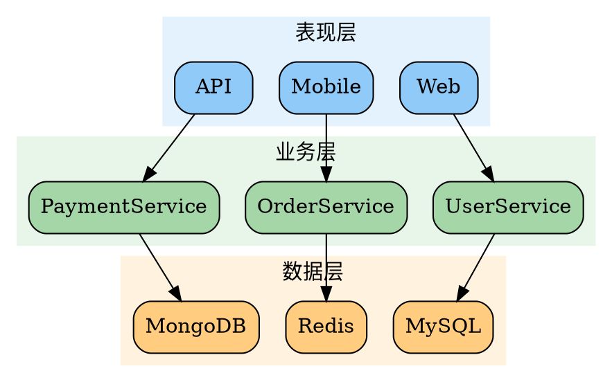

---

## 4. 状态机图

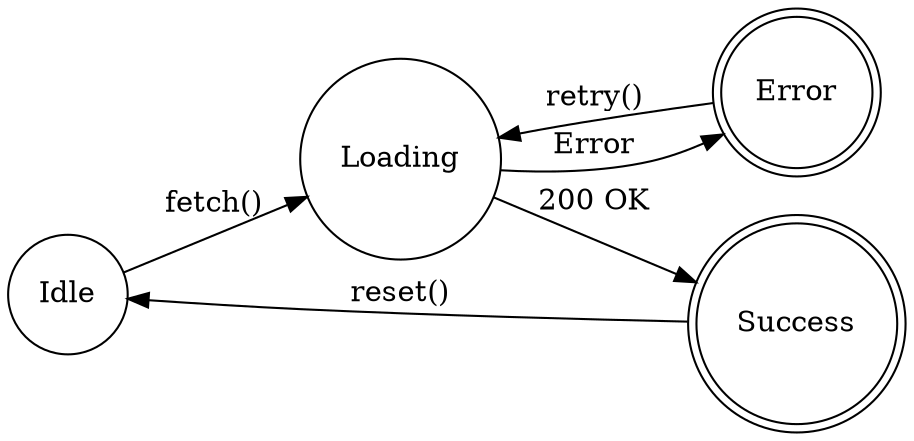

---

## 5. 记录节点（表格样式）

### 5.1 数据库表关系

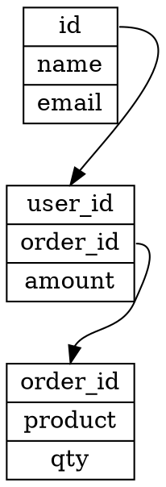

### 5.2 类结构图

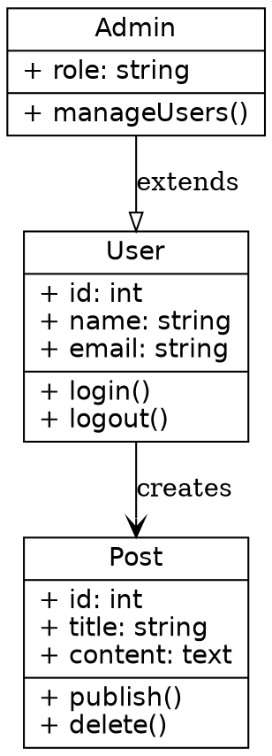

---

## 6. 节点形状展示

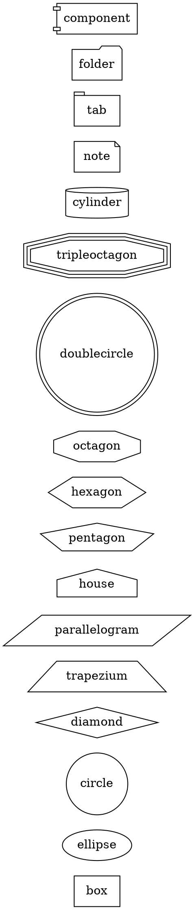

---

## 7. 边样式展示

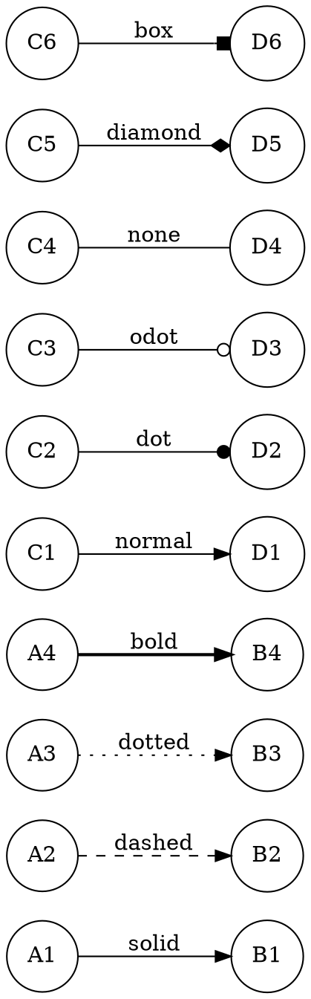

---

## 8. 颜色方案

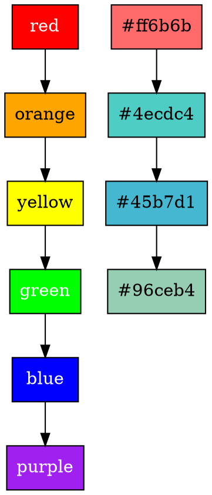

---

## 9. 流程图示例

### 9.1 用户登录流程

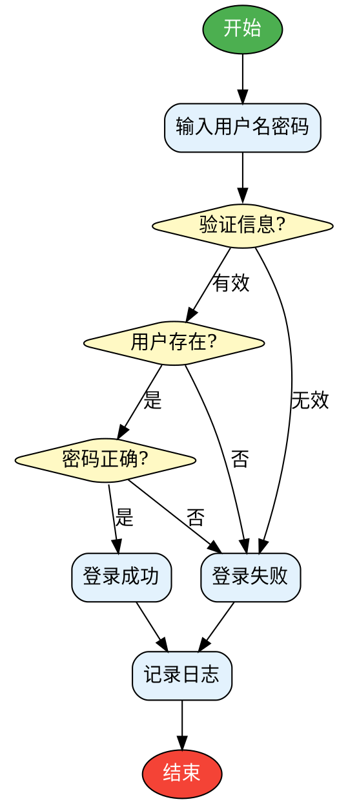

### 9.2 CI/CD 流程

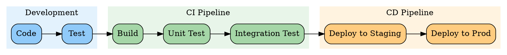

---

## 10. 组织架构图

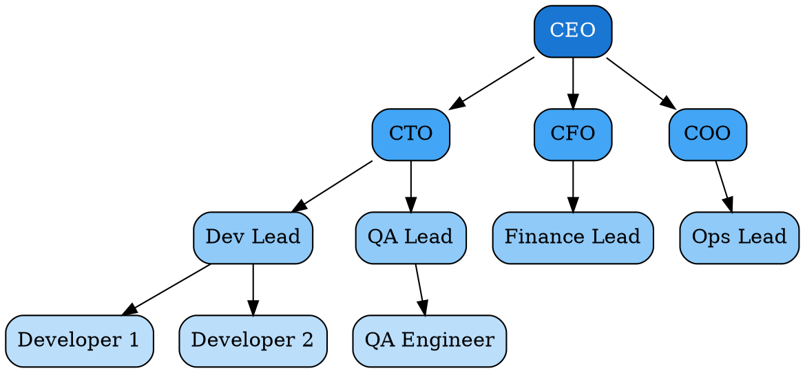

---

[返回主测试文档](./test.md)
