# Mermaid 图表完整演示

[返回主测试文档](./test.md)

本文档包含 Mermaid 图表的完整演示，涵盖所有支持的图表类型和高级特性。

---

## 1. 流程图 (Flowchart)

### 1.1 基础流程图

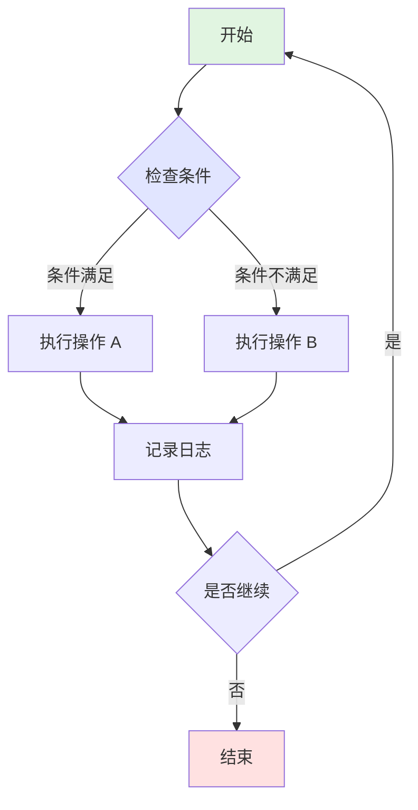
```mermaid
flowchart TD
    A[开始] --> B{检查条件}
    B -->|条件满足| C[执行操作 A]
    B -->|条件不满足| D[执行操作 B]
    C --> E[记录日志]
    D --> E
    E --> F{是否继续}
    F -->|是| A
    F -->|否| G[结束]
    
    style A fill:#e1f5e1
    style G fill:#ffe1e1
    style B fill:#e1e5ff
```

### 1.2 方向变化

**从左到右 (LR)**

```mermaid
flowchart LR
    A[输入] --> B[处理] --> C[输出]
```

**从下到上 (BT)**

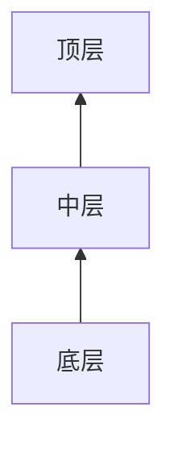
```mermaid
flowchart BT
    A[底层] --> B[中层] --> C[顶层]
```

### 1.3 节点形状

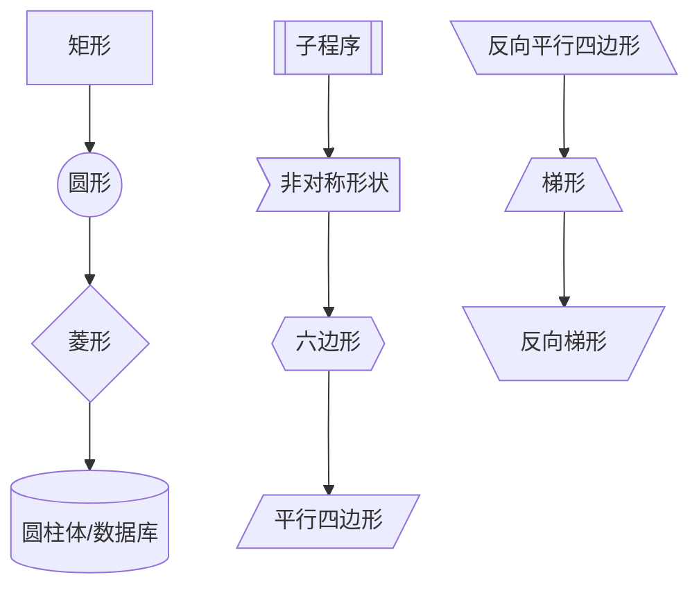
```mermaid
flowchart TD
    A[矩形]
    B((圆形))
    C{菱形}
    D[(圆柱体/数据库)]
    E[[子程序]]
    F>非对称形状]
    G{{六边形}}
    H[/平行四边形/]
    I[\反向平行四边形\]
    J[/梯形\]
    K[\反向梯形/]
    
    A --> B --> C --> D
    E --> F --> G --> H
    I --> J --> K
```

### 1.4 连接线样式

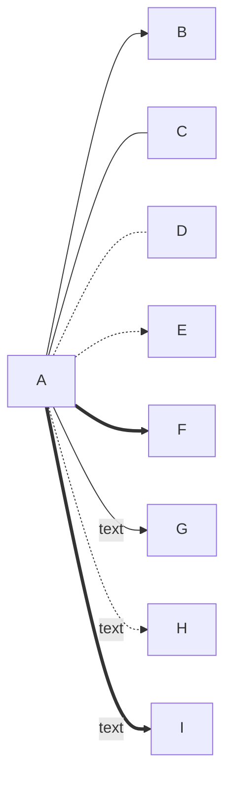
```mermaid
flowchart LR
    A --> B
    A --- C
    A -.- D
    A -.-> E
    A ==> F
    A --text--> G
    A -.text.-> H
    A ==text==> I
```

---

## 2. 序列图 (Sequence Diagram)

### 2.1 基础序列图

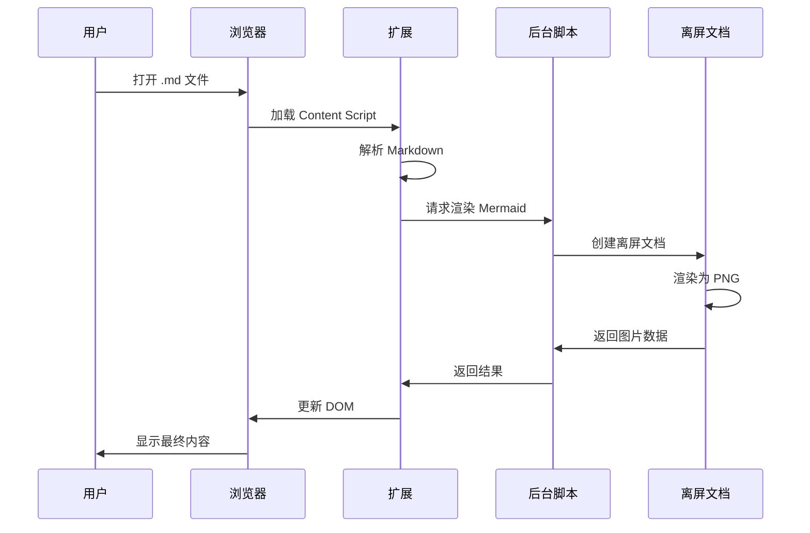
```mermaid
sequenceDiagram
    participant U as 用户
    participant B as 浏览器
    participant E as 扩展
    participant BG as 后台脚本
    participant OS as 离屏文档
    
    U->>B: 打开 .md 文件
    B->>E: 加载 Content Script
    E->>E: 解析 Markdown
    E->>BG: 请求渲染 Mermaid
    BG->>OS: 创建离屏文档
    OS->>OS: 渲染为 PNG
    OS->>BG: 返回图片数据
    BG->>E: 返回结果
    E->>B: 更新 DOM
    B->>U: 显示最终内容
```

### 2.2 消息类型

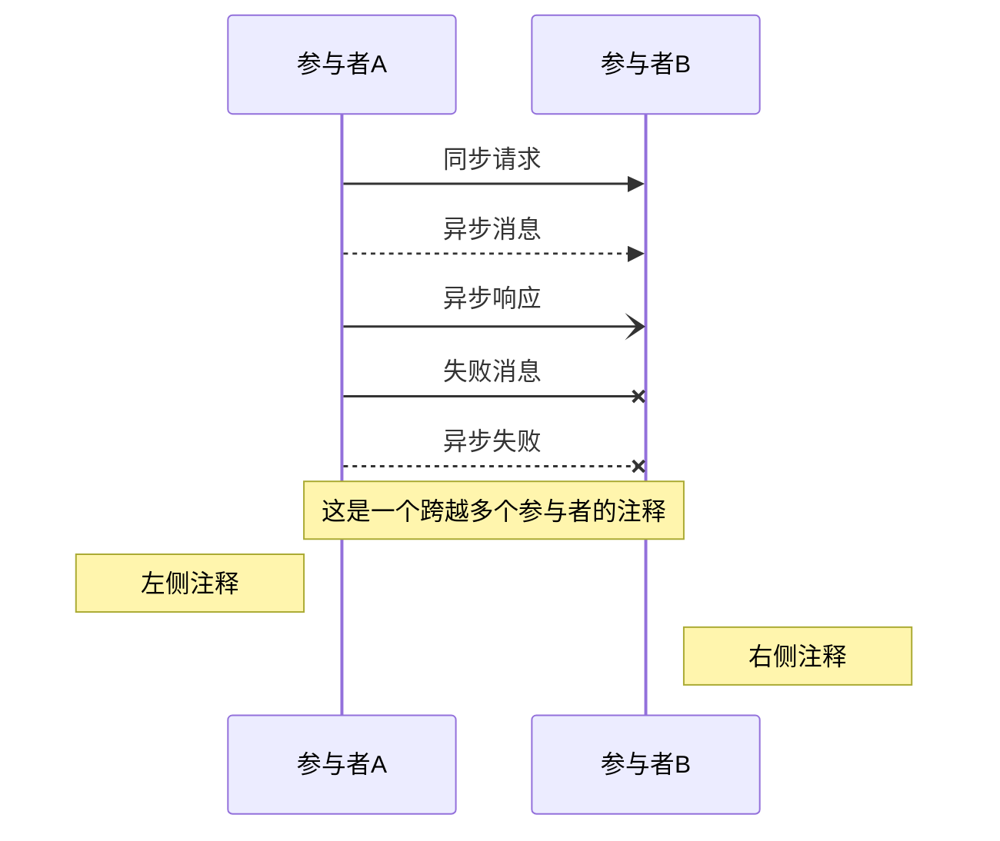
```mermaid
sequenceDiagram
    participant A as 参与者A
    participant B as 参与者B
    
    A->>B: 同步请求
    A-->>B: 异步消息
    A-)B: 异步响应
    A-xB: 失败消息
    A--xB: 异步失败
    
    Note over A,B: 这是一个跨越多个参与者的注释
    Note left of A: 左侧注释
    Note right of B: 右侧注释
```

### 2.3 激活和循环

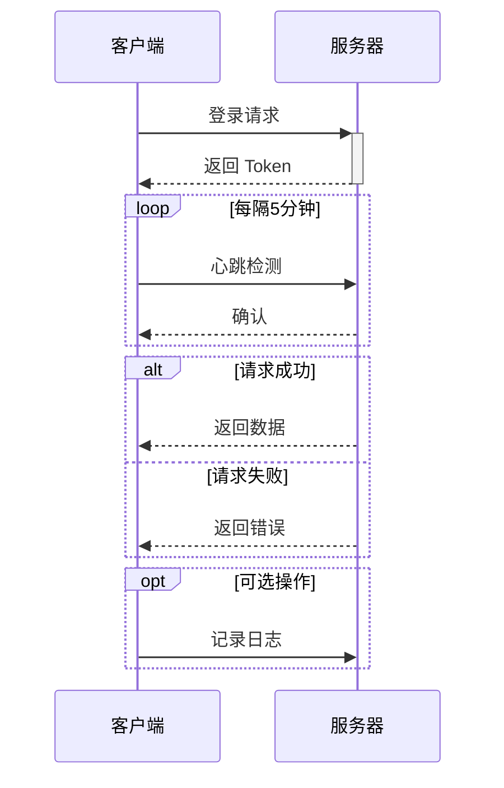
```mermaid
sequenceDiagram
    participant C as 客户端
    participant S as 服务器
    
    C->>+S: 登录请求
    S-->>-C: 返回 Token
    
    loop 每隔5分钟
        C->>S: 心跳检测
        S-->>C: 确认
    end
    
    alt 请求成功
        S-->>C: 返回数据
    else 请求失败
        S-->>C: 返回错误
    end
    
    opt 可选操作
        C->>S: 记录日志
    end
```

---

## 3. 甘特图 (Gantt Chart)

### 3.1 基础甘特图

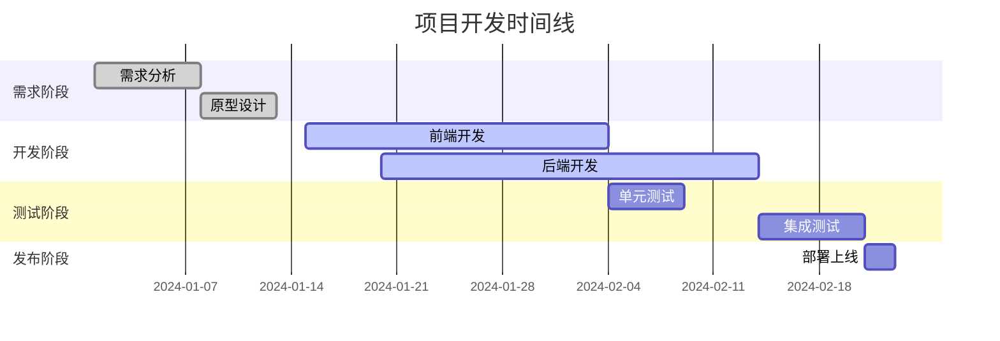
```mermaid
gantt
    title 项目开发时间线
    dateFormat YYYY-MM-DD
    section 需求阶段
    需求分析           :done,    des1, 2024-01-01, 7d
    原型设计           :done,    des2, 2024-01-08, 5d
    section 开发阶段
    前端开发           :active,  dev1, 2024-01-15, 20d
    后端开发           :active,  dev2, 2024-01-20, 25d
    section 测试阶段
    单元测试           :         test1, after dev1, 5d
    集成测试           :         test2, after dev2, 7d
    section 发布阶段
    部署上线           :         deploy, after test2, 2d
```

### 3.2 完整甘特图

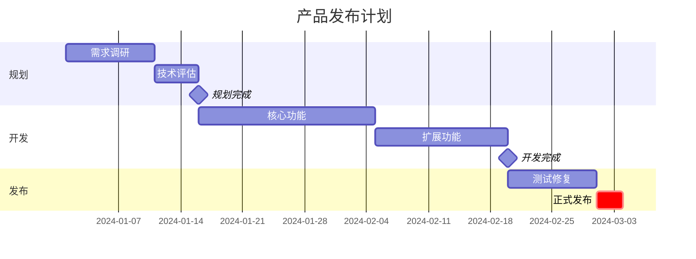
```mermaid
gantt
    title 产品发布计划
    dateFormat YYYY-MM-DD
    
    section 规划
    需求调研           :a1, 2024-01-01, 10d
    技术评估           :a2, after a1, 5d
    规划完成           :milestone, after a2, 0d
    
    section 开发
    核心功能           :b1, after a2, 20d
    扩展功能           :b2, after b1, 15d
    开发完成           :milestone, after b2, 0d
    
    section 发布
    测试修复           :c1, after b2, 10d
    正式发布           :crit, c2, after c1, 3d
```

---

## 4. 类图 (Class Diagram)

### 4.1 基础类图

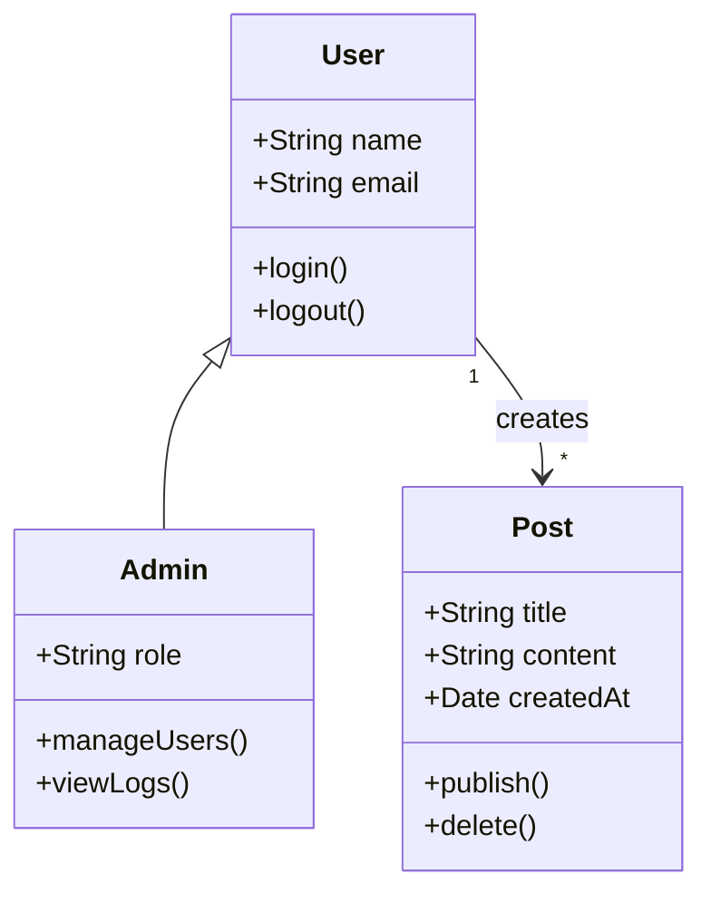
```mermaid
classDiagram
    class User {
        +String name
        +String email
        +login()
        +logout()
    }
    
    class Admin {
        +String role
        +manageUsers()
        +viewLogs()
    }
    
    class Post {
        +String title
        +String content
        +Date createdAt
        +publish()
        +delete()
    }
    
    User <|-- Admin
    User "1" --> "*" Post : creates
```

### 4.2 完整类图示例

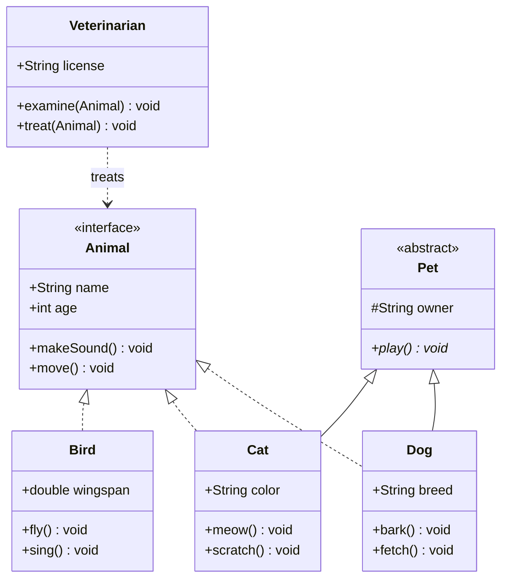
```mermaid
classDiagram
    class Animal {
        <<interface>>
        +String name
        +int age
        +makeSound() void
        +move() void
    }
    
    class Dog {
        +String breed
        +bark() void
        +fetch() void
    }
    
    class Cat {
        +String color
        +meow() void
        +scratch() void
    }
    
    class Bird {
        +double wingspan
        +fly() void
        +sing() void
    }
    
    class Pet {
        <<abstract>>
        #String owner
        +play() void*
    }
    
    Animal <|.. Dog
    Animal <|.. Cat
    Animal <|.. Bird
    Pet <|-- Dog
    Pet <|-- Cat
    
    class Veterinarian {
        +String license
        +examine(Animal) void
        +treat(Animal) void
    }
    
    Veterinarian ..> Animal : treats
```

---

## 5. 状态图 (State Diagram)

### 5.1 基础状态图

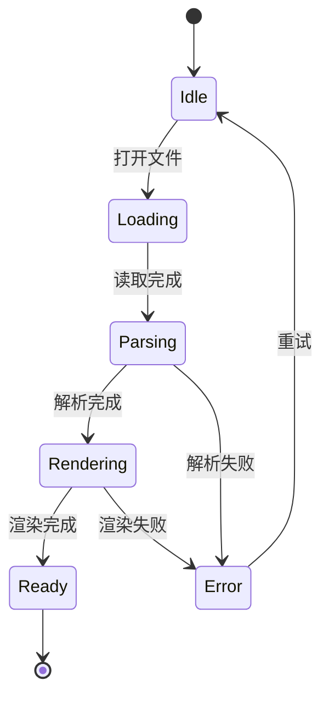
```mermaid
stateDiagram-v2
    [*] --> Idle
    Idle --> Loading : 打开文件
    Loading --> Parsing : 读取完成
    Parsing --> Rendering : 解析完成
    Rendering --> Ready : 渲染完成
    Ready --> [*]
    
    Parsing --> Error : 解析失败
    Rendering --> Error : 渲染失败
    Error --> Idle : 重试
```

### 5.2 复合状态

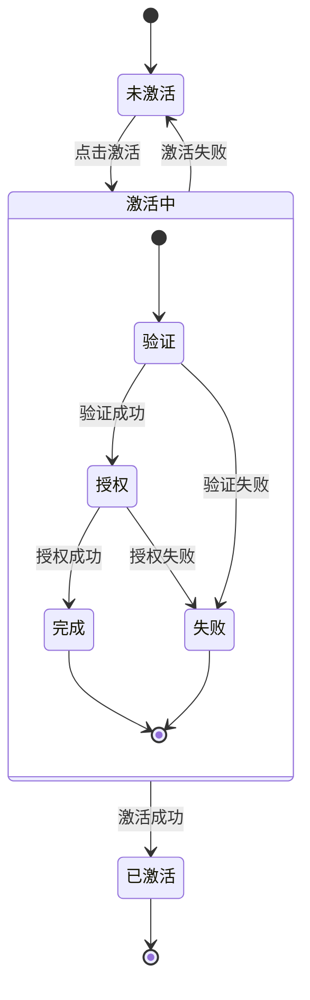
```mermaid
stateDiagram-v2
    [*] --> 未激活
    未激活 --> 激活中 : 点击激活
    
    state 激活中 {
        [*] --> 验证
        验证 --> 授权 : 验证成功
        验证 --> 失败 : 验证失败
        授权 --> 完成 : 授权成功
        授权 --> 失败 : 授权失败
        完成 --> [*]
        失败 --> [*]
    }
    
    激活中 --> 已激活 : 激活成功
    激活中 --> 未激活 : 激活失败
    已激活 --> [*]
```

---

## 6. 饼图 (Pie Chart)

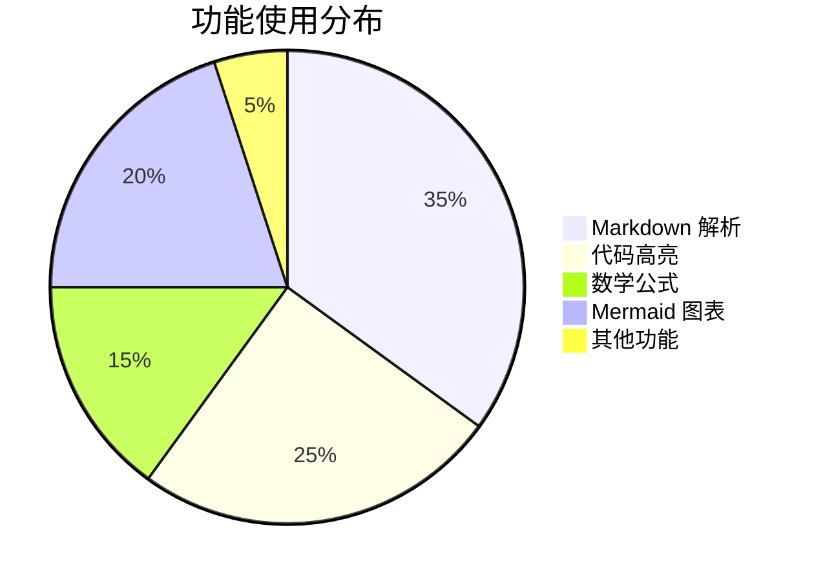
```mermaid
pie title 功能使用分布
    "Markdown 解析" : 35
    "代码高亮" : 25
    "数学公式" : 15
    "Mermaid 图表" : 20
    "其他功能" : 5
```

---

## 7. 实体关系图 (ER Diagram)

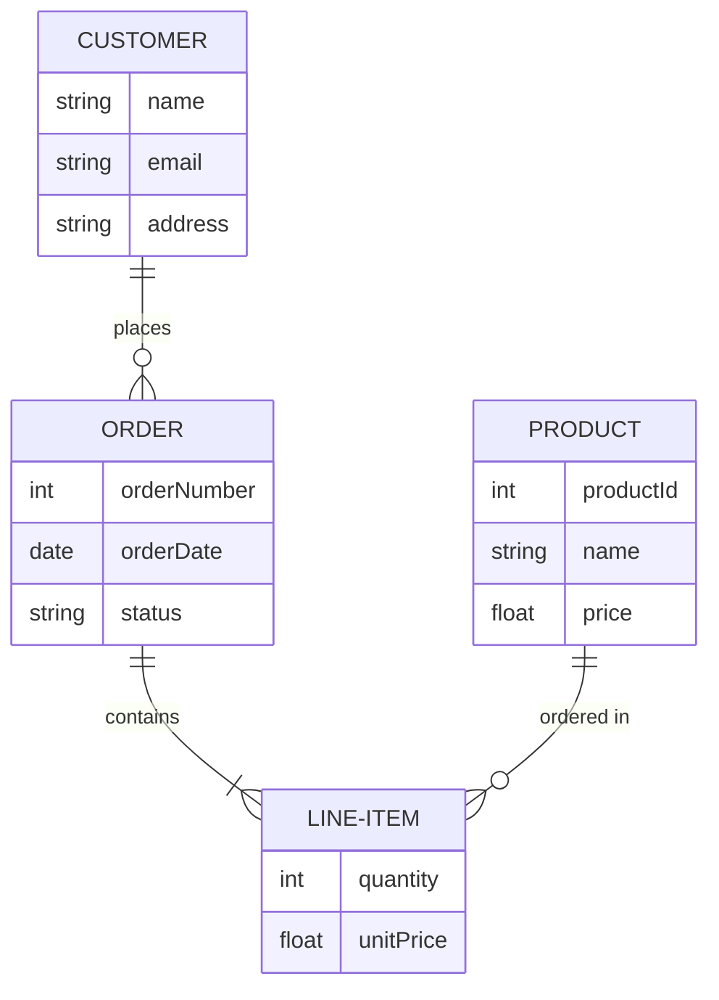
```mermaid
erDiagram
    CUSTOMER ||--o{ ORDER : places
    CUSTOMER {
        string name
        string email
        string address
    }
    ORDER ||--|{ LINE-ITEM : contains
    ORDER {
        int orderNumber
        date orderDate
        string status
    }
    PRODUCT ||--o{ LINE-ITEM : "ordered in"
    PRODUCT {
        int productId
        string name
        float price
    }
    LINE-ITEM {
        int quantity
        float unitPrice
    }
```

---

## 8. Git 图 (Git Graph)

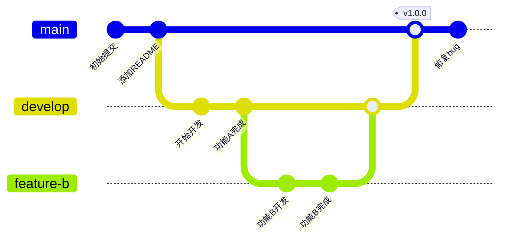
```mermaid
gitGraph
    commit id: "初始提交"
    commit id: "添加README"
    branch develop
    checkout develop
    commit id: "开始开发"
    commit id: "功能A完成"
    branch feature-b
    checkout feature-b
    commit id: "功能B开发"
    commit id: "功能B完成"
    checkout develop
    merge feature-b
    checkout main
    merge develop tag: "v1.0.0"
    commit id: "修复bug"
```

---

## 9. Block 图

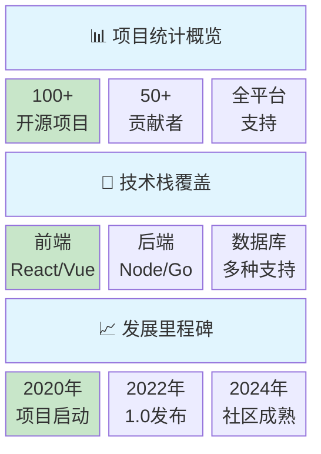
```mermaid
block-beta
    columns 3
    
    A["📊 项目统计概览"]:3
    B1["100+\n开源项目"]
    B2["50+\n贡献者"]
    B3["全平台\n支持"]
    
    C["🔧 技术栈覆盖"]:3
    C1["前端\nReact/Vue"]
    C2["后端\nNode/Go"]
    C3["数据库\n多种支持"]
    
    D["📈 发展里程碑"]:3
    D1["2020年\n项目启动"]
    D2["2022年\n1.0发布"]
    D3["2024年\n社区成熟"]
    
    style A fill:#e1f5fe
    style C fill:#e1f5fe
    style D fill:#e1f5fe
    style B1 fill:#c8e6c9
    style C1 fill:#c8e6c9
    style D1 fill:#c8e6c9
```

---

## 10. 用户旅程图 (User Journey)

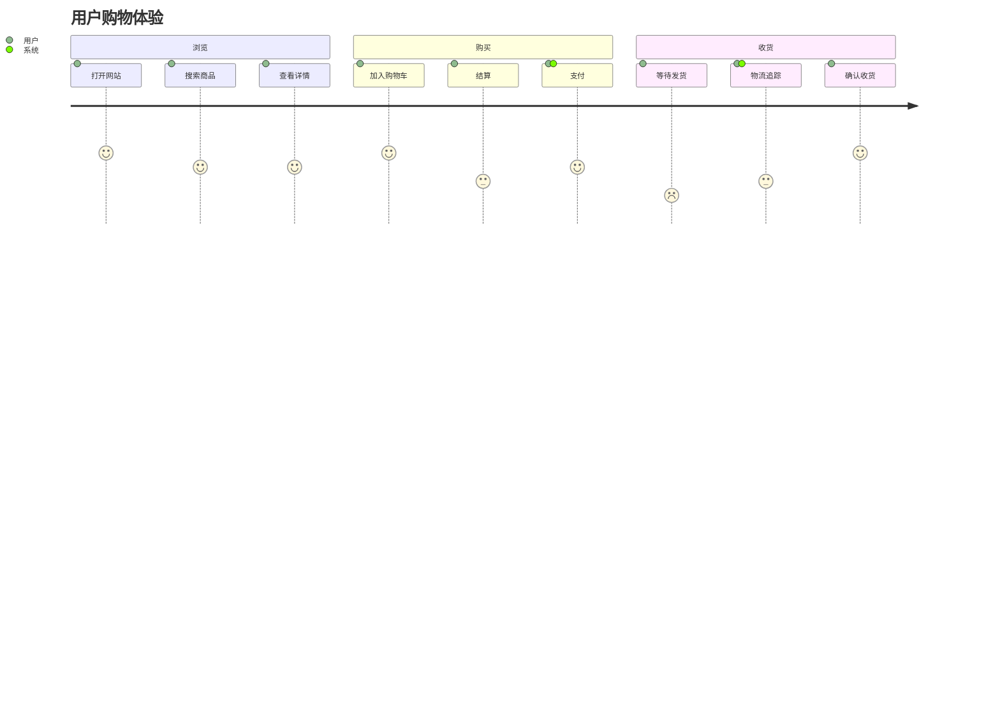
```mermaid
journey
    title 用户购物体验
    section 浏览
        打开网站: 5: 用户
        搜索商品: 4: 用户
        查看详情: 4: 用户
    section 购买
        加入购物车: 5: 用户
        结算: 3: 用户
        支付: 4: 用户, 系统
    section 收货
        等待发货: 2: 用户
        物流追踪: 3: 用户, 系统
        确认收货: 5: 用户
```

---

## 11. 思维导图 (Mindmap)

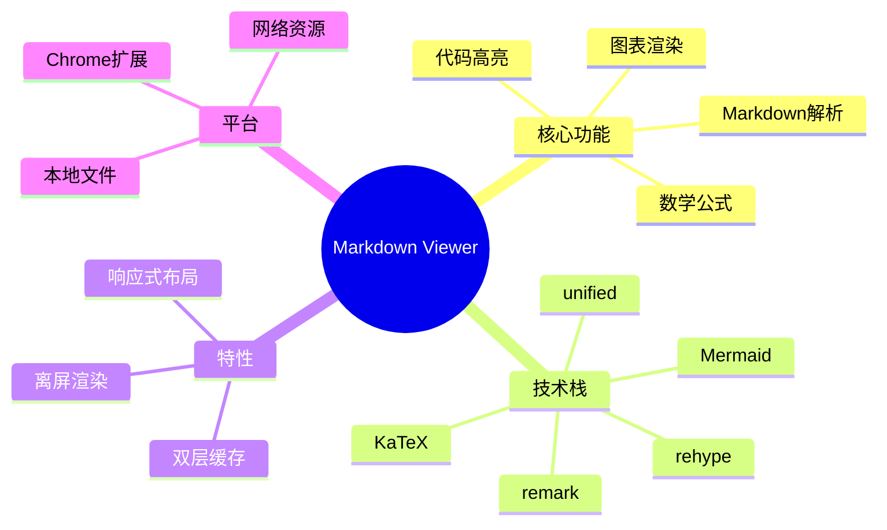
```mermaid
mindmap
    root((Markdown Viewer))
        核心功能
            Markdown解析
            代码高亮
            数学公式
            图表渲染
        技术栈
            unified
            remark
            rehype
            KaTeX
            Mermaid
        特性
            双层缓存
            离屏渲染
            响应式布局
        平台
            Chrome扩展
            本地文件
            网络资源
```

---

## 12. 时间线 (Timeline)

```mermaid
timeline
    title 项目发展历程
    section 2020
        Q1 : 项目立项
            : 需求分析
        Q2 : 原型开发
            : 核心功能
    section 2021
        Q1 : Alpha版本
        Q3 : Beta版本
    section 2022
        Q2 : 1.0正式版
        Q4 : 2.0重构版
    section 2023
        Q1 : 3.0功能扩展
        Q3 : 用户量突破10万
```

---

## 13. 象限图 (Quadrant Chart)

```mermaid
quadrantChart
    title Tech Selection
    x-axis Low Learning Cost --> High Learning Cost
    y-axis Low Performance --> High Performance
    quadrant-1 Focus
    quadrant-2 Ideal
    quadrant-3 Caution
    quadrant-4 Alternative
    React: [0.7, 0.8]
    Vue: [0.4, 0.7]
    Angular: [0.8, 0.75]
    Svelte: [0.35, 0.85]
    jQuery: [0.2, 0.3]
```

---

## 14. 换行容错测试

```mermaid
flowchart TD
    F2["🔗 接口规范统一\n三统一要求"]
```

---

## 15. 病毒传播图 (Viral Spread)

展示产品或内容的病毒式传播路径，适合增长策略分析、营销效果评估。

```mermaid
graph LR
    A[种子用户] -->|分享| B[一级传播]
    B -->|再分享| C[二级传播]
    C -->|再分享| D[三级传播]
    
    A1[内部推广] -.-> A
    A2[早期体验者] -.-> A
    
    B1[社交网络] -.-> B
    B2[口碑推荐] -.-> B
    B3[活动引流] -.-> B
    
    C1[自然增长] -.-> C
    C2[病毒传播] -.-> C
    
    E[数据追踪] --> F[来源分析]
    E --> G[转化路径]
    E --> H[传播热力图]
    
    A --> E
    B --> E
    C --> E
    D --> E
    
    style A fill:#FFD700
    style B fill:#90EE90
    style C fill:#87CEEB
    style D fill:#DDA0DD
```

---

## 16. 分布式架构图 (Distributed Architecture)

展示分布式系统中多个节点的协作关系，适合联邦学习、微服务架构、边缘计算。

```mermaid
graph TB
    subgraph 中心节点
    C[协调器]
    G[全局模型]
    end
    
    subgraph 节点A
    A1[本地数据] --> A2[边缘计算]
    A2 --> A3[本地模型]
    end
    
    subgraph 节点B
    B1[本地数据] --> B2[边缘计算]
    B2 --> B3[本地模型]
    end
    
    subgraph 节点C
    C1[本地数据] --> C2[边缘计算]
    C2 --> C3[本地模型]
    end
    
    C -->|分发初始模型| A3
    C -->|分发初始模型| B3
    C -->|分发初始模型| C3
    
    A3 -->|上传参数| C
    B3 -->|上传参数| C
    C3 -->|上传参数| C
    
    C --> G
    G -->|分发更新| A3
    G -->|分发更新| B3
    G -->|分发更新| C3
    
    style A1 fill:#fff9c4
    style B1 fill:#fff9c4
    style C1 fill:#fff9c4
    style G fill:#c8e6c9
```

---

## 17. 问题分析图 (Problem Analysis)

展示问题的多层次分析，从根本原因到表面现象的树状关系。

```mermaid
graph TB
    A[系统性能问题] --> B[数据库层面]
    A --> C[应用层面]
    A --> D[网络层面]
    
    B --> B1[查询效率低]
    B --> B2[连接池不足]
    B --> B3[数据量过大]
    
    C --> C1[代码冗余]
    C --> C2[缓存失效]
    C --> C3[内存泄漏]
    
    D --> D1[带宽不足]
    D --> D2[DNS解析慢]
    D --> D3[CDN未配置]
    
    B1 --> E[性能瓶颈汇总]
    B2 --> E
    B3 --> E
    C1 --> E
    C2 --> E
    C3 --> E
    D1 --> E
    D2 --> E
    D3 --> E
    
    style A fill:#ff6b6b
    style E fill:#ffd43b
```

---

## 18. PDCA 循环流程图 (Circular Flow)

展示周期性的业务流程、持续改进循环。

```mermaid
graph LR
    A[计划 Plan] --> B[执行 Do]
    B --> C[检查 Check]
    C --> D[改进 Act]
    D --> A
    
    A -.-> A1[设定目标]
    A -.-> A2[制定方案]
    
    B -.-> B1[实施方案]
    B -.-> B2[记录数据]
    
    C -.-> C1[数据分析]
    C -.-> C2[对比目标]
    
    D -.-> D1[总结经验]
    D -.-> D2[优化方案]
    
    style A fill:#e1f5e1
    style B fill:#e1e8f5
    style C fill:#f5f0e1
    style D fill:#f5e1e8
```

---

## 19. 数据流转图 (Data Flow)

展示数据或价值在系统中的流转路径，形成闭环。

```mermaid
graph LR
    A[用户下单] --> B[支付系统]
    B --> C[订单确认]
    C --> D[库存扣减]
    D --> E[生成物流单]
    E --> F[仓库发货]
    F --> G[物流配送]
    G --> H[用户签收]
    H --> I[交易完成]
    
    I --> J[用户评价]
    J --> K[积分奖励]
    K --> L[积分账户]
    
    I --> M[销售数据]
    M --> N[数据分析]
    N --> O[营销优化]
    O --> A
    
    style A fill:#51cf66
    style I fill:#ffd43b
    style O fill:#74c0fc
```

---

## 20. 对比流程图 (Comparison Flowchart)

通过子图展示新旧方案对比。

```mermaid
flowchart LR
    subgraph 传统方案["传统方案"]
        direction TB
        A1["人工处理"] -->|耗时长| A2["线下审批"]
        A2 -->|易出错| A3["纸质存档"]
    end
    
    subgraph 数字化方案["数字化方案"]
        direction TB
        B1["自动化处理"] --> B2["在线审批"]
        B2 --> B3["电子存档"]
        B3 --> B4["数据分析"]
    end
    
    传统方案 -.升级转型.-> 数字化方案
    
    style A1 fill:#ffcccc
    style A2 fill:#ffcccc
    style A3 fill:#ffcccc
    style B1 fill:#ccffcc
    style B2 fill:#ccffcc
    style B3 fill:#ccffcc
    style B4 fill:#ccffcc
```

---

## 21. 功能优先级矩阵 (Priority Matrix)

按两个维度对多个项目进行分类和定位。

```mermaid
quadrantChart
    title 功能优先级矩阵
    x-axis "实现成本低" --> "实现成本高"
    y-axis "价值低" --> "价值高"
    quadrant-1 "重点开发"
    quadrant-2 "战略储备"
    quadrant-3 "暂缓开发"
    quadrant-4 "快速上线"
    "用户注册": [0.3, 0.8]
    "数据导出": [0.25, 0.75]
    "实时推送": [0.7, 0.85]
    "AI分析": [0.85, 0.9]
    "主题切换": [0.2, 0.2]
    "多语言": [0.6, 0.3]
    "数据可视化": [0.5, 0.7]
    "权限管理": [0.4, 0.65]
```

---

## 22. 用户购物旅程 (User Journey)

展示用户在使用产品或服务过程中的完整体验路径。

```mermaid
journey
    title 用户购物体验旅程
    section 发现阶段
      浏览商品: 4: 用户
      查看详情: 4: 用户
      对比价格: 3: 用户
    section 决策阶段
      加入购物车: 4: 用户
      查看评价: 5: 用户
      选择支付方式: 4: 用户
    section 购买阶段
      确认订单: 5: 用户
      完成支付: 5: 用户
      收到确认: 5: 用户
    section 售后阶段
      物流跟踪: 4: 用户
      收货确认: 5: 用户
      评价反馈: 4: 用户
```

---

## 23. Sankey 流程图 (v10.3.0+)

Sankey 图用于可视化流量从一组值到另一组值的转换。

### 能源流向图

```mermaid
sankey

%% 能源流向示例
Solar,Electricity,100
Wind,Electricity,80
Coal,Electricity,50
Electricity,Industry,120
Electricity,Residential,70
Electricity,Commercial,40
Industry,Products,100
Industry,Waste,20
Residential,Heating,40
Residential,Lighting,30
```

### 用户流量转化

```mermaid
sankey

%% 用户流量转化漏斗
Landing Page,Sign Up,1000
Landing Page,Bounce,500
Sign Up,Verification,800
Sign Up,Abandoned,200
Verification,Active User,700
Verification,Inactive,100
Active User,Purchase,400
Active User,Browse Only,300
Purchase,Repeat Customer,250
Purchase,One-time,150
```

---

## 24. XY 图表 (XY Chart)

XY 图表支持条形图和折线图的组合展示。

### 销售数据年度趋势

```mermaid
xychart
    title "年度销售额趋势 (万元)"
    x-axis [Jan, Feb, Mar, Apr, May, Jun, Jul, Aug, Sep, Oct, Nov, Dec]
    y-axis "销售额" 0 --> 150
    bar [65, 78, 52, 91, 103, 120, 135, 128, 110, 95, 88, 142]
    line [65, 78, 52, 91, 103, 120, 135, 128, 110, 95, 88, 142]
```

### 多指标对比图

```mermaid
xychart
    title "产品性能指标对比"
    x-axis ["性能", "稳定性", "易用性", "文档", "社区"]
    y-axis "评分" 0 --> 100
    bar [85, 92, 78, 65, 88]
    line [80, 85, 80, 75, 82]
```

### 横向 XY 图表

```mermaid
xychart horizontal
    title "部门预算分配"
    x-axis [研发, 市场, 销售, 运维, 人事]
    y-axis "预算(万)" 0 --> 500
    bar [450, 320, 280, 180, 120]
```

---

## 25. Block 块图 (Block Diagram)

Block 图提供精确控制的块状布局。

### 系统架构图

```mermaid
block
  columns 3
  Frontend blockArrowId6<[" "]>(right) Backend
  space:2 down<[" "]>(down)
  Disk left<[" "]>(left) Database[("Database")]

  classDef front fill:#696,stroke:#333;
  classDef back fill:#969,stroke:#333;
  class Frontend front
  class Backend,Database back
```

### 业务流程图

```mermaid
block
  columns 3
  Start(("Start")) space:2
  down<[" "]>(down) space:2
  Decision{{"Make Decision"}} right<["Yes"]>(right) Process1["Process A"]
  downAgain<["No"]>(down) space r3<["Done"]>(down)
  Process2["Process B"] r2<["Done"]>(right) End(("End"))

  style Start fill:#969;
  style End fill:#696;
```

### 数据库架构

```mermaid
block
columns 1
  db(("DB"))
  blockArrowId6<["&nbsp;&nbsp;&nbsp;"]>(down)
  block:ID
    A
    B["Primary Replica"]
    C
  end
  space
  D["Backup"]
  ID --> D
  C --> D
  style B fill:#969,stroke:#333,stroke-width:4px
```

---

## 26. Packet 网络包图 (v11.0.0+)

Packet 图用于可视化网络数据包结构。

### TCP 数据包结构

```mermaid
---
title: "TCP Packet"
---
packet
0-15: "Source Port"
16-31: "Destination Port"
32-63: "Sequence Number"
64-95: "Acknowledgment Number"
96-99: "Data Offset"
100-105: "Reserved"
106: "URG"
107: "ACK"
108: "PSH"
109: "RST"
110: "SYN"
111: "FIN"
112-127: "Window"
128-143: "Checksum"
144-159: "Urgent Pointer"
160-191: "(Options and Padding)"
192-255: "Data (variable length)"
```

### UDP 数据包结构

```mermaid
packet
title UDP Packet
+16: "Source Port"
+16: "Destination Port"
32-47: "Length"
48-63: "Checksum"
64-95: "Data (variable length)"
```

### IPv4 头部

```mermaid
---
title: "IPv4 Header"
---
packet
0-3: "Version"
4-7: "IHL"
8-13: "DSCP"
14-15: "ECN"
16-31: "Total Length"
32-47: "Identification"
48-50: "Flags"
51-63: "Fragment Offset"
64-71: "TTL"
72-79: "Protocol"
80-95: "Header Checksum"
96-127: "Source IP Address"
128-159: "Destination IP Address"
```

---

## 27. Kanban 看板图

Kanban 图用于可视化任务流程和工作状态。

### 项目任务看板

```mermaid
kanban
  Todo
    [Design System]
    docs[Write Documentation]
  [In Progress]
    id6[Implement Feature A]
  [Code Review]
    id8[API Integration]
  [Testing]
    id4[Unit Tests]
    id66[E2E Tests]
  [Done]
    id5[Setup CI/CD]
    id2[Database Schema]
```

### 敏捷开发看板

```mermaid
kanban
  Backlog
    [User Authentication]
    [Payment Gateway]
    [Email Notifications]
  Sprint
    [Shopping Cart]
    [Product Search]
  InProgress
    [Checkout Flow]
  Review
    [Order History]
  Done
    [User Profile]
    [Product List]
```

---

## 28. Architecture 架构图 (v11.1.0+)

Architecture 图用于展示云服务和系统架构。

### 云服务架构

```mermaid
architecture-beta
    group api(cloud)[API]

    service db(database)[Database] in api
    service disk1(disk)[Storage] in api
    service disk2(disk)[Storage] in api
    service server(server)[Server] in api

    db:L -- R:server
    disk1:T -- B:server
    disk2:T -- B:db
```

### 微服务架构

```mermaid
architecture-beta
    group frontend(cloud)[Frontend]
    group backend(cloud)[Backend]
    group data(cloud)[Data Layer]

    service web(server)[Web App] in frontend
    service mobile(server)[Mobile App] in frontend
    
    service gateway(internet)[API Gateway] in backend
    service auth(server)[Auth Service] in backend
    service user(server)[User Service] in backend
    
    service db(database)[PostgreSQL] in data
    service cache(database)[Redis Cache] in data

    web:B -- T:gateway
    mobile:B -- T:gateway
    gateway:B -- T:auth
    gateway:B -- T:user
    auth:B -- T:db
    user:B -- T:db
    user:R -- L:cache
```

### 网络拓扑图

```mermaid
architecture-beta
    service left_disk(disk)[Disk]
    service top_disk(disk)[Disk]
    service bottom_disk(disk)[Disk]
    service top_gateway(internet)[Gateway]
    service bottom_gateway(internet)[Gateway]
    junction junctionCenter
    junction junctionRight

    left_disk:R -- L:junctionCenter
    top_disk:B -- T:junctionCenter
    bottom_disk:T -- B:junctionCenter
    junctionCenter:R -- L:junctionRight
    top_gateway:B -- T:junctionRight
    bottom_gateway:T -- B:junctionRight
```

---

## 29. Radar 雷达图 (v11.6.0+)

雷达图用于多维度数据的比较展示。

### 学生成绩对比

```mermaid
---
title: "成绩对比"
---
radar-beta
  axis m["数学"], s["科学"], e["英语"]
  axis h["历史"], g["地理"], a["艺术"]
  curve a["小明"]{85, 90, 80, 70, 75, 90}
  curve b["小红"]{70, 75, 85, 80, 90, 85}

  max 100
  min 0
```

### 产品能力评估

```mermaid
radar-beta
  title 产品能力雷达图
  axis perf["性能"], stab["稳定性"], use["易用性"]
  axis doc["文档"], eco["生态"],

  curve a["产品 A"]{4, 3, 2, 4}
  curve b["产品 B"]{3, 4, 3, 3}
  curve c["产品 C"]{2, 3, 4, 2}

  graticule polygon
  max 5
```

### 团队技能分布

```mermaid
radar-beta
  title 团队技能分布
  axis frontend["前端"], backend["后端"], devops["DevOps"]
  axis design["设计"], pm["产品管理"]
  
  curve team1["团队A"]{80, 70, 60, 50, 75}
  curve team2["团队B"]{60, 85, 75, 40, 65}
  
  max 100
  min 0
  graticule circle
```

---

## 30. Treemap 树形图

Treemap 用于可视化层级数据和比例关系。

### 产品类别销售

```mermaid
treemap-beta
"Products"
    "Electronics"
        "Phones": 50
        "Computers": 30
        "Accessories": 20
    "Clothing"
        "Men's": 40
        "Women's": 40
```

### 预算分配

```mermaid
---
config:
  treemap:
    valueFormat: '$0,0'
---
treemap-beta
"Budget"
    "Operations"
        "Salaries": 700000
        "Equipment": 200000
        "Supplies": 100000
    "Marketing"
        "Advertising": 400000
        "Events": 100000
```

### 市场份额

```mermaid
treemap-beta
"Market Share"
    "Company A": 35
    "Company B": 25
    "Company C": 15
    "Others": 25
```

---

[返回主测试文档](./test.md)
